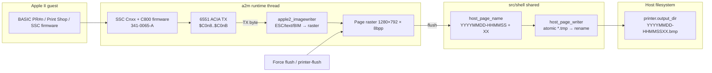
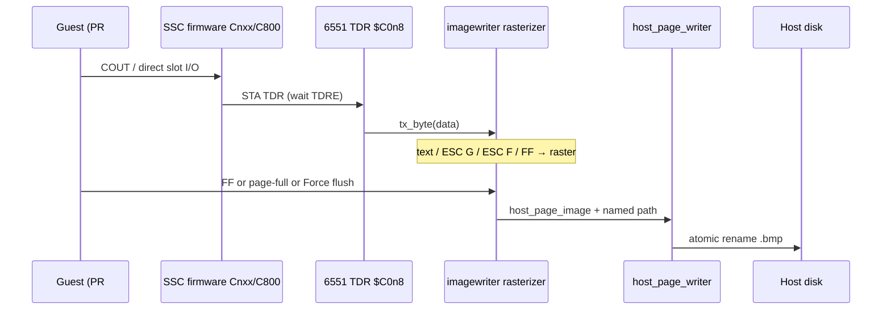

# a2m Super Serial Card + ImageWriter II → host page files (v1)

| Field | Value |
|-------|--------|
| Status | **Draft** |
| Author | swessels |
| Date | 2026-09-02 |
| Audience | a2m implementers; shell owners of shared host page I/O / naming |
| Product scope | **a2m v1** (mono ImageWriter II behind SSC); colour deferred to listed V2 PR |
| Permanent path | `design/apple2/ssc-imagewriter-host-pages.md` |
| Sibling | [`design/c64/iec-printer-host-pages.md`](../c64/iec-printer-host-pages.md) — C64 **code** is SoT where that doc diverges |

## Overview

a2m today has no serial printer path (`agents/apple2/known-gaps.md`: Disk II, SmartPort, Mockingboard only). Guests that `PR#n` through a Super Serial Card, or Print Shop’s Apple ImageWriter path, have nowhere for serial bytes to land. This design adds a soft-present **`SLOT_TYPE_SSC`** card that embeds the real **6551 ACIA + SSC firmware** (part 341-0065-A), always sinks TX into an **ImageWriter II mono rasterizer** for v1, and on flush writes **host page files** through the already-landed shell `host_page_writer` — same `YYYYMMDD-HHMMSSXX.<ext>` naming as c64m after a shared naming helper is extracted into `src/shell/`.

Presence is opt-in via **Configure → Machine** slot assignment or `[Slots] slotN = ssc`. Default layout is unchanged (no SSC). Idle cost is ≈ zero when no SSC is installed. Installing an SSC **implies** the ImageWriter II sink is on (add card ⇒ gain printer); a sink enum leaves a seam for later `none` / host-serial / modem / TCP without rewriting the card.

## Background & Motivation

### Current state

- Slot types: `EMPTY | DISKII | SMARTPORT | MOCKINGBOARD` in `src/apple2/machine/apple2.h`. Defaults: Mockingboard slot **4**, Disk II **6**, SmartPort **7** (`a2m.ini.example` `[Slots]`).
- One Mockingboard total: `app_options_set_slot_card` / `apple2_attach_mockingboard` clear any previous MB slot when a new one is placed (`agents/apple2/machine.md`).
- `$C0nX` DEVSEL is already dispatched by `softswitch_c0_read` / `softswitch_c0_write` on `slot_type[slot]` (Disk II / SmartPort / Mockingboard). **`$Cnxx` I/O SELECT today latches `$C800` only for `SLOT_TYPE_SMARTPORT`** (`softswitch_slot_io_select`); `apply_c800` then maps **RAM** underlay for the SmartPort trap. SSC needs (1) latch on SSC I/O SELECT like a real expansion-ROM card, and (2) `apply_c800` mapping the **2K `ssc_rom`** when `c800_card == ssc_slot` — SmartPort path unchanged.
- ROM embed pattern exists: `diskii_rom.c`, `smartport_rom.c` (C byte arrays under `src/apple2/machine/`). Source binary for SSC is at `roms/AppleIISSC-341-0065-A.bin` (2048 bytes, currently **untracked** `??`). Embed commit must generate the C array from that local file, **never `git add` the `.bin`**, and **remove it from the working tree** in the same commit; optional `.gitignore` for `roms/*.bin` card dumps.
- c64m already ships MPS-803 → `host_page_writer` BMP pages (`src/c64/machine/c64_printer.*`, `src/shell/util/host_page_writer.*`, Misc → Machine flush UI, `printer-flush`, hello `C64M/10`). Page **filename stem/XX** logic still lives inside `c64_printer.c` (`format_name_stem` + `last_name_stem` / `name_seq`) and must be extracted to shell so a2m does not fork naming.
- Control hello is **`A2M/15`** (`src/apple2/control/control_protocol.h`). New verbs bump the wire in the same PR.

### Pain points

1. Cannot validate Apple II software that expects SSC + ImageWriter II (BASIC listings, Print Shop cards).
2. No shared page **naming** helper yet — only the writer encode/atomic-rename path is shared.
3. Trap-only / COUT shortcuts would miss firmware-driven and app-driven ACIA traffic; v1 requires the real card path.
4. Apple firmware is not Unlicense — embedding must be documented honestly (same class of note as other card ROMs).

## Goals & Non-Goals

### Goals (v1)

1. Soft-present **one** `SLOT_TYPE_SSC` in slots 1–7 via Configure / `[Slots]` / options (default: none).
2. Full **6551 ACIA + embedded SSC firmware** (not trap-only); Cnxx + C800 + C0nX maps correct enough for `PR#n` and Print Shop.
3. Bundle: SSC installed ⇒ **ImageWriter II mono** sink always fed from ACIA TX.
4. Render text + bit-image graphics into an Apple-specific page raster; flush to host BMP via `host_page_writer`.
5. Extract shared **page filename helper** into `src/shell/`; c64m switched onto it in the same change set as the extract.
6. Force flush UI (Misc → Machine) + Paths browse for printer dir + `printer-flush` control verb; bump **A2M/15 → A2M/16**.
7. Success bars: Applesoft `PR#n` text listings **and** Print Shop (Apple) ImageWriter path.
8. Leave an explicit **sink seam** for later non-printer serial uses.
9. Last v1 landing is **docs** (`manual/a2m/manual.md`, agents notes); V2 colour PR is pre-listed here.

### Non-Goals (v1)

- Colour ImageWriter II (ribbon / ESC colour) — **V2 PR only**.
- Parallel printer cards, Grappler, Phantom slot-1 ROM tricks.
- Modem / TCP / host PTY serial sink (seam only).
- Multiple simultaneous SSCs.
- OS spoolers (CUPS/`lp`, Windows print, IPP).
- Snapshot persistence of in-flight page rasters (discard on load; optional later).
- `set-printer` / `get-printer` control verbs (Configure/INI/CLI only for dir/format).
- PNG/PDF host formats (follow c64m; BMP only until a shared encoder unlock PR).
- Perfect cycle-accurate baud pacing of TX to the rasterizer (accept bytes as they hit the ACIA TDR; optional later pace).
- ImageWriter NLQ / correspondence / downloaded custom characters (v1 is **draft** glyphs only).

## Key Decisions

| Decision | Choice | Rationale |
|----------|--------|-----------|
| Printer | **ImageWriter II**, mono v1 | Locked product intent; dominant Apple II serial printer; colour is a clean post-manual V2. |
| Card | New **`SLOT_TYPE_SSC`**, soft-present | Matches Disk II / SmartPort / Mockingboard Configure/[Slots] model; idle ≈ 0 when absent. |
| Cardinality | **One SSC** machine-wide | Mirror Mockingboard move rule; avoids dual-firmware / dual-C800 fights. |
| Same-slot conflict | Attach of SSC into a slot already holding a **different** type **fails** (`false` + `log_warn`) | **Intentional divergence** from Disk II / SmartPort / Mockingboard attach (those detach-then-clobber). All production remaps (Configure Apply, snapshot `SLOT` restore) **must `detach` before `attach_ssc`**. Cross-slot second SSC still **moves** (clears old). |
| Bundle | SSC ⇒ ImageWriter sink always on | “Add SSC ⇒ gain printer” for v1 UX; sink enum keeps modem/TCP from rewriting the card later. |
| Firmware | Real **341-0065-A** 2K ROM as C array; **delete** `.bin` after land | Firmware-driven `PR#n` / apps need Cnxx+$C800 code; trap-only rejected for v1. |
| Guest I/O | Full ACIA TX → IW rasterizer | No KERNAL/COUT shortcut; matches real hardware path Print Shop uses. |
| Host pages | Reuse `host_page_writer`; **extract naming** to shell | Same files/naming as c64m; no `#include` of `c64_printer` from Apple. |
| Presence INI | `[Slots] slotN = ssc` only | Not a C64-style `[printer] enabled`; Apple enable **is** the slot card. |
| Printer INI | `[printer] output_dir` / `format` (+ later colour keys) | Share only what makes sense; update `a2m.ini.example` in the same change as `app_options`. |
| Page canvas | **1280×792** buffer at **160 dpi** logical space | BIM: `x=(i*160+d/2)/d`. Mono text: `x=(i*8*160+d/2)/d` (same dpi `d`; cpi is a separate column). Not forced to C64 480×700. |
| Control | `printer-flush` + **A2M/16** in same PR | Match landed c64m wire discipline. |
| UI | Slot combo + Misc → Machine **flush/status only** (no soft-power) + Paths printer browse | Presence is the slot card only — do **not** copy c64m’s Misc power-LED enable toggle (second source of truth). Soft-disable = empty the slot. |
| Colour | **V2 PR after docs** | Locked; design lists it so it is not forgotten. |
| Configure Apply / cold reset | **Force-flush dirty IW before cold reset** when SSC remains installed | `runtime_thread` leaves unchanged slots attached then always `apple2_cold_reset`; without a pre-flush, mid-listing pages would vanish (unlike detach-flush). |

## Proposed Design

### Architecture





### Soft-present SSC (slot card)

**Enums / options**

- `apple2_slot_type`: add `SLOT_TYPE_SSC`.
- `app_slot_card_type`: add `APP_SLOT_CARD_SSC`; `app_slot_card_name` / `from_string` accept `ssc`.
- Track `ssc_slot` (0 = none) beside `mb_slot`.
- Runtime/debug slot enums (`RUNTIME_SLOT_CARD_*`) and Configure combo items gain “Super Serial”.

**`app_options_set_slot_card` move rule (normative)**

1. Setting `APP_SLOT_CARD_SSC` on slot N: any other slot that is SSC becomes `EMPTY`; `ssc_slot = N`.
2. Clearing the SSC slot sets `ssc_slot = 0`.
3. Does **not** auto-clear Disk II / SmartPort / Mockingboard in slot N — the slot value is simply replaced in the options array (same as today’s combo). Machine apply must detach old type before attach.

**`apple2_attach_ssc(m, slot)` (normative)**

1. Reject `slot ∉ 1..7` → `false`.
2. If `m->ssc_slot != 0 && m->ssc_slot != slot`: `apple2_detach_slot_card(m, m->ssc_slot)` (move).
3. If `m->slot_type[slot]` is neither `EMPTY` nor `SSC`: **`log_warn("ssc: slot %d busy (%s)", …)`**, return **`false`** (same-slot type conflict — caller detaches first). **Do not** mirror Mockingboard’s detach-then-clobber.
4. Else install: set `SLOT_TYPE_SSC`, reset ACIA + IW sink, map Cnxx ROM shadow (256 bytes from firmware `[0x700..0x7FF]`), set `ssc_slot`, `softswitch_apply_full_map`.
5. Detach path: flush IW if dirty (unless `replay_sealed`), tear down maps, `ssc_slot = 0`.

**Production remap invariant (hard):** Configure Apply (`runtime_thread` slot remap) and snapshot `SLOT` restore **must** `apple2_detach_slot_card` on the target slot whenever the desired type differs, **then** `apple2_attach_ssc`. Never call `attach_ssc` onto a live Disk II / SmartPort / Mockingboard. Required tests: (a) raw `attach_ssc` onto Disk II → `false` + warn; (b) Apply path Disk II → SSC succeeds; (c) snapshot restore to SSC succeeds.

**Default layout:** unchanged — no SSC until Configure or `slotN = ssc`.

**Idle cost:** when `ssc_slot == 0`, no ACIA step, no IW raster alloc required at machine init (allocate IW raster lazily on first attach or first TX). No per-cycle work.

### Bundle & sink seam

```c
typedef enum a2_ssc_sink_kind {
    A2_SSC_SINK_IMAGEWRITER = 0, /* v1: always selected when SSC attached */
    A2_SSC_SINK_NONE,            /* reserved: TX discard / loopback later */
    A2_SSC_SINK_HOST_SERIAL      /* reserved: PTY/TCP/modem later */
} a2_ssc_sink_kind;
```

v1: attach forces `sink = IMAGEWRITER` and constructs the IW instance. INI does **not** expose sink yet. Comments in code + this design mark the seam.

### SSC register map & memory (implementation notes)

Addresses use slot `s` ∈ 1..7. Let `n = 8+s` so DEVSEL base is `$C0n0` (e.g. slot 1 → `$C090`, slot 2 → `$C0A0`).

| Space | CPU range | Behavior |
|-------|-----------|----------|
| DEVSEL | `$C0n0`–`$C0nF` | Card I/O. **DIPs** at `$C0n1` / `$C0n2` (read). **6551** at `$C0n8`–`$C0nB`. Other offsets: open bus / 0 as needed. |
| I/O SELECT | `$Cn00`–`$CnFF` | Map firmware ROM window `rom[0x700 + (addr&0xFF)]` via `rom_shadow_pages[s]` (MAME/AppleWin: Cnxx = top 256 of 2K). **Must latch `$C800`:** extend `softswitch_slot_io_select` so `SLOT_TYPE_SSC` claims `c800_card` like SmartPort does today (SmartPort-only latch is insufficient). |
| I/O STROBE | `$C800`–`$CFFF` | When `c800_card == ssc_slot` and not hidden by INTCXROM / C3 overlay: map **full 2K** `ssc_rom[0..2047]` (offset = addr−0xC800) via **`apply_c800` branch** — not the SmartPort RAM/trap underlay. |
| INTCXROM / C3 | `$C007` / `$C3xx` | Existing overlay rules unchanged (`agents/apple2/machine.md`): CXROM hides slot I/O; C3 overlay does not steal the card latch; `$CFFF` drops latches. |

**6551 registers** (`$C0n8 + reg`):

| Offset | Reg | R/W | v1 notes |
|--------|-----|-----|----------|
| 0 | Data (TDR/RDR) | W: TX → sink; R: RX (empty / 0 for printer-only) | Writing TDR clears TDRE until “shifted out”; v1 may complete TX in 0–few Φ0 (instant or short countdown). |
| 1 | Status | R | Bit4 TDRE=1 when ready; bit3 RDRF=0 (no RX); bit6/5 DSR/DCD treated **ready** for printer; error bits 0; IRQ bit as commanded. Reading status clears IRQ as per 6551. |
| 2 | Command | W | Honour DTR (bit0) enable; TX IRQ bits best-effort; echo/break optional ignore. |
| 3 | Control | W | Baud/word/stop stored; **baud does not gate** raster accept in v1. External clock select ignored (force internal). |

**DIP defaults (printer bundle):** hardcoded ImageWriter-oriented SSC switches (no Configure DIP UI in v1). Firmware INIT at `$C828` uses **DIPSW1 bits 1–0** as the mode (`00` CIC / `01` SIC P8 / `10` printer-PPC / `11` SIC P8A). Classic MAME encoded mode in `0x0C` with Printer=`0x08`; that value (`0xE8`) is CIC in the actual ROM (bits 1–0 = `00`) and must **not** be used — Print Shop then treats pin-byte `$01` as the command character. Follow the firmware (and corrected MAME `0x03` / Printer=`0x02`):

| Port | Constant | Intent |
|------|----------|--------|
| `$C0n1` | **`0xE2`** | 9600 (`0xE0`) + printer/PPC (`0x02`). INIT5 stores Ctrl-I at `$05F8+s`. |
| `$C0n2` | **`0x00`** | 8 data/1 stop; printer-mode CR-delay / width bits clear |

Paste these two hex constants into `ssc.h`. Firmware smoke (PINIT then Ctrl-I `Z` CR) must leave `$05F8+s = $89` (Zap bit 7).

**IRQ (normative):** today’s `apple2_irq_pending` returns only `mockingboard_irq_pending` when `mb_slot != 0` (`apple2.c`). Extend it to **OR** SSC/6551 IRQ when an SSC is installed and the Command register enables IRQs (DTR + TX/RX IRQ bits per 6551). Status read clears the 6551 IRQ bit as specified. Unit-test: assert pending after enabling TX IRQ with empty TDR condition / clear on status read. Printer apps often poll TDRE; firmware that enables IRQ must still work.

**C800 changes (normative, PR 3 acceptance):**

1. `softswitch_slot_io_select`: for **`SLOT_TYPE_SSC`**, latch `c800_card = slot` **only if `c800_card == C800_NONE`** (same first-claimant guard as SmartPort today). Do **not** overwrite an existing latch on every `$Cnxx` access. `$CFFF` still clears both latches.
2. `apply_c800`: if latched card is SSC → `apple2_pages_map_rom(…, ssc_rom)`; if SmartPort → existing RAM/trap underlay; CXROM / C3 overlays unchanged.
3. Regression: `cxxx_map` + SmartPort trap tests stay green on SmartPort-only machines; new tests for SSC `$Cnxx` latch + `$C800` firmware fetch; multi-card case does not steal an already-held C800 latch.

### Firmware embed

- New files: `src/apple2/machine/ssc_rom.c` / `ssc_rom.h` — `const uint8_t ssc_rom[2048]` + size.
- Header comment: Apple SSC firmware part **341-0065-A**; **not Unlicense** — embedded for compatibility (honest license note).
- Generation checklist (PR 2): convert local untracked `roms/AppleIISSC-341-0065-A.bin` → C array; **do not `git add` the `.bin`**; **delete it from the working tree** in the embed commit; optionally add `roms/*.bin` (or the SSC name) to `.gitignore` so `git add roms/` cannot sneak it in. Binary is already untracked today — keep it that way.
- Tests: size == 2048; optional checksum smoke; Cnxx fetch returns `ssc_rom[0x700 + off]`.

### ImageWriter II protocol subset (mono v1)

Oracle: Apple *ImageWriter II Technical Reference* / Owner’s Guide. Reimplement; do not vendor GPL emulator printer cores.

**Page geometry (chosen)**

```c
enum {
    A2_IW_WIDTH_DOTS = 1280,  /* buffer always 160 dpi × 8" (Table 8-2 max) */
    A2_IW_HEIGHT_DOTS = 792,  /* 11" × 72 dpi vertical pin pitch */
    A2_IW_REF_DPI = 160,
    A2_IW_PAGE_CAP = 500,
    A2_IW_PATH_MAX = 1024
};
```

| Property | v1 rule |
|----------|---------|
| Raster | 8bpp grayscale; ink=0, paper=255 (same convention as `c64_printer` / `host_page_image`) |
| Coordinate space | Buffer is **always 160 dpi**. Lower IW densities do **not** shrink the canvas. |
| Horizontal density map (sole normative placer) | Current density `d` dpi (from pitch command). BIM column index `i` → buffer **`x = (i * 160 + d/2) / d`** (integer round-half-up; equivalent to `round(i * 160.0 / d)` without `libm`). Clip to `0..1279`. **Do not** advance with a constant Δx — that drifts (e.g. ESC `n` at i=3: absolute x=7, not 6). Bresenham that matches absolute x at every `i` is also OK. |
| Max `nnnn` per density | Clamp/accept per Table 8-2 (`ESC n` 576 … `ESC P` 1280). Excess columns clip; log once at debug. |
| Default character pitch | Pica **ESC N** (10 cpi / **d = 80**). Monospaced text uses the **same density `d` as BIM**, not a separate cpi divisor: character index `i` starts at **`x = (i * 8 * 160 + d/2) / d`** (8 native IW dots/cell → `d ≈ 8·cpi`). Clip; draw the 7×8 glyph **left-aligned**. Equivalently `(i * 160 + cpi/2) / cpi` only when `d = 8·cpi` exactly — **do not** feed the dpi column into a cpi-only formula (Extended is **9 cpi / d=72**, not cpi=72). |
| Glyphs (draft only) | Fixed **7×8** draft bitmap (7 printable columns + 1 gap, or 8×8 with rightmost clear) in a self-contained table under `imagewriter` — **hand-built or extracted from a named public-domain / Unlicense font**, never from proprietary Apple/IW ROM dumps or GPL emulator sources. **NLQ / correspondence qualities are non-goals for v1.** Proportional `ESC p`/`P` **text** metrics are best-effort / density-only if full proportional character widths stay out of v1 (those cmds still set BIM **dpi** `d`). |
| Default line feed | **6 LPI** ≡ **`ESC A`** ≡ **`ESC T24`** → advance **12** buffer dots per LF (`mm/144` inch with mm=24 → 24/144 = 1/6″; at 72 dpi vertical = 12 dots) |
| Bit-image row | After `ESC G`/`ESC S`/`ESC g` data: return to text mode; **no automatic Y advance**. Guest (or DIP auto-LF) must send **CR/LF**; Print Shop pairs rows with **`ESC T16`** (8/72″ = 8 dots) between BIM rows for gapless 8-pin bands. |
| Colour | Ignore colour ESC / ribbon selects in v1 (treat as black); V2 implements |

**Unit-test table (required in PR 4):** assert **dpi `d`** (BIM / `ESC F`) and **cpi** separately. BIM placer: `x = (i * 160 + d/2) / d`. Text placer (mono): `x = (i * 8 * 160 + d/2) / d`. Δx column is **BIM i=0→1 only**. Absolute BIM x asserts at **`i ∈ {0, 1, 3, mid, maxn−1}`** for at least **ESC `n`** and **ESC `P`**. Also assert text x(0), x(1), x(2) for ESC `n` (9 cpi) and ESC `e` (13.4) so nobody mistakes dpi for cpi.

| Pitch cmd | dpi `d` (BIM) | cpi (mono text) | Max nnnn | BIM Δx i=0→1 only | Notes |
|-----------|---------------|-----------------|----------|-------------------|--------|
| ESC `n` | **72** | **9** | 576 | 2 | BIM x(3)=**7**; text x(i)=`(i*8*160+36)/72` (= 8·BIM step) |
| ESC `N` | **80** | **10** | 640 | 2 | Default; text x(i)=`i*16` |
| ESC `E` | **96** | **12** | 768 | 2 | |
| ESC `e` | **107** | **13.4** | 856 | 1 | Use **`d=107`** in text formula — do **not** integerize cpi to 13 |
| ESC `q` | **120** | **15** | 960 | 1 | |
| ESC `Q` | **136** | **17** | 1088 | 1 | |
| ESC `p` | **144** | n/a (proportional) | 1152 | 1 | Sets BIM dens; proportional text best-effort |
| ESC `P` | **160** | n/a (proportional) | 1280 | 1 | BIM x(i)=`i`; include in absolute BIM suite |

**Controls required for success bars**

| Code | Function | v1 |
|------|----------|----|
| CR `$0D` | Carriage return | Required; X→0; if DIP/firmware LF-after-CR feeds an LF into the sink, honour it |
| LF `$0A` | Line feed | Required; advance Y by **current LF pitch** (from `ESC T` / `ESC A` / `ESC B`), **not** by BIM row height |
| FF `$0C` | Form feed | **Flush** if dirty; new page |
| BS `$08` | Backspace | Best-effort: move to start of previous character via absolute text placer (`i−1`), not a fixed cell width |
| ESC `N`/`E`/`e`/`q`/`Q`/`n`/`p`/`P` | Pitch / density | Required; sets BIM **dpi `d`** (and mono **cpi** from the split table — never treat dpi as cpi). Text uses `(i*8*160+d/2)/d`. |
| **ESC `T` mm** | Line spacing = `mm/144` inch | **Required** (Print Shop). `mm` = two ASCII digits (leading spaces allowed). `ESC T16` = 8 dots @ 72 dpi vertical — smoke must cover this between BIM rows |
| **ESC `A`** | 6 LPI (no parameter) | Required; same as `ESC T24` |
| **ESC `B`** | 8 LPI (no parameter) | Required; same as `ESC T18` |
| ESC `G` nnnn / ESC `S` nnnn | Bit-image: next **nnnn** column bytes | **Required** (Print Shop); **no** implicit Y advance after data |
| ESC `g` nnn | Bit-image: next **nnn×8** bytes | Required when Print Shop uses it; implement as soon as smoke needs it |
| ESC `V` nnnn + byte | Repeat column | Required for Print Shop compactness |
| ESC `F` nnnn | Absolute dot-column at current density | Map to buffer x via density formula; clip |
| ESC `c` / reset | Printer reset | Flush if dirty; clear modes to power-on defaults |
| ESC `!` / `"` bold; ESC `X`/`Y` underline | Text attributes | Best-effort; skip if time-boxed after BIM works |
| Colour selects | ESC colour / ribbon | **Ignore** (mono); V2 |

BIM bit order (manual): **bit 0 = top pin, bit 7 = bottom** of the 8-wire bank.

**Digit fields:** `nnnn` / `nnn` / `mm` are fixed-width ASCII decimal; **leading zeros may be spaces** (`' '`). Parsers accept `'0'..'9'` and leading `' '`; any other byte **aborts** the ESC sequence (ignore-with-debug, return to `IDLE`).

Parser states: `IDLE`, `ESC`, `ESC_T_D1`, `ESC_T_D2`, `ESC_G_DIGITS` (space-tolerant), `BIM_DATA`, `ESC_V_*`, `ESC_F_*`, `ESC_g_*`, …

### Flush policy (Apple-specific)

There is **no IEC CLOSE**. Normative triggers:

| Trigger | Dirty page | Notes |
|---------|------------|-------|
| Page-full (`cursor_y + advance > height`) | **Write**, then y=0, continue | Same spirit as c64m |
| Force flush (Misc → Machine / `printer-flush`) | **Write if dirty**; **suppress blank** | Identical UX intent to c64m |
| ImageWriter FF (`$0C`) | **Write if dirty** | Primary in-band page break |
| ImageWriter reset (ESC reset) | **Write if dirty**, then clear modes | |
| SSC detach / slot clear / disable | **Write if dirty** | |
| Emulator shutdown | **Write if dirty** | |
| `PR#0` (output back to screen) | **No write** | Page stays dirty until FF / force / detach / page-full |
| Warm reset (CPU only, card remains) | **Discard** (clear, no host write) | Match c64m `c64_printer_reset` |
| Configure Apply / cold reset with SSC **still installed** | **Force-flush if dirty** (unless `replay_sealed`), **then** cold reset | Verified: `runtime_thread` skips detach when slot type unchanged, then always `apple2_cold_reset` — without pre-flush, mid-listing pages vanish. Soft-reset alone (no Apply) still discards |
| SSC type change / detach during Apply | **Flush on detach** (existing detach path) | Unchanged slots that stay SSC use the pre-cold-reset flush above |
| Session page cap | **500** writes / attach session; then log + skip (clear dirty to avoid wedging) | Same as c64m |
| I/O failure | Set **`flush_hold`**; refuse further raster mutation until a flush succeeds | Same as c64m |
| `replay_sealed` | **No host writes**; TX bytes may update a throwaway/no-op path or skip IW mutate | Mirror c64m CHROUT/CLOSE guards |

### Shared vs Apple-local

| Component | Location | Shared? |
|-----------|----------|---------|
| `host_page_writer` BMP encode + `*.tmp` rename | `src/shell/util/host_page_writer.*` | **Yes** (already landed) |
| Page filename stem + XX helper | `src/shell/util/host_page_name.*` (new) | **Yes** — used by c64m + a2m |
| MPS-803 / IEC traps | `src/c64/` | C64 only |
| SSC + 6551 + firmware | `src/apple2/machine/` | Apple only |
| ImageWriter rasterizer | `src/apple2/machine/` (e.g. `imagewriter.c`) | Apple only |
| `[printer] output_dir/format` keys | Product `app_options` | Parallel keys; not a shared struct |
| Misc → Machine flush chrome | Product frontend | Shape mirrored; code stays product-local |
| Control `printer-flush` | Product verb tables | Same verb spelling; separate hello identity |

**Rule:** Apple must not `#include "c64_printer.h"`. C64 must not `#include` SSC/IW headers.

### Shared naming helper (extract)

Today in `c64_printer.c`: `format_name_stem`, `last_name_stem[16]`, `name_seq`, path `snprintf("%s/%s%02u.bmp", …)`.

Frozen shell API (normative):

```c
/* host_page_name.h */
typedef struct host_page_name_state {
    char last_stem[16]; /* "YYYYMMDD-HHMMSS" or empty */
    uint8_t seq;        /* 0..99 last used XX for last_stem */
} host_page_name_state;

/* Fills stem[16] with YYYYMMDD-HHMMSS. false on clock failure.
 * Public for tests; production flush path goes through build_path. */
bool host_page_name_stem_now(char stem[16]);

/*
 * Obtains "now" via stem_now internally (caller does not pass a stem).
 * Builds path as snprintf("%s/%s%02u.%s", dir, stem, xx, ext)
 * — XX is zero-padded 00..99 concatenated to the stem (c64m bit-identical).
 * ext is WITHOUT a dot, e.g. "bmp" → file ends in ".bmp".
 * Does NOT mutate st; on success fills out_stem/out_xx for a later commit.
 * Returns false on clock failure, seq exhaustion (would exceed 99), or snprintf fail.
 */
bool host_page_name_build_path(
    const host_page_name_state *st,
    const char *dir,
    const char *ext,           /* "bmp" — no leading dot */
    char *path, size_t path_sz,
    char out_stem[16],
    uint8_t *out_xx);

/* Call ONLY after host_page_writer_write succeeds. */
void host_page_name_commit(
    host_page_name_state *st,
    const char stem[16],
    uint8_t xx);
```

**Contract:** shell tests land **before** switching `c64_printer.c`, using vectors copied from current c64 naming (`YYYYMMDD-HHMMSS` + `%02u` + `.bmp`). Extract PR must keep bit-identical paths for existing smokes.

### Configuration surfaces

**INI (`a2m.ini.example`) — same change as `app_options` keys:**

```ini
[Slots]
; empty | diskii | smartport | mockingboard | ssc
; One Super Serial Card total (placing a second clears the old slot).
; slot1 = ssc
slot1 = empty
…

[printer]
; Used when an SSC is installed. Presence is [Slots] slotN = ssc (not enabled=).
; CLI: --printer-dir <path>, --printer-format bmp
; output_dir = prints
; format = bmp
```

**CLI**

| Flag | Meaning |
|------|---------|
| *(slot)* | Existing slot mechanisms / INI only for installing SSC (no `--ssc` required if Configure/INI suffice; optional `--slot N=ssc` only if such a generic flag already exists — do not invent a second enable path) |
| `--printer-dir <path>` | Output directory (create if missing); relative via `app_options_path_absolute_from_ini` |
| `--printer-format bmp` | v1 only; reject unknown |

**`app_options` fields**

```c
char *printer_output_dir; /* default "prints" */
char *printer_format;     /* "bmp" */
/* presence: slot_cards[i] == APP_SLOT_CARD_SSC / ssc_slot */
```

Bump `APP_BROWSE_DIR_COUNT` **6→7** and `FRONTEND_BROWSE_SLOT_PRINTER` for Paths tab (c64m pattern).

### UI

| Surface | Behavior |
|---------|----------|
| **Configure → Machine** | Slot combo adds **Super Serial**; one-SSC move clears the previous slot’s combo to Empty (via `app_options_set_slot_card`). Apply uses existing power-cycle card map path. |
| **Configure → Paths** | Printer output dir browse/remember (`FRONTEND_BROWSE_SLOT_PRINTER`). |
| **Misc → Machine** | When SSC present: **`[n]` Force flush** button, label **“ImageWriter II”**, `Pages N`, status Dirty/Clean/Flush-flash. **No soft-power / enable toggle** — that would fork presence away from `[Slots]`. Optional LED is **present/absent only** (SSC installed), never a click-to-disable control. Soft-disable = set slot Empty in Configure (detach flushes). Chrome layout may echo c64m’s row geometry, but **omit** the power-LED enable behavior in `frontend_draw_misc_machine`’s printer block. |
| Misc → Hardware | Unchanged (debug). |

Force flush must work while the emulator is **running** (runtime command), not only when paused.

### Control port

- Verb: `printer-flush` (no args).
- Advertise in capabilities; bump `#define CONTROL_PROTOCOL_VERSION "A2M/16"` in the **same** PR.
- Update `agents/apple2/control-tools.md`, Python client hello expectations, manual remote-control section in the docs PR (or same PR if small).

### Machine / runtime module sketch

New / touched (illustrative):

| File | Role |
|------|------|
| `src/apple2/machine/ssc_rom.c/.h` | Embedded 2K firmware |
| `src/apple2/machine/ssc.c/.h` | Card state, 6551, DIP reads, TX→sink |
| `src/apple2/machine/acia6551.c/.h` | Optional split if clearer |
| `src/apple2/machine/imagewriter.c/.h` | ESC parser + raster + flush |
| `src/apple2/machine/apple2.h/.c` | `SLOT_TYPE_SSC`, attach/detach, bus dispatch |
| `src/apple2/machine/softswitch.c` | `$C0nX` SSC case; C800 ROM map |
| `src/apple2/runtime/runtime_printer.c` | enable-dir ensure, force flush (c64 analogue) |
| `src/shell/util/host_page_name.c/.h` | Shared naming |

Embed on `apple2_t`: single SSC instance (not `[8]`), plus IW state; or `ssc` struct containing sink pointer/kind.

### Threading & performance

- ACIA + IW mutation: **runtime/machine thread only**.
- BMP encode on flush: same thread (1280×792 8bpp ≈ 1 MB; target ≪ 20 ms encode; log if slow).
- Disabled/absent SSC: no raster allocation, no per-cycle cost.
- Optional: defer encode to worker later without changing flush triggers.

### Snapshot

v1: persist **slot type SSC** in `SLOT` chunk like other cards; **do not** persist IW raster or ACIA shift state beyond registers if cheap — acceptable to reset ACIA+IW on load after re-attach. Document in `agents/apple2/snapshots.md` when landing. Host `output_dir` comes from options, not snapshot.

## API / Interface Changes

```c
/* apple2.h */
bool apple2_attach_ssc(apple2_t *m, int slot);
void apple2_imagewriter_force_flush(apple2_t *m); /* no-op if no SSC / !dirty */

/* runtime client */
bool runtime_client_printer_flush(runtime_client *client);
```

Bus: `softswitch_c0_*` gains `SLOT_TYPE_SSC` → `ssc_read/write_c0n`; `apple2_bus_*` `$Cnxx` path may need SSC ROM read only (no Mockingboard-style Cn register overlay — SSC Cnxx **is** ROM).

## Data Model Changes

- No disk-image schema changes.
- INI: `[Slots]` vocabulary + `[printer]` section; browse key `printer=`.
- Snapshot: slot type enum widening; no required PRNT chunk in v1.

## Alternatives Considered

### 1. Trap COUT / firmware entry vs full ACIA+ROM

| | Trap-only | Full SSC (chosen) |
|--|-----------|-------------------|
| BASIC `PR#n` | Possible | Native |
| Print Shop / apps talking to `$C0n8` | Miss | Hit |
| Complexity | Lower | Higher |
| Product lock | Rejected | Required |

### 2. Parallel card / Grappler vs SSC+IW II

| | Parallel | SSC+IW II (chosen) |
|--|----------|---------------------|
| Popularity for Print Shop Apple | Some titles | Dominant serial IW path |
| Firmware | Different | SSC ROM on hand |
| Locked intent | No | Yes |

### 3. Soft-attach `[printer] enabled` like C64 vs slot presence

| | C64-style enabled | Slot card (chosen) |
|--|-------------------|--------------------|
| Matches hardware mental model | Poor | Good |
| Configure surface | Extra checkbox | Existing slot UI |
| Dual source of truth risk | Higher | Presence = slot |

### 4. Shared canvas 480×700 vs Apple geometry

| | Force C64 size | Apple 1280×792 (chosen) |
|--|----------------|-------------------------|
| Print Shop Apple fidelity | Likely clip/wrong | Fits IW max width |
| Writer API | Already size-agnostic | Same |

### 5. Instant TX vs baud-paced TX

| | Baud-paced | Instant/accept-on-TDR (chosen v1) |
|--|------------|-------------------------------------|
| Authenticity | Higher | Lower |
| Print Shop throughput under emulation | Risk of guest timeouts if too slow | Safe |
| Follow-on | Optional pace flag | — |

## Security & Privacy Considerations

| Threat / issue | Severity | Mitigation |
|----------------|----------|------------|
| Path traversal via `output_dir` | Medium | Set only via Configure / INI / CLI; control port cannot change dir in v1 |
| Disk fill (FF storm) | Low–Med | Cap **500** pages / attach session |
| PII in printouts | Low | Local files only; no network sink |
| Apple firmware redistribution | Low–Med | Embed with explicit non-Unlicense note; binary not separately tracked |

## Observability

- `log_info("printer: wrote %s (%ux%u)", path, w, h);` (same shape as c64m).
- `log_warn` on blank force-flush suppress, page cap, same-slot attach conflict, BIM clip.
- `log_error` on encode/I/O failure (`flush_hold`).
- Misc → Machine: pages + dirty/clean.
- Tests: `tests/apple2/` for 6551 TDRE/TX→IW, ESC G row, FF flush, attach move/conflict; `tests/shell/` for naming helper; c64 printer tests still green after extract.

## Rollout Plan

1. Default **no SSC** — shipping code is safe until users add a slot.
2. Land incremental PRs on **master** (see PR Plan); each independently mergeable.
3. Smoke: `PR#1` listing → BMP; Print Shop ImageWriter → card art before calling graphics done.
4. Rollback: set slot empty / revert; leftover files in `prints/` only.
5. After v1 docs: mark this design **landed** in `design/README.md`; fold invariants into `agents/apple2/` + manual.
6. Then V2 colour PR.

## Risks

| Risk | Severity | Mitigation |
|------|----------|------------|
| Print Shop BIM density / ESC dialect mismatch | **High** | 1280×792 canvas; early Print Shop smoke PR; clip+log |
| SSC C800 latch fights SmartPort / CXROM | **High** | Extend `softswitch_slot_io_select` + `apply_c800`; `cxxx_map` + SmartPort trap regressions required in PR 3 |
| Firmware license / binary handling mistake | Medium | Never `git add` `.bin`; delete from tree on embed; optional gitignore; header honesty |
| Same-slot attach fail surprises callers | Medium | Document detach-before-attach invariant; tests for Apply DiskII→SSC success vs raw attach fail |
| Configure Apply drops dirty page | Medium | Pre-cold-reset force-flush when SSC remains (Issue 3) |
| Density→buffer constant-step drift | Medium | Absolute `(i*160+d/2)/d` only; multi-`i` asserts on ESC `n`/`P`; Print Shop `ESC T16` smoke |
| Instant TX breaks timing-sensitive software | Low–Med | Document; optional pace follow-on |
| Large raster hitch on flush | Low | Measure; worker later |
| Naming extract regresses c64m | Medium | Shared tests; bit-identical vectors from current c64 names |
| Colour deferred too long | Low | V2 PR pre-listed after docs |

## Open Questions

None that block v1. DIP read bytes, BIM advance, density mapping, Configure pre-flush, and glyph policy are settled above.

Implementer note (not a product fork): bold/underline may land in PR 4 or a tiny follow-up before docs — BIM + `ESC T` + FF + draft text are the gate.

## References

- `agents/README.md` — shell vs product; INI example rule
- `agents/apple2/machine.md` — slots, CXXX, Mockingboard one-card rule
- `agents/apple2/known-gaps.md` — no SSC today
- `agents/apple2/control-tools.md` — A2M/15
- `design/c64/iec-printer-host-pages.md` — sibling; **code SoT** over stale sections
- `src/c64/machine/c64_printer.{c,h}`, `src/c64/runtime/runtime_printer.c`, `src/c64/frontend/frontend.c` (Misc Machine printer block)
- `src/shell/util/host_page_writer.{c,h}`
- `src/apple2/machine/apple2.{c,h}`, `softswitch.c`, `diskii_rom.c`, `smartport_rom.c`, `app_options.c`
- `roms/AppleIISSC-341-0065-A.bin` (source; delete after embed)
- `a2m.ini.example` `[Slots]`
- ImageWriter II Technical Reference (ESC G/S/g/V/F, **ESC T mm**, ESC A/B, Table 8-2 densities)
- SSC programmer map (`$C0n8..B` 6551; Cnxx+C800 firmware)

---

## PR Plan

Incremental commits/PRs on **master**. Each is independently reviewable and mergeable. Last **v1** PR is docs; **V2 colour** follows.

### PR 1 — Shared `host_page_name` extract + design index

- **Title:** `shell: extract host_page_name helper; index a2m SSC design`
- **Files/components:** `src/shell/util/host_page_name.{c,h}`, `src/shell/CMakeLists.txt`, `tests/shell/…`, switch `c64_printer.c` to the helper, `design/README.md` (this doc **active**), `design/apple2/ssc-imagewriter-host-pages.md`
- **Dependencies:** none
- **Description:** Bit-identical naming for c64m; Apple will consume the same API. No SSC silicon yet.

### PR 2 — Embed SSC firmware + `SLOT_TYPE_SSC` attach/move

- **Title:** `a2m: embed SSC 341-0065-A ROM; add SLOT_TYPE_SSC attach (one card)`
- **Files/components:** `ssc_rom.c/.h`, remove working-tree `roms/AppleIISSC-341-0065-A.bin` (never git-add), optional `.gitignore`, `apple2.h/.c` attach/detach, `app_options` slot vocabulary + move rule, `a2m.ini.example` `[Slots]` comment, snapshot slot enum, Configure combo wiring (can be stub apply), tests for move + same-slot conflict `log_warn` + Apply DiskII→SSC
- **Dependencies:** none strictly (design already indexed). May land **in parallel with PR 4** after PR 1; does not need `host_page_name`.
- **Description:** Card can be installed/removed; Cnxx ROM shadow mapped; **no** ACIA behavior yet. Conflict + move + detach-before-attach invariant tests required.

### PR 3 — 6551 ACIA + C0nX / C800 latch+ROM map

- **Title:** `a2m: SSC 6551 ACIA + C800 expansion ROM map`
- **Files/components:** `ssc.c` / `acia6551`, `softswitch.c` (`softswitch_slot_io_select` SSC latch **iff `C800_NONE`**, `apply_c800` ROM branch, DEVSEL), `apple2_irq_pending` OR, DIP **`$C0n1=0xE2` / `$C0n2=0x00`**, unit tests TDRE/TX/status/IRQ, `cxxx_map` + SmartPort trap regressions
- **Dependencies:** PR 2
- **Description:** Firmware runs and polls ACIA; `$Cnxx` latches only as first claimant; `$C800` reads `ssc_rom`. TX → null sink until PR 5. Acceptance: SmartPort-only machines green; SSC C800 fetch works; CXROM/C3 rules unchanged; DIP smoke boots printer mode.

### PR 4 — ImageWriter II mono rasterizer (text + BIM)

- **Title:** `a2m: ImageWriter II mono raster core (text+ESC G/T)`
- **Files/components:** `imagewriter.c/.h`, **hand-built/PD 7×8 draft glyphs** (NLQ out), BIM placer `(i*160+d/2)/d`, mono text placer `(i*8*160+d/2)/d`, split dpi/cpi pitch table + multi-`i` asserts, tests for CR/LF/`ESC T16`/FF, ESC G/V/F (no auto Y after BIM), space-tolerant digit parse, 1280×792 constants
- **Dependencies:** none for in-memory `putc` tests; uses writer/naming only if tests flush (then PR 1). **May parallel PR 2** after PR 1.
- **Description:** In-memory IW only. “Raster done” requires BIM + `ESC T` + draft text with absolute placement; dpi and cpi must not be conflated (ESC `n` is 72 dpi / 9 cpi).

### PR 5 — Wire SSC TX → IW + `[printer]` options

- **Title:** `a2m: SSC TX sinks to ImageWriter; [printer] dir/format`
- **Files/components:** sink seam enum, `runtime_printer`, `app_options` `[printer]`, CLI `--printer-dir`/`--printer-format`, `a2m.ini.example`, ensure_dir on attach, flush_hold/page cap, `replay_sealed` guards, **Configure Apply / cold-reset pre-flush** when SSC remains
- **Dependencies:** PR 3, PR 4 (and PR 1 for naming/writer)
- **Description:** End-to-end guest TX → BMP on FF/page-full/detach/Apply. BASIC `PR#n` smoke. Still may lack Misc flush UI.

### PR 6 — Frontend: Misc Machine flush + Paths printer browse

- **Title:** `a2m: printer Force flush UI + Paths browse slot`
- **Files/components:** `frontend.c/.h` (`FRONTEND_BROWSE_SLOT_PRINTER`, Misc Machine row **without** soft-power toggle), `APP_BROWSE_DIR_COUNT` 6→7, main/runtime status publish (pages/dirty)
- **Dependencies:** PR 5
- **Description:** Live Force flush while running; remembered printer folder; presence = slot only.

### PR 7 — `printer-flush` + hello A2M/16

- **Title:** `a2m: printer-flush control verb (A2M/16)`
- **Files/components:** `control_verbs.c`, `control_protocol.h` **A2M/15→16**, runtime client, `agents/apple2/control-tools.md`, tiny client test/notes
- **Dependencies:** PR 5 (ideally after PR 6)
- **Description:** Wire bump in the **same** change as the verb advertisement.

### PR 8 — Print Shop ImageWriter smoke / fixes

- **Title:** `a2m: Print Shop ImageWriter path smoke + BIM fixes`
- **Files/components:** `imagewriter` / SSC fixes as found; smoke checklist under `tests/apple2` or manual notes
- **Dependencies:** PR 5–7
- **Description:** Graphics success bar. May be a short series; do not call v1 graphics done until this passes.

### PR 9 — Docs / manual (last v1)

- **Title:** `a2m: document SSC + ImageWriter host pages`
- **Files/components:** `manual/a2m/manual.md`, `HELP_MARKDOWN.md` regen if needed, `agents/apple2/machine.md`, `known-gaps.md`, `control-tools.md` (A2M/16), `status.md`, `snapshots.md` as needed, `design/README.md` → **landed**, fold durable rules
- **Dependencies:** PR 8 (feature complete)
- **Description:** **Last v1 PR.** User-facing how-to: add SSC in Configure, `prints/` output, Force flush (no Misc soft-power), `printer-flush`.

### PR 10 — V2 colour ImageWriter II

- **Title:** `a2m: ImageWriter II colour ribbon / ESC colour (V2)`
- **Files/components:** `imagewriter` colour state, raster (palette or RGB page encode path), `[printer]` colour-related keys, manual delta, tests
- **Dependencies:** PR 9 (post-manual V2 as locked)
- **Description:** Explicit follow-on after v1 docs. Mono path remains default; colour opt-in via keys or auto when ESC colour appears (decide in V2 design delta if needed).
