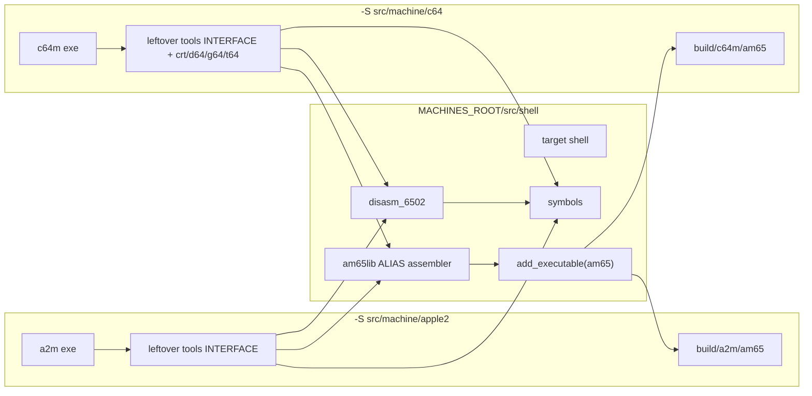
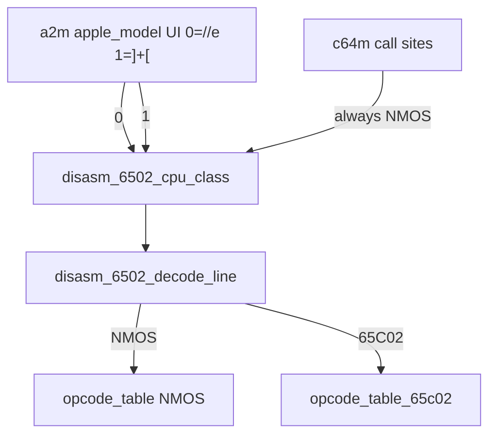

# Stage 3 — Assembler and disasm tables

| Field | Value |
|-------|-------|
| **Author** | Grok (Designer) |
| **Date** | 2026-08-27 |
| **Status** | Accepted |
| **Canonical path** | [`design/assembler-disasm.md`](assembler-disasm.md) |
| **Stage map** | [`design/merge-stage-map.md`](merge-stage-map.md) Stage 3 (EXTRACT + small UNIFY) |
| **Depends on** | Stage 2 exit ([`design/shell-extract-platform.md`](shell-extract-platform.md)) |

This is the detailed design for Stage 3. It does not reopen the stage map. Key Decisions 6 and 7, the Stage 3 in-scope/out-of-scope lists, and the standing invariants (CPU cores stay put, no ifdef in shell) are folded in as constraints.

---

## Overview

After Stage 2, both leftover `project()` trees still vendor a second copy of the 6502 assembler (`src/tools/am65/`, 37 files), the NMOS-only disasm table (`src/tools/disasm_6502/`), and the symbol table (`src/tools/symbols/`). Those copies are byte-identical today and radioactive: any edit in one tree forks the other.

Stage 3 EXTRACT lifts the three identical trees into `src/shell/tools/`, deletes both machine-tree copies in the same change, and leaves silicon, `runtime_thread`, Inspector, control, and `frontend.c` chrome where they are. Each leftover `project()` already `add_subdirectory`s `src/shell` via `MACHINES_ROOT`; the named tool targets (`am65lib` / ALIAS `assembler`, `disasm_6502`, `symbols`, CLI `am65`) are defined once under shell.

A small UNIFY then adds a **CPU class** argument to the disasm decoder (NMOS 6502 vs 65C02). Today's table is NMOS-only (`XX` for undocumented and for 65C02 extras). Apple ][+ is NMOS; Apple //e Enhanced is 65C02. C64 **always** passes NMOS. Disasm class is not execution class: `cpu65` / `c6510` stay separate translation units, and `CPU_65c02` stays off in `c6510_inln.h`.

There is still no root `project(machines)` and no flattening of `src/machine/*/src/`. One CLI name: `am65`. Do not keep `c64masm`.

---

## Background & Motivation

### Entry verification (2026-08-27)

```bash
diff -rq src/machine/apple2/src/tools/am65 src/machine/c64/src/tools/am65
diff -rq src/machine/apple2/src/tools/disasm_6502 src/machine/c64/src/tools/disasm_6502
diff -rq src/machine/apple2/src/tools/symbols src/machine/c64/src/tools/symbols
```

All three exit 0. If they had differed, this stage would stop and pick a winner *before* extract. They did not.

### Current state (Stage 2)

```text
machines/
  src/shell/                    # util / platform / nuklear. No tools/ yet.
  src/machine/apple2/           # project(a2m)
    src/tools/am65/             # 37 files, add_executable(am65), ALIAS assembler
    src/tools/disasm_6502/
    src/tools/symbols/
    tests/tools/test_disasm_6502.c
    tests/fixtures/am65_*.asm   # CLI fixtures
  src/machine/c64/              # project(c64m)
    src/tools/am65/             # identical
    src/tools/disasm_6502/      # identical
    src/tools/symbols/          # identical
    src/tools/{crt,d64,g64,t64}/  # STAY — machine format parsers
    tests/tools/test_disasm_6502.c  # identical to a2m
```

Both products already `add_executable(am65 main.c)` with `assembler` as an ALIAS to `am65lib`. c64m `build/` may still contain a leftover `c64masm` binary from an older name; current CMake does not emit it.

`disasm_6502_decode_line(addr, bytes, length, symbols)` has no CPU class. `opcode_table[256]` is NMOS documented ops only; everything else is `XX` (mnemonic NULL, length 1, rendered `.BYTE $xx`).

a2m execution can be 65C02 (`apple2_install_roms_for_model` sets `cpu.cpu.class = CPU_65c02` for //e Enhanced; `cpu65.h` already lists `OP_65c02`). The view does not decode those extras. C64 `c6510_init` sets `CPU_6502` and must stay that way.

### Pain points

- Two 37-file am65 trees. Map Key Decision 7: one in-tree copy after Stage 3; not a merge-blocking hub.
- Disasm pane on //e Enhanced shows `.BYTE $80` for `BRA`.
- Agents will edit the wrong copy (am65-again) the moment anyone touches an assembler bug.

### What this stage is not

Unifying `cpu65.c` / `c6510.c`, turning on `CPU_65c02` in C64 execution, a plugin ISA / Z80 table / `uint32_t` addresses, extracting `d64`/`g64`/`t64`/`crt`, flattening `src/machine/*/src/`, root `project(machines)` with two `add_executable`s, editing Inspector / control / leftover Assembler-tab chrome, leftover C64 aliases, or fixing `history_control_integration`.

---

## Goals & Non-Goals

### Goals

1. Exactly one source tree `src/shell/tools/am65/`. Same for `disasm_6502/` and `symbols/`. Machine trees no longer contain a second copy.
2. One `am65` CLI **definition** in shell. Both `-S` trees may still produce `build/*/am65` (two leftover CMake invocations). No `c64masm`.
3. Both nested `project()` files link the shell tool targets and **delete their copies in the same change**.
4. `disasm_6502_decode_line` (and the table helpers it shares) take a CPU class. NMOS tests still pass. A new 65C02 **decode** test exists. C64 still passes NMOS `disasm_6502`.
5. Apple leftover call sites pass class from model (][+ = NMOS, //e = 65C02). C64 leftover call sites always pass NMOS.
6. `git grep` under `src/machine/` does not find a second `src/tools/am65` tree (includes of headers from shell are fine).
7. ctest: a2m all previous tests still pass (new 65C02 decode test may add one); c64m 69 pass + 10 SKIP + the same `history_control_integration` fail. Both `--help` still run.
8. `src/shell` has no `#ifdef APPLE2`, no `"a2m"` / `"c64m"` literals, and does not include `cpu65.h` / `c6510.h`.

### Non-goals

- Merging `cpu65` and `c6510`. Enabling 65C02 **execution** on C64. Changing `cpu65.c` opcode dispatch.
- Rockwell bit ops (`RMB`/`SMB`/`BBR`/`BBS`) or WDC `WAI`/`STP` as a third/fourth disasm class. Those remain assembler **profiles** (`ASM_CPU_ROCKWELL` / `ASM_CPU_WDC`). The 65C02 decode class is the CMOS extras already named `OP_65c02` in leftover `cpu65.h`.
- Extracting leftover assembler *unit* tests that already differ (`test_assembler_*.c` use product temp-file helpers). They stay in leftover trees and keep linking `assembler`.
- Registering a2m-only assembler tests (`assembler_65c02`, `assembler_multifile`, `assembler_search`, `am65_cli_*`) on c64m, or c64m-only `symbol_table` / `assembler_opcode_matrix` on a2m.
- Moving `disasm_pc_lock.c` / `debugger_disasm.c` / the disasm pane (Stage 8).
- c64m format parsers (`d64`, `g64`, `t64`, `crt`).
- Folding `am65lib` object files into `libshell.a` (named targets already exist; leftover runtime links `assembler` / `symbols` by name).

---

## Proposed Design

### Target layout after Stage 3

```text
machines/
  Makefile                          # still two -S trees
  src/
    shell/
      CMakeLists.txt                # existing shell + add_subdirectory(tools/*)
      util/ platform/ frontend/     # unchanged from Stage 2
      tools/
        am65/                       # MOVE: 37 files + existing CMakeLists
        disasm_6502/                # MOVE + CPU class on the decoder
        symbols/                    # MOVE
      tests/
        tools/
          test_disasm_6502.c        # MOVE (identical NMOS test)
          test_disasm_6502_65c02.c  # NEW
    machine/
      apple2/
        src/tools/CMakeLists.txt    # INTERFACE only; no am65/disasm/symbols dirs
        tests/tools/test_assembler_*.c   # STAY (differ from c64m)
        tests/fixtures/am65_*.asm        # STAY (CLI fixtures, a2m gate)
      c64/
        src/tools/CMakeLists.txt    # crt/d64/g64/t64 + INTERFACE to shell tools
        src/tools/{crt,d64,g64,t64}/     # STAY
        tests/tools/test_assembler_*.c   # STAY
        tests/tools/test_symbol_table.c  # STAY
```



Each CMake invocation is still independent. `build/a2m/_shell` and `build/c64m/_shell` each compile the tools once for that tree. That is required: we must not `add_subdirectory` both nested `project()` files into one parent.

### File-by-file: MOVE

Winner is either copy (byte-identical). Prefer `git mv` of the apple2 tree so history follows; delete the c64 copies in the same change.

#### `src/shell/tools/am65/`

Every file currently under `{apple2,c64}/src/tools/am65/` (37 entries: `asm.c`/`asm.h`/`asm_common.h`/`asm_lib.h`/`CMakeLists.txt`/`define.*`/`dynarray.*`/`emit.*`/`err.*`/`errorlog.*`/`expr.*`/`file.*`/`gperf.c`/`gperf.gperf`/`gperf.h`/`LICENSE`/`main.c`/`opcode.*`/`parse.*`/`README.md`/`scope.*`/`segment.*`/`symbol.*`/`token.*`).

Keep the existing `CMakeLists.txt` body:

```cmake
add_library(am65lib STATIC …)
target_include_directories(am65lib PUBLIC ${CMAKE_CURRENT_SOURCE_DIR})
add_library(assembler ALIAS am65lib)
add_executable(am65 main.c)
target_link_libraries(am65 PRIVATE am65lib)
set_target_properties(am65 PROPERTIES
    RUNTIME_OUTPUT_DIRECTORY "${CMAKE_BINARY_DIR}")
```

Do not rename the executable. Do not add a second `c64masm` target.

#### `src/shell/tools/disasm_6502/`

| Current | Destination |
|---------|-------------|
| `{apple2,c64}/src/tools/disasm_6502/disasm_6502.c` | `src/shell/tools/disasm_6502/disasm_6502.c` |
| `{apple2,c64}/src/tools/disasm_6502/disasm_6502.h` | `src/shell/tools/disasm_6502/disasm_6502.h` |
| `{apple2,c64}/src/tools/disasm_6502/CMakeLists.txt` | `src/shell/tools/disasm_6502/CMakeLists.txt` |

UNIFY (PR 3.2, after the mechanical lift) edits the extracted `.c`/`.h` only. Do not UNIFY in one leftover tree before the other copy is gone.

#### `src/shell/tools/symbols/`

| Current | Destination |
|---------|-------------|
| `{apple2,c64}/src/tools/symbols/symbol_file.c` | `src/shell/tools/symbols/symbol_file.c` |
| `{apple2,c64}/src/tools/symbols/symbol_table.c` | `src/shell/tools/symbols/symbol_table.c` |
| `{apple2,c64}/src/tools/symbols/symbol_table.h` | `src/shell/tools/symbols/symbol_table.h` |
| `{apple2,c64}/src/tools/symbols/CMakeLists.txt` | `src/shell/tools/symbols/CMakeLists.txt` |

Existing `symbols` CMake already `PUBLIC` links `disasm_6502` and `PRIVATE` links `stb_ds`. Unchanged.

#### Tests that move with the twins

| Current | Destination | Who still `add_test`s it |
|---------|-------------|--------------------------|
| `{apple2,c64}/tests/tools/test_disasm_6502.c` (identical) | `src/shell/tests/tools/test_disasm_6502.c` | **both** (already on both gates) |
| — | `src/shell/tests/tools/test_disasm_6502_65c02.c` (new) | **a2m only** |

Assembler unit tests (`test_assembler_expressions.c`, …) **differ** between leftover trees (product temp-file helpers, a2m-only 65C02/multifile/search, c64m-only opcode matrix). They stay. CLI fixtures stay under `src/machine/apple2/tests/fixtures/`. `am65_cli_*` stay registered on a2m only (map: run once).

### File-by-file: STAY

| Path | Why |
|------|-----|
| `src/machine/c64/src/tools/{crt,d64,g64,t64}/` | Machine format parsers; linked only into `c64m` |
| `src/machine/apple2/src/machine/cpu65.*` / `cpu65_inln.h` | CPU core. Do not unify. Do not change `OP_65c02` dispatch. |
| `src/machine/c64/src/machine/c6510.*` / `c6510_inln.h` | CPU core. Do **not** turn on `CPU_65c02`. |
| `src/machine/{apple2,c64}/src/runtime/runtime_assembler.c` | Per-binary Assembler tab / MLI (standing PRESERVE). Engine is am65; the tab stays. |
| `src/machine/apple2/src/frontend/debugger_disasm.c` | Stage 8 chrome (keys/browse; does not call `decode_line` today) |
| `src/machine/{apple2,c64}/src/frontend/disasm_pc_lock.c` | Stage 8 pane. **Call sites** for CPU class are edited in place (see below). |
| `src/machine/{apple2,c64}/src/frontend/frontend.c` | Chrome stays. Only `disasm_6502_*` / `disasm_pc_lock_build` call sites gain a class argument. |
| Leftover assembler unit tests + a2m CLI fixtures | Not twins / a2m-only fixtures |

### CPU class (the small UNIFY)

#### Enum (shell, no silicon headers)

```c
/* src/shell/tools/disasm_6502/disasm_6502.h */
typedef enum disasm_6502_cpu_class {
    DISASM_6502_NMOS = 0,  /* documented NMOS 6502; undocumented + 65C02 extras are XX */
    DISASM_6502_65C02      /* CMOS extras named OP_65c02 in leftover cpu65.h */
} disasm_6502_cpu_class;
```

`DISASM_6502_NMOS = 0` is the default in the sense that C64 and the existing NMOS test always pass it. There is no `#ifdef` default and no wrapper that omits the argument.

Do **not** reuse leftover `CPU_6502` / `CPU_65c02` from `cpu65.h` / `c6510.h`. Those are execution-class enums inside silicon headers. Shell must not include them.

#### New addressing modes (append; existing values stay)

65C02 `(zp)` and `JMP (abs,X)` cannot be formatted with today's modes.

```c
typedef enum disasm_6502_mode {
    DISASM_MODE_IMP = 0,
    DISASM_MODE_ACC,
    DISASM_MODE_IMM,
    DISASM_MODE_ZP,
    DISASM_MODE_ZPX,
    DISASM_MODE_ZPY,
    DISASM_MODE_ABS,
    DISASM_MODE_ABSX,
    DISASM_MODE_ABSY,
    DISASM_MODE_IND,
    DISASM_MODE_INDX,
    DISASM_MODE_INDY,
    DISASM_MODE_REL,
    DISASM_MODE_ZPIND,   /* ($zp) — 65C02 */
    DISASM_MODE_ABSINDX  /* ($abs,X) — 65C02 JMP */
} disasm_6502_mode;
```

Format: ZPIND → `($%02X)`; ABSINDX → `format_absolute_operand(..., "(", addr, ",X)", ...)`. `INC`/`DEC` accumulator reuse `DISASM_MODE_ACC` (`INC A` / `DEC A`).

#### Signatures

Every table lookup takes class. Length and validity on 65C02 extras differ from NMOS `XX` (e.g. `0x80` is length 1 invalid NMOS, length 2 `BRA` on 65C02). PC-lock and "previous instruction" walks use the helpers; if they stayed NMOS-only the pane would split 65C02 ops.

```c
disasm_6502_line disasm_6502_decode_line(
    uint16_t address,
    const uint8_t *bytes,
    size_t length,
    const symbol_resolver *symbols,
    disasm_6502_cpu_class cpu);

uint8_t disasm_6502_instruction_length(uint8_t opcode, disasm_6502_cpu_class cpu);
bool disasm_6502_opcode_is_valid(uint8_t opcode, disasm_6502_cpu_class cpu);
disasm_6502_mode disasm_6502_opcode_mode(uint8_t opcode, disasm_6502_cpu_class cpu);
```

Implementation: keep today's `opcode_table[256]` as the NMOS table. Add `opcode_table_65c02[256]` equal to NMOS with the overlay below. Pick the table by `cpu`. Do not decode NMOS undocumented (`SLO`, `JAM`, …) as 65C02 or vice versa: they stay `XX` on both tables except where the CMOS extra **replaces** that opcode.

#### 65C02 overlay (CMOS extras only)

Taken from leftover `cpu65.h` `OP_65c02`. Rockwell `RMB`/`SMB`/`BBR`/`BBS` and WDC `WAI`/`STP` stay `XX` even when class is 65C02 (assembler profiles, not this decode class).

| Opcode | Mnemonic | Mode | Length |
|--------|----------|------|--------|
| `$04` | TSB | ZP | 2 |
| `$0C` | TSB | ABS | 3 |
| `$12` | ORA | ZPIND | 2 |
| `$14` | TRB | ZP | 2 |
| `$1A` | INC | ACC | 1 |
| `$1C` | TRB | ABS | 3 |
| `$32` | AND | ZPIND | 2 |
| `$34` | BIT | ZPX | 2 |
| `$3A` | DEC | ACC | 1 |
| `$3C` | BIT | ABSX | 3 |
| `$52` | EOR | ZPIND | 2 |
| `$5A` | PHY | IMP | 1 |
| `$64` | STZ | ZP | 2 |
| `$72` | ADC | ZPIND | 2 |
| `$74` | STZ | ZPX | 2 |
| `$7A` | PLY | IMP | 1 |
| `$7C` | JMP | ABSINDX | 3 |
| `$80` | BRA | REL | 2 |
| `$89` | BIT | IMM | 2 |
| `$92` | STA | ZPIND | 2 |
| `$9C` | STZ | ABS | 3 |
| `$9E` | STZ | ABSX | 3 |
| `$B2` | LDA | ZPIND | 2 |
| `$D2` | CMP | ZPIND | 2 |
| `$DA` | PHX | IMP | 1 |
| `$F2` | SBC | ZPIND | 2 |
| `$FA` | PLX | IMP | 1 |

`$02` stays `.BYTE $02` on **both** classes (existing NMOS test).

#### Who passes which class

| Call site | Class |
|-----------|--------|
| a2m leftover frontend / `disasm_pc_lock` | `debug_state->apple_model == 0` → `DISASM_6502_65C02` (//e Enhanced); `== 1` → `DISASM_6502_NMOS` (][+). This is the **UI/options** convention already on `frontend_debug_state.apple_model` (`0=//e, 1=][+`), **not** `apple2_model` (`0=][+, 1=//e`). |
| c64m leftover frontend / `disasm_pc_lock` / `runtime_thread.c` (trace) | always `DISASM_6502_NMOS` |
| `test_disasm_6502` | `DISASM_6502_NMOS` (assertions unchanged) |
| `test_disasm_6502_65c02` | both: extras `.BYTE` on NMOS, mnemonics on 65C02 |
| c64m `test_symbol_table`, `test_assembler_opcode_matrix` | `DISASM_6502_NMOS` |
| leftover `test_disasm_pc_lock` | `DISASM_6502_NMOS` (fixture is NOPs, valid on both) |

Store the class on leftover `frontend_disassembly_view_state` (a2m and c64m) so `frontend_disassembly_decode` / `frontend_disassembly_previous_address` (no `debug_state` today) still see it. Refresh from `apple_model` on the a2m path that already copies machine state; c64m sets NMOS once at init / always at the call.



Disasm class ≠ leaking 65C02 ops into C64 **execution**. c64m may *link* the 65C02 decode table (it lives in the shared `.c`) and still pass NMOS at every call site. `c6510_inln.h` is not edited.

#### Leftover `disasm_pc_lock_build`

Thread class through so DP length/validity match decode:

```c
void disasm_pc_lock_build(
    const disasm_pc_lock_cache *cache,
    const symbol_resolver *symbols,
    disasm_6502_cpu_class cpu,
    uint16_t pc,
    uint8_t rows,
    disasm_pc_lock_line *lines,
    uint16_t *out_top_address);
```

This is a leftover frontend file (Stage 8). Editing it for the class argument is in scope.

#### Leftover `frontend_disassembly_compute_target`

It `switch`es on `disasm_6502_opcode_mode`. New enum values must compile. Minimal cases (not a pane rewrite):

- `DISASM_MODE_ZPIND`: zero-page pointer at `b1`, like `INDY` without adding Y.
- `DISASM_MODE_ABSINDX`: `JMP ($addr,X)` control-flow; do **not** replicate the NMOS `$6C` page-wrap bug.
- `DISASM_MODE_REL` already covers `BRA`.

Pass `view`/`ui` CPU class into `opcode_is_valid` / `opcode_mode` here. Do not edit Inspector, control, or other chrome in the same hunks.

### Tests

**NMOS `test_disasm_6502`** (moved, both gates): same assertions as today (`LDA #$7F`, `BNE $0FFE`, `JSR Start`, `.BYTE $02`, `opcode_is_valid(0xa9)` true / `(0x02)` false). Pass `DISASM_6502_NMOS` at every call. Do not add 65C02 cases to this file.

**New `test_disasm_6502_65c02`** (a2m gate): for each overlay opcode (at least `BRA $80`, `PHX $DA`, `STZ zp $64`, `INC A $1A`, `LDA ($zp) $B2`, `JMP ($abs,X) $7C`):

- NMOS class → `.BYTE $xx` and `!disasm_6502_opcode_is_valid(op, NMOS)`
- 65C02 class → documented mnemonic/length and `disasm_6502_opcode_is_valid(op, 65C02)`

Also: `$02` is still forced-byte on 65C02; a documented NMOS op (`LDA #`) still decodes identically on both classes.

**`am65_cli_*`**: remain a2m-only, fixtures under leftover `tests/fixtures/`. Run once.

**C64 `disasm_6502`**: still registered, still NMOS, still passes.

### CMake wiring (two `-S` trees)

Stage 2 already has `MACHINES_ROOT` and `add_subdirectory(${MACHINES_ROOT}/src/shell ${CMAKE_BINARY_DIR}/_shell)` in both nested `project()` files. Stage 3 appends tool subdirs onto that same `src/shell/CMakeLists.txt`:

```cmake
# src/shell/CMakeLists.txt — after the existing add_library(shell …) block
add_subdirectory(tools/am65)
add_subdirectory(tools/disasm_6502)
add_subdirectory(tools/symbols)
```

Order: `disasm_6502` before `symbols` (`symbols` PUBLIC-links it). Nested `add_subdirectory(src/shell)` already runs **before** leftover `add_subdirectory(src/tools)`, so `assembler` / `disasm_6502` / `symbols` exist when leftover tools CMake links them.

**a2m leftover `src/tools/CMakeLists.txt`:**

```cmake
add_library(tools INTERFACE)
target_link_libraries(tools INTERFACE
    assembler
    disasm_6502
    symbols
)
```

Delete `add_subdirectory(am65|disasm_6502|symbols)`.

**c64m leftover `src/tools/CMakeLists.txt`:** keep `crt`/`d64`/`g64`/`t64`; drop the three extracted `add_subdirectory`s; keep INTERFACE links to `assembler` `disasm_6502` `symbols` plus the parsers.

Retarget both nested `test_disasm_6502` sources to `${MACHINES_ROOT}/src/shell/tests/tools/test_disasm_6502.c`. a2m additionally:

```cmake
add_executable(test_disasm_6502_65c02
    ${MACHINES_ROOT}/src/shell/tests/tools/test_disasm_6502_65c02.c)
target_compile_features(test_disasm_6502_65c02 PRIVATE c_std_99)
target_link_libraries(test_disasm_6502_65c02 PRIVATE disasm_6502)
add_test(NAME disasm_6502_65c02 COMMAND test_disasm_6502_65c02)
```

That is the +1 on a2m's 71. Do not register it on c64m (keeps the 80 registered tests; C64's NMOS `disasm_6502` is the map's C64 gate).

`src/shell/CMakeLists.txt` still has **no** `project()` and **no** `cmake_minimum_required`. Nested a2m stays 3.16; nested c64m stays 3.28.

Do not add a `src/shell/tests/CMakeLists.txt` that both trees include blindly.

---

## API / Interface Changes

- `disasm_6502_decode_line` / `_instruction_length` / `_opcode_is_valid` / `_opcode_mode` gain `disasm_6502_cpu_class cpu` as the last argument.
- `disasm_6502_mode` gains `ZPIND` and `ABSINDX`.
- Leftover `disasm_pc_lock_build` gains `cpu` after `symbols`.
- CMake target names `am65lib`, `assembler` (ALIAS), `am65`, `disasm_6502`, `symbols` are unchanged; their defining `CMakeLists.txt` moves under `src/shell/tools/`.
- No protocol bump. No INI change. No `A2M/N` / `C64M/N` change.

Include paths stay `"disasm_6502.h"` / `"asm.h"` / `"symbol_table.h"` via each target's PUBLIC include dir.

---

## Data Model Changes

None on disk. CPU class is a decode argument, not a serialized field. `runtime_cpu_snapshot` is not extended (Stage 7/8 can publish class later if chrome needs it without `apple_model`). Stage 3 leftover a2m uses the already-published `apple_model` UI byte.

---

## Alternatives Considered

### 1. Fold `am65lib` / `disasm_6502` / `symbols` into `libshell.a`

Matches the map's eventual "libshell includes am65". Leftover runtime already links `assembler` and `symbols` by name; merging would retarget every `target_link_libraries(... assembler)` and still need PUBLIC includes for `asm.h`. Named STATIC targets defined once under `src/shell/tools/` are one definition without a link-line churn. Chosen. Stage 11 may still fold.

### 2. Keep a wrapper `decode_line` without class (NMOS) plus `_ex`

Two entry points forever. Call sites would keep using the NMOS wrapper on //e. Rejected. One signature; callers pass class.

### 3. Four disasm classes matching assembler profiles (6502 / 65C02 / Rockwell / WDC)

Map decided **two** (NMOS vs 65C02). Rockwell/WDC stay assembler profiles. Rejected for this stage.

### 4. Pass leftover `CPU_65c02` from `cpu65.h` into shell

Pulls silicon headers into `src/shell`. Forbidden. Shell enum is `disasm_6502_cpu_class`.

### 5. Register `disasm_6502_65c02` on both gates

Legal (it is a decode test, not C64 execution). Would grow c64m's registered count. Map's C64 exit is "still passes `disasm_6502` on NMOS". a2m-only (chosen), matching Stage 2's "do not register tests the product did not already run" except the one new a2m test the map asks for.

---

## Security & Privacy Considerations

Unchanged. Assembler CLI still a local tool. Disasm is a view over already-fetched bytes. Control bind stays `127.0.0.1`. No new network surface.

---

## Observability

No new log pipeline. Prove is ctest + `--help` + copy greps.

Alerting: none. EXTRACT + table UNIFY.

---

## Rollout Plan

No feature flags. Lift + delete copies in the same extract change (am65-again).

1. Land this design (Draft → Accepted after map self-check).
2. PR 3.1 mechanical EXTRACT (identical trees, CMake, delete copies, retarget NMOS test).
3. PR 3.2 UNIFY CPU class (header/table, leftover call sites, new 65C02 decode test, agents note).

Each PR: both `-S` configures, both builds, both ctest gates, both `--help`.

Rollback: `git revert` of that PR. Because copies are deleted in 3.1, revert restores them.

When 3.2 lands, update [`agents/README.md`](../agents/README.md): `src/shell/tools/` is the one am65/disasm/symbols copy; leftover tools under apple2 are INTERFACE-only; c64 parsers stay. Update [`design/README.md`](README.md) to landed.

Do not start Stage 4, 5, or 6 from these PRs.

---

## Risks

| Risk | Severity | Mitigation |
|------|----------|------------|
| Second `am65/` left behind | **High** (am65-again) | Delete both leftover dirs in PR 3.1. Exit `test ! -d` / `git grep`. |
| Unifying CPU cores "because files look the same" | **High** | Forbidden. `cpu65` / `c6510` not in the MOVE list. |
| Turning on `CPU_65c02` in `c6510_inln.h` | **High** | Out of scope. C64 call sites pass NMOS only. |
| Helpers without class → PC-lock splits `BRA` | **High** | Class on all four table functions + `disasm_pc_lock_build`. |
| Decoding NMOS undocs as 65C02 | Medium | Overlay is the `OP_65c02` list only; `$02` stays `.BYTE`. |
| Using `apple2_model` (0=][+) instead of UI `apple_model` (0=//e) | Medium | Call-site comment + table in this doc. |
| `#ifdef APPLE2` in shell for class | Medium | Enum argument. C64 passes NMOS. |
| Registering CLI tests on both trees | Medium | Keep `am65_cli_*` a2m-only. |
| `add_subdirectory(am65)` in leftover tools after shell already defined the target | Medium | Drop leftover `add_subdirectory` in the same PR. |
| `c64masm` resurrected as a second name | Low | Do not add that target. |
| Test count drift | Medium vs prove | Only new `add_test` is `disasm_6502_65c02` on a2m. |

---

## Open Questions

None that block implementation. Map Key Decisions 6 and 7 and the Stage 3 in/out/exit lists are closed.

Non-blocking, do not reopen in review:

- Folding named tool targets into `libshell.a` is Stage 11 cleanup, not Stage 3.
- Stage 10 will move `src/shell/tests/` to repo-root `tests/shell/`. Not now.
- Rockwell/WDC as extra decode classes would be a later design if a product needs bit-ops in the pane.

### Self-check against Stage 3 map

| Map item | This design |
|----------|-------------|
| In: identical `am65/` + `disasm_6502` + `symbols` | Entry `diff -rq` all exit 0. |
| Move to `src/shell/tools/`; delete both copies | MOVE tables; PR 3.1. |
| One `am65` CLI; no `c64masm` | Keep `add_executable(am65)`; no second name. |
| Both nested `project()` link shell tools | Leftover INTERFACE; shell `add_subdirectory(tools/*)`. |
| CPU class on `decode_line`; NMOS vs 65C02 | Enum + overlay; helpers too (required for lengths). |
| a2m ][+ NMOS, //e 65C02; C64 always NMOS | UI `apple_model` mapping; C64 hard NMOS. |
| Disasm class ≠ C64 execution 65C02 | `c6510*` not edited. |
| `test_disasm_6502` becomes a shell test | Move source; both gates keep `add_test`. |
| New 65C02 **decode** test | `test_disasm_6502_65c02`, a2m only. |
| am65 CLI tests run once | Stay a2m-only. |
| C64 still passes NMOS disasm | Keep `disasm_6502` on c64m. |
| Out: CPU cores, Z80, plugin ISA, d64/g64/t64/crt, Stage 4–9 | STAY / Non-goals. |
| Exit: one `src/shell/tools/am65/`; grep no leftover tree | Prove. |
| Caution: no ifdef in shell | Class argument. |
| Standing: two binaries, no flatten, no root `project(machines)` | Two `-S` trees as Stage 2. |

No product fork the map did not decide.

---

## Prove

Host CMake (Stage 2 used the same). Debug. From repo root:

```bash
cmake -B build/a2m  -S src/machine/apple2  -DCMAKE_BUILD_TYPE=Debug
cmake -B build/c64m -S src/machine/c64    -DCMAKE_BUILD_TYPE=Debug
cmake --build build/a2m -j && cmake --build build/c64m -j
ctest --test-dir build/a2m  --output-on-failure
ctest --test-dir build/c64m --output-on-failure
./build/a2m/a2m --help
./build/c64m/c64m --help
```

| Gate | Required |
|------|----------|
| a2m | **72/72 passed** if `disasm_6502_65c02` is registered (was 71; all previous tests still pass). If counting before PR 3.2, 71/71. |
| c64m | **69 passed, 10 skipped, 1 failed** out of 80. Fail = `history_control_integration` (do not fix). SKIPs = the same ten asset-gated tests. Includes NMOS `disasm_6502`. |

#### Must be empty / absent (fail the stage if any hit)

```bash
# Exactly one am65 source tree.
test -d src/shell/tools/am65
test ! -d src/machine/apple2/src/tools/am65
test ! -d src/machine/c64/src/tools/am65
test ! -d src/machine/apple2/src/tools/disasm_6502
test ! -d src/machine/c64/src/tools/disasm_6502
test ! -d src/machine/apple2/src/tools/symbols
test ! -d src/machine/c64/src/tools/symbols

# Map exit: no leftover src/tools/am65 path under src/machine/
test -z "$(git grep -l 'src/tools/am65' -- src/machine || true)"

# c64 format parsers stayed.
test -d src/machine/c64/src/tools/d64
test -d src/machine/c64/src/tools/g64
test -d src/machine/c64/src/tools/t64
test -d src/machine/c64/src/tools/crt

# CPU cores untouched (paths still there; this stage must not edit them).
test -f src/machine/apple2/src/machine/cpu65.c
test -f src/machine/c64/src/machine/c6510.c

# No product ifdefs / literals in shell.
test -z "$(git grep -E '#ifdef APPLE2|#ifdef C64|"a2m"|"c64m"' -- src/shell || true)"

# No c64masm target.
test -z "$(git grep -E 'add_executable\\(c64masm|c64masm' -- '*CMakeLists.txt' src/shell || true)"
```

`git grep` with no matches may exit 1; treat empty output as pass.

#### Informational (expected hits; do not fail the stage)

```bash
# Leftover includes of shell headers are OK.
git grep -l 'disasm_6502\\.h' -- src/machine/apple2 src/machine/c64
git grep -l 'asm\\.h' -- src/machine/apple2 src/machine/c64

# One CLI per leftover build dir is OK.
test -f build/a2m/am65
test -f build/c64m/am65
```

---

## Key Decisions

Map decisions this stage obeys (not re-opened):

1. **One 6502 disasm; CPU cores stay split** (map KD 6). Disasm gains NMOS vs 65C02 class. `cpu65` / `c6510` remain separate. Z80 is not stubbed.
2. **am65 is one in-tree copy after Stage 3** (map KD 7). Delete both machine copies in the extract PR. Not a hub remote.
3. **Layout is `src/shell` vs `src/machine/{apple2,c64}`** (map KD 3). Link-into-both → shell; link-into-one → that machine directory.
4. **CLI name is `am65` only.** Do not keep `c64masm`.
5. **65C02 decode overlay is leftover `OP_65c02` CMOS extras**, not Rockwell/WDC, not NMOS undocumented.
6. **Apple class comes from UI `apple_model`** (0=//e → 65C02, 1=][+ → NMOS). C64 always NMOS.
7. **Table helpers take class too** (length/validity). Otherwise PC-lock is wrong on 65C02.
8. **Named CMake targets under `src/shell/tools/`**, not merged into `libshell.a` this stage.
9. **Test registration stays per nested CMake.** NMOS `disasm_6502` on both; new 65C02 decode test on a2m only; `am65_cli_*` on a2m only.
10. **Copies deleted in the same change as the extract.** Grain is two PRs after this design; 3.1 must not leave a second `am65/`.
11. **No machines-root `project()`, no flatten, no `cmake_minimum_required` in shell.** Inherit Stage 2.

---

## References

- [`design/merge-stage-map.md`](merge-stage-map.md) — Stage 3, standing invariants, KD 6/7, cautions
- [`design/shell-extract-platform.md`](shell-extract-platform.md) — Stage 2 CMake pattern (`MACHINES_ROOT`, `_shell`, leftover INTERFACE)
- [`design/import-revisions.md`](import-revisions.md) — ctest baseline
- [`design/README.md`](README.md) — design index
- [`agents/README.md`](../agents/README.md) — Stage 2 handoff (update when extract lands)
- Root [`Makefile`](../Makefile) — two `-S` helper
- a2m `src/machine/apple2/src/tools/am65/CMakeLists.txt` — `am65lib` + ALIAS `assembler` + `add_executable(am65)`
- a2m `src/machine/apple2/src/machine/cpu65.h` — `OP_65c02` overlay list
- a2m `src/machine/apple2/src/runtime/runtime_event.h` — `apple_model` UI convention
- c64m `src/machine/c64/src/machine/c6510.c` — `m->cpu.class = CPU_6502` at init

---

## PR Plan

Stage 3 is this design then extract. Grain is **two** independently reviewable PRs after the design. Copies of an artifact are deleted in the same PR that lifts it.

### PR 3.0 — Design (this document)

- **Title:** `docs: Stage 3 design for assembler / disasm CPU class`
- **Files:** `design/assembler-disasm.md`, `design/README.md` (index active)
- **Depends on:** Stage 2
- **Description:** Land this design. No source extract. Status Accepted after map self-check.

### PR 3.1 — Extract identical tools

- **Title:** `extract: src/shell/tools (am65, disasm_6502, symbols)`
- **Files / components:**
  - `git mv` apple2 `src/tools/{am65,disasm_6502,symbols}` → `src/shell/tools/`
  - Delete c64 copies of those three dirs
  - `src/shell/CMakeLists.txt`: `add_subdirectory` the three tool dirs
  - Leftover apple2 / c64 `src/tools/CMakeLists.txt` as above
  - Move identical `test_disasm_6502.c` to `src/shell/tests/tools/`; retarget both nested `add_executable`s
  - Delete leftover empty `am65`/`disasm_6502`/`symbols` dirs
- **Depends on:** PR 3.0
- **Description:** One source tree. API unchanged (no CPU class yet). Both ctests match Stage 2 numbers (a2m 71/71, c64m 69+10 SKIP+same fail). Both trees still build `am65` from the one definition. Do not edit `cpu65` / `c6510` / Inspector / control / `frontend.c`.

### PR 3.2 — Disasm CPU class

- **Title:** `feat: disasm_6502 CPU class (NMOS vs 65C02)`
- **Files / components:**
  - `src/shell/tools/disasm_6502/disasm_6502.h` / `.c` — enum, new modes, class on all four functions, 65C02 table
  - `src/shell/tests/tools/test_disasm_6502.c` — pass NMOS; assertions unchanged
  - New `src/shell/tests/tools/test_disasm_6502_65c02.c` + a2m `add_test`
  - Leftover call sites: a2m/c64m `disasm_pc_lock.*`, `frontend.c` decode/length/valid/mode/target, c64m `runtime_thread.c` trace, c64m `test_symbol_table.c` / `test_assembler_opcode_matrix.c`, leftover `test_disasm_pc_lock.c`
  - `agents/README.md`: one `src/shell/tools/am65`; Stage 3 done; do not start Stage 4/5/6 from that note
  - `design/README.md`: this doc **landed**
  - Root `Makefile` comment may say Stage 3
- **Depends on:** PR 3.1
- **Description:** `decode_line` takes class. NMOS tests still pass. New 65C02 decode test on a2m. C64 still NMOS. CPU cores not edited. **Stage 3 exit.**

Do not start Stage 4 (control framing), Stage 5 (command tables), or Stage 6 (forensics/help) from these PRs.
