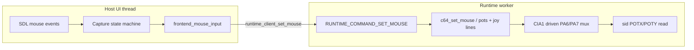
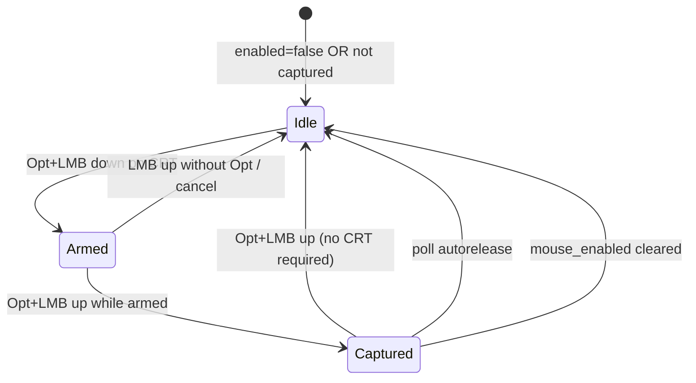

# c64m CBM 1351 mouse emulation

| Field | Value |
|-------|--------|
| Status | **active** (Phases 1–5 landed; Phase 6 quality open) |
| Author | design session |
| Date | 2026-09-01 |
| Audience | c64m implementers |
| Path | [`design/c64/cbm1351-mouse.md`](cbm1351-mouse.md) |
| Tracker | Local `TODO.txt` — `DONE CBM1351 Mouse emulation` (core); Phase 6 below |

## Overview

c64m will emulate a **Commodore 1351** in **proportional mode only**, enough for real drivers (GEOS, C64 OS, cc65 `c64-1351`, etc.). Host relative mouse motion feeds **6-bit wrapping counters** that appear in SID `$D419/$D41A` (POTX/POTY) for the mux-selected control port; left/right buttons drive CIA joystick lines (**FIRE** / **UP**). The feature is **default off**. When enabled, the user **Opt+Clicks the CRT** to enter a capture grab; while captured, the 1351 **owns** that port’s digital lines and pots (no fight with gamepad/kbdjoy on the same port).

This is a **functional pot register** model — not a MOS 5717 capacitor / SID ADC timing simulation. Paddles stay stubbed at `$FF` unless a 1351 is attached on the mux-selected port.

## Background & Motivation

### Current state

| Area | Today |
|------|--------|
| SID pots | [`sid_debug_read`](../../src/c64/machine/sid.c) returns `$FF` for `$D419/$D41A` (“not connected”). Documented in [`agents/c64/sid-audio.md`](../../agents/c64/sid-audio.md), [`agents/c64/known-gaps.md`](../../agents/c64/known-gaps.md), manual SID section. |
| CIA pot mux | CIA1 **PA6/PA7** select which control port’s pot lines reach the SID (4066). Not modeled — irrelevant while pots are always `$FF`. |
| Joystick path | Host → `sdl_c64_controller_send_ports` / kbdjoy OR → [`runtime_client_set_joystick`](../../src/c64/runtime/runtime_client.c) → `RUNTIME_COMMAND_SET_JOYSTICK` → [`c64_set_joystick`](../../src/c64/machine/c64.c) → CIA1 pull-downs (`joystick1` on PB, `joystick2` on PA). Pattern in [`frontend_joystick_input.*`](../../src/c64/frontend/frontend_joystick_input.h). |
| Inspector | Logs `C64_INPUT_EVENT_JOYSTICK` only. **No mouse event kind in v1** (YAGNI). |
| Config | `[input] keyboard_joystick_port/layout` in [`c64m.ini.example`](../../c64m.ini.example); Configure → Machine tab. |
| Snapshot | `C64_SNAPSHOT_VERSION` **14**; MACH is a fixed field stream (`write_mach` / `read_mach`) with no layout byte. |
| Frontend API | `frontend` is opaque in [`frontend.h`](../../src/c64/frontend/frontend.h). `frontend_point_in_rect` and `frontend_any_dialog_open` are **`static` in `frontend.c`**. Public cousins: `frontend_help_is_open`, `frontend_forensics_is_open`. |

### Pain points

GEOS and other mouse-aware software need proportional 1351 reads. Dual-cursor / CRT-hover delta schemes fight the debugger UI; a **capture grab** matches how host apps hand a device to the guest.

### Hardware facts (encode these)

- **1351 proportional:** MOS 5717 keeps two **6-bit wrapping** motion counters; SID samples dump them into POTX/POTY.
- **POT bit layout** (driver convention): bits **1..6** = counter, **bit0** = noise (may be 0), **bit7** = don’t-care. Drivers subtract successive samples and shift.
- **Buttons:** left = joystick **FIRE** (`0x10`), right = joystick **UP** (`0x01`) on that port’s CIA lines.
- **Mux:** CIA1 must drive PA6/PA7 as **outputs**. Port 1 pots when **driven** `(PRA & DDRA) & 0xC0 == 0x40`; port 2 when `== 0x80`. Neither or both driven → `$FF`. (`cia_peek_port_a_output` is **not** sufficient — undirected pins read as 1.)
- **Y sign:** hardware PotY increases when the mouse moves “up”; guest drivers invert for screen Y. Host mapping: see Proposed Design. Optional Y-invert INI is a **follow-up**, not v1.

## Goals & Non-Goals

### Goals (v1)

1. Functional POTX/POTY for an attached 1351 on the mux-selected port; `$FF` otherwise (paddles remain stubbed).
2. Honest CIA1 PA6/PA7 mux at pot **read** time (driven-high exclusive select).
3. Proportional mode only; left/right buttons on FIRE/UP.
4. Config/INI: enable (default **off**) + port (default **1**).
5. Capture UX: Opt+Click CRT enter / Opt+Click leave (mouse-up complete); auto-release on focus loss and modal open.
6. While enabled+captured, 1351 owns that port’s digital + pots (suppress host joystick OR into that port).
7. Fixed sensitivity; unit tests for pot encoding, mux, and button lines.

### Non-Goals (v1)

- 1350 / joystick-mouse mode (power-up right-button mode).
- Full SID ADC / capacitor / 512-cycle sample timing.
- Real paddle potentiometers.
- Dual-cursor or CRT-hover deltas without capture.
- Inspector mouse input-log event; control-port `mouse` verb.
- Blocking control-port / Inspector `joystick` writes to the mouse-owned port (accepted limitation; see Ownership).
- Configurable sensitivity / Y-invert INI (note as follow-up if GEOS feel is wrong).
- Apple mouse card / a2m product tree. Shared grab/relative helpers in `src/shell/` only where natural; C64 silicon stays in `src/c64/`.

## Key Decisions

| Decision | Choice | Rationale |
|----------|--------|-----------|
| Pot model | Functional registers, not 5717/SID ADC analog | Enough for GEOS-class drivers; matches agreed product lock |
| Mode | Proportional only | 1350 mode is a different product surface |
| Default | Off; host mouse unchanged when off or not captured | Debugger/UI keep normal cursor |
| Capture | Opt+LMB **down on CRT** arms; **up** completes enter (up may leave CRT). Leave: Opt+LMB up anywhere. Events eaten | Avoids dual-cursor; plain click keeps macOS focus + Nuklear activation |
| Auto-release | Focus loss; Help; Forensics; any dialog — polled every main-loop iteration while captured | Events alone miss “Configure opened without a mouse event” |
| Port | INI/Config selectable; **default port 1** | Matches common GEOS wiring |
| Ownership | Enabled+captured ⇒ mouse owns port digital+pots at the **SDL/kbdjoy merge** choke point | No fight with gamepad/kbdjoy. Control/Inspector joystick overwrite is accepted v1 gap |
| Mux sense | `driven = pra & ddra`; exclusive `$40` / `$80`; else `$FF` | Matches 4066 “output driven high”; avoids reset-time false select |
| Sensitivity | `CBM1351_SENS = 1`; **no per-event clamp**; wrap mod 64 | Fixed; avoid bike-shedding |
| Pot encode | **Frontend only** (`pot_from_counter`); machine stores opaque POT bytes | Single home for encoding |
| Snapshot | Version **15**; wire `pot_x[2]`, `pot_y[2]`, `mouse_port`; **force `mouse_active=false` on load** | Grab is host-only; stale pots must not appear without capture |
| Inspector / control | No mouse log event; no control verb | YAGNI |
| Paddles | Stay `$FF` unless 1351 attached on mux-selected port | Don’t pretend paddles work |
| Layering | Silicon in `src/c64/`; host grab in leftover frontend/main; shell reuse only if a tiny grab helper is obviously shared | Don’t mix Apple/C64 product trees |
| Delivery | Commits on `master` as ordered phases; docs in **last** phase only | User delivery constraint; briefly overrides “INI example in same change” until Phase 5 |

## Proposed Design

### Architecture



### Machine: pots + mux

**State on `c64_t`** (alongside `joystick1` / `joystick2`):

```c
uint8_t pot_x[2];     /* [0]=port1, [1]=port2; default 0xFF */
uint8_t pot_y[2];
uint8_t mouse_port;   /* 0=none; 1 or 2 — last port written by c64_set_mouse */
bool    mouse_active; /* host captured and contributing; else mux returns 0xFF */
```

**API** (mirror `c64_set_joystick`):

```c
/* port 1|2; potx/poty already encoded by host; buttons = C64_JOYSTICK_* (FIRE/UP). */
void c64_set_mouse(c64_t *machine, unsigned port,
                   uint8_t potx, uint8_t poty, uint8_t buttons);
```

Behavior:

1. Store `pot_x[port-1]`, `pot_y[port-1]`; set `mouse_port = port`, `mouse_active = true` (caller publishes inactive via a deactivate path — see below).
2. Update that port’s `joystick1`/`joystick2` to `buttons & 0x1f` **without** emitting `C64_INPUT_EVENT_MOUSE` (no new kind). Skip `input_event` for these digital updates in v1.
3. **Deactivate** (capture leave / disable): `c64_clear_mouse(machine)` or `c64_set_mouse` with a clear API that sets `mouse_active = false`, pots on that port to `$FF`, buttons `0`. Prefer an explicit:

```c
void c64_clear_mouse(c64_t *machine); /* mouse_active=false; pots FF; clear owned joy bits */
```

**SID pot read with mux** — install a pot provider from `c64_init` (keeps `sid_read` unit-testable with `$FF` default):

```c
/* sid.h */
typedef uint8_t (*sid_pot_read_fn)(void *user, int axis); /* 0=X, 1=Y */
void sid_set_pot_reader(sid *s, sid_pot_read_fn fn, void *user);
```

`sid_debug_read` `$D419/$D41A`: if reader set, call it; else return `$FF`.

Reader implementation — sense **driven-high** only (`PRA & DDRA`), **not** `cia_peek_port_a_output` (that forces undirected pins to 1 via `(PRA & DDRA) | ~DDRA`, so after reset both PA6/PA7 look high and would always select port 1):

```c
static uint8_t c64_sid_pot_read(void *user, int axis) {
    c64_t *m = user;
    uint8_t pra  = m->cia1.registers[CIA_REG_PORT_A]; /* or cia accessor */
    uint8_t ddra = m->cia1.registers[CIA_REG_DDRA];
    uint8_t driven = (uint8_t)(pra & ddra) & 0xC0u;
    unsigned selected = 0;

    if (driven == 0x40u) selected = 1;      /* PA6 out-high, PA7 not → port 1 */
    else if (driven == 0x80u) selected = 2; /* PA7 out-high, PA6 not → port 2 */
    /* neither or both → 0xFF */
    if (selected == 0) return 0xFFu;
    if (!m->mouse_active || m->mouse_port != selected) return 0xFFu;
    return axis == 0 ? m->pot_x[selected - 1] : m->pot_y[selected - 1];
}
```

Optional: add `cia_peek_port_a_driven(const cia *c)` returning `pra & ddra` if a helper keeps register indices out of `c64.c`.

**Unit-test mux cases (Phase 1):**

| DDRA | PRA | Selected |
|------|-----|----------|
| `$00` (reset) | anything | `$FF` (bits not driven) |
| `$C0` | `$40` | port 1 |
| `$C0` | `$80` | port 2 |
| `$C0` | `$C0` | `$FF` (both) |
| `$40` | `$40` | port 1 |
| `$40` | `$C0` | port 1 (only PA6 driven; PA7 input ignored) |
| `$80` | `$80` | port 2 |

**Encoding** — **frontend only** (machine stores opaque POT bytes):

```c
/* frontend_mouse_input.c */
static uint8_t pot_from_counter(uint8_t counter6) {
    return (uint8_t)((counter6 & 0x3fu) << 1); /* bits1..6; bit0=0; bit7=0 */
}
```

Counters live on the host; only encoded POT bytes cross the runtime boundary.

**Snapshot (Phase 1, concrete):**

- Bump `C64_SNAPSHOT_VERSION` **14 → 15**.
- Append to MACH (after existing fields): `pot_x[0], pot_x[1], pot_y[0], pot_y[1], mouse_port` (5 bytes). **Do not** serialize `mouse_active`.
- `write_mach`: write those five bytes always at v15.
- `read_mach`: if `version >= 15`, read them; else default pots `$FF`, `mouse_port = 0`.
- **Always** set `mouse_active = false` after load (host must re-capture). Stale counter bytes may sit in `pot_*` but mux returns `$FF` while inactive — or zero pots to `$FF` on load for simplicity (**prefer zero pots to `$FF` on load** so disk images don’t retain motion noise).
- In-process machine copy used by Inspector (`c64_snapshot` copy path ~`dst->joystick1 = …`): also copy `pot_*`, `mouse_port`, and **`mouse_active`** (live RAM copy, not file wire). On file load only, force inactive.

### Runtime plumbing

Mirror joystick:

| Layer | Change |
|-------|--------|
| `runtime_command.h` | `RUNTIME_COMMAND_SET_MOUSE` + `{ port, potx, poty, buttons }` and `RUNTIME_COMMAND_CLEAR_MOUSE` (or SET with a clear flag) |
| `runtime_client.h/.c` | `runtime_client_set_mouse(...)`, `runtime_client_clear_mouse(...)` |
| `runtime_thread.c` | Dispatch → `c64_set_mouse` / `c64_clear_mouse` |
| Control protocol | **No** `mouse` verb in v1 |

Publish on motion/button change and once on capture enter (seed pots). On capture leave / disable: `runtime_client_clear_mouse`.

### Host: capture + relative motion

**New leftover module** (parallel to joystick):  
`src/c64/frontend/frontend_mouse_input.{c,h}` — **pure** state machine. It does **not** call into `frontend.c` statics. Callers pass CRT hit and modal flags.

```c
typedef struct frontend_mouse_input {
    bool     enabled;       /* from Config/INI (or Phase 3 CLI) */
    unsigned port;          /* 1 or 2 */
    bool     captured;
    uint8_t  counter_x;     /* 6-bit wrap */
    uint8_t  counter_y;
    uint8_t  buttons;       /* FRONTEND_JOYSTICK_FIRE / UP */
    bool     opt_click_armed; /* Opt+LMB down seen on CRT while idle */
} frontend_mouse_input;

typedef struct frontend_mouse_ui_flags {
    bool help_open;
    bool forensics_open;
    bool any_dialog_open;
    bool focus_lost; /* edge or level: true ⇒ release this iteration */
} frontend_mouse_ui_flags;

/* CRT rect supplied by caller each event (from exported frontend getter). */
bool frontend_mouse_handle_event(
    frontend_mouse_input *mouse,
    const SDL_Event *event,
    struct nk_rect crt_display,
    const frontend_mouse_ui_flags *ui);

/* Call once per main-loop iteration while mouse->enabled (not only on events). */
bool frontend_mouse_poll_autorelease(
    frontend_mouse_input *mouse,
    const frontend_mouse_ui_flags *ui);
/* Returns true if capture was released (caller should clear_mouse + ungrip). */
```

**Phase 3 frontend.h exports** (needed because `frontend` is opaque and today’s helpers are `static`):

```c
bool frontend_display_contains(const frontend *ui, float x, float y);
bool frontend_any_dialog_open(const frontend *ui); /* promote existing static */
struct nk_rect frontend_display_rect(const frontend *ui); /* for CRT hit-test */
```

`main.c` builds `frontend_mouse_ui_flags` from `frontend_help_is_open`, `frontend_forensics_is_open`, `frontend_any_dialog_open`, and `SDL_WINDOWEVENT_FOCUS_LOST`, then calls `frontend_mouse_poll_autorelease` every iteration and `frontend_mouse_handle_event` in the poll loop **before** `frontend_handle_event` when the mouse consumes the event.

**Opt modifier for mouse chords:** do **not** use `frontend_input_has_option_modifier` (it takes `SDL_KeyboardEvent *`). Use:

```c
bool opt_down = (SDL_GetModState() & KMOD_ALT) != 0;
```

Optionally add `frontend_input_option_modifier_down(void)` next to the keyboard helper as a one-liner choke point — nice but not required.

**Sensitivity (fixed, locked):**

- `CBM1351_SENS = 1` (1 host pixel → 1 counter tick).
- **No per-event clamp.** Apply `counter = (counter + delta) & 63` (large `|rel|` may wrap more than once in one event; acceptable for v1).

**Axis map (v1):**

- `counter_x = (counter_x + xrel * CBM1351_SENS) & 63`
- `counter_y = (counter_y - yrel * CBM1351_SENS) & 63` — SDL +y is down; hardware PotY grows on mouse-up. Follow-up: `mouse_invert_y` INI if GEOS feels wrong.

**Capture state machine**



Rules (locked):

1. Feature must be **enabled** (INI/Config, or Phase 3 temporary CLI — see PR Plan).
2. **Enter:** Opt+primary **down** on CRT (`frontend_display_contains`) **arms** (`opt_click_armed = true`). Opt+primary **up** while armed **completes enter** (up **may leave** the CRT). Eat both down and up when they are part of this chord. Plain motion between down and up does not cancel arm.
3. **Leave:** while captured, Opt+primary **up** (arm on down anywhere; complete on up). **No** CRT hit-test. Eat events.
4. Plain click (no Opt): unchanged — macOS focus + CRT view activation in `frontend_handle_event`.
5. **Auto-release** via `frontend_mouse_poll_autorelease` each main-loop iteration: focus lost; `help_open`; `forensics_open`; `any_dialog_open`. Release grab, clear buttons, `runtime_client_clear_mouse`.
6. While captured: `SDL_SetRelativeMouseMode(SDL_TRUE)` (and/or `SDL_CaptureMouse` if needed on macOS). On leave: relative off; warp-back optional.
7. Relative motion and buttons while captured → update counters/buttons → `runtime_client_set_mouse`. Do **not** feed those events into Nuklear as UI clicks.

**Ownership vs joystick choke point** — in `sdl_c64_controller_send_ports`:

```c
unsigned mouse_port = (mouse->enabled && mouse->captured) ? mouse->port : 0;
/* Skip OR of controllers/kbdjoy into mouse_port. */
if (mouse_port == 0) {
    runtime_client_set_joystick(client, 1u, ports[1]);
    runtime_client_set_joystick(client, 2u, ports[2]);
} else {
    unsigned other = mouse_port == 1u ? 2u : 1u;
    runtime_client_set_joystick(client, other, ports[other]);
    /* mouse port digital comes only from runtime_client_set_mouse */
}
```

When not captured, even if `mouse_enabled`, do **not** claim the port (host cursor free; pots `$FF` via inactive).

**Accepted v1 limitation:** control-port `joystick` and Inspector replay of `C64_INPUT_EVENT_JOYSTICK` can still overwrite `joystick1/2` on the mouse-owned port until the next `c64_set_mouse`. Host SDL/kbdjoy merge is the ownership bar for v1; do **not** make `c64_set_joystick` no-op when `mouse_active` (would surprise control scripts and sealed joystick replay). Document in Risks.

### Config / INI / UI

| Key | Default | Notes |
|-----|---------|--------|
| `[input] mouse_enabled` | `false` | Phase 4+ |
| `[input] mouse_port` | `1` | `1` or `2` only |

Fields on `app_options`: `bool mouse_enabled; int mouse_port;`.

Configure → Machine tab (beside Keyboard Joystick): checkbox **Mouse (1351)** + port combo Port 1 / Port 2.

Apply path: same as kbdjoy — copy options → `frontend_mouse_set_enabled/port`; if disabled or port changed while captured, auto-release + `clear_mouse`.

**Phase 3 smoke before Configure exists:** temporary CLI `--mouse` / `--no-mouse` and `--mouse-port N` (undocumented in manual until Phase 5). Phase 4 keeps CLI and adds INI/Configure. This unblocks GEOS grab smoke in Phase 3 without waiting for docs.

### Shared shell (future Apple mouse)

Do **not** build an Apple mouse in this work. If grab enter/leave is ≥~30 duplicated lines vs a2m later, extract a tiny `src/shell/frontend/host_mouse_grab.{c,h}` with `enter/leave/is_captured` only — no C64 pot math. v1 may keep grab calls inline in c64 leftover.

### Tests

| Test | Assert |
|------|--------|
| Extend `tests/c64/machine/test_sid.c` | Default pots still `$FF`; with reader, encoded values round-trip |
| New `test_c64_mouse.c` | Mux driven-high table above; inactive → `$FF`; buttons FIRE/UP on correct joystick register; snapshot v15 load forces inactive |
| Frontend unit (optional light) | Counter wrap + `pot_from_counter`; arm on down / enter on up; leave ignores CRT |

Manual smoke: GEOS boot with mouse driver, `--mouse` (Phase 3) or Configure enable (Phase 4+), capture, pointer tracks, click selects.

## API / Interface Changes

**Before:** `sid_read($D419/$D41A)` → `$FF`; no mouse API.

**After:**

```c
/* sid */
void sid_set_pot_reader(sid *s, sid_pot_read_fn fn, void *user);

/* c64 */
void c64_set_mouse(c64_t *m, unsigned port, uint8_t potx, uint8_t poty, uint8_t buttons);
void c64_clear_mouse(c64_t *m);

/* runtime_client */
bool runtime_client_set_mouse(runtime_client *c, unsigned port,
                              uint8_t potx, uint8_t poty, uint8_t buttons);
bool runtime_client_clear_mouse(runtime_client *c);

/* frontend.h (Phase 3 exports) */
bool frontend_display_contains(const frontend *ui, float x, float y);
bool frontend_any_dialog_open(const frontend *ui);
struct nk_rect frontend_display_rect(const frontend *ui);
```

No control-port schema bump for mouse in v1.

## Data Model Changes

- `c64_t`: `pot_x[2]`, `pot_y[2]`, `mouse_port`, `mouse_active`.
- Snapshot: **`C64_SNAPSHOT_VERSION` 15**; MACH appends 5 bytes (`pot_x[2]`, `pot_y[2]`, `mouse_port`). File load → pots `$FF`, `mouse_port = 0`, **`mouse_active = false`**. In-process copy mirrors all four fields including `mouse_active`.
- `app_options` + INI `[input]` keys (Phase 4); `c64m.ini.example` updated in **Phase 5** (docs-last override of agents “same change” INI rule — called out in PR Plan).
- No guest-visible disk/CRT format changes.

## Alternatives Considered

| Alternative | Pros | Cons | Verdict |
|-------------|------|------|---------|
| A. CRT-hover deltas (no capture) | No grab UX | Dual-cursor confusion; fights debugger; rejected by product lock | Reject |
| B. Full 5717 + SID ADC timing | Max HW fidelity | Large; not needed for GEOS drivers | Reject for v1 |
| C. Always-on absolute mapping of host cursor to guest | Simple mentally | Breaks UI; needs calibration; not how 1351 works (relative counters) | Reject |
| D. Functional pots + capture (this design) | Matches drivers; clear UX; small | Grab edge cases on macOS | **Accept** |

## Security & Privacy / Observability

**N/A** beyond ordinary host input. No network, no new secrets. Logging: existing host_log only if diagnosing grab failures; no metrics program. Do not spam per-motion logs.

## Risks

| Risk | Severity | Mitigation |
|------|----------|------------|
| macOS relative-mouse / Opt+click focus quirks | Med | Arm on down / complete on up; auto-release poll; Phase 3 `--mouse` smoke |
| GEOS feel too fast/slow or Y-inverted | Low | Fixed sens, no clamp; follow-up INI only if needed |
| Mux polarity wrong (PA6/PA7 port swap) | Med | Driven-high exclusive unit tests; fix before docs |
| Host joystick OR fights mouse buttons | Med | Ownership gate in `sdl_c64_controller_send_ports` |
| Control/Inspector joystick overwrites mouse port | Low | **Accepted v1 limitation**; next `set_mouse` restores buttons |
| Snapshot / Inspector replay missing mouse stream | Low | Accepted YAGNI; load forces `mouse_active=false` |

## Rollout Plan

Work lands as **commits on `master`** (implementation phases below, not a Graphite stack). **1+ commits per phase.** Feature stays default-off (except explicit `--mouse` for Phase 3 smoke), so partial landings are safe.

**Rollback:** revert the phase commit(s); INI keys ignored if code absent; pots return to `$FF`.

**Docs** last phase only (see Phase 5 file list, including `gen_help.py` / `HELP_MARKDOWN.md`).

## Open Questions

None — product decisions locked in conversation. Follow-ups (not blocking): sensitivity INI, `mouse_invert_y`, shell grab helper when a2m needs it, 1350 mode, machine-level joystick ownership.

## References

- [`agents/c64/known-gaps.md`](../../agents/c64/known-gaps.md) — SID paddles row
- [`agents/c64/sid-audio.md`](../../agents/c64/sid-audio.md)
- [`agents/c64/cia.md`](../../agents/c64/cia.md) — CIA1 keyboard/joystick
- [`src/c64/machine/sid.{c,h}`](../../src/c64/machine/sid.h), [`c64.{c,h}`](../../src/c64/machine/c64.h), [`cia.c`](../../src/c64/machine/cia.c) (`cia_peek_port_a_output` = pin level with inputs forced high)
- [`src/c64/frontend/frontend_joystick_input.*`](../../src/c64/frontend/frontend_joystick_input.h) — choke-point pattern
- [`src/c64/main.c`](../../src/c64/main.c) — `sdl_c64_controller_send_ports`
- C64 OS #92 — 1351 pot bit layout / driver model (external)
- Local `TODO.txt` — core mouse marked DONE; Phase 6 is quality follow-on

---

## PR Plan

Implementation phases as **commits on `master`**. Phases 1–5 are done. Phase 6 is the live handoff for feel/quality.

### Phase 1 — Machine pots + mux + `c64_set_mouse` + snapshot v15

- **Files:** `src/c64/machine/sid.{c,h}`, `c64.{c,h}`, `c64_snapshot.{c,h}` (version 15 + MACH pots + copy path), `tests/c64/machine/test_sid.c`, new `test_c64_mouse.c`
- **Deps:** none
- **Changes:** Pot reader hook; driven-high exclusive mux (`pra & ddra`); `c64_set_mouse` / `c64_clear_mouse`; default `$FF`; snapshot append + load forces inactive; Inspector machine-copy fields; unit tests for mux table + buttons. No host/UI yet.

### Phase 2 — Runtime command plumbing

- **Files:** `runtime_command.h`, `runtime_client.{c,h}`, `runtime_thread.c`
- **Deps:** Phase 1
- **Changes:** `RUNTIME_COMMAND_SET_MOUSE` / `CLEAR_MOUSE` + client helpers → machine APIs. No control verb. No Inspector event kind.

### Phase 3 — Host capture UX + motion publish + public CRT/dialog helpers

- **Files:** new `src/c64/frontend/frontend_mouse_input.{c,h}`; `frontend.h` / `frontend.c` (export `frontend_display_contains`, `frontend_display_rect`, `frontend_any_dialog_open`); `src/c64/main.c` (event loop, per-iteration `frontend_mouse_poll_autorelease`, ownership in `sdl_c64_controller_send_ports`); `app_options` **CLI only** (`--mouse`, `--mouse-port`); CMake; optional light frontend test
- **Deps:** Phase 2
- **Changes:** Pure mouse module + capture arm/up policy; `SDL_GetModState() & KMOD_ALT`; relative mode; frontend-only `pot_from_counter`; publish/clear mouse; suppress joystick OR on owned port while captured. Temporary CLI enables GEOS smoke **in this phase** (default still off without `--mouse`). No INI/Configure/docs yet.

### Phase 4 — Config / INI / Configure UI

- **Files:** `app_options.{c,h}` (INI keys), `src/c64/frontend/frontend.c` (Machine tab), apply/save paths in `main.c`
- **Deps:** Phase 3
- **Changes:** `mouse_enabled` (default false), `mouse_port` (default 1); Configure checkbox + port; apply releases capture on disable/port change. Keep Phase 3 CLI. **Do not** edit `c64m.ini.example` here (docs-last override; Phase 5).

### Phase 5 — Documentation + design index (docs only) — **DONE**

- **Files:** `manual/c64m/manual.md` (help rebuilds via `gen_help.py` at compile time; `HELP_MARKDOWN.md` is the ASCII subset *rules* file, not generated), `c64m.ini.example`, `agents/c64/known-gaps.md`, `agents/c64/sid-audio.md`, `agents/c64/frontend-debugger.md`, `design/README.md`
- **Deps:** Phases 1–4
- **Changes:** Documented enable/capture UX, CLI/INI, pot/mux, ownership gap. Known-gaps: 1351 pots when attached; generic paddles still stubbed.

### Phase 6 — Motion quality (handoff) — **OPEN**

**Goal:** Occasional pointer teleports are much rarer after clamp + pot-window budget, but not gone. Make circle/drag feel “great,” not merely acceptable. Commits on `master`; keep changes scoped to host motion path unless measurement forces machine-side work.

#### Shipped after Phase 5 (already in tree)

| Commit / change | What |
|-----------------|------|
| `dfecbdec` | Per-SDL-event clamp `±CBM1351_MAX_DELTA` (**8**) |
| `2cc3172e` | Pot-window budget: pending deltas; each **`CBM1351_BUDGET_MS` (16)** commit at most **`±CBM1351_BUDGET_MAX` (8)** into 6-bit counters (originally dropped excess) |
| (Phase 6) | Budget **carry**: unused pending kept (cap **`±CBM1351_PENDING_MAX` 48**) so fast moves drain across windows |
| (Phase 6) | Capture grab: warp cursor to window center on enter; re-assert relative mode each frame if SDL dropped it (Alt-Tab escape) |
| (Phase 6) | **Hold-last pots** (deselect-only) — insufficient for irqtesting (`$40`↔`$80` only) |
| (Phase 6) | **SID 512 Ø2 pot latch** + mux-gated read: sample/keep as above; visible = latch on select/deselect, `$FF` on other port |

Code: `src/c64/frontend/frontend_mouse_input.{c,h}`; poll flush in `src/c64/main.c`; pot reader in `src/c64/machine/c64.c`; notes in `agents/c64/frontend-debugger.md`.

#### Measured symptoms (control-port watches)

Oracle: CSDb #92222 `irqtesting.prg`, mouse port 1, Opt+Click capture, move in a circle / L-R+down; sample `$D419/$D41A` via `--control-port 6510`.

- Unclamped: valid port-1 deltas often **±24..32** (full signed 6-bit); mean \|d\| ~17–18 between sparse samples.
- After clamp: better (~25–40% calmer); user: “much much better,” still rare pops.
- After budget (`2cc3172e`): consecutive-valid \|d\| capped at **16** (~two ±8 windows at ~28 ms sample dt); **no** large +PotY in the pot stream. ~**47%** of SID reads still `$FF` from irqtesting mux thrash — guest teleports to top match `$FF` (ctr 63) interleaved with real pots, not uncapped host deltas. Budget **drops** pending excess → laggy feel under fast motion.
- Hold-last **deselect-only**: no-op under irqtesting (0× `$00`/`$C0`; only `$40`↔`$80`).
- **SID 512 Ø2 pot latch** + mux-gated visible read (landed): sample on `mouse_port` select (keep otherwise); prime on `set_mouse`; reads return latch on select/deselect and `$FF` on the other port (no dual-port). Kill: single-port in irqtesting; fewer teleports if guest mostly reads after selecting the mouse port / during deselect. Wrong-port exclusive reads can still `$FF`-poison a careless driver.

#### Product locks still in force

- Proportional only; paddles stay `$FF` unless a 1351 is attached (`mouse_active`).
- Capture UX unchanged (Opt+Click CRT enter/leave; autorelease on focus/Help/Forensics/dialog/Inspector).
- No control-port `mouse` verb; no Inspector mouse log event (v1).
- Ownership only at SDL/kbdjoy merge; control `joystick` overwrite accepted.

#### Recommended next steps (in order)

1. **Feel-test budget carry** (lag should improve on fast L/R); tune `PENDING_MAX` / `BUDGET_*` if needed.
2. Teleports from wrong-port `$FF` remain an open tradeoff vs dual-port — do not return latch on other-port exclusive without a new kill plan.
3. **Out of Phase 6 (owner-owned):** better surfacing when pending PRG inject at `$E38B` fails (`stop=error` with empty `$0801` looked like a mouse regression when the PRG path was missing). Host already publishes `failed to open PRG file`; UI/title should show it.

#### How to continue (new session)

```text
Read design/c64/cbm1351-mouse.md Phase 6.
Rebuild ./build/c64m; run irqtesting with --mouse --mouse-port 1 --control-port 6510.
Opt+Click CRT; circle; sample pots; compare to Phase 6 table.
Then tune budget or consider mux last-value hold with a kill criterion.
```

Smoke: GEOS or irqtesting; no dual-cursor; default mouse off.
