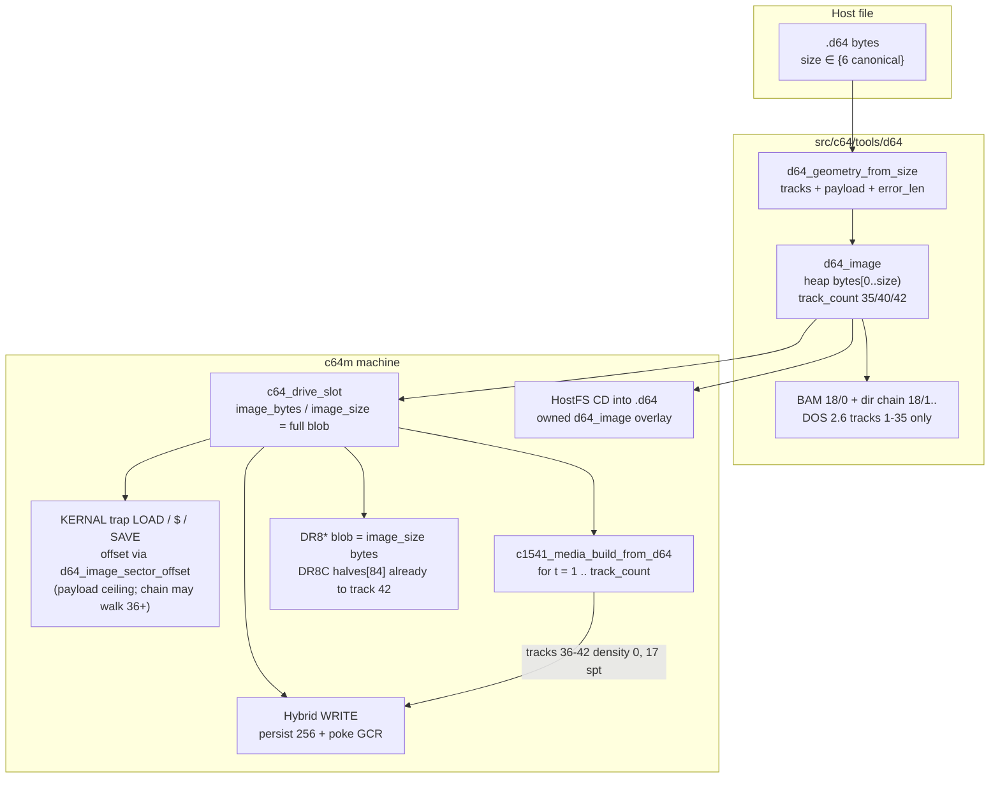
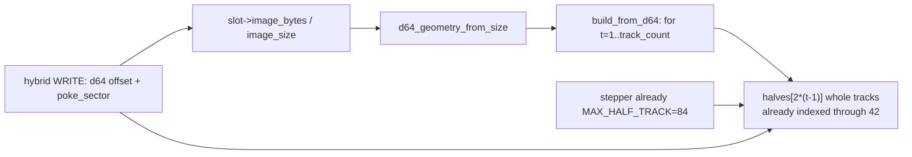

# c64m extended D64 read (40/42-track + error-info tails)

| Field | Value |
|-------|--------|
| Status | **Draft** |
| Author | _(TBD)_ |
| Date | 2026-09-13 |
| Audience | c64m implementers of disk parse / 1541 / HostFS / snapshots |
| Product scope | **c64m v1 only** |
| Intended permanent path | `design/c64/extended-d64-read.md` |
| Motivating image | `/Users/swessels/Downloads/WhatIsTheMatrix_II.d64` (196608 bytes; VICE loads; c64m refuses) |

## Overview

c64m today parses and mounts only the two 35-track D64 sizes (174848 and 175531). A 40-track scene dump such as *WhatIsTheMatrix_II.d64* (196608 = 768 × 256) is a well-formed VICE-family image, not a corrupt 35-track file, and is rejected in two independent gates: `d64_image_size_supported()` in `src/c64/tools/d64/d64.c` and `c64_mount_d64_ex()` in `src/c64/machine/c64.c`. The 35-track error-info size is accepted by the parser and then **truncated**: only the first 174848 bytes are kept, so the 683 error bytes are silently dropped.

This design extends **read** of the six canonical D64 sizes VICE documents (35/40/42 tracks, each with or without an error-info tail), unifies the duplicated 35-track geometry tables, stores the error tail honestly, synthesises GCR on extra tracks so real-1541 custom loaders can seek there, and flushes the full `image_size` on write-back. D71/D81/D80/D82/X64/P64/NIB/TAP stay out. Applying error-info bytes onto GCR (bad checksums, no-sync, …) is a follow-on, not required for Matrix II.

Matrix II–class titles are **not** “done” at trap `$` / LOAD of catalog PRGs. Those files stay on track 18; track 36 is custom drive code. The playable path is GCR extra tracks plus `[disk] emulate_1541=1`. PR sequencing must never mount a 40-track file as a 174848 prefix (that would wipe extra tracks on a writable flush).

## Background & Motivation

### Current state

The D64 parser (`src/c64/tools/d64/d64.c`, `d64.h`) is the format layer. Machine integration lives in `c64.c` (`c64_mount_d64_ex`, KERNAL trap LOAD/SAVE/`$`), `c1541.c` (hybrid D64 WRITE intercept), `c1541_gcr.c` / `c1541_media.c` (D64→GCR synthesis), `c64_hostfs.c` (nested `CD` into `.d64`), and `c64_snapshot.c` (drive image blobs). Runtime mount is `runtime_thread.c` (`d64_image_create` then `c64_mount_d64_ex`).

Accepted sizes today:

| Size | Meaning | Parser | Mount | What is actually kept |
|------|---------|--------|-------|------------------------|
| 174848 | 35-track, 683 sectors | yes | yes | full payload |
| 175531 | 35-track + 683 error bytes | yes (`d64_image_size_supported`) | **no** (`c64_mount_d64_ex` requires exactly 174848) | parser copies **only** 174848; runtime also passes `D64_STANDARD_IMAGE_SIZE` into mount |
| 196608 | 40-track, 768 sectors | **no** | **no** | — |
| 197376 | 40-track + 768 error bytes | **no** | **no** | — |
| 205312 | 42-track, 802 sectors | **no** | **no** | — |
| 206114 | 42-track + 802 error bytes | **no** | **no** | — |

`tests/c64/tools/test_d64.c` `test_geometry_and_size` **explicitly asserts** `!d64_image_size_supported(196608u)` ("40-track size rejected") and `d64_track_sector_offset(36, 0) == D64_TRACK_OUT_OF_RANGE`.

G64 / 1541 media **already** have half-track slots through track 42.5: `C1541_MEDIA_MAX_HALF_TRACK = 84`, `G64_MAX_HALF_TRACKS = 84`, `whole_track_slot()` in `c1541_media.c` accepts tracks 1..42. The mechanical/G64 path can seek past 35; D64 sector-dump geometry cannot.

### Pain points

1. Mainstream 40-track scene disks (SpeedDOS / Dolphin DOS / custom loaders, Matrix II) cannot mount. VICE loads them; c64m reports unsupported / cannot parse.
2. Claiming 175531 is supported while discarding the tail is dishonest. Copy-protection dumps that rely on the tail cannot be preserved, snapshotted, or flushed.
3. Even if the parser grew, `c64_mount_d64_ex` (`standard_image_size != C64_DRIVE_D64_STANDARD_SIZE`) and runtime (`c64_mount_d64_ex(..., D64_STANDARD_IMAGE_SIZE, ...)`) would still refuse or truncate.
4. Three live 35-track SPT/offset tables (`d64.c`, `c64.c` `c64_d64_sectors_per_track`, `c1541_gcr.c` `c1541_gcr_sectors_per_track` / `c1541_gcr_d64_sector_offset`) plus `c1541.c` `d64_sector_offset` (the local `d64_sectors_per_track` there is unused). A 40-track patch that adds another copy will rot.
5. `d64_image` embeds `uint8_t bytes[D64_STANDARD_IMAGE_SIZE]` — there is no room for extra tracks or the error tail without a storage change.

### Motivating measurement

File `WhatIsTheMatrix_II.d64`:

- Size **196608** = 40-track D64 (768 sectors × 256).
- BAM is normal DOS 2.6 (`'A'`), title Censor Designs, directory chain `18/1 → 18/13 → 18/14 → end`.
- PETSCII-art directory. **Every catalog PRG starts at 18/2 and the T/S chain stays on track 18** (11 sectors). Trap `$` / LOAD of `DEMO START` does **not** walk onto 36+.
- Track 36 is custom (non-DOS links; T36/0 link is `119/125`; 2825 nonzero bytes), not a CBM file chain. Tracks 37–40 are empty. The loaded stub talks to the 1541 to read T36.
- Default `[disk] emulate_1541` is **off** (`c64m.ini.example`). Playing this title needs **PR 3 GCR extra tracks + `emulate_1541=1`**, not trap LOAD of the catalog.

Do **not** add this Downloads file to git. Synthetic fixtures are the test bar. Optional later: gitignored `assets/` smoke.

## Goals & Non-Goals

### Goals (v1)

1. Accept the **six canonical D64 sizes** (35/40/42 × payload / payload+error-info) by file size, VICE-style. Size is the format; **no feature flag**.
2. Parse BAM/directory on track 18 as today (DOS 2.6). Extra tracks 36–40/42 have **17 sectors** (same as zone 4 / tracks 31–35).
3. Keep the **full** host blob in `d64_image` and in `c64_drive_slot.image_bytes` / `image_size`, including the error-info tail when present.
4. KERNAL-trap LOAD / `$` / SAVE, HostFS nested `.d64`, real-1541 GCR synthesis, hybrid D64 WRITE, snapshot round-trip, UI/CLI mount — all work for the new sizes.
5. Trap LOAD of a directory-listed PRG whose chain walks onto 36+ follows geometry (synthetic bar). Real-1541 code that steps to those tracks sees synthesised GCR.
6. Writable images flush **`slot->image_size` bytes** (already the runtime flush contract). Never truncate a 40/42-track or error-info image to 174848. A previously truncated 175531 host file **grows** to 175531 on first honest flush — that is intended.
7. Collapse the live 35-track geometry tables onto **one** source in `d64.h` / `d64.c`.
8. Flip the existing "40-track size rejected" test; add synthetic 40- and 42-track fixtures. No Downloads file in git.
9. Update `agents/c64/disk-iec1541.md` and `manual/c64m/manual.md` (ASCII help subset) after GCR extra tracks land. Manual must say 40-track custom loaders need `[disk] emulate_1541=1`.
10. Matrix II–class titles are accepted as **done** only when extra-track GCR exists and real-1541 is on. Trap `$` / LOAD of T18 catalog PRGs is a checkpoint, not the bar.

### Non-Goals (v1)

- D71 (1571), D81 (1581), D80/D82 (IEEE). `agents/c64/known-gaps.md` already lists 1571 / devices 10+ as out. Different drives, different geometry.
- X64 (64-byte VICE header + D64). Less common; no product demand from the motivating case.
- P64 / NIB / TAP. Not the D64 family. TAP is already a known gap (Datasette).
- Applying error-info bytes onto GCR (bad checksums, missing SYNC, ID mismatch, …). Store the tail; do not pretend it affects reads until a follow-on.
- Parsing SpeedDOS (`$C0–$D3`) / Dolphin DOS (`$AC–$BF`) extra BAM in 18/0 for `$` free-blocks or trap SAVE allocation. Extra tracks stay custom-loader; CBM DOS allocation remains tracks 1–35.
- 36/37/38/39/41-track intermediate sizes (VICE's probe walks 35→42 adding 17 sectors). v1 is the six canonical sizes only.
- Growing a 35-track image to 40/42 on format / WRITE past the payload. Out-of-range WRITE on a 35-track image stays `JOB_ERROR` (existing `test_queued_write_job_out_of_range`).
- Changing G64 (already through 42.5) except sharing D64 offset/SPT helpers.
- Snapshot version bump. Drive blobs are already `w_size` + payload; 206114 ≪ `C64_SNAPSHOT_MAX_CHUNK_SIZE` (32 MiB).

### Follow-on (explicit)

- Apply error-info bytes during GCR synthesis (copy-protection). Needed when a title's loader keys off 1541 job error codes rather than sector payload.
- X64 header skip if a real catalog of dumps shows up.
- SpeedDOS/Dolphin extra-BAM `$` / allocation if a writable 40-track DOS disk (not a custom loader) becomes a product case.

## Key Decisions

| Decision | Choice | Rationale |
|----------|--------|-----------|
| v1 sizes | **Six canonical:** 174848, 175531, 196608, 197376, 205312, 206114 | VICE file-formats table; Matrix II is 196608; error tails stop the 175531 lie. Intermediate 36–39/41 sizes stay rejected. |
| 42-track in the same v1 as 40 | **In** | G64 already seeks to 42; extra 34 sectors (8704 bytes) are cheap; VICE treats 40 and 42 as the same D64 family. 1541 can physically seek ~42. |
| Error-info | **Store the tail in the same blob; do not apply to GCR in v1** | Storing is cheap and makes 175531 honest. Matrix II has no tail. GCR error injection is a distinct, copy-protection-shaped follow-on. |
| Detection | **File size only; no feature flag** | Size *is* the format (VICE-style). No INI/CLI switch. |
| Other formats | **Out:** D71, D81, D80/D82, X64, P64, NIB, TAP | Different drives or different families. `known-gaps.md` already excludes 1571 / devices 10+. |
| Geometry source | **One table in `d64.c` / public API in `d64.h`** | Machine already links `${d64}` (`src/c64/machine/CMakeLists.txt`). The `c1541.c` comment "avoids tools/d64/ dependency" is stale. Do not add another copy. |
| Image vs agnostic offset | **`d64_track_sector_offset` is 1–42 and image-agnostic; accessors use `d64_image_sector_offset` (payload ceiling)** | Expanding the table without a payload check overruns a 35-track heap image when `first_track=36`. Trap LOAD must not call the agnostic function alone. |
| `d64_image` storage | **Heap `bytes` + `size` + `geom`** | Fixed `bytes[174848]` cannot hold 40/42 or the tail. Slot already heap-allocates `image_bytes`. `d64_image_destroy` frees `bytes` on success **and** parse-failure. |
| CBM DOS vs extra tracks | **BAM / `$` / trap SAVE allocation stay tracks 1–35** | Standard DOS 2.6 BAM only describes 1–35. Extra tracks are custom-loader; trap LOAD still follows T/S chains onto 36+ via geometry. |
| Write-back | **Flush full `image_size` (payload + tail); hybrid WRITE uses `payload_size` as the sector ceiling** | User asked for *reading*; writable 40-track must not truncate. 175531/197376/206114 grow/preserve the tail on first flush. 35-track WRITE to track 40 stays an error. Using `image_size` as the WRITE bound would let T=36 land in a 175531 error tail. |
| Snapshot | **No version bump; PR 3 rebuilds missing extra-track GCR** | `write_drive` already emits `slot->image_size` then the blob. A PR-2-era snapshot can serialise empty halves 36–42; `ensure_tracks` must not treat that as coherent after PR 3. |
| Matrix II bar | **GCR extra tracks + `emulate_1541=1`** | Catalog PRGs stay on T18; T36 is custom. Trap LOAD of `DEMO START` is not playing the title. |
| PR sequencing | **Locked train below; no “or” forks** | Parser-accepts-40 while runtime still passes `D64_STANDARD_IMAGE_SIZE` would mount a 174848 prefix and wipe extra tracks on writable flush. |
| Tests | **Synthetic images in `tests/c64`; no Downloads file** | Flip the reject test; add 40 and 42 fixtures. Explicit test: 196608 never mounts as 174848. Optional gitignored Matrix II smoke later. |

## Proposed Design

### Architecture



### Canonical sizes and zone-4 extra tracks

VICE *The emulator file formats* §17.5.3 (and Peter Schepers' D64 layout):

| Tracks | Sectors | Payload | + error-info |
|--------|---------|---------|--------------|
| 35 | 683 | 174848 | 175531 |
| 40 | 768 | 196608 | 197376 |
| 42 | 802 | 205312 | 206114 |

SPT by track (1-based). Tracks 36–42 are the same zone as 31–35:

| Track | Sectors | Density (`c1541_gcr_density_for_track`) |
|-------|---------|------------------------------------------|
| 1–17 | 21 | 3 |
| 18–24 | 19 | 2 |
| 25–30 | 18 | 1 |
| 31–35 | 17 | 0 |
| 36–40 | 17 | 0 |
| 41–42 | 17 | 0 |

Offsets of note (already used as test oracles):

- 18/0 BAM = `0x16500` (91392) — unchanged.
- 36/0 = 174848 = `D64_STANDARD_IMAGE_SIZE`.
- 41/0 = 196608.
- 42/16 last sector starts at 205056; payload ends at 205312.

`d64_image_size_supported` becomes a six-way equality. Odd sizes (174849, 196609, 200960 from some PI1541 41-track dumps, X64 = 64+payload, D71 = 349696) stay `false`.

### Single geometry source

Today three live 35-track tables plus one unused helper:

| Site | Function | Bound |
|------|----------|-------|
| `src/c64/tools/d64/d64.c` | `d64_sectors_per_track[D64_TRACK_COUNT]`, `d64_track_sector_offset` | `D64_TRACK_COUNT` 35 |
| `src/c64/machine/c64.c` | `c64_d64_sectors_per_track[35]`, `c64_d64_track_sector_offset` | track > 35 |
| `src/c64/machine/c1541.c` | static `d64_sector_offset` (live); static `d64_sectors_per_track` (**unused**, definition only) | track > 35 |
| `src/c64/machine/c1541_gcr.c` | `c1541_gcr_sectors_per_track`, `c1541_gcr_d64_sector_offset` | track > 35 |

`src/c64/machine/CMakeLists.txt` already `target_link_libraries(${machine} PRIVATE ${d64} ...)`. `c64.c` already `#include "d64.h"`. Put the table and the size decode in the parser:

```c
/* d64.h — public geometry. SPT table is 42 entries; DOS BAM still 35. */
#define D64_SECTOR_SIZE           256u
#define D64_DOS_TRACK_COUNT       35u   /* BAM / $ / trap SAVE allocation */
#define D64_MAX_TRACK_COUNT       42u   /* G64 / 1541 seek ceiling */
#define D64_MAX_SECTOR_COUNT      802u  /* 42-track payload */
#define D64_STANDARD_IMAGE_SIZE   174848u
#define D64_ERROR_INFO_IMAGE_SIZE 175531u
#define D64_40TRACK_IMAGE_SIZE    196608u
#define D64_40TRACK_ERROR_SIZE    197376u
#define D64_42TRACK_IMAGE_SIZE    205312u
#define D64_42TRACK_ERROR_SIZE    206114u

typedef struct d64_geometry {
    uint8_t track_count;   /* 35, 40, or 42 */
    size_t  payload_size;  /* 174848 / 196608 / 205312 */
    size_t  error_bytes;   /* 0, 683, 768, or 802 */
    size_t  sector_count;  /* payload_size / 256 */
} d64_geometry;

bool d64_image_size_supported(size_t size);
bool d64_geometry_from_size(size_t size, d64_geometry *out);
uint8_t d64_sectors_per_track(uint8_t track); /* 0 if track < 1 or > 42 */
d64_result d64_track_sector_offset(uint8_t track, uint8_t sector, size_t *out_offset);
d64_result d64_image_sector_offset(
    const d64_image *image, uint8_t track, uint8_t sector, size_t *out_offset);
```

`d64_track_sector_offset` allows tracks **1..42** (table is image-agnostic; no 174848 ceiling). It is for planting synthetic fixtures and for GCR helpers that then check the payload themselves. The existing test `track 36 rejected` becomes `track 43 rejected` plus `track 36 sector 0 offset == 174848`.

`d64_image_sector_offset` is the **only** offset API that image-backed code (extract, directory walk, scratch, trap LOAD, HostFS) may use. It:

1. Calls `d64_track_sector_offset`.
2. Rejects `offset + D64_SECTOR_SIZE > image->geom.payload_size` (never `image->size`, so the error tail cannot be read as sectors).
3. For a 35-track image, track 36 is `D64_TRACK_OUT_OF_RANGE` / `D64_SECTOR_OUT_OF_RANGE` even though the agnostic table knows the offset.

`d64_sector_ptr`, `d64_const_sector_ptr`, `d64_image_extract_prg`, directory parse, scratch, and `d64_clear_directory_entry_slot` go through this helper in the **same** change that expands `d64_track_sector_offset` to 42. `d64_clear_directory_entry_slot` today uses `offset < D64_STANDARD_IMAGE_SIZE`; after the heap move it must use `geom.payload_size`.

Machine wrappers (keep the GCR names so `test_c1541_gcr.c` stays stable):

- `c1541_gcr_sectors_per_track` → `d64_sectors_per_track`
- `c1541_gcr_d64_sector_offset` → `d64_track_sector_offset` (map `d64_result` to −1). GCR `build_one_track` / `decode_track_to_d64` then require `off + 256 <= geom.payload_size`.
- `c1541.c` deletes its local `spt[36]` and unused `d64_sectors_per_track`; hybrid WRITE calls `d64_track_sector_offset` but **keeps** a slot bound. In PR 1 that bound may stay `(offset + 256) > slot->image_size` (mounts are still 174848). From PR 2 (when 175531/197376/206114 can mount) the bound is **`payload_size`**, not `image_size`.
- `c64.c` **keeps** `c64_d64_track_sector_offset` and `visited[683]` until PR 2. PR 2 deletes them in the same change as `visited[D64_MAX_SECTOR_COUNT]`, `d64_geometry_from_size(slot->image_size)`, and `offset + 256 <= payload_size`. Trap LOAD must not call image-agnostic `d64_track_sector_offset` without that ceiling.

`c1541_gcr_density_for_track` already returns 0 for `track > 30`. That is correct for 36–42; only the `track > 35` reject in SPT/offset needs to move to `> 42`. Do **not** invent a fifth zone.

`C64_DRIVE_D64_STANDARD_SIZE` in `c64.h` remains 174848 as the 35-track payload alias used by existing tests. Mount gating must **not** use it as the only legal size.

### `d64_image` storage

Today:

```c
struct d64_image {
    uint8_t bytes[D64_STANDARD_IMAGE_SIZE];
    d64_disk_info info;
    d64_directory_entry *entries;
    size_t entry_count;
    size_t entry_capacity;
};
```

`d64_image_create` `memcpy`s **only** `D64_STANDARD_IMAGE_SIZE` even when `size == 175531`. `d64_image_bytes` always reports 174848. Write/scratch roll back with a 174848 backup.

v1:

```c
struct d64_image {
    uint8_t *bytes;          /* malloc(size); payload then optional error tail */
    size_t size;             /* full host blob */
    d64_geometry geom;
    d64_disk_info info;
    d64_directory_entry *entries;
    size_t entry_count;
    size_t entry_capacity;
};
```

- `d64_image_create` copies **`size`** bytes, not 174848. On parse failure after the alloc, `d64_image_destroy` must free `bytes` (today destroy only `free(entries)` + `free(image)`).
- `d64_image_bytes` returns `image->bytes` and `*out_size = image->size`.
- `d64_image_destroy` `free`s `bytes` and `entries`.
- Sector accessors (`d64_sector_ptr`, extract, scratch, directory walk) use **`d64_image_sector_offset`** → `geom.payload_size` as the ceiling, never the error tail.
- BAM / `d64_alloc_sector` wrap **`D64_DOS_TRACK_COUNT` (35)** only. A 40-track image still allocates trap SAVE on 1–35; extra-track bytes are left untouched.
- Write/scratch backup is `malloc(image->size)` / `memcpy(..., image->size)`.
- Directory / file-chain `visited[]` arrays: `D64_SECTOR_COUNT` 683 → `D64_MAX_SECTOR_COUNT` 802. Index = `offset / 256`; for extra-track chains this is required.

`$` / `free_blocks`: keep summing BAM entries for tracks 1–35 excluding 18 (`d64_parse_disk_info`). Do not invent free blocks for 36–42.

### Mount, runtime, UI/CLI

```mermaid
sequenceDiagram
  participant CLI as CLI / UI / control mount-d64
  participant RT as runtime_thread
  participant P as d64_image_create
  participant M as c64_mount_d64_ex
  participant S as c64_drive_slot

  CLI->>RT: path + writable
  RT->>RT: read whole file (already)
  alt GCR-1541 signature
    RT->>M: c64_mount_g64 (unchanged)
  else
    RT->>P: bytes, size
    P-->>RT: image or UNSUPPORTED_IMAGE
    RT->>M: bytes, size  /* NOT D64_STANDARD_IMAGE_SIZE */
    M->>M: d64_geometry_from_size(size)
    M->>S: malloc(size); memcpy full blob
  end
```

Two gates that must both change, **in the locked order in the PR Plan** (never parser-accepts-40 while runtime still passes 174848):

1. `d64_image_size_supported` — six sizes (PR 1).
2. `runtime_thread.c` **in the same PR 1** currently:

```c
status_result = c64_mount_d64_ex(..., bytes, D64_STANDARD_IMAGE_SIZE, ...);
```

Pass **`size`** (the `fread` length) so the still-174848 `c64_mount_d64_ex` gate fails honestly (`C64_DRIVE_STATUS_UNSUPPORTED_IMAGE` / `failed to mount D64`) instead of copying a 174848 prefix. Track 36 of Matrix II has 2825 nonzero custom bytes; truncating it is data loss. A required PR 1 test: a 196608 buffer **never** results in `slot->image_size == 174848` (it fails mount until PR 2).

3. `c64_mount_d64_ex` (PR 2) — today:

```c
if (standard_image_bytes == NULL || standard_image_size != C64_DRIVE_D64_STANDARD_SIZE) {
    return C64_DRIVE_STATUS_UNSUPPORTED_IMAGE;
}
```

Replace with `d64_geometry_from_size(standard_image_size, &geom)`. Copy `standard_image_size` bytes. Parameter names may stay (ABI is C internal); comments must say "D64 blob of a supported size", not "standard 35-track".

HostFS nested `CD` uses `d64_image_create` + `d64_image_bytes` flush and does **not** go through `c64_mount_d64_ex`. That path is safe in PR 1 once the parser copies `size`. The production `--disk` / UI / `mount-d64` path is not safe until step 2 above.

UI Mount Disk / Add Disk dialogs are **unfiltered**: `src/c64/main.c` opens them with `filter_extension` `""` (`"Mount Disk / HostFS"` / `"Add Disk Image"`). They do not filter by `.d64` or by size. No chrome change. CLI `--disk 8=file.d64` / control `mount-d64` already slurp the whole file. No new INI key. No feature flag.

`C64_DRIVE_STATUS_UNSUPPORTED_IMAGE` remains the user-visible result for non-canonical sizes (same as today for 196608). After PR 1 and before PR 2 it is also the result for canonical 40/42-track files on the IMAGE mount path (honest fail, not truncate).

### KERNAL trap LOAD / `$` / SAVE

Trap LOAD of a PRG (`c64_drive_load_prg_to_memory` in `c64.c`):

Today there is **no** `offset + 256 <= slot->image_size` check. The only bound is `c64_d64_track_sector_offset` (`track > 35` and `offset + 256 > C64_DRIVE_D64_STANDARD_SIZE`). Deleting that helper without a payload check overruns `image_bytes` when `first_track=36` on a 174848 slot.

- **PR 1:** leave `c64_d64_track_sector_offset` and `visited[683]` in place.
- **PR 2 (same change):** delete the local table. Add a slot helper (name sketch: `c64_d64_slot_sector_offset`) that runs `d64_geometry_from_size(slot->image_size)` + `d64_track_sector_offset` + **`offset + 256 <= geom.payload_size`**. Trap LOAD uses that helper, not agnostic `d64_track_sector_offset` alone. `bool visited[683]` → `visited[D64_MAX_SECTOR_COUNT]`. Without growing `visited`, a chain onto track 36 (`offset/256 == 683`) is treated as malformed even if geometry is fixed.
- `$` listing (`c64_drive_load_directory_to_memory`) uses `slot->entries` / `slot->free_blocks` from the DOS 2.6 directory parse — no extra-track work. Matrix II `$` / LOAD of catalog PRGs stay on T18; that is not the playable bar.
- Trap SAVE (`d64_image_write_prg` then `d64_image_bytes` then `memcpy(slot->image_bytes, written_bytes, written_size)`):

```c
if (written_bytes == NULL || written_size != slot->image_size ||
    !c64_drive_refresh_from_d64_image(slot, image)) {
```

This already requires the parser's reported size to match the slot. After `d64_image_bytes` returns the full blob, a SAVE on a 40-track image rewrites extra tracks unchanged and keeps the error tail. Allocation still 1–35.

### HostFS nested `.d64`

`c64_hostfs_cd_enter_d64` already:

```c
image = d64_image_create(bytes, size, &result);
```

Parser support is sufficient for `CD`, nested `$` (BAM title/id/DOS/`free_blocks`), LOAD extract, SAVE/`@:` (`d64_image_write_prg` + `c64_hostfs_flush_d64`), Scratch. Flush uses `d64_image_bytes` → `fwrite(bytes, 1, size, f)` — once `size` is the full blob, a nested 40-track file is not truncated. This path never calls `c64_mount_d64_ex`. **PR 1 includes the HostFS nested 40-track test** (`test_c64_hostfs_mount.c`).

Still `backend=HOSTFS`; never `c64_mount_d64`; never `iec_active`. Nested D64 SEQ I/O stays out. Snapshot v14+ persists the nested path and remounts via `c64_hostfs_reenter_d64` → `d64_image_create` again.

### Real-1541 GCR synthesis and hybrid WRITE



Hardcoded 35-track GCR sites (all in `c1541_media.c` unless noted):

| Site | Today | v1 |
|------|-------|----|
| `c1541_media_build_from_d64` | `image_size < 174848u`; `for (t = 1; t <= 35; ++t)` | **Gate only on `d64_geometry_from_size`**. Drop the redundant `image_size >= 174848` (that `>=` would accept 180000 and other non-canonical lengths in tests / `ensure_tracks`). Loop `t = 1 .. geom.track_count`. Pass **`geom.payload_size`** into `build_one_track`, not `slot->image_size`. |
| `c1541_media_sync_dirty_to_d64` | `for (t = 1; t <= 35; ++t)` | loop to `geom.track_count`; `decode_track_to_d64` uses **`payload_size`** |
| `c1541_media_poke_sector` | `track < 1 \|\| track > 35` | `track > geom.track_count` plus payload check |
| `c1541_gcr_sectors_per_track` / `c1541_gcr_d64_sector_offset` | reject > 35 | wrap `d64_*`; allow 1–42 |
| `c1541.c` hybrid WRITE bound | reject > 35; `(offset+256) > slot->image_size` | unified offset; PR 1 may keep `image_size` (mounts still 174848); **PR 2 switches the bound to `payload_size`** so a 175531 slot cannot WRITE T=36 into the error tail. 35-track WRITE T=40 stays `JOB_ERROR`. |
| `build_one_track` | memcpy bound is `image_size` | memcpy bound is **`payload_size`**; pads missing sectors with zeros |
| `whole_track_slot` | tracks 1–42 already | unchanged |
| `ensure_tracks` | skip rebuild when pointer+size+seq match | same, **plus** (PR 3): if `geom.track_count > 35` and `whole_track_slot(geom.track_count)` is empty, rebuild. A PR-2 snapshot of a 40-track D64 can serialise extra halves as `present=false`; matching `built_from_seq` must not freeze that forever. |

Hybrid WRITE sequence (`c1541_satisfy_queued_job`): copy job buffer into `slot->image_bytes+offset`, mark dirty, `c1541_media_poke_sector`. On a **writable 40-track** image, WRITE to track 36–40 must succeed (offset inside payload, poke GCR). On a **35-track** image, WRITE to track 40 stays `C1541_JOB_ERROR` — keep `tests/c64/machine/test_c1541.c` `test_queued_write_job_out_of_range`.

GCR build cost: ~7 extra inner tracks × ~6250 bytes/rev (density 0, 32 cycles/byte) ≈ 44 KiB and a one-shot malloc at mount. Negligible vs VIC paint.

`C1541_MEDIA_TRACK_COUNT = 36` is unused except as a comment. Update the comment to 42; do not rely on the enum for loops.

Error tail vs GCR: `build_one_track` and `decode_track_to_d64` read/write 256 payload bytes per sector against **`geom.payload_size`**, never raw `slot->image_size`. Passing a 197376 blob and looping with `image_size` as the memcpy bound would treat the tail as T41. Missing extra-track bytes (should not happen for a canonical size) stay zero-fill as today.

### Error-info bytes (store, do not apply)

Layout: `bytes[0 .. payload_size)` sectors in T/S order; `bytes[payload_size .. payload_size+sector_count)` one CBM DOS error code per sector (Schepers / VICE): `01` = OK, `02` = header not found (20), `03` = no SYNC (21), `04` = data block not found (22), `05` = data checksum (23), … .

v1 rules:

- If the size includes a tail, **keep it** in `d64_image.bytes` and `slot->image_bytes`.
- Do **not** look at the tail during trap LOAD, extract, or GCR encode.
- Do **not** rewrite the tail on hybrid WRITE / trap SAVE (leave bytes as dumped). Updating the map after a successful write is follow-on.
- Docs and `d64_image_size_supported` may call 175531 "supported" only because the tail is **preserved**. The user-facing manual must say error-info is stored, not applied.
- **Flush-size change:** today a 175531 file is parsed then mounted/flushed as 174848 (HostFS nested `d64_image_bytes` length 174848; runtime never mounts 175531). After v1 a writable 175531/197376/206114 image flushes the **full** tail length. That is the honesty fix; it is a user-visible grow of existing error-info files on first SAVE/flush. PR 2 tests must include a 175531 round-trip size, not only 196608.

Follow-on (not v1): map codes onto GCR (wipe SYNC, break checksums, skip data block). That is how VICE makes copy-protection D64s fail the same way as the original disk. Required only when a title's 1541 code keys off job error numbers rather than payload. Matrix II has no tail.

### Snapshot round-trip

`write_drive` (`c64_snapshot.c`):

```c
w_size(w, slot->image_size);
if (slot->image_size > 0 && slot->image_bytes != NULL) {
    w_bytes(w, slot->image_bytes, slot->image_size);
}
```

`read_drive` mallocs `image_size` and restores it. **No `C64_SNAPSHOT_VERSION` bump** (stays 16 / min 16). 206114 bytes is well under the 32 MiB chunk cap.

`DR8C`/`DR9C` already serialise `halves[0..83]` (`C1541_MEDIA_HALF_SLOTS`). Once `build_from_d64` fills whole-track slots for 36–42, those GCR rings round-trip without a format change.

`ensure_tracks` today skips rebuild when `built_from`, `built_size`, and `built_from_seq` match the slot. Snapshot restore rebinds `built_from` and copies `image_content_seq`, so GCR is not rebuilt. After PR 2 a 40-track D64 with `emulate_1541` still builds only tracks 1–35; halves for 36–42 stay empty and serialise as `present=false`. After PR 3, loading that snapshot would **not** fill track 36 if coherency still matches. There is no version bump to force a rebuild.

**PR 3 coherency (required, not “users won’t snapshot between PRs”):** when `d64_geometry_from_size` yields `track_count > 35` and `whole_track_slot(geom.track_count)` is empty (no GCR ring), rebuild from the D64 payload. That also repairs any live session that mounted extra-track images under PR 2.

HostFS nested: v14+ stores the `.d64` host path, not the blob; remount requires the parser to accept the size.

PR 2 snapshot test: mount synthetic 40-track and 175531 images, save/load, assert `image_size` is 196608 / 175531 and extra-track / tail bytes survive in the **D64 blob**. PR 3 snapshot test: 40-track + `emulate_1541`, save/load (including a fixture with empty extra halves), assert `whole_track_slot(40)` is populated. Existing tests hardcode `C64_DRIVE_D64_STANDARD_SIZE` and stay valid for 35-track fixtures.

### Write-back policy (read-first, coherent v1)

| Event | 35-track payload (174848) | 35-track + error (175531) | 40/42-track (± error) |
|-------|---------------------------|---------------------------|------------------------|
| Trap SAVE PRG | Alloc 1–35; flush 174848 | Alloc 1–35; tail unchanged; flush **175531** (grows vs today’s 174848 flush) | Alloc 1–35; extra tracks + tail unchanged; flush full `image_size` |
| Hybrid job WRITE 18/x | Persist + poke | Same; bound is `payload_size` (174848), not 175531 | Same |
| Hybrid job WRITE 40/0 | `JOB_ERROR`; not dirty (`test_queued_write_job_out_of_range`) | `JOB_ERROR` (T=36 is past payload; must not land in the tail) | Persist + poke; dirty; flush full size |
| HostFS nested SAVE/Scratch | `fwrite` parser `d64_image_bytes` size | Now 175531 (today 174848) | 196608 / 197376 / 205312 / 206114 |
| Runtime `runtime_flush_disk_slot` | `fwrite(..., slot->image_size)` already | Same — **do not** special-case 174848 | Same |
| G64 | Unchanged | Unchanged | Unchanged |

Never shrink a larger image to 35 tracks on SAVE. Never grow a 35-track **payload** because a loader poked T=40. Growing 174848→175531 on an error-info file is restoring the tail the parser already accepted, not inventing tracks.

## API / Interface Changes

### Parser (`d64.h`)

Add `d64_geometry`, `d64_geometry_from_size`, `d64_sectors_per_track`, `d64_image_sector_offset`, size macros for 40/42. `d64_image_size_supported` expands. `d64_track_sector_offset` max track 42 (agnostic). `d64_image_bytes` reports full size. `D64_TRACK_COUNT` today is 35 and is used as the BAM loop bound — **rename** to `D64_DOS_TRACK_COUNT` (35) and add `D64_MAX_TRACK_COUNT` (42) so a missed replace does not silently allocate onto 36–42. Grep-replace call sites in `d64.c`, `tests/c64/tools/test_d64.c`, and `tests/c64/machine/test_c64_hostfs_mount.c` (BAM plant loop `for (track = 1; track <= D64_TRACK_COUNT; ++track)`). Keep that loop on **`D64_DOS_TRACK_COUNT`**.

No new result codes. Unsupported size remains `D64_UNSUPPORTED_IMAGE`.

### Machine

```c
/* c64_mount_d64_ex: accept any d64_geometry_from_size-ok length.
   Copy the full blob into slot->image_bytes / image_size. */
```

`c64_drive_load_prg_to_memory` (PR 2): `visited[802]`; geometry via `d64_geometry_from_size` + payload ceiling. Do not delete the local 35-track helper in PR 1.

GCR helpers keep their names; implementation delegates. `c1541_media_build_from_d64` gates on `d64_geometry_from_size` only; comment "35-track" → "35/40/42-track from image size". Build/decode memcpy bound is `payload_size`.

### Runtime / UI / control

No new verbs. `mount-d64` / `--disk` / [8]/[9] Open pass the file as today. Hello stays `C64M/10`.

## Data Model Changes

- `d64_image.bytes` moves from inline array to heap; `size` + `geom` added.
- `c64_drive_slot.image_bytes` / `image_size` already variable (G64 is arbitrary length). D64 slots will now hold 174848..206114 instead of always 174848.
- Snapshot on-disk layout unchanged (size-prefixed blob).
- No INI keys.

Migration: none. Old 35-track images keep working. Snapshots saved with a 40-track blob are unreadable by **older** c64m only in the sense that current c64m already cannot mount 40-track — a pre-change binary loading a post-change snapshot with `image_size==196608` would restore the blob into the slot, then trap/GCR would still treat T>35 as OOR until this change. After this change, both live mount and snapshot restore work. No flag bit needed.

## Alternatives Considered

### 1. 40-track only vs 40+42 in v1

| | 40 only | 40+42 (chosen) |
|--|---------|----------------|
| Motivating case | Covered | Covered |
| Code | Almost identical (loop bound + two sizes) | Two extra sizes, 34 sectors |
| G64 seek | Already to 42; D64 would stop at 40 | Matches media ceiling |
| VICE family | Splits a table VICE keeps together | Same family |
| Rarity of 42 | — | Uncommon; cheap to accept |

**Choice:** 42 in v1. Rejecting 205312 after teaching the code about 17-spt extra tracks would be an arbitrary second gate.

### 2. Canonical six sizes vs VICE's 35→42 walk

VICE `fsimage-probe` starts at 35 and adds 17 sectors per extra track, so 36–39 and 41 also match. PI1541 has produced 41-track files.

| | Walk 35–42 | Six canonical (chosen) |
|--|------------|------------------------|
| Compatibility | Matches VICE probe | Matches VICE *documented* table |
| Tests / docs | Nine extra sizes | Six |
| Real dumps | Catches odd PI1541 | Scene dumps are 35/40/42 |

**Choice:** six sizes. Intermediate sizes stay `UNSUPPORTED_IMAGE`. Revisit if a real dump shows up (Lemon64 PI1541 thread is the known oddity).

### 3. Store error tail vs apply to GCR in v1 vs drop the tail

| | Drop (today) | Store only (chosen) | Apply to GCR now |
|--|--------------|---------------------|------------------|
| Honesty about 175531 | Lies | Honest | Honest |
| Copy-protection D64s | Useless | Preserved for later | Some titles work |
| Matrix II | N/A (no tail) | N/A | N/A |
| Complexity | — | memcpy `size` | Error→GCR mapping, tests per code |

**Choice:** store, do not apply. Applying is a follow-on with its own oracle (VICE job error numbers).

### 4. Heap `d64_image.bytes` vs keep 35-only parser + raw mount path

| | Dual path | Heap in parser (chosen) |
|--|-----------|-------------------------|
| HostFS nested / trap SAVE / extract | Would skip parser or fork it | One object |
| Error tail | Raw path must reimplement size table | Parser owns it |
| `d64_image_bytes` flush | Two writers | One |

**Choice:** one parser, heap storage. Do not add a "raw 40-track mount that bypasses `d64_image`".

### 5. Fifth geometry table vs unify on `d64.h`

`c1541.c` comments that it inlines the table to avoid a tools/d64 dependency. Machine already links `${d64}`. Adding 40/42 in every copy is how the 35-track tables happened. The local `d64_sectors_per_track` in `c1541.c` is unused; the live hybrid path is `d64_sector_offset` + a slot size check.

**Choice:** unify. GCR density/cycles stay in `c1541_gcr.c` (not D64 format). SPT and byte offset move to `d64.c`. `c64.c` trap geometry waits for PR 2 so the payload check lands in the same change.

### 6. Feature flag vs size-is-format

A flag would let users "opt in" to 40-track. There is no compatibility hazard: 35-track files keep the same parse. A flag would hide Matrix II behind an INI the user does not know to set.

**Choice:** no flag.

## Security & Privacy Considerations

| Threat / issue | Severity | Mitigation |
|----------------|----------|------------|
| Huge file claiming to be D64 | Low | Size must equal one of six constants; `fread` of a multi-MB file that is not an exact match is rejected after the slurp (same as today for unknown sizes). No grow-from-header. |
| Directory / file chain loops onto extra tracks | Low | Existing loop guards; `visited` grows to 802 so extra-track sectors are tracked instead of wrapping into 0..682. |
| Snapshot blob 206114 vs 174848 | None | Already size-prefixed; 32 MiB cap unchanged. |
| Writable 40-track flush overwrites host file at full size | Low | Same as today's writable 35-track flush; path is the mounted host path. |

No new guest-supplied host paths. Nested HostFS still requires the `.d64` to sit under the HostFS root.

## Observability

- Existing `failed to parse D64` / `UNSUPPORTED_IMAGE` path stays; 40-track files must **not** take it after the change.
- Optional `log_info` at mount: track count + whether an error tail is present (debug). Not required for v1.
- No new metrics. Misc → Hardware 1541 pane already shows media; no change required.
- Tests are the acceptance signal (see below).

## Rollout Plan

Locked to the PR Plan. No “or” forks.

1. **No feature flag.** Land behind ordinary PR review; 35-track behaviour is the regression bar (`ctest -L c64m`, especially `d64`, `c64_disk_load`, `c1541`, `c1541_media`, `c64_hostfs_mount`, `c64_snapshot`).
2. **PR 1:** parser + geometry + heap image + HostFS nested 40-track test + runtime passes `size` (mount still 174848-only → honest `UNSUPPORTED_IMAGE`). Never parser-accepts-40 while runtime still passes `D64_STANDARD_IMAGE_SIZE`.
3. **PR 2:** `c64_mount_d64_ex` accepts six sizes; trap LOAD payload check + `visited[802]`; 175531/196608 snapshot blob round-trip; hybrid WRITE bound becomes `payload_size`. User-visible IMAGE mount of 40-track files. Trap `$` / catalog LOAD work; Matrix II is **not** playable yet.
4. **PR 3:** GCR extra tracks + hybrid WRITE T=40 on 40-track images + `ensure_tracks` rebuild when extra-track GCR is missing. This is the playable Matrix II path (`emulate_1541=1`).
5. **PR 4:** docs after PR 3 (`agents/c64/disk-iec1541.md`, `manual/c64m/manual.md` ASCII subset). Manual states 40-track custom loaders need `[disk] emulate_1541=1`. `design/README.md` active → landed.
6. Rollback: revert the PR train; no user-data migration. A 40-track file flushed by a writable session remains a 40-track file (VICE-compatible). A 175531 file flushed after PR 2 is 175531 (honest tail); that is compatible with VICE.

## Risks

| Risk | Severity | Mitigation |
|------|----------|------------|
| Parser-accepts-40 while runtime still passes 174848: truncated mount + writable wipe of T36 | **Critical** | PR 1 passes `size` into mount so the 174848 gate fails honestly. Test: 196608 never yields `image_size==174848`. |
| Agnostic offset 1–42 without payload ceiling: extract/trap LOAD heap overrun | **High** | `d64_image_sector_offset` in PR 1; trap LOAD helper stays 35-bound until PR 2 adds payload check + `visited[802]` in the same change. |
| Missed 35-hardcoded site: 40-track mounts then GCR only builds 1–35 | **High** | Inventory below; GCR tests with a 40-track fixture asserting track 40 SPT/offset and `build_from_d64` filling `whole_track_slot(40)` |
| PR 2 snapshot freezes empty extra-track GCR across PR 3 | **High** | PR 3 rebuilds when `track_count > 35` and `whole_track_slot(track_count)` is empty |
| 175531 WRITE T=36 lands in the error tail if the bound is `image_size` | **High** | PR 2 hybrid WRITE / GCR memcpy use `payload_size` |
| Trap LOAD `visited[683]` not grown: PRG chain onto 36 looks like a loop/OOR | **High** | PR 2 fixture: directory entry `first_track=36`, extract + trap LOAD |
| 35-track WRITE T=40 starts succeeding | Medium | Keep `test_queued_write_job_out_of_range`; payload/image_size check stays |
| Error-info applied accidentally / used as sector bytes | Medium | Payload ceiling on every sector memcpy; tests that 175531 payload[174847] is last sector byte and tail[0] is not synthesised into GCR |
| SpeedDOS extra BAM ignored → `$` free-blocks "wrong" vs VICE on a true SpeedDOS disk | Low | Documented; extra tracks are custom. Revisit if a writable SpeedDOS disk is the bar |
| Heap `d64_image` leak on parse failure | Low | `d64_image_destroy` frees `bytes`; parse-failure path after alloc must call it |
| Snapshot of 40-track vs older c64m | Low | No version bump; older binaries already cannot use the image. Acceptable |

### 35-hardcoded site inventory (normative for implementers)

Every site that assumes 35 tracks or 174848 as the **only** D64 shape. Tests that *construct* a 35-track blank are fine; tests that *reject* 40-track are not.

| File | What |
|------|------|
| `src/c64/tools/d64/d64.h` | `D64_TRACK_COUNT 35`, two size macros |
| `src/c64/tools/d64/d64.c` | SPT table[35]; `D64_SECTOR_COUNT 683`; `d64_image_size_supported`; `memcpy`/`d64_image_bytes`/`backup` 174848; BAM/alloc loops `D64_TRACK_COUNT`; `visited[D64_SECTOR_COUNT]`; `d64_track_sector_offset` `track > D64_TRACK_COUNT` and `offset+256 > D64_STANDARD_IMAGE_SIZE`; `d64_clear_directory_entry_slot` `offset < D64_STANDARD_IMAGE_SIZE`; `d64_image_destroy` frees `entries` only (heap `bytes` must be added, including parse-failure after alloc) |
| `src/c64/machine/c64.h` | `C64_DRIVE_D64_STANDARD_SIZE = 174848` used as mount gate |
| `src/c64/machine/c64.c` | `c64_d64_sectors_per_track[35]`; `c64_d64_track_sector_offset` track>35 and size 174848; `visited[683]` with **no** `offset+256 <= image_size`; `c64_mount_d64_ex` equality to 174848 |
| `src/c64/machine/c1541.c` | live `d64_sector_offset` (`spt[36]`, `track > 35`) plus `(offset+256) > slot->image_size`; unused `d64_sectors_per_track` (definition only — delete with the table, do not treat as a fourth SPT *table*) |
| `src/c64/machine/c1541_gcr.c` / `.h` | SPT/offset `track > 35`; comments "35-track DOS layout" |
| `src/c64/machine/c1541_media.c` | `image_size < 174848u`; `for (t = 1; t <= 35; ++t)` in build and `sync_dirty_to_d64`; `poke_sector` `track > 35`; `build_one_track` memcpy bound is `image_size` |
| `src/c64/machine/c1541_media.h` | comments "D64 uses tracks 1..35"; unused `C1541_MEDIA_TRACK_COUNT = 36` |
| `src/c64/runtime/runtime_thread.c` | `c64_mount_d64_ex(..., D64_STANDARD_IMAGE_SIZE, ...)` |
| `tests/c64/tools/test_d64.c` | `"40-track size rejected"`; `"track 36 rejected"` |
| `tests/c64/machine/test_c64_hostfs_mount.c` | BAM plant loop `for (track = 1; track <= D64_TRACK_COUNT; ++track)` — grep-replace to `D64_DOS_TRACK_COUNT` |
| `agents/c64/disk-iec1541.md` | "D64: 35-track, error tails, …" |
| `manual/c64m/manual.md` | Disk Images / Disk sections say D64 without sizes (extend, do not contradict) |

HostFS (`c64_hostfs.c`) and snapshots do not hardcode 35 except through the parser/mount APIs. BAM/alloc stay on `D64_DOS_TRACK_COUNT`.

## Open Questions

None that block v1. Settled here rather than left as forks:

| Topic | Decision |
|-------|----------|
| 42-track in v1? | Yes |
| Intermediate 36–41 sizes? | No |
| Apply error-info to GCR? | No (store only) |
| X64 / D71 / D81? | Out |
| Feature flag? | No |
| Snapshot version bump? | No |
| Trap SAVE onto tracks 36+ via extra BAM? | No |
| PR 1 runtime `size` vs keep parser 35-only vs merge PR 1+2 | **PR 1 passes `size`** (honest mount fail). HostFS nested 40-track test in PR 1. Docs in PR 4 after PR 3. |

Measured, not a fork: Matrix II catalog PRGs stay on T18; T36 is custom. PR 3 + `emulate_1541=1` is the playable path. Default `emulate_1541` stays off.

## References

- VICE Manual §17.5 *The D64 disk image format* / §17.5.3 variations — sizes 174848, 175531, 196608, 197376, 205312, 206114; extra tracks 17 spt
- Peter Schepers D64 layout (error-info codes; BAM at 18/0)
- `agents/c64/disk-iec1541.md` — two load paths, HostFS nested D64, hybrid WRITE, snapshot v16
- `agents/c64/known-gaps.md` — 1571 / devices 10+ out; TAP out
- `agents/c64/tools.md` — parsers must not call runtime; tests under `tests/c64/tools`
- `src/c64/tools/d64/d64.c` / `d64.h` — parser
- `src/c64/machine/c64.c` — `c64_mount_d64_ex`, trap LOAD/SAVE, `c64_d64_track_sector_offset`
- `src/c64/machine/c1541.c` — hybrid WRITE, local geometry
- `src/c64/machine/c1541_gcr.c` / `c1541_media.c` — GCR build loops
- `src/c64/machine/c64_hostfs.c` — `c64_hostfs_cd_enter_d64`, `c64_hostfs_flush_d64`
- `src/c64/machine/c64_snapshot.c` — `write_drive` / `read_drive` size-prefixed blobs; `write_media` 84 halves
- `src/c64/runtime/runtime_thread.c` — mount + `runtime_flush_disk_slot`
- `tests/c64/tools/test_d64.c` — size/geometry assertions to flip
- `design/README.md` — index conventions
- Motivating file (not in git): `/Users/swessels/Downloads/WhatIsTheMatrix_II.d64`

---

## PR Plan

Incremental, each PR independently reviewable and mergeable. 35-track fixtures must keep passing at every step. Sequencing is **locked** (no “or” sentences).

### PR 1 — Unified D64 geometry + six-size parser (heap image) + honest runtime size pass

- **Title:** `c64m: accept 35/40/42-track D64 sizes and unify geometry`
- **Files/components:** `src/c64/tools/d64/d64.h`, `d64.c`; `tests/c64/tools/test_d64.c`; `src/c64/machine/c1541_gcr.c` (SPT/offset delegate; density unchanged); `src/c64/machine/c1541.c` (delete local `spt[36]` and unused `d64_sectors_per_track`; hybrid WRITE calls `d64_track_sector_offset` and **keeps** `(offset + 256) > slot->image_size`); `src/c64/runtime/runtime_thread.c` (pass `size`, not `D64_STANDARD_IMAGE_SIZE`); `tests/c64/machine/test_c64_hostfs_mount.c` (nested 40-track `CD` + BAM loop → `D64_DOS_TRACK_COUNT`); `tests/c64/machine/test_c64_disk_load.c` or a focused mount test (196608 never mounts as 174848); `design/README.md` (this doc **active** at `design/c64/extended-d64-read.md`)
- **Dependencies:** none
- **Description:** `d64_geometry_from_size` for the six canonical sizes. Heap `d64_image.bytes` + `size` + `geom`. Copy the full blob including error tail. `d64_image_bytes` reports `size`. `d64_image_destroy` frees `bytes` on success and parse-failure. `d64_image_sector_offset` enforces `offset + 256 <= geom.payload_size`; `d64_sector_ptr` / extract / scratch / directory walk / `d64_clear_directory_entry_slot` use it. BAM/alloc remain `D64_DOS_TRACK_COUNT` (35). Parser `visited` arrays 802. Flip `test_geometry_and_size`: 196608/197376/205312/206114 accepted; 174849 still rejected; track 36/0 agnostic offset 174848; track 43 OOR; 35-track image `d64_image_sector_offset(36, …)` rejected. Synthetic 40- and 42-track images: parse, directory from 18/1, extract a PRG whose chain starts on 18 and continues on 36 (40-track) / 41 (42-track). Error-info 175531: `d64_image_bytes` length 175531; first 174848 unchanged. **`c64.c` trap geometry stays** (`c64_d64_track_sector_offset`, `visited[683]`). **`c64_mount_d64_ex` still requires 174848.** Runtime passes `size`, so a 196608 parse succeeds then mount fails `UNSUPPORTED_IMAGE` — never a 174848 prefix. Required test: mounting 196608 does not yield `slot->image_size == 174848`. HostFS nested 40-track test **in this PR** (`d64_image_create` is that surface).

### PR 2 — Mount, trap LOAD/SAVE, payload-bounded WRITE, snapshot blobs

- **Title:** `c64m: mount and trap-load 40/42-track D64 (full image_size)`
- **Files/components:** `src/c64/machine/c64.c` (`c64_mount_d64_ex` size gate; delete `c64_d64_sectors_per_track` / `c64_d64_track_sector_offset`; trap LOAD `visited[D64_MAX_SECTOR_COUNT]` + `offset + 256 <= geom.payload_size`; trap SAVE size match), `src/c64/machine/c1541.c` (hybrid WRITE bound **`payload_size`**, not `image_size`), `tests/c64/machine/test_c64_disk_load.c`, `test_c64_snapshot.c` (196608 and **175531** round-trip sizes)
- **Dependencies:** PR 1
- **Description:** Mount copies the full blob (six sizes). Trap LOAD follows chains onto extra tracks without overrunning a 35-track slot. Trap SAVE / HostFS flush write `image_size` bytes (extra tracks + tail preserved; 175531 files grow from today’s 174848 flush). Hybrid WRITE to T=36 on a 175531 slot is `JOB_ERROR` (past payload). Snapshot save/load asserts `image_size == 196608` / `175531` and extra-track / tail bytes in the D64 blob. 35-track tests unchanged. CLI/UI inherit the mount path — dialogs stay unfiltered; no chrome change. After this PR, trap `$` / LOAD of T18 catalog PRGs work on 40-track images. **That is not playing Matrix II** (T36 is custom; default `emulate_1541` is off). GCR still builds tracks 1–35 only.

### PR 3 — GCR synthesis and hybrid WRITE on extra tracks

- **Title:** `c64m: synthesise GCR tracks 36-42 from extended D64`
- **Files/components:** `src/c64/machine/c1541_media.c` / `.h` (build/sync/poke loops; `ensure_tracks` extra-track coherency), `tests/c64/machine/test_c1541_gcr.c` (spt/offset for 36 and 42), `test_c1541_media.c` (build 40-track, head on track 40; rebuild when extra half is empty), `test_c1541.c` (**keep** 35-track T=40 WRITE error; **add** 40-track T=40 WRITE success)
- **Dependencies:** PR 1 (geometry); PR 2 (mount of a 196608 blob into a slot)
- **Description:** `build_from_d64` gates **only** on `d64_geometry_from_size` (no leftover `>= 174848`). Loop `geom.track_count`. Pass **`geom.payload_size`** into `build_one_track` and `decode_track_to_d64`. Density 0, 17 spt, VICE inner-zone gap. Hybrid WRITE to extra tracks persists and pokes GCR iff the offset is inside the payload. `ensure_tracks`: if `track_count > 35` and `whole_track_slot(track_count)` is empty, rebuild — so a PR-2 snapshot with empty extra halves is repaired. 35-track OOR test remains. Error tail is not consulted. **This is the playable Matrix II path** (`emulate_1541=1`).

### PR 4 — Docs + honesty about error-info

- **Title:** `c64m: document 40/42-track D64 read; error-info stored not applied`
- **Files/components:** `agents/c64/disk-iec1541.md` (D64 bullet: 35/40/42 ± error tails; extra tracks custom-loader; error-info preserved, not applied; 175531 flush now keeps the tail), `manual/c64m/manual.md` (Disk Images + Disk sections; ASCII-only; **40-track custom loaders need `[disk] emulate_1541=1`**)
- **Dependencies:** PR 3
- **Description:** Fold durable rules into the handoff and the help book after extra-track GCR exists so the manual can state the playable path. `design/README.md` active → landed. No Downloads fixture. Prefer the Formats clarification in `disk-iec1541.md` over a new `known-gaps.md` row unless the error-info-not-applied gap needs to be user-facing there too.

### PR 5 (follow-on, out of v1) — Apply error-info to GCR

- **Title:** `c64m: apply D64 error-info bytes to synthesised GCR`
- **Files/components:** `c1541_media.c` `build_one_track`; tests per error code; maybe a parallel `error_map` view
- **Dependencies:** PR 1–3
- **Description:** Out of v1. Listed so storing the tail in PR 1 is the intentional handoff. Do not start until a title is shown to need it.

### PR 6 (optional, out of v1) — X64 header / intermediate sizes / SpeedDOS BAM

- **Title:** `c64m: D64 variants (X64 header, 36-41 sizes, SpeedDOS BAM)`
- **Files/components:** parser size probe; optional extra-BAM `$`
- **Dependencies:** PR 1
- **Description:** Only with a measured dump. Not on the Matrix II path.
