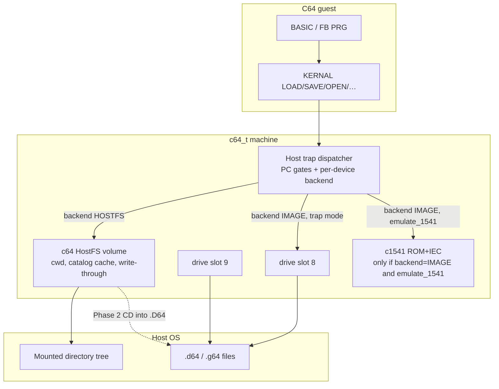
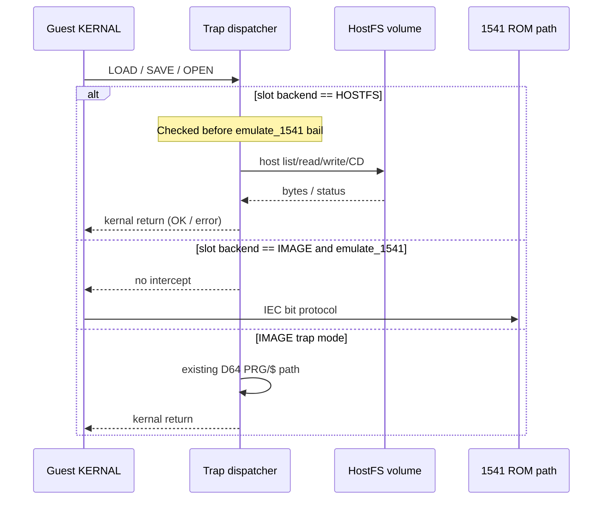

# c64m HostFS — SD2IEC-shaped, trap-fast folder volume

| Field | Value |
|-------|--------|
| Status | **Draft** (owner Open-Question answers incorporated 2026-08-30; fill human Author before Accepted) |
| Author | design brief session |
| Date | 2026-08-30 |
| Audience | Senior engineers / agents expanding phases into implementation plans |
| Product | c64m (`src/c64/`) |
| Analogy (do not mix trees) | a2m HostFS / SmartPort (`src/apple2/machine/hostfs.*`, `smrtprt.*`) |
| Repo path | `design/c64/hostfs-sd2iec-folder-volume.md` (**active** in `design/README.md`) |

---

## Overview

c64m today mounts D64/G64 images on devices **8** and **9**, with a soft-power model and two load backends: a **KERNAL trap** at `$FFD5`/`$FFD8` (D64 PRG/`$` only) when `emulate_1541` is off or no 1541 ROM is loaded, and a **real 1541 ROM + IEC** path when enabled. There is no way to mount a host directory as a navigable Commodore volume.

This design adds a **folder volume**: an IEC-facing device personality that mounts a host directory and serves `$`, `LOAD`/`SAVE`, and (from Phase 1) CMD/SD2IEC-shaped command-channel `CD` via **KERNAL traps and host-side I/O** — not a 1541 ROM, not bit-banged IEC, and not a ProDOS SmartPort port. The UI mirrors a2m: **[Open]** a `.d64`/`.g64` mounts an image; **[Use This Folder]** mounts the shown directory as the HostFS volume. Path kind selects the backend.

The product goal is fast in-guest navigation of project/sample trees (Bitsy Bye–equivalent via stock FB / CBM FileBrowser), assembler/host tool write-through of PRGs, and multi-part loaders under test — while keeping real 1541 / G64 for demos and protection on the sibling unit.

---

## Background & Motivation

### Current state (cited)

| Area | Today |
|------|--------|
| Devices | 8 and 9 only (`C64_DRIVE_MIN_DEVICE` / `MAX` in `src/c64/machine/c64.h`) |
| Image kinds | `C64_DRIVE_IMAGE_NONE` / `D64` / `G64` |
| Soft power | Sticky `c64_drive_slot.powered`; mount / `[8]`/`[9]` / `power-drive` / empty `--disk N=` power on; green LED / `power-drive N off` ejects then powers off (`agents/c64/disk-iec1541.md`, `manual/c64m/manual.md`). `powered` currently gates both `c64_drive_sync_to` stepping and `c64_drive_bus_pull` IEC contribution; `c64_power_on_drive` calls `c1541_reset` when that unit’s ROM is loaded. Runtime loads the same 1541 ROM into **both** drive8 and drive9. |
| KERNAL trap | `c64_try_kernal_load_trap` / `c64_try_kernal_save_trap` in `src/c64/machine/c64.c` — gate on PC `$FFD5`/`$FFD8`; **bail out** if that device has ROM loaded and `emulate_1541`; require mounted **D64** |
| Directory listing | Trap synthesizes BASIC `$` lines from `slot->entries` (`c64_drive_load_directory_to_memory`); `c64_drive_file_type` / `c64_drive_file_type_text` know DEL/SEQ/PRG/USR/REL/`???` only — **no `DIR`** |
| Command channel | **No host KERNAL trap** for channel 15 (OPEN/CHR* path). Guest-visible DOS channel 15 today works only via the real-1541 ROM + IEC path; the 1541 model still has its internal command/job channel machinery |
| UI `[8]`/`[9]` | Soft-power + file browser; Open mounts image; Paths already has **Use This Folder**, but disk mount does not (`src/c64/frontend/frontend.c`). Shift+[N] **adds** to the ordered image queue without replacing the current mount when the queue is non-empty |
| Assembler | In-emu host **ignores** `file=` / `prg=`; only `dest="map"` (`manual/c64m/manual.md`, `runtime_assembler.c`) |
| a2m HostFS | Directory → ProDOS SmartPort volume, NAPS names, write-through, Open vs Use This Folder (`agents/apple2/disk.md`, `manual/a2m/manual.md`) |

### Pain points

1. Project trees live on the host; iterating in-guest requires packing D64s or using `load-prg` / `-p` inject (fine for single PRG, wrong for multi-file / FB workflows).
2. Stock browsers (FB, CBM FileBrowser) expect SD2IEC/CMD-shaped `$` + `CD` on channel 15 — unavailable on the trap path today.
3. Global `emulate_1541` steals traps for **both** devices (both units get the ROM loaded); a folder volume on 9 cannot coexist with a real 1541 on 8 without **per-device backend** routing **and** HostFS trap checks that run **before** the `rom_loaded && emulate_1541` bail.
4. Advertising "full SD2IEC" would fail DirPlus / C64 OS expectations; a **documented subset** is safer.

### Motivating use cases

1. In-guest navigation of sample/project trees via existing FB PRGs.
2. Host tools / later in-emu assembler write PRGs into the tree; guest `LOAD`s them.
3. Multi-part programs whose loader is part of what is under test.

### Explicit non-use cases

- Single-PRG compile/reload (already `load-prg` / `-p` / CLI `am65`).
- Full IDE64 or CMD HD ROM / `.dhd` emulation.
- Perfect SD2IEC firmware clone.
- Replacing real 1541 for demos / protection / G64.

---

## Goals & Non-Goals

### Goals

- Mount a host **directory** as device 8 or 9 with the same soft-power **UI** as image mount (green LED / power verbs), without putting a 1541 on the IEC bus for that slot.
- Guest: `LOAD "$",N`, `LOAD`/`SAVE` of **PRG** (Phase 0); SEQ and command-channel **`CD`** / parent / root so FB can enter subdirectories (Phase 1 exit).
- Implementation: **trap-fast** host FS; latency dominated by host I/O, not IEC bit timing.
- Coexistence: folder volume on one unit; D64/G64 + true 1541 (`emulate_1541` / `media_1541`) on the other.
- Document a **compatibility subset** (not "SD2IEC complete").
- No ProDOS-style 32 MB ceiling; host tree size is the capacity story.
- Phased delivery with agent-ready **exit criteria**.

### Non-Goals

- Running the folder tree through 1541 ROM job loops or GCR media.
- Devices 10+, 1571, cross-drive copy (still out per `agents/c64/known-gaps.md`).
- Burst/fastloader matrix compatibility for HostFS (HostFS is the fast path).
- REL files, U1/U2 block access, partition tables (`$=P`), timestamps (`$=T`), long listings (`$=L`) in v1.
- Sharing `src/apple2/machine/hostfs.*` into c64 (monorepo rule: do not mix silicon trees; analogy only).
- Perfect PETSCII/filename fidelity for every host Unicode name (define a mapping + drop/warn policy).

---

## Key Decisions

| Decision | Choice | Rationale |
|----------|--------|-----------|
| Device personality | **SD2IEC-shaped / CMD-DOS subset**, advertised as "HostFS device" | Enough for FB; avoids over-claiming |
| Transport | **KERNAL traps + host command channel**, not 1541 ROM / not bitbang | Matches product "intentionally fast (local FS)" |
| Backend selection | **Path kind**: file → image, directory → folder volume | Mirrors a2m SmartPort Insert |
| Devices | **8 and 9 both first-class** — docs are **neutral** (do not prefer 9). Coexistence examples may show `8=1541` + `9=HostFS` as one common pattern, not a docs preference | Owner decision 2026-08-30; either unit may be IMAGE or HostFS |
| Routing | **Per-slot backend** (`IMAGE` vs `HOSTFS`), not global `emulate_1541` alone | Enables e.g. 8=1541 + 9=HostFS (or the reverse) |
| Soft power (UI) | Folder mount sets slot **powered** (green LED / power-off verbs) like D64/G64; eject keeps power; power-off ejects | Existing chrome contract |
| Soft power / IEC (normative) | **Eligibility predicate:** 1541 step, `c1541_reset` on power/mount, and IEC bus pull / ATN ack run **only** when `powered && backend==IMAGE && mounted`. Otherwise (unpowered, `backend==NONE`, `backend==HOSTFS`, or powered-empty) → no step, no reset-for-IEC, no ATN-ack. UI `powered` remains independent (green LED after `[8]`/`[9]` / eject-with-power-held). Eject media → `backend=NONE` (power latch unchanged). This is a **deliberate soft-power tightening** vs today (`powered` alone steps/pulls): powered-empty units must not ATN-ack. | Dual ROM load + today’s `powered`-only gate ATN-acks empty units and would break demos if HostFS/power-on reused it (Edge of Disgrace / `agents/c64/known-gaps.md`) |
| HostFS trap eligibility | In LOAD/SAVE (and later OPEN/…) traps, check `backend==HOSTFS` **before** the `rom_loaded && emulate_1541` bail; HostFS always traps for that device | Otherwise HostFS is dead whenever demos enable `emulate_1541` |
| Naming (v1 / Phase 0) | **Raw** host basenames mangled to CBM 16-char PETSCII; `.prg`→PRG; dirs→`DIR`; unknown extensions **skipped** (stderr warn); **no P00** in v1 | Owner-accepted 2026-08-30 |
| SEQ timing | **Phase 1** with CD/FB (not Phase 0) | Owner-accepted 2026-08-30 |
| Writable UI | HostFS **writable by default** + Machine **Write** checkbox to force read-only | Owner-accepted 2026-08-30 |
| Phase 1 FB oracle | **CBM FileBrowser 1.6** / `fb64` (named acceptance binary) | Owner-accepted 2026-08-30 |
| Catalog order / `*` / free blocks (Phase 0) | Catalog sorted by mangled CBM name ascending; `LOAD "*",N` = first **PRG** after that sort; `$` ends with **`65535 BLOCKS FREE.`** | Deterministic; large free count avoids “disk full” UX lies without omitting the line FB may expect |
| `DIR` type | Add `C64_DRIVE_FILE_DIR`; `$` type column text **`DIR`** (same synthesizer column as `PRG`/`SEQ`) | Required for FB; today’s enum would print `???` |
| Capacity | No synthetic block ceiling | Host directory *is* the store |
| Compatibility posture | Documented subset in manual; identity string not "SD2IEC" unless owner insists | Reduce DirPlus/C64 OS false expectations |
| Code placement | New `src/c64/` HostFS module (name TBD: `hostfs_iec` / `c64_hostfs`); do not import Apple HostFS | Monorepo boundary |
| Phase 0 acceptance | **BASIC-only** (`LOAD "$"` / LOAD/SAVE PRG); FB navigation is **Phase 1 only** | Unambiguous ship bar; primary FB use case needs `CD` |
| Phase 0 SAVE | **Create** if CBM name is new; **file-exists fail** if name already in catalog; no silent overwrite until `@:` | Matches deferred `@:`; unambiguous for PR2 |
| Phase 2 D64-as-folder | `CD` into `.D64` mounts image as sub-volume **inside** HostFS trap path | FB expectation; not v1 required |
| Assembler (Phase 3) | Honor `prg=` / `file=` (write host files); refresh catalog when output is under a mounted HostFS root | Closes the a2m parity gap called out in the manual |
| Queue / Swap (v1) | HostFS is a **single mount**, never a queue entry — see UI matrix below | Avoids Shift+add vs HostFS divergence |
| Phase 0 / v1 locked defaults | See **Phase 0 / v1 defaults** below (owner-accepted rows marked) | Remaining Open Questions do not block PR1–PR3 |

### Phase 0 / v1 defaults

| Topic | Value | Owner |
|-------|--------|-------|
| Devices in docs | Neutral 8 or 9 (both first-class) | **Accepted** |
| Identity / `$` header title | Disk title = folder basename (mangled/uppercased, ≤16); ID `00`; DOS type `2A`; product name in docs **"HostFS"** (not "SD2IEC") | Provisional (still open) |
| File types in `$` | Directories → `DIR`; `.prg` (case-insensitive) → `PRG`; all other regular files → **omit** from catalog (warn); no P00 | **Accepted** |
| SEQ | **Not** in Phase 0; Phase 1 with CD/FB | **Accepted** |
| SAVE / `@:` / Scratch `S:` | Phase 0: SAVE **creates** if CBM name is new; **file-exists** if name already in catalog — **no silent overwrite**. `@:` / Scratch **not** in Phase 0 | Phase 0 locked; `@:`/Scratch timing still open |
| Writable | **writable=true** by default; UI **Write** checkbox can force read-only | **Accepted** |
| Phase 1 FB oracle | **CBM FileBrowser 1.6** / `fb64` | **Accepted** |
| Symlinks | Follow only if canonicalized target stays **under mount root**; else skip/refuse | Provisional (still open) |
| Control verb | Path-kind overload OK for CLI; control-port name (`mount-hostfs` / `mount-disk` / overload) still open | Provisional |

---

## Proposed Design

### Architecture



### Per-device backend model

Extend the drive slot (or a parallel field kept in sync) with an explicit backend:

```c
typedef enum c64_drive_backend {
    C64_DRIVE_BACKEND_NONE = 0,
    C64_DRIVE_BACKEND_IMAGE,   /* D64/G64 as today */
    C64_DRIVE_BACKEND_HOSTFS   /* trap-fast folder volume */
} c64_drive_backend;
```

**Routing rules (normative):**

1. If `backend == HOSTFS` → **always** take the HostFS trap path for that device’s KERNAL disk entry points. Implement by testing HostFS **before** any `rom_loaded && emulate_1541` early-out in `c64_try_kernal_load_trap` / `c64_try_kernal_save_trap` (and later OPEN/… traps). IEC/step eligibility is false for HostFS (see Soft power / IEC predicate).
2. If `backend == IMAGE` **and** mounted → existing trap vs ROM rules: trap when `!emulate_1541 || !rom_loaded` for that device; else real 1541 / media. IEC/step only when the full predicate holds.
3. Soft power (UI) remains independent of media: `powered` alone never implies IEC presence. Unpowered or unmounted HostFS → traps fail as device not present; powered+mounted HostFS → traps work.
4. Mounting HostFS on a slot clears image bytes/entries/queue, sets `backend=HOSTFS` and `image_kind=C64_DRIVE_IMAGE_HOSTFS`.
5. **Eject / unmount** clears media and sets `backend=NONE` (and `image_kind=NONE`); **power latch unchanged** (existing eject-keeps-power). Powered-empty (`powered && backend==NONE`) must **not** ATN-ack.



### UI / operator contract

Mirror a2m on existing c64m chrome (`manual/c64m/manual.md` Machine disk rows; a2m SmartPort Insert):

| Action | Result |
|--------|--------|
| Click **[8]** / **[9]** | Soft-power on (`powered=true`, `backend` stays `NONE` until a mount) + open file browser. **Powered-empty must not ATN-ack** (eligibility predicate). |
| **Open** file `.d64`/`.g64` | Clear any HostFS on that unit; install **IMAGE** backend with a one-entry queue; mount immediately (existing replace-mount) |
| **Use This Folder** | Clear any image queue on that unit; mount directory as HostFS; backend=HOSTFS; set powered for UI |
| CLI / INI `--disk N=<path>` | Directory → HostFS (clear queue); file → IMAGE (existing queue syntax) |
| Display name | Basename of folder (e.g. `samples`) |
| Write checkbox | HostFS defaults **writable**; checkbox can force read-only |
| Selector / Swap | **N/A while HostFS mounted** (hide or disable queue combo / Swap); IMAGE queue UX unchanged when backend=IMAGE |

#### Normative queue matrix (v1)

| Current backend | Operator action | Result |
|-----------------|-----------------|--------|
| HOSTFS | Open D64/G64 | Replace: eject HostFS; backend=IMAGE; queue=`[that image]`; mount |
| HOSTFS | Shift+add D64/G64 | **Same as Open** for this transition (HostFS is not a queue entry — cannot “insert after” it). Replace HostFS with IMAGE queue `[that image]` |
| HOSTFS | Use This Folder / dir CLI | Remount HostFS at new path; still no queue |
| IMAGE (queue empty or not) | Use This Folder / dir CLI | Clear entire image queue; backend=HOSTFS |
| IMAGE | Open / Shift+add | Existing image-queue semantics unchanged |
| Any | Enqueue a folder | **Rejected** — folders are never queue entries |

### Guest compatibility contract (documented subset)

Advertise as **"c64m HostFS"** (CMD/SD2IEC-*shaped*), not full SD2IEC.

| Feature | Phase | Behavior |
|---------|-------|----------|
| `LOAD "$",N` | 0 | BASIC directory program: header title = folder basename; files as `PRG` (Phase 0); directories as **`DIR`** in the type column |
| `LOAD "NAME",N` / `,N,1` | 0 | Load PRG from cwd; SA=0 relocates to BASIC start; SA=1 uses file load address |
| `SAVE "NAME",N` | 0 | Create PRG in cwd (PETSCII→host name mapping) if the CBM name is **new**; if the name already exists in the catalog → **file-exists failure** (no silent overwrite). No `@:` in Phase 0 |
| Wildcards `*` | 0 | `LOAD "*",N` = first **PRG** in sorted catalog order |
| SEQ | 1 | **Deferred** — fb64 oracle navigates with LOAD/`CD` only (no SEQ); reopen if a later oracle needs it |
| Command channel 15 `CD` | 1 | `CD//`, `CD//DIR/`, `CD/DIR/`, `CD:←` (left arrow parent) — enough for FB (**landed**) |
| Status `00, OK,00,00` | 1 | Read channel 15 after commands (**landed**; also `30`/`62`/`74`) |
| `CD` into `.D64` | 2 | Treat image as sub-volume; parent `CD` exits |
| Partitions `$=P`, MD/RD, timestamps | — | Out unless later brief |
| Fastloaders / Jiffy on HostFS | — | Non-goal; HostFS is already trap-fast |

**Directory listing shape (Phase 0):** Reuse the BASIC-line synthesizer pattern in `c64_drive_load_directory_to_memory`, sourcing HostFS catalog entries:

- Line form stays `"%u \"%s\" %s"` with type text from `c64_drive_file_type_text` — directories must yield **`DIR`**, not `???`.
- Block count: `ceil(size / 254)` for files; directories may use `0` or `1` (pick one in implementation; prefer `0`).
- Final line: **`65535 BLOCKS FREE.`** (fixed).
- FB parses the quoted name + type column; closed-bit/raw CBM type nybble is only required if a later oracle demands it — Phase 0 ships the ASCII `DIR`/`PRG` column.

### HostFS volume model (c64-specific)

Do **not** reuse ProDOS blocks / NAPS / `HOSTFS_TOTAL_BLOCKS`. New module responsibilities:

- `root_path` absolute host path; `cwd` relative components (depth bound, e.g. 32).
- Catalog cache for cwd: name, CBM type (`PRG`/`DIR`/…), size, host path; **sorted by mangled CBM name ascending**.
- Name map: host UTF-8/basename → 16-char PETSCII CBM name; collisions get deterministic aliases (`001`…`999`).
- Extension → type: Phase 0 defaults above.
- Write-through: when writable, SAVE **creates** a new host `.prg` for a new CBM name; SAVE to an existing catalog name **fails** (file-exists) until `@:` lands — **no silent overwrite**. No dirty D64 blob.
- Refresh: rescan-on-touch / mtime for Phase 0; optional `fs_watch` later (extract to `src/shell/` only if shared).
- Sealed Inspector replay: **Phase 0 / PR2** must honor existing `replay_sealed` — HostFS SAVE and refresh no-ops / success-without-host-mutation (mirror D64 SAVE trap). Full path+cwd snapshot meta remains PR9.

### Trap surface growth

| Phase | PC / API gates | Notes |
|-------|----------------|-------|
| 0 | `$FFD5` LOAD, `$FFD8` SAVE | Extend existing functions; **HostFS branch before** `rom_loaded && emulate_1541` bail and before D64-only checks |
| 1 | Minimal set from `$FFC0` OPEN, `$FFC3` CLOSE, `$FFC6` CHKIN, `$FFC9` CHKOUT, `$FFCF` CHRIN, `$FFD2` CHROUT, optionally `$FFE7` CLALL — **exact subset from spike** | Channel 15 command buffer + status read; SEQ as needed |
| 2 | Same traps; cwd may enter a D64 namespace | D64 helpers only; no 1541 ROM for that tree |
| 3 | No new traps; assembler/runtime refresh HostFS | |

ZP contracts stay aligned with existing trap helpers (`C64_ZP_DEVICE_NUMBER`, filename pointer/length, secondary address).

Phase 1 is the largest jump: FB does not work through subdirs with LOAD/SAVE alone.

#### Phase 1 precondition (spike gate)

Before unbounded PR5 work, land a short **spike** (PR or appendix in the HostFS design/test notes) that:

1. Uses the locked acceptance oracle **CBM FileBrowser 1.6** / `fb64`.
2. Lists which of `$FFC0`/`$FFC3`/`$FFC6`/`$FFC9`/`$FFCF`/`$FFD2`/`$FFE7` that binary actually hits for `OPEN 1,9,15,"CD…"` + status read + directory load.
3. Confirms the `$` `DIR` column and free-blocks line against that oracle.

### Soft power & IEC coexistence (normative)

This is not optional preference — it is a Phase 0 / PR1 invariant.

**IEC / 1541 eligibility predicate (single formula):**

```text
c64_drive_iec_active(device)  iff
    powered && backend == IMAGE && mounted
```

Applies uniformly to: `c64_drive_sync_to` stepping, `c1541_reset` on power/mount paths that exist to put a drive on the bus, and `c64_drive_bus_pull` / ATN-ack DATA pull.

| Slot state | UI LED | Step / reset-for-bus / ATN-ack |
|------------|--------|-------------------------------|
| `!powered` | off | no |
| `powered && backend==NONE` (browser open, eject-with-power-held, empty `--disk N=`) | on | **no** (deliberate tightening vs today) |
| `powered && backend==HOSTFS && mounted` | on | **no** |
| `powered && backend==IMAGE && mounted` | on | **yes** (existing 1541/trap-vs-ROM rules then apply) |

Further rules:

1. HostFS mount sets `powered` for UI and `backend=HOSTFS`; it **must not** take a path that `c1541_reset`s for IEC.
2. Eject / unmount → clear media, `backend=NONE`, keep `powered` (existing eject semantics).
3. Power-off → eject then `powered=false` (existing).
4. Leave **unused** units cold until needed (soft-power lesson; either device). Once powered-empty, the predicate above keeps them off the bus.
5. When landed, document this predicate in `agents/c64/disk-iec1541.md` next to the unpowered-IEC closed decision (note the powered-empty tightening).

### Control port / CLI

- Path-kind detection at runtime (`runtime_mount_*` in `runtime_thread.c`): directory → `c64_mount_hostfs`.
- Control verb: overload vs `mount-hostfs` / `mount-disk` per Open Question 11; CLI `--disk 9=./samples/c64` mounts HostFS when directory.
- Status publish: `c64_drive_status` gains backend/kind so UI can show folder vs image and disable queue chrome.

---

## API / Interface Changes

### Machine (sketch — final names in implementation PRs)

```c
/* New alongside c64_mount_d64_ex / c64_mount_g64 */
c64_drive_status_result c64_mount_hostfs(
    c64_t *machine,
    uint8_t device,
    const char *root_path,
    bool writable);

/* Trap / IEC policy helpers */
bool c64_drive_uses_host_trap(const c64_t *machine, uint8_t device);
/* true if HOSTFS, or IMAGE without emulate_1541/rom for that device */

bool c64_drive_iec_active(const c64_t *machine, uint8_t device);
/* true iff powered && backend==IMAGE && mounted; gates step, bus pull, reset-for-IEC */
```

### Runtime client

```c
bool runtime_client_mount_hostfs(
    runtime_client *client, uint8_t device, const char *path, bool writable);
/* Or overload mount path reader: if directory, mount_hostfs */
```

### Frontend

- Disk mount dialog: add **Use This Folder** (a2m SmartPort pattern).
- Enforce queue matrix (disable selector/Swap while HostFS; Shift+add while HostFS → replace with IMAGE).
- Intent enum: reuse mount intent; main/runtime discriminates path kind.

### Assembler (Phase 3)

- `runtime_assembler.c`: stop ignoring `file=`/`prg=`; always write host files when those targets are present; refresh HostFS if the path is under a mounted root (a2m-like).

### Manual / INI

- New **HostFS** subsection under Disk Images (subset table, IEC note, queue matrix).
- Example coexistence pattern (not a docs preference): `--disk 8=game.d64 --disk 9=./myproj` with `emulate_1541=1` (8 ROM path, 9 HostFS traps)—or the reverse.

---

## Data Model Changes

| Structure | Change |
|-----------|--------|
| `c64_drive_image_kind` | Add `C64_DRIVE_IMAGE_HOSTFS` |
| `c64_drive_backend` | `NONE` / `IMAGE` / `HOSTFS` on the slot (or equivalent) |
| `c64_drive_file_type` | Add **`C64_DRIVE_FILE_DIR`**; `c64_drive_file_type_text` → `"DIR"` |
| `c64_drive_slot` | `backend`; HostFS handle; no `image_bytes` for HostFS; `entries` may hold HostFS catalog for `$` reuse |
| IEC/step gates | `c64_drive_iec_active` ≡ `powered && backend==IMAGE && mounted` |
| Snapshots | HostFS **path + cwd + writable** in snapshot meta (PR9); do not embed host tree. Restore remounts path if still present |
| INI `[disk]` | `9=./folder` already path-shaped; document directory meaning |
| Dirty bit | HostFS SAVE is immediate create-or-fail; `dirty` unused for HostFS |
| Backend on eject | Eject → `backend=NONE` while `powered` may remain true |
| Sealed replay | PR2: HostFS SAVE/refresh respect `replay_sealed` (no host mutation) |

Migration: none for existing D64 users; directories previously rejected as unsupported images become valid HostFS mounts.

---

## Phases & Exit Criteria

### Phase 0 — Mount + `$` + LOAD/SAVE PRG

**Scope:** Folder mount UI/CLI; HostFS backend flag; LOAD `$` / LOAD PRG / SAVE PRG traps; soft-power UI **with normative IEC isolation**; HostFS trap eligibility under `emulate_1541=1`; coexistence with IMAGE on the other unit in trap mode. Full sibling **ROM** load proof can complete in PR4 without blocking Phase 0 BASIC acceptance.

**Exit criteria:**

1. `--disk 9=/path/to/dir` (directory) mounts; UI **Use This Folder** mounts; unit shows powered; HostFS and powered-empty units satisfy **no** step / **no** reset-for-IEC / **no** ATN-ack under `powered && backend==IMAGE && mounted` only (automated regression).
2. From BASIC: `LOAD "$",9` / `LIST` shows files as `PRG` and subdirs as **`DIR`**, ending with `65535 BLOCKS FREE.`
3. `LOAD "FOO",9,1` loads a `.prg` into memory; `SAVE "BAR",9` **creates** a host file when new; a second `SAVE "BAR",9` **fails** file-exists (no overwrite); `LOAD "*",9` loads the first PRG in sorted order.
4. Device 8 can still mount a D64 via Open while 9 is HostFS (trap-mode D64 at minimum).
5. With `[disk] emulate_1541=1` and 1541 ROM loaded into both units: HostFS on 9 still serves LOAD/`$`/SAVE via traps (eligibility does **not** wait for PR4’s sibling ROM demo proof).
6. Automated tests: catalog list, load bytes match host file, save round-trip, `replay_sealed` suppresses host write, HostFS rejected from 1541 media APIs.
7. **Acceptance bar is BASIC-only.** FB is **not** a Phase 0 exit criterion (Phase 1).

### Phase 1 — Command channel `CD` + FB through subdirs

**Scope:** After the Phase 1 spike gate: minimal channel-15 traps FB needs; `CD` root/parent/relative; status OK/errors; SEQ as needed; PR4 sibling IMAGE+1541 proof if not already done.

**Exit criteria:**

1. Spike artifact exists (vectors + named FB oracle).
2. `OPEN 1,9,15,"CD//SUB/":CLOSE 1` then `LOAD "$",9` lists `SUB`.
3. Parent / root `CD` forms work (`CD:←`, `CD//`).
4. **CBM FileBrowser 1.6** / `fb64` can enter directories and load a PRG from a nested folder without host UI.
5. With `emulate_1541=1`: device 8 loads a D64 via ROM; device 9 HostFS still traps (PR4 regression).
6. Manual: documented subset published; identity string finalized (or Phase 0 default kept).
7. Tests for CD normalization, missing dir → DOS error, IMAGE+1541 sibling does not take HostFS traps.

### Phase 2 — `CD` into `.D64` as sub-volume

**Scope:** When cwd selects a `.d64`, HostFS presents that image’s directory; `LOAD`/`SAVE` use D64 helpers; `CD` parent exits. Still **no** 1541 ROM for that tree.

**Exit criteria:**

1. FB can enter a D64 listed in a folder and load a PRG from it.
2. Exit image returns to parent host directory.
3. Writable policy explicit (default read-only inside image unless Write enabled).
4. G64 enter is **out** (no trap path for G64 today).

### Phase 3 — In-emu assembler `prg=` into volume / refresh

**Scope:** Honor `file=`/`prg=` in `runtime_assembler.c`; refresh HostFS catalog when output lands under a mounted root.

**Exit criteria:**

1. `.scope foo prg="foo.prg"` writes a host file.
2. If under mounted HostFS, next `LOAD "$",N` shows it.
3. Manual updated (no longer “always ignores file=/prg=”).
4. Parity note with a2m HostFS rescan after assemble.

---

## Alternatives Considered

### 1. Virtual floppy only (synthesize a D64 from a folder)

- **Pros:** Reuses existing trap/1541 paths unchanged; tiny UI change.
- **Cons:** 170 KB / 144 file ceilings; no real subdirectories; constant pack/unpack; fights "host tree size is fine."
- **Reject** for the primary design; may remain a user workflow outside the product.

### 2. Full CMD HD ROM / `.dhd` or SD2IEC firmware emulation

- **Pros:** Maximum software compatibility.
- **Cons:** Large ROM/peripheral project; slow if bit-accurate; out of known product scope; maintenance forever.
- **Reject** as v1–v3 approach.

### 3. IDE64 emulation

- **Pros:** Rich filesystem devices exist in the wild.
- **Cons:** Different software ecosystem; cart complexity; listed as expansion-class work, not this brief.
- **Reject.**

### 4. VICE-style `fsdevice` minimal (LOAD/SAVE/`$` only, weak CD)

- **Pros:** Smaller Phase 0–1; known prior art.
- **Cons:** Without CMD `CD`, FB subdirectory navigation fails — misses a primary use case.
- **Absorb:** Phase 0 looks like fsdevice; Phase 1 adds the CMD `CD` subset deliberately.

### 5. Bitbang IEC + soft DOS in a fake drive CPU

- **Pros:** Some fastloaders might work.
- **Cons:** Contradicts trap-fast intent; races soft-power/IEC lessons; high cost.
- **Reject.**

### 6. Only device 9 hard-wired for HostFS

- **Pros:** Simpler mental model.
- **Cons:** Owner wants **neutral** 8 or 9; either unit may be IMAGE or HostFS.
- **Reject** hard-wire and reject a docs preference for device 9.

---

## Security & Privacy Considerations

| Risk | Severity | Mitigation |
|------|----------|------------|
| Guest SAVE writes arbitrary host files under mount | Medium | Jail to mount root; reject `..` escape after canonicalization; symlinks only if target stays under root |
| `CD` path traversal | Medium | Resolve against root; refuse escapes |
| Snapshot restore remounts old path | Low | Remount only if path exists; do not create dirs silently |
| Assembler `prg=` writes outside HostFS | Low | Existing path resolve vs source dir; user-driven |
| Filename mapping surprises | Low | Deterministic aliases; stderr/log warnings (a2m HostFS pattern) |

No network exposure beyond existing control-port localhost model.

---

## Observability

- Log mount/eject: device, backend, root path basename.
- Log CD cwd changes at debug/info.
- Reuse disk activity LEDs (`c64_disk_activity_read/write`) on HostFS LOAD/SAVE.
- Trap observer events already report KERNAL LOAD/SAVE — extend for HostFS command ops if useful.
- Metrics (optional): HostFS open count, CD count, save failures.
- Surface errors in drive status / UI label.

---

## Rollout Plan

1. Land design under `design/c64/hostfs-sd2iec-folder-volume.md` (status **active**); keep `agents/` unchanged until Phase 0 merges.
2. Feature delivery by phase PRs (see PR Plan); HostFS activates only on directory mount (safe default: unused).
3. Optional INI `[disk] hostfs_identity=…` only if identity bikeshed blocks docs — Phase 0 default is enough to ship.
4. On Phase 0 merge: update `manual/c64m/manual.md`, `agents/c64/disk-iec1541.md` (IEC/HostFS invariant), `design/README.md` index.
5. Rollback: revert mount path-kind branch; directory mounts fail closed as today.

---

## Risks

| Risk | Severity | Mitigation |
|------|----------|------------|
| Phase 1 trap surface larger than expected (OPEN/CHROUT semantics) | High | Spike gate before PR5; Phase 0 BASIC-only remains shippable |
| `emulate_1541` steals HostFS traps | High | HostFS-before-bail in PR2; mixed sibling proof in PR4 |
| HostFS or powered-empty green LED implies IEC pull and breaks demos | High | Single predicate `powered && IMAGE && mounted`; PR1 regression for HostFS + powered-empty |
| Filename mapping / missing `DIR` type breaks FB | Medium | `C64_DRIVE_FILE_DIR` in Phase 0; validate in Phase 1 spike |
| Over-promising SD2IEC in UI strings | Medium | "HostFS" naming; subset doc |
| Snapshot / Inspector sealed replay host writes | Medium | PR2 honors `replay_sealed`; PR9 adds path+cwd meta |
| Shift+add vs HostFS queue confusion | Medium | Normative queue matrix; no folder enqueue |
| Scope creep into MD/RD/partitions | Low | Non-goals + Open Questions parked |

---

## Open Questions

### Resolved (owner 2026-08-30)

1. **Default device recommendation in docs:** **Neutral 8 or 9** — both first-class; no docs preference for 9. Coexistence examples may use `8=1541` + `9=HostFS` as one common pattern only.
2. **P00 vs raw names (v1):** **Raw names**; `.prg`→PRG; skip unknown extensions; no P00 in v1.
3. **SEQ timing:** **Phase 1** with CD/FB (not Phase 0).
4. **Write checkbox:** **Writable by default** + Write checkbox.
5. **Phase 1 FB acceptance oracle:** **CBM FileBrowser 1.6** / `fb64`.

### Still open

| # | Question | Interim / locked where noted |
|---|----------|------------------------------|
| A | **Device identity / `$` header string** — keep Phase 0 provisional (`HOSTFS` docs name, folder basename title, ID `00`, DOS `2A`), or customize? | Ship Phase 0 provisional until answered |
| B | **Unhandled-extension alternative** — keep skip (accepted for v1), or later show as PRG/USR? | v1 = skip; reopen only for a later brief |
| C | **`@:` overwrite and Scratch `S:`** — add in Phase 1 polish (PR6)? | Phase 0 create-or-file-exists is locked |
| D | **Symlinks** — confirm follow-within-root? | Provisional follow-within-root |
| E | **Phase 2 image types** — D64 only, or also D71/D81 later? | Phase 2 = D64 only until answered |
| F | **Control verb naming** — overload `mount-d64` vs `mount-hostfs` / `mount-disk`? | CLI path-kind works regardless |
| G | **Assembler Phase 3** — confirm write `prg=`/`file=` always to host + refresh if under HostFS? | Design default stands until answered |

---

## References

- Product intent: owner conversation summarized in the design brief (2026-08).
- `agents/README.md` — monorepo layout; do not mix apple2/c64 silicon.
- `agents/c64/disk-iec1541.md` — D64/G64, trap vs 1541, soft power, devices 8/9.
- `agents/c64/known-gaps.md` — devices 10+, IDE64-class gaps, unpowered IEC closed decision.
- `agents/apple2/disk.md` — HostFS / SmartPort reference design.
- `manual/a2m/manual.md` — HostFS + SmartPort Insert (Open / Use This Folder).
- `manual/c64m/manual.md` — disk UI, soft power, queue/Shift+add, assembler `file=`/`prg=` ignored in-emu.
- Sources: `src/c64/machine/c64.c` (traps, `c64_power_on_drive`, `c64_drive_bus_pull`, `c64_drive_sync_to`, file type text), `c64.h` (drive slot / types), `src/c64/frontend/frontend.c` (`[8]`/`[9]`), `src/c64/runtime/runtime_thread.c` / `runtime_assembler.c`, `src/apple2/machine/hostfs.*` + `smrtprt.*` (analogy).
- Prior art: SD2IEC / CMD `CD` syntax; VICE fsdevice; CBM FileBrowser.
- Design index: `design/README.md` — promote to `design/c64/hostfs-sd2iec-folder-volume.md` when accepted.

---

## PR Plan

Incremental, independently reviewable PRs. **Ordering invariant:** PR1 owns HostFS-safe powered/LED/IEC; PR2 owns HostFS trap eligibility under `emulate_1541=1`; PR4 only proves IMAGE+1541 sibling loads — it does not introduce HostFS trap eligibility.

### PR1 — Drive backend enum + HostFS mount skeleton + IEC isolation

- **Title:** `c64m: per-slot HostFS backend, mount, and IEC-safe power`
- **Files/components:** `src/c64/machine/c64.h`, `c64.c` (mount/unmount/status, `c64_power_on_drive`, `c64_drive_sync_to`, `c64_drive_bus_pull`), new `src/c64/machine/c64_hostfs.c`/`.h`, `runtime_thread.c` / `runtime_client.*`, `app_options` path-kind for `--disk`, tests under `tests/c64/`
- **Depends on:** none
- **Changes / exit:** `C64_DRIVE_BACKEND_*` / `C64_DRIVE_IMAGE_HOSTFS` / `C64_DRIVE_FILE_DIR`; `c64_mount_hostfs`; directory CLI mounts; eject → `backend=NONE`; implement `c64_drive_iec_active` ≡ `powered && backend==IMAGE && mounted` for step / bus pull / reset-for-IEC; powered-empty and HostFS must not ATN-ack; status/backend fields published; regressions for HostFS mount **and** powered-empty (`[8]` cancel / eject-with-power)
- **Out of scope:** guest LOAD/SAVE bodies (empty `$` OK)

### PR2 — Phase 0 traps: `$` + LOAD/SAVE PRG (+ sealed + emulate_1541 eligibility)

- **Title:** `c64m: HostFS KERNAL trap LOAD/SAVE and directory listing`
- **Files/components:** `c64.c` trap functions, `c64_hostfs.*` catalog/name map/read/write PRG, disk activity LEDs, unit tests + fixture tree, manual subset draft
- **Depends on:** PR1
- **Changes / exit:** HostFS branch **before** `rom_loaded && emulate_1541` bail; synthesize `$` with `DIR`/`PRG` + `65535 BLOCKS FREE.`; sorted catalog; `LOAD "*"`; SAVE **create-or-file-exists** (no silent overwrite; no `@:`); **`replay_sealed` suppresses host mutation**; test that HostFS LOAD works with `emulate_1541=1` on a HostFS device even when both ROMs are loaded
- **Note:** Trap eligibility does **not** wait for PR4

### PR3 — UI Use This Folder + queue matrix

- **Title:** `c64m: disk browser Open vs Use This Folder (HostFS)`
- **Files/components:** `src/c64/frontend/frontend.c`/`.h`, `main.c` intent wiring, help/manual Machine section
- **Depends on:** PR1 (PR2 preferred for smoke)
- **Changes / exit:** a2m-style footer buttons; path kind selects backend; enforce normative queue matrix (no folder enqueue; Shift+add while HostFS → replace with IMAGE; hide/disable Swap/selector for HostFS)

### PR4 — Sibling IMAGE+1541 proof (mixed 8/9)

- **Title:** `c64m: prove HostFS + real 1541 sibling coexistence`
- **Files/components:** tests (`c64_real_1541` + HostFS on other device), any remaining IMAGE-only step/IEC eligibility cleanups
- **Depends on:** PR2
- **Changes / exit:** Device 8 ROM-path D64 load while device 9 HostFS traps; HostFS never enters 1541 job path. Does **not** newly invent HostFS-before-bail (owned by PR2)

### PR5 — Phase 1 spike + command channel `CD`

- **Title:** `c64m: HostFS channel 15 CD for FileBrowser`
- **Files/components:** spike note (vectors + FB oracle); KERNAL OPEN/CLOSE/CHK*/CHR* traps as spike dictates; status string; cwd navigation; tests; manual CD examples
- **Depends on:** PR2; PR4 preferred before claiming mixed-demo docs
- **Changes / exit:** Spike artifact first (oracle = **CBM FileBrowser 1.6** / `fb64`); then documented `CD` subset; status `00, OK,00,00`; that FB enters subdirs

### PR6 — Phase 1 polish: SEQ + errors + manual subset freeze

- **Title:** `c64m: HostFS SEQ and DOS error subset`
- **Files/components:** HostFS module, traps, `manual/c64m/manual.md`, `agents/c64/disk-iec1541.md`, `design/README.md` status
- **Depends on:** PR5
- **Changes:** SEQ as needed by **fb64** oracle; Scratch/`@:` if Open Question C answered; identity string freeze if Open Question A answered (else keep Phase 0 provisional)

### PR7 — Phase 2: `CD` into D64 sub-volume

- **Title:** `c64m: HostFS CD into D64 images`
- **Files/components:** `c64_hostfs.*`, reuse `d64` tools, FB tests with nested D64
- **Depends on:** PR5
- **Changes:** Enter/exit D64 namespace without 1541 ROM; writable policy; G64 unsupported

### PR8 — Phase 3: assembler `prg=` / `file=` + HostFS refresh

- **Title:** `c64m: assembler host-file output and HostFS rescan`
- **Files/components:** `runtime_assembler.c`, HostFS refresh API, manual Assembler section, optional `samples/c64/`
- **Depends on:** PR2 (PR5 nice-to-have)
- **Changes:** Stop ignoring `file=`/`prg=`; rescan when output under HostFS root

### PR9 — Snapshot HostFS path+cwd

- **Title:** `c64m: snapshot HostFS path+cwd`
- **Files/components:** `c64_snapshot.c`, tests
- **Depends on:** PR1–PR2; after PR5 if cwd persistence matters for CD
- **Changes:** Persist mount path + cwd + writable; restore remount; sealed write-through already required in PR2 — this PR adds durable meta only
