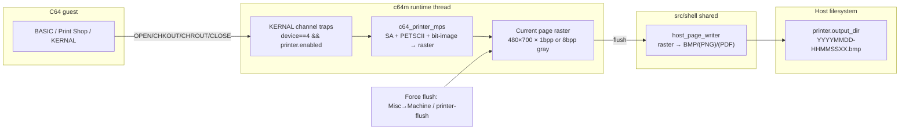

# C64 IEC virtual printer → host page files (v1)

| Field | Value |
|-------|--------|
| Status | **Draft** |
| Author | _(TBD)_ |
| Date | 2026-09-01 |
| Audience | c64m implementers; shell owners of shared host page I/O |
| Product scope | **c64m v1 only** (Apple II printer deferred; shared seams called out) |
| Intended permanent path | `design/c64/iec-printer-host-pages.md` |
| Related TODO | `TODO.txt` — "Add printing to PDF or a REAL printer (Direct IP Printing)" |

## Overview

c64m today has no printer peripheral. Guests that `OPEN 4,4` / Print Shop (MPS path) have nowhere for KERNAL output to land. This design adds a soft-attached **MPS-803-class virtual printer** presented as IEC **device 4**, fed primarily through the same **KERNAL channel-trap family** already used by HostFS (`OPEN`/`CLOSE`/`CHKIN`/`CHKOUT`/`CHRIN`/`CHROUT`/`CLALL` in `src/c64/machine/c64.c`). Guest bytes are rendered into an in-memory page raster; on **flush**, the emulator writes one or more **host page files** (BMP first; PNG later via vendored `stb_image_write`; optional hand-rolled PDF-of-images). The user opens or prints those files manually.

The printer is **default off** (SwiftLink pattern). When disabled, trap handlers do not claim device 4 and idle games pay near-zero cost. The design deliberately does **not** put a fake IEC listener on the bus answering ATN — the same lesson as unpowered 1541s / Edge of Disgrace (`agents/c64/known-gaps.md`, `agents/c64/disk-iec1541.md`). Cross-platform OS spoolers (CUPS/`lp`, Windows print, IPP, raw `:9100`) are **out of v1**; host page files are the handoff artifact those backends would later consume.

## Background & Motivation

### Current state

- Drives are devices **8 and 9 only** (`C64_DRIVE_MIN_DEVICE` / `C64_DRIVE_MAX_DEVICE` in `src/c64/machine/c64.h`). HostFS and IMAGE backends never touch device 4.
- Channel I/O for HostFS is intercepted at KERNAL vector entries when PC hits `$FFC0`/`$FFC3`/`$FFC6`/`$FFC9`/`$FFCF`/`$FFD2`/`$FFE7`, gated first by PC in `c64_step_cycle_internal` then dispatched by `c64_try_kernal_channel_traps` → `c64_try_hostfs_*_trap`. Non-HostFS devices fall through to real KERNAL (and thence to IEC, which has no printer).
- Soft-attach peripherals already exist: SwiftLink (`[swiftlink]` INI, `--swiftlink` / `--no-swiftlink`, **Configure → Emulator** UI next to the “SwiftLink / Turbo232” block in `frontend_draw_config_emulator_tab`, `c64_swiftlink_*` + `runtime_swiftlink_*`). Default off; when off, decode/`owns` checks short-circuit. Misc → Hardware (`frontend_draw_misc_hardware`) is a **debug status** pane (VIC/CIA/SID/1541), not a soft-attach surface.
- Shared shell lives under `src/shell/` (`agents/README.md`). Image **decode** (`stb_image`) is vendored; there is **no** shared page *encoder* and **no** CMake `zlib`/`libpng` link today. Apple/C64 control scripts implement PNG via **Python** stdlib zlib (`write_argb_png` in `tools/apple2/a2m_control_client.py`; `write_indexed_png` in `tools/c64/coop_watch.py`) — a useful *pattern* for a future C encoder in shell, not an existing C API to absorb.
- Apple II has **no SSC / parallel printer card** (`agents/apple2/known-gaps.md`). A later a2m printer design should reuse the **host page writer**, not C64 IEC/MPS code.

### Pain points

1. Cannot validate or enjoy C64 software that expects a printer (BASIC listings, Print Shop cards, educational titles).
2. VICE-style flush pain: many apps leave the last page half-buffered until CLOSE or never; users need an explicit **Force flush**.
3. Always-on IEC printer presence would tax idle titles and risk ATN/DATA clamping bugs already hard-won for drives.
4. License: must not vendor VICE `printerdrv` (GPL-2) or Ghostscript (AGPL). Repo is Unlicense; `external/` is MIT/BSD/PD only.

## Goals & Non-Goals

### Goals (v1)

1. Soft-attach MPS-803-class printer as **device 4** via KERNAL traps (preferred path).
2. Render text (PETSCII / graphic + business modes) and bit-image graphics into a page raster sized for Print Shop success (**480×700** dots canvas; character pitch and bit-image pitch differ — see Key Decisions / MPS semantics).
3. On flush, write host page file(s) under a configurable output directory.
4. Flush on: page-full, CLOSE of the print channel, emulator shutdown/disable, and **Force flush** (UI + control verb). Optionally accept CHR$(12) as an emulator convenience flush (not authentic MPS-803).
5. Default **off**; near-zero cost when disabled.
6. Place **raster → BMP/(PNG)/(optional PDF)** encoding in `src/shell/` so a future Apple printer can reuse it.
7. Keep C64 IEC/MPS/secondary-address logic under `src/c64/`.
8. Document INI/CLI/UI/control surfaces concretely enough to implement without re-litigating product intent.
9. Print Shop (C64, MPS path) is the **graphics** success bar; BASIC `OPEN 4,4` text is the **early** bar — bit-image pitch must be correct before declaring the raster core done.

### Non-Goals (v1)

- Apple II printer / SSC / parallel card (deferred design; shared page writer only).
- OS spooler integration: CUPS/`lp`, Windows GDI/XPS print, IPP, raw JetDirect `:9100`.
- Always-on IEC bus device that answers ATN when the printer is unused.
- Full multi-printer matrix (MPS-801/802/1000, 1525, daisywheel, color).
- Device 5 dual-printer / DIP address switch (optional follow-on; v1 is device 4 only).
- Vendoring VICE printerdrv or Ghostscript.
- Perfect cycle-timed IEC bit-banged printer protocols for non-KERNAL software (acknowledge as risk; trap-only is the bar).
- Snapshot persistence of in-flight page rasters (acceptable to discard buffer on load; optional later).
- Control-port verbs that change printer paths or enable state (`set-printer` / `get-printer` deferred).

### Follow-on (explicit)

- Real-printer backends consuming the same page files or an in-memory raster callback.
- PNG via vendored `stb_image_write` and PDF-of-images once the BMP writer API is stable (PR 6).
- Optional true IEC listen path for bus-banging software, behind a separate flag, still default off.
- `set-printer` / `get-printer` control verbs if scripting needs them (separate wire bump).

## Key Decisions

| Decision | Choice | Rationale |
|----------|--------|-----------|
| Product order | C64 first; Apple deferred | Settled intent; Apple gap is SSC/parallel, not IEC. |
| Guest presentation | **MPS-803-class**, IEC device **4** | Matches Print Shop **MPS** path and BASIC `OPEN 4,4`; richer bit-image than 1525/early-801 text-centric paths; device 5 deferred. |
| Attach model | Soft-attach, **default off** | Same family as SwiftLink; idle cost ≈ zero. |
| Transport | **KERNAL traps** (not always-on IEC peripheral) | HostFS precedent; avoids ATN/DATA bus presence lessons from 1541 soft power. |
| Host sink | **File-only** page images | Manual open/print; spoolers are a later consumer of the same artifact. |
| Page canvas | **480×700** dots (80 cols × up to ~700 vertical dots) | Fits known Print Shop single-page ~693-dot card height; printable BIM width is 480 (80×6). |
| Vertical pitch | **Character LF = 10 dots**; **bit-image LF = 7 dots** | Char cell is VICE-compatible 6×10 choice (not true 12-dot 1/6″); BIM matches MPS 7/72″ / 7-pin advance. Mixing modes uses the pitch of the active mode at LF time. |
| Output formats (v1 train) | **BMP first** (no new deps); PNG/PDF in PR 6 | PNG via **vendored PD encoder** (`stb_image_write` in `external/`); no system zlib. |
| Shared vs product code | Page writer in `src/shell/`; MPS/traps in `src/c64/` | Apple can later feed the same writer from a slot-card path. |
| Enable / config UI | **Configure → Emulator** (beside SwiftLink) | Soft-attach host config; Misc → Hardware is debug status only. |
| Remember output dir | **Yes** — browse-dirs convenience pattern | Add a printer browse slot (bump `APP_BROWSE_DIR_COUNT` / `FRONTEND_BROWSE_SLOT_*`); persist under `[browse]` like other folders; keep `[printer] output_dir` as the active path. |
| Force flush UI | **Misc → Machine** when printer enabled + control verb | Reachable while the emulator is running; not on the Hardware status tab. |
| Control-port v1 | **`printer-flush` only**; bump **`C64M/9` → `C64M/10`** in that PR | Enable/dir/format stay Configure/INI/CLI (SwiftLink-like). No `set-printer` in v1. |
| Session page cap | **500** pages per enable session | Caps runaway FF/CLOSE loops; further writes log+skip until re-enable. |
| CLALL | **Unified virtual-peripheral CLALL** | Close/flush **all** printer + HostFS LAs regardless of LAT order; **RTS only if LAT empty**, else **return false without RTS** so KERNAL finishes foreign LAs. |
| CHR$(12) FF | **Emulator convenience** (optional accept → flush) | Not in authentic MPS-803 control summary; primary flushes are CLOSE / page-full / Force flush. |
| MPS glyph tables | **Implementer choice** if PD-clean | Hand-built or extracted from public manuals; **not** from VICE sources. Not a product fork. |
| License | Reimplement MPS semantics; no VICE printerdrv | Unlicense product; GPL/AGPL forbidden in tree. Public manuals + observed Print Shop behavior are the oracle. |

## Proposed Design

### Architecture



### Soft-attach & configuration (SwiftLink-like)

Mirror `[swiftlink]` / **Configure → Emulator** patterns in `src/c64/app_options.c`, `c64m.ini.example`, and `frontend_draw_config_emulator_tab` (not Misc → Hardware).

**INI (`c64m.ini.example`):**

```ini
[printer]
; Soft-attach MPS-803-class IEC printer (device 4). Default off.
; CLI: --printer / --no-printer,
;      --printer-dir <path>, --printer-format bmp
;      (png|pdf unlock in a later PR with the encoders — do not list early)
; enabled = false
; device = 4
; output_dir = prints
; format = bmp
; ; Optional: paper = letter   (reserved; v1 fixed 480×700 raster)
```

**CLI:**

| Flag | Meaning |
|------|---------|
| `--printer` / `--no-printer` | Enable / disable (default off) |
| `--printer-dir <path>` | Output directory (created if missing); relative paths resolve via `app_options_path_absolute_from_ini` |
| `--printer-format bmp` | Host file format. **v1 = `bmp` only** until PR 6; reject unknown values. PR 6 adds `png`/`pdf` to CLI, INI, and Configure together with the encoders |

**`app_options` fields (proposed):**

```c
bool printer_enabled;          /* default false */
uint8_t printer_device;        /* default 4; v1 only accepts 4 */
char *printer_output_dir;      /* default "prints" */
char *printer_format;          /* "bmp" until PR 6 unlocks "png" | "pdf" */
```

**Runtime enable path:** follow `runtime_swiftlink_set_enabled`: Configure → Emulator Apply posts a runtime command; machine owns `c64_printer` state; enabling with a bad output dir fails soft (log + leave disabled or keep prior). Disabling force-flushes then tears down.

Default output directory: `prints/` under the process cwd (or beside the INI when relative resolution applies). Document in `manual/c64m/manual.md` when the feature lands.

**Remember last output folder:** follow the existing browse-dirs convenience pattern (`browse_dirs[]` / `frontend_browse_slot` / `[browse]` in `c64m.ini.example`). PR 3 adds a printer slot (e.g. `FRONTEND_BROWSE_SLOT_PRINTER`), bumps `APP_BROWSE_DIR_COUNT` from 6→7, and wires Configure’s dir browse so the last chosen folder is restored next session. `[printer] output_dir` remains the active flush target; the browse slot is the file-browser default when picking/changing that dir.

### Page file naming and write timing

| Property | v1 rule |
|----------|---------|
| Directory | `printer_output_dir` (absolute after resolve) |
| Name | `YYYYMMDD-HHMMSSXX.<ext>` — local wall-clock second + two-digit same-second collision counter `XX` (`00`..`99`) |
| Atomicity | Write to `*.tmp` (same basename + `.tmp` suffix) then `rename` into place so viewers never open a half-written file. Implement rename/mkdir **inside `host_page_writer.c`** for v1 (private helpers); do **not** assume `platform_fs` already has them — optional later extract to `platform_fs_mkdir` / `platform_fs_rename` |
| When closed | Only on **flush** — not per CHROUT. Flush completes encode + rename, then clears or advances the raster |
| XX rule | Remember last successful stem `YYYYMMDD-HHMMSS`. If this flush's second matches, increment `XX`; if the second changed, reset `XX` to `00`. Advance stem/`XX` only after a successful write. Cap at `99` (log + retain dirty page). No directory scan for prior files. |
| Logging | `log_info` one line per flushed page (path); `log_error` on I/O failure (page retained in memory for retry via Force flush) |

### Machine module: `c64_printer` (C64-specific)

New files (proposed):

- `src/c64/machine/c64_printer.h` / `c64_printer.c` — MPS-803-class state machine + raster
- Optional split: `c64_printer_mps_font.c` for built-in 6×7 glyphs (graphic + business). **Settled:** implementer may hand-build or extract from public manuals if PD-clean — **not** copied from VICE sources

**State (sketch):**

```c
typedef struct c64_printer {
    bool enabled;
    uint8_t device;           /* 4 */
    /* Secondary-address / mode */
    uint8_t sa;               /* from OPEN */
    bool graphic_charset;     /* SA=0 / CHR$ graphics vs business SA=7 */
    bool enhance;             /* double-width CHR$(14)/CHR$(15) */
    bool reverse;
    bool bit_image;           /* after CHR$(8); left by CHR$(15) or CR semantics as specified */
    /* Cursor / page */
    int cursor_x_dots;
    int cursor_y_dots;
    int page_width_dots;      /* 480 printable */
    int page_height_dots;     /* 700 */
    uint8_t *raster;          /* row-major, 1 bpp packed or 8 bpp; size = w*h/8 or w*h */
    size_t raster_bytes;
    uint32_t pages_flushed;
    uint32_t pages_cap;       /* 500 */
    bool page_dirty;
    /* Parser phase for multi-byte controls (CHR$16 / 26 / 27 sequences) */
    uint8_t parse_state;
    uint8_t parse_buf[4];
    uint8_t parse_need;
} c64_printer;
```

Embed `c64_printer printer;` on `c64_t` (like `c64_swiftlink swiftlink`).

#### Vertical pitch (Print Shop–critical)

| Mode | Line advance on LF / implied CR+LF | Notes |
|------|--------------------------------------|-------|
| Character (text) | **10 dots** | 6×7 glyph inside a 6×10 cell — VICE-compatible convenience vs true 12-dot (1/6″ at 72 DPI). Document the choice; do not silently mix. |
| Bit-image (after CHR$(8)) | **7 dots** | Matches MPS-803 7-pin column and 7/72″ paper advance. **Required** for Print Shop cards. |

Page-full triggers when `cursor_y_dots + advance > page_height_dots` (flush, reset Y to 0, continue).

#### Bit-image protocol sketch (oracle: MPS-803 user guide)

- **Enter BIM:** `CHR$(8)`. Subsequent data bytes are 7-pin columns until leave.
- **Column byte:** bits map to 7 pins; **bit 0 = top pin, bit 6 = bottom pin** (MPS-803 manual bit-image layout). Bits above 6 ignored. Each column advances X by 1 dot.
- **Leave BIM:** `CHR$(15)` (also Enhance OFF / standard character mode per manual); CR also ends enhanced/BIM context as specified in the guide (implement CR → leave BIM + print line).
- **Repeat:** `CHR$(26); CHR$(n); CHR$(data)` — print `data` column `n` times (`n==0` means 256).
- **Head tab (char column):** bare `CHR$(16)` then **two ASCII digit bytes** `"nHnL"` (e.g. `"08"`) → column `0..79` → `cursor_x_dots = col * 6` (clip to 0..479). **Not** a binary multi-byte form — do not parse bare `CHR$(16)` as binary `nH/nL`.
- **Dot address (binary):** `CHR$(27); CHR$(16); CHR$(nH); CHR$(nL)` — start X = `(nH<<8)|nL` in dots, range **0–639** per manual. This is the **only** binary `nH/nL` path. **Printable raster is 480 dots wide:** positions `0..479` apply; `480..639` **clip** (cursor X stuck at 479 / ignore further BIM pins that would draw past edge — log once at debug). Values >639 wrap/reset per manual (“from beginning of line”).

#### MPS semantics (v1 subset — Print Shop is the acceptance gate)

| Feature | v1 | Notes |
|---------|----|-------|
| SA=0 graphic charset (default) | **Required** | |
| SA=7 business charset | **Required** | |
| CHR$(13) CR, CHR$(10) LF | **Required** | Pitch depends on active mode (10 vs 7). |
| CHR$(14) enhance on / CHR$(15) enhance off + leave BIM | **Required** | |
| CHR$(18) reverse on / CHR$(146) reverse off | **Required** | |
| CHR$(8) bit-image enter | **Required** (Print Shop) | 7-pin columns. |
| CHR$(26);n;data repeat | **Required** (Print Shop) | |
| CHR$(16); ASCII `"nHnL"` head tab | **Required** | Two ASCII digits → col `0..79` → `x = col*6`; not binary. |
| CHR$(27);CHR$(16);nH;nL dot address | **Required** (Print Shop) | Binary dots 0–639; clip X≥480 as above. |
| CHR$(17) local business / CHR$(145) local graphic | **Required** | In-band charset switch. |
| CHR$(12) form feed | **Optional emulator convenience** | Not authentic MPS-803; if accepted → flush. Primary flushes remain CLOSE / page-full / Force flush. |
| SA=1..6,9,10 formatting extras | Ignore-with-log | Expand only if a title needs them. |
| Device 5 | Out | |

Page geometry constants (document in header):

```c
enum {
    C64_PRINTER_COLS = 80,
    C64_PRINTER_DOTS_PER_COL = 6,
    C64_PRINTER_CHAR_LF_DOTS = 10,  /* character-mode line pitch */
    C64_PRINTER_BIM_LF_DOTS = 7,    /* bit-image line pitch */
    C64_PRINTER_WIDTH_DOTS = C64_PRINTER_COLS * C64_PRINTER_DOTS_PER_COL, /* 480 */
    C64_PRINTER_HEIGHT_DOTS = 700,  /* Print Shop ~693-dot card headroom */
    C64_PRINTER_DOT_ADDR_MAX = 639, /* MPS addressing API */
    C64_PRINTER_PAGE_CAP = 500
};
```

Glyphs: 6×7 printable dots inside the character cell. Use a **self-contained glyph ROM table** in the printer module rather than reading `character.rom` (VIC charset ≠ MPS glyph shapes). Source is implementer choice (hand-built or public-manual extract) under the PD-clean / no-VICE rule above.

### KERNAL trap integration

Extend the existing PC gate and `c64_try_kernal_channel_traps` — do **not** add a second PC scan.

**Claim rules** (OPEN/CLOSE/CHKOUT/CHROUT — keyed on printer, not drive slots):

1. If `!machine->printer.enabled` → return false immediately (fall through).
2. Read device from ZP `$BA` (OPEN) or LAT/FAT tables (CLOSE/CHKIN/CHKOUT/CHRIN/CHROUT) as HostFS already does.
3. If `device != machine->printer.device` (4) → return false.
4. Else handle and `c64_kernal_rts_return`.

**OPEN (`$FFC0`):** register logical file in KERNAL LAT/FAT/SAT (reuse `c64_kernal_file_table_add`); store SA into printer mode (0 → graphic, 7 → business; others best-effort). Success even if no filename (typical `OPEN 4,4`).

**CHKOUT (`$FFC9`):** if LAT maps to printer device, set `$9A` (DFLTO) to LA; RTS success.

**CHROUT (`$FFD2`):** if DFLTO’s LAT device is printer, feed `A` into `c64_printer_putc`; may trigger flush (optional FF / page-full).

**CLOSE (`$FFC3`):** if LAT maps to printer, **flush** if `page_dirty`, remove LAT entry, reset DFLTO if needed (HostFS already maps DFLTO→3).

**CLALL (`$FFE7`) — unified virtual-peripheral algorithm (normative):**

Today’s `c64_try_hostfs_clall_trap` walks LAT from the head and **returns false on the first non-HostFS entry**, which cannot coexist with interleaved printer LAs. Do **not** ship “printer-first head claim,” and do **not** RTS while foreign LAs remain open (that would diverge from real KERNAL `CLALL` and can cause later FILE OPEN on reused LAs).

Replace HostFS-only CLALL with a single trap helper (name sketch: `c64_try_virtual_peripheral_clall_trap`):

1. **Eligibility:** if `printer.enabled` **or** any HostFS volume is mounted, enter the helper; else return false (real KERNAL CLALL).
2. **One pass over the entire LAT** (any order / interleaving). For each entry:
   - Printer device (and enabled) → flush if dirty (once per shared page as needed), clear printer channel bookkeeping, **remove** LAT entry.
   - HostFS device 8/9 → existing HostFS `close_la` path, **remove** LAT entry.
   - Foreign (screen/keyboard/other) → **leave in LAT**; do **not** abort the scan.
3. Never abort early because a foreign LA sits at the head — finish every printer + HostFS close first.
4. Call `c64_hostfs_close_all` as today’s HostFS path does for mounted volumes; fix **DFLTN/DFLTO** if they pointed at removed LAs (HostFS today forces `0` / `3` when it fully claims).
5. **Terminal rule:**
   - If `LDTND == 0` after the pass → `c64_kernal_rts_return` success.
   - If foreign LAs remain → **return false without RTS** so real KERNAL CLALL closes the rest.
6. Regression tests **must** include: `[HostFS, printer]`, `[printer, HostFS]`, `[printer, HostFS, printer]`, HostFS-only, printer-only, and **mixed virtual + screen/keyboard LA** (assert foreign LAs are gone after the fall-through completes / after a full guest `CLALL`).

Call site inside `c64_try_kernal_channel_traps`:

```c
/* CLALL: unified virtual-peripheral helper (printer + HostFS), not printer-then-HostFS head claim. */
/* OPEN/CLOSE/CHKOUT/CHROUT: try printer (dev 4) then HostFS (8/9). */
```

CHRIN/CHKIN for printer: return false (printer is output-only); KERNAL error path is fine.

**Idle cost:** when disabled, each trap entry is one `enabled` bool check after PC match — same order of magnitude as HostFS “no HostFS mounted” checks. Do not register IEC ATN listeners.

```mermaid
sequenceDiagram
  participant App as Guest (BASIC/Print Shop)
  participant K as KERNAL vectors
  participant T as c64_try_printer_*_trap
  participant P as c64_printer_mps
  participant W as host_page_writer
  participant FS as Host disk

  App->>K: OPEN 4,4 / CHKOUT / CHROUT bytes
  K->>T: PC hit $FFC0/$FFC9/$FFD2
  T->>P: putc / mode from SA
  Note over P: raster dirty; BIM LF=7 / char LF=10
  App->>K: CLOSE 4
  K->>T: CLOSE path
  T->>P: flush if dirty
  P->>W: write_page(raster, format, path)
  W->>FS: atomic rename page file
  Note over App,FS: Force flush: Misc→Machine or printer-flush → same flush path
```

### Flush triggers

| Trigger | Behavior |
|---------|----------|
| Page-full (cursor would leave bottom) | Flush; cursor to top-of-new-page; continue byte |
| CLOSE of printer logical file | Flush if dirty |
| CLALL including printer LA | Flush if dirty (unified virtual CLALL) |
| Disable printer / shutdown | Flush if dirty |
| **Force flush** (Misc → Machine / `printer-flush`) | Flush if dirty; **suppress blank pages** |
| CHR$(12) FF (optional) | Emulator convenience: flush if dirty; **not** required of guest software |

Never write empty/blank pages on force flush unless a debug option is added later. Do **not** rely on guest FF for correct Print Shop / BASIC CLOSE paths.

### Shared host page writer (`src/shell/`)

New module (proposed names):

- `src/shell/util/host_page_writer.h`
- `src/shell/util/host_page_writer.c`

**API sketch:**

```c
typedef enum host_page_format {
    HOST_PAGE_FORMAT_BMP = 0,  /* v1 required */
    HOST_PAGE_FORMAT_PNG,      /* PR 6: stb_image_write */
    HOST_PAGE_FORMAT_PDF_IMAGES
} host_page_format;

typedef struct host_page_image {
    uint32_t width;
    uint32_t height;
    uint32_t stride_bytes;
    /* 8bpp grayscale: 0=black ink, 255=paper; or 1bpp packed with explicit bpp field */
    uint8_t bits_per_pixel; /* 1 or 8 */
    const uint8_t *pixels;
} host_page_image;

bool host_page_writer_write(
    const host_page_image *page,
    host_page_format format,
    const char *path);

bool host_page_writer_ensure_dir(const char *dir_path);
```

**Implementation notes:**

- **BMP (PR 1):** hand-rolled; no new dependencies; default `printer_format`.
- **PNG (PR 6):** **vendor a PD encoder** — add `stb_image_write` (or equivalent PD TU) under `external/stb/`, note it in `external/README.md`, wire a small `stb_image_write` static like existing `stb_image` / `stb_ds`. **No** system zlib / `find_package(ZLIB)` requirement. Do **not** claim an existing C `write_argb_png` in-tree (Python control tools remain pattern-only).
- **PDF:** hand-rolled PDF-of-images; optional after PNG or even wrapping BMP streams; not on the v1 critical path.
- mkdir/rename: **private** to `host_page_writer.c` in PR 1; optionally promote to `platform_fs` later.
- Link into `shell` STATIC in `src/shell/CMakeLists.txt`.
- Unit tests under `tests/shell/` (encode known raster → `BM` magic / size).

**Apple seam:** a2m later produces `host_page_image` from its own printer/card emulator and calls the same writer. Implement the C encoder in shell for both products; Python control-tool PNG helpers remain scripts-only. No `#include` of `c64_printer` from Apple.

### Runtime / UI / control surfaces

| Surface | Behavior |
|---------|----------|
| **Configure → Emulator** | Checkbox **Printer (MPS-803)**; output dir field/browse (remembered via new printer **browse-dirs** slot); format control **bmp only** until PR 6 unlocks png/pdf — same Apply path as SwiftLink |
| **Misc → Machine** | When `printer.enabled`: status (`pages`, `dirty`) + **Force flush** button (runtime command; works while running) |
| Misc → Hardware | **Unchanged** — debug counters only; no printer controls |
| Control port v1 | **`printer-flush`** only; advertise in capabilities; bump hello to **`C64M/10`** in the same PR |
| Disk LEDs | Optional activity blink — nice-to-have, not required |

Force flush must be reachable while the emulator is **running** (runtime command), not only when paused.

### Threading & I/O

- Raster mutation: **runtime/machine thread only** (same as HostFS SEQ writes).
- Encode + file write: preferred on runtime thread for v1 simplicity (pages are ≤ 480×700; BMP encode is cheap). If hitch becomes visible, move encode to a short worker later; keep flush *request* synchronous from the guest’s perspective (CLOSE returns after queueing or after write).
- Inspector sealed replay: mirror HostFS — **do not** mutate host files when `machine->replay_sealed` (accept putc into a throwaway or no-op raster).

### Performance budget

| Mode | Target |
|------|--------|
| Printer disabled | Extra cost ≤ one bool on rare KERNAL PC hits (OPEN/CHROUT family); **no** per-cycle work |
| Enabled, idle (no OPEN) | Same — traps return false after device check |
| Enabled, printing text | Dominated by glyph blit; should be negligible vs VIC paint |
| Flush | One page BMP encode ≪ 10 ms typical; log if slower |

## API / Interface Changes

### Machine

```c
/* c64.h */
void c64_printer_set_enabled(c64_t *m, bool on);
bool c64_printer_enabled(const c64_t *m);
void c64_printer_force_flush(c64_t *m); /* may no-op if !dirty */
```

Trap helpers remain in `c64.c` (or a later `c64_kernal_traps.c` split). CLALL uses the unified virtual-peripheral helper shared with HostFS.

### Runtime client / command

```text
printer-flush
```

Enable/dir/format: Configure Apply / INI / CLI only (like SwiftLink). **No** `set-printer` / `get-printer` in v1 — avoids control-port path policy and keeps the wire bump minimal (`C64M/9` → `C64M/10` when `printer-flush` is advertised).

### Shell

`host_page_writer_*` as above; no machine types in the header.

## Data Model Changes

- No disk image / D64 schema changes.
- Snapshot (`.c64state`): **v1 recommendation** — do not persist raster; on load, printer config comes from host options (like SwiftLink host session drop). Document in snapshot notes if a later version adds a `PRNT` chunk.
- INI new section `[printer]`; update `c64m.ini.example` in the same change as `app_options` keys (`agents/README.md` rule).

## Alternatives Considered

### 1. Real IEC peripheral vs KERNAL traps

| | IEC bus device | KERNAL traps (chosen) |
|--|----------------|------------------------|
| Compatibility | Catches some bus-banging printers | Covers KERNAL OPEN/CHROUT path (BASIC, most apps) |
| Idle cost | ATN-ack risk if present when unused | Near zero when disabled; no bus presence |
| Complexity | VIA/CIA serial, timing | Reuse HostFS trap machinery |
| Lesson fit | Conflicts with soft-power IEC lessons | Matches HostFS “not iec_active” philosophy |

**Choice:** traps for v1. Optional IEC listen is a follow-on flag, still default off.

### 2. Auto-`lp` / OS print vs manual files

| | Auto spool | Manual files (chosen) |
|--|------------|------------------------|
| UX | One-click paper | User opens BMP/PNG/PDF |
| Portability | CUPS vs Windows vs macOS Print diverges | One code path |
| Debuggability | Harder to inspect | Files are artifacts for tests + bug reports |
| Future | Can consume files/`host_page_image` | Files remain the interchange |

**Choice:** files only in v1; real printer is explicit non-goal.

### 3. Vendor VICE printerdrv vs reimplement

| | Vendor VICE | Reimplement (chosen) |
|--|-------------|----------------------|
| Speed to Print Shop | Faster initially | More work |
| License | **GPL-2 — forbidden** | Unlicense-compatible |
| Fit | VICE-centric APIs | Native `c64_t` / traps |

**Choice:** reimplement. Use public MPS-803 manuals and observed Print Shop behavior as oracle; VICE **binary** may be a manual oracle only (not source).

### 4. BMP first vs PNG/PDF default

| | PDF/PNG default | BMP first (chosen for PR 1) |
|--|-----------------|-----------------------------|
| User print UX | Better “document” | Need viewer; still printable |
| Build | Needs vendored PD encoder (PR 6) | Zero new deps |
| Tests | Heavier | `BM` magic-byte easy |

**Choice:** BMP is the v1 default sink; PNG/PDF are follow-on formats on the same API.

### 5. MPS-803-class vs 1525 / MPS-801 matrix

| | 1525 / early MPS-801 | MPS-803-class (chosen) |
|--|----------------------|-------------------------|
| Print Shop | Often listed as separate printer types | **MPS** path is the graphics success bar |
| Bit-image | Weaker / different | 7-pin BIM + dot address used by card art |
| Scope | Smaller text subset | Slightly more protocol work |

**Choice:** one MPS-803-class device. Do not ship a multi-emulation matrix in v1.

## Security & Privacy Considerations

| Threat / issue | Severity | Mitigation |
|----------------|----------|------------|
| Path traversal via `output_dir` | Medium | **v1:** path is set only via Configure / INI / CLI (`app_options_path_absolute_from_ini`); control port **cannot** change `dir`. UI browse uses existing dialogs. |
| Disk fill (runaway flush loop) | Low–Med | Hard cap **500** pages per enable session; then log + skip writes until disable/re-enable |
| PII in printouts on shared machines | Low | Local files only; no network sink in v1 |
| Control-port flush without auth | Low | Existing single-client local control model; `printer-flush` writes only under the already-configured dir |

No guest-supplied filenames reach the host path in v1 (names are generated). If a future `set-printer dir=…` verb appears, it must define an allowlist root (e.g. only absolute paths under cwd or INI directory after normalize) in that design delta.

## Observability

- `log_info("printer: wrote %s (%ux%u)", path, w, h);`
- `log_warn` on blank flush suppressed / page cap hit; `log_error` on encode/I/O failure.
- Misc → Machine status when enabled: `Printer: on | pages N | dirty`.
- Tests: `tests/c64/machine/test_c64_printer_*.c` for putc/BIM pitch/CLOSE/unified CLALL; `tests/shell/test_host_page_writer.c` for BMP encode.

No new metrics daemon; host_log is enough for v1.

## Rollout Plan

1. **Feature flag = soft-attach default off** — shipping enabled code paths is safe; users opt in via `--printer` or INI.
2. Land shell writer + C64 traps behind that flag in incremental PRs (see PR Plan). First landing PR adds this doc as **active** in `design/README.md`.
3. Manual smoke: BASIC `OPEN 4,4:PRINT#4,"HELLO":CLOSE 4` → one BMP; Print Shop MPS path → card art (gate before calling graphics “done”).
4. Rollback: disable INI/`--no-printer` or revert PRs; no migration of user data beyond leftover files in `prints/`.
5. After land: update `design/README.md` index (active → landed), fold durable rules into `agents/c64/` + `manual/c64m/manual.md`.

## Risks

| Risk | Severity | Mitigation |
|------|----------|------------|
| Print Shop page height / BIM pitch mismatch | **High** | 700-dot canvas; **char LF=10 / BIM LF=7**; BIM protocol tests in PR 2; Print Shop smoke before polish PR |
| PETSCII graphic vs business mode wrong glyphs | Medium | Dual charset tables; SA=0/7 + CHR$(17)/CHR$(145); visual goldens when assets allow |
| Bit-image / dot-address / repeat gaps | Medium | Required control table above; clip X≥480; spike against Print Shop early |
| Trap-only misses bus-banging software | Medium | Document known gap; follow-on IEC path if demanded |
| CLALL interleaved LAT with HostFS / foreign LAs | Medium | Unified scan of all virtual LAs; RTS only if LAT empty; else fall through without RTS; mixed-order + screen-LA tests |
| Flush I/O hitch on runtime thread | Low | BMP is cheap; measure; defer encode to worker if needed |
| Snapshot/load leaves stale dirty page expectation | Low | Discard raster on load; document |

## Open Questions

No open product questions remain. Settled answers (also in Key Decisions):

| Former question | Decision |
|-----------------|----------|
| Glyph source | Implementer choice if PD-clean (hand-built or public-manual extract); never VICE sources |
| PNG dependency | Vendor PD encoder (`stb_image_write` in `external/`); no system zlib |
| Remember `output_dir` | Yes — printer browse-dirs slot + `[browse]` persistence (PR 3) |

Implementer note (not a product fork): PR 4 should still include a mixed virtual + screen-LA regression to confirm the settled CLALL fall-through path.

## References

- `TODO.txt` — printing TODO
- `agents/README.md` — shell vs product layout; INI example rule
- `agents/c64/disk-iec1541.md` — HostFS traps, soft power, no ATN when unused
- `agents/c64/known-gaps.md` — devices 8/9 only today; IEC ATN lesson; wire bump rule
- `agents/c64/control-port.md` — `C64M/N` identity
- `agents/apple2/known-gaps.md` — no SSC/parallel (deferred Apple printer)
- `src/c64/machine/c64.c` — `c64_try_hostfs_*_trap`, `c64_try_kernal_channel_traps`, KERNAL entry constants
- `src/c64/machine/c64_swiftlink.*`, `src/c64/runtime/runtime_swiftlink.*`, `c64m.ini.example` `[swiftlink]` — soft-attach pattern
- `src/c64/frontend/frontend.c` — `frontend_draw_config_emulator_tab` (SwiftLink UI); `frontend_draw_misc_hardware` (debug only); Misc → Machine tab
- `src/shell/CMakeLists.txt`, `src/shell/platform/platform_fs.*` — shared library / FS helpers (cwd/list/is_dir/join only today)
- `tools/apple2/a2m_control_client.py` — Python `write_argb_png` (pattern only)
- `design/README.md` — design doc index conventions
- MPS-803 user/service manuals: 80 columns, 6×7 matrix, 7-dot bit-image, CHR$(8)/14/15/16/17/18/26/27/145/146, SA graphic/business, IEC device 4/5 (behavioral oracle only — do not copy VICE sources)

---

## PR Plan

Incremental, each PR independently reviewable and mergeable. Printer remains default-off until the end-to-end path works.

### PR 1 — Shared `host_page_writer` (BMP) + design index

- **Title:** `shell: add host_page_writer (BMP page encode)`
- **Files/components:** `src/shell/util/host_page_writer.{c,h}`, private mkdir/rename helpers, `src/shell/CMakeLists.txt`, `tests/shell/test_host_page_writer.c`, ctest registration, `design/README.md` (add this doc as **active**), move/copy design to `design/c64/iec-printer-host-pages.md` when accepted
- **Dependencies:** none
- **Description:** Raster→BMP API with atomic `*.tmp` rename and `ensure_dir`. **No PNG** in this PR (PD `stb_image_write` lands in PR 6). No c64m UI yet. Design index already lists this doc as **active** when the permanent path is present.

### PR 2 — `c64_printer` MPS raster core with BIM pitch

- **Title:** `c64m: add c64_printer MPS-803 raster core (char+BIM pitch)`
- **Files/components:** `src/c64/machine/c64_printer.{c,h}`, glyph tables, unit tests for putc/CR/LF (**10 vs 7**), page-full, CHR$(8)/26/27/16 subset, CMake
- **Dependencies:** PR 1 (flush-to-temp via writer or mock)
- **Description:** In-memory printer + 480×700 raster. Success criteria include bit-image LF=7 and repeat/dot-address clip tests — not text-only. No KERNAL integration yet.

### PR 3 — Soft-attach options + Configure → Emulator UI

- **Title:** `c64m: [printer] INI/CLI + Configure Emulator soft-attach (default off)`
- **Files/components:** `src/c64/app_options.{c,h}` (`APP_BROWSE_DIR_COUNT` 6→7), `frontend.h` (`FRONTEND_BROWSE_SLOT_PRINTER`), `c64m.ini.example` (`[printer]` + `[browse] printer=`), runtime apply-config (SwiftLink analogue), `frontend_draw_config_emulator_tab` (enable/dir/format beside SwiftLink; dir browse remembers last folder), manual stub optional
- **Dependencies:** PR 2
- **Description:** Mirror SwiftLink enable path on the **correct** Configure surface. Format UI / INI / CLI accept **`bmp` only** (do not list or select `png`/`pdf` until PR 6). Remember last output folder via the new browse-dirs slot. Enabling constructs printer state and resolves `output_dir`; disabling flushes. Still no traps — enable alone does not affect guest yet. No Force flush here (that is live Misc → Machine).

### PR 4 — KERNAL traps + BASIC bar + unified CLALL

- **Title:** `c64m: KERNAL traps for printer device 4 + unified virtual CLALL`
- **Files/components:** `src/c64/machine/c64.c` (`c64_try_printer_*_trap`, replace HostFS-only CLALL with unified helper), tests for OPEN/CHKOUT/CHROUT/CLOSE/CLALL mixed LAT + HostFS coexistence, BASIC smoke
- **Dependencies:** PR 2, PR 3
- **Description:** Claim device 4 when enabled; feed CHROUT into MPS core; CLOSE/page-full flush to `printer_output_dir`. Establishes BASIC `OPEN 4,4` success bar. Unified CLALL: close all printer+HostFS LAs, RTS iff LAT empty else fall through without RTS; mixed-order + foreign-LA regressions required.

### PR 4a — Print Shop MPS smoke (acceptance gate)

- **Title:** `c64m: Print Shop MPS path smoke checklist / fixes`
- **Files/components:** `c64_printer` BIM/SA fixes as discovered; manual or asset-gated smoke notes under `tests/c64` / `manual/c64m`; agents note
- **Dependencies:** PR 4
- **Description:** Run Print Shop (MPS printer type) end-to-end; fix pitch/control gaps that block a single-page card. May be a short fix PR series, but **graphics is not “done” until this gate passes**. Keep PDF out of this PR.

### PR 5 — Force flush (Misc → Machine) + `printer-flush` wire bump

- **Title:** `c64m: printer Force flush (Misc Machine + printer-flush, C64M/10)`
- **Files/components:** `src/c64/frontend/frontend.c` (Misc → Machine), runtime command path, `control_verbs.c` / protocol / hello **`C64M/9` → `C64M/10`**, `manual/c64m/manual.md`, `agents/c64/control-port.md` (+ known-gaps if needed)
- **Dependencies:** PR 4 (ideally after 4a)
- **Description:** Live Force flush button when printer enabled; scriptable `printer-flush`. Document flush triggers (CLOSE / page-full / Force flush primary; FF optional). Wire bump in the **same** change as the new verb.

### PR 6 — Optional PNG/PDF formats (follow-on)

- **Title:** `shell/c64m: host_page_writer PNG/PDF (stb_image_write)`
- **Files/components:** `external/stb/stb_image_write*` (+ `external/README.md` / `external/CMakeLists.txt` static like `stb_image`); `host_page_writer` PNG (+ hand-rolled PDF-of-images); `app_options` / CLI / Configure format vocab unlock; `c64m.ini.example`; tests
- **Dependencies:** PR 1; PR 3 (format UI exists); usable any time after PR 4 for users
- **Description:** Vendor **PD** `stb_image_write` (no system zlib). Land PNG (and optional PDF) encoders and **simultaneously** unlock `png`/`pdf` in INI/CLI/Configure (until then those values are rejected / not listed). Not required to close the Print Shop bar. Update `design/README.md` toward landed when the v1 file sink + traps + flush UX are in; fold invariants into `agents/c64/`.

### PR 7 (optional, out of v1) — Real printer backends

- **Title:** `shell/c64m: optional OS print backend consuming page files`
- **Files/components:** platform-specific spool helpers; INI `sink=file|lp|…`
- **Dependencies:** PR 6 or BMP-only v1
- **Description:** Out of v1 scope; listed so file pages remain the intentional handoff artifact.
