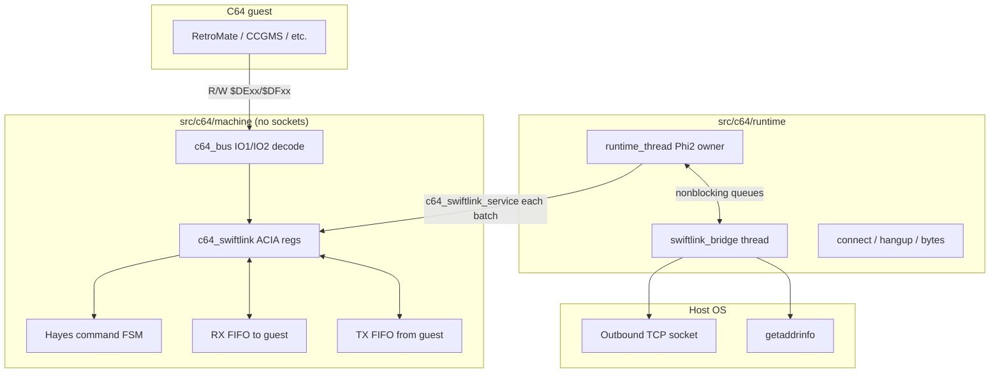
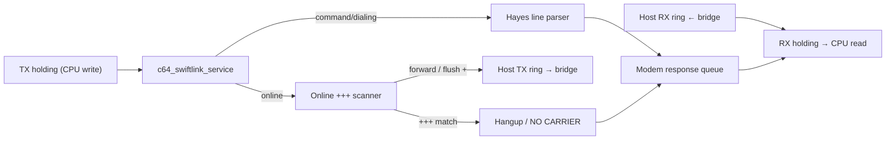
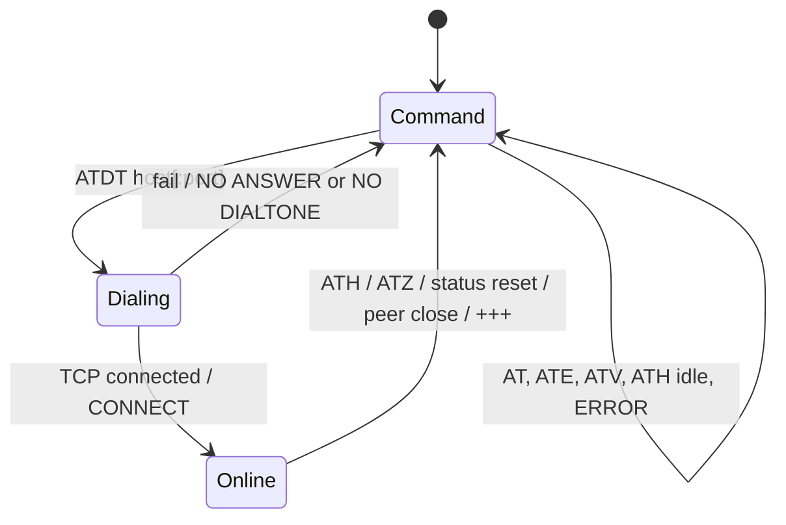
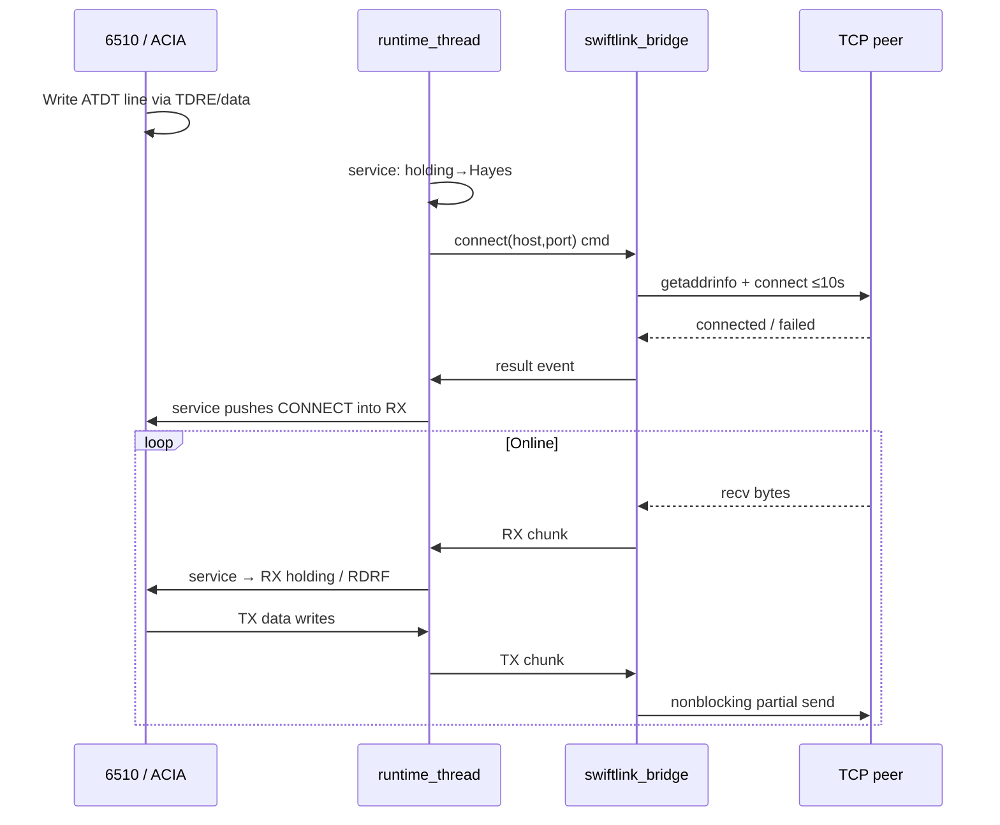

# c64m SwiftLink / Turbo232 (TeensyROM model)

| Field | Value |
|-------|--------|
| Status | **Landed** |
| Author | _(implementer)_ |
| Date | 2026-08-31 |
| Audience | c64m implementers |
| Canonical path | [`design/c64/swiftlink-teensyrom.md`](swiftlink-teensyrom.md) |

## Overview

c64m will emulate a **SwiftLink / Turbo232** cartridge — a 6551 ACIA at `$DE00` or `$DF00` with Turbo232 enhanced baud at base+`$07` — using the **TeensyROM model**: guest software speaks a Hayes AT command subset over the ACIA byte stream, and the emulator embeds a small modem that opens and closes **outbound TCP** connections. This is explicitly **not** VICE+tcpser, IP232, or a raw null-modem tunnel for v1.

Success bar: RetroMate’s TeensyROM C64 build (`USE_TR`) can `ATDT`, exchange data with FICS (or a local echo stand-in), and hang up via **status-register write**. Polled terminals in the CCGMS class should work (including `+++` escape hangup). Configuration lives in **Misc → Machine → Configure… → Emulator tab**, underneath the existing CRT display controls. Concrete acceptance steps are in [Testing Plan](#testing-plan).

## Background & Motivation

### Current state

- User-port CIA RS-232 is listed as a gap in [`agents/c64/known-gaps.md`](../../agents/c64/known-gaps.md). That is a **different** interface (CIA FLAG/SP/PC user-port path). SwiftLink is expansion-port I/O via IO1/IO2 and must be tracked as its own feature.
- Existing CRT mappers (Ocean, Magic Desk, Fun Play, C64GS, Dinamic) already decode **IO1 `$DE00–$DEFF`** in [`src/c64/machine/c64_bus.c`](../../src/c64/machine/c64_bus.c). Super Games uses **IO2 `$DF00–$DFFF`**. Attach policy must be mutually exclusive or clearly conflict-handled.
- Host networking in-tree today is **inbound-only**: the control server (`src/c64/control/control_server.c`) listens on localhost via [`platform_socket`](../../src/shell/platform/platform_socket.h). There is no outbound `connect()`. Existing `platform_socket_write_all` **blocks up to 5s** on `EWOULDBLOCK` — unusable on the SwiftLink bridge.
- Architecture ([`agents/c64/architecture.md`](../../agents/c64/architecture.md)): **four** threads today; machine must not include platform/socket headers; runtime owns the live `c64_t`; UI never touches the machine directly. This feature adds a **fifth** dedicated bridge thread (see Key Decisions).

### Pain points this solves

Retro software and modern TeensyROM-style builds (RetroMate FICS client, CCGMS) expect a SwiftLink ACIA + Hayes modem, not a raw TCP pipe and not user-port bit-banging. Without this, c64m cannot run that software class against real hosts (FICS, BBS telnet).

### Reference guests

| Guest | Path / notes |
|-------|----------------|
| RetroMate TeensyROM | `../retromate/src/c64/swlinkC64.s`, `platC64net.c` (`USE_TR`): base `$DE00`, Turbo232 `$DE07`, IRQs off (polled), dials `ATDT host:port\n`, hangup via **any write to status** (`_sw_shutdown`). Does **not** use `ATH` or wait for `CONNECT` — it polls RDRF/TDRE only. |
| TeensyROM docs | Hayes subset, `$DExx`, responses `OK` / `CONNECT` / `NO CARRIER` / `NO ANSWER` / `ERROR`. TeensyROM’s own `ATH` is a dummy OK; disconnect is `+++`. c64m **intentionally diverges** on ATH (see Key Decisions). |
| CCGMS class | Polled SwiftLink/Turbo232 terminals; often uses `+++` to hang up. IRQ/NMI optional later. |

## Goals & Non-Goals

### Goals (v1)

1. Functional 6551 register map at `$DE00` or `$DF00`, plus Turbo232 `$xx07`.
2. Embedded Hayes subset sufficient for RetroMate and CCGMS-class dial/hangup (including `+++`).
3. Outbound TCP bridge that never blocks the 6510 hot loop.
4. Clear attach/enable policy vs CRT IO1/IO2 mappers.
5. Config surface: INI + CLI + Emulator-tab UI under CRT.
6. Explicit snapshot / Inspector / reset policy for host TCP.
7. Unit tests for ACIA + Hayes; documented manual RetroMate acceptance checklist.

### Non-Goals (v1)

- VICE+tcpser / rs232net / IP232 / raw null-modem byte tunnel.
- A second “backend switch” (ACIA now + external tcpser later). v1 ships one model only; tcpser stays rejected even as a hidden option.
- Inbound TCP “answer the phone” (`ATA`, listen socket for dial-in).
- Full Hayes / TeensyROM Ethernet config AT set (`AT+DHCP`, `AT+MAC`, `ATC`, `ATBROWSE`, …).
- User-port CIA RS-232 (separate gap).
- Cycle-accurate baud-rate pacing as a correctness requirement (deliver ASAP like TeensyROM; optional pacing later).
- IRQ or NMI delivery (v1 default **none**; register bits may be written but no CPU interrupt).
- PETSCII↔ASCII translation inside the modem (guest/app responsibility; RetroMate converts on send).
- Surviving TCP across snapshot load or Inspector re-execute.

## Key Decisions

| Decision | Choice | Rationale |
|----------|--------|-----------|
| Product model | TeensyROM-shaped: ACIA + embedded Hayes + outbound TCP | Locked; matches RetroMate/`USE_TR` and CCGMS-on-TeensyROM |
| Rejected v1 models | VICE+tcpser; raw TCP tunnel / IP232; no hybrid/hidden tcpser backend | Extra host process or non-Hayes guest expectations; see Alternatives |
| Base address | Default `$DE00`; optional `$DF00` | Hardware reality; RetroMate uses `$DE00` |
| IRQ mode v1 | **None** (polled only) | RetroMate and many terminals poll RDRF/TDRE; avoids NMI/IRQ PLA work |
| DCD presentation | SwiftLink pin-swap: CD on status **bit 6**; 6551 inverted sense (**0** = carrier asserted) | Matches CMD SwiftLink pin swap + 6551 datasheet. Pokefinder “1 = Carrier present” is a **known-wrong soft doc** — do not “fix” to it |
| Baud | Accept control/`$DE07` writes; **do not** gate host throughput on baud in v1 | TeensyROM delivers ASAP; RetroMate only needs RDRF/TDRE |
| TX / TDRE model | **1-byte TX holding** + TX ring; **TDRE=1 iff holding empty**; `service` moves holding→ring/Hayes/online TX | Matches RetroMate’s poll-bit-4-then-`sta data` loop; unambiguous under turbo |
| Mode × data path | Command/dialing: TX→Hayes parser, RX←modem responses. Online: TX→**escape scanner then** bridge TCP (or hangup on `+++`), RX←peer. Bus handlers O(1) holding only | Prevents ATDT/online corruption; CCGMS `+++` must not be a no-op |
| TCP ownership | **Dedicated bridge thread** `"c64m-swiftlink"` via `thread_create` / `thread_join` (fifth thread when live); SPSC byte FIFOs + small cmd/event queue | No worker pool exists; sockets must leave Phi2. `architecture.md` becomes five threads when the bridge is running |
| Bridge lifetime | **Lazy:** create on first successful enable; join/destroy on disable and on runtime destroy. Absent when SwiftLink is disabled | Avoid an idle fifth thread when the feature is off |
| Hangup | **Hayes-classic ATH** hangs up (intentional divergence from TeensyROM’s dummy ATH); also `ATZ`, **status-register write** (RetroMate), peer close, and **`+++`** escape | RetroMate uses status write; CCGMS needs `+++`; classic ATH is useful and tested |
| `+++` timing (v1) | **Simplified contiguous triple-`+`** (escape scanner). Full Hayes **1s guard-time** is **PR7** only if CCGMS smoke needs it | Enough for CCGMS-class success bar without over-building v1 |
| ATE / ATV syntax | Accept both `ATE0`/`ATE1` **and** `ATE=0`/`ATE=1` (same for `ATV`) | TeensyROM docs use `=`; many guests omit it |
| Dial defaults | Default port **23**; verbose responses default; max AT line **128** bytes; `ATV0` numeric implemented in v1 tests | Freeze guest-visible Hayes defaults |
| IO page reserve | Only the **selected** base page (`$DExx` *or* `$DFxx`) is reserved while enabled — never both | Matches hardware single-base cart |
| Attach vs CRT | Mutually exclusive with IO1-claiming mappers at `$DE00`; mutually exclusive with Super Games (IO2) at `$DF00` | Prevent silent bank/ACIA fights |
| Enable authority | **Host/`app_options` owns enable+base**; never serialized as session truth | Soft-attach like TeensyROM Special IO; survives load independently of chip regs |
| Snapshot `SLNK` | Additive optional chunk: **chip regs + Hayes mode only** (no enable/base, no TCP). **No `C64_SNAPSHOT_VERSION` bump** (loader skips unknown tags). Missing `SLNK` → cold ACIA; leave host enable as-is. Load/land/reset always hang up TCP and clear FIFOs/CD | Matches `c64_snapshot.c` `default:` skip; avoids VERSION_MIN churn |
| Configure conflict UX | Runtime refuses enable and publishes an **error event** after Apply; **no sync preflight in v1**. Dialog does **not** promise `dialog->error` | Configure Apply is async; cart type lives on runtime `c64_t`. Optional preflight later if UX hurts |
| CRT vs SwiftLink conflict on load | **Refuse CRT load** while SwiftLink enabled and cart claims the same IO page | Explicit; no silent auto-disable |
| RetroMate acceptance | **Manual** checklist in design/PR descriptions; **do not vendor** RetroMate into `machines` until a sample is deliberately added later | Keeps the monorepo free of a third-party app tree for v1 |
| UI placement | Emulator tab, **after** `frontend_preview_crt_options`, still inside the tab — not part of CRT live-preview | Locked placement; Cancel restores SwiftLink via normal dialog original, not CRT preview |

## Proposed Design

### Component diagram



### Layering (matches `agents/c64/architecture.md`)

| Layer | Responsibility | Must not |
|-------|----------------|----------|
| `c64_swiftlink` (new, under `machine/`) | 6551 regs, status bits, Turbo232 `$07`, Hayes FSM, RX/TX byte rings visible to CPU | Include `platform_socket`, block, DNS |
| `c64_bus` / `c64_io_*` | Decode IO1/IO2 when SwiftLink enabled; skip cart IO1 side-effects when conflict policy says SwiftLink owns the range | Open sockets |
| `runtime` + bridge | Own TCP lifecycle; pump bytes into machine FIFOs between Phi2 batches; apply enable/base from options | Be called from SDL or control socket thread against live `c64_t` |
| `platform_socket` | Outbound connect + **nonblocking** partial write + `wait_writable` | Know C64; be used via `write_all` on the bridge |
| frontend / `app_options` | INI/CLI/UI | Touch ACIA directly |

### Mode × data-path table (locked)

Bus `read`/`write` on the data register only touch **holding registers** (O(1)). All Hayes advancement and bridge byte movement happen in `c64_swiftlink_service` on the **runtime thread**.

| Modem mode | Data-reg **write** (after `service` drains holding) | Data-reg **read** source | Who produces RX bytes |
|------------|------------------------------------------------------|--------------------------|------------------------|
| **Command** | Byte appended to Hayes line buffer (echo to RX if `ATE` on) | Modem response queue | Hayes FSM (`OK`, `ERROR`, …) |
| **Dialing** | Same as command (usually idle waiting for connect result); further AT lines rejected/`ERROR` until settle | Modem responses (`CONNECT` / `NO ANSWER` / …) | Hayes FSM + connect-result hook |
| **Online** | Byte → **online escape scanner**, then host TX ring (see below). Not a blind bypass. | Peer TCP bytes via host RX ring | Bridge thread ← TCP; hangup responses from modem |
| **After status write / reset** | Command mode; rings flushed | Empty until next response | — |

Online peer close or command-path hangup (`ATH` / `ATZ` / `+++`) → deassert CD, enqueue `NO CARRIER\r` (or numeric `3\r`), return to **Command**. Status-register write hangup is **silent** (no AT response bytes).

#### Online escape scanner (locked, v1 simplified)

While **online**, `c64_swiftlink_service` does **not** forward every TX byte straight to TCP. It runs a small escape scanner **before** the host TX ring:

1. Maintain an escape buffer of 0..2 pending `+` bytes (withheld from the wire).
2. On byte `$2B` (`+`): append to escape buffer. If the buffer reaches **three** `+` with no other bytes between → **match**: discard the three `+` (never send to TCP); latch hangup (`C64_SWIFTLINK_HOST_REQ_HANGUP`); deassert CD; enqueue `NO CARRIER`; enter **Command**. Clear escape buffer.
3. On any other byte (abort): **flush** any buffered `+`s into the host TX ring first, then forward the aborting byte to the host TX ring; clear escape buffer.
4. Full Hayes 1-second guard-time before/after `+++` is **out of v1** (PR7). v1 only requires contiguous triple-`+` with no intervening bytes.



### ACIA register map

Base = `$DE00` or `$DF00` (host config). Offsets:

| Offset | Name | Read | Write |
|--------|------|------|-------|
| `+0` | Data | Pop RX holding byte; clear RDRF | Load **TX holding** (only legal when TDRE=1); clear TDRE |
| `+1` | Status | See bits below | **Any write = chip reset** (+ hangup / return to command mode) |
| `+2` | Command | Last written | Parity/echo/IRQ enables/RTS/DTR semantics (store; IRQ unused in v1) |
| `+3` | Control | Last written | Stop bits / word length / baud nibble; `baud=0000` selects Turbo232 enhanced |
| `+7` | Turbo232 | Mode bit + enhanced baud | Enhanced baud when control baud nibble is 0 |

Unmapped offsets in the selected base page: return `$FF` / ignore writes (same as empty IO today). While SwiftLink is enabled, the **entire selected page** (`$DExx` or `$DFxx`) is reserved so cart latches cannot share it. The other I/O page is untouched.

#### TX holding / TDRE (locked)

1. CPU may write data **only when TDRE=1** (guest software must poll; writes while TDRE=0 are ignored or overwrite holding — **specify ignore** to match “not ready”).
2. Write loads the 1-byte TX holding register and sets **TDRE=0**.
3. `c64_swiftlink_service` copies holding into (a) Hayes line buffer (command/dialing), or (b) the **online escape scanner** (which may buffer `+`, flush to host TX ring, or hang up), then sets **TDRE=1** once holding is consumed (escape-buffered `+` still counts as consumed from holding).
4. If the destination (Hayes line or host TX ring, including flush of buffered `+`s) cannot accept, leave TDRE=0 and retry next `service` (back-pressure).
5. **TDRE=1 iff TX holding is empty** (ready for guest write).

Unit test (PR1/PR2): burst-write a full `atdt127.0.0.1:1234\n` the way RetroMate fills its send buffer then polls TDRE each byte in `_plat_net_update`.

#### Status register (read)

| Bit | Meaning | v1 behavior |
|-----|---------|-------------|
| 7 | IRQ flag | 0 always (no IRQ/NMI) |
| 6 | Carrier (SwiftLink-swapped CD) | **0** = carrier present (line asserted); **1** = no carrier. Assert present after successful `CONNECT`; clear on hangup / peer close |
| 5 | DSR (swapped) | Hold ready (**0**) when enabled |
| 4 | TDRE | **1** iff TX holding empty |
| 3 | RDRF | **1** when RX holding has a byte |
| 2 | Overrun | Set if a new RX byte is offered while RX holding still full; clear on status read |
| 1 | Framing | 0 |
| 0 | Parity | 0 |

**RetroMate needs only bits 3 and 4** (`swlinkC64.s` `_plat_net_update`).

**DCD polarity:** CMD SwiftLink swaps modem DCD onto the ACIA pin the datasheet calls DSR, so software-visible CD is **status bit 6**. The 6551 senses active-low: **0 = asserted**. The pokefinder Turbo232 register text (“Bit 6 Carrier Detect: 1 = Carrier present”) is a **known-wrong soft doc** — implementers must not invert to match it. Guests that only poll RDRF/TDRE (RetroMate) are unaffected.

#### Command / control (v1)

- Store values for readback.
- Command bit 1 (receiver IRQ disable) and bits 3–2 (tx IRQ/RTS): stored; **no IRQ line**.
- Control baud nibble and `$xx07`: stored; **throughput not baud-gated** in v1.
- After reset (status write or cold ACIA): TDRE=1, RDRF=0, no carrier, command mode. Guest typically writes control `$10`, turbo `$00`, command `$0B` (RetroMate `_sw_init`).

### Hayes modem subset (v1)

#### Modes



#### Line parsing rules (locked)

- Case-insensitive.
- Line ends on `CR` (`$0D`) and/or `LF` (`$0A`); either delimiter completes the line; CR+LF counts as one end.
- Max AT line length **128** bytes (excluding delimiter). Longer → discard line, respond `ERROR`.
- Leading whitespace ignored; **no** embedded spaces in `ATDT` host/port (TeensyROM style).
- Default port when `ATDT` has no `:port`: **23**.
- Verbose responses default (`ATV1`); numeric `ATV0` supported and covered in unit tests.
- Echo (`ATE1` default): echo command-mode bytes into RX as they are accepted from TX holding.

#### Commands

| Command | Behavior |
|---------|----------|
| `AT` | Respond `OK` |
| `ATZ` | Soft reset modem settings (echo/verbose defaults). Hangup/response: see **ATZ response matrix** below (not “ATH then OK”). |
| `ATDT<host>` or `ATDT<host>:<port>` | Enter dialing; request bridge connect. Default port 23. |
| `ATH` / `ATH0` | See ATH response matrix below (**Hayes-classic hangup**; intentional divergence from TeensyROM’s dummy ATH) |
| `ATE0` / `ATE1` or `ATE=0` / `ATE=1` | Local echo off/on |
| `ATV0` / `ATV1` or `ATV=0` / `ATV=1` | Numeric / verbose responses |
| `+++` (online only; via escape scanner) | Hang up; emit **`NO CARRIER` only**; command mode. Contiguous triple-`+`; full 1s guard-time is PR7 |
| *(status write)* | Chip reset + hangup; flush FIFOs (including escape buffer); command mode; **no** AT response bytes (hardware reset). **This is RetroMate’s hangup path.** |
| Unknown / bad syntax | `ERROR` |

**Out of v1 (respond `ERROR`):** `ATI`, `AT?`, `ATC`, `AT+*`, `ATA`, listen/`S0`, phonebook, `ATBROWSE`.

#### ATH response matrix (locked)

| Prior state | Action | Response (verbose) | Response (numeric) | Resulting mode |
|-------------|--------|--------------------|--------------------|----------------|
| Command (idle) | `ATH` / `ATH0` | `OK` | `0` | Command |
| Dialing | `ATH` / `ATH0` | Cancel dial; `NO CARRIER` | `3` | Command |
| Online | *(not via data path in v1)* | — | — | — |

Note: TeensyROM documents `ATH` as “dummy OK; use `+++`.” c64m accepts Hayes-classic `ATH` in **command/dialing** (intentional divergence). **v1 online hangup is `+++` / status-write / peer close** — online TX is escape-scanner + TCP, so `ATH` bytes would be payload. Classic “`+++` → command mode with carrier, then `ATH`” remains PR7 if CCGMS smoke needs it. RetroMate uses status write.

#### ATZ response matrix (locked)

`ATZ` always restores echo/verbose defaults after the action below. **One response only** — no trailing extra `OK` after `NO CARRIER`.

| Prior state | Action | Response (verbose) | Response (numeric) | Resulting mode |
|-------------|--------|--------------------|--------------------|----------------|
| Command (idle) | Reset modem settings | `OK` | `0` | Command |
| Dialing | Cancel dial; reset settings; close any in-flight connect | `NO CARRIER` | `3` | Command |
| Online | *(same as ATH — not via data path in v1; use `+++` then `ATZ` in command)* | — | — | — |

#### Hangup response sources (locked)

| Trigger | Emits AT response? | Response if any |
|---------|--------------------|-----------------|
| `ATH` / `ATH0` | Yes | Per ATH matrix |
| `ATZ` | Yes | Per ATZ matrix |
| Online `+++` (escape match) | Yes | `NO CARRIER` / `3` |
| Peer TCP close | Yes | `NO CARRIER` / `3` |
| Status-register write | **No** (silent) | — |
| Soft machine reset / load-state hangup helper | **No** (host path; not AT stream) | — |

#### Responses (CR-terminated ASCII; verbose default)

| Verbose | Numeric | When |
|---------|---------|------|
| `OK` | `0` | AT, config, idle ATH, idle ATZ |
| `CONNECT` | `1` | ATDT success (plain `CONNECT`, not `CONNECT 1200`) |
| `NO CARRIER` | `3` | ATH (dialing/online), ATZ (dialing/online), online `+++`, peer close |
| `ERROR` | `4` | Bad command / overlong line |
| `NO DIALTONE` | `6` | Local resolve/socket init failure before dial |
| `NO ANSWER` | `8` | Remote refuse / connect timeout |

### Host TCP bridge

#### Why not on the runtime Phi2 thread

`runtime_thread` owns `c64_t` and runs Phi2 in batches ([`runtime_thread.c`](../../src/c64/runtime/runtime_thread.c)). DNS and blocking `connect`/`recv` would stall emulation and break turbo/max. Control socket thread must not touch `c64_t`.

#### Dedicated bridge thread (locked)

- Thread name: **`"c64m-swiftlink"`** (`thread_create` / `thread_join` in `src/shell/util/thread.h`).
- **Lazy lifetime:** create on **first successful enable** (startup options or Configure Apply that leaves SwiftLink on). Do **not** start the thread at runtime init when SwiftLink is disabled.
- Join/destroy on **disable** and on **runtime destroy**. Idle/absent when disabled — no fifth thread unless the feature is on.
- When running, this is the **fifth** emulator thread; update `agents/c64/architecture.md` when landed (note: only present while enabled).
- No generic shell worker pool exists today — do not invent one for v1.

#### Proposed pump



#### FIFOs

- **TX holding** (1 byte) + **host TX ring** (~1–4 KiB) for online/bridge.
- **Modem response queue** + **host RX ring** (~4–16 KiB) merged into RX holding by `service` (modem responses take priority over peer bytes when both pending, so `CONNECT` is not buried).
- RX overflow: drop new byte, set overrun.
- Cross-thread: SPSC atomics rings (pattern: [`audio_buffer`](../../src/shell/util/audio_buffer.h)) + small mutex/cmd queue for connect/hangup/result. Dial **host/port strings** are copied out in `service` on the runtime thread into the cmd message (machine never calls DNS).

#### `platform_socket` extension (locked)

Today: listen/accept/read/`write_all`/close + `wait_readable`. Add:

```c
/* Outbound connect. May block on the *bridge* thread only.
   timeout_ms covers DNS + connect (default budget: 10000).
   Returns NULL on failure; connection is nonblocking on success. */
platform_socket_connection *platform_socket_connect(
    const char *host, uint16_t port, uint32_t timeout_ms);

/* Partial write. Returns bytes written, 0 on would-block, -1 on error/close.
   Must NOT spin like write_all. */
int platform_socket_write(
    platform_socket_connection *c, const void *buf, size_t n);

/* Wait until writable, or timeout. Returns 1=writable, 0=timeout, -1=error/closed. */
int platform_socket_wait_writable(
    platform_socket_connection *c, uint32_t timeout_ms);
```

**Forbidden on the SwiftLink bridge:** `platform_socket_write_all` (blocks up to 5s on would-block). Bridge poll loop: `wait_readable` / `wait_writable` with short timeouts (e.g. 50–100 ms) so hangup/disable stays responsive. Connect timeout default **10 seconds**.

#### Coupling to runtime

Hook site: **runtime thread**, each free-run / step batch boundary after command-queue drain — same cadence as other per-batch host pumps in [`runtime_thread.c`](../../src/c64/runtime/runtime_thread.c) (after `message_queue_try_pop` processing in the free-run loop, before/after the Phi2 batch). Call:

```c
/* Embed path: c64_t contains c64_swiftlink swiftlink; (or pointer). */
c64_swiftlink_service(&rt->machine.swiftlink);
/* then runtime drains host_req → bridge cmd queue; pushes bridge RX into machine */
```

Threading contract:

| API | Thread |
|-----|--------|
| `c64_swiftlink_read` / `write` / `owns` | Runtime only (via bus during Phi2) |
| `c64_swiftlink_service` / `take_host_request` / `host_connect_result` / `host_peer_closed` / `pull_tx` / `push_rx` | **Runtime thread only** |
| `platform_socket_*` connect/read/write | **Bridge thread only** |
| Enable/base options apply | Runtime command handler |

Do **not** call `service` from inside every `c64_bus_write`. Max/turbo: service every batch so FIFOs do not overrun.

### Attach / enable policy

SwiftLink is **not** a CRT file; it is a soft-attached special I/O device (TeensyROM “Special IO” analogue). **Enable + base are host config** (`app_options` / CLI / Configure Apply), not snapshot session state.

#### Conflict matrix

| Other device | Base `$DE00` | Base `$DF00` |
|--------------|--------------|--------------|
| No cart | OK | OK |
| Normal / 16K type 0 (no IO1 use) | OK | OK |
| Ocean / Magic Desk / Fun Play / C64GS / Dinamic (IO1) | **Conflict** | OK (SwiftLink on IO2) |
| Super Games (IO2) | OK | **Conflict** |

Helpers (implemented in **PR4** from existing `C64_CARTRIDGE_HW_*`):

```c
bool c64_cart_claims_io1(const c64_bus_t *bus);
bool c64_cart_claims_io2(const c64_bus_t *bus);
bool c64_swiftlink_conflicts(const c64_t *m);
```

#### Policy (v1)

1. `swiftlink_enabled` (host) gates decode.
2. On enable (startup or Configure Apply → runtime command): if conflict → **refuse enable**, leave cart as-is, publish runtime **error event** / status string (e.g. “SwiftLink conflicts with mounted IO1 cartridge”). UI does **not** set `dialog->error` after OK — the dialog is already closed (`FRONTEND_DEBUGGER_INTENT_CONFIG_APPLY`). **No sync preflight in v1**; optional `runtime_client` cart-IO claim query before Apply may be added later if UX hurts.
3. On `runtime_client_load_crt` that would conflict with enabled SwiftLink → **fail CRT load** with error event. Do not auto-disable SwiftLink.
4. Detach cart / disable SwiftLink clears conflict.
5. Ultimax attach remains rejected elsewhere; unchanged.

Implementation sketch in `c64_io_read` / `c64_io_write`:

```c
if (c64_swiftlink_owns(bus, address)) {
    return c64_swiftlink_read(bus->swiftlink, address);
}
/* existing cartridge IO1/IO2 side-effects */
```

`owns` true only when host-enabled and address in the selected base page (full page reserved).

### Interrupt line (v1)

- No connection to CIA2 NMI or CPU IRQ.
- Command register IRQ bits stored only.
- Future: optional NMI (common for SwiftLink) or IRQ via config enum `none|nmi|irq`.

### Config surface

#### INI (`c64m.ini.example` ↔ `app_options.c` — keep in sync per `agents/README.md`)

```ini
[swiftlink]
; enabled = false
; base = de00          ; de00 | df00
; irq = none           ; none (v1); reserved: nmi, irq
```

Fields on `app_options`:

- `bool swiftlink_enabled;`
- `char *swiftlink_base;` /* "de00" / "df00" */ or an enum
- `char *swiftlink_irq;` /* "none" only honored in v1 */

#### CLI

- `--swiftlink` / `--no-swiftlink`
- `--swiftlink-base de00|df00`

#### Emulator tab UI (under CRT) — insertion point locked

In `frontend_draw_config_emulator_tab` ([`frontend.c`](../../src/c64/frontend/frontend.c)):

1. Existing CRT block (~2250–2301) unchanged.
2. Call `frontend_preview_crt_options(ui, &dialog->edited);` as today (CRT live preview only).
3. **Then** (still inside the Emulator tab function, **after** that call) draw section **"SwiftLink / Turbo232"**:
   - Checkbox: **Enable SwiftLink (Hayes / TeensyROM)**
   - Combo/radios: **Base address** — `$DE00` / `$DF00`
   - Combo greyed: **Interrupt** — `None`
   - Hint label: “Conflicts with IO1 CRT mappers at $DE00; Super Games at $DF00.”

SwiftLink fields are **not** part of the CRT preview/Cancel transaction. Dialog Cancel restores them via `dialog->original` like other non-CRT options. OK → `FRONTEND_DEBUGGER_INTENT_CONFIG_APPLY` → runtime enable command (async conflict → error event).

### Snapshot + Inspector + reset

Authority model (locked):

- **Host** (`app_options`): `enabled`, `base`, `irq`.
- **`SLNK` chunk** (optional, additive): ACIA regs (data/status/command/control/turbo), Hayes mode enum, echo/verbose flags. FIFOs omitted (always empty on load). **No** TCP, **no** enable/base.
- Loader already skips unknown tags (`c64_snapshot.c` `default:` → `chunk.pos = chunk.len`). **Do not bump `C64_SNAPSHOT_VERSION`** for adding `SLNK`. Bump only if an *existing* chunk layout changes.

| Event | Behavior |
|-------|----------|
| Save `.c64state` | Write `SLNK` when device struct exists / is interesting; never store TCP |
| Load state (`runtime` path) | Restore `SLNK` chip fields if present else **cold ACIA**; **always** hang up TCP + clear FIFOs/CD + force command mode; **leave host enable/base unchanged** |
| Inspector land / re-execute | `c64_snapshot_load` on the live machine **without** going through `runtime_clear_host_transients_after_state_load` today — therefore call a **shared** `runtime_swiftlink_hangup(rt)` (or equivalent) from both `runtime_clear_host_transients_after_state_load` **and** inspector land/re-execute paths after snapshot load |
| Soft reset (`c64_reset`) | ACIA reset like status write; hang up; **keep** host enable+base |
| Reset with detach cart | Cart policy unchanged; SwiftLink enable independent |
| PRG/BASIC/T64 inject | Existing cart detach; SwiftLink stays enabled if host says so |

**Do not claim:** Inspector film or load-state restores an open FICS/BBS session.

### Reset vs status write

- Status write: ACIA reset + modem hangup (RetroMate `_sw_shutdown`).
- Machine reset: same ACIA/modem reset; host `enabled` persists.

## API / Interface Changes

### New machine files (proposed)

- `src/c64/machine/c64_swiftlink.h`
- `src/c64/machine/c64_swiftlink.c`

```c
typedef struct c64_swiftlink c64_swiftlink;

typedef enum c64_swiftlink_host_req_kind {
    C64_SWIFTLINK_HOST_REQ_NONE = 0,
    C64_SWIFTLINK_HOST_REQ_CONNECT, /* host/port valid via accessors */
    C64_SWIFTLINK_HOST_REQ_HANGUP
} c64_swiftlink_host_req_kind;

typedef struct c64_swiftlink_host_req {
    c64_swiftlink_host_req_kind kind;
    char host[128];
    uint16_t port;
} c64_swiftlink_host_req;

typedef enum c64_swiftlink_connect_err {
    C64_SWIFTLINK_CONN_OK = 0,
    C64_SWIFTLINK_CONN_NO_DIALTONE, /* local/DNS/socket */
    C64_SWIFTLINK_CONN_NO_ANSWER    /* remote/timeout */
} c64_swiftlink_connect_err;

void c64_swiftlink_init(c64_swiftlink *sl);
void c64_swiftlink_reset(c64_swiftlink *sl); /* status-write semantics */
void c64_swiftlink_set_enabled(c64_swiftlink *sl, bool on);
void c64_swiftlink_set_base(c64_swiftlink *sl, uint16_t base); /* 0xDE00 or 0xDF00 */

bool c64_swiftlink_owns(const c64_swiftlink *sl, uint16_t addr);
uint8_t c64_swiftlink_read(c64_swiftlink *sl, uint16_t addr);
void c64_swiftlink_write(c64_swiftlink *sl, uint16_t addr, uint8_t val);

/* Runtime thread only: advance Hayes, move holding↔rings, latch host_req. */
void c64_swiftlink_service(c64_swiftlink *sl);

bool c64_swiftlink_take_host_request(c64_swiftlink *sl, c64_swiftlink_host_req *out);
void c64_swiftlink_host_connect_result(c64_swiftlink *sl, c64_swiftlink_connect_err err);
void c64_swiftlink_host_peer_closed(c64_swiftlink *sl);

size_t c64_swiftlink_pull_tx(c64_swiftlink *sl, uint8_t *out, size_t max);
size_t c64_swiftlink_push_rx(c64_swiftlink *sl, const uint8_t *in, size_t n);
void c64_swiftlink_set_carrier(c64_swiftlink *sl, bool present);
```

Embed `c64_swiftlink` in `c64_t` as `machine.swiftlink` (preferred) or a pointer owned by machine. Runtime calls `c64_swiftlink_service(&rt->machine.swiftlink)` — not `&rt->machine`. Attach to bus like VIC/CIA/SID. PR1 may compile and unit-test the type **without** exposing user enable (decode inert until PR4; no INI/CLI until PR5).

### Runtime

- Commands: set enable/base (successful enable **starts** the lazy bridge; disable **joins** it); shared hangup helper used by load-state + Inspector land.
- Bridge thread absent when disabled; joined on disable and on runtime destroy.

## Data Model Changes

- `app_options`: SwiftLink enable/base/irq (host authority).
- `c64_t` / bus: SwiftLink device state.
- Snapshot: optional additive `SLNK` (chip + Hayes mode only). No VERSION bump for add.
- No disk/CRT format changes.

Migration: old snapshots without `SLNK` → cold ACIA registers; **host enable unchanged** (if user had `--swiftlink`, it stays on after load, with no phantom carrier).

## Alternatives Considered

### 1. VICE + tcpser (rejected for v1)

Guest ACIA talks to a virtual serial port; **tcpser** on the host speaks Hayes and TCP.

| Pros | Cons |
|------|------|
| Full Hayes maturity; shared with VICE workflows | Extra process; platform PTY/pipe story; worse UX for “just run RetroMate”; duplicates TeensyROM-in-process model users expect |

**v1 will not grow a second backend switch.** tcpser remains rejected even as a hidden compile-time or INI option; revisit only under a new product decision.

### 2. Raw TCP / IP232 / null-modem tunnel (rejected for v1)

Map ACIA data register directly to a socket; no Hayes.

| Pros | Cons |
|------|------|
| Simpler bridge | RetroMate and CCGMS **require** ATDT/OK/CONNECT; hangup semantics differ; not the locked product model |

### 3. User-port CIA RS-232 (out of scope)

| Pros | Cons |
|------|------|
| Matches some historical modems | Different gap; does not help SwiftLink software; bit-bang timing heavy |

### 4. IRQ/NMI-first SwiftLink

| Pros | Cons |
|------|------|
| Broader terminal compatibility | Not needed for RetroMate success bar; more PLA/NMI edge cases; defer |

### 5. TeensyROM-identical ATH (dummy OK)

Rejected for c64m v1 in favor of Hayes-classic ATH hangup + `+++`, documented as intentional divergence. RetroMate does not call ATH.

## Security & Privacy Considerations

| Risk | Severity | Mitigation |
|------|----------|------------|
| Guest dials arbitrary host:port | Medium | Outbound only; no inbound listen in v1; document that enabling SwiftLink allows guest-directed TCP from the emulator process |
| SSRF to localhost services | Medium | Same as any outbound modem emu; optional future deny-list / confirm UI — not v1 |
| DNS hang | Low | Connect on bridge thread with **10s** timeout |
| Bridge stall on send | Medium | Forbid `write_all`; partial write + `wait_writable` |
| Log leakage of dial strings | Low | Host log at info/debug only; default warn level hides chatter |
| Control port confusion | Low | Separate from SwiftLink; control remains 127.0.0.1 bind |

## Observability

- `host_log` lines: enable/disable, conflict refuse, dial `host:port`, connect OK/fail, hangup reason (status/`ATH`/`+++`/peer/load), overrun count.
- Metrics (debug): RX/TX bytes, FIFO high-water, connect latency.
- No user-facing LED required in v1.

## Rollout Plan

1. Land behind default **`enabled=false`**.
2. Always compiled in; no `#ifdef` feature knife.
3. Manual RetroMate acceptance checklist (below) before calling PR6 “done.”
4. Rollback: disable INI/UI; bridge not started; decode inactive.

## Testing Plan

### Automated (ctest)

| Test | Covers |
|------|--------|
| `c64m_test_swiftlink_acia` | Register reset, RDRF/TDRE holding model, status write reset, Turbo232 `$07`, base owns, burst TDRE poll sequence |
| `c64m_test_swiftlink_hayes` | AT→OK, ATDT parse host/port default 23, `ATE`/`ATE=` / `ATV`/`ATV=`, ATH + ATZ matrices, online `+++` match (no TCP leak of `+`s), abort flush of buffered `+`, CONNECT via fake host hooks, ERROR on >128-byte line, numeric `ATV0`, status-write silent |
| `c64m_test_swiftlink_conflict` | Enable refused with Ocean/Magic Desk; `$DF00` refused with Super Games; Normal cart OK |
| Optional bridge unit | Local echo server; forbid hang on `write_all` |

### Manual acceptance checklist (RetroMate)

**Pass criteria:** offline `nc` path **required**; live FICS **optional** stretch.

**Policy:** keep this checklist **manual** in the design and in PR6’s description. **Do not vendor** RetroMate (or a built PRG) into the `machines` tree for v1; revisit only if a sample is deliberately added later.

#### Prep

1. Build c64m with SwiftLink PRs merged; from repo root:
   ```sh
   ./build/c64m --swiftlink --swiftlink-base de00
   ```
   (or INI `[swiftlink] enabled=true` / `base=de00`).
2. Build RetroMate C64 **out of tree** with `USE_TR` (TeensyROM SwiftLink path), run under c64m (PRG/CRT load as that project documents).
3. Confirm `host_log` (with `--log-level all` if needed) shows SwiftLink enabled at `$DE00` and that the `"c64m-swiftlink"` bridge thread started on enable.

#### Offline path (required)

1. Host terminal: `nc -l 5000` (or `nc -lk 5000` depending on platform).
2. In RetroMate, connect UI to `127.0.0.1` port `5000` (produces `atdt127.0.0.1:5000\n` via `plat_net_connect`).
3. **Expect:** c64m log dial + connect OK; guest RX may include verbose `CONNECT\r` as an early “line” — RetroMate’s `_plat_net_update` does **not** wait for CONNECT; it will deliver that data to `fics_tcp_recv` if it looks like a line. Harmless if ignored by app logic; for `nc` test, type a line in `nc` and confirm RetroMate receives it.
4. Send a line from RetroMate; confirm it appears on `nc`.
5. Hang up via RetroMate disconnect (`plat_net_shutdown` → **status write**, not ATH).
6. **Expect:** bridge closes socket; `nc` session ends; CD deasserted; no crash under turbo/max.

#### Optional live FICS path

1. Dial the project’s usual FICS host:port from RetroMate.
2. Confirm some server banner/login prompt bytes arrive; send a trivial command; disconnect via status-write hangup.
3. Do **not** fail the feature on FICS policy/network flakiness if the `nc` path passed.

#### Explicit non-checks

- ATH or `+++` (RetroMate does not use them — covered by unit tests / optional CCGMS smoke).
- Snapshot restore of the TCP session.
- IRQ/NMI terminals.

### Do not claim

- IRQ/NMI terminals.
- Inbound BBS hosting.
- Full TeensyROM AT Ethernet config set.
- Snapshot/Inspector session restore.
- User-port RS-232.
- Baud-accurate wire timing.
- Bit-identical ATH behavior to TeensyROM firmware (documented divergence).

## Documentation updates when landed

| Doc | Update |
|-----|--------|
| [`agents/c64/known-gaps.md`](../../agents/c64/known-gaps.md) | Add SwiftLink row while in progress; remove/narrow when shipped; **keep** CIA user-port RS-232 as separate gap |
| [`agents/c64/machine.md`](../../agents/c64/machine.md) | SwiftLink attach policy + IO decode |
| [`agents/c64/architecture.md`](../../agents/c64/architecture.md) | **Five** threads when bridge lands |
| [`manual/c64m/manual.md`](../../manual/c64m/manual.md) | User-facing SwiftLink / Hayes / config; note ATH vs TeensyROM |
| [`c64m.ini.example`](../../c64m.ini.example) | `[swiftlink]` section |
| This design index | **active → landed** |

## Risks

| Risk | Severity | Mitigation |
|------|----------|------------|
| FIFO overrun under turbo max | Medium | Large RX FIFO; service every batch; metrics |
| CRT users enable SwiftLink and break Ocean games | Medium | Conflict refuse + UI hint + error event |
| DCD polarity “fixed” to match pokefinder | Low | Cite as known-wrong; hardware sense locked |
| Blocking DNS/`write_all` on wrong thread | High | API contract + code review; forbid `write_all` on bridge |
| VERSION bump breaks old loaders unnecessarily | Low | Additive `SLNK` only; no VERSION bump |
| Configure Apply conflict invisible | Medium | Runtime error event + host_log; no sync preflight in v1 (optional later if UX hurts) |

## Open Questions

**None.** User-resolved items are in Key Decisions: no sync preflight in v1; simplified contiguous `+++` (1s guard-time = PR7); manual RetroMate acceptance without vendoring into `machines`; lazy `"c64m-swiftlink"` bridge on first enable; selected IO page only.

## References

- RetroMate: `../retromate/src/c64/swlinkC64.s`, `platC64net.c` (`USE_TR`)
- TeensyROM Ethernet / AT docs: https://github.com/SensoriumEmbedded/TeensyROM/blob/main/docs/Ethernet_Usage.md
- CMD SwiftLink application notes (DCD/DSR pin swap): Zimmers SwiftLink PDFs
- Turbo232 / SwiftLink register text (CD polarity soft-doc trap): https://rr.pokefinder.org/wiki/Turbo232_Swiftlink_Registers.txt
- In-tree: `src/c64/machine/c64_bus.c`, `c64_snapshot.c` (unknown-tag skip), `app_options.c`, `frontend/frontend.c` (CRT ~2250; preview then return), `runtime_thread.c` (`runtime_clear_host_transients_after_state_load`), `src/shell/platform/platform_socket.*`, `src/shell/util/thread.h`
- Gaps / carts: `agents/c64/known-gaps.md`, `agents/c64/machine.md`, `agents/c64/architecture.md`
- Rejected prior art: VICE rs232 + [tcpser](https://github.com/go4retro/tcpser)

## PR Plan

Ordered, independently reviewable PRs. Each merges with tests green and default SwiftLink **off**. Dependency graph: PR1 → PR2 → PR3; PR4 after PR1 (decode); **PR5 after PR3+PR4**; PR6 after PR3–PR5. PR3 socket helpers may land in parallel with PR1.

### PR1 — ACIA register model (no network, no user enable)

- **Title:** `c64m: SwiftLink 6551/Turbo232 register model`
- **Files:** `src/c64/machine/c64_swiftlink.{c,h}`, optional inert pointer on bus/`c64_t`, `tests/c64/machine/test_swiftlink_acia.c`, CMake test target
- **Dependencies:** none
- **Description:** Holding/TDRE/RDRF model, status-write reset, Turbo232 `$07`, base select helpers. **No** INI/CLI/UI enable path; bus decode stays inert until PR4. Unit tests include RetroMate-like TDRE burst writes.

### PR2 — Hayes subset FSM

- **Title:** `c64m: SwiftLink embedded Hayes subset (AT/ATDT/ATH/ATZ/+++)`
- **Files:** `c64_swiftlink.c` (command/online modes + `service`), `tests/c64/machine/test_swiftlink_hayes.c`
- **Dependencies:** PR1
- **Description:** Mode × data-path table; online **escape scanner** (withhold/`+` flush/abort); ATH + ATZ matrices; ATE/ATV both syntaxes; `+++` match → `NO CARRIER` only; host_req connect/hangup with host/port buffers; fake connect-result hooks. Still no real TCP.

### PR3 — Outbound `platform_socket` + bridge thread

- **Title:** `shell: outbound TCP connect; c64m SwiftLink bridge thread`
- **Files:** `src/shell/platform/platform_socket.{c,h}` (`connect`, partial `write`, `wait_writable`), `src/c64/runtime/` bridge + `c64_swiftlink_service` hook after command-queue drain in `runtime_thread.c`, tests with local echo server
- **Dependencies:** PR2 (request API); socket helpers may parallel PR1
- **Description:** Lazy bridge thread `"c64m-swiftlink"` (create on first enable, join on disable/destroy); forbid `write_all`; 10s connect timeout; runtime-thread-only machine API contract.

### PR4 — Bus attach policy + CRT conflict

- **Title:** `c64m: SwiftLink IO decode and CRT IO1/IO2 conflict policy`
- **Files:** `c64_bus.c`, `c64.c`, `c64_cart_claims_io1/io2` helpers, runtime CRT load path, `test_swiftlink_conflict.c`
- **Dependencies:** PR1 (device type). PR3 not required for decode/conflict unit tests
- **Description:** `owns()` decode before cart IO side-effects; refuse enable or CRT load on conflict; Normal cart coexistence. Still no end-user Apply path.

### PR5 — Options, INI, CLI, Emulator-tab UI

- **Title:** `c64m: SwiftLink config (INI/CLI/Emulator tab under CRT)`
- **Files:** `app_options.{c,h}`, `c64m.ini.example`, `frontend/frontend.c` (section **after** `frontend_preview_crt_options`), main/runtime apply command + conflict **error event**
- **Dependencies:** **PR3 + PR4** (Apply must reach a live bridge + conflict-checked decode)
- **Description:** `[swiftlink]` keys, `--swiftlink*`, UI under CRT (not in CRT preview). Async conflict → runtime error event (not `dialog->error`).

### PR6 — Snapshot / Inspector hangup + docs + acceptance

- **Title:** `c64m: SwiftLink snapshot policy, hangup hooks, and docs`
- **Files:** `c64_snapshot.c` (`SLNK` additive), shared `runtime_swiftlink_hangup` from `runtime_clear_host_transients_after_state_load` **and** Inspector land/re-execute, `agents/c64/{known-gaps,machine,architecture}.md`, `manual/c64m/manual.md`, design README → landed after checklist
- **Dependencies:** PR3–PR5
- **Description:** Chip-only `SLNK`; no VERSION bump; host enable unchanged on load; paste the manual RetroMate/`nc` acceptance checklist into the PR description (still no in-tree RetroMate sample).

### PR7 (optional follow-on) — guard-time `+++`, IRQ/NMI, baud pacing

- **Title:** `c64m: SwiftLink polish (Hayes guard-time, irq mode, optional baud gate)`
- **Files:** swiftlink + options/UI
- **Dependencies:** PR6
- **Description:** Only if CCGMS smoke demands stricter `+++` or IRQ; not required for RetroMate/`nc` bar.
