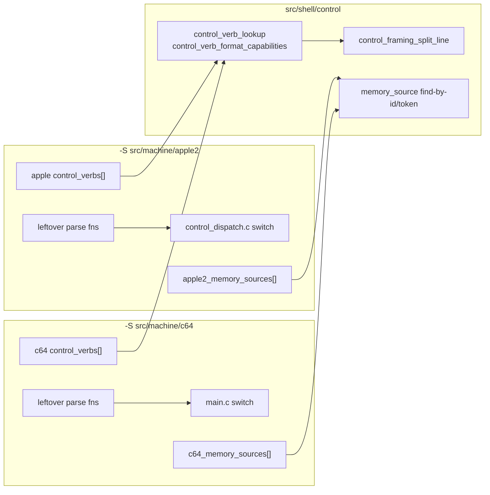

# Stage 5 — Command tables and memory sources

| Field | Value |
|-------|-------|
| **Author** | Grok (Designer) |
| **Date** | 2026-08-27 |
| **Status** | Accepted |
| **Canonical path** | [`design/control-command-tables.md`](control-command-tables.md) |
| **Stage map** | [`design/merge-stage-map.md`](merge-stage-map.md) Stage 5 (UNIFY shape + PRESERVE names/verbs/buses) |
| **Depends on** | Stage 4 exit ([`design/control-framing.md`](control-framing.md)). Stage 6 is already landed; this stage does not reopen it. |

This is the detailed design for Stage 5. It does not reopen the stage map. Key Decisions 4 and 5, the Stage 5 in-scope/out-of-scope lists, and the standing invariants (two binaries, no ifdef in shell, no mega `control_args`, no `MACHINES/1`) are folded in as constraints.

---

## Overview

After Stages 4 and 6, shared framing stops at `<id> <verb> <rest-of-line>`. Each leftover tree still owns a private command enum, one mega `control_args` (~40 Apple fields vs ~70 C64 fields), a hardcoded `capabilities` string, and a leftover `runtime_memory_mode` enum. Apple still publishes C64 *names* (`CPU_MAP`, `RAM`, `DRIVE8_MAP`, `DRIVE9_MAP`) that lie about Aux/LC1.

Stage 5 UNIFY is **shape only**:

1. One shell **verb runner**: lookup, unknown-verb error, `capabilities` generated from a table.
2. One shell **memory-source type**: `{id, label, range, flags}`. Leftover machines publish tables. Drive 8/9 is a different bus, not Aux with a different label.
3. Leftover **parse/dispatch stay leftover**. Core verbs share the table row shape; each product supplies the functions. Optional keys (`mli-launch=` on `assemble`) are extra capability tokens, not `#ifdef`.
4. Delete Apple leftover C64 memory-mode aliases in the same change. Frontend call sites that still say `CPU_MAP` / `RAM` convert to table ids (which match leftover `RUNTIME_MEMORY_MODE_MAP` / `MAIN`).

There is still no root `project(machines)`, no flattening of `src/machine/*/src/`, no Stage 7 `runtime_client` seam, no Stage 8 chrome move, and no Inspector clock rewrite.

---

## Background & Motivation

### Entry verification (2026-08-27)

| Artifact | a2m | c64m |
|----------|-----|------|
| `control_protocol_parse_request` | leftover; `lookup_command` + giant switch into `control_args` | leftover; `command_from_name` + giant if-ladder into `control_args` |
| `control_command_type` | includes `GET_SOFTSWITCHES` | includes `RUN_TO_RASTER`, `GET_VIC`, `ENTER_INSPECTOR`, … |
| `control_args` | ~40 fields | ~70 fields (history opcode patterns, vic-ring, raster) |
| `capabilities` | hardcoded in leftover `control_server.c` | hardcoded in leftover `main.c` |
| Memory wire vs runtime | `CONTROL_MEMORY_MODE_*` order ≠ `runtime_memory_mode` (remapped in dispatch) | wire token → leftover `runtime_memory_mode` numeric |
| Leftover C64 aliases | `CPU_MAP`/`RAM`/`DRIVE8_MAP`/`DRIVE9_MAP` in `runtime_event.h` | real sources (`DRIVE8_MAP` / `DRIVE9_MAP`) |

Apple `frontend.c` still cycles disasm with `RUNTIME_MEMORY_MODE_CPU_MAP` / `RAM` (Map→ROM→Main). Those aliases are the lie this stage deletes.

### Pain points

- One soup struct is how Aux becomes Drive8: a shared field whose meaning depends on the binary.
- `CONTROL_MEMORY_MODE_AUX = 2` vs `RUNTIME_MEMORY_MODE_ROM = 2` is a footgun the table removes by making **source id = leftover runtime id**.
- `capabilities` is a comment that drifts from the verb list. Generating it from the table is the advertisement.

### What this stage is not

Stage 7 `runtime_client`, Stage 8 chrome panes, Stage 9 Inspector clocks/`enter-inspector` on A2M, unifying leftover `runtime_thread` command handling, one `mount` with `kind=` spanning Disk II and 1541, `#ifdef APPLE2` in `src/shell`, flattening leftover `src/`, root `project(machines)`, drive-by `vic_cycle` (already gone from Apple in Stage 6), or fixing `history_control_integration`.

---

## Goals & Non-Goals

### Goals

1. Shared runner in `src/shell/control/`: verb lookup, unknown-verb error, `capabilities` text generated from a table.
2. Each leftover binary supplies a table of `{name, capability, extra, parse}`. Core verbs share that shape. Exclusive verbs stay in that binary's table.
3. Per-verb parse writes a leftover **per-verb args struct** (union of those structs on leftover `control_request`). Delete the flat 40/70-field soup.
4. `hello` still `name=a2m protocol=A2M/13` / `name=c64m protocol=C64M/8`. No `MACHINES/1`. No protocol bump.
5. Media stays an **extension**: Apple `mount`/`unmount`/`mount-disk`/`select-disk`/`set-disk-writable`; C64 `mount-d64`/`unmount-disk`/`power-drive`/….
6. Memory source table published by each leftover machine. Apple: Map, Main, Aux, LC1, LC2, ROM. C64: CPU map, RAM, ROM, Drive 8, Drive 9 (`MEMSRC_FOREIGN_BUS`). No C100 source (ROM view_flags already force C100 ROM; it is not a memview cycle stop).
7. `git grep DRIVE8_MAP` under `src/machine/apple2` is empty except this design and historical notes.
8. Apple frontend leftover `CPU_MAP`/`RAM` call sites become leftover Map/Main ids.
9. `test_control_protocol` per binary still passes. New tests: unknown-verb error (code `unknown-command`) and capabilities-from-table. Machine unit tests that poke memory via named leftover modes still pass.
10. a2m 75/75 must not regress (new tests may raise the count). c64m: 69 pass + 10 SKIP + the same `history_control_integration` fail.

### Non-goals

- Shared bitmask where Aux == Drive8.
- VIC/CIA/softswitches in the **core/shell** table “in case”.
- One leftover `dispatch` function pointer per verb *splitting* leftover `handle_request` / `main.c` this stage. Leftover dispatch **loops** stay leftover switches keyed by leftover `control_command_type`. The table row still *names* dispatch as leftover-owned; the leftover switch is that dispatcher.
- Unifying leftover `runtime_thread` command handling.
- Capability negotiate/enable.
- Advertising `basic-run=` as a new C64 token (map named `mli-launch=` as the extra-token example; do not invent extra C64 tokens).

---

## Proposed Design

### Target layout after Stage 5

```text
machines/
  src/shell/
    control/
      control_framing.{c,h}          # Stage 4; unchanged contract
      control_command_table.{c,h}    # NEW: verb row, lookup, capabilities
      memory_source.{c,h}            # NEW: type, flags, find-by-id/token
    tests/control/
      test_control_command_table.c   # fake table: unknown-verb + capabilities
      test_memory_source.c           # fake tables; no Apple/C64 names
  src/machine/apple2/src/control/
    control_verbs.{c,h}              # NEW: leftover table + parse fns + sources
    control_protocol.{c,h}           # wrapper parse_request; leftover type enum
    control_dispatch.c               # STAY leftover switch; drop mode remap
    control_server.c                 # capabilities from table
  src/machine/c64/src/control/
    control_verbs.{c,h}              # NEW
    control_protocol.{c,h}           # wrapper; leftover type enum STAY
    control_server.c                 # STAY leftover pipeline
  src/machine/c64/src/main.c         # capabilities from table; dispatch STAY
  src/machine/apple2/src/runtime/runtime_event.h
    # leftover runtime_memory_mode STAY; aliases GONE
  src/machine/apple2/src/frontend/frontend.c
    # CPU_MAP/RAM -> MAP/MAIN
```



### Shared verb row (`src/shell/control/control_command_table.h`)

No product literals. No leftover `control_command_type`. No `control_args`. No VIC/CIA/softswitches.

```c
typedef struct control_verb {
    const char *name;               /* "get-memory"; NULL = advertise-only row */
    const char *capability;         /* "memory"; NULL = unadvertised (aliases) */
    const char *extra_capabilities; /* "mli-launch" or NULL */
    bool (*parse)(
        const char *rest,
        void *args_out,
        uint32_t request_id,
        control_response *err);
} control_verb;

const control_verb *control_verb_lookup(
    const control_verb *table,
    size_t count,
    const char *name);

/* Unique capability tokens in first-seen table order, then extra_capabilities
   on that row, skipping duplicates and NULL. Advertise-only rows (name NULL)
   contribute capability only. */
size_t control_verb_format_capabilities(
    const control_verb *table,
    size_t count,
    char *out,
    size_t out_size);

typedef enum control_verb_parse_status {
    CONTROL_VERB_PARSE_OK = 0,
    CONTROL_VERB_PARSE_EMPTY,
    CONTROL_VERB_PARSE_BAD_ID,
    CONTROL_VERB_PARSE_MISSING_VERB,
    CONTROL_VERB_PARSE_UNKNOWN,
    CONTROL_VERB_PARSE_ARGS
} control_verb_parse_status;

/* split_line + lookup. UNKNOWN fills err with leftover-supplied code/message
   via the wrapper; shared helper returns the status. */
control_verb_parse_status control_verb_split_and_lookup(
    const char *line,
    const control_verb *table,
    size_t count,
    control_framing_line *framing,
    const control_verb **out_verb);
```

`parse` is leftover. `args_out` is leftover (pointer to that verb's struct / leftover union member). Shared code never inspects args.

Advertise-only rows (`name == NULL`) exist so `sessions` and `state-changed` are generated from the table without inventing fake verbs. Lookup skips them.

Aliases (`get-breakpoints` → same leftover type as `break-list`) have `capability = NULL` so they are not advertised twice.

### Leftover table wrapper

Leftover needs a leftover identity for deferred matching and the leftover dispatch switch. That identity stays leftover. Shell does not store it.

```c
/* leftover, not shell */
typedef struct apple_control_verb {
    control_verb verb;
    control_command_type type;
} apple_control_verb;
```

Leftover `control_protocol_parse_request`:

1. `control_framing_split_line` (already).
2. Linear search leftover table by `verb.name` (`control_verb_lookup` on a packed `control_verb[]` **or** leftover loop comparing `row->verb.name`). To avoid a second packed copy, leftover lookup walks `apple_control_verb[]` and compares `row.verb.name`. Shared `control_verb_lookup` is used by the shell test and by leftover if leftover also exposes a packed view. **Chosen:** leftover walks its wrapper table; shared `control_verb_lookup` is the tested primitive leftover *may* call if it keeps a parallel `control_verb[]`. Simpler leftover: one wrapper array; leftover `control_verb_lookup_wrapped` is leftover 10 lines. Shared test uses a plain `control_verb[]`.
3. Unknown → leftover error strings (`unknown-command` + verb name on Apple; `unknown-command` / `"unknown command"` on C64). **Preserve leftover wording.** Shared runner does not smash messages.
4. `row.verb.parse(rest, &request->args.<member>, id, err)`.
5. `request->type = row.type`. `request->verb` optional leftover pointer for capabilities/dispatch.

Identity verbs (hello/version/capabilities/ping/quit-client) stay handled where they are today: Apple leftover `control_server.c` (socket thread); C64 leftover `main.c` dispatch. Capabilities **body** is `control_verb_format_capabilities` on that binary's packed verb list.

### Per-verb args (leftover union, not one soup)

Leftover `control_request.args` becomes a **union of leftover per-verb structs**, not a flat struct of 40/70 fields.

Related verbs may share a leftover struct (get-memory and set-memory both write `control_args_memory`). That is still per-verb parse writing a named struct, not Aux-and-Drive8 soup.

Apple leftover (illustrative, not exhaustive):

```c
typedef struct control_args_memory {
    uint16_t address;
    uint32_t length;
    uint32_t source_id; /* memory_source.id == leftover runtime_memory_mode */
} control_args_memory;

typedef struct control_args_assemble {
    uint16_t address;
    uint16_t run_address;
    bool has_run_address;
    bool auto_run;
    bool mli_launch;
    bool reset_first;
    bool auto_adjust_segments;
    char path[CONTROL_LINE_MAX];
} control_args_assemble;

typedef union control_verb_args {
    control_args_memory memory;
    control_args_assemble assemble;
    control_args_set_reg set_reg;
    control_args_set_turbo set_turbo;
    control_args_break brk;
    control_args_wait wait;
    control_args_path path;
    control_args_key key;
    control_args_media media;
    control_args_frame_ring frame_ring;
    control_args_history history;
    control_args_find_symbol find_symbol;
} control_verb_args;
```

C64 leftover union is a **different leftover type** with raster, vic-ring, paste, drive, … members. Do not union both products in shell.

Leftover dispatch / tests use `req->args.memory.address` instead of `req->args.address`. Mechanical.

`set-memory` still sets leftover `request.payload_size` from the memory struct's length (framing payload read is unchanged).

### Capabilities generation

Walk leftover table in order:

1. If `capability` non-NULL and not yet emitted, append it.
2. If `extra_capabilities` non-NULL, split on space and append unseen tokens.

Apple extra: `assemble` row has `extra_capabilities = "mli-launch"`. That **adds** `mli-launch` after `assemble` (additive advertisement; no `A2M/N` bump). Existing clients ignore unknown tokens.

Advertise-only rows supply `sessions` and `state-changed` in the historical position (after `symbols`, before `inspector`).

Target Apple string (additive `mli-launch`):

```text
connection introspection execution state softswitches step turbo frame
frame-ring memory breakpoints wait key disk snapshot history assemble
mli-launch symbols sessions state-changed inspector
```

C64 string unchanged vs today (no extra token this stage):

```text
connection introspection execution state step turbo frame memory
debug-memory call-stack input disk file snapshot breakpoints wait
assemble symbols drive-cpu vic cia run-to-raster history power-drive
frame-ring vic-ring sessions state-changed inspector
```

Table row order is chosen so first-seen capabilities match those sequences. That is leftover table layout, not shell policy.

`get-cpu` / `set-reg` / identity verbs reuse earlier tokens (`introspection`, `connection`, `execution`, …) and do not emit new ones.

### Memory source table (`src/shell/control/memory_source.h`)

```c
enum {
    MEMSRC_HIGHBIT_ASCII = 1u << 0,
    MEMSRC_WRITABLE      = 1u << 1,
    MEMSRC_FOREIGN_BUS   = 1u << 2
};

typedef struct memory_source {
    uint32_t id;           /* leftover-stable; equals leftover runtime_memory_mode */
    const char *label;     /* UI: "Map", "Drive 8" */
    const char *token;     /* wire: "map", "drive8" — needed for parse; not a product fork */
    uint32_t addr_lo;      /* inclusive */
    uint32_t addr_hi;      /* exclusive; 0x10000 for 64K 6502 spaces */
    uint32_t flags;
} memory_source;

const memory_source *memory_source_find_by_id(
    const memory_source *table, size_t count, uint32_t id);
const memory_source *memory_source_find_by_token(
    const memory_source *table, size_t count, const char *token);
```

`token` is an addition to the map sketch. Wire names are not labels (`map` vs `Map`). Shell find helpers are generic table walks. No Apple/C64 strings in shell.

#### Apple leftover table (`apple2_memory_sources`)

Ids **match** leftover `runtime_memory_mode` (Map=0, Main=1, ROM=2, Aux=3, LC1=4, LC2=5). That deletes `to_runtime_memory_mode`.

| id | label | token | flags |
|----|-------|-------|-------|
| 0 | Map | map | `HIGHBIT_ASCII \| WRITABLE` |
| 1 | Main | main | `HIGHBIT_ASCII \| WRITABLE` |
| 2 | ROM | rom | `HIGHBIT_ASCII` |
| 3 | Aux | aux | `HIGHBIT_ASCII \| WRITABLE` |
| 4 | LC1 | lc1 | `HIGHBIT_ASCII \| WRITABLE` |
| 5 | LC2 | lc2 | `HIGHBIT_ASCII \| WRITABLE` |

Range all `0 .. 0x10000`. No C100 row: leftover `view_flags_from_area(ROM)` already sets C100 ROM; memview/disasm cycles do not stop on C100.

Drop leftover wire alias `ram` → Main on Apple `get-memory` (undocumented leftover C64). Breakpoint mapping token `ram=` is leftover INI/BP policy (Stage 6 stayed); do not touch it.

#### C64 leftover table (`c64_memory_sources`)

Ids **match** leftover `runtime_memory_mode`.

| id | label | token | flags |
|----|-------|-------|-------|
| 0 | CPU map | map | `WRITABLE` |
| 1 | RAM | ram | `WRITABLE` |
| 2 | ROM | rom | 0 |
| 3 | Drive 8 | drive8 | `FOREIGN_BUS` |
| 4 | Drive 9 | drive9 | `FOREIGN_BUS` |

Leftover `set-memory` already rejects non-writable modes at parse (`map` or `ram` only). After this stage that check is `MEMSRC_WRITABLE` on the leftover table, not `mode == 0 \|\| mode == 1`. Drive 8/9 stay real leftover `DRIVE8_MAP` / `DRIVE9_MAP` names.

`control_protocol_memory_mode_name` (Apple) becomes leftover lookup of `token` by id.

### Delete Apple leftover C64 aliases

In leftover `runtime_event.h`, delete:

```c
RUNTIME_MEMORY_MODE_CPU_MAP = RUNTIME_MEMORY_MODE_MAP,
RUNTIME_MEMORY_MODE_RAM     = RUNTIME_MEMORY_MODE_MAIN,
RUNTIME_MEMORY_MODE_DRIVE8_MAP = RUNTIME_MEMORY_MODE_AUX,
RUNTIME_MEMORY_MODE_DRIVE9_MAP = RUNTIME_MEMORY_MODE_LC1
```

Apple `frontend.c` call sites (disasm Opt+M, `mem_cache[CPU_MAP]`, init, Map-border skip) use `RUNTIME_MEMORY_MODE_MAP` / `MAIN`. Physics unchanged: disasm still Map→ROM→Main; memview still Map→Main→Aux→LC1→LC2→ROM.

C64 `DRIVE8_MAP` / `DRIVE9_MAP` / `CPU_MAP` / `RAM` stay.

### Leftover `runtime_memory_mode`

Stays leftover. It is the leftover runtime/RPC identity. Memory source `id` equals it so Stage 7 `get-memory(source_id)` and Stage 8 panes can use the published table without a remap. Shell does not include `runtime_event.h`.

Delete leftover `CONTROL_MEMORY_MODE_*` (Apple). Tests compare `source_id` to leftover `RUNTIME_MEMORY_MODE_*` / table ids.

### File-by-file

#### NEW shell

| File | Role |
|------|------|
| `control_command_table.h/.c` | verb row, lookup, format_capabilities, split_and_lookup |
| `memory_source.h/.c` | flags, find-by-id/token |
| `tests/control/test_control_command_table.c` | fake verbs; unknown; capabilities order + extras |
| `tests/control/test_memory_source.c` | two fake tables; FOREIGN_BUS ≠ HIGHBIT_ASCII |

#### NEW leftover

| File | Role |
|------|------|
| `apple2/.../control_verbs.c` | wrapper table, parse fns (moved from protocol.c switch), source table |
| `c64/.../control_verbs.c` | same |

#### STAY leftover (updated)

Leftover `control_protocol.c` becomes the wrapper + leftover helpers still needed by leftover parse (Apple media kind/path; C64 key names). Leftover dispatch switches stay. Leftover deferred still keys on leftover `control_command_type`.

---

## API / Interface Changes

- New shell types: `control_verb`, `memory_source`, `MEMSRC_*`.
- Leftover `control_request.args` is a leftover union of per-verb structs.
- Leftover `CONTROL_MEMORY_MODE_*` deleted (Apple).
- Apple leftover C64 memory-mode aliases deleted.
- `capabilities` Apple string gains `mli-launch` (additive). C64 string unchanged.
- No `A2M/N` / `C64M/N` bump. `hello` still product-named.
- Wire memory tokens unchanged except Apple drops undocumented `ram` synonym.

Include path: leftover `#include "control_command_table.h"` / `"memory_source.h"` via `shell` PUBLIC `control/`.

---

## Data Model Changes

None on disk. HST1, snapshots, INI breakpoint mapping tokens unchanged.

Leftover `runtime_memory_mode` numeric values unchanged. Control parse writes those ids directly.

---

## Alternatives Considered

### 1. Split leftover `handle_request` / `main.c` into per-verb `dispatch` pointers this stage

**Pros:** matches the map sketch literally. **Cons:** ~2000-line leftover mechanical split, high risk, does not change wire or capabilities. Leftover deferred still needs leftover type. Rejected for this stage; leftover switch **is** leftover dispatch. Table row can grow a leftover `dispatch` pointer later without a shell change.

### 2. Shared bitmask `MEMSRC_AUX_OR_DRIVE8`

Forbidden by KD 5.

### 3. Keep leftover mega `control_args`, only add a lookup table

The map names the soup as what this stage deletes. Rejected.

### 4. Smash C64 `DRIVE8_MAP` names because Apple aliases go away

C64 drives are real sources. Rejected.

### 5. Advertise-only rows vs leftover `extra_tokens[]` on a table object

Advertise-only rows keep **one** leftover array as the advertisement order. Chosen.

### 6. C100 as an Apple source

Leftover memview/disasm do not cycle C100. ROM view_flags already include C100 ROM. Skip.

---

## Security & Privacy Considerations

Unchanged: bind `127.0.0.1`, one client, leftover payload caps, leftover deferred capacity 1 vs 16.

---

## Observability

`capabilities` is derived; leftover logs unchanged. Prove is ctest + greps below.

---

## Implementation Notes

1. Write this design; commit it; then implement in a second commit.
2. Shell types + tests first (fake tables).
3. Leftover Apple: verbs + per-verb args + delete aliases + frontend ids + drop mode remap.
4. Leftover C64: verbs + per-verb args + `MEMSRC_WRITABLE` for set-memory; keep drive sources.
5. Register shell tests on both leftover gates (Stage 3/6 pattern).
6. Do not start Stages 7 / 8 / 9. Do not fix `history_control_integration`.

---

## Testing Strategy

- Shell `test_control_command_table`: fake `{ping, assemble extra=mli-launch, advertise-only sessions}`; capabilities string exact; unknown verb status; advertise-only not lookupable.
- Shell `test_memory_source`: two fake buses; find-by-token; FOREIGN_BUS flag on id 3 does not equal id used as “aux”.
- Leftover `test_control_protocol`: still parses product verbs; field access via leftover union; Apple aux `source_id` is leftover Aux (3), not control-enum 2; unknown-command; capabilities text equals `control_verb_format_capabilities` on that leftover table (and contains `mli-launch` on Apple).
- Leftover `runtime_memory_rpc` and assembler memory pokes still use leftover `RUNTIME_MEMORY_MODE_*` (numeric ids unchanged).
- Apple `runtime_inspector_mode` still finds `inspector` in capabilities.

---

## Documentation Plan

- This file is the Stage 5 design (committed first).
- [`design/README.md`](README.md) indexes it (active → landed when code lands).
- [`agents/README.md`](../agents/README.md): Stage 5 done; leftover C64 memory aliases gone; do not start 7/8/9 from that note.
- Leftover `agents/control-tools.md` / `control-port.md`: capabilities list; Apple `mli-launch` token; memory modes are source table tokens.

---

## Rollout Plan

Same two `-S` trees. No protocol bump. Additive Apple capability token.

---

## Open Questions

None. Dispatch-pointer split of leftover switches is deferred (KD below). C100 is not a source. C64 `basic-run` is not advertised.

### Self-check against Stage 5 map

| Map item | This design |
|----------|-------------|
| Verb `{name, capability, parse, dispatch}` | Row has name/capability/extra/parse; leftover switch is leftover dispatch this stage |
| Core verbs share shape; leftover supplies parse/dispatch | leftover `control_verbs.c` |
| `capabilities` generated from table; no negotiate | `control_verb_format_capabilities` |
| Optional keys extra tokens not ifdefs | `mli-launch` on Apple assemble |
| Media is extension | leftover media verbs stay leftover names |
| Exclusive verbs leftover table | softswitches / vic / cia / enter-inspector / … |
| Memory source `{id,label,range,flags}` | plus `token` for wire |
| Apple leftover C64 aliases deleted | `runtime_event.h` + frontend |
| `hello` product-named | Stage 4 formatters; leftover macros |
| No mega `control_args` | leftover per-verb union |
| No Aux==Drive8 bitmask | `MEMSRC_FOREIGN_BUS` on C64 drives only |
| No VIC in core table | exclusive leftover rows |
| No `#ifdef APPLE2` in shell | fake tables in shell tests |
| No `runtime_thread` unify | leftover dispatch STAY |
| a2m 75/75; c64m 69+10 SKIP+known fail | new tests may raise a2m count |

No product fork the map did not decide. `token` on `memory_source` is required for wire parse. Leftover dispatch remaining a leftover switch is a staged reading of “product supplies dispatch”, not a C64-vs-Apple fork.

---

## Prove

Host CMake (Stages 2–6 used the same). Debug. From repo root:

```bash
cmake -B build/a2m  -S src/machine/apple2  -DCMAKE_BUILD_TYPE=Debug
cmake -B build/c64m -S src/machine/c64    -DCMAKE_BUILD_TYPE=Debug
cmake --build build/a2m -j && cmake --build build/c64m -j
ctest --test-dir build/a2m  --output-on-failure
ctest --test-dir build/c64m --output-on-failure
./build/a2m/a2m --help
./build/c64m/c64m --help
```

| Gate | Required |
|------|----------|
| a2m | **75/75 or higher** (new shell tests registered). Includes leftover `control_protocol`. |
| c64m | **69 passed, 10 skipped, 1 failed** out of 80 **plus any new tests**. Fail = `history_control_integration` (do not fix). SKIPs = the same ten asset-gated tests. |

#### Must be empty / absent (fail the stage if any hit)

```bash
# Apple leftover C64 aliases gone from product code (design notes may remain).
test -z "$(git grep -E 'DRIVE8_MAP|DRIVE9_MAP|RUNTIME_MEMORY_MODE_CPU_MAP|RUNTIME_MEMORY_MODE_RAM' -- src/machine/apple2 ':!**/design/**' ':!**/agents/**' || true)"

# Shell has no product verbs / ifdefs / MACHINES protocol / Aux==Drive8 soup.
test -z "$(git grep -E 'GET_SOFTSWITCHES|RUN_TO_RASTER|#ifdef APPLE2|#ifdef C64|MACHINES/' -- src/shell/control || true)"
test -z "$(git grep -E '\"a2m\"|\"c64m\"|\"A2M/|\"C64M/' -- src/shell/control || true)"
```

`git grep` with no matches may exit 1; treat empty output as pass. Historical `design/` / leftover `agents/` mentions of the aliases are allowed.

#### Informational

```bash
git grep -n 'name=a2m protocol=A2M/13' -- src/machine/apple2
git grep -n 'name=c64m protocol=C64M/8' -- src/machine/c64
git grep -n 'mli-launch' -- src/machine/apple2/src/control
git grep -n 'MEMSRC_FOREIGN_BUS' -- src/machine/c64
```

---

## Key Decisions

1. **UNIFY shape, PRESERVE names/verbs/buses.** Two leftover tables. No `MACHINES/1`.
2. **Shared runner is lookup + capabilities + split-and-lookup.** Leftover parse functions write leftover per-verb structs.
3. **Leftover dispatch stays a leftover switch this stage.** Deferred still keys leftover `control_command_type`. Product supplies dispatch as that leftover loop.
4. **Advertise-only table rows** for `sessions` / `state-changed`.
5. **`mli-launch` is an extra capability token** on Apple `assemble`. Additive. No protocol bump. Do not advertise C64 `basic-run` this stage.
6. **Memory source `id` equals leftover `runtime_memory_mode`.** Deletes Apple control/runtime remap.
7. **`token` on `memory_source`** for wire parse. Labels are UI.
8. **No C100 source.** ROM view_flags already cover C100 ROM.
9. **Apple drops undocumented `ram` get-memory synonym.** BP `ram=` mapping token stays leftover.
10. **C64 drive 8/9 are `MEMSRC_FOREIGN_BUS`.** `set-memory` writable check uses `MEMSRC_WRITABLE`.
11. **Delete Apple leftover C64 aliases in the same change as the table.** Frontend uses Map/Main ids.
12. **Shell tests use fake tables.** Both leftover gates register them.
13. **No machines-root `project()`, no flatten, no Stage 7/8/9.**

---

## References

- [`design/merge-stage-map.md`](merge-stage-map.md) — Stage 5, KD 4, KD 5
- [`design/control-framing.md`](control-framing.md) — split/formatters
- [`design/runtime-shell-extract.md`](runtime-shell-extract.md) — leftover BP INI / mapping tokens stayed
- a2m leftover `control_protocol.h` — `A2M/13`, `CONTROL_MEMORY_MODE_*` remap
- c64m leftover `main.c` — hardcoded capabilities string
- a2m leftover `runtime_event.h` — aliases to delete

---

## PR Plan

Stage 5 is this design then implement. Grain is **two** independently reviewable commits.

### PR 5.0 — Design (this document)

- **Title:** `docs: Stage 5 design for control command tables`
- **Files:** `design/control-command-tables.md`, `design/README.md` (index active)
- **Depends on:** Stage 4
- **Description:** Land this design. No source extract. Status Accepted after map self-check.

### PR 5.1 — Command tables + memory sources

- **Title:** `unify: control command tables and memory sources`
- **Files / components:**
  - `src/shell/control/control_command_table.*`, `memory_source.*`
  - `src/shell/tests/control/test_control_command_table.c`, `test_memory_source.c`
  - leftover `control_verbs.*`, leftover protocol/dispatch/server/main updates
  - Apple `runtime_event.h` aliases deleted; `frontend.c` Map/Main ids
  - leftover CMake: compile verbs; register shell tests
  - `agents/README.md`; leftover control agent notes; `design/README.md` **landed**
- **Depends on:** PR 5.0
- **Description:** One runner, two leftover tables, published memory sources. `hello` still `A2M/13` / `C64M/8`. **Stage 5 exit.**

Do not start Stage 7, 8, or 9 from these PRs.
