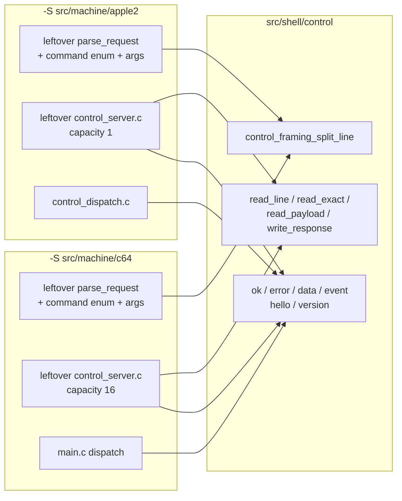
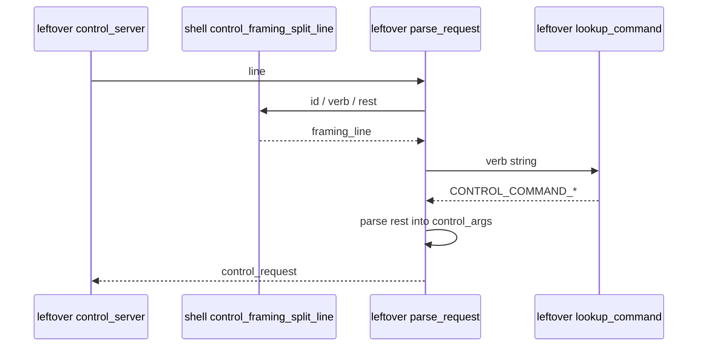

# Stage 4 — Control framing library

| Field | Value |
|-------|-------|
| **Author** | Grok (Designer) |
| **Date** | 2026-08-27 |
| **Status** | Accepted |
| **Canonical path** | [`design/control-framing.md`](control-framing.md) |
| **Stage map** | [`design/merge-stage-map.md`](merge-stage-map.md) Stage 4 (EXTRACT) |
| **Depends on** | Stage 2 exit ([`design/shell-extract-platform.md`](shell-extract-platform.md)). Stage 3 is already landed; this stage does not depend on it. |

This is the detailed design for Stage 4. It does not reopen the stage map. Key Decisions 4 and 13, the Stage 4 in-scope/out-of-scope lists, and the standing invariants (two binaries, no ifdef in shell, no mega `control_args`) are folded in as constraints.

---

## Overview

After Stages 2–3, both leftover `project()` trees still own a private copy of control *framing*: line split, `ok` / `error` / `data` / `event` formatters, binary payload I/O, and request/response payload release. Verb tables, `control_args`, deferred slots, and the TCP server loop are **not** twins.

Stage 4 EXTRACT lifts the framing surface into `src/shell/control/`, compiled into `libshell`. Core parse **stops** at `<id> <verb> <rest-of-line>`. Product verb parsers (`get-softswitches`, `run-to-raster`, …) stay next to leftover dispatch. `control_server.c` is **not** shipped as one file. Deferred/pipeline capacity stays a **parameter** each leftover server already owns: a2m **1**, c64m **16**. Shared sources do not `#define` 1 or 16.

`hello` / `version` formatters take product name + protocol string. Wire identity stays `A2M/13` and `C64M/8`. Do not invent `MACHINES/1`.

There is still no root `project(machines)` and no flattening of `src/machine/*/src/`.

---

## Background & Motivation

### Entry verification (2026-08-27)

Both leftover trees still have `tests/control/test_control_protocol.c` and register `control_protocol`. a2m `control_dispatch.c` is already split; c64m dispatch is still inlined in `src/machine/c64/src/main.c`.

```text
src/machine/apple2/src/control/
  control_protocol.{c,h}   1420 / product verbs + formatters
  control_server.{c,h}     698  / sequential, drain 250 ms
  control_deferred.{c,h}   CAPACITY 1
  control_dispatch.{c,h}   STAY
  control_breakpoint.*     STAY

src/machine/c64/src/control/
  control_protocol.{c,h}   1665 / product verbs + formatters
  control_server.{c,h}     653  / pipeline HIGH_WATER = CAPACITY 16
  control_deferred.{c,h}   CAPACITY 16
```

### What is already the same (framing)

| Artifact | a2m | c64m | Verdict |
|----------|-----|------|---------|
| Line grammar | `<id> <verb> <rest>\n` | same | EXTRACT split |
| `CONTROL_LINE_MAX` / `CONTROL_RESPONSE_TEXT_MAX` | 512 / 512 | 512 / 512 | EXTRACT |
| `control_response` fields | id, type, text, data_type, metadata, payload, payload_size, close_client | **identical** | EXTRACT the struct |
| `control_response_type` | OK / ERROR / DATA / EVENT (id 0) | identical | EXTRACT |
| Wire `ok` / `error` / `event` / `data` lines | same snprintf shape | same | EXTRACT |
| Binary DATA | header `\n` + payload + `\n` | same | EXTRACT write helper |
| Request payload | size then exact bytes + `\n` | same | EXTRACT read helper |
| Payload release | `free` + NULL | same | EXTRACT |

### What has already diverged (do not rubber-stamp)

| Artifact | a2m | c64m | Stage 4 handling |
|---------|-----|------|------------------|
| `control_command_type` | includes `GET_SOFTSWITCHES` | includes `RUN_TO_RASTER` | **STAY** leftover. Not in shell. |
| `control_args` | ~40 fields | ~70 fields | **STAY**. Do not union. |
| `control_protocol_parse_request` | full verb + args | full verb + args | leftover wrapper around shared **split** |
| `format_ok` | 3 args (no `close_client`) | 4 args (`close_client`) | **one** API with `close_client` |
| `format_data` | metadata before payload; no close | payload before metadata; close | **one** API (see Key Decisions) |
| `write_response_line` arg order | `(out, out_size, response)` | `(response, out, out_size)` | **one** API: dest-first |
| `hello` body | `name=a2m protocol=A2M/13` | `name=c64m protocol=C64M/8` | parameterized |
| `version` body | `protocol=A2M/13 app=a2m` | `protocol=C64M/8 app=0.1.0` | parameterized (`app_label` is not smashed) |
| `control_server.c` | sequential; peer-gone; drain 250 ms | pipelined 16; hang-up drain 3000 ms | **STAY** leftover; extract I/O helpers only |
| Deferred capacity | 1 | 16 | leftover `#define` / enum. Shell has none. |
| Thread name | `"a2m-control"` | `"c64m-control"` | leftover |

### What this stage is not

Stage 5 command tables, capability advertisement, memory sources, Inspector wire, lifting a2m capacity to 16, rewriting c64m dispatch out of `main.c`, unifying `control_args`, `#ifdef APPLE2` in `src/shell`, flattening leftover `src/`, root `project(machines)`, editing am65 / Inspector clocks / `frontend.c` chrome / `runtime_thread`, or fixing `history_control_integration`.

---

## Goals & Non-Goals

### Goals

1. Shared framing compiles into both binaries via `libshell` (`src/shell/control/`).
2. Shared split / `control_protocol_parse_request` **in shell** (if that name is used there) does not mention `GET_SOFTSWITCHES` or `RUN_TO_RASTER` or any product verb enum.
3. Shared sources do not `#define` deferred/pipeline capacity 1 or 16.
4. a2m deferred capacity stays **1**. c64m stays **16**.
5. `hello` still reports `name=a2m protocol=A2M/13`. `hello` still reports `name=c64m protocol=C64M/8`. No `MACHINES/1`.
6. One framing formatter API (including `format_ok` `close_client`). No `#ifdef APPLE2`.
7. Per-product `test_control_protocol` still exists, still parses that product's verbs, still passes.
8. Leftover `control_server.c` remains two files. Helpers only.
9. ctest: a2m **72/72**; c64m 69 pass + 10 SKIP + the same `history_control_integration` fail.

### Non-goals

- Mega `control_args` / one `control_command_type`.
- Shipping one `control_server.c`.
- Command tables (Stage 5).
- New shell `add_test` that would change 72 / 80.
- Changing protocol product names or bumping `A2M/N` / `C64M/N`.
- Generic `hello` name.

---

## Proposed Design

### Target layout after Stage 4

```text
machines/
  src/shell/
    CMakeLists.txt              # append control/control_framing.c; PUBLIC-include control/
    control/
      control_framing.h         # NEW: split, formatters, I/O helpers, response struct
      control_framing.c
    util/ platform/ frontend/ tools/   # unchanged
  src/machine/apple2/src/control/
    control_protocol.{c,h}      # verb enum, args, parse_request, request_release
    control_server.{c,h}        # leftover loop; calls framing helpers
    control_deferred.{c,h}      # CAPACITY 1 STAY
    control_dispatch.*          # STAY
  src/machine/c64/src/control/
    control_protocol.{c,h}      # verb enum, args, parse_request
    control_server.{c,h}        # leftover pipeline; HIGH_WATER = 16 STAY
    control_deferred.{c,h}      # CAPACITY 16 STAY
  src/machine/c64/src/main.c    # dispatch STAY; formatter call sites match one API
  tests/control/test_control_protocol.c   # STAY per product
```



### Shared header (`src/shell/control/control_framing.h`)

No product literals. No `control_command_type`. No `control_args`. No `CONTROL_DEFERRED_CAPACITY`. No `CONTROL_PIPELINE_HIGH_WATER`.

```c
#pragma once

#include "platform_socket.h"

#include <stdbool.h>
#include <stddef.h>
#include <stdint.h>

enum {
    CONTROL_LINE_MAX = 512,
    CONTROL_RESPONSE_TEXT_MAX = 512,
    CONTROL_FRAMING_VERB_MAX = 64
};

typedef enum control_response_type {
    CONTROL_RESPONSE_OK = 0,
    CONTROL_RESPONSE_ERROR,
    CONTROL_RESPONSE_DATA,
    /* Unsolicited: "<id> event <name> [fields...]". Request id 0 is reserved. */
    CONTROL_RESPONSE_EVENT
} control_response_type;

typedef struct control_response {
    uint32_t id;
    control_response_type type;
    char text[CONTROL_RESPONSE_TEXT_MAX];
    char data_type[32];
    char metadata[CONTROL_RESPONSE_TEXT_MAX];
    uint8_t *payload;
    size_t payload_size;
    bool close_client;
} control_response;

typedef struct control_framing_line {
    uint32_t id;
    char verb[CONTROL_FRAMING_VERB_MAX];
    const char *rest; /* into the caller's line; may include trailing CR/LF */
} control_framing_line;

typedef enum control_framing_split_status {
    CONTROL_FRAMING_SPLIT_OK = 0,
    CONTROL_FRAMING_SPLIT_EMPTY,
    CONTROL_FRAMING_SPLIT_BAD_ID,
    CONTROL_FRAMING_SPLIT_MISSING_VERB
} control_framing_split_status;

control_framing_split_status control_framing_split_line(
    const char *line,
    control_framing_line *out);

void control_protocol_format_ok(
    control_response *response,
    uint32_t id,
    const char *text,
    bool close_client);

void control_protocol_format_error(
    control_response *response,
    uint32_t id,
    const char *code,
    const char *message,
    bool close_client);

void control_protocol_format_event(
    control_response *response,
    uint32_t id,
    const char *text);

void control_protocol_format_data(
    control_response *response,
    uint32_t id,
    const char *data_type,
    const char *metadata,
    uint8_t *payload,
    size_t payload_size,
    bool close_client);

/* hello: "<id> ok name=<app_name> protocol=<protocol>" */
void control_protocol_format_hello(
    control_response *response,
    uint32_t id,
    const char *app_name,
    const char *protocol);

/* version: "<id> ok protocol=<protocol> app=<app_label>" */
void control_protocol_format_version(
    control_response *response,
    uint32_t id,
    const char *protocol,
    const char *app_label);

bool control_protocol_write_response_line(
    char *out,
    size_t out_size,
    const control_response *response);

void control_response_release(control_response *response);
void control_framing_release_payload(uint8_t **payload, size_t *payload_size);

platform_socket_listener *control_framing_listen(uint16_t port);
platform_socket_connection *control_framing_accept(
    platform_socket_listener *listener);

/* 1=complete, 0=would-block, -1=error/eof/too long. *used carries partial. */
int control_framing_read_line_nb(
    platform_socket_connection *connection,
    char *out,
    size_t out_size,
    size_t *used);

bool control_framing_read_line(
    platform_socket_connection *connection,
    char *out,
    size_t out_size);

bool control_framing_read_exact(
    platform_socket_connection *connection,
    uint8_t *out,
    size_t size);

bool control_framing_read_payload(
    platform_socket_connection *connection,
    uint8_t **payload,
    size_t payload_size,
    uint32_t request_id,
    control_response *error);

bool control_framing_write_response(
    platform_socket_connection *connection,
    const control_response *response);
```

`control_protocol_*` names stay on the formatters because leftover call sites already use them and the wire is the control protocol. The **split** is named `control_framing_split_line` so leftover `control_protocol_parse_request` keeps the product-verb meaning. Shell does **not** define `control_protocol_parse_request`.

### Core parse stops at id / verb / rest

```c
control_framing_split_status control_framing_split_line(
    const char *line,
    control_framing_line *out);
```

- Skip leading space/tab.
- Empty / NULL → `CONTROL_FRAMING_SPLIT_EMPTY`.
- Request id is a **decimal** integer (`strtoul` base 10, first character `isdigit`). No `$` / `0x` on the id. (a2m leftover currently reuses a hex-capable helper for the id token; no test sends a hex id. Documented grammar is decimal.)
- Next token is the verb, copied into `out->verb` (NUL-terminated, max `CONTROL_FRAMING_VERB_MAX - 1`). Missing → `MISSING_VERB`.
- `out->rest` points at the first non-space after the verb (or at the terminator). Shared code does **not** interpret it.

Leftover `control_protocol_parse_request`:

1. Call `control_framing_split_line`.
2. Map split status to that product's existing error strings (`bad-request` / `bad-id`) so wire wording does not smash.
3. Look up `line.verb` in the **leftover** command table (`GET_SOFTSWITCHES` / `RUN_TO_RASTER` stay here).
4. Parse `line.rest` into leftover `control_args`.



### `format_ok` `close_client` (the map-named delta)

c64m already passes `close_client` into `format_ok` (and `format_data`). a2m's `format_ok` zeros the struct (so `close_client` is false) and the quit-client path assigns `response.close_client = true` afterwards.

**One API:** `control_protocol_format_ok(..., const char *text, bool close_client)` (c64m shape). a2m leftover call sites pass `false`, except quit-client which passes `true` and drops the follow-up assignment.

No `#ifdef APPLE2`. No 3-arg wrapper.

`format_error` already has `close_client` on both. Keep it.

### `format_data` and `write_response_line`

Unify `format_data` to a2m field order plus c64m's `close_client`:

`(response, id, data_type, metadata, payload, payload_size, close_client)`

a2m dispatch sites add `, false`. c64m `main.c` / test swap metadata vs payload to match.

`control_protocol_write_response_line(char *out, size_t out_size, const control_response *response)` — dest-first, like `snprintf`. Update c64m server + test (5 call sites). Body is the existing snprintf of `ok` / `error` / `event` / `data` including the optional metadata token.

Empty DATA payload: write the header line, skip a zero-length payload write, still write the trailing `\n` (a2m). Counted empty payloads (e.g. `break-list count=0`) stay in sync.

### `hello` / `version` — parameterized, not generic

Shell formatters build the two identity lines from **caller strings**. They do not contain `"a2m"`, `"c64m"`, `"A2M/"`, `"C64M/"`, or `"MACHINES/"`.

| Product | `format_hello` args | Wire |
|---------|---------------------|------|
| a2m | `"a2m"`, `"A2M/13"` | `name=a2m protocol=A2M/13` |
| c64m | `"c64m"`, `"C64M/8"` | `name=c64m protocol=C64M/8` |

| Product | `format_version` args | Wire |
|---------|-----------------------|------|
| a2m | `"A2M/13"`, `"a2m"` | `protocol=A2M/13 app=a2m` |
| c64m | `"C64M/8"`, `"0.1.0"` | `protocol=C64M/8 app=0.1.0` |

c64m `version` uses the product **version number** as `app=`, not the binary name. That is existing wire. Stage 4 does **not** smash it onto `app=c64m` or invent a shared meaning for `app=`. `app_label` is a parameter.

Leftover macros stay leftover (not shell):

```c
/* apple2 leftover control_protocol.h — already present */
#define CONTROL_PROTOCOL_VERSION "A2M/13"
#define CONTROL_PROTOCOL_APP_NAME "a2m"

/* c64 leftover control_protocol.h — add, matching main.c today */
#define CONTROL_PROTOCOL_VERSION "C64M/8"
#define CONTROL_PROTOCOL_APP_NAME "c64m"
#define CONTROL_PROTOCOL_APP_LABEL "0.1.0"
```

a2m leftover server hello/version (today inlined `format_ok` with string concat) calls `format_hello` / `format_version`. c64m leftover dispatch in `main.c` does the same.

Capabilities strings stay leftover (Stage 5 generates them from tables). Ping stays leftover `format_ok(..., "", false)` / `NULL`.

### I/O helpers (not a twin `control_server.c`)

Listen/accept are already Stage 2 `platform_socket_listen_localhost` / `platform_socket_accept`. Framing exposes thin aliases so leftover servers can call one header:

- `control_framing_listen` → `platform_socket_listen_localhost`
- `control_framing_accept` → `platform_socket_accept`

Line-read / exact / payload / write come from the duplicated statics in both leftover servers:

| Helper | Source | Notes |
|--------|--------|-------|
| `read_line_nb` | c64m (cleaner) | 1 / 0 / -1; `*used` partial |
| `read_line` | blocking loop over `read_line_nb` + `wait_readable(1000)` | no unsolicited-flush |
| `read_exact` | either (identical) | wait 2000 ms on would-block |
| `read_payload` | c64m + a2m framing check | malloc, exact, trailing `\n`; error `bad-payload` + `close_client` |
| `write_response` | a2m empty-payload rule | header via `write_response_line`, payload, `\n` |

Leftover **a2m** `control_server_read_line` today flushes unsolicited events while blocked. That is **server-loop policy**, not framing. After extract, a2m's loop calls `control_framing_read_line_nb` and keeps its own flush-on-would-block. Do not put `message_queue` or EVENT flushing into shell.

Leftover **c64m** pipeline (`outstanding_ids[CONTROL_PIPELINE_HIGH_WATER]`, hang-up drain 3000 ms) stays in leftover `control_server.c`. High water remains `CONTROL_PIPELINE_HIGH_WATER = CONTROL_DEFERRED_CAPACITY` in that file.

### Capacity is a leftover parameter

```c
/* apple2 leftover control_deferred.h — unchanged */
enum { CONTROL_DEFERRED_CAPACITY = 1 };

/* c64 leftover control_deferred.h — unchanged */
enum { CONTROL_DEFERRED_CAPACITY = 16 };

/* c64 leftover control_server.c — unchanged */
enum { CONTROL_PIPELINE_HIGH_WATER = CONTROL_DEFERRED_CAPACITY };
```

Shell framing has no deferred table, no pipeline array, and no `#define` of 1 or 16. If a later stage extracts a pipeline helper, it takes `size_t capacity`. This EXTRACT does not.

Do not lift a2m from 1 to 16.

### Request / response release

`control_response` lives in shell → `control_response_release` lives in shell.

`control_request` stays leftover (it carries `control_command_type` + `control_args`) → leftover keeps:

```c
void control_request_release(control_request *request)
{
    if (request == NULL) {
        return;
    }
    control_framing_release_payload(&request->payload, &request->payload_size);
}
```

Shared payload helper is the actual `free`. Map "request/response release" is that helper plus `control_response_release`.

### Leftover `control_protocol.h`

Both leftover headers `#include "control_framing.h"` and drop the duplicated response struct / formatter prototypes / line-size enums. They keep:

- Product macros (`A2M/13` vs `C64M/8`)
- `control_command_type`
- `control_args`
- `control_request`
- `control_protocol_parse_request`
- `control_request_release`
- a2m-only: `control_protocol_memory_mode_name`, memory-mode / media-kind enums
- c64m-only: `control_deferred_token_matches`, history opcode-pattern cap, frame-format enum

`CONTROL_PROTOCOL_NAME_MAX` (a2m, unused) is dropped with the move.

### CMake

`src/shell/CMakeLists.txt` — append onto the existing `shell` target (same pattern as Stage 2 platform):

```cmake
add_library(shell STATIC
    …
    frontend/nuklear_impl.c
    control/control_framing.c
)
target_include_directories(shell PUBLIC
    …
    ${CMAKE_CURRENT_SOURCE_DIR}/frontend
    ${CMAKE_CURRENT_SOURCE_DIR}/control
    ${SDL2_INCLUDE_DIRS}
)
```

No `project()`. No `cmake_minimum_required()`. No new `add_test` in shell.

Leftover `src/control/CMakeLists.txt` still compiles leftover protocol/server/deferred (and a2m dispatch). They already PUBLIC-link `platform` / `util`, which PUBLIC-link `shell`, so `"control_framing.h"` resolves. Do not add a second `control_framing` static lib.

`test_control_protocol` source paths stay per leftover tree. Still `add_test(NAME control_protocol …)` on both gates.

### File-by-file

#### MOVE into shell (new files; logic copied, leftover copies of that logic deleted)

| Logic today | Destination |
|-------------|-------------|
| response struct + response type enum + line max | `control_framing.h` |
| `format_ok` / `error` / `event` / `data` / `write_response_line` / `response_release` | `control_framing.c` |
| line-read / exact / payload / send-response statics in both servers | `control_framing.c` |

#### STAY leftover

| Path | Why |
|------|-----|
| leftover `control_protocol.c` verb lookup + args parse | Stage 5 |
| leftover `control_command_type` / `control_args` / `control_request` | Stage 5 |
| leftover `control_server.c` loops | not a twin; capacity / hang-up / sequential vs pipeline |
| leftover `control_deferred.*` | capacity 1 vs 16; product deferred kinds |
| a2m `control_dispatch.*` / `control_breakpoint.*` | not framing |
| c64m `main.c` dispatch | map: this stage does not rewrite it into command tables |
| `tests/control/test_control_protocol.c` | per product; still parses product verbs |

---

## API / Interface Changes

- New shell types: `control_framing_line`, `control_framing_split_status`, shared `control_response`.
- `control_protocol_format_ok` gains `bool close_client` on a2m.
- `control_protocol_format_data` gains `bool close_client`; argument order is metadata then payload (c64m call sites reorder).
- `control_protocol_write_response_line` is dest-first (c64m call sites reorder).
- New: `control_protocol_format_hello` / `_format_version`, I/O helpers, `control_framing_split_line`, `control_framing_release_payload`.
- No protocol bump. No INI change. `A2M/13` and `C64M/8` unchanged.

Include path: leftover `#include "control_protocol.h"` still works (it includes `control_framing.h`). Shell header is `"control_framing.h"` via `shell` PUBLIC `control/`.

---

## Data Model Changes

None on disk. Wire identity strings are unchanged. Deferred table sizes are unchanged.

---

## Alternatives Considered

### 1. Name the shell function `control_protocol_parse_request` and stop at id/verb/rest

Map allows this **if** the shared function does not mention product verbs. Leftover tests and dispatch already call `parse_request` expecting a filled `control_command_type`. Keeping that name in leftover and using `control_framing_split_line` in shell avoids a dual-meaning symbol. Chosen.

### 2. Share whole `control_server.c` with `#define CONTROL_DEFERRED_CAPACITY` 1 or 16

Forbidden by Key Decision 13. Capacity would unify by accident. Rejected.

### 3. Smash c64m `version` `app=0.1.0` onto `app=c64m` (or a2m onto `app=3.0.0`)

Would change wire. Map says parameterized, not generic. `app_label` parameter. Chosen.

### 4. Union `control_args` now so request_release can live entirely in shell

That is the Stage 5 soup. Rejected.

### 5. Named CMake target `control_framing` vs fold into `libshell`

Named target matches tools. Framing is a handful of functions used by leftover control, which already transitively links `shell`. Fold into `libshell` (Stage 2 pattern). Chosen.

### 6. 3-arg `format_ok` plus leftover assignment of `close_client`

Keeps a2m's signature but leaves the map's named delta unreconciled. One API with the bool. Chosen.

---

## Security & Privacy Considerations

Unchanged: bind stays `127.0.0.1` (`platform_socket_listen_localhost` / `control_framing_listen`). One TCP client. Payload sizes still set by leftover parse (`RUNTIME_MEMORY_RPC_MAX_LENGTH` 65536, `CONTROL_LINE_MAX` 512). Do not bind `0.0.0.0`. Deferred/pipeline capacity stays per-binary.

---

## Observability

No new log pipeline. c64m leftover server still `log_info("control: listening on 127.0.0.1:%u", …)`. Prove is ctest + `--help` + greps below.

---

## Rollout Plan

No feature flags.

1. Land this design (Draft → Accepted after map self-check).
2. Extract PR: shell framing + leftover call-site signature updates + leftover parse uses split + leftover servers call I/O helpers. Delete leftover copies of the extracted functions in the same change.

Each: both `-S` configures, both builds, both ctest gates, both `--help`.

Rollback: `git revert` of that PR.

When extract lands, update [`agents/README.md`](../agents/README.md): `src/shell/control/` is framing only; leftover still owns verbs and servers. Update this doc to **landed** in [`design/README.md`](README.md). Do not start Stage 5 from that note.

---

## Risks

| Risk | Severity | Mitigation |
|------|----------|------------|
| Shipping one `control_server.c` | **High** (KD 13) | Helpers only. Leftover loops stay. |
| Mega `control_args` in shell | **High** | Request struct stays leftover. |
| `hello` becomes `MACHINES/1` | **High** | Parameterized formatters; prove grep. |
| `#define` 1 or 16 in shell | **High** | Exit grep. Capacity leftover. |
| `#ifdef APPLE2` in shell | **High** | Forbidden. close_client is an argument. |
| Shared split mentions product verbs | **High** | `control_framing_split_line` only. |
| Smashing `version` `app=` | Medium | `app_label` parameter. |
| Hex request ids on a2m | Low | No test uses them; grammar is decimal. |
| Test count drift | Medium | No new `add_test`. |
| Duplicate formatter symbols | High | Delete leftover definitions in the same PR. |
| a2m unsolicited-flush pulled into `read_line` | Medium | `read_line_nb` only; leftover loop flushes. |

---

## Open Questions

None that block implementation. Map Key Decisions 4 and 13 and the Stage 4 in/out/exit lists are closed.

Non-blocking, do not reopen in review:

- Stage 5 command tables will consume `control_framing_split_line`.
- Folding leftover servers later is not this EXTRACT.
- Hex request ids are not a published grammar.

### Self-check against Stage 4 map

| Map item | This design |
|----------|-------------|
| Shared: line split `<id> <verb> <rest>` | `control_framing_split_line` |
| Shared: ok/error/data/event (id 0) formatters | shell |
| Shared: binary data framing | `write_response` / `read_payload` |
| Shared: listen/accept/line-read/write helpers | aliases + extracted statics |
| Shared: request/response release | payload helper + `control_response_release` |
| Core parse stops at id/verb/rest; no product enum | shell has no `control_command_type` |
| hello/version parameterized; no `MACHINES/1` | `format_hello` / `format_version` |
| May move c64m parse/format into framing; **not** rewrite dispatch | formatters move; `main.c` switch stays |
| `control_server.c` is not a twin; extract helpers | leftover two files |
| Per-binary capacity 1 vs 16; no silent unify | leftover enums; shell has no 1/16 |
| Reconcile `format_ok` close_client; no `#ifdef APPLE2` | one 4-arg API |
| Out: mega args, command tables, capabilities, memory sources, Inspector, a2m capacity 16 | Non-goals / STAY |
| Exit: shared framing in both binaries | `libshell` |
| Exit: per-product protocol tests still pass | leftover tests |
| Exit: shared parse does not mention GET_SOFTSWITCHES / RUN_TO_RASTER | split only |
| Exit: shared sources do not `#define` capacity 1 or 16 | Prove grep |

No product fork the map did not decide. The `version` `app=` token is parameterized, not smashed.

---

## Prove

Host CMake (Stages 2–3 used the same). Debug. From repo root:

```bash
cmake -B build/a2m  -S src/machine/apple2  -DCMAKE_BUILD_TYPE=Debug
cmake -B build/c64m -S src/machine/c64    -DCMAKE_BUILD_TYPE=Debug
cmake --build build/a2m -j && cmake --build build/c64m -j
ctest --test-dir build/a2m  --output-on-failure
ctest --test-dir build/c64m --output-on-failure
./build/a2m/a2m --help
./build/c64m/c64m --help
```

| Gate | Required |
|------|----------|
| a2m | **72/72 passed** (includes leftover `control_protocol`) |
| c64m | **69 passed, 10 skipped, 1 failed** out of 80. Fail = `history_control_integration` (do not fix). SKIPs = the same ten asset-gated tests. Includes leftover `control_protocol`. |

#### Must be empty / absent (fail the stage if any hit)

```bash
test -f src/shell/control/control_framing.c
test -f src/shell/control/control_framing.h
test -f src/machine/apple2/src/control/control_protocol.c
test -f src/machine/c64/src/control/control_protocol.c
test -f src/machine/apple2/src/control/control_server.c
test -f src/machine/c64/src/control/control_server.c

# Shared framing has no product verbs / enums / MACHINES protocol / capacity 1|16.
test -z "$(git grep -E 'GET_SOFTSWITCHES|RUN_TO_RASTER|control_command_type|control_args' -- src/shell/control || true)"
test -z "$(git grep -E 'MACHINES/|#ifdef APPLE2|#ifdef C64' -- src/shell/control || true)"
test -z "$(git grep -E 'CONTROL_DEFERRED_CAPACITY|CONTROL_PIPELINE_HIGH_WATER' -- src/shell || true)"
test -z "$(git grep -E '#define[^\n]*\b(1|16)\b' -- src/shell/control || true)"

# Product names still parameterized from leftover, not baked into shell.
test -z "$(git grep -E '\"a2m\"|\"c64m\"|\"A2M/|\"C64M/' -- src/shell/control || true)"

# Capacity still per-binary leftover.
grep -n 'CONTROL_DEFERRED_CAPACITY = 1' src/machine/apple2/src/control/control_deferred.h
grep -n 'CONTROL_DEFERRED_CAPACITY = 16' src/machine/c64/src/control/control_deferred.h
```

`git grep` with no matches may exit 1; treat empty output as pass.

#### Informational (expected hits; do not fail the stage)

```bash
git grep -n 'A2M/13' -- src/machine/apple2
git grep -n 'C64M/8' -- src/machine/c64
git grep -n 'control_framing_split_line' -- src/machine
```

---

## Key Decisions

Map decisions this stage obeys (not re-opened):

1. **Control is core + capabilities, not one enum** (map KD 4). Stage 4 is framing helpers. Stage 5 is tables.
2. **Deferred capacity is per-binary** (map KD 13). a2m 1, c64m 16. Do not ship one `control_server.c`.
3. **`hello` keeps `A2M/N` vs `C64M/N`.** Parameterized formatters. No `MACHINES/1`.
4. **One `format_ok` API includes `close_client`.** c64m shape. a2m call sites pass the bool.
5. **`format_data` is metadata-then-payload plus `close_client`.** Dest-first `write_response_line`.
6. **`version` `app=` is `app_label`.** a2m `"a2m"`, c64m `"0.1.0"`. Do not smash.
7. **Shell split is `control_framing_split_line`.** Leftover keeps `control_protocol_parse_request`.
8. **Framing TUs fold into `libshell`.** PUBLIC include `src/shell/control/`.
9. **Request struct stays leftover.** Payload release helper is shared.
10. **No new ctest names.** Protocol unit tests stay per product.
11. **Copies of extracted formatter/I/O functions are deleted in the same change.**
12. **No machines-root `project()`, no flatten, no `cmake_minimum_required` in shell.** Inherit Stage 2.

---

## References

- [`design/merge-stage-map.md`](merge-stage-map.md) — Stage 4, KD 4, KD 13
- [`design/shell-extract-platform.md`](shell-extract-platform.md) — `libshell`, `MACHINES_ROOT`, two nested `project()`
- [`design/assembler-disasm.md`](assembler-disasm.md) — latest extract pattern
- [`design/README.md`](README.md) — design index
- a2m `src/machine/apple2/src/control/control_protocol.h` — `A2M/13`, 3-arg `format_ok`
- c64m `src/machine/c64/src/control/control_protocol.h` — 4-arg `format_ok`
- c64m `src/machine/c64/src/main.c` — `name=c64m protocol=C64M/8`, `protocol=C64M/8 app=0.1.0`

---

## PR Plan

Stage 4 is this design then extract. Grain is **two** independently reviewable commits/PRs. Extracted formatter/I/O copies are deleted in the extract change.

### PR 4.0 — Design (this document)

- **Title:** `docs: Stage 4 design for control framing`
- **Files:** `design/control-framing.md`, `design/README.md` (index active)
- **Depends on:** Stage 2 (Stage 3 already landed)
- **Description:** Land this design. No source extract. Status Accepted after map self-check.

### PR 4.1 — Extract framing

- **Title:** `extract: src/shell/control framing (split, formatters, I/O helpers)`
- **Files / components:**
  - `src/shell/control/control_framing.h` / `.c`
  - `src/shell/CMakeLists.txt`: compile + PUBLIC include
  - Leftover apple2 / c64 `control_protocol.{c,h}`: drop extracted formatters; parse uses split
  - Leftover `control_server.c`: call I/O helpers; keep loops and capacity
  - a2m `control_dispatch.c` `format_ok` / `format_data` signatures
  - c64m `main.c` `format_data` order + hello/version formatters
  - leftover `test_control_protocol.c` call-site signatures
  - `agents/README.md`: framing is shell; verbs leftover; do not start Stage 5
  - `design/README.md`: this doc **landed**
  - Root `Makefile` comment may say Stage 4
- **Depends on:** PR 4.0
- **Description:** Shared framing in `libshell`. Product parsers stay. Capacity 1 vs 16 leftover. `hello` still `A2M/13` / `C64M/8`. **Stage 4 exit.**

Do not start Stage 5 (command tables), Stage 6 (forensics/help), or Stage 7 from these PRs.
