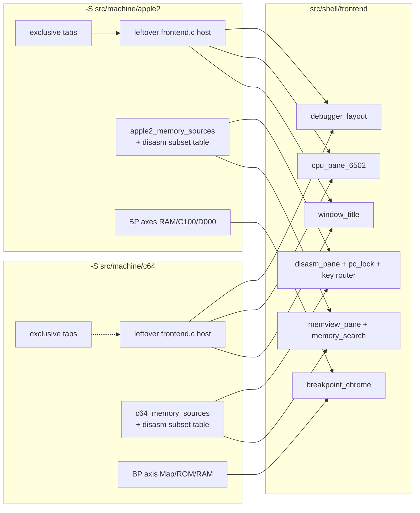

# Stage 8 — Debugger UI chrome

| Field | Value |
|-------|-------|
| **Author** | Grok (Designer) |
| **Date** | 2026-08-27 |
| **Status** | Accepted |
| **Canonical path** | [`design/debugger-chrome.md`](debugger-chrome.md) |
| **Stage map** | [`design/merge-stage-map.md`](merge-stage-map.md) Stage 8 (UNIFY chrome + PRESERVE machine tables, exclusive tabs) |
| **Depends on** | Stage 3 ([`design/assembler-disasm.md`](assembler-disasm.md)), Stage 5 ([`design/control-command-tables.md`](control-command-tables.md)), Stage 6 ([`design/runtime-shell-extract.md`](runtime-shell-extract.md)), Stage 7 ([`design/runtime-client-seam.md`](runtime-client-seam.md)). |

This is the detailed design for Stage 8. It does not reopen the stage map. Key Decisions 6, 8, and 10, the Stage 8 in-scope/out-of-scope lists, and the standing invariants (two binaries, no ifdef in shell, exclusive Misc tabs including Assembler, no Inspector clock rewrite) are folded in as constraints.

**Choice: pane modules + leftover host ops.** Do not extract `frontend.c` as one file. Do not introduce a Z80 stub. Adapter fallback from Stage 7 stays unused: chrome includes `runtime_client_subset.h` names only through leftover ops (intent queue stays leftover).

---

## Overview

After Stages 3–7, leftover `frontend.c` is still two 11k-line dumps (Apple 11253, C64 10871). Shared chrome (layout, 6502 CPU pane, disasm pane, memview pane, breakpoint list/dialog chrome, window title) is inlined next to exclusive Misc tabs, CRT, input, and Inspector. a2m already extracted `debugger_disasm.c` (391, **unwired** — leftover still inlines `frontend_disassembly_handle_key`), `disasm_pc_lock.c` (310, twin), `memory_search.c` (138), `debugger_layout.c` (256, prefix twin of `c64_layout.c`). c64m inlines disasm keys and has no Opt+F search.

Stage 8 UNIFY lifts those panes into `src/shell/frontend/` as **separate files**. Each leftover `project()` keeps `frontend.c` as the host: render loop, exclusive tabs, CRT, input, intent queue. Machine-published **tables** (memory sources, disasm cycle subset, breakpoint mapping axes, CPU class, window-title strings) are leftover; shell walks tables.

There is still no root `project(machines)`, no flattening of leftover `src/`, no `#ifdef APPLE2` in `src/shell`, no Inspector film/birth/picture-copy rewrite, and no unify of leftover `runtime_client.c` beyond Stage 7.

---

## Background & Motivation

### Entry verification (2026-08-27)

| Artifact | a2m | c64m | Stage 8 |
|----------|-----|------|---------|
| `debugger_layout.c` / `c64_layout.c` | 256 | 256, prefix rename | EXTRACT; Apple names |
| `disasm_pc_lock.c` | 310 | 310, include-guard prefix only | EXTRACT |
| `debugger_disasm.c` | 391, compiled, **no call sites** | inlined in `frontend.c` | EXTRACT key router; wire both |
| `memory_search.c` | 138 + Opt+F dialog | absent | EXTRACT; C64 gets it |
| `window_title.c` | `a2m - {model} - {turbo} - {state}`; inspect cycles | `c64m - {PAL/NTSC} - {turbo} - {state}`; inspect `"Inspect"` | EXTRACT formatter; leftover wrappers |
| CPU pane | A/X/Y/SP/P/PC + flags in `frontend.c` | same layout | EXTRACT `cpu_pane_6502.c` |
| Disasm draw | `frontend_draw_disassembly_view` + 6 source caches | same + 3 caches; always NMOS | EXTRACT pane; leftover tables |
| Memview draw | Map→Main→Aux→LC1→LC2→ROM; `apple_ascii` default on | CPU map→ROM→RAM→drive8→drive9; 7-bit ASCII | EXTRACT pane; `HIGHBIT_ASCII` view flag |
| BP list | Misc Breakpoints tab | same list chrome | EXTRACT list |
| BP dialog mapping | RAM Map/Main/Aux; C100 Map/ROM; D000 Map/LC1/LC2/ROM | one axis Map/ROM/RAM | chrome shared; axes leftover-published |
| Exclusive tabs | Machine / Debugger / Hardware / **Assembler** / Config | same + 1541/VIC/CIA | STAY leftover |
| Fonts / CRT | `mono_font_data.h`; CRT 364 | `c64_pro_mono_font_data.h`; CRT 169 | STAY leftover |

`apple2.h` / `c64.h` must not appear in the new shell pane files. Stage 7 subset is the client **name** surface; leftover still implements and leftover frontend still queues intents (today's architecture). Panes call leftover through ops, not by including leftover `runtime_client.h`.

### Pain points

- Prefix twins (`debugger_layout` / `c64_layout`) will fork the moment a gutter is tweaked in one tree.
- Apple `debugger_disasm.c` is a second key table that leftover `frontend_disassembly_handle_key` does not call. Lifting it without wiring it leaves C64 inlined and Apple with two tables.
- High-bit ASCII and LC vs drive 8 are currently `#ifdef`-shaped even without the macros: Apple `apple_ascii` vs C64 `frontend_memory_ascii(value)` with no flag.
- Opt+M is four hardcoded switches (Apple memview, Apple disasm, C64 memview, C64 disasm). Stage 5 already published sources.

### What this stage is not

Stage 9 Inspector clocks / film / pink / sample-ID / `enter-inspector` on A2M **wire**, unifying leftover `runtime_client.c` extras, unifying `runtime_thread` display publish (ARGB vs indexed8), sharing font headers, merging CRT phosphor (364 vs 169), flattening leftover `src/`, root `project(machines)`, extracting whole `frontend.c`, adding a Z80 stub, or fixing `history_control_integration`.

---

## Goals & Non-Goals

### Goals

1. Layout, disasm pane, memview pane, 6502 CPU pane, breakpoint **list/dialog chrome**, and window-title formatter live under `src/shell/frontend/` with **no** `APPLE2` / `C64` ifdefs.
2. Opt+M cycles the **table the pane was given** (not a global enum). Apple memview: Map→Main→Aux→LC1→LC2→ROM. Apple disasm: Map→ROM→Main. C64 memview: CPU map→ROM→RAM→Drive 8→Drive 9. C64 disasm: CPU map→ROM→RAM (today's 3-stop cycle; drives stay memview-only).
3. High-bit ASCII is a **view flag** on a memview, defaulted from `MEMSRC_HIGHBIT_ASCII` on the current source (Apple sources have it, C64 do not). Not `#ifdef`.
4. CPU widget is `cpu_pane_6502.c` because both binaries are 6502. The layout **slot** is "CPU pane". Do not add `cpu_pane_z80.c`.
5. Breakpoint mapping **axes** stay leftover-published. Apple: three fields (RAM / C100 / D000). C64: one field (Map / ROM / RAM). Shell chrome draws whatever axes the leftover table lists. Do not invent a C64 drive-CPU breakpoint mapping this stage (current product has none; drive 8/9 is a memview source).
6. Exclusive tabs (Machine, Debugger, Hardware, **Assembler**, Config) still compile only into their binary. May split to leftover `frontend_tabs_*.c` if it helps leftover `frontend.c` size; those files still link only into that binary.
7. Leftover `frontend.c` drops by the extracted panes (thousands of lines). CRT, input, joystick, fonts, exclusive tabs, Inspector tab internals stay.
8. `test_disasm_pc_lock`, `test_memory_search`, leftover Apple `test_memview` stay green. New shell tests for source-table cycle + window title. C64 memview tests against the published table (shell fake table + leftover `c64_memory_sources` cycle).
9. a2m 78/78 must not regress (new tests may add). c64m: 72 pass + 10 SKIP + the same `history_control_integration` fail.

### Non-goals

- Rewriting Inspector birth/land/film or unifying picture copy. The Inspector **tab** may already call Stage 7 enter/leave/land **names** through leftover intents; do not change clocks.
- Compiling subset implementations into `libshell` (Stage 7: leftover `.c` stays).
- Sharing `mono_font_data.h` / `c64_pro_mono_font_data.h`.
- Unifying CRT paint. Barrel math is not proven identical; leave both `crt_renderer.c`.
- Making Apple memview skip Aux on ][+ (leftover `frontend_memory_next_mode` always includes Aux; `view_area_cycle` in leftover `memview.h` is silicon VIEW_FLAGS, not the pane).
- Wiring leftover `debugger_disasm.c` browse **defaults** (byte-oriented) as the live product. Leftover browse is instruction-oriented via PC-lock. The shared key **table** is the extract; leftover supplies browse callbacks.

---

## Proposed Design

### Target layout after Stage 8

```text
machines/
  src/shell/
    CMakeLists.txt                 # append pane .c into libshell
    control/memory_source.{c,h}    # + cycle helper
    frontend/
      nuklear.*                    # Stage 2
      disk_led_data.* forensics_view.* help_view.*  # Stage 6
      debugger_layout.{c,h}        # MOVE (Apple names)
      disasm_pc_lock.{c,h}         # MOVE
      debugger_disasm.{c,h}        # MOVE key router; wire leftover
      memory_search.{c,h}          # MOVE
      cpu_pane_6502.{c,h}          # NEW: 6502 register widget
      disasm_pane.{c,h}            # NEW: decode/draw/keys via tables
      memview_pane.{c,h}           # NEW: dump/edit/search/split
      breakpoint_chrome.{c,h}      # NEW: list + dialog chrome
      window_title.{c,h}           # MOVE parameterized formatter
    tests/frontend/
      test_disasm_pc_lock.c        # MOVE (identical)
      test_memory_search.c         # MOVE
      test_window_title.c          # NEW (both product strings)
      test_memory_source_cycle.c   # NEW (two fake tables; Opt+M)
      test_cpu_pane_6502.c         # NEW (format/parse, no nk)
  src/machine/apple2/src/frontend/
    frontend.c                     # host: render, exclusive tabs, CRT, intents
    frontend_input.c               # STAY
    frontend_joystick_input.c      # STAY
    crt_renderer.c                 # STAY
    mono_font_data.h               # STAY
    # NO debugger_layout / disasm_pc_lock / debugger_disasm / memory_search / window_title .c
    # optional: frontend_tabs_{machine,debugger,hardware,assembler,config}.c
  src/machine/c64/src/frontend/
    same leftover pattern; c64_pro_mono_font_data.h STAY
    # NO c64_layout.c
```



### Choice: leftover host ops, not a vtable on `runtime_client`

Stage 7 already decided subset-not-adapter. Leftover frontend talks to leftover `runtime_client` through an **intent queue** (`frontend_push_*` → `main.c` poll). Changing panes to call `runtime_client_set_a` directly would rewrite leftover main dispatch. Out of scope.

Shell panes take a small **ops** struct (`void *ctx` + function pointers). Leftover ops implementations push the same intents as today. Shell files include `runtime_client_subset.h` only if a pane needs a subset **type** (it does not: ops wrap it). They do not include leftover `runtime_client.h`, `apple2.h`, or `c64.h`.

This is the same split `debugger_disasm_ops` already used (unused until this stage wires it).

### Layout (`debugger_layout.c`)

Take Apple names (`debugger_layout`, `DEBUGGER_LAYOUT_DRAG_*`). Body is the 256-line twin. C64 leftover `c64_layout` type aliases **or** leftover `struct frontend` embeds `debugger_layout` and leftover `c64_layout_*` call sites become `debugger_layout_*`. Prefer embed + rename call sites (C64 has few). Delete both leftover copies.

Default splits / 352×248 aspect stay parameters on the struct (already). Limits stay leftover-filled (min display size differs by product CRT).

### Window title

Shell:

```c
void debugger_format_window_title(
    char *out,
    size_t out_size,
    const char *product,   /* "a2m" / "c64m" */
    const char *label,     /* model or "PAL"/"NTSC" */
    const char *turbo,     /* leftover-formatted */
    const char *state);    /* "Running" / "Paused (BRK)" / "INSPECT …" / "Inspect" */
```

Format: `{product} - {label} - {turbo} - {state}`. Empty fields are omitted with their separators (leftover never passes empty today).

Leftover wrappers keep `frontend_format_window_title[_ex]` so leftover `main.c` and C64 `test_window_title` stay. Wrappers format turbo + state (Apple milli-MHz via leftover `runtime_turbo_format_label`; C64 Normal/Max/Warp; inspect suffix as today) and call the shell formatter. Product string is a leftover literal in the wrapper, not `#ifdef` in shell.

Shell `test_window_title` asserts both product strings. Leftover C64 test remains (wrapper contract).

`runtime_stop_reason` stays leftover. Shell never includes leftover `runtime_event.h`.

### 6502 CPU pane

Shell types (no leftover snapshot header):

```c
typedef struct cpu_pane_6502_regs {
    uint16_t pc;
    uint8_t a, x, y, sp, p;
} cpu_pane_6502_regs;

typedef struct cpu_pane_6502_state {
    /* same buffers as leftover frontend_register_view_state */
} cpu_pane_6502_state;

typedef struct cpu_pane_6502_ops {
    void *ctx;
    void (*set_pc)(void *ctx, uint16_t);
    void (*set_sp)(void *ctx, uint8_t);
    void (*set_a)(void *ctx, uint8_t);
    void (*set_x)(void *ctx, uint8_t);
    void (*set_y)(void *ctx, uint8_t);
    void (*set_status)(void *ctx, uint8_t);
} cpu_pane_6502_ops;
```

`cpu_pane_6502_draw(ctx, bounds, state, regs, has_cpu, editable, ops)` is leftover `frontend_draw_registers` moved. Leftover copies `runtime_cpu_snapshot` fields into `cpu_pane_6502_regs` each frame (`has_cpu` / `inspecting` / paused → `editable` as today). Both binaries compile this widget. No Z80 file.

### Memory source cycle helper (shell `memory_source.c`)

```c
uint32_t memory_source_cycle_next(
    const memory_source *table,
    size_t count,
    uint32_t current_id);
```

Walk table order; wrap. If `current_id` is not in the table, return `table[0].id` (or 0 if count 0). Opt+M and Source menus use this. **Two leftover tables per binary**, not ifdefs:

| Pane | Apple leftover table | C64 leftover table |
|------|----------------------|--------------------|
| Memview | `apple2_memory_sources` (6: Map Main ROM Aux LC1 LC2 — cycle **UI order** Map→Main→Aux→LC1→LC2→ROM) | `c64_memory_sources` (5) |
| Disasm | leftover `apple2_disasm_sources`: Map, ROM, Main (ids 0, 2, 1) | leftover `c64_disasm_sources`: CPU map, ROM, RAM (ids 0, 2, 1) |

Apple memview **UI cycle order** is not the leftover table declaration order (table is Map, Main, ROM, Aux, LC1, LC2). Leftover publishes a **cycle array** of ids (or a second table in cycle order). Chosen: leftover cycle tables are ordered as the Opt+M sequence. The control-wire table (`apple2_memory_sources`) stays Stage 5 declaration order (capabilities/parse unchanged). Disasm/memview panes receive the cycle table.

Shell tests use fake tables only. No `"LC1"` / `"Drive 8"` literals required in shell tests if ids+flags suffice; labels may appear in a cycle test as generic strings.

### High-bit ASCII

Not `#ifdef`. Memview state has `bool highbit_ascii`. On source change, default `highbit_ascii = (src->flags & MEMSRC_HIGHBIT_ASCII) != 0` unless the user has toggled it this visit (leftover Apple today keeps `apple_ascii` per view; default on at first view init). C64 sources have no `HIGHBIT_ASCII` → default off. ASCII column and typed ASCII writes strip/set bit 7 when the flag is on (today's `frontend_memory_ascii` / `frontend_memory_ascii_store_byte`).

Apple leftover `memview.h` `VIEW_FLAGS` (48K / $C100 / $D000) stays Apple silicon. Shell source-id is `uint32_t`. Do not move `view_flags_t` into shell.

### Disasm pane

Move leftover `frontend_disassembly_view_state` into `disasm_pane_state` (shell). `runtime_memory_mode mode` → `uint32_t source_id`. Cache array size `DISASM_PANE_CACHE_MAX = 8` (covers Apple 6 and C64 3). Decode calls `disasm_6502_decode_line(..., state->cpu_class)`.

Leftover sets `cpu_class` each frame: Apple `apple_model == 0` → 65C02 else NMOS (existing UI convention); C64 always NMOS.

Key handling: leftover `frontend_disassembly_handle_key` becomes a call to `debugger_disasm_handle_key` with leftover ops:

- `browse_*` → leftover instruction-oriented walk (`frontend_disassembly_previous_address` / PC-lock). Do **not** switch the product to byte-oriented defaults.
- `on_cycle_memory_mode` → `memory_source_cycle_next` on the **disasm** table.
- `on_toggle_execute_bp` / `on_set_pc` / `on_symbol_lookup` → leftover intents / dialogs.

`debugger_disasm.c` include guard drops `A2M_`. C64 leftover deletes the inlined key table (same chords).

Draw (`disasm_pane_draw`) is leftover `frontend_draw_disassembly_view` moved. Host ops: request memory range, write-history lookup, symbol resolver pointer (shell `symbol_table` already), dialog-open / view-active flags.

Fetch bytes: leftover still merges RPC into the 64K `disasm_pc_lock_cache`. Pane reads the cache. That is leftover `runtime_memory_snapshot` staying leftover.

### Memview pane

Move leftover `frontend_memory_view_state` / split-view array into `memview_pane_state`. `mode` → `uint32_t source_id`. `apple_ascii` → `highbit_ascii`.

Opt+M: `memory_source_cycle_next` on the **memview** table.

Opt+F / Opt+G: `memory_search` dialog + find (Apple today). C64 leftover had no search; it gains the same chords. Search walks the active view's cached bytes (64K circular), not silicon.

Editable: `src->flags & MEMSRC_WRITABLE`. C64 drives (`MEMSRC_FOREIGN_BUS`, no `WRITABLE`) stay read-only. Apple all-writable sources stay editable when paused and not inspecting.

Border color: shell has a small palette keyed by **flags**, not product names: Map (no extra flags / default) = no border (today Map skips border); `HIGHBIT_ASCII` writable planes use leftover Apple colors by **index in the cycle table** (leftover may pass a `nk_color` per source as an optional leftover table field — **rejected**: that puts Nuklear colors in leftover control tables). Chosen: shell maps `(index % N)` to the existing 6 Apple colors for non-foreign; `MEMSRC_FOREIGN_BUS` uses grey (today's C64 drive border); ROM (`!WRITABLE && !FOREIGN_BUS`) uses orange. Visual match to today for the published sequences.

Split / join / dissolve / color slots stay in the pane (already generic).

Host ops: request view snapshot, write byte, open symbol lookup, write-history, dialog-open / active-view.

### Breakpoints chrome

**List** (`breakpoint_chrome_draw_list`): leftover `frontend_draw_misc_breakpoints` moved. Rows are a shell-neutral entry:

```c
typedef struct breakpoint_chrome_row {
    uint32_t id;
    uint16_t start_address, end_address;
    uint8_t has_end_address, enabled, use_counter;
    uint32_t access, current_hits, counter;
} breakpoint_chrome_row;
```

Leftover copies from leftover `runtime_breakpoint_snapshot_entry`. Ops: new / edit / duplicate / enable / clear / clear-all / view-pc.

**Dialog** (`breakpoint_chrome_draw_editor`): shared Access / Address / Counter / Actions (Break Fast Slow Tron Troff Type Swap). Mapping block is a leftover-published axis table:

```c
typedef struct breakpoint_mapping_axis {
    const char *label;          /* "RAM", "C100", "D000", "Mapping" */
    const char *const *options; /* {"Map","Main","Aux"} */
    size_t option_count;
    int *value;                 /* leftover dialog int */
} breakpoint_mapping_axis;
```

Apple leftover: 3 axes (values are leftover `A2SEL*` / `view_flags` fields as today). C64 leftover: 1 axis Map/ROM/RAM (`RUNTIME_BREAKPOINT_MAPPING_*`). Apply still leftover (`frontend_breakpoint_dialog_build_definition` writes leftover `runtime_breakpoint_definition`). Swap slot (Apple) vs swap param only (C64) stay leftover extra rows **or** optional flags on the dialog state (`has_swap_slot`). Do not put `view_flags_t` in shell.

Misc tab **Debugger** (step buttons, etc.) stays leftover exclusive (`frontend_draw_misc_debugger`).

### Exclusive tabs / leftover host

STAY in leftover `frontend.c` unless split this stage into leftover `frontend_tabs_*.c` (still one-binary):

- `frontend_draw_misc_programs` (Machine)
- `frontend_draw_misc_debugger`
- `frontend_draw_misc_hardware`
- **`frontend_draw_misc_assembler`** (MLI / dest=map — per-binary)
- Configure dialogs
- `frontend_input.c`, `frontend_joystick_input.c`
- Fonts
- CRT renderer
- Inspector tab draw / film / pink (Stage 9)
- Display / disk LEDs / file browser / symbol lookup dialog / reset prompt

Chosen: **do not split exclusive tabs this stage** unless leftover `frontend.c` remains >9k after pane extract and the split is mechanical. Default is leave them in leftover `frontend.c`. Pane extract is the required line-count drop.

### File-by-file

#### NEW / MOVE shell (`src/shell/frontend/` unless noted)

| File | Role |
|------|------|
| `debugger_layout.c/h` | MOVE Apple copy; delete C64 `c64_layout.*` |
| `disasm_pc_lock.c/h` | MOVE; drop `A2M_` / `C64M_` guard |
| `debugger_disasm.c/h` | MOVE; drop `A2M_` guard; wire leftover keys |
| `memory_search.c/h` | MOVE; comment is 64K circular, not "Apple" |
| `cpu_pane_6502.c/h` | NEW draw/edit |
| `disasm_pane.c/h` | NEW state+draw+decode; uses pc_lock + key router |
| `memview_pane.c/h` | NEW dump/edit/search/split |
| `breakpoint_chrome.c/h` | NEW list + dialog chrome |
| `window_title.c/h` | NEW `debugger_format_window_title` |
| `control/memory_source.c` | add `memory_source_cycle_next` |
| tests listed above | MOVE/NEW |

#### STAY leftover (updated)

| File | Change |
|------|--------|
| leftover `frontend.c` | delete moved functions; embed shell state; ops; set cpu_class / source tables |
| leftover `frontend.h` | include shell pane headers as needed; drop duplicate window_title types if wrappers stay |
| leftover `window_title.c/h` | thin wrappers around shell formatter (keep leftover test / main.c) |
| leftover frontend CMake | drop extracted .c; still compile leftover frontend.c + CRT + input + shell `help_view.c` |
| leftover `control_verbs.c` | add disasm cycle tables (or frontend-local tables) |
| leftover root CMake | retarget `test_disasm_pc_lock` / `test_memory_search` to shell sources; register new shell tests |
| Apple `memview.h` | **untouched** (VIEW_FLAGS silicon) |
| leftover `test_memview.c` | **untouched** |

`help_view.c` stays leftover-compiled (per-binary `help_content.inc`). Pane `.c` compile into `libshell`.

---

## API / Interface Changes

- New shell types: `cpu_pane_6502_*`, `disasm_pane_state`, `memview_pane_state`, `breakpoint_chrome_*`, `debugger_format_window_title`.
- `memory_source_cycle_next`.
- Leftover `debugger_layout` name on C64 (was `c64_layout`).
- Leftover disasm/memview `runtime_memory_mode` fields become `uint32_t` source ids (numeric values unchanged).
- No `A2M/N` / `C64M/N` bump. No `MACHINES/1`.
- No leftover `runtime_client` extra APIs.

Include path: leftover `#include "cpu_pane_6502.h"` via `shell` PUBLIC `frontend/`.

---

## Data Model Changes

None on disk. INI breakpoint mapping tokens stay leftover (`runtime_breakpoint_ini.c`). HST1 / Inspector catalogs / frame rings unchanged.

---

## Alternatives Considered

### 1. Extract `frontend.c` as one file with `#ifdef APPLE2`

Forbidden by the map. How ifdef soup starts.

### 2. help_view pattern: compile pane `.c` in leftover frontend with leftover types

Would let panes include leftover `frontend.h`. Then shell sources depend on leftover silicon headers when leftover compiles them, and C64 vs Apple leftover headers fork the TU. Rejected for panes. help_view stays leftover-compiled only because of `help_content.inc`.

### 3. Panes call `runtime_client_*` subset directly

Correct per Stage 7 names, but leftover main.c intent poll is the live path. Rewriting it is out of scope. Ops wrap intents.

### 4. One memory-source table per binary; disasm cycles the full list

Would add Drive 8/9 to C64 disasm and Aux/LC to Apple disasm. Product change the map did not ask. Two leftover tables.

### 5. Skip Aux on ][+ in Apple memview Opt+M

`view_area_cycle` does that for VIEW_FLAGS. Leftover frontend Opt+M does not. Preserve leftover frontend.

### 6. C64 breakpoint axis "CPU vs drive"

Map shorthand. Landed C64 mapping is Map/ROM/RAM. Drive is a memview source. Inventing drive-CPU BP mapping is a product fork. Preserve Map/ROM/RAM.

### 7. Share CRT barrel math

Not proven identical (364 vs 169, phosphor). Out of scope.

### 8. Split exclusive tabs to `frontend_tabs_*.c` this stage

Allowed. Default skip; pane extract is the required drop. Revisit only if leftover `frontend.c` stays huge after panes move.

---

## Security & Privacy Considerations

Unchanged: bind `127.0.0.1`, leftover payload caps, leftover deferred 1 vs 16. Memview search is local 64K cache.

---

## Observability

No new telemetry. Prove is ctest + greps below.

---

## Implementation Notes

1. Write this design; commit it; then implement in a second commit.
2. MOVE twins first (layout, pc_lock, memory_search, debugger_disasm, window_title formatter).
3. Add `memory_source_cycle_next` + tests.
4. CPU pane, then memview, then disasm, then BP chrome (each leftover `frontend.c` deletion in the same change as the shell file).
5. Wire C64 Opt+F. Wire leftover keys through `debugger_disasm_handle_key`.
6. Do not start Stage 9. Do not fix `history_control_integration`. Do not edit `cpu65` / `c6510` / Inspector recorder.

Winner for twins: Apple copy (`git mv`) so history follows; delete C64 copies in the same change.

---

## Testing Strategy

- Shell `test_disasm_pc_lock`: moved, both gates (already both).
- Shell `test_memory_search`: moved; **both** gates (C64 did not have it).
- Shell `test_window_title`: `a2m - //e Enhanced - 1.00 MHz - Running` shape and `c64m - PAL - Normal - Inspect` via leftover-style strings passed in (test supplies turbo/state already formatted).
- Shell `test_memory_source_cycle`: fake memview table 6 ids; fake disasm table 3 ids; wrap; unknown id → first.
- Shell `test_cpu_pane_6502`: format buffers / parse hex / flag bits; no Nuklear.
- Leftover Apple `test_memview`: VIEW_FLAGS silicon, unchanged, green.
- Leftover C64: new `test_c64_memory_sources_cycle` **or** reuse shell cycle test plus leftover unit that `c64_memory_sources` count is 5 and cycle Map→ROM→RAM→drive8→drive9. Chosen: leftover `tests/frontend/test_c64_memview_sources.c` walks `c64_memory_sources` + `c64_disasm_sources` with `memory_source_cycle_next`. Apple leftover equivalent optional (shell fake tables cover the helper; Apple `test_memview` covers silicon).
- Leftover C64 `test_window_title` still passes through wrapper.

---

## Documentation Plan

- This file is the Stage 8 design (committed first).
- [`design/README.md`](README.md) indexes it (active → landed when code lands).
- [`agents/README.md`](../agents/README.md): Stage 8 done; remaining work is Stage 9 Inspector; exclusive tabs leftover; do not start 9 from that note.

---

## Rollout Plan

Same two `-S` trees. No protocol bump.

---

## Open Questions

None that block implementation.

Non-blocking:

- Folding named pane objects into a single `debugger_chrome.c` is rejected (map: do not extract `frontend.c` as one file).
- Stage 10 moves `src/shell/tests/` to repo-root `tests/shell/`. Not now.
- Exclusive tab split is optional this stage.

### Self-check against Stage 8 map

| Map item | This design |
|----------|-------------|
| Layout merge 256-line twins | `debugger_layout`; delete `c64_layout` |
| Disasm pane + pc_lock; C64 inlined keys | lift + wire `debugger_disasm_handle_key` |
| Fetch via memory source table + Stage 7 | leftover ops request; pane uses `source_id` |
| Decode Stage 3 CPU class | leftover sets class; pane passes through |
| Memview dump/edit/search; Opt+F shell feature | C64 gains search |
| High-bit ASCII view flag, Apple default on | `MEMSRC_HIGHBIT_ASCII` default |
| CPU pane 6502 widget; no Z80 stub | `cpu_pane_6502.c` only |
| BP UI chrome; mapping axes leftover | axis table; Apple 3 fields; C64 Map/ROM/RAM |
| Window title parameterized | `debugger_format_window_title` |
| Exclusive tabs including Assembler leftover | STAY |
| Fonts / CRT leftover | STAY |
| Do not extract `frontend.c` as one file | pane modules |
| No `#ifdef APPLE2` for LC vs drive 8 | tables |
| Apple VIEW_FLAGS not shell source-id | `memview.h` untouched |
| Inspector tab not rewritten | leftover Inspector stay |
| a2m 78/78; c64m 72+10 SKIP+known fail | new tests may add |

No product fork the map did not decide. Two cycle tables per binary is the map's "two different tables, not ifdefs". C64 BP Map/ROM/RAM is landed product, not a new "CPU vs drive" axis. C64 disasm staying 3 sources is preserving current Opt+M, not refusing the 5 published memview sources.

---

## Prove

Host CMake (Stages 2–7 used the same). Debug. From repo root:

```bash
cmake -B build/a2m  -S src/machine/apple2  -DCMAKE_BUILD_TYPE=Debug
cmake -B build/c64m -S src/machine/c64    -DCMAKE_BUILD_TYPE=Debug
cmake --build build/a2m -j && cmake --build build/c64m -j
ctest --test-dir build/a2m  --output-on-failure
ctest --test-dir build/c64m --output-on-failure
./build/a2m/a2m --help
./build/c64m/c64m --help
```

| Gate | Required |
|------|----------|
| a2m | **78/78 or higher** (new shell tests may add). Includes `disasm_pc_lock`, `memory_search`, leftover `memview`. |
| c64m | **72 passed, 10 skipped, 1 failed** out of 83 **plus any new tests**. Fail = `history_control_integration` (do not fix). SKIPs = the same ten asset-gated tests. |

#### Must be empty / absent (fail the stage if any hit)

```bash
# Shell panes have no product ifdefs / silicon headers / leftover extras.
test -z "$(git grep -E '#ifdef APPLE2|#ifdef C64|apple2\\.h|c64\\.h|c64_frame|poll_argb_frame|host_key|c64_key|memview\\.h|VIEW_FLAGS' -- src/shell/frontend || true)"

# Extracted twins gone from leftover frontend dirs.
test ! -f src/machine/apple2/src/frontend/debugger_layout.c
test ! -f src/machine/c64/src/frontend/c64_layout.c
test ! -f src/machine/apple2/src/frontend/disasm_pc_lock.c
test ! -f src/machine/c64/src/frontend/disasm_pc_lock.c
test ! -f src/machine/apple2/src/frontend/memory_search.c
test ! -f src/machine/apple2/src/frontend/debugger_disasm.c

# Fonts and CRT stayed leftover.
test -f src/machine/apple2/src/frontend/mono_font_data.h
test -f src/machine/c64/src/frontend/c64_pro_mono_font_data.h
test -f src/machine/apple2/src/frontend/crt_renderer.c
test -f src/machine/c64/src/frontend/crt_renderer.c

# Exclusive Assembler tab not in shell.
test -z "$(git grep -l 'frontend_draw_misc_assembler' -- src/shell || true)"
```

`git grep` with no matches may exit 1; treat empty output as pass.

#### Informational

```bash
wc -l src/machine/apple2/src/frontend/frontend.c src/machine/c64/src/frontend/frontend.c
git grep -n 'cpu_pane_6502_draw' -- src/machine src/shell
git grep -n 'memory_source_cycle_next' -- src/shell src/machine
```

---

## Key Decisions

1. **Pane modules, not one `frontend.c`.** Layout / CPU / disasm / memview / BP chrome / title are separate shell files.
2. **Leftover host ops wrap leftover intents.** No vtable on `runtime_client`. No subset `.c` in `libshell`.
3. **Two leftover cycle tables per binary.** Memview vs disasm. Shell `memory_source_cycle_next`.
4. **High-bit ASCII is a view flag** defaulted from `MEMSRC_HIGHBIT_ASCII`.
5. **CPU widget is 6502 only.** Slot is CPU pane. No Z80 stub.
6. **BP mapping axes leftover-published.** Apple ram/c100/d000; C64 Map/ROM/RAM. No invented drive-CPU BP axis.
7. **Window title is `{product} - {label} - {turbo} - {state}`.** Leftover formats turbo/state/inspect suffix.
8. **Wire `debugger_disasm_handle_key`; leftover browse callbacks stay instruction-oriented.**
9. **C64 gains Opt+F search.** Same shell `memory_search`.
10. **Apple `memview.h` VIEW_FLAGS stay Apple.** Shell source-id is `uint32_t`.
11. **Fonts, CRT, exclusive tabs (including Assembler), Inspector internals leftover.**
12. **Do not split exclusive tabs by default this stage.**
13. **No machines-root `project()`, no flatten, no Stage 9.**

---

## References

- [`design/merge-stage-map.md`](merge-stage-map.md) — Stage 8, KD 6/8/10, standing PRESERVE exclusive tabs
- [`design/runtime-client-seam.md`](runtime-client-seam.md) — subset header; leftover extras
- [`design/control-command-tables.md`](control-command-tables.md) — `memory_source` / `MEMSRC_*`
- [`design/assembler-disasm.md`](assembler-disasm.md) — CPU class
- leftover Apple `debugger_layout.c`, `debugger_disasm.c`, `memory_search.c`, `memview.h`
- leftover C64 `c64_layout.c`, inlined disasm keys, Map/ROM/RAM BP dialog

---

## PR Plan

Stage 8 is this design then implement. Grain is **two** independently reviewable commits.

### PR 8.0 — Design (this document)

- **Title:** `docs: Stage 8 design for debugger chrome`
- **Files:** `design/debugger-chrome.md`, `design/README.md` (index active)
- **Depends on:** Stages 3, 5, 6, 7
- **Description:** Land this design. Pane modules + leftover tables. No source extract.

### PR 8.1 — Shared debugger chrome

- **Title:** `unify: debugger chrome (layout, CPU, disasm, memview, BP, title)`
- **Files / components:**
  - `src/shell/frontend/{debugger_layout,disasm_pc_lock,debugger_disasm,memory_search,cpu_pane_6502,disasm_pane,memview_pane,breakpoint_chrome,window_title}.*`
  - `memory_source_cycle_next`; shell tests
  - leftover `frontend.c` drops extracted panes; leftover wrappers; leftover CMake
  - leftover disasm/memview cycle tables
  - `agents/README.md`; `design/README.md` **landed**
- **Depends on:** PR 8.0
- **Description:** Both binaries draw CPU / disasm / memview from `src/shell/frontend`. Exclusive tabs leftover. **Stage 8 exit.**

Do not start Stage 9 from these PRs.
