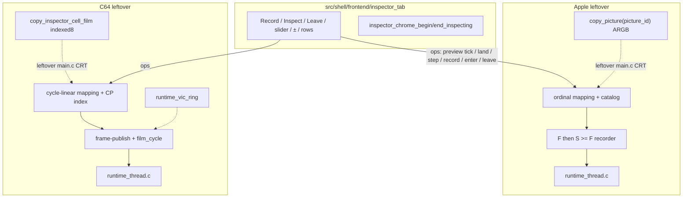

# Stage 9 — Inspector unification

| Field | Value |
|-------|-------|
| **Author** | Grok (Designer) |
| **Date** | 2026-08-27 |
| **Status** | Landed |
| **Canonical path** | [`design/inspector-unification.md`](inspector-unification.md) |
| **Stage map** | [`design/merge-stage-map.md`](merge-stage-map.md) Stage 9 (UNIFY product shape + PRESERVE clocks, pictures, max-turbo policy) |
| **Depends on** | Stage 5 ([`design/control-command-tables.md`](control-command-tables.md)), Stage 7 ([`design/runtime-client-seam.md`](runtime-client-seam.md)), Stage 8 ([`design/debugger-chrome.md`](debugger-chrome.md)). |

This is the detailed design for Stage 9. It does not reopen the stage map. Key Decisions 9, 15, and 16, the Stage 9 in-scope/out-of-scope lists, and the standing invariants (two binaries, no ifdef in shell, no `runtime_thread` unify, HST1 ≠ Inspector) are folded in as constraints.

**Choice: leftover host ops + leftover clocks.** One Inspector **tab** in `src/shell/frontend/`. Shared slider widget ≠ shared birth function. Picture blit stays leftover (ARGB vs indexed8 never enter shell). `enter-inspector` lands on the A2M wire (`A2M/13` → `A2M/14`). Record does not arm or stop HST1.

---

## Overview

After Stage 8, leftover `frontend.c` still hosts the Inspector tab (~300 lines of Record / Inspect / slider / ± chrome in each binary, plus leftover mapping helpers). Birth, land, film, and max-turbo policy remain in leftover `runtime_inspector*` / `runtime_thread`. Stage 7 already published subset **names** `runtime_client_inspector_{set_enabled,enter,leave,land,land_to_cycle}`. Picture/catalog/film APIs stay leftover.

Stage 9 UNIFY lifts the **tab chrome** (Record checkbox, Forensics…, Inspect/Leave, `[-]`/`[+]`/slider, Snapshot/cycle rows, cobalt window headers) into `src/shell/frontend/inspector_tab.*`. Leftover fills a view model and ops each frame. Apple F/S pairing and C64 frame-publish / `film_cycle` / pink / `--inspector-off-on-max` do not move.

Wire: `get-state` still reports `mode=live|inspector`. A2M gains `enter-inspector` (capability token `inspector`, same as `leave-inspector`) and bumps to **A2M/14**. C64M already has enter+leave; **C64M/8 stays**.

Record-vs-HST1: Apple `runtime_inspector_set_enabled` today calls `runtime_history_resume` (stale TM0). That call is deleted. Tests follow KD 15, not the TM0 comment.

There is still no root `project(machines)`, no flattening of leftover `src/`, no `#ifdef APPLE2` in `src/shell`, no unify of leftover `runtime_thread`, and no Stage 10/11.

---

## Background & Motivation

### Entry verification (2026-08-27)

| Axis | a2m | c64m | Stage 9 |
|------|-----|------|---------|
| Tab draw | leftover `frontend_draw_misc_inspector` (~230 lines) | leftover (~250 lines) | EXTRACT chrome; leftover mapping |
| Slider | catalog ordinal; max `min(N-1, 1000)` | cycle-linear 0..1000 oldest→live | leftover mapping; shared `nk_slider_int` widget |
| `[-]` / `[+]` | adjacent catalog sample (incl. NOW) | CP lattice via `adjacent_cycle` | leftover step; shared buttons |
| Land | `land_sample(sample_id)` | quantized `land(cycle)` | leftover; shared release-to-land |
| Preview film | `copy_picture(picture_id)` ARGB 560×192 | `copy_inspector_cell_film(cycle)` indexed8 | leftover `main.c`; never shell |
| Scrub miss | pink ARGB unless NOW keep-current | full pink CRT fill; LIVE not pink | leftover CRT; honesty rule stays |
| Record in max | stays on (~60 Hz block paint) | `--inspector-off-on-max` (default true) wipes | PRESERVE per product |
| Wire | `leave-inspector` only | `enter-inspector` / `leave-inspector` | add A2M enter; bump A2M/14 |
| Record → HST1 | `set_enabled` calls `runtime_history_resume` | independent | **delete Apple resume**; tests assert independence |
| Recorder files | `runtime_inspector.c` + `runtime_inspector_recorder.c` | inlined in `runtime_inspector.c` + `runtime_vic_ring` | STAY leftover |
| Tests | `runtime_inspector`, `_replay`, `_mode`, `_bp` | `runtime_inspector`, `_replay`, `_mode`, `runtime_vic_ring`, `inspector_control_integration` | keep; do not invent c64m `_bp` |

Landed clocks (do not re-litigate):

- Apple: [`src/machine/apple2/design/frame-aligned-inspector.md`](../src/machine/apple2/design/frame-aligned-inspector.md), [`agents/apple2/timemachine.md`](../agents/apple2/timemachine.md)
- C64: [`src/machine/c64/design/inspector-frame-synced-record.md`](../src/machine/c64/design/inspector-frame-synced-record.md), [`agents/c64/runtime-control.md`](../agents/c64/runtime-control.md)

### Pain points

- Inspector tab chrome will fork the moment a slider row is tweaked in one leftover `frontend.c`.
- A2M scripts cannot enter Inspect on the wire (`agents/known-gaps.md`); C64M already can. Shared shape requires the verb.
- Apple Record still resumes HST1; the map already decided they are independent toggles.

### What this stage is not

Unifying F/S with `film_cycle`, unifying ARGB 560×192 with indexed8 / VIC ring, driving the slider from HST1, Promote/Branch, reverse CPU, write-delta streams, extracting `runtime_thread.c`, `#ifdef APPLE2` in `src/shell`, capability negotiation, making Apple wipe Record on max because C64 does (or the reverse), moving Apple recorder logic into C64 `runtime_inspector.c`, extracting leftover `frontend.c` as one file, Stage 10/11, or fixing `history_control_integration`.

---

## Goals & Non-Goals

### Goals

1. One Inspector tab implementation in `src/shell/frontend/`; both binaries link it. Exclusive tabs (Machine / Debugger / Hardware / Assembler / Config) stay leftover.
2. Shared product verbs/shape: Record on/off, Inspect (enter), Land (quantized / exact), Leave, `[-]`/`[+]`, NOW, sealed re-execute, film-vs-reconstruct, pink-on-scrub-miss **where that machine's honesty rule says so**.
3. Shared slider **widget**; leftover birth and leftover tick→stop mapping.
4. Shared `runtime_client` names: existing Stage 7 enter/leave/land/land_to_cycle plus `runtime_client_inspector_step(direction)` (leftover implementations keep Apple sample-walk vs C64 CP-walk).
5. `enter-inspector` on A2M; `CONTROL_PROTOCOL_VERSION` **A2M/14**; capability token `inspector`. C64M stays **C64M/8**.
6. `get-state` still reports `mode=live|inspector`.
7. Record on/off does **not** start or stop HST1 on either binary. Apple `runtime_history_resume` inside `runtime_inspector_set_enabled` is deleted. Tests assert independence (C64 already does; Apple `test_runtime_inspector` is rewritten off the stale TM0 arming asserts).
8. Film/preview stays leftover picture APIs. Shell never includes `display_frame.h` / `c64_frame.h` / `runtime_ring_frame`.
9. Cobalt inspect headers (RGB 24,62,118 / 32,76,136 / 40,88,152) are a shell helper leftover render calls. Do not tint panel fill.
10. Manuals updated **per binary** for the shared shape; machine-specific clock paragraphs stay in each book.
11. a2m 81/81 must not regress (new tests may add). c64m: do not fix `history_control_integration`. Apple finite/max pairing tests and C64 frame-publish / pink-on-scrub / vic-ring tests stay green.

### Non-goals

- Shared birth function. Shared catalog type. Shared picture buffer type.
- Compiling leftover `runtime_inspector*.c` into `libshell`.
- Unifying leftover `runtime_client.c` extras beyond the step **name**.
- Adding land/seek/step **wire** verbs (map asked only for A2M `enter-inspector`).
- Inventing `runtime_inspector_bp` on c64m.
- Changing Apple `history_off_on_max` (HST1-only) or C64 `--inspector-off-on-max` (Record wipe).
- Forensics tab rewrite (already shell HST1 FIND).

---

## Proposed Design

### Who implements birth vs slider

```text
BIRTH (leftover worker — never shell)
  Apple: leftover runtime_thread finite cadence / max block paint
         → runtime_inspector_recorder (F then first instruction-boundary S >= F;
            max: ~60 Hz block paint at the already-reached boundary)
         Join picture by sample/picture ID, never nearest-cycle.
  C64:   leftover runtime_publish_completed_frame
         → push film (when not turbo-display) → finish-to-instruction-boundary
         → checkpoint with film_cycle (0 if ring did not push)
         Join by exact film_cycle / machine_cycle. Neighbour stills forbidden.

SLIDER WIDGET (shell inspector_tab)
  nk_slider_int + [-] / [+] + thumb-down tracking.
  Does not know samples, film_cycle, or picture IDs.

TICK MAPPING (leftover frontend helpers — stay)
  Apple: tick ↔ catalog ordinal (frame-aligned-inspector mapping;
         N=0 no slider; N=1 disabled tick 0; N>=2 ordinal = floor(t*(N-1)/M),
         M = min(N-1, 1000)).
  C64:   tick 0..1000 linear over oldest_cycle → newest_cycle;
         release / ± quantize to Record cell (nearest CP <=, or LIVE).
```



Shared slider widget is **not** a shared birth function. Do not drive the slider from HST1.

### Max-turbo policy (per product — PRESERVE)

| Product | Record in max | HST1 in max | UI |
|---------|---------------|-------------|-----|
| **Apple** | TimeMachine **stays on**; each ~60 Hz block presentation is a navigable sample. Finite/max barriers share the replay-event log. Turbo change alone does not wipe the catalog. | Default `history_off_on_max` pauses only the dense CPU observer. `--no-history-off-on-max` keeps HST1 too. Independent of Record. | Record checkbox stays enabled. |
| **C64** | `--inspector-off-on-max` (default **true**) **wipes Record** on turbo 2/3 and remembers it for leave-max; turbo 1 restores Record into an **empty** window. Opt out with `--no-inspector-off-on-max`. Warp/FAST stall film (`film_cycle = 0`) when recording through turbo-display. MAX can still push film when wipe is off. | Independent. Off-on-max does **not** pause HST1. | Record checkbox **locked** while `inspector_stopped_for_max`. |

Do **not** make Apple Record wipe on max because C64 does, or make C64 keep Record in max because Apple does. `--inspector-off-on-max` stays a **C64-only** policy flag / INI key.

### Target layout after Stage 9

```text
machines/
  src/shell/
    CMakeLists.txt                      # + inspector_tab.c
    frontend/
      inspector_tab.{c,h}               # NEW: tab chrome + cobalt helper
      … Stage 8 panes unchanged …
    runtime/
      runtime_client_subset.h           # + inspector_step(direction)
    tests/frontend/
      test_inspector_tab.c              # NEW: view/ops, no silicon headers
  src/machine/apple2/src/
    frontend/frontend.c                 # delete draw_misc_inspector body;
                                        # leftover mapping + film preview stay
    runtime/runtime_inspector.c         # stop HST1 resume on Record; STAY
    runtime/runtime_inspector_recorder.c  # STAY Apple clock
    runtime/runtime_thread.c            # STAY (must still differ from C64)
    runtime/runtime_client.h/.c         # extras: catalog/copy_picture/land_sample
    control/control_protocol.h          # A2M/14; ENTER_INSPECTOR
    control/control_verbs.c             # enter-inspector
    control/control_dispatch.c          # enter → runtime_client_inspector_enter
  src/machine/c64/src/
    frontend/frontend.c                 # same extract
    runtime/runtime_inspector.c         # STAY C64 clock (recorder inlined)
    runtime/runtime_vic_ring.*          # STAY
    runtime/runtime_thread.c            # STAY
    runtime/runtime_client.h/.c         # extras: cell_film / checkpoint_step
    control/                          # C64M/8 unchanged
```

### Choice: leftover host ops, not a catalog type in shell

Stage 8 already decided leftover ops wrap leftover intents. Inspector follows that. Shell does **not** grow `runtime_inspector_sample_meta` or a C64 `(cycle, film_cycle)` index. Those types mention leftover clocks.

Shell types (no leftover headers):

```c
typedef struct inspector_tab_row {
    const char *label;   /* "History start cycle", "Frame cycle", … */
    const char *value;   /* leftover-formatted */
    bool wrap;           /* C64 media-cut reason */
} inspector_tab_row;

typedef struct inspector_tab_view {
    bool inspecting;
    bool record_on;
    bool record_locked;      /* C64 max/warp policy; Apple always false */
    bool can_enter;
    bool window_valid;
    const char *empty_message; /* leftover: "snapshots" vs "checkpoints" */
    int slider;
    int slider_max;          /* Apple min(N-1,1000); C64 1000 (or 0 if N<2) */
    bool can_previous;
    bool can_next;
    bool thumb_blocks_step;  /* leftover: thumb down blocks ± */
    char snapshot_line[192];
    char cycle_line[64];
    inspector_tab_row extra[8];
    size_t extra_count;
} inspector_tab_view;

typedef struct inspector_tab_state {
    int slider;
    bool thumb_down;
} inspector_tab_state;

typedef struct inspector_tab_ops {
    void *ctx;
    void (*on_record)(void *ctx, bool enabled);
    void (*on_enter)(void *ctx);
    void (*on_leave)(void *ctx);
    void (*on_open_forensics)(void *ctx);
    void (*on_preview_tick)(void *ctx, int tick);
    void (*on_land_tick)(void *ctx, int tick);
    void (*on_step)(void *ctx, int direction); /* -1 / +1 */
} inspector_tab_ops;
```

`inspector_tab_draw(ctx, view, state, ops)` is leftover `frontend_draw_misc_inspector` moved. Leftover fills `view` from leftover debug + catalog/CP index **before** draw; leftover ops push the same intents as today.

Thumb-down: shell updates `state->thumb_down` / `state->slider`. Leftover copies those into leftover `frontend_misc_view_state` after draw so leftover `main.c` CRT preview can read `inspector_thumb_down` without including extra shell state. Preview **identity** (Apple `picture_id` / sample_id vs C64 `preview_cycle`) stays leftover, set from `on_preview_tick`.

Land only on thumb **release** (`on_land_tick`). Drag must not reconstruct. That is the honesty rule for both products; leftover CRT still paints film or pink.

### Film / preview through leftover picture APIs

Shell tab never requests pixels.

| Product | Leftover `main.c` while thumb down | Hit | Miss |
|---------|-------------------------------------|-----|------|
| Apple | `frontend_inspector_preview` → `runtime_client_inspector_copy_picture(picture_id, runtime_ring_frame *)` | submit ARGB | solid pink 560×192 unless leftover `keep_current` (NOW) |
| C64 | `frontend_inspector_preview` → `runtime_client_copy_inspector_cell_film(preview_cycle, c64_frame *)` | submit indexed8; `set_preview_film(true)` | **full pink** CRT fill (`RGB 255,0,255`); LIVE/NOW is not "missing film ⇒ pink" |

Join rules stay leftover:

- Apple: exact **picture/sample ID**. Never `runtime_frame_ring_copy_by_cycle` for Inspector.
- C64: quantize preview → cell → exact `film_cycle`. Never nearest-≤ neighbour.

Thumb-down preview **must not reconstruct** if that product's honesty rule says pink. Committed land / ± reconstruct is leftover worker (Apple reconstruct from hidden anchor; C64 film-first else `publish_presented_frame`). Shell does not call leftover reconstruct APIs.

### Cobalt headers

Leftover render already applies inspect header colours when `debug->inspecting`. Move the RGB triple into shell:

```c
void inspector_chrome_begin_inspecting(
    struct nk_context *ctx, struct nk_style_window *saved);
void inspector_chrome_end_inspecting(
    struct nk_context *ctx, const struct nk_style_window *saved);
```

Only `style.window.header.{normal,hover,active}`. Do not tint panel fill. Leftover render calls begin/end around the debugger layout, as today.

### Shared client names

Stage 7 subset already has set_enabled / enter / leave / land / land_to_cycle. Stage 9 adds:

```c
bool runtime_client_inspector_step(
    runtime_client *client, int direction, uint64_t request_token);
```

Leftover implementations:

- Apple: same command as today's `runtime_client_inspector_step_sample`. Keep `step_sample` as a leftover extra wrapper so existing call sites compile.
- C64: same command as today's `runtime_client_inspector_checkpoint_step`. Keep `checkpoint_step` as a leftover extra wrapper.

Direction semantics stay leftover (Apple catalog adjacency including NOW; C64 greatest CP `<` focus / least CP `>` focus else LIVE). Picture/catalog extras stay leftover. Stub in `test_runtime_client` records last direction.

### A2M `enter-inspector` (KD 16)

Bump leftover `CONTROL_PROTOCOL_VERSION` `"A2M/13"` → **`"A2M/14"`**.

| File | Change |
|------|--------|
| Apple `control_protocol.h` | version string; `CONTROL_COMMAND_ENTER_INSPECTOR` |
| Apple `control_verbs.c` | `{ "enter-inspector", "inspector", NULL, parse_empty }` next to leave |
| Apple `control_dispatch.c` | same fire-and-forget as leave: alloc token, `runtime_client_inspector_enter`, `ok accepted=1` |
| Apple `test_control_protocol.c` | parse `enter-inspector` |
| Apple `test_runtime_inspector_mode.c` | TCP `enter-inspector` while live-with-window; `get-state` `mode=inspector`; existing `leave-inspector` stays. Hello asserts `A2M/14` |
| Apple manuals / `agents/control-tools.md` / `known-gaps.md` / `--help` / Python client banners | A2M/14; enter exists |

Capability token is **`inspector`** (already advertised). `capabilities` does not grow a second token. No negotiate/enable.

C64: **no wire change**. `enter-inspector` / `leave-inspector` already exist. Do not bump C64M.

### Record does not arm or stop HST1 (KD 15)

Apple `runtime_inspector_set_enabled` (leftover `runtime_inspector.c`) today:

```c
if (rt->history != NULL) {
    (void)runtime_history_resume(rt->history, cycle);
}
if (rt->frame_ring_memory_mb > 0u) {
    runtime_frame_ring_set_recording(&rt->frame_ring, true);
}
runtime_inspector_recorder_set_enabled(rt, true);
```

**Delete the `runtime_history_resume` block.** Keep frame-ring arm: film is Inspector pictures, not HST1. Disable path must not call `runtime_history` stop/pause. `runtime_inspector_on_history_invalidate` on disable is Inspector tape policy (recording gap), not HST1 stop — keep it.

Stale comments to rewrite in the same change: `runtime_inspector.h` TM0 line, `test_runtime_inspector.c` file banner and "history armed on TM on" asserts.

C64 `runtime_inspector_set_enabled` already does not touch HST1. Keep it. C64 `test_runtime_inspector` already asserts independence.

Film/frame-ring arming on Record on is **not** HST1 and stays (both products today).

### Exclusive tabs / leftover host

STAY leftover in each `frontend.c`:

- `frontend_draw_misc_programs` / `_debugger` / `_hardware` / `_assembler` / Configure
- CRT, input, joystick, fonts
- Inspector **mapping helpers** (`slider_to_ordinal` / `slider_to_cycle`, chase pending land, step toward, preview identity)
- Film preview in leftover `main.c`
- Forensics open (shell `forensics_view` already)

Misc tab **button** "Inspector" stays leftover (it is the tab strip next to exclusive tabs). Only the Inspector **content** is shell.

Do **not** extract leftover `frontend.c` as one file.

### File-by-file

#### NEW / UPDATE shell

| File | Role |
|------|------|
| `frontend/inspector_tab.c/h` | tab draw + cobalt helper |
| `runtime/runtime_client_subset.h` | + `inspector_step` |
| `tests/frontend/test_inspector_tab.c` | view/ops: record_locked ignores toggle; empty slider_max disables; no apple2.h/c64.h |
| `tests/runtime/test_runtime_client.c` | stub `inspector_step` |

#### STAY leftover (updated)

| File | Change |
|------|--------|
| leftover `frontend.c` | delete `frontend_draw_misc_inspector` body; fill view + ops; call `inspector_tab_draw`; cobalt begin/end |
| leftover `frontend.h` / misc state | keep leftover preview identity fields; embed or mirror `inspector_tab_state` |
| leftover `main.c` | film preview unchanged (leftover picture APIs) |
| Apple `runtime_inspector.c` | stop HST1 resume; TM0 comment |
| Apple `runtime_inspector_recorder.c` | **untouched** (clock) |
| C64 `runtime_inspector.c` / `runtime_vic_ring` | **untouched** (clock) |
| leftover `runtime_thread.c` both | **untouched** (must still differ) |
| leftover `runtime_client.h/.c` | implement `inspector_step`; keep extras |
| Apple control protocol/verbs/dispatch | A2M/14 + enter |
| leftover CMake | register `test_inspector_tab`; Apple protocol tests |
| Apple `test_runtime_inspector.c` | Record ≠ HST1 |
| manuals / leftover agents notes | shared shape + per-book clocks; A2M/14 |

---

## API / Interface Changes

- New shell: `inspector_tab_*`, `inspector_chrome_begin/end_inspecting`.
- Subset: `runtime_client_inspector_step`.
- A2M: `enter-inspector`; protocol **A2M/14**. No `MACHINES/1`.
- C64M: **no bump**.
- Leftover extras keep leftover types (`runtime_ring_frame`, `c64_frame`, catalog, `film_cycle`).
- `get-state` `mode=live|inspector` unchanged.

Include path: leftover `#include "inspector_tab.h"` via `shell` PUBLIC `frontend/`.

---

## Data Model Changes

None on disk. `.a2state` / `.c64state` / HST1 / frame rings / VIC ring / Inspector catalogs unchanged. INI: Apple `history_off_on_max` and C64 `inspector_off_on_max` stay per-binary.

---

## Alternatives Considered

### 1. Shared catalog of "stops" in shell; both sliders become ordinal

Would smash C64's cycle-linear scrub continuum (landed design: oldest→live in `machine_cycle` space, quantize on release). Map: shared widget ≠ shared birth, and do not smash raster-is-king C64 into Apple sample ordinals. **Rejected.**

### 2. Extract leftover `frontend.c` Inspector plus exclusive tabs as one file

Forbidden. How ifdef soup starts.

### 3. Put ARGB vs indexed8 behind `#ifdef` in shell

Forbidden. Leftover picture APIs exist so shell never sees the pixel type.

### 4. Unify Record max policy to "whichever is nicer"

Forbidden. Apple continuity vs C64 wipe is PRESERVE.

### 5. Add land/seek/step on the A2M wire

Map asked only for `enter-inspector`. Land/± stay UI / `runtime_client`. **Rejected** this stage.

### 6. Move Apple recorder into C64 `runtime_inspector.c` "because a2m split a file"

Forbidden by the map caution.

### 7. Adapter vtable on `runtime_client` for film copy

Stage 7 rejected adapter. Film stays leftover extras. Tab ops wrap intents; leftover `main.c` calls leftover copy. **Rejected.**

### 8. Stop Apple Record from arming the frame ring as well as HST1

Map decided HST1 independence only. Film is Inspector pictures. Both products arm film on Record on. Keep. Not a new product fork.

---

## Security & Privacy Considerations

Unchanged: bind `127.0.0.1`, leftover payload caps, leftover deferred 1 vs 16. `enter-inspector` is fire-and-forget localhost, same as C64M today. Sealed replay must continue to suppress host media write-through (see leak list).

---

## Observability

No new telemetry. Existing window info (`checkpoint_count`, `media_truncations`, Apple catalog count) remains leftover.

---

## Implementation Notes

1. Write this design; commit it; then implement in a second commit.
2. Shell tab + cobalt helper + shell test first (prove no machine includes).
3. Wire leftover both `frontend.c` to `inspector_tab_draw`; delete inlined draw.
4. A2M enter-inspector + version bump + protocol tests + hello assert.
5. Apple `runtime_inspector_set_enabled`: drop HST1 resume; rewrite `test_runtime_inspector`.
6. Add subset `inspector_step` + leftover wrappers.
7. Manuals per binary; leftover agents notes that mention A2M/13 or "no enter".
8. Do not start Stage 10/11. Do not fix `history_control_integration`. Do not edit `cpu65` / `c6510` / recorder birth.

Winner for tab chrome: neither leftover copy is a twin (ordinal vs cycle). Write the shared widget from the common layout (Record, Forensics, Inspect/Leave, 8%/84%/8% slider row, Snapshot, cycle, extra rows). Leftover mapping functions stay in leftover `frontend.c` (or leftover `frontend_inspector_map.c` if that keeps leftover `frontend.c` smaller — optional, still one-binary).

---

## Testing Strategy

### Entry (already exist — must stay)

- a2m: `runtime_inspector`, `runtime_inspector_replay`, `runtime_inspector_mode`, `runtime_inspector_bp`
- c64m: `runtime_inspector`, `runtime_inspector_replay`, `runtime_inspector_mode`, `runtime_vic_ring`, `inspector_control_integration`
- Do **not** require `runtime_inspector_bp` on c64m.

### Record ≠ HST1 (required; add/assert if missing)

**Apple** (`test_runtime_inspector.c` rewrite of stale TM0 arming):

1. Default play: HST1 recording is independent of Inspector default-off.
2. `inspector_set_enabled(false)` does not stop HST1.
3. Explicit `history-record off`, then `inspector_set_enabled(true)`: HST1 **stays off**; Inspector **on**. (Today this assert is inverted — change the test with the code.)
4. `inspector_set_enabled(false)` after that: HST1 still off.
5. Pin 3 remains: `history-record off` stays off while Record stays on (already true).
6. `inspector=1` with `history_memory_mb=0`: Inspector on, HST1 unavailable/not recording.

**C64** (already in `test_runtime_inspector.c`): keep "Inspector off stopped HST1" / "off->on changed HST1" / "inspector=1 armed HST1" fails. No behavior change.

### Sealed-leak list (union, **per machine**)

Both products agree: CPU observer off, mem-access CB off, no host audio, no host media write-through, guest media write cuts the window. Prove the union:

| Leak | Apple (leftover tests) | C64 (leftover tests) |
|------|------------------------|----------------------|
| CPU observer / HST1 count stable across sealed materialize | `test_runtime_inspector_replay` "seal HST1" | `test_runtime_inspector_replay` "seal: HST1 record count changed" |
| Mem-access CB / watchpoint does not fire during materialize | add if missing (C64 already has "seal: watchpoint fired") | already present |
| Frame ring not pushed during sealed Inspect | add assert ring count stable on materialize if missing | already "seal: frame ring count changed" |
| Host audio muted (`runtime_produce_audio` not on sealed path / Mockingboard host mute) | leftover replay must not produce host audio; assert no audio callback or sealed flag on scratch | `c64_set_audio_output_enabled(false)` in `apply_live_seal`; assert sealed flag / no SID host pull if a hook exists; else document as covered by `replay_sealed` |
| Host media write-through suppressed | housekeeping flush does not truncate (already); sealed replay does not call host write | `c64_notify_guest_media_write` no-ops when `replay_sealed` (unit or replay) |
| Guest media **write that succeeds** cuts the window | existing media-cut tests in `_replay` | existing truncate tests |
| Refused write-protect does not cut | existing / add if missing | existing |
| Housekeeping (eject flush, save-state flush) does not cut | existing "flush does not truncate" | existing |
| HostFS directory refresh is `HOST_DIRECTORY` marker, not a silent join | Apple-only existing marker tests | N/A |
| VIC line observer off during seal | N/A | `apply_live_seal` clears it; vic-ring tests stay |
| Sealed Inspect does not birth new CPs / samples | existing Inspect-does-not-record tests | existing D16 / sealed no-CP tests |

Do not invent a shared leak harness. Extend the leftover `_replay` files per machine. If a row is already proven, keep the existing assert; only add the missing Apple watchpoint-during-materialize (mirror C64) and any missing ring-count-on-materialize on Apple.

Thumb-down must not reconstruct: leftover preview path already film-or-pink. Shell test: `on_preview_tick` does not call `on_land_tick`; land only on release.

### Wire / chrome

- Apple protocol: parse `enter-inspector`; hello `A2M/14`.
- Apple mode integration: TCP enter while a window exists → `mode=inspector`; leave → `mode=live`.
- Shell `test_inspector_tab`: record_locked does not fire `on_record`; slider_max 0; Forensics ops fire; no silicon includes.
- Shell `test_runtime_client`: `inspector_step` on stub.

### Must stay green (clocks)

- Apple finite/max pairing (`runtime_inspector_replay` / `_mode` max continuity).
- C64 frame-publish birth, pink-on-scrub neighbour-miss, post-enter cell-film join, `runtime_vic_ring`.

---

## Documentation Plan

- This file is the Stage 9 design (committed first).
- [`design/README.md`](README.md) indexes it (active → landed when code lands).
- [`agents/README.md`](../agents/README.md): Stage 9 done; remaining work is Stage 10; do not start 10/11 from that note.
- Per-binary manuals: shared shape (Record / Inspect / Land / Leave / ± / NOW / Forensics is HST1). Clock paragraphs stay:
  - Apple: F/S pairing, sample ID, Record stays in max, `history_off_on_max` is HST1-only, Record does not arm HST1. Fix `[debug]` text that currently says Record "On arms the CPU flight recorder".
  - C64: frame-publish birth, `film_cycle`, full pink on scrub miss, `--inspector-off-on-max`.
- Leftover `agents/control-tools.md` / `known-gaps.md`: A2M/14; enter exists. Leftover `timemachine.md` wire line: enter now exists; Record ≠ HST1.

Help is generated per binary from that product's `manual/manual.md`.

---

## Rollout Plan

Same two `-S` trees. A2M protocol bump. C64M unchanged.

---

## Open Questions

None that block implementation.

Non-blocking:

- Optional leftover `frontend_inspector_map.c` (still one-binary) if leftover `frontend.c` stays huge after the tab extract.
- Stage 10 moves `src/shell/tests/` to repo-root `tests/shell/`. Not now.

### Self-check against Stage 9 map

| Map item | This design |
|----------|-------------|
| Shared verbs/shape Record/Inspect/Land/Leave/±/NOW/sealed/film-vs-reconstruct/pink-where-honesty | tab chrome + leftover clocks + leftover CRT |
| One Inspector tab in shell; both binaries link it | `inspector_tab.c` in `libshell` |
| Do not extract leftover `frontend.c` as one file | tab module only; exclusive tabs leftover |
| Shared client enter/leave/land/step names | Stage 7 names + `inspector_step` |
| Wire `get-state` `mode=live\|inspector` | unchanged |
| Add `enter-inspector` on A2M; bump `A2M/N` | A2M/14; token `inspector` |
| C64M bump only if shared shape changes C64 wire | C64M/8 stays |
| Record does not arm or stop HST1 | delete Apple `history_resume`; tests |
| Apple F then S >= F; sample/picture ID; max continuity; recorder file may stay | STAY under apple2 |
| C64 frame-publish; `film_cycle`; VIC ring; pink on scrub miss; `--inspector-off-on-max` C64-only | STAY under c64 |
| Shared slider widget ≠ shared birth | leftover mapping |
| Do not unify ARGB with indexed8 | leftover picture APIs; shell has no pixels |
| Do not drive slider from HST1 | Forensics stays FIND |
| Do not move Apple recorder into C64 file | files stay |
| Do not extract `runtime_thread` | files still differ |
| No `#ifdef APPLE2` in `src/shell` | ops + leftover strings |
| No capability negotiation | static `inspector` token |
| No Promote/Branch / reverse CPU / write-delta | out of scope |
| Sealed leak union listed per machine | Testing Strategy table |
| Thumb-down must not reconstruct if honesty says pink | land only on release; leftover film-or-pink |
| Manuals per binary; clock paragraphs stay | Documentation Plan |
| a2m inspector tests listed; c64m listed; no c64m `_bp` | Testing Strategy |
| Do not fix `history_control_integration` | Prove |
| Do not start Stage 10/11 | Rollout |

No product fork the map did not decide. Apple ordinal vs C64 cycle-linear slider is PRESERVE of landed clocks, not a new fork. Film arming on Record on is existing product on both, not HST1. Empty-message "snapshots" vs "checkpoints" is leftover copy. C64 Record lock on max is the already-decided C64 policy flag.

---

## Prove

Host CMake (Stages 2–8 used the same). Debug. From repo root:

```bash
cmake -B build/a2m  -S src/machine/apple2  -DCMAKE_BUILD_TYPE=Debug
cmake -B build/c64m -S src/machine/c64    -DCMAKE_BUILD_TYPE=Debug
cmake --build build/a2m -j && cmake --build build/c64m -j
ctest --test-dir build/a2m  --output-on-failure
ctest --test-dir build/c64m --output-on-failure
./build/a2m/a2m --help
./build/c64m/c64m --help
```

| Gate | Required |
|------|----------|
| a2m | **81/81 or higher** (new tests may add). Includes `runtime_inspector`, `_replay`, `_mode`, `_bp`. Hello/version show **A2M/14**. |
| c64m | existing pass + 10 SKIP + the same `history_control_integration` fail **plus any new tests**. Fail = `history_control_integration` (do not fix). Includes `runtime_inspector`, `_replay`, `_mode`, `runtime_vic_ring`, `inspector_control_integration`. |

#### Must be empty / absent (fail the stage if any hit)

```bash
# Shell Inspector sources have no product ifdefs / silicon / leftover picture types.
test -z "$(git grep -E '#ifdef APPLE2|#ifdef C64|apple2\\.h|c64\\.h|c64_frame|display_frame|poll_argb_frame|copy_picture|copy_inspector_cell_film|runtime_vic_ring|film_cycle' -- src/shell/frontend/inspector_tab.c src/shell/frontend/inspector_tab.h src/shell/tests/frontend/test_inspector_tab.c || true)"

# runtime_thread still per-machine and still different.
test -f src/machine/apple2/src/runtime/runtime_thread.c
test -f src/machine/c64/src/runtime/runtime_thread.c
test "$(cmp -s src/machine/apple2/src/runtime/runtime_thread.c src/machine/c64/src/runtime/runtime_thread.c; echo $?)" != 0

# Apple recorder / C64 vic_ring stayed leftover.
test -f src/machine/apple2/src/runtime/runtime_inspector_recorder.c
test -f src/machine/c64/src/runtime/runtime_vic_ring.c

# Exclusive Assembler tab not in shell.
test -z "$(git grep -l 'frontend_draw_misc_assembler' -- src/shell || true)"
```

`git grep` with no matches may exit 1; treat empty output as pass.

#### Informational

```bash
git grep -n 'inspector_tab_draw' -- src/machine src/shell
git grep -n 'enter-inspector' -- src/machine/apple2
git grep -n 'A2M/14' -- src/machine/apple2
git grep -n 'runtime_history_resume' -- src/machine/apple2/src/runtime/runtime_inspector.c
```

The last grep must be empty inside `runtime_inspector_set_enabled`.

---

## Key Decisions

1. **One Inspector tab in shell; leftover clocks.** Shared widget, leftover birth, leftover tick mapping.
2. **Leftover host ops wrap leftover intents.** No catalog/picture types in shell. No vtable on `runtime_client`.
3. **Film stays leftover picture APIs.** Apple `copy_picture` by ID; C64 `copy_inspector_cell_film` by exact `film_cycle`. Shell never sees ARGB vs indexed8.
4. **A2M/14 adds `enter-inspector`.** Capability token `inspector`. C64M/8 unchanged.
5. **Record does not arm or stop HST1.** Delete Apple `runtime_history_resume` on enable. Film arming may stay.
6. **Max-turbo policy stays per product.** Apple Record continuous; C64 `--inspector-off-on-max` wipe.
7. **`runtime_client_inspector_step` is the shared step name.** Leftover extras wrap existing sample-step / checkpoint-step.
8. **Cobalt headers are a shell helper**; leftover render calls it. No panel-fill tint.
9. **Sealed leaks listed per machine**; extend leftover `_replay` where a row is missing (Apple watchpoint-during-materialize).
10. **No machines-root `project()`, no flatten, no Stage 10/11, no `history_control_integration` fix.**

---

## References

- [`design/merge-stage-map.md`](merge-stage-map.md) — Stage 9, KD 9/15/16, cautions
- [`design/runtime-client-seam.md`](runtime-client-seam.md) — subset names; leftover extras
- [`design/debugger-chrome.md`](debugger-chrome.md) — leftover host ops pattern; Inspector tab not rewritten in Stage 8
- leftover Apple `design/frame-aligned-inspector.md`, `agents/timemachine.md`
- leftover C64 `design/inspector-frame-synced-record.md`, `agents/runtime-control.md`
- leftover `frontend.c` `frontend_draw_misc_inspector`

---

## PR Plan

Stage 9 is this design then implement. Grain is **two** independently reviewable commits.

### PR 9.0 — Design (this document)

- **Title:** `docs: Stage 9 design for Inspector unification`
- **Files:** `design/inspector-unification.md`, `design/README.md` (index active)
- **Depends on:** Stages 5, 7, 8
- **Description:** Land this design. Shared tab chrome; leftover clocks. No source extract.

### PR 9.1 — Shared Inspector tab + A2M enter + Record ≠ HST1

- **Title:** `unify: Inspector tab chrome; A2M/14 enter-inspector; Record independent of HST1`
- **Files / components:**
  - `src/shell/frontend/inspector_tab.*`; shell tests
  - leftover `frontend.c` drops inlined tab; leftover mapping + film stay
  - subset `inspector_step`; leftover wrappers
  - A2M/14 + `enter-inspector`
  - Apple `runtime_inspector_set_enabled` stops HST1 resume; tests
  - manuals per binary; leftover agents notes; `agents/README.md`; `design/README.md` **landed**
- **Depends on:** PR 9.0
- **Description:** One Inspector tab in shell. Clocks leftover. **Stage 9 exit.**

Do not start Stage 10 or 11 from these PRs.
