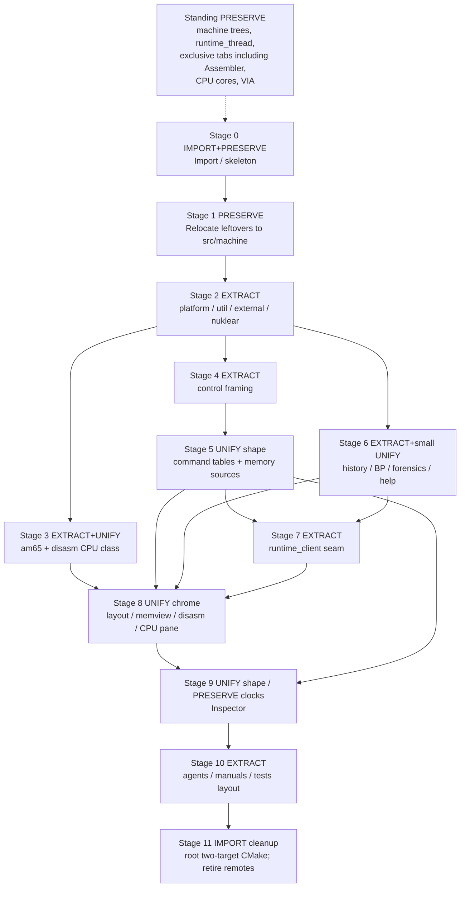

# Merge stage map: a2m + c64m → machines

| Field | Value |
|-------|-------|
| **Author** | Grok (Designer) |
| **Date** | 2026-08-27 |
| **Status** | Accepted |
| **Canonical path** | [`design/merge-stage-map.md`](merge-stage-map.md) |

This is a **stage map**, not a fully specified implementation of every subsystem. Each stage gets its own detailed design when that stage is reached. An engineer (or agent) reading this should know what Stage N is for, what must not leak into it, and when it is done. Stages are numbered 0–11 (relocate + runtime-client seam are first-class, not implied by chrome/retire).

---

## Overview

`a2m` (Apple ][+ / //e Enhanced, version 3.0.0, protocol **A2M/13**) and `c64m` (Commodore 64, version 0.1.0, protocol **C64M/8**) are sibling C99 emulators with the same layered shape (`machine` / `runtime` / `frontend` / `control` / `platform` / `util` / `tools`) and deliberately similar debugger muscle memory. They are not the same product: the silicon, the video contract, the media model, and the Inspector clocks already disagree in ways that `#ifdef APPLE2` cannot honestly hide.

This program of work creates a **new repo `machines`** as the long-term home. Both products continue as **two binaries** (`a2m`, `c64m`), each compiling in its own machine, manual, and ROMs. The work is to share the **debugger shell** — chrome, history/Forensics shape, breakpoints UI, help renderer, platform, util, assembler, disasm pane, memview pane, control framing — while **preserving machine integrity**. There is no dual-machine executable, no plugin loader, no shared `runtime_thread`, and no unified CPU core.

The merge is staged so that both ctest gates stay green at every EXTRACT, leftover silicon is relocated to `src/machine/{apple2,c64}` **before** chrome unifies, identical twins are lifted once (never left as two editable copies), shared panes talk to a named `runtime_client` seam (not a forked header), and the dangerous unification (Inspector) is a dedicated stage with its own design, not a drive-by inside `frontend.c`.

---

## Background & Motivation

### Why a new repo

Both trees already document the other as ancestry, not a second source of truth (`a2m/agents/README.md`: "do not open c64m to decide how a2m should work"). Copy-paste of twins has already drifted in the small (help palette macros, SDL include style, leftover C64 names in a2m) and would keep drifting. A third "shared library" repo is rejected: `am65` is already vendored in both (`src/tools/am65/`, 37 files, **byte-identical**, 7669 lines of `.c/.h`) with a hub remote (`https://github.com/StewBC/am65.git`) that is a hassle. Merging by rewriting history into `a2m.git` or `c64m.git` as the long-term home would make one product a guest in the other.

`machines` is empty today (this `design/` folder only). Sources of truth until import:

| Product | Path | Origin | Commits (HEAD) |
|---------|------|--------|----------------|
| a2m | `/Users/swessels/Develop/github/personal/a2m` | `https://github.com/StewBC/a2m.git` | 555, `d863ad9` |
| c64m | `/Users/swessels/Develop/github/personal/c64m` | `https://github.com/StewBC/c64m.git` | 599, `7f3c1ab` |

### What is already the same

Verified 2026-08-27 by `diff` / `diffstat` on the two worktrees:

| Artifact | a2m | c64m | Divergence |
|----------|-----|------|------------|
| `src/tools/am65/` | 37 files | 37 files | **identical** |
| `src/tools/disasm_6502/disasm_6502.c` | 231 | 231 | **identical** (NMOS-only table; undocumented ops are `XX`) |
| `src/runtime/runtime_history_query_parse.c` | 571 | 571 | **identical** |
| `src/runtime/runtime_history_wire.c` | 316 | 316 | **identical** |
| `src/frontend/disasm_pc_lock.c` | 307 | 307 | **identical** |
| `src/frontend/disk_led_data.c` | 114 | 114 | **identical** (extract with Forensics/help, Stage 6) |
| `src/frontend/nuklear.h` | 31109 | 31109 | **identical** (also `nuklear_config.h`, `nuklear_sdl.h`, `nuklear_impl.c` — Stage 2 vendor) |
| `src/util/audio_buffer.c` | 191 | 191 | **identical** |
| `src/util/{mutex,thread,cond,util}.c` | — | — | **identical** |
| `tools/gen_help.py` | — | — | **identical** |
| `src/frontend/forensics_view.c` | 2311 | 2311 | **3 lines**: `<SDL.h>` vs `<SDL2/SDL.h>`, two comment punctuation marks |
| `src/frontend/help_view.c` | 1374 | 1374 | **38 lines**: `HELP_PALETTE_*` vs `C64_HELP_*` macros, same RGB |
| `src/frontend/debugger_layout.c` vs `c64_layout.c` | 256 | 256 | identifier/prefix rename (28/28) |
| `src/runtime/runtime_history.c` | 1414 | 1425 | 29/18: a2m has `retain_oldest_id` + O(blocks) `partial_count`; c64m still walks records |
| `src/runtime/runtime_breakpoint_condition.c` | 490 | 488 | 5/7: a2m `cycle_in_line` + leftover `vic_cycle` alias; c64m `vic_cycle` |

Layering is the same idea in both (`frontend → runtime_client`, no live machine pointer across the thread divide). Both bind the control port to **127.0.0.1** (`platform_socket.c` `INADDR_LOOPBACK`). Both generate in-emulator help from `manual/manual.md` via `tools/gen_help.py`.

### What has already diverged (do not rubber-stamp as twins)

| Artifact | a2m | c64m | Notes |
|----------|-----|------|-------|
| `src/frontend/frontend.c` | **11218** | **10846** | 1913 insertions / 2285 deletions (~2k unique lines). Misc tabs, memory modes, Inspector chrome, input, CRT all live here. |
| `src/runtime/runtime_thread.c` | **5053** | **6901** | 6207 / 4359 — **almost fully different**. Do not share. |
| `src/main.c` | **3702** | **7739** | c64m still inlines control dispatch (~16 deferred slots). a2m extracted `control_dispatch.c` (2209 lines). |
| `src/control/control_protocol.c` | 1420 | 1665 | One mega `control_args` + one giant `control_command_type` each. `hello` product names differ. |
| `src/runtime/runtime_client.h` / `.c` | 336 / 1393 | 356 / 1465 | **Not a twin.** Picture poll, keys, media, Inspector extras fork. Stage 7 seam before chrome. |
| `src/runtime/runtime_inspector.c` | 900 + **recorder 1224** | **1503** (no separate recorder file) | Different clocks, picture types, wire verbs. |
| `src/control/control_server.c` | 698 | 653 | 388/413 — not framing-shaped; c64m pipeline high-water = deferred 16. |
| `src/util/config.c` | 341 | 305 | a2m `config_save` first-seen section order; c64m array order. |
| `src/platform/platform_socket.c` | 315 | 325 | Both `INADDR_LOOPBACK`; c64m `SO_NOSIGPIPE` / `MSG_NOSIGNAL`. |
| `src/machine/via6522.c` | 691 | 208 | **Already forked** (Mockingboard vs 1541). |
| `src/frontend/crt_renderer.c` | 364 | 169 | a2m has extra colour/mono phosphor path (202-line delta). |
| `src/platform/platform_audio.c` | 206 | 152 | Stereo AY vs SID pull — not a twin. |
| `src/machine/cpu65.c` vs `c6510.c` | 2561+1292 inln | 2561+1292 inln | Shared ancestry, **do not unify**. Both headers still have `CPU_65c02`. |
| Control deferred | capacity **1** (`control_deferred.h`: "C0: single exclusive deferred slot") | capacity **16**, pipelined `get-cpu`/`get-memory` | Product concurrency fork. |
| Memory modes | Map/Main/Aux/LC1/LC2/ROM | CPU map/RAM/ROM/drive8/drive9 | a2m still carries C64 **aliases** (see Data Model). |
| Display | ARGB **560×192** (`display_frame.h`) | indexed8, PAL 504×312 / NTSC 520×263 (`c64_frame.h`) | Never one framebuffer type. |
| CMake | 3.16, 71 `add_test` | 3.28, 82 `add_test` | a2m `testing.md` says 68 green; c64m `agents/README.md` says 77 (10 SKIP without `assets/`). |
| Extracted in a2m only | `debugger_disasm.c` (391), `memory_search.c` (138), `control_dispatch.c`, `runtime_inspector_recorder.c` | disasm/search still in `frontend.c`; dispatch in `main.c` | |

a2m `agents/rules.md` already forbids reintroducing C64 metaphors. c64m `agents/architecture.md` already forbids machine code from including SDL/Nuklear/frontend. Those rules survive the merge as **per-binary** product rules plus a new monorepo rule: shared shell has no machine ifdefs.

### Inspector is the known trap

Landed designs (do not re-litigate inside this map):

- a2m: `design/frame-aligned-inspector.md` (2026-08-26), `agents/timemachine.md`
- c64m: `design/inspector-frame-synced-record.md` (2026-08-25), `agents/runtime-control.md` Inspector section

Verified differences that Stage 9 must treat as **clock/picture preservation**, not bugs to smash:

| Axis | a2m | c64m |
|------|-----|------|
| Record clock | Pair completed beam frame `F` with first instruction-boundary snapshot `S >= F`; max ~60 Hz block paint | Birth CP on **frame-publish** after finish-to-instruction-boundary; `film_cycle`; free-running `cycles_per_frame` is **not** the Record clock |
| Picture | ARGB 560×192; join by stable **sample/picture ID**, never nearest cycle | indexed8 + VIC ring; join by **`machine_cycle` / exact `film_cycle`**; scrub miss = **full pink** |
| Max turbo | TimeMachine **stays on**; `history_off_on_max` pauses HST1 only | `--inspector-off-on-max` (default true) **wipes Record** on turbo 2/3 |
| Wire | `leave-inspector` only; no enter/land/seek (`agents/known-gaps.md`) | `enter-inspector` / `leave-inspector` |
| Recorder files | `runtime_inspector.c` + `runtime_inspector_recorder.c` | recorder inlined in `runtime_inspector.c`; plus `runtime_vic_ring` |
| HST1 | Separate FIND stream in both. Do not conflate with Inspector. | same |

Unification goal (product decision): **one Inspector product shape** (Record / Inspect / Land / Leave / film vs reconstruct / NOW / sealed re-execute) with machine-specific clocks and picture types behind the same UI and `runtime_client` verbs. Do not smash raster-is-king C64 into Apple beam semantics or vice versa.

---

## Goals & Non-Goals

### Goals

1. **`machines` is the home.** Both products build and test from this repo. a2m and c64m remotes are frozen during migration and retired after extract completes.
2. **Two binaries**, still named `a2m` and `c64m`. Each keeps its machine, manual, ROMs, INI, and control protocol product name (`A2M/N` vs `C64M/N`).
3. **Shared shell, not shared silicon.** Share debugger chrome, Inspector/Forensics/history *shape*, breakpoints UI, help renderer, platform, util, assembler, disasm *pane*, memview *pane*.
4. **Agent-safe layout.** Folder names make the split obvious. An `agents/README.md` in the monorepo states which tree is shared.
5. **Keep git history if practical** (subtree import under prefixes). Do not require rewriting either existing remote as the long-term home.
6. **Both ctest gates stay green** at every stage that claims EXTRACT.
7. **Seams only for a later Z80/Spectrum binary** (CPU panel slot + disasm backend slot, compile-in per binary). This program of work does not schedule that product.

### Non-goals

- One dual-machine executable, loadable modules, or plugins.
- A third shared-library repo (no new am65-style hub).
- Unifying `cpu65` and `c6510`. 6510 is NMOS 6502 + `$00/$01`; undocumented NMOS ops matter for C64 demos; 65C02 extra ops must not leak into C64.
- Unifying VIC-II and Apple video, frame geometry, or pixel format.
- Unifying `runtime_thread`, VIA 6522, or Misc **Machine / Hardware / Debugger / Assembler / Config** tabs as one ifdef'd file. (Inspector tab chrome is Stage 9 shared shape, not an exclusive tab.)
- `#ifdef APPLE2` soup in shared UI.
- One mega `control_args` + one giant command enum for both products.
- Capability *negotiation* ("enable extension X"). `capabilities` is a **static advertisement**.
- Unifying protocol *names* (`hello` still says `A2M/N` or `C64M/N`).
- Building a Spectrum/Z80 product, a plugin ISA layer, or `uint32_t` addresses "just in case".
- Pretending Apple LC/Aux and C64 drive RAM are the same bitmask.
- Drive-by deletion of leftover C64 aliases in a2m outside the memory-source stage.
- Rewriting Inspector clocks as a side effect of extracting `frontend.c`.

---

## Proposed Design

### Standing invariants (not stages — always true)

These are constraints on every stage. Violating them is a failed stage, even if tests are green.

| Invariant | Meaning |
|-----------|---------|
| Two binaries | `a2m` and `c64m` executables. No dual-machine exe. |
| Shared shell, not silicon | `src/shell` has no Apple/C64 ifdefs. Machine-specific `.c` is linked only into that binary. |
| `runtime_thread` stays put | Each machine keeps its worker. Do not "genericize" the hot loop. |
| CPU cores stay put | `cpu65` vs `c6510` remain separate translation units. |
| VIA already forked | `via6522.c` is two files forever. |
| Misc exclusive tabs stay per-binary | Machine, Hardware, Debugger, Assembler, Config. Inspector is shared chrome in Stage 9, not exclusive. |
| HST1 ≠ Inspector | FIND is a different product from time travel in both. |
| Control binds localhost | `127.0.0.1` only, one client. |
| am65 is in-tree | One copy after Stage 3. Not a merge-blocking third repo. |
| Z80 is a seam, not a schedule | CPU panel + disasm backend are per-ISA slots. Do not stub Z80. |

### Target tree (and why `src/shell`)

```text
machines/
  CMakeLists.txt                 # two executables after Stage 11; until then two -S trees
  agents/README.md               # which tree is shared; read order
  design/                        # this map + per-stage designs as they appear
  import/a2m/                    # Stage 0 only; Stage 1 git-mv → src/machine/apple2
  import/c64m/                   # Stage 0 only; Stage 1 git-mv → src/machine/c64
  src/
    shell/                       # SHARED debugger product — no machine ifdefs
      platform/
      util/                      # mutex/thread/queue/audio_buffer/log/config
      frontend/                  # layout, memview, disasm pane, cpu pane,
                                 # forensics, help, breakpoints chrome
      control/                   # framing + core command-table runner
      runtime/                   # history parse/wire, breakpoint conditions,
                                 # shared client subset (Stage 7) — NOT runtime_thread
      tools/am65/
      tools/disasm_6502/
      tools/symbols/
    machine/
      apple2/                    # ALL a2m-only C
        cpu65.*, video.*, diskii.*, hostfs.*, ...
        runtime_thread.c
        runtime_inspector*.c     # Apple clock + recorder
        frontend_tabs_*.c        # Machine/Hardware/Debugger/Assembler/Config
        control_verbs_*.c        # Apple extensions (softswitches, mount kind=)
        main.c
        app_options.c
      c64/                       # ALL c64m-only C
        c6510.*, vicii.*, cia.*, c1541.*, ...
        runtime_thread.c
        runtime_inspector.c      # C64 clock; vic_ring
        frontend_tabs_*.c        # Machine/Hardware/Debugger/Assembler/Config
        control_verbs_*.c        # VIC/CIA/vic-ring/run-to-raster/drive-cpu/media
        main.c
        app_options.c
  manual/a2m/                    # stays a2m's book
  manual/c64m/
  tests/shell/                   # EXTRACT twins must keep their tests
  tests/apple2/
  tests/c64/
  external/                      # one argparse/inih/logc/stb/tiny-regex/whereami
```

This ASCII is the **flattened end state**. After Stage 1 the product still has its internal `src/` (`src/machine/apple2/src/runtime/runtime_thread.c`, `src/machine/apple2/src/platform/`, …). Stages 2–9 EXTRACT from that nested layout. Flattening the nest (`src/machine/apple2/src/machine/cpu65.c` → `src/machine/apple2/cpu65.c`) is Stage 10, optional, still PRESERVE.

**Why `src/shell` rather than keeping today's `src/frontend` + `src/platform` at the root, or calling it `src/common`.** Both current products already use `src/frontend` for a mix of chrome *and* machine tabs. Agents following "put UI in frontend" will keep dumping Apple Hardware rows next to Forensics. `common` is worse: it sounds like a shared CPU. `src/shell` vs `src/machine/{apple2,c64}` is the split an agent can obey without a design review: **if it links into both binaries and has no machine ifdef, it is shell; if it links into one binary, it lives under that machine.**

`import/` is a Stage 0 staging prefix only. **Stage 1** `git mv`s each imported tree to `src/machine/{apple2,c64}` (option (a): canonical leftover path named before any EXTRACT). After that, leftover silicon lives under those two directories; EXTRACT lifts twins into `src/shell` and **deletes the copies**. Do not edit the same twin in both machine trees.

### Binary link story

```text
a2m  = src/machine/apple2/main.c
     + libapple2     (silicon + apple runtime_thread + apple tabs + apple verbs)
     + libshell      (platform, util, chrome, control runner, am65, disasm_6502)
     + SDL2

c64m = src/machine/c64/main.c
     + libc64
     + libshell
     + SDL2
```

CMake keeps two `add_executable` targets with those names. Help content is generated **per binary** from that product's `manual/*/manual.md` (`tools/gen_help.py` is shell; the `.inc` is not). ROMs, symbols, and default INI stay with the machine.

There is no plugin ABI. A later Spectrum binary would be a third `add_executable` that links `libshell` + `libspectrum` and **swaps** the CPU pane and disasm backend at compile time. That work is not scheduled here.

### Stage DAG



Stage 1 is mechanical relocate — no EXTRACT yet. After Stage 2, Stages 3, 4, and 6 may proceed in parallel. Stage 8 chrome **cannot** start until Stage 7 has a shared client subset or a per-binary adapter (plus memory sources from Stage 5 and twins out of `frontend.c` from Stage 6). Stage 9 must not start until the Inspector *tab* talks through that client seam and shared chrome — but Stage 8 must **not** rewrite Inspector clocks.

---

### Stage 0 — Import and repo skeleton

**Intent:** Get both trees into `machines` without mixing them. Both products remain independently buildable.

**Goal type:** IMPORT + PRESERVE

**In scope**

- `git init` on `machines`. Root `README.md`, `LICENSE` (both products are public-domain except `external/`), `design/` (this map), `agents/README.md` (monorepo read order + "which tree is shared: nothing yet except this map").
- Import **full** a2m and c64m trees with history via `git subtree add` (or equivalent merge of unrelated histories with `--prefix`):
  - `import/a2m/` ← a2m HEAD (`d863ad9` at design time)
  - `import/c64m/` ← c64m HEAD (`7f3c1ab` at design time)
- A root helper (`Makefile` or thin `CMakeLists.txt`) that configures **two separate CMake source trees** (do not `add_subdirectory` both `project()` files into one CMake invocation):

  ```bash
  cmake -B build/a2m  -S import/a2m  -DCMAKE_BUILD_TYPE=Debug
  cmake -B build/c64m -S import/c64m -DCMAKE_BUILD_TYPE=Debug
  cmake --build build/a2m -j && cmake --build build/c64m -j
  ctest --test-dir build/a2m  --output-on-failure
  ctest --test-dir build/c64m --output-on-failure
  ```

- Freeze policy written into root README and both imported `agents/README.md` files: **feature work stops on `a2m.git` / `c64m.git`**. Hotfixes during migration land in `machines` first.
- Record the imported SHAs in `design/import-revisions.md` (one page, created in this stage).
- Confirm both imported trees still configure on **CMake 3.24** (root minimum for Stage 11; covers `REORDER_FREELY`). Only raise the root to 3.28 later if c64m is shown to need 3.28 specifically.

**Out of scope**

- Moving any source to `src/shell` or `src/machine/*` (that is Stage 1, still PRESERVE).
- Unifying CMake into two `add_executable` targets (Stage 11).
- Touching Inspector, control protocol, or `frontend.c`.
- Adding a third remote for am65 as a merge requirement.

**Depends on:** nothing (first stage).

**Entry criteria**

- `machines` is the empty new repo (this `design/` folder may already exist).
- a2m and c64m worktrees build and their ctest gates pass on the machine that will import them. Capture that log; it is the baseline.

**Exit criteria**

- `import/a2m` and `import/c64m` exist with git history (`git log import/a2m` shows a2m commits).
- `./build/a2m/a2m --help` and `./build/c64m/c64m --help` run.
- `ctest --test-dir build/a2m` and `ctest --test-dir build/c64m` match the pre-import baseline (c64m may SKIP the ten asset-gated tests; that is not a regression).
- Root `agents/README.md` states: canonical sources are the import prefixes until Stage 1 relocates them; do not "fix" a twin in only one prefix.
- Old remotes are tagged frozen (see Rollout).

**Cautions**

- Do not merge the two trees at the same `src/` paths. Both have `src/frontend/frontend.c`. A root-level merge is a conflict explosion and mixes silicon.
- Do not `add_subdirectory(import/a2m)` into a parent `project(machines)` — both imported trees call `project()`.
- Do not start "cleaning" leftover C64 aliases in a2m while it still lives under `import/`.
- `import/` will contain **two copies of am65**. That is tolerated only until Stage 3 (and still two copies after Stage 1 relocate, one per machine tree). Treat as radioactive: no assembler edits in either tree.

**Follow-on detailed design:** none required beyond this map. Execution notes (exact `git subtree` commands, freeze tags) go in `design/import-revisions.md` written as part of the first import PR.

---

### Stage 1 — Relocate leftover trees

**Intent:** Name the canonical leftover path. `git mv` each imported product onto `src/machine/{apple2,c64}` so later EXTRACT/UNIFY stages do not talk as if that layout already exists.

**Goal type:** PRESERVE (mechanical move; no behavior change)

**In scope**

- `git mv import/a2m src/machine/apple2` and `git mv import/c64m src/machine/c64`. Each remains a still-buildable CMake root (`project(a2m)` / `project(c64m)`). Keep the internal `src/machine/`, `src/runtime/`, `src/frontend/`, `src/control/`, `src/platform/`, `src/util/`, `src/tools/`, `main.c` layout — **do not flatten** in this stage.
- Retarget the Stage 0 helper:

  ```bash
  cmake -B build/a2m  -S src/machine/apple2  -DCMAKE_BUILD_TYPE=Debug
  cmake -B build/c64m -S src/machine/c64    -DCMAKE_BUILD_TYPE=Debug
  ```

- Remove the empty `import/` directory (history stays in git).
- `agents/README.md`: leftover silicon is `src/machine/apple2` and `src/machine/c64`; twins still exist in *both* until EXTRACT deletes a copy.

**Out of scope**

- Any EXTRACT to `src/shell`.
- Flattening `src/machine/apple2/src/machine/cpu65.c` → `src/machine/apple2/cpu65.c` (optional path cleanup in Stage 10, still PRESERVE).
- Root two-target CMake (Stage 11).
- Editing twins, Inspector, control protocol, leftover C64 aliases.

**Depends on:** Stage 0.

**Entry criteria:** Stage 0 exit. Both prefix builds green.

**Exit criteria**

- `src/machine/apple2/` and `src/machine/c64/` exist; `import/` is gone.
- `git log -- src/machine/apple2` still shows a2m history (subtree/rename).
- Both ctest gates match the Stage 0 baseline from the new `-S` paths.
- An agent asked "where does `runtime_thread.c` live?" is answered: `src/machine/apple2/src/runtime/runtime_thread.c` and `src/machine/c64/src/runtime/runtime_thread.c`.

**Cautions**

- This is not Stage 11. Do not also invent a monorepo `project(machines)` with two `add_executable`s here.
- Two copies of am65/nuklear still sit side by side. Do not "clean" one.
- Do not `git mv` only `src/machine/` internals and leave `main.c` under `import/` — the **whole product tree** moves.

**Follow-on detailed design:** none. Commands live in `design/import-revisions.md` (append the rename).

---

### Stage 2 — Shared platform / util / external / nuklear

**Intent:** Lift identical host primitives to `src/shell` and `external/` so there is one copy.

**Goal type:** EXTRACT

**In scope**

- `external/`: argparse, inih, logc, stb, tiny-regex-c, whereami. Drop product prefixes on CMake targets (`a2m_inih` / `c64m_inih` → `inih`). c64m-only `external/C64_TrueType_v1.2.1-STYLE/` stays under `src/machine/c64/` (font/assets, not shell).
- **Nuklear vendor** (identical): `nuklear.h` (31109), `nuklear_config.h`, `nuklear_sdl.h`, `nuklear_impl.c` → `src/shell/frontend/`. Delete both copies. Do not wait until chrome (am65-again for a 31k header).
- Shell util twins: `mutex`, `thread`, `cond`, `audio_buffer`, `message_queue` (**take a2m's** `message_queue_clear`).
- `config.c`: **take a2m's** `config_save` (first-seen section order via `section_first` / `stb_ds`). c64m writes current array order; a2m `tests/util/test_config.c` asserts `history_off_on_max` vs `turbo_speeds` / `symbol_files`. Neutralizing product names is not enough.
- Log wrapper: `a2m_log.c` / `c64m_log.c` are 72-line identifier renames (`a2m_log.h` / `c64m_log.h` are 19 lines). One `src/shell/util/host_log.*` (or `log_*`) with no product prefix.
- Platform: `platform.c` (pass window title + default size from the binary; 6-line `"a2m"` vs `"c64m"` / `A2M_STARTUP_*` vs `C64M_STARTUP_*`). `platform_fs.c` is **prefix-only**. `platform_socket.c`: keep `INADDR_LOOPBACK`; **take c64m's** `SO_NOSIGPIPE` on accept and `send(..., MSG_NOSIGNAL)` (a2m has neither).
- SDL include convention: **`<SDL.h>` + `SDL2_INCLUDE_DIRS`** (a2m). The forensics `<SDL2/SDL.h>` fix happens **once** — here if the include is touched, otherwise with Stage 6 when `forensics_view.c` moves.
- Both machine CMake trees link `libshell` (or the extracted libraries) instead of their private copies. **Delete the copies** in the same change.

**Out of scope**

- `platform_audio.c` as a forced twin (206 vs 152 lines; AY interleaved stereo vs SID). Extract only a thin SDL-device wrapper if the headers already match; keep produce/consume policy in each `runtime_thread`.
- a2m-only util: `apple2_file.c`, `apple_type_script.c`, `fs_watch*` (HostFS). Stay under the Apple tree.
- c64m-only util: `basic_v2.c`, `paste_parser.c`. Stay under the C64 tree.
- Fonts: `mono_font_data.h` vs `c64_pro_mono_font_data.h` are **not** twins. Stay per-binary.
- `disk_led_data.c` (identical but frontend data — Stage 6).
- `frontend.c`, control protocol, Inspector, am65 (Stage 3), `runtime_client`.

**Depends on:** Stage 1.

**Entry criteria:** Stage 1 exit. Both machine-tree builds green.

**Exit criteria**

- `src/shell/platform/` and `src/shell/util/` exist; the listed twins are **gone** from both `src/machine/{apple2,c64}/`.
- One `nuklear.h` under `src/shell/frontend/`; `git grep nuklear.h` in machine trees finds only includes, not a second copy.
- `external/` exists once; product-prefixed static libs are gone.
- Both ctest gates still match baseline (`test_config` still passes on a2m section order).
- `git grep a2m_log` / `c64m_log` in `src/shell` is empty.

**Cautions**

- **am65-again:** if two copies of `thread.c` or `nuklear.h` remain after this stage, they will fork. Delete on extract.
- Do not take c64m `config_save` "because it is shorter."
- Do not rename symbols in a way that forces `#ifdef` in shell (window title is a **parameter**, not a compile flag).
- Do not pull `runtime.h` into `platform.c`.

**Follow-on detailed design:** `design/shell-extract-platform.md`

---

### Stage 3 — Assembler and disasm tables

**Intent:** One in-tree am65; one 6502 disasm that can be told which CPU class it is looking at. Do not unify the CPU cores.

**Goal type:** EXTRACT, then a small UNIFY (CPU class on the disasm table only)

**In scope**

- Move the identical `src/tools/am65/` to `src/shell/tools/am65/`. One `am65` CLI (both products already `add_executable(am65 main.c)` with `assembler` as an ALIAS to `am65lib`). Delete both machine-tree copies.
- Move identical `disasm_6502` and `symbols` to shell.
- Add a **CPU class** argument to `disasm_6502_decode_line` (NMOS 6502 vs 65C02). Today's table is NMOS-only (`XX` for undocumented and for 65C02 extras). a2m's CPU can run 65C02 (`cpu65_inln.h` `CPU_65c02`); the view does not yet decode it. C64 stays NMOS (undocumented ops matter; 65C02 must not leak into C64 **execution** — that is a CPU-core rule, not a disasm-table rule).
- `test_disasm_6502` becomes a shell test; am65 CLI tests (`am65_cli_*`) run once.

**Out of scope**

- Merging `cpu65.c` and `c6510.c` (both 2561 lines + 1292-line `*_inln.h`, shared ancestry, `CPU_65c02` still present in the C64 inln — **do not turn it on** for C64).
- 65C02 execution in C64. a2m `apple2_set_cpu_class` stays Apple-only.
- A plugin ISA vtable, Z80 table, or `uint32_t` addresses.
- c64m format parsers (`d64`, `g64`, `t64`, `crt`) — those are machine tools, linked only into `c64m`.

**Depends on:** Stage 2 (so the assembler CLI links one util/log).

**Entry criteria:** Stage 2 exit. Confirm with `diff -rq src/machine/apple2/src/tools/am65 src/machine/c64/src/tools/am65` that they are still identical; if not, stop and pick a winner *before* extract.

**Exit criteria**

- Exactly one `src/shell/tools/am65/` and one `am65` binary from the machines build.
- `disasm_6502_decode_line` takes a CPU class; NMOS tests still pass; a new 65C02 decode test exists; C64 binary still passes `disasm_6502` on NMOS.
- `git grep -l 'src/tools/am65'` under `src/machine/` is empty.

**Cautions**

- **Do not unify the CPU cores.** Disasm class ≠ execution class leaking across products.
- Do not decode undocumented NMOS as 65C02 or vice versa.
- Do not keep `c64masm` as a second CLI name (leftover binary in c64m `build/`; current CMake already names it `am65`).
- Editing am65 still belongs in the am65 hub if you want upstream history; machines is a vendored copy, **one** copy.

**Follow-on detailed design:** `design/assembler-disasm.md`

---

### Stage 4 — Control framing library

**Intent:** Share the TCP/line/binary-payload framing without unifying verbs or `control_args`.

**Goal type:** EXTRACT

**In scope**

- Shared library for: line split `<id> <verb> <rest-of-line>\n`, `ok` / `error` / `data` / `event` (id 0) formatters, binary data framing (`<id> data <type> <byte_count> [metadata]\n` + payload + `\n`), **listen/accept/line-read/write helpers**, request/response release.
- Core parse **stops** at `id` / `verb` / `rest-of-line`. No product command enum in this library.
- Keep `hello` / `version` formatters parameterized by product name + protocol string (`A2M/13` vs `C64M/8`). Do not invent `MACHINES/1`.
- a2m already split dispatch (`control_dispatch.c`, 2209 lines). c64m dispatch still lives in `main.c` (7739). This stage may *move* c64m's parse/format into the framing lib; it does **not** rewrite c64m's dispatch table.
- `control_server.c` is **not** a twin (698 vs 653, diffstat 388/413). c64m sets `CONTROL_PIPELINE_HIGH_WATER = CONTROL_DEFERRED_CAPACITY` (16) and has hang-up/deferred-timeout behavior a2m lacks. Extract helpers. **Per-binary capacity:** shared table structure, parameterised capacity. a2m stays **1** until its own design lifts it; c64m stays **16**. Do not silently unify in this EXTRACT PR.

**Out of scope**

- Unifying `control_command_type` or `control_args` (that soup is the problem Stage 5 deletes).
- Shipping "the" `control_server.c` as one file that `#define`s capacity 1 or 16.
- Capability advertisement, memory-source names, media verbs, Inspector wire verbs.
- Lifting a2m deferred capacity from 1 to 16 (a later a2m-only design, not this EXTRACT).

**Depends on:** Stage 2 (sockets/log).

**Entry criteria:** Stage 2 exit. `tests/control/test_control_protocol.c` still exists in both machine trees and passes.

**Exit criteria**

- Shared framing compiles into both binaries.
- Existing protocol unit tests still pass **per product** (a2m still parses A2M verbs; c64m still parses C64M verbs) — they may still live next to each product's command table.
- `control_protocol_parse_request` in the *shared* lib does not mention `GET_SOFTSWITCHES` or `RUN_TO_RASTER`.
- Shared framing sources do not `#define` deferred/pipeline capacity 1 or 16. Capacity is a parameter: a2m still 1, c64m still 16.

**Cautions**

- Do not grow one mega `control_args`. Stage 4 is framing only.
- Do not "helpfully" make `hello` return a generic name.
- a2m `control_protocol_format_ok` vs c64m's extra `close_client` argument is a framing-shape delta to reconcile in the Stage 4 design, not by ifdefs.
- Extracting whole `control_server.c` is how capacity 1 vs 16 gets unified by accident even if `control_deferred.h` is left alone. Shared framing takes a capacity *parameter*; each binary passes its own.

**Follow-on detailed design:** `design/control-framing.md`

---

### Stage 5 — Command tables and memory sources

**Intent:** One runner, per-binary tables. Memory is a published list of named sources. Leftover C64 names in a2m die here.

**Goal type:** UNIFY (shape) + PRESERVE (product names, verbs, buses)

**In scope**

- Each verb is `{name, capability, parse, dispatch}`. Core verbs (hello, version, capabilities, ping, quit-client, run/pause/reset, step-*, get-state, get-cpu, get-memory/set-memory, breakpoints, waits, history-*, assemble, find-symbol, save/load-state) share *shape*; each product still supplies its parse/dispatch functions.
- `capabilities` is a **static advertisement** generated from the table. Unknown verbs error. No negotiate/enable.
- Optional keys on a core verb (`mli-launch=` on `assemble`) are extra capability tokens, not ifdefs.
- **Media is an extension**, not one `mount` that means Disk II in a2m and D64 in c64m. Apple: `mount`/`unmount`/`mount-disk`/`select-disk`/`set-disk-writable`. C64: `mount-d64`/`unmount-disk`/`power-drive`/….
- C64/Apple exclusive verbs stay in that binary's table: `get-softswitches`, `vic-ring-*`, `get-vic`, `get-cia`, `run-to-raster`, `get-drive-cpu`, `enter-inspector` (until Stage 9), etc.
- **Memory source table** published by the machine: `{id, label, range, flags}`. Dasm and memview (Stage 8) consume it. C64 drive 8/9 is a **different source** (different bus), not a mask bit. High-bit ASCII is a **source/view flag**, not `#ifdef`.
- **Delete a2m leftover C64 aliases** in the same change as the table lands:

  ```c
  /* a2m src/runtime/runtime_event.h today — delete these */
  RUNTIME_MEMORY_MODE_CPU_MAP = RUNTIME_MEMORY_MODE_MAP,
  RUNTIME_MEMORY_MODE_RAM     = RUNTIME_MEMORY_MODE_MAIN,
  RUNTIME_MEMORY_MODE_DRIVE8_MAP = RUNTIME_MEMORY_MODE_AUX,  /* lies */
  RUNTIME_MEMORY_MODE_DRIVE9_MAP = RUNTIME_MEMORY_MODE_LC1   /* lies */
  ```

  a2m `frontend.c` still cycles disasm with `RUNTIME_MEMORY_MODE_CPU_MAP` / `RAM`. That call site converts to table ids here or in Stage 8; it must not keep the aliases.
- a2m `control_protocol.h` memory-mode enum order already **does not match** `runtime_memory_mode` (`agents/control-tools.md`: "remapped in dispatch"). The table removes that footgun.

**Out of scope**

- Inspector clock unification (Stage 9). Wire `enter-inspector` may be listed as a capability token; do not change Apple Record physics.
- Sharing `runtime_thread` command handling.
- One `mount` verb with a `kind=` that spans floppies and 1541 images.

**Depends on:** Stage 4.

**Entry criteria:** Framing is shared. Both products still have their own command enums compiling.

**Exit criteria**

- `git grep DRIVE8_MAP` in the Apple tree is empty (except historical design notes).
- `capabilities` output is generated from the table (a2m today: `connection introspection execution state softswitches step turbo frame frame-ring memory breakpoints wait key disk snapshot history assemble symbols sessions state-changed inspector`; c64m adds `drive-cpu vic cia run-to-raster vic-ring …`).
- `hello` still reports `name=a2m protocol=A2M/N` or `name=c64m protocol=C64M/N`.
- `test_control_protocol` per binary still passes; new tests cover unknown-verb error and capabilities-from-table.
- Machine unit tests that poke memory via named modes still pass (Apple map/main/aux/lc1/lc2/rom; C64 cpu-map/ram/rom/drive8/drive9 as **separate sources**).

**Cautions**

- Do not invent a shared bitmask where Aux == Drive8.
- Do not put VIC/CIA/softswitches into the core table "in case".
- Do not grow `control_args` to the union of both structs (a2m ~40 fields vs c64m ~70 fields: history opcode patterns, vic-ring, raster). Per-verb parse writes a per-verb args struct.
- Leftover `vic_cycle` alias in a2m `runtime_breakpoint_condition.c` is **Stage 6**, not this stage (don't drive-by).

**Follow-on detailed design:** `design/control-command-tables.md` (includes the memory-source table; do not split unless the design no longer fits one doc)

---

### Stage 6 — Runtime shell twins

**Intent:** Move the already-twin debugger *data* paths (history grammar, breakpoint conditions, Forensics view, help renderer) into `src/shell` without touching silicon or Inspector clocks.

**Goal type:** EXTRACT + small UNIFY (`runtime_history.c` winner: a2m)

**In scope**

- `runtime_history_query_parse.*` (identical) + `runtime_history_wire.*` (identical).
- `runtime_history.c`: **take a2m's** `retain_oldest_id` / O(blocks) `partial_count` (c64m still O(records) in `history_get_status`). Prove with `runtime_history_*` tests from **both** products.
- `runtime_breakpoint_condition.c`: one file. LHS names are a **published table** (Apple: `cycle_in_line`; C64: `vic_cycle` / raster). **Delete** a2m's leftover `{ "vic_cycle", RUNTIME_BP_LHS_CYCLE_IN_LINE }` alias here — that is the leftover-C64 cleanup for this file, not a drive-by in Stage 5.
- `forensics_view.*` (3-line twin) + `test_forensics_view`.
- `help_view.*` (38-line palette rename → one `HELP_PALETTE_*`) + `test_help_view`. `gen_help.py` is already identical.
- `disk_led_data.c` / `.h` (identical 114-line twin).
- Breakpoint INI loader if the remaining diff is cosmetic (`runtime_breakpoint_ini.c` 741 vs 676 — only extract if the Stage 6 design shows the delta is not machine policy).

**Out of scope**

- `runtime_thread.c`, `runtime_inspector*`, `runtime_vic_ring`, `runtime_frame_ring` pixel type, `runtime_assembler.c` (734 vs 400; MLI launch is Apple).
- Unifying `runtime_client.h` / `.c` (Stage 7).
- `frontend.c` Misc tabs (Assembler tab stays per-binary — standing PRESERVE).
- HST1 becoming the Inspector slider.

**Depends on:** Stage 2. (Can parallelize with Stages 3–5.)

**Entry criteria:** Stage 2 exit. Forensics/help diffs still the documented 3 / 38 lines; if they have drifted, rebase before extract.

**Exit criteria**

- Named files live under `src/shell` and are gone from both machine trees.
- `runtime_history_query_parse`, `runtime_history_wire_decode`, `forensics_view`, `help_view`, `runtime_history_*`, breakpoint-condition tests run **once** as shell tests and are linked by both binaries' gates.
- `git grep vic_cycle` in the Apple tree is empty.

**Cautions**

- History FIND is not Inspector. Forensics land-to-Inspector is a `runtime_client` call; do not pull Inspector recorder into this extract.
- Do not "genericize" `raster` / `cycle_in_line` into one name.
- Help colours are the same RGB already; do not introduce a C64-named palette in shell.

**Follow-on detailed design:** `design/runtime-shell-extract.md`

---

### Stage 7 — Runtime client seam

**Intent:** Shared chrome (Stage 8) must compile into `libshell` without `#ifdef APPLE2`. Today's `runtime_client` is a fork, not a twin. Extract a shared subset **or** a per-binary adapter before any pane moves.

**Goal type:** EXTRACT (shared subset); PRESERVE machine-specific verbs

**In scope**

- Headers are not twins: `runtime_client.h` 336 vs 356 lines; `.c` 1393 vs 1465 (diffstat ~342/270). Picture poll is `runtime_client_poll_argb_frame` vs `runtime_client_poll_frame(c64_frame *)`; keys are `host_key` vs `c64_key`; media is `media_insert` vs `mount_d64` / `power_on_drive`; Inspector extras are `catalog_copy` / `copy_picture` / `land_sample` vs `checkpoint_step` / `adjacent_cycle` / `copy_inspector_cell_film`.
- **Default path:** extract a **shared client subset** into `src/shell/runtime/` — run/pause/step, get-cpu, get-memory (memory source id from Stage 5), breakpoints, history FIND, inspector enter/leave/land *names*. Per-machine verbs stay in `src/machine/*/src/runtime/` (picture poll, key types, media, Inspector picture/catalog APIs).
- **Fallback** (same stage's design, not a product fork): if the headers are too tangled, Stage 8 chrome talks through a **per-binary adapter** (`shell_runtime` callbacks / vtable compiled in at link time). Unifying the rest of `runtime_client.c` is then out until that adapter exists.
- Do not specify full Inspector picture-copy mapping here (Stage 9).

**Out of scope**

- Mega-client that unions both headers.
- Unifying `runtime_thread.c`.
- Inspector clocks, film vs sample-ID, `enter-inspector` on A2M (Stage 9).
- Stage 8 pane extraction.

**Depends on:** Stages 5 (memory source ids on get-memory) and 6 (history FIND already in shell).

**Entry criteria:** Stage 5 and 6 exit. Both products still compile against their own `runtime_client.h`.

**Exit criteria**

- Shell **chrome panes** (CPU / disasm / memview / layout) are not required yet. Nuklear already lives under `src/shell/frontend/` from Stage 2. A later pane **could** call run/pause/step/get-cpu/get-memory/breakpoints/history FIND without including `apple2.h` or `c64.h`.
- Machine-specific picture/key/media/inspector-film functions are not in the shared header (or are only on the adapter's machine side).
- Both ctest gates green, including `runtime_memory_rpc` and history tests.

**Cautions**

- Do not park "runtime_client *shape*" under `src/shell` in comments while the forked `.h` stays in both machine trees — that is this stage's job.
- Do not `#ifdef APPLE2` in the subset "just to get chrome moving."
- Inspector enter/leave/land **names** may live in the subset; picture blit and catalog stay machine-side until Stage 9.

**Follow-on detailed design:** `design/runtime-client-seam.md` — pick subset vs adapter with a file list; required before Stage 8 code.

---

### Stage 8 — Debugger UI chrome

**Intent:** One layout / memview / disasm pane / 6502 CPU pane. Machine publishes tables; shell draws them via the Stage 7 client seam. Exclusive Misc tabs stay out.

**Goal type:** UNIFY (chrome) + PRESERVE (machine tables, exclusive tabs)

**In scope**

- Layout: merge `debugger_layout.c` / `c64_layout.c` (256-line twins with prefix rename) into `src/shell/frontend/`.
- Disasm pane: a2m already extracted `debugger_disasm.c` (391) + `disasm_pc_lock.c`. Lift that chrome; c64m currently inlines more in `frontend.c`. Pane fetches bytes through the **memory source table** (Stage 5) and the Stage 7 client, and decodes with Stage 3 CPU class.
- Memview pane: generic dump/edit/search. a2m `memory_search.c` (138) is chrome — C64 gets it as a shell feature (Opt+F on the memview), not as silicon.
- High-bit ASCII: a2m memview `apple_ascii` / "hi-bit on|off" becomes a **view flag** on a source (Apple default on). C64 default off. Not `#ifdef`.
- 6502 CPU pane: registers A/X/Y/SP/P/PC + flags, same layout slot. Compiled in because both binaries are 6502. The *slot* is "CPU pane"; the *widget* is `cpu_pane_6502.c` in shell. A later Z80 binary would compile `cpu_pane_z80.c` into that slot instead — **do not add a stub**.
- Breakpoints UI chrome (the list/dialog, not the machine mapping axes). Mapping axes stay machine-published (a2m `ram=map|main|aux`, `d000=map|lc1|lc2|rom`; c64m CPU vs drive).
- Window title formatter parameterized (today a2m takes product label + inspector cycles; c64m takes PAL/NTSC).
- **Leave in the machine tree** (`src/machine/*/src/frontend/frontend.c` until split into `frontend_tabs_*.c`): `frontend_draw_misc_programs` (Machine), `frontend_draw_misc_debugger`, `frontend_draw_misc_hardware`, **`frontend_draw_misc_assembler`** (MLI / dest=map — per-binary; am65 *engine* is Stage 3), Configure dialogs, `frontend_input.c` (265 vs 357), `frontend_joystick_input.c` (204 vs 145). Fonts stay per-binary (`mono_font_data.h` vs `c64_pro_mono_font_data.h`).

**Out of scope**

- Inspector tab internals and Record clocks (Stage 9). The tab may *call* shared `runtime_client_inspector_enter/leave/land` names through the Stage 7 seam, but must not rewrite birth/land/film or unify picture copy.
- CRT renderer unification. a2m `crt_renderer.c` is 364 lines vs c64m 169 (colour/mono phosphor). Share barrel math only if a later design proves it is identical; do not merge paint.
- `#ifdef APPLE2` in the disasm pane for LC vs drive 8.
- Unifying `runtime_client.c` beyond what Stage 7 already extracted.

**Depends on:** Stages 3, 5, 6, **and 7**. Stage 8 cannot start without the client seam.

**Entry criteria**

- Memory sources exist and leftover `DRIVE8_MAP` aliases are gone.
- Forensics/help/history-parse live in shell.
- Disasm accepts a CPU class.
- Stage 7 exit: chrome can call the shared subset (or adapter) without machine ifdefs.

**Exit criteria**

- Both binaries draw CPU / disasm / memview from `src/shell/frontend` with no `APPLE2`/`C64` ifdefs in those files.
- Opt+M cycles the **machine's published sources** (Apple memview: Map→Main→Aux→LC1→LC2→ROM; Apple disasm: Map→ROM→Main only — those two cycles stay different *tables*, not ifdefs). C64: CPU map / ROM / RAM / drive 8 / drive 9 as sources.
- Exclusive tabs (Machine, Debugger, Hardware, **Assembler**, Config) still compile only into their binary.
- `frontend.c` line count in each machine tree has dropped by the extracted panes (order-of-magnitude: thousands of lines leave the 11k files). Exact leftover size is a Stage 8 design concern.
- `test_disasm_pc_lock`, `test_memory_search`, `test_memview` (Apple) remain green; C64 memview tests added or reused against the table.

**Cautions**

- **Do not extract `frontend.c` as one file.** That is how ifdef soup starts.
- Apple `memview.h` `VIEW_FLAGS` (48K / $C100 / $D000 fields) is an **Apple source implementation**, not the shell's source-id type.
- CPU pane is 6502 because both products are 6502, not because the slot is "always 6502".
- `runtime_thread` display publish stays per-machine (ARGB vs indexed8). Shell CRT presents whatever the binary's client/adapter offers.
- Do not "helpfully" share a font header.

**Follow-on detailed design:** `design/debugger-chrome.md`

---

### Stage 9 — Inspector unification

**Intent:** One Inspector *product shape* in UI and `runtime_client` verbs. Each machine keeps its Record clock and picture type. This is the dangerous stage.

**Goal type:** UNIFY (product shape) + PRESERVE (clocks, pictures, max-turbo policy)

**In scope**

- Shared verbs/shape: Record on/off, Inspect (enter), Land (quantized / exact), Leave, `[-]`/`[+]`, NOW, sealed re-execute, film-vs-reconstruct, pink-on-scrub-miss where the machine's honesty rule says so.
- Shared UI: Misc → Inspector tab chrome (Record checkbox, Inspect/Leave, slider, cobalt headers). Forensics remains the HST1 surface (already shell after Stage 6).
- Shared `runtime_client` names for enter/leave/land/step (Stage 7 subset). Wire: `get-state` continues to report `mode=live|inspector`. **Add `enter-inspector` on A2M** (shared Inspector verbs; `leave-inspector` stays). Bump `A2M/N` when this stage lands. C64M already has enter+leave.
- **Record does not arm or stop HST1.** Independent toggles (match c64m and a2m's later `timemachine.md` note). a2m `runtime_inspector.h` TM0 comment that Record arms HST1 is stale; Stage 9 code and tests follow this rule, not that comment.
- Machine clocks remain behind the seam:
  - Apple: `F` then `S >= F`; sample/picture ID join; max continuity; recorder file may stay `runtime_inspector_recorder.c` under `src/machine/apple2/`.
  - C64: frame-publish birth; `film_cycle`; VIC ring; pink on scrub miss; `--inspector-off-on-max` stays a **C64 policy flag**, not an Apple behavior.

**Out of scope**

- Making Apple Record wipe on max because C64 does, or making C64 keep Record in max because Apple does.
- Unifying ARGB 560×192 with indexed8 / VIC ring.
- Driving the slider from HST1.
- Promote/Branch (known-gap in both).
- Reverse CPU, write-delta streams (closed debates in `timemachine.md`).
- Extracting `runtime_thread.c`.

**Depends on:** Stages 5, 7, and 8. (Stage 5 so inspector verbs are capability tokens, not ifdefs; Stage 7 so enter/leave/land *names* exist on the client seam; Stage 8 so the tab is chrome talking through that seam.)

**Entry criteria**

- Stage 8 exit: Inspector tab is not the last 11k-line `frontend.c` dump, or the Stage 9 design explicitly splits it first.
- Both Inspector ctest groups green in isolation:
  - a2m: `runtime_inspector`, `runtime_inspector_replay`, `runtime_inspector_mode`, `runtime_inspector_bp`
  - c64m: `runtime_inspector`, `runtime_inspector_replay`, `runtime_inspector_mode`, `runtime_vic_ring`, `inspector_control_integration`
  - Do **not** require `runtime_inspector_bp` on c64m (it does not exist).
- Landed designs re-read: `a2m/design/frame-aligned-inspector.md`, `c64m/design/inspector-frame-synced-record.md`, plus current `agents/timemachine.md` and `agents/runtime-control.md`.

**Exit criteria**

- One Inspector tab implementation in shell; both binaries link it.
- Apple finite/max pairing tests still pass; C64 frame-publish / pink-on-scrub / vic-ring tests still pass.
- `runtime_thread` files still differ (they must).
- HST1 tests still independent of Inspector Record arming: Record on/off does not start or stop HST1 on either binary.
- Manuals updated per binary for the shared shape, with machine-specific clock paragraphs remaining in each book.

**Cautions** (failure modes — read twice)

- **Do not smash raster-is-king C64 into Apple beam semantics** (or the reverse). A shared slider widget is not a shared birth function.
- Do not use nearest-cycle film lookup on Apple (sample ID) or neighbour stills on C64 (exact `film_cycle`).
- Do not move Apple recorder logic into C64's `runtime_inspector.c` "because a2m split a file".
- Do not implement capability *negotiation* for Inspector.
- Sealed replay rules differ in detail but agree on: CPU observer off, mem-access CB off, no host audio, no host media write-through, guest media write cuts the window. The Stage 9 design lists the union of leaks to test, per machine.
- Thumb-down preview must not reconstruct on either product if that product's honesty rule says pink.

**Follow-on detailed design:** `design/inspector-unification.md` — **required before any Stage 9 code.** That doc specifies F/S vs film_cycle, max-turbo policy, and the `enter-inspector` A2M wire bump. Record-vs-HST1 independence and `enter-inspector` on A2M are already decided here; do not re-open them. This map forbids merging the clocks.

---

### Stage 10 — Agent handoff, manuals, tests layout

**Intent:** Make the monorepo navigable for agents and humans. Fold durable invariants into `agents/` now that the trees have actually moved.

**Goal type:** EXTRACT (docs/tests layout) + PRESERVE (two manuals, two product stories)

**In scope**

- Monorepo `agents/README.md`: read order; **which directories are shared** (`src/shell`) vs per-machine; "source wins"; do not open the other machine to decide silicon.
- Per-machine notes moved/renamed, not blended: `agents/apple2/` (from a2m `agents/*.md`) and `agents/c64/` (from c64m). Shared notes for shell pieces (`agents/shell/frontend.md`, `control.md`, `history.md`, `inspector-shape.md`).
- Manuals stay two books: `manual/a2m/manual.md`, `manual/c64m/manual.md`. ASCII-only UI/manual rule remains (`HELP_MARKDOWN.md`). `gen_help.py` stays one script.
- Tests live under `tests/shell`, `tests/apple2`, `tests/c64`. Root CMake registers both gates. c64m asset SKIP 77 preserved.
- Delete stale "do not open c64m" / "do not open a2m" lines that assumed two remotes; replace with "do not open `src/machine/c64` to decide Apple silicon".

**Out of scope**

- Rewriting user manuals into one book.
- Changing product behavior.

**Depends on:** Stage 9 (so Inspector shape can be documented as it is). In practice, `agents/README.md` exists from Stage 0 and is **updated every stage**; Stage 10 is the pass that matches directories to reality and drops `import/`-era instructions.

**Entry criteria:** Stages 1–9 have moved the code they claimed. Leftover silicon already lives under `src/machine/{apple2,c64}` (Stage 1). Optional flatten of nested `src/machine/apple2/src/machine/` → `src/machine/apple2/` is allowed here as path cleanup only (still PRESERVE).

**Exit criteria**

- An agent given only `agents/README.md` can find shell vs apple2 vs c64 without reading this map.
- Both manuals still generate help. No `agents/` links in manuals.
- `ctest` from repo root (or documented two-dir command) is the gate.

**Cautions**

- Do not merge `timemachine.md` and c64m Inspector notes into one silicon story.
- Do not put design drafts in `agents/`.

**Follow-on detailed design:** `design/monorepo-agents.md` only if the directory plan in this stage's PR still has choices; otherwise execute from this map.

---

### Stage 11 — Root CMake and retire old remotes

**Intent:** `machines` is the only home. Root CMake builds both binaries. a2m.git and c64m.git are retired. Leftover silicon was already relocated in Stage 1 — this is **not** the mega-rearrange.

**Goal type:** IMPORT cleanup (PRESERVE products)

**In scope**

- Root `CMakeLists.txt` is the two-target build (`add_executable(a2m …)` / `add_executable(c64m …)`); stop using nested `project(a2m)` / `project(c64m)` as the CI entry. `cmake_minimum_required(VERSION 3.24)` (covers `REORDER_FREELY`). Raise to 3.28 only if Stage 0 showed c64m needs 3.28 specifically.
- README on the retired remotes: pointer to `machines`, last frozen SHA, no further pushes.
- Confirm one `am65` copy, one `external/`, one `nuklear.h`.
- `import/` must already be gone (Stage 1). If it is not, Stage 1 was not done — do not hide a relocate here.

**Out of scope:** any feature work; any first-time move of `runtime_thread` / `cpu65` / exclusive tabs (that was Stage 1).

**Depends on:** Stage 10.

**Entry criteria:** Product sources live under `src/shell` and `src/machine/{apple2,c64}` only. Nested per-product `project()` still works as a rollback path until this PR.

**Exit criteria**

- CI builds `a2m` and `c64m` from the repo-root CMake.
- Old remotes archived/read-only.

**Cautions:** do not force-push rewritten history into the old remotes "to keep them in sync". Do not use this PR to flatten or "genericize" leftover silicon.

**Follow-on detailed design:** none.

---

### Standing PRESERVE (forever — not a numbered stage)

Documented so nobody schedules "Stage 12: generic machine".

| Stay in `src/machine/apple2` | Stay in `src/machine/c64` |
|------------------------------|---------------------------|
| `cpu65.*`, `video.*`, `diskii.*`, `hostfs.*`, `softswitch.*`, `ay38910.*`, `smrtprt.*`, Apple `via6522.*` | `c6510.*`, `vicii.*`, `cia.*`, `sid.*`, `c1541.*`, `c64_bus.*`, `c64_frame.*`, C64 `via6522.*` |
| `runtime_thread.c` (5053) | `runtime_thread.c` (6901) |
| Inspector recorder/clock | Inspector clock + `runtime_vic_ring` |
| Misc Machine / Hardware / Debugger / **Assembler** / Config | same exclusive tabs + 1541 / VIC / CIA views |
| `app_options.c` (2980), `main.c` host chords | `app_options.c` (2419), `main.c` |
| Fonts: `mono_font_data.h` | Fonts: `c64_pro_mono_font_data.h` |
| `.a2state`, Disk II / SmartPort media | `.c64state`, D64/G64/CRT/PRG |

---

## API / Interface Changes

This map only names **seams** later stages must respect. Sketches, not final headers.

### Memory source table (Stage 5, consumed by Stage 8)

```c
/* Published by the machine, consumed by shell memview + dasm. */
typedef struct memory_source {
    uint32_t id;           /* stable in this binary; not a global enum across products */
    const char *label;     /* "Map", "Main", "Drive 8", ... ASCII UI */
    uint32_t addr_lo;      /* inclusive */
    uint32_t addr_hi;      /* exclusive; 0x10000 for 64K 6502 spaces */
    uint32_t flags;        /* e.g. MEMSRC_HIGHBIT_ASCII, MEMSRC_WRITABLE, MEMSRC_FOREIGN_BUS */
} memory_source;

const memory_source *machine_memory_sources(size_t *count);
```

Apple sources include Map / Main / Aux / LC1 / LC2 / ROM (disasm may publish a shorter list). C64 sources include CPU map / RAM / ROM / drive 8 / drive 9. Drive 8 is `MEMSRC_FOREIGN_BUS`, not "Aux with a different label".

### Command table (Stages 4–5)

```c
typedef struct control_verb {
    const char *name;          /* "get-memory" */
    const char *capability;    /* "memory"; NULL = unadvertised / debug */
    bool (*parse)(const char *rest, void *args_out, control_response *err);
    void (*dispatch)(void *product_ctx, uint32_t id, const void *args);
} control_verb;

/* hello still formats name=a2m protocol=A2M/13 (parameter, not a unified string).
 * capabilities walks the table. Unknown name -> error. */
```

Core parse stops at id / verb / rest. Optional keys (`mli-launch=`) are extra capability tokens on that verb's parse, not `#ifdef APPLE2`.

### CPU pane and disasm backend slots (Stage 8; Z80 seam)

```text
layout slot "cpu"    --> cpu_pane_6502.c     (this program)
layout slot "disasm" --> disasm_pane.c
                         + disasm_6502_decode_line(addr, bytes, class)
```

A later Spectrum binary compiles different units into the same slots. History/Forensics stay bus+cycle and do not grow an ISA field in this program of work.

### Runtime client subset (Stage 7)

Shared (compile into `libshell`):

```text
run / pause / reset / step-*
get-cpu / get-memory(source_id) / breakpoints
history FIND/NEXT/READ
inspector enter / leave / land  (names only)
```

Per-binary (stay in `src/machine/*/`, or behind the adapter fallback):

```text
poll_argb_frame vs poll_frame(c64_frame *)
host_key vs c64_key
media_insert vs mount_d64 / power_on_drive
inspector catalog / sample-picture vs checkpoint_step / cell_film
```

Do not union these into one mega header.

### Capability advertisement (Stage 5)

`capabilities` is generated from the verb table. It is not a negotiation, not a feature-flag handshake, and not a place to hide ifdefs. Unknown verbs error.

### Inspector picture mapping (Stage 9)

Keep the existing `runtime_client_inspector_{set_enabled,enter,leave,land,land_to_cycle}` **names** from Stage 7. Apple already has catalog/sample APIs (`runtime_client_inspector_catalog_copy`, `land_sample`, `step_sample`); C64 has `checkpoint_step`, `adjacent_cycle`, `snapshot_slot`, `copy_inspector_cell_film`. The Stage 9 design maps picture copy onto that surface. **Do not** specify the full mapping here.

---

## Data Model Changes

No durable on-disk format is unified in this program.

| Store | Owner | Note |
|-------|-------|------|
| `.a2state` | Apple runtime | Paths, not self-contained (`known-gaps.md`) |
| `.c64state` | C64 runtime | Separate blob; paint buffers display-cache |
| HST1 pages | Shell after Stage 6 | 24-byte header / 48-byte record / 8-byte accesses (`runtime_history_wire.h`) — already the same file |
| Frame ring | Per-runtime | Apple ARGB 560×192; C64 indexed8. Do not one-type the slot. |
| VIC ring | C64 only | `runtime_vic_ring` |
| Inspector catalog | Per-runtime | Apple sample/picture IDs; C64 `(cycle, film_cycle)` index |
| INI | Per-binary | `[Slots]` vs `[debug] inspector_off_on_max` |

**Leftover C64 names in a2m (delete in Stage 5, not earlier):** `RUNTIME_MEMORY_MODE_CPU_MAP`, `RUNTIME_MEMORY_MODE_RAM`, `RUNTIME_MEMORY_MODE_DRIVE8_MAP`, `RUNTIME_MEMORY_MODE_DRIVE9_MAP` in `src/machine/apple2/src/runtime/runtime_event.h` (after Stage 1 relocate; `import/a2m/…` before that). Disasm Opt+M in `frontend.c` still uses `CPU_MAP` / `RAM`. Control memory-mode **order** already disagrees with `runtime_memory_mode` (`CONTROL_MEMORY_MODE_AUX = 2` vs `RUNTIME_MEMORY_MODE_ROM = 2`).

**Leftover C64 token in a2m breakpoint conditions (delete in Stage 6):** `vic_cycle` alias for `cycle_in_line`.

Snapshots, HST1 arenas, and frame rings stay inside each `runtime_thread`. Shell never holds `apple2_t *` or `c64_t *`.

---

## Alternatives Considered

### 1. Keep two repos and copy-paste twins

**Pros:** Zero import risk; each product stays "pure"; no monorepo CMake fights.

**Cons:** Twins already drifted (help macros, SDL includes, leftover C64 aliases, history `partial_count`, deferred 1 vs 16, Inspector clocks). Agents will keep "fixing" one tree. The owner already pays this cost.

**Rejected** as the long-term home. Copy-paste is what we are leaving.

### 2. Third shared-library repo (am65-as-a-hub)

**Pros:** Clear ownership of shared code; product remotes stay independent.

**Cons:** `am65` already works this way and is "already a hassle" (`a2m/agents/README.md`: vendored copy; history lives in the hub). A second hub for platform/util/frontend would multiply submodule/vendor lag. Two products plus a hub is three remotes to freeze.

**Rejected** as a merge requirement. am65 remains an in-tree vendor after Stage 3.

### 3. One dual-machine executable / plugins

**Pros:** One process, one window, maybe a machine picker.

**Cons:** Violates "two binaries". Forces runtime_thread and silicon behind a plugin ABI, which is exactly the ifdef/vtable soup this map forbids. ROMs, manuals, and protocol names (`A2M/N` vs `C64M/N`) would need a multiplex. Loadable modules are an explicit non-goal.

**Rejected.**

### 4. Dump both trees in one repo without extracting

**Pros:** Fast "monorepo"; history preserved; both still build under prefixes forever.

**Cons:** Permanent double copies of am65, nuklear, history-parse, forensics. Agents will edit the wrong copy (am65-again). No shared shell ever appears. This is Stage 0 without Stages 1–11.

**Rejected** as the end state. It **is** the Stage 0 starting state, deliberately temporary. Stage 1 relocates leftovers into `src/machine/{apple2,c64}` without extracting.

### 5. Merge into a2m.git or c64m.git as the long-term home

**Pros:** One existing remote, one existing CI.

**Cons:** The guest product is always second-class (`a2m` version 3.0.0 vs `c64m` 0.1.0; Apple-first vs C64-first agents docs). Owner decision: new repo `machines`.

**Rejected.**

---

## Security & Privacy Considerations

Unchanged from today, on both binaries:

- Control server binds **`127.0.0.1` only** (`platform_socket.c` `INADDR_LOOPBACK`). Not a LAN debugger.
- One TCP client at a time. `quit-client` closes the socket, not the process.
- No new attack surface in Stages 2–8 if framing stays line-oriented and payload sizes stay capped (`RUNTIME_MEMORY_RPC_MAX_LENGTH` 65536, `CONTROL_LINE_MAX` 512).
- Headless still requires `--control-port` (c64m; a2m same idea). Do not "helpfully" bind `0.0.0.0` while extracting control listen helpers. Deferred/pipeline capacity stays per-binary (a2m 1, c64m 16).
- Guest media paths and HostFS (Apple) remain local filesystem access as today; extracting `platform_fs` must not widen that.

Threat model is local user + local scripts, not a networked multi-user emulator.

---

## Observability

| Gate | Today | During merge |
|------|-------|----------------|
| a2m ctest | 71 `add_test` in CMake (`agents/testing.md` still says **68** green — the note is stale) | Must stay green at every EXTRACT |
| c64m ctest | 82 `add_test`; `agents/README.md` says **77**; ten SKIP (code 77) without gitignored `assets/` | SKIP is not a regression |
| Control integration | a2m `test_runtime_inspector_mode` talks A2M on loopback; c64m `inspector_control_integration` etc. | Sandboxes that block 127.0.0.1 will fail these — same as today |
| Manual/help | `gen_help.py` → `help_content.inc` per frontend lib | Per-binary after extract |

Logging: unify the wrapper in Stage 2 (`host_log` / `log_*`); default policy stays WARN. Do not introduce a new telemetry backend.

Alerting: none in-process today; none added.

**EXTRACT rule:** a stage that moves a twin must move its test in the same change and run **both** product gates before merge.

---

## Rollout Plan

### How `machines` becomes the home

1. Stage 0: import + freeze. Developers clone `machines` and build both prefixes.
2. Stage 1: relocate leftovers to `src/machine/{apple2,c64}`.
3. Stages 2–10: extract/unify in `machines` only.
4. Stage 11: root two-target CMake; old remotes retired.

### Freeze / copy policy (anti-split-brain)

- On Stage 0 merge: tag `a2m` `frozen-for-machines-<sha>` and `c64m` `frozen-for-machines-<sha>`. Push those tags to origin.
- README on both old remotes (short): "Development moved to `machines`. This repo is frozen."
- **No feature PRs** on `StewBC/a2m` or `StewBC/c64m` after the freeze tag.
- Emergency hotfix: land in `machines` first; cherry-pick back to a frozen branch only if a shipped binary still needs it. Do not resume Inspector work in the old trees.
- After Stage 1, do not edit twins in both `src/machine/apple2` and `src/machine/c64`. After EXTRACT, do not keep a copy in the machine tree.

### Feature flags

None at repo level. Inspector Record remains opt-in per product (`--inspector` / `[debug] inspector`, default off). C64 `--inspector-off-on-max` remains C64.

### Rollback

- Stage 0: delete `machines` and unfreeze old remotes (history is still on origin).
- Stage 1: revert the `git mv`; prefixes under `import/` still exist in git history.
- Stages 2–8: revert the extract PR; machine-tree CMake roots still build until Stage 11.
- Stage 9: revert is the Inspector design's problem — clocks must remain independently testable so a bad unification can be backed out without reverting Stage 8 chrome.
- Stage 11: old remotes are already retired; rollback is a revert in `machines` only.

### Independent versions

`a2m` stays 3.x; `c64m` stays 0.x until that product decides otherwise. Protocol numbers `A2M/N` and `C64M/N` bump independently when scripts must learn new behaviour.

---

## Risks

| Risk | Severity | Mitigation |
|------|----------|------------|
| Ifdef soup in `frontend.c` while "extracting chrome" | **High** | Stage 8 forbids extracting `frontend.c` as one file; exclusive tabs (including Assembler) stay per-binary `.c`. |
| Unifying Inspector clocks | **High** | Dedicated Stage 9 + mandatory `design/inspector-unification.md` before code. Exit tests are per-clock. |
| Chrome against a forked `runtime_client` | **High** | Stage 7 must land a shared subset or adapter before Stage 8. |
| Leftover silicon stuck under `import/` | **High** | Stage 1 relocates whole product trees to `src/machine/{apple2,c64}` before EXTRACT. |
| Two am65/nuklear copies diverge during Stages 0–2 | **High** | Freeze assembler edits until Stage 3; nuklear extracts in Stage 2; treat remaining copies as read-only. |
| Merging CPU cores "because the files look the same" | **High** | Standing invariant. 65C02 in C64 inln must not be enabled. |
| One mega `control_args` | **High** | Stage 4 framing only; Stage 5 per-verb args. |
| Capability negotiation creep | **Medium** | `capabilities` is a dump of the table. Unknown verbs error. |
| Leftover `DRIVE8_MAP` aliases silently mapping Aux | **Medium** | Stage 5 exit criterion: grep clean. |
| Deferred 1 vs 16 silently "unified" via `control_server.c` | **Medium** | Decided: per-binary capacity (a2m 1, c64m 16); Stage 4 extracts helpers only, no capacity `#define` in shared framing. |
| Taking c64m `config_save` | **Medium** | Stage 2 takes a2m first-seen section order (`test_config`). |
| ctest count comments vs CMake drift (68 vs 71, 77 vs 82) | **Low** | Stage 0 captures actual baseline logs; Stage 10 fixes the notes. |
| Nested `project()` CMake | **Medium** | Stages 0–1 use two `-S` trees; Stage 11 is when one root CMake appears. |
| Agent edits both leftover trees | **Medium** | `agents/README.md` from day one; EXTRACT deletes copies. |
| Z80 "just in case" types | **Low** | Seams only; no stubs in this program. |

---

## Open Questions

None remaining. The four product/tooling forks (deferred capacity, CMake minimum, Record vs HST1 arming, `enter-inspector` on A2M) were resolved 2026-08-27 and folded into Key Decisions 13–16.

---

## References

### Agent handoff (product-as-is)

- a2m: [`agents/README.md`](https://github.com/StewBC/a2m/blob/master/agents/README.md) (local `/Users/swessels/Develop/github/personal/a2m/agents/README.md`), `rules.md`, `status.md`, `frontend.md`, `timemachine.md`, `control-tools.md`, `testing.md`, `known-gaps.md`
- c64m: [`agents/README.md`](https://github.com/StewBC/c64m/blob/master/agents/README.md) (local `/Users/swessels/Develop/github/personal/c64m/agents/README.md`), `architecture.md`, `frontend-debugger.md`, `runtime-control.md`, `control-port.md`, `testing.md`, `known-gaps.md`

### Landed Inspector designs

- a2m `design/frame-aligned-inspector.md` (landed 2026-08-26)
- c64m `design/inspector-frame-synced-record.md` (landed 2026-08-25)
- Both: `design/forensics-ui.md`, `design/forensics-query-guide.md`

### Source anchors (verified)

- a2m control identity: `src/control/control_protocol.h` `CONTROL_PROTOCOL_VERSION "A2M/13"`
- c64m hello: `src/main.c` `name=c64m protocol=C64M/8` (no version macro in `control_protocol.h`)
- a2m leftover aliases: `src/runtime/runtime_event.h` lines 140–146
- a2m extracted dispatch: `src/control/control_dispatch.c` (2209), `CMakeLists.txt` lists it; c64m `src/control/CMakeLists.txt` does not
- Display: a2m `src/machine/display_frame.h` 560×192 ARGB; c64m `src/machine/c64_frame.h` indexed8

---

## Key Decisions

1. **New repo `machines`, not a hub and not a takeover of a2m.git/c64m.git.** Third shared-library remotes already hurt (am65). Guest-in-the-other-product is worse. History lands via subtree prefixes, then extract.

2. **Two binaries, shared shell, not shared silicon.** `a2m` and `c64m` remain separate executables. `runtime_thread`, CPU cores, VIA, video, and exclusive Misc tabs never become one ifdef'd file.

3. **Target layout is `src/shell` vs `src/machine/{apple2,c64}`.** Agent-obvious. Link-into-both → shell; link-into-one → that machine directory. `import/` is Stage 0 only. **Stage 1** `git mv`s each product tree onto `src/machine/{apple2,c64}` (option (a)) before EXTRACT.

4. **Control is core + capabilities, not one enum.** Framing extracts first (Stage 4 helpers, not whole `control_server.c`). Verbs are table-driven (Stage 5). `hello` keeps `A2M/N` vs `C64M/N`. `capabilities` is a static dump. Media is an extension. Unknown verbs error.

5. **Memory is a table of named sources, not a bitmask.** C64 drives 8/9 are another bus. High-bit ASCII is a view flag. Leftover `DRIVE8_MAP` aliases in a2m are deleted in Stage 5.

6. **One 6502 CPU pane and one 6502 disasm; CPU *cores* stay split.** Disasm gains a CPU class (NMOS vs 65C02). `cpu65` / `c6510` remain separate. Z80 is a layout slot, not a stub in this program.

7. **am65 is one in-tree copy after Stage 3.** Nuklear is one copy after Stage 2. Not a merge-blocking hub. Do not leave two copies once extract starts.

8. **Runtime client seam before chrome.** Stage 7 extracts a shared subset (or a per-binary adapter). Stage 8 chrome does not compile against two forked `runtime_client.h`s.

9. **Inspector is its own stage (Stage 9).** Unify product shape (Record/Inspect/Land/Leave/NOW/sealed/film-vs-reconstruct). Preserve Apple F/S pairing and C64 frame-publish / pink / vic-ring / off-on-max. Do not conflate HST1.

10. **Exclusive Misc tabs include Assembler.** Machine / Hardware / Debugger / Assembler / Config stay per-binary. Shared assembler *engine* is Stage 3 (am65).

11. **Both ctest gates are red-line at every EXTRACT.** Prefix builds in Stage 0; machine-tree `-S` after Stage 1; two root targets in Stage 11. c64m asset SKIP 77 is not a fail.

12. **Freeze old remotes on import; retire them in Stage 11.** No split-brain feature work.

13. **Control deferred capacity is per-binary.** Shared table structure, parameterised capacity. a2m stays 1 until its own design lifts it; c64m stays 16 (pipelined `get-cpu` / `get-memory`). Do not silently unify in a Stage 4 EXTRACT PR (including by shipping one `control_server.c`).

14. **Root CMake minimum is 3.24.** Covers `REORDER_FREELY`. Confirm in Stage 0 while both trees still build independently. Raise to 3.28 only if c64m is shown to need 3.28 specifically.

15. **Inspector Record does not arm or stop HST1.** Independent toggles. Matches c64m and a2m's later `timemachine.md` note. a2m `runtime_inspector.h` TM0 comment is stale. Stage 9 states this as the destination rule; do not re-open it.

16. **Add `enter-inspector` on A2M.** Shared Inspector verbs; bump `A2M/N` when Stage 9 lands. `leave-inspector` stays. C64M already has enter+leave.

---

## PR Plan

This grain is program-of-work. Stage 0 is concrete PRs. Stage 1 is a concrete relocate PR. Stages 2–11 each begin with a **detailed design PR** (the named `design/*.md`) then a small stack, except Stage 11 which is cleanup. Do not open forty file-level Inspector PRs from this map.

### PR 0.1 — Bootstrap `machines`

- **Title:** `docs: bootstrap machines repo and merge stage map`
- **Files:** `README.md`, `LICENSE`, `agents/README.md`, `design/README.md`, `design/merge-stage-map.md` (this file)
- **Depends on:** none
- **Description:** Git init. Index the design folder in a2m/c64m convention. Monorepo agents note: nothing is shared yet; do not mix trees.

### PR 0.2 — Import a2m with history

- **Title:** `import: subtree a2m into import/a2m`
- **Files:** `import/a2m/**` (full tree), `design/import-revisions.md` (a2m SHA)
- **Depends on:** PR 0.1
- **Description:** `git subtree add --prefix=import/a2m <a2m-remote> <branch>`. Do not rearrange `src/`. Confirm `cmake -B build/a2m -S import/a2m && ctest --test-dir build/a2m`.

### PR 0.3 — Import c64m with history

- **Title:** `import: subtree c64m into import/c64m`
- **Files:** `import/c64m/**`, `design/import-revisions.md` (c64m SHA)
- **Depends on:** PR 0.1 (may parallelize with 0.2)
- **Description:** Same recipe. Confirm c64m ctest (asset SKIPs allowed). Do not merge `src/` paths.

### PR 0.4 — Dual build helper and freeze

- **Title:** `build: root helper to configure both import trees; freeze policy`
- **Files:** root `Makefile` or wrapper script, root `README.md` (freeze), short freeze notes in both imported `agents/README.md`
- **Depends on:** PRs 0.2 and 0.3
- **Description:** One documented command builds and tests both. Tag frozen SHAs on old remotes. **Stage 0 exit.**

### PR 1.1 — Relocate leftover trees

- **Title:** `chore: git mv import/{a2m,c64m} to src/machine/{apple2,c64}`
- **Files:** `import/` → `src/machine/apple2/`, `src/machine/c64/`; root helper `-S` paths; `agents/README.md`; `design/import-revisions.md`
- **Depends on:** PR 0.4
- **Description:** Mechanical PRESERVE. Keep internal `src/machine` / `runtime` / `frontend` / `main.c` layout. Both ctests from the new `-S` roots. Empty `import/` removed. **Stage 1 exit.**

### Later stages (each is a design + PR stack)

| Stage | First PR | Then |
|-------|----------|------|
| 2 | `design/shell-extract-platform.md` | Extract external + util/platform + nuklear; a2m `config_save`; c64m SIGPIPE sockets; delete copies; both ctests |
| 3 | `design/assembler-disasm.md` | One am65; disasm CPU class; delete second copy |
| 4 | `design/control-framing.md` | Framing helpers; **per-binary deferred capacity** (a2m 1, c64m 16); no whole `control_server.c`; no mega `control_args` |
| 5 | `design/control-command-tables.md` | Verb tables; memory sources; **delete `DRIVE8_MAP` aliases** |
| 6 | `design/runtime-shell-extract.md` | history parse/wire/`history.c` (a2m winner), BP conditions, forensics, help, `disk_led_data`; **delete `vic_cycle` in a2m** |
| 7 | `design/runtime-client-seam.md` | Shared client subset **or** per-binary adapter; machine picture/key/media stay out |
| 8 | `design/debugger-chrome.md` | layout, memview, disasm pane, 6502 CPU pane; exclusive tabs **including Assembler** stay |
| 9 | **`design/inspector-unification.md` (blocking)** | Shared Inspector shape; clocks/pictures stay; `enter-inspector` on A2M (bump `A2M/N`); Record does not arm HST1; a2m + c64m inspector tests as listed |
| 10 | `design/monorepo-agents.md` if needed | agents/manuals/tests directories match `src/shell` vs `src/machine/*` |
| 11 | `chore: root two-target CMake; retire a2m.git and c64m.git` | `cmake_minimum_required(3.24)`; not a first-time leftover relocate |

No PR in Stages 1–8 may rewrite Inspector birth/land/film. No PR may unify `cpu65` with `c6510`. No PR may add `#ifdef APPLE2` to `src/shell`. Stage 8 may not start without Stage 7.
