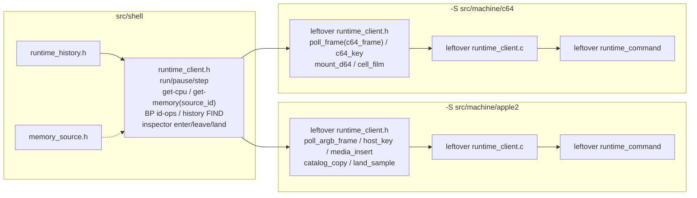

# Stage 7 — Runtime client seam

| Field | Value |
|-------|-------|
| **Author** | Grok (Designer) |
| **Date** | 2026-08-27 |
| **Status** | Accepted |
| **Canonical path** | [`design/runtime-client-seam.md`](runtime-client-seam.md) |
| **Stage map** | [`design/merge-stage-map.md`](merge-stage-map.md) Stage 7 (EXTRACT shared subset; PRESERVE machine verbs) |
| **Depends on** | Stage 5 exit ([`design/control-command-tables.md`](control-command-tables.md)) and Stage 6 exit ([`design/runtime-shell-extract.md`](runtime-shell-extract.md)). |

This is the detailed design for Stage 7. It does not reopen the stage map. Key Decision 8 (runtime client seam before chrome), the Stage 7 in-scope/out-of-scope lists, and the standing invariants (two binaries, no ifdef in shell, no mega-client, no `runtime_thread` unify) are folded in as constraints.

**Choice: shared client subset.** Adapter fallback is rejected (see Alternatives).

---

## Overview

After Stages 5–6, leftover `runtime_client.h` / `.c` are still a **fork**, not a twin (Apple 336 / 1393 vs C64 356 / 1465). Picture poll, key types, media, and Inspector picture/catalog/film APIs disagree on purpose. Stage 8 chrome cannot compile into `libshell` against two forked headers.

Stage 7 EXTRACT lifts a **shared subset header** into `src/shell/runtime/runtime_client.h`: run / pause / reset / step, get-cpu, get-memory (`uint32_t source_id` from Stage 5), id-based breakpoints, history FIND, inspector enter / leave / land **names**. Implementations stay leftover: they push leftover `runtime_command` whose enum values already diverge after `RUN_INSTRUCTIONS`. Per-machine verbs stay in leftover `runtime_client.h`.

A later pane **can** `#include "runtime_client.h"` and call those functions without `#include "apple2.h"` or `"c64.h"`. Chrome panes themselves are **not** this stage. Nuklear already lives under `src/shell/frontend/`.

There is still no root `project(machines)`, no flattening of leftover `src/`, no `#ifdef APPLE2` in `src/shell`, and no A2M `enter-inspector` **wire** bump (the client function name already exists on both leftovers).

---

## Background & Motivation

### Entry verification (2026-08-27)

Re-checked against leftover headers:

| Axis | Apple | C64 | Stage 7 |
|------|-------|-----|---------|
| Picture poll | `runtime_client_poll_argb_frame` | `runtime_client_poll_frame(c64_frame *)` | **STAY** leftover |
| Keys | `host_key` | `c64_key` | **STAY** leftover |
| Media | `media_insert` / `eject` / `swap` / `boot_slot` | `mount_d64` / `power_on_drive` / `unmount_disk` | **STAY** leftover |
| Inspector extras | `catalog_copy` / `copy_picture` / `land_sample` / `step_sample` | `checkpoint_step` / `adjacent_cycle` / `copy_inspector_cell_film` | **STAY** leftover (Stage 9) |
| run / pause / step-* | identical names | identical names | **EXTRACT** declarations |
| get-cpu request | `request_cpu_state[_token]` | same | **EXTRACT** |
| get-memory | `runtime_memory_mode` | `runtime_memory_mode` | **EXTRACT** as `uint32_t source_id` |
| history FIND/NEXT/READ | identical (shell `runtime_history_query`) | identical | **EXTRACT** |
| inspector enter / leave / land | client **names** already exist | same | **EXTRACT** names |
| `runtime_command_type` | no `STEP_FRAME` / `RUN_TO_RASTER` | those two inserted after `RUN_INSTRUCTIONS` | **STAY** leftover (numeric values diverge) |
| Breakpoint mapping | `view_flags_t` (`memview.h`) + `swap_slot` | leftover enum MAP/ROM/RAM | create/update/poll **STAY** leftover |

Leftover Apple `runtime_client.h` includes `apple2_file.h` (load/save bin). Leftover C64 includes `c64.h` + `c64_frame.h` + `paste_parser.h`. Those includes are why chrome cannot take either leftover header as "the" client.

### Pain points

- Stage 8 CPU / disasm / memview cannot live in `libshell` if they include leftover `runtime_client.h`.
- Parking "runtime_client *shape*" in comments while both leftover headers stay forked is this stage's job.
- `runtime_memory_mode` is leftover-stable and already equals Stage 5 `memory_source.id`. The subset parameter is that id, not a leftover enum name.

### What this stage is not

Mega-client union of both headers, unifying `runtime_thread.c` or leftover `runtime_command`, Inspector clocks / film vs sample-ID, adding `enter-inspector` on the A2M **wire** (Stage 9; subset may have the client function name — it already does), Stage 8 pane extraction, `#ifdef APPLE2` in `src/shell`, flattening leftover `src/`, root `project(machines)`, or fixing `history_control_integration`.

---

## Goals & Non-Goals

### Goals

1. Shared subset header in `src/shell/runtime/runtime_client.h`. It does **not** include `apple2.h` or `c64.h`. It does not mention picture types, key types, media, or Inspector catalog/film.
2. Leftover `runtime_client.h` includes the subset and declares **only** leftover extras. Leftover `.c` still implements everything (subset + extras).
3. get-memory / write-memory take `uint32_t source_id` (Stage 5 table id). Leftover call sites keep passing leftover `RUNTIME_MEMORY_MODE_*` (implicit conversion).
4. Inspector enter / leave / land **names** are in the subset. Picture blit / catalog / cell-film stay leftover.
5. A later pane can call run / pause / step / get-cpu / get-memory / breakpoints (id-ops + request) / history FIND without including `apple2.h` or `c64.h`.
6. Shell test proves the header compiles against `libshell` only (stub client). Both leftover gates register it. Leftover `runtime_memory_rpc` and history tests stay leftover and stay green.
7. a2m 77/77 must not regress (new tests may add). c64m: 71 pass + 10 SKIP + the same `history_control_integration` fail.

### Non-goals

- Sharing leftover `runtime_command` / `runtime_internal.h` / `struct runtime_client` layout.
- A vtable (`shell_runtime`) — not needed; see Choice.
- Unifying breakpoint mapping axes (`view_flags_t` vs leftover MAP/ROM/RAM). Same reason Stage 6 left `runtime_breakpoint_ini.c` leftover.
- Unifying `runtime_cpu_snapshot` / `poll_event` / leftover `runtime_event` (machine snapshots fork). get-cpu in the subset is the **request**.
- Compiling subset implementations into `libshell` (they need leftover command enums).
- Stage 8 chrome files.

---

## Proposed Design

### Choice: subset, not adapter

The map's **default** is a shared subset. Fallback is a per-binary `shell_runtime` vtable if headers are too tangled.

They are not too tangled for the listed verbs:

- run / pause / reset / step / get-cpu request / history FIND / inspector enter-leave-land already have identical names and C types that do not mention Apple or C64 silicon.
- get-memory's only leftover type is `runtime_memory_mode`, which Stage 5 already published as `memory_source.id`. Changing the parameter to `uint32_t source_id` untangles it.
- Picture / key / media / Inspector film are **supposed** to stay leftover. Their presence in leftover headers is not "too tangled"; it is the fork the subset is defined against.

A vtable would add an extra hop Stage 8 does not need: `libshell` is STATIC; subset calls are ordinary `runtime_client_*` symbols resolved when leftover `runtime` links into `a2m` / `c64m`. Adapter remains the documented fallback if a later stage discovers a subset function that cannot be declared without leftover silicon types. Do not invent it here.

### Target layout after Stage 7

```text
machines/
  src/shell/
    CMakeLists.txt                 # PUBLIC include += ${CMAKE_CURRENT_SOURCE_DIR}
    runtime/
      runtime_history.*            # Stage 6; unchanged
      runtime_breakpoint_condition.*
      runtime_client.h             # NEW: subset declarations only
    tests/runtime/
      test_runtime_client.c        # NEW: stub client; no apple2.h/c64.h
  src/machine/apple2/src/runtime/
    runtime_client.h               # includes subset; leftover extras only
    runtime_client.c               # STAY; subset signatures match header
  src/machine/c64/src/runtime/
    runtime_client.h               # same pattern
    runtime_client.c               # STAY
```



### Shared subset header (`src/shell/runtime/runtime_client.h`)

Opaque client. No leftover `runtime_event.h`. No `runtime_memory_mode`. Includes shell `runtime_history.h` for FIND.

```c
#pragma once

#include "runtime_history.h"

#include <stdbool.h>
#include <stddef.h>
#include <stdint.h>

typedef struct runtime_client runtime_client;

void runtime_client_set_command_session(runtime_client *client, uint32_t session_id);
uint32_t runtime_client_get_command_session(const runtime_client *client);
uint64_t runtime_client_alloc_request_token(runtime_client *client);

bool runtime_client_ping(runtime_client *client);
bool runtime_client_quit(runtime_client *client);
bool runtime_client_reset(runtime_client *client);
bool runtime_client_run(runtime_client *client);
bool runtime_client_pause(runtime_client *client);
bool runtime_client_step_cycle(runtime_client *client);
bool runtime_client_step_instruction(runtime_client *client);
bool runtime_client_run_cycles(runtime_client *client, size_t count);
bool runtime_client_run_instructions(runtime_client *client, size_t count);
bool runtime_client_step_out(runtime_client *client);
bool runtime_client_step_over(runtime_client *client);
bool runtime_client_run_to_cursor(runtime_client *client, uint16_t address);

bool runtime_client_request_cpu_state(runtime_client *client);
bool runtime_client_request_cpu_state_token(runtime_client *client, uint64_t request_token);
bool runtime_client_set_pc(runtime_client *client, uint16_t value);
bool runtime_client_set_sp(runtime_client *client, uint8_t value);
bool runtime_client_set_a(runtime_client *client, uint8_t value);
bool runtime_client_set_x(runtime_client *client, uint8_t value);
bool runtime_client_set_y(runtime_client *client, uint8_t value);
bool runtime_client_set_status(runtime_client *client, uint8_t value);

bool runtime_client_request_memory(
    runtime_client *client,
    uint16_t address,
    uint16_t length,
    uint32_t source_id);
bool runtime_client_request_memory_token(
    runtime_client *client,
    uint16_t address,
    uint32_t length,
    uint32_t source_id,
    uint64_t request_token);
bool runtime_client_request_memory_view(
    runtime_client *client,
    uint16_t address,
    uint16_t length,
    uint32_t source_id);
bool runtime_client_claim_memory_rpc(
    runtime_client *client,
    uint64_t request_token,
    uint8_t **out_bytes,
    uint32_t *out_length,
    uint16_t *out_address,
    uint32_t *out_source_id);
bool runtime_client_write_memory_byte(
    runtime_client *client,
    uint16_t address,
    uint8_t value,
    uint32_t source_id);
bool runtime_client_write_memory(
    runtime_client *client,
    uint16_t address,
    uint16_t length,
    uint32_t source_id,
    const uint8_t *bytes);

bool runtime_client_set_execute_breakpoint(runtime_client *client, uint16_t address);
bool runtime_client_duplicate_breakpoint(runtime_client *client, uint32_t id);
bool runtime_client_clear_breakpoint(runtime_client *client, uint32_t id);
bool runtime_client_clear_all_breakpoints(runtime_client *client);
bool runtime_client_set_breakpoint_enabled(runtime_client *client, uint32_t id, bool enabled);
bool runtime_client_rearm_oneshot_breakpoints(runtime_client *client);
bool runtime_client_request_breakpoints(runtime_client *client);

bool runtime_client_claim_history_rpc(
    runtime_client *client,
    uint64_t request_token,
    uint8_t **out_bytes,
    uint32_t *out_length,
    runtime_history_rpc_meta *out_meta);
bool runtime_client_cancel_rpc(runtime_client *client, uint64_t request_token);
bool runtime_client_history_info(runtime_client *client, uint64_t request_token);
bool runtime_client_history_record(
    runtime_client *client, bool enabled, uint64_t request_token);
bool runtime_client_history_clear(runtime_client *client, uint64_t request_token);
bool runtime_client_history_find(
    runtime_client *client,
    uint32_t session_id,
    const runtime_history_query *query,
    runtime_history_from_kind from_kind,
    uint64_t from_id,
    uint16_t limit,
    uint64_t request_token);
bool runtime_client_history_next(
    runtime_client *client,
    uint32_t session_id,
    uint64_t cursor,
    uint16_t limit,
    uint64_t request_token);
bool runtime_client_history_read(
    runtime_client *client,
    uint32_t session_id,
    uint64_t epoch,
    uint64_t id,
    uint16_t before,
    uint16_t after,
    uint64_t request_token);
bool runtime_client_history_close(
    runtime_client *client,
    uint32_t session_id,
    uint64_t cursor,
    uint64_t request_token);

bool runtime_client_inspector_set_enabled(
    runtime_client *client, bool enabled, uint64_t request_token);
bool runtime_client_inspector_enter(runtime_client *client, uint64_t request_token);
bool runtime_client_inspector_leave(runtime_client *client, uint64_t request_token);
bool runtime_client_inspector_land(
    runtime_client *client, uint64_t cycle, uint64_t request_token);
bool runtime_client_inspector_land_to_cycle(
    runtime_client *client, uint64_t cycle, uint64_t request_token);
```

`session_open` / `session_close` stay leftover: they take leftover `runtime_session_kind` from leftover `runtime_event.h`. History FIND already takes `uint32_t session_id` (0 = default session). A later pane can FIND without opening a leftover session. Do not move leftover `runtime_event`.

### Leftover header

Leftover `runtime_client.h`:

1. `#include "runtime/runtime_client.h"` (shell `src/shell` on the PUBLIC include path so this does not collide with leftover `"runtime_client.h"`).
2. Drop the duplicate `typedef struct runtime_client` (C99 forbids a second typedef). Drop subset function declarations.
3. Keep leftover includes (`apple2_file.h` / `c64.h` / frame / keyboard) **for leftover extras only**.
4. Declare leftover extras: picture poll, keys, media, assemble extras, turbo, apply config, `poll_event`, frame-ring, Inspector catalog/film/sample/checkpoint, `session_open` / `session_close`, Apple cold-reset / gameport / display override, C64 `step_frame` / `run_to_raster` / joystick / VIC ring, create/update/poll breakpoints (leftover mapping types).

Leftover TUs that already `#include "runtime_client.h"` keep doing so (quoted include finds leftover first) and get the subset transitively.

Stage 8 chrome `#include "runtime_client.h"` finds the **shell** header because `libshell` PUBLIC includes `src/shell/runtime`.

### Implementations stay leftover

Subset `.c` cannot live in `libshell`: `runtime_client_run` pushes leftover `RUNTIME_COMMAND_RUN`, and C64 inserts `STEP_FRAME` / `RUN_TO_RASTER` before `REQUEST_CPU_STATE`, so leftover enum **numbers** disagree. Compiling one `.c` into shell would require leftover `runtime_command.h`, which includes `apple2_file.h` / `c64.h`. That is the mega-client the map forbids.

Leftover `.c` definitions of subset functions change `runtime_memory_mode` parameters to `uint32_t source_id` to match the subset declaration. They still store `(uint8_t)source_id` on leftover `command.data.request_memory.mode`. Call sites passing leftover `RUNTIME_MEMORY_MODE_*` remain valid (enum → `uint32_t`).

`claim_memory_rpc`'s last out-parameter becomes `uint32_t *out_source_id`. Leftover locals that took `runtime_memory_mode *` switch to `uint32_t` (four call sites: Apple `control_dispatch.c` + `test_runtime_memory_rpc.c`; C64 `main.c` + `test_runtime_memory_rpc.c`). `test_runtime_flight_recorder.c` already passes `NULL`. Compare claimed ids against leftover `RUNTIME_MEMORY_MODE_*` as today.

### Breakpoints: id-ops shared, mapping leftover

`runtime_breakpoint_definition.mapping` is `view_flags_t` on Apple (`memview.h`) and a leftover enum on C64 (`runtime_event.h` includes `c64.h`). create / update / `poll_breakpoints` stay leftover so the subset header does not pull silicon.

Shared: execute-at-address, duplicate, clear, clear-all, enable, rearm, request. That is the list/toggle/request surface Stage 8 can call without mapping axes. Mapping dialogs stay leftover until Stage 8 publishes mapping as a table (out of this stage). This is the same split Stage 6 used for `runtime_breakpoint_ini.c`, not a new product fork.

### Inspector names vs wire

Apple leftover already has `runtime_client_inspector_enter` and `RUNTIME_COMMAND_INSPECTOR_ENTER`. C64 already has the wire verb. Stage 9 adds `enter-inspector` on **A2M wire** and bumps `A2M/N`. This stage does **not** touch leftover control tables or protocol strings. Subset only publishes the client **names**.

Picture blit / catalog / `land_sample` / `checkpoint_step` / `copy_inspector_cell_film` stay leftover. Do not map them here.

### CMake

`src/shell/CMakeLists.txt`:

- No new `libshell` `.c` (header-only seam).
- PUBLIC includes add `${CMAKE_CURRENT_SOURCE_DIR}` (`src/shell`) so leftover can `#include "runtime/runtime_client.h"`. Existing `"runtime_client.h"` from leftover TUs still resolve to leftover (quoted include searches the including file's directory first). `"runtime_history.h"` etc. keep working via the existing `runtime/` PUBLIC dir.

Leftover root `CMakeLists.txt` (both products): register `test_runtime_client` linking **only** `shell` (stub implementations live in the test TU).

### File-by-file

#### NEW shell

| File | Role |
|------|------|
| `runtime/runtime_client.h` | subset declarations; opaque client; `source_id`; no machine includes |
| `tests/runtime/test_runtime_client.c` | stub `struct runtime_client`; calls subset; asserts `source_id` round-trip; does not include leftover headers |

#### STAY leftover (updated)

| File | Change |
|------|--------|
| leftover `runtime_client.h` | include subset; drop subset decls + duplicate typedef |
| leftover `runtime_client.c` | `uint32_t source_id` on memory verbs |
| leftover `runtime_event.h` | unchanged (`runtime_session_kind` stays leftover) |
| Apple `control_dispatch.c`, C64 `main.c` | claim out-param `uint32_t` |
| leftover `test_runtime_memory_rpc.c` | same |
| leftover root CMake | register shell `runtime_client` test |

---

## API / Interface Changes

- New shell header: `runtime_client.h` (subset).
- Memory client verbs: `runtime_memory_mode` → `uint32_t source_id` (numeric values unchanged; Stage 5 id).
- `claim_memory_rpc` last out-param: `uint32_t *out_source_id`.
- No `A2M/N` / `C64M/N` bump. No `MACHINES/1`.
- Leftover extras keep leftover types (`host_key`, `c64_key`, `c64_frame`, `apple2_binary_format`, leftover breakpoint definition).

---

## Data Model Changes

None on disk. Leftover command bytes still carry `mode` as `uint8_t`. HST1, Inspector catalogs, frame rings unchanged.

---

## Alternatives Considered

### 1. Per-binary `shell_runtime` vtable (map fallback)

**Pros:** chrome never names `runtime_client_*`; leftover fills function pointers at link time. **Cons:** extra hop, extra type, every Stage 8 call site goes through the vtable; subset names already match. Headers are not too tangled for the listed verbs once `source_id` replaces leftover `runtime_memory_mode`. **Rejected** for this stage. Revisit only if Stage 8 hits a subset call that cannot be declared without leftover silicon.

### 2. Mega-client union of both leftover headers

Forbidden by the map. Picture / key / media / film types are not one API.

### 3. Compile subset `.c` into `libshell`

Requires leftover `runtime_command` (enum numbers already diverge) or a shared command subset that is unifying leftover command handling. Out of scope.

### 4. Leftover-compile a shell `.c` (help_view pattern)

help_view compiles shell **source** because of per-binary `help_content.inc`, not leftover silicon. A shell `.c` that `#include`s leftover `runtime_command.h` would put `apple2.h` / `c64.h` under `src/shell`. Fail the grep. **Rejected**.

### 5. Put create/update breakpoints in the subset with `uint32_t mapping`

Would UNIFY mapping axes the map left as leftover (Stage 6 INI stayed for the same reason). **Rejected** this stage. Id-ops + request are the subset.

### 6. Name the shell header `runtime_client_subset.h` only

Works (no include-path add). Stage 8 chrome wants to call `runtime_client_*` and include `runtime_client.h`. Leftover quoted `"runtime_client.h"` stays leftover; chrome compiled into `libshell` sees shell `runtime_client.h`. Unique leftover include is `"runtime/runtime_client.h"`. **Chosen.**

---

## Security & Privacy Considerations

Unchanged: bind `127.0.0.1`, leftover payload caps, leftover deferred capacity 1 vs 16. Subset does not widen RPC length (`RUNTIME_MEMORY_RPC_MAX_LENGTH` stays leftover in leftover `.c`).

---

## Observability

No new telemetry. Leftover command-push logs unchanged.

---

## Implementation Notes

1. Write this design; commit it; then implement in a second commit.
2. Shell header + stub test first (prove no machine includes).
3. Leftover headers include the subset; drop duplicate decls.
4. Leftover `.c` + claim call sites: `uint32_t source_id`.
5. Register the shell test on both leftover gates.
6. Do not start Stage 8 or 9. Do not add `enter-inspector` to A2M control tables. Do not fix `history_control_integration`.

---

## Testing Strategy

- Shell `test_runtime_client`: stub client records last `source_id`; `request_memory(..., 3u)` stores 3; `claim_memory_rpc` returns it. NULL client returns false on run/pause. Compiles linking **only** `shell`. The test file does not `#include` leftover or machine headers.
- Leftover `runtime_memory_rpc` still writes/reads via leftover `RUNTIME_MEMORY_MODE_*` (ids unchanged).
- Leftover history FIND tests still pass against leftover implementations of the subset names.
- Grep prove: no `apple2.h` / `c64.h` / `poll_argb_frame` / `c64_frame` / `host_key` / `c64_key` / `mount_d64` / `media_insert` / `catalog_copy` / `copy_inspector_cell_film` under `src/shell/runtime`.

---

## Documentation Plan

- This file is the Stage 7 design (committed first).
- [`design/README.md`](README.md) indexes it (active → landed when code lands).
- [`agents/README.md`](../agents/README.md): Stage 7 done; remaining twins note drops `runtime_client` *shape*; leftover extras remain; do not start 8/9 from that note.

---

## Rollout Plan

Same two `-S` trees. No protocol bump.

---

## Open Questions

None. Subset vs adapter is decided (subset). Breakpoint create/update stay leftover. Implementations stay leftover. `session_open` / `runtime_session_kind` stay leftover.

### Self-check against Stage 7 map

| Map item | This design |
|----------|-------------|
| Shared subset in `src/shell/runtime/` | `runtime_client.h` |
| Or per-binary adapter | Rejected; headers not too tangled |
| run / pause / step | subset |
| get-cpu | request + set-reg (6502); poll_event leftover |
| get-memory source id from Stage 5 | `uint32_t source_id` |
| breakpoints | id-ops + request; mapping leftover |
| history FIND | subset (shell query type; session_id 0 = default) |
| inspector enter / leave / land names | subset |
| picture / keys / media / Inspector film out of shared header | leftover extras |
| Later pane without `apple2.h` / `c64.h` | shell test + grep |
| No mega-client | leftover extras stay leftover |
| No `runtime_thread` unify | leftover `.c` / command stay |
| No A2M `enter-inspector` wire | client name only |
| No Stage 8 panes | none |
| No `#ifdef APPLE2` in `src/shell` | stub test, no ifdefs |
| a2m 77/77; c64m 71+10 SKIP+known fail | new shell test may raise counts |

No product fork the map did not decide. `source_id` as `uint32_t` is Stage 5's id. Breakpoint mapping staying leftover is Stage 6's mapping-policy split, not a C64-vs-Apple seam fork. `session_open` staying leftover avoids moving leftover `runtime_event.h` types.

---

## Prove

Host CMake (Stages 2–6 used the same). Debug. From repo root:

```bash
cmake -B build/a2m  -S src/machine/apple2  -DCMAKE_BUILD_TYPE=Debug
cmake -B build/c64m -S src/machine/c64    -DCMAKE_BUILD_TYPE=Debug
cmake --build build/a2m -j && cmake --build build/c64m -j
ctest --test-dir build/a2m  --output-on-failure
ctest --test-dir build/c64m --output-on-failure
./build/a2m/a2m --help
./build/c64m/c64m --help
```

| Gate | Required |
|------|----------|
| a2m | **77/77 or higher** (new shell `runtime_client` test). Includes leftover `runtime_memory_rpc` and history tests. |
| c64m | **71 passed, 10 skipped, 1 failed** out of 82 **plus any new tests**. Fail = `history_control_integration` (do not fix). SKIPs = the same ten asset-gated tests. |

#### Must be empty / absent (fail the stage if any hit)

```bash
# Shared subset header/sources do not include machine silicon or leftover extras.
test -z "$(git grep -E 'apple2\\.h|c64\\.h|c64_frame|poll_argb_frame|host_key|c64_key|mount_d64|media_insert|catalog_copy|copy_inspector_cell_film|#ifdef APPLE2|#ifdef C64' -- src/shell/runtime || true)"

# Shell test does not include leftover client or machine headers.
test -z "$(git grep -E 'apple2\\.h|c64\\.h|runtime_event\\.h' -- src/shell/tests/runtime/test_runtime_client.c || true)"
```

`git grep` with no matches may exit 1; treat empty output as pass.

#### Informational

```bash
git grep -n 'runtime_client_inspector_enter' -- src/shell/runtime src/machine
git grep -n 'uint32_t source_id' -- src/shell/runtime/runtime_client.h
```

---

## Key Decisions

1. **Shared subset, not adapter.** Leftover extras stay leftover. Vtable is the unused fallback.
2. **Header-only seam in `libshell`.** Implementations stay leftover because leftover `runtime_command_type` numbers diverge.
3. **get-memory / write-memory / claim use `uint32_t source_id`.** Equals leftover `runtime_memory_mode` numeric id.
4. **Breakpoint mapping types stay leftover.** Subset is id-ops + request.
5. **Inspector enter/leave/land names in the subset.** No A2M wire bump. Picture/catalog/film leftover.
6. **`session_open` / `runtime_session_kind` stay leftover.** FIND takes `uint32_t session_id` (0 = default).
7. **Leftover includes `"runtime/runtime_client.h"`.** Shell chrome includes `"runtime_client.h"`.
8. **Shell test uses a stub client** and links only `shell`. Leftover `runtime_memory_rpc` stays leftover.
9. **No machines-root `project()`, no flatten, no Stage 8/9.**

---

## References

- [`design/merge-stage-map.md`](merge-stage-map.md) — Stage 7, KD 8, runtime client subset sketch
- [`design/control-command-tables.md`](control-command-tables.md) — `memory_source.id`
- [`design/runtime-shell-extract.md`](runtime-shell-extract.md) — history FIND in shell; leftover BP INI
- leftover `runtime_client.h` / `.c` — Apple vs C64 fork
- leftover `runtime_command.h` — C64 `STEP_FRAME` / `RUN_TO_RASTER` insert

---

## PR Plan

Stage 7 is this design then implement. Grain is **two** independently reviewable commits.

### PR 7.0 — Design (this document)

- **Title:** `docs: Stage 7 design for runtime client seam`
- **Files:** `design/runtime-client-seam.md`, `design/README.md` (index active)
- **Depends on:** Stages 5 and 6
- **Description:** Land this design. Choice is shared subset. No source extract.

### PR 7.1 — Shared client subset header

- **Title:** `extract: src/shell runtime_client subset`
- **Files / components:**
  - `src/shell/runtime/runtime_client.h`
  - `src/shell/tests/runtime/test_runtime_client.c`
  - leftover `runtime_client.h` / `.c` include + `source_id`
  - leftover claim call sites; leftover CMake registers the shell test
  - `agents/README.md`; `design/README.md` **landed**
- **Depends on:** PR 7.0
- **Description:** Shared subset header. Leftover extras stay leftover. **Stage 7 exit.**

Do not start Stage 8 or 9 from these PRs.
