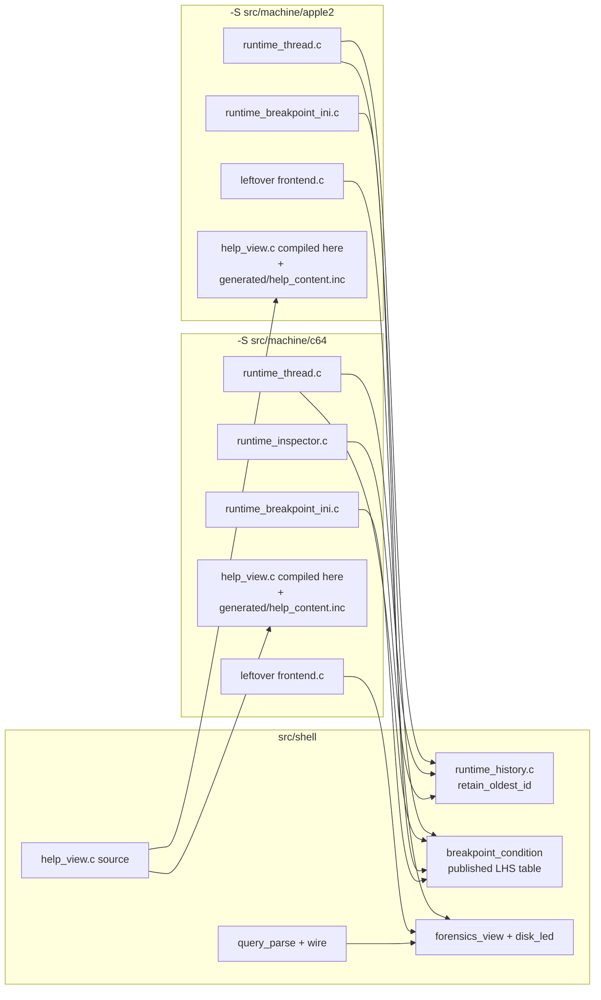

# Stage 6 — Runtime shell twins

| Field | Value |
|-------|-------|
| **Author** | Grok (Designer) |
| **Date** | 2026-08-27 |
| **Status** | Accepted |
| **Canonical path** | [`design/runtime-shell-extract.md`](runtime-shell-extract.md) |
| **Stage map** | [`design/merge-stage-map.md`](merge-stage-map.md) Stage 6 (EXTRACT + small UNIFY) |
| **Depends on** | Stage 2 exit ([`design/shell-extract-platform.md`](shell-extract-platform.md)). Stages 3–4 are already landed; this stage does not depend on them. |

This is the detailed design for Stage 6. It does not reopen the stage map. The Stage 6 in-scope/out-of-scope lists, the `runtime_history.c` winner (a2m `retain_oldest_id` / O(blocks) `partial_count`), the published breakpoint-condition LHS table, and the standing invariants (two binaries, no ifdef in shell, HST1 ≠ Inspector) are folded in as constraints.

---

## Overview

After Stages 2–4, both leftover `project()` trees still own a second copy of the debugger *data* paths: HST1 store + find grammar + wire, breakpoint-condition parse/eval, Forensics view, help renderer, disk LED bitmaps, and `gen_help.py`. Those copies will fork the moment anyone edits one tree.

Stage 6 EXTRACT lifts the listed twins into `src/shell/`, deletes both machine-tree copies in the same change, and leaves `runtime_thread`, Inspector clocks/recorder, `runtime_client`, `frontend.c` chrome, and command tables where they are. Each leftover `project()` already `add_subdirectory`s `src/shell` via `MACHINES_ROOT`.

The small UNIFY is:

- **Take a2m's** `runtime_history.c` retain floor (`retain_oldest_id`) and O(blocks) `partial_count`. Keep C64's `runtime_history_force_new_block` (leftover Inspector calls it).
- **One** `runtime_breakpoint_condition.c`. LHS names are a published table: Apple `cycle_in_line`; C64 `vic_cycle` / `raster`. Delete a2m's leftover `{ "vic_cycle", RUNTIME_BP_LHS_CYCLE_IN_LINE }` alias. Do not rename either product's real token.
- Help palette: one `HELP_PALETTE_*` (same RGB). SDL include: one `<SDL.h>`.

`runtime_breakpoint_ini.c` is **machine policy**, not a twin. Both copies stay.

There is still no root `project(machines)` and no flattening of `src/machine/*/src/`.

---

## Background & Motivation

### Entry verification (2026-08-27)

| Artifact | a2m | c64m | Verdict |
|----------|-----|------|---------|
| `runtime_history_query_parse.{c,h}` | 571 / 36 | identical | EXTRACT either copy |
| `runtime_history_wire.{c,h}` | 316 / 45 | identical | EXTRACT either copy |
| `disk_led_data.{c,h}` | 114 / 8 | identical | EXTRACT either copy |
| `tools/gen_help.py` | 320 | identical | EXTRACT to `src/shell/tools/` |
| `forensics_view.c` | 2311 | 2311, 3 lines | `<SDL.h>` vs `<SDL2/SDL.h>` + two comment punctuation marks. **Take a2m** (`<SDL.h>`). |
| `forensics_view.h` | 201 | 201, comment punctuation | **Take a2m** |
| `help_view.c` | 1374 | 1374, 38 lines | `HELP_PALETTE_*` vs `C64_HELP_*`, same RGB. **Take a2m** macros. |
| `help_view.h` | 39 | identical | EXTRACT |
| `runtime_history.c` | 1414 | 1425, 29/18 | **Take a2m** retain / `partial_count`. Keep C64 `force_new_block`. |
| `runtime_history.h` | 339 | 330 | Union (see Key Decisions). Shell owns the HST1 types; does **not** `#include "c6510.h"`. |
| `runtime_breakpoint_condition.c` | 490 | 488, 5/7 | One published LHS table. Delete a2m `vic_cycle` alias. |
| `runtime_breakpoint_condition.h` | 124 | 124 | One enum + both context fields. |
| `runtime_breakpoint_ini.c` | 741 | 676 | **STAY** leftover. Mapping tokens, swap-slot, save-ini policy. |
| `runtime_breakpoint_ini.h` | 8 | identical | STAY next to each `.c` |

`test_runtime_history_query_parse.c` and `test_forensics_view.c` are byte-identical. `test_runtime_history_wire_decode.c` differs only in `A2M_SOURCE_DIR` vs `C64M_SOURCE_DIR` and temp-path prefix. `test_help_view.c` differs in search needles (product manuals).

### Pain points

- Two HST1 stores. a2m already has the O(blocks) telemetry path; c64m still walks records in `history_get_status`.
- a2m still parses leftover C64 `vic_cycle` as `cycle_in_line`. That is this stage's leftover-C64 cleanup, not Stage 5.
- Help palette macros already drifted in name. RGB never did.
- `forensics_view.c` still has the Stage 2 leftover `<SDL2/SDL.h>` in the C64 tree.

### What this stage is not

Stage 5 command tables / memory sources, Stage 7 `runtime_client`, Stage 8 chrome panes, Stage 9 Inspector clocks, extracting `runtime_thread` / `runtime_inspector*` / `runtime_vic_ring` / `runtime_assembler.c` (MLI), unifying `frontend.c` Misc tabs (Assembler tab PRESERVE), HST1 becoming the Inspector slider, pulling Inspector recorder into Forensics, `#ifdef APPLE2` in shell, flattening leftover `src/`, root `project(machines)`, or fixing `history_control_integration`.

---

## Goals & Non-Goals

### Goals

1. Named files live under `src/shell` and are **gone** from both machine trees.
2. `runtime_history.c` is a2m's retain floor + O(blocks) `partial_count`. C64 leftover Inspector still compiles against `runtime_history_force_new_block`.
3. One breakpoint-condition file. Published LHS table: `cycle_in_line` (Apple) and `vic_cycle` / `raster` (C64). `git grep vic_cycle` in the Apple tree is empty.
4. One `HELP_PALETTE_*`. No `C64_HELP_*` in shell. One `<SDL.h>`.
5. One `gen_help.py`. Help *content* stays per-binary (`manual/*/manual.md` → leftover `generated/help_content.inc`).
6. Unit tests of extracted files run **once** as shell tests and are registered by both leftover gates (Stage 3 `test_disasm_6502` pattern). Leftover `runtime_client` integration tests stay leftover.
7. `runtime_breakpoint_ini.c` remains two files.
8. `--help` still runs. ctest: old tests still pass. New totals reported (a2m grows by the C64-only unit tests it did not already run). c64m still 69 pass + 10 SKIP + the same `history_control_integration` fail.

### Non-goals

- Sharing `runtime_thread`, Inspector recorder, `runtime_client`, command tables.
- Renaming C64 silicon `vicii.timing.cycle_in_line` or Apple `video.cycle_in_line`.
- Renaming leftover `c6510_bus_access_kind` (wire-stable HST1 access kind; already the name in both history headers).
- Compiling help *content* into `libshell`.
- Registering Apple `runtime_client` history integration tests on the C64 gate (or the reverse).
- One `runtime_breakpoint_ini.c`.

---

## Proposed Design

### Target layout after Stage 6

```text
machines/
  src/shell/
    CMakeLists.txt                 # append runtime/*.c, frontend/{disk_led,forensics}
    runtime/
      runtime_history.{c,h}        # a2m retain + C64 force_new_block
      runtime_history_query_parse.{c,h}
      runtime_history_wire.{c,h}
      runtime_breakpoint_condition.{c,h}
    frontend/
      nuklear.*                    # already Stage 2
      disk_led_data.{c,h}
      forensics_view.{c,h}
      help_view.{c,h}              # source here; compiled by leftover frontend
    tools/gen_help.py              # was leftover tools/gen_help.py
    tests/
      runtime/
        test_runtime_history.c              # from c64m (store unit)
        test_runtime_history_wire.c         # from c64m
        test_runtime_history_wire_decode.c  # neutralized SOURCE_DIR
        test_runtime_history_query_parse.c
        test_runtime_breakpoint_condition.c # both LHS names
      frontend/
        test_forensics_view.c
        test_help_view.c                    # union needles
  src/machine/apple2/
    src/runtime/                   # NO history*.c, NO breakpoint_condition.c
      runtime_breakpoint_ini.{c,h} # STAY (Apple mapping / swap-slot)
      runtime_thread.c             # STAY; fills context.cycle_in_line
    src/frontend/                  # NO forensics/help/disk_led sources
      CMakeLists.txt               # compiles shell help_view.c; gen_help from shell
    tests/runtime/
      test_runtime_history_{basic,commands,query,sessions}.c  # STAY (runtime_client)
      check_hst1_decode_golden.py  # STAY (imports a2m_control_client)
    tools/gen_help.py              # GONE
  src/machine/c64/
    src/runtime/
      runtime_breakpoint_ini.{c,h} # STAY (map/ram/rom)
      runtime_thread.c             # STAY; fills context.vic_cycle
      runtime_inspector.c          # STAY; still calls force_new_block
    tests/runtime/
      test_runtime_history_sessions.c  # STAY (runtime_client + ROMs)
      check_hst1_decode_golden.py
    tools/gen_help.py              # GONE
```



### File-by-file: MOVE

Prefer `git mv` of the winner so history follows. Delete the other copy in the same change.

#### `src/shell/runtime/` (compiled into `libshell`)

| Winner | Destination |
|--------|-------------|
| a2m `runtime_history.c` + C64 `force_new_block` | `src/shell/runtime/runtime_history.c` |
| a2m `runtime_history.h` + C64 `force_new_block` decl | `src/shell/runtime/runtime_history.h` |
| either `runtime_history_query_parse.*` | `src/shell/runtime/` |
| either `runtime_history_wire.*` | `src/shell/runtime/` |
| merged `runtime_breakpoint_condition.*` | `src/shell/runtime/` |

Move RPC result types that Forensics already consumes (`runtime_history_rpc_status`, `runtime_history_rpc_meta`) into `runtime_history.h`. They are identical in both `runtime_event.h` files today. Leftover `runtime_event.h` already includes `runtime_history.h`; **delete the duplicate typedefs** there so the type has one owner. Do not extract `runtime_event.h`.

#### `src/shell/frontend/` (disk LED + Forensics into `libshell`; help source only)

| Winner | Destination | Compiled by |
|--------|-------------|-------------|
| either `disk_led_data.*` | `src/shell/frontend/` | `libshell` |
| a2m `forensics_view.*` (`<SDL.h>`) | `src/shell/frontend/` | `libshell` |
| a2m `help_view.*` (`HELP_PALETTE_*`) | `src/shell/frontend/` | leftover `frontend` (see Help content) |

#### `src/shell/tools/gen_help.py`

Stage 3 put C tools under `src/shell/tools/`. The identical Python generator follows that path, not a new repo-root `tools/`. Leftover frontend CMake retargets:

```cmake
"${MACHINES_ROOT}/src/shell/tools/gen_help.py"
```

Manuals stay `src/machine/{apple2,c64}/manual/manual.md`. Generated `.inc` stays leftover `${CMAKE_CURRENT_BINARY_DIR}/generated/help_content.inc`.

### Key Decisions

#### 1. History store winner is a2m; API union is not a product fork

The `.c` delta is exactly the map's 29/18: a2m tracks `retain_oldest_id` and per-block `partial_count`; c64m walks records for `partial_records` and has no retain floor on `get_status`. Take a2m.

Header extras that the map did not name, but extraction requires (they coexist; neither is smashed):

| Extra | Owner | Handling |
|-------|-------|----------|
| `RUNTIME_HISTORY_MEDIA_CHANGE_HOST_DIRECTORY = 2` | Apple HostFS / Inspector | Keep in the shared enum. C64 does not emit it. |
| `runtime_history_force_new_block` | C64 Inspector | Keep the function (from c64m). Apple does not call it. |
| `c6510_bus_access_kind` | HST1 wire + C64 CPU observer | Shell `runtime_history.h` keeps a2m's **local** typedef (must not `#include "c6510.h"`). `c6510.h` keeps the same typedef for silicon. Both wrap it in `#ifndef C6510_BUS_ACCESS_KIND_DEFINED` so a TU that includes both does not double-define. Values stay identical. Do **not** rename the leftover `c6510_` prefix in this stage. |

This is EXTRACT + the map's chosen winner, not a new silicon fork.

#### 2. Breakpoint-condition LHS names are a published table

One file, no `#ifdef`. Enum and parse table contain **both** real tokens:

```c
RUNTIME_BP_LHS_RASTER,
RUNTIME_BP_LHS_CYCLE_IN_LINE, /* Apple video.cycle_in_line; token "cycle_in_line" */
RUNTIME_BP_LHS_VIC_CYCLE      /* C64 vic.timing.cycle_in_line; token "vic_cycle" */
```

`runtime_bp_eval_context` has **both** fields (`cycle_in_line` and `vic_cycle`). Leftover `runtime_thread.c` fills the field that matches its published token (Apple already fills `cycle_in_line`; C64 already fills `vic_cycle`). Eval of the other field reads 0 unless the caller set it.

Delete a2m's leftover alias `{ "vic_cycle", RUNTIME_BP_LHS_CYCLE_IN_LINE }`. Format emits the canonical name for that enum value (`cycle_in_line` never prints as `vic_cycle`). `git grep vic_cycle` under `src/machine/apple2` is empty after this stage. C64 silicon and the C64 LHS token keep `vic_cycle`. Do not rename C64's token to `cycle_in_line` or Apple's to `vic_cycle`. `raster` stays on both.

#### 3. `runtime_breakpoint_ini.c` is policy — leave both copies

The 741 vs 676 delta is not cosmetic:

| Axis | Apple | C64 |
|------|-------|-----|
| Mapping tokens | `map` / `main` / `aux` / `c100rom` / `lc1` / `lc2` / `rom`; `ram` is a leftover alias for Map | `map` / `rom` / `ram` (`RUNTIME_BREAKPOINT_MAPPING_*`) |
| Mapping type | `view_flags_t` (`vf_set_ram` / `c100` / `d000`) | small enum |
| Swap | `swap-slot=0..7` (default 6) | no slot; `swap=` only |
| Save gate | `ini_path` non-empty (caller already applied saveini/remember/nosaveini) | `rt->save_ini` |
| `[DEBUG]` wipe | case-insensitive; wipe leftover `[Debug]` prefixes | exact `"DEBUG"` |

Extracting one file would require `#ifdef` or a mapping-token table Stage 5 has not published. **STAY** under each leftover `src/runtime/`. Tests `runtime_breakpoint_ini` stay leftover. The `.h` (8 lines, identical) stays next to each `.c`.

#### 4. Help view source is shell; the translation unit is leftover

`help_view.c` `#include "generated/help_content.inc"`. That `.inc` is generated **per leftover frontend** from that product's manual. `libshell` is `add_subdirectory`'d *before* leftover frontend, and each `-S` tree already builds its own `build/*/\_shell/libshell.a` — stuffing a product `.inc` into `libshell` would still race the generate step and mix content.

So: `help_view.{c,h}` **live** in `src/shell/frontend/` (one copy). Each leftover `frontend` library **compiles** `${MACHINES_ROOT}/src/shell/frontend/help_view.c` with its own `${CMAKE_CURRENT_BINARY_DIR}` on the include path. Do not also list `help_view.c` in `libshell` (duplicate symbols). `tiny_regex` stays a leftover-frontend PRIVATE link (help search).

Needles in `test_help_view.c` that are missing from a product's book are already skipped (`y < 0` continue). The extracted test uses the **union** of both needle lists (`breakpoint`, `joystick`, `snapshot`, `assembler`, `disk`, `warp`, `auto_adjust_segments`) so both gates still find ≥2 scrolled hits.

#### 5. Forensics does not pull Inspector or `runtime_client`

Land-to-Inspector is flags on `frontend_forensics_state` (`request_land`, `request_leave_debugger`). Leftover `frontend.c` / `main.c` applies them through today's `runtime_client`. Forensics sources include `runtime_history.h` + nuklear + `<SDL.h>` (`SDL_SetClipboardText`). They do **not** include `runtime_client.h`. FIND remains HST1, not the Inspector slider.

#### 6. Tests: shell unit vs leftover integration

The map's "run once as shell tests and linked by both binaries' gates" applies to tests of **extracted units**. Tests that spin up `runtime_client` / ROMs are not twins and are not Stage 7.

**Move to `src/shell/tests/`, register in both leftover `CMakeLists.txt` (link `shell`, except help which still links leftover `frontend`):**

| Test | Source today | Notes |
|------|--------------|-------|
| `runtime_history_query_parse` | identical | |
| `runtime_history_wire_decode` | prefix-only | Neutralize `A2M_SOURCE_DIR` / `C64M_SOURCE_DIR` to `HISTORY_WIRE_GOLDEN_PY`. Leftover CMake passes that product's `check_hst1_decode_golden.py` (imports `a2m_control_client` / `c64_control_client` — those CLIs are **not** twins; scripts stay leftover). Temp path `/tmp/machines_hst1_goldenXXXXXX`. |
| `runtime_history` | c64m only | Store unit. Both gates. Add a retain-floor / `partial_records` case so a2m's winner is asserted, not only compiled. |
| `runtime_history_wire` | c64m only | Encode unit. Both gates. |
| `runtime_breakpoint_condition` | c64m only | Add `cycle_in_line` parse/eval alongside `vic_cycle`. Reject aliasing: `vic_cycle==1` formats as `vic_cycle`, not `cycle_in_line`. |
| `forensics_view` | identical | Link `shell`. |
| `help_view` | needle list | Link leftover `frontend` (generated `.inc`). Union needles. |

**Stay leftover** (not extracted; still run on that product's gate):

| Test | Why |
|------|-----|
| a2m `runtime_history_basic` / `_commands` / `_query` / `_sessions` | `runtime_client` + Apple runtime |
| c64m `runtime_history_sessions` | `runtime_client` + test ROMs |
| both `runtime_breakpoint_ini` | policy file stayed |

a2m did not previously run `runtime_history`, `runtime_history_wire`, or `runtime_breakpoint_condition`. Registering them on the a2m gate **increases** a2m's ctest count by 3. That is the intended proof, not a silent gate shrink.

### CMake

`src/shell/CMakeLists.txt` appends to `add_library(shell STATIC …)`:

```cmake
    runtime/runtime_history.c
    runtime/runtime_history_query_parse.c
    runtime/runtime_history_wire.c
    runtime/runtime_breakpoint_condition.c
    frontend/disk_led_data.c
    frontend/forensics_view.c
```

PUBLIC include adds `${CMAKE_CURRENT_SOURCE_DIR}/runtime`. `help_view.c` is **not** in this list.

Leftover `src/runtime/CMakeLists.txt`: drop the six extracted `.c` files; keep `runtime_breakpoint_ini.c`. Headers resolve via existing PUBLIC `util` → `shell` (Apple also via `machine` → `util` → `shell`). Do not re-list `shell` on leftover `runtime` (Apple ld duplicate `-l`).

Leftover `src/frontend/CMakeLists.txt`: drop `disk_led_data.*`, `forensics_view.*`, in-tree `help_view.*`. Compile `${MACHINES_ROOT}/src/shell/frontend/help_view.c`. Point `gen_help.py` at `${MACHINES_ROOT}/src/shell/tools/gen_help.py`.

Leftover root `CMakeLists.txt`: retarget the moved tests at `${MACHINES_ROOT}/src/shell/tests/...`. a2m **adds** the three C64-origin unit tests. Drop in-tree copies of moved tests.

### `c6510.h` guard (C64 leftover only)

```c
#ifndef C6510_BUS_ACCESS_KIND_DEFINED
#define C6510_BUS_ACCESS_KIND_DEFINED
typedef enum c6510_bus_access_kind { ... } c6510_bus_access_kind;
#endif
```

Same guard in shell `runtime_history.h`. Include order either way is safe. Do not include history.h from `c6510.h`.

---

## API / Interface Changes

Shared `runtime_history.h` (shell) is the HST1 store API both leftover `runtime_thread.c` files already call. Additions vs today's a2m header: `runtime_history_force_new_block`, and the RPC meta/status types moved off `runtime_event.h`.

Shared `runtime_breakpoint_condition.h`: both LHS enum values and both context fields. Parse table is the advertisement. No capability negotiation.

No control-protocol bump. No `MACHINES/1`.

---

## Data Model Changes

None on disk. HST1 page layout (24-byte header / 48-byte record / 8-byte accesses) is already the same file and stays that way. `HOST_DIRECTORY` remains Apple's media-change code 2 in the shared enum; C64 does not write it.

INI breakpoint mapping tokens stay per-binary with `runtime_breakpoint_ini.c`.

---

## Alternatives Considered

### 1. Extract `runtime_breakpoint_ini.c` with a mapping-token vtable

**Pros:** one INI loader. **Cons:** the delta is Apple view-flags vs C64 map/ram/rom plus swap-slot plus save-ini gating — Stage 5 memory-source work, not a cosmetic rename. Rejected for this stage.

### 2. Compile `help_view.c` into `libshell` with a content pointer

**Pros:** one TU. **Cons:** requires an API change the map did not ask for, and still needs leftover generate-then-compile ordering. Compiling the shell *source* from leftover frontend is the smaller EXTRACT.

### 3. Rename `c6510_bus_access_kind` to `runtime_history_bus_access_kind`

**Pros:** drops a leftover C64 name from Apple. **Cons:** the map did not schedule that rename; the enum is the HST1 wire kind and C64 silicon still uses the same name. Guarded duplicate typedef is enough. Rename later if a leftover-C64 pass wants it.

### 4. Genericize `vic_cycle` / `cycle_in_line` into one LHS

Forbidden by the stage map. Raster-is-king C64 and Apple beam `cycle_in_line` are not one name.

---

## Security & Privacy Considerations

Unchanged. Control still binds `127.0.0.1`. Forensics clipboard copy is the same `SDL_SetClipboardText` path. History arenas stay inside each leftover `runtime_thread`.

---

## Observability

`history_get_status` stays O(blocks) after the a2m winner (telemetry-safe while recording). Do not reintroduce the C64 record walk.

---

## Implementation Notes

1. Write this design; commit it; then EXTRACT in a second commit.
2. `git mv` winners; apply the small UNIFY (force_new_block, LHS table, palette, `<SDL.h>`, RPC types, `c6510` guard) on the shell copy.
3. Delete machine-tree copies of moved sources **and** moved tests in the same change.
4. Prove:

```bash
cmake -B build/a2m  -S src/machine/apple2  -DCMAKE_BUILD_TYPE=Debug
cmake -B build/c64m -S src/machine/c64    -DCMAKE_BUILD_TYPE=Debug
cmake --build build/a2m -j && cmake --build build/c64m -j
ctest --test-dir build/a2m  --output-on-failure
ctest --test-dir build/c64m --output-on-failure
./build/a2m/a2m --help
./build/c64m/c64m --help
git grep vic_cycle -- src/machine/apple2   # empty
```

5. Do not start Stages 5 / 7 / 8 / 9. Do not "fix" `history_control_integration`.

---

## Testing Strategy

- Both leftover gates register the shell unit tests listed above.
- a2m leftover integration history tests still pass against the extracted store (retain floor is a2m's own).
- c64m leftover `runtime_history_sessions` and Inspector tests still pass against the extracted store (including `force_new_block` and `retain_from`).
- New/extended `runtime_breakpoint_condition` cases cover both published LHS names and prove `vic_cycle` is not an alias of `cycle_in_line`.
- `test_help_view` / `test_forensics_view` still pass on both binaries.
- c64m asset SKIP 10 and `history_control_integration` fail are unchanged.

---

## Documentation Plan

- This file is the Stage 6 design (committed first).
- [`design/README.md`](README.md) indexes it.
- [`agents/README.md`](../agents/README.md): Stage 6 is done; remaining twins note drops history/forensics/help/`disk_led_data`; do not start 5/7/8/9 from that note.
- User manuals unchanged (help renderer only).

---

## Rollout Plan

Same two `-S` trees as Stages 2–4. No protocol bump. No remote freeze change.

---

## Open Questions

None. `runtime_breakpoint_ini` stay-vs-extract is decided (stay). History header extras are decided (union + guard). Help TU ownership is decided (source in shell, compile leftover).
