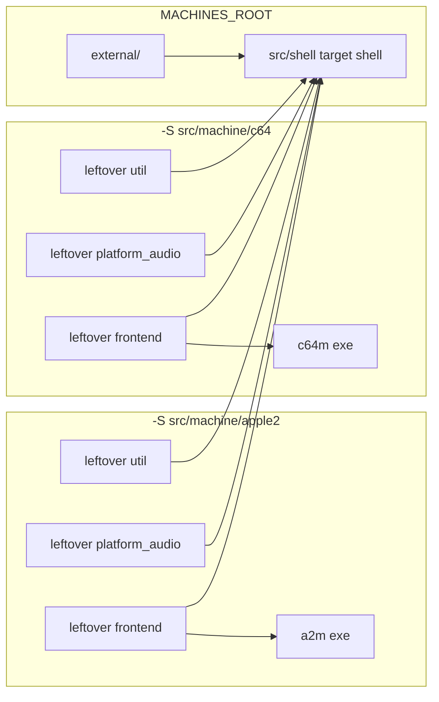
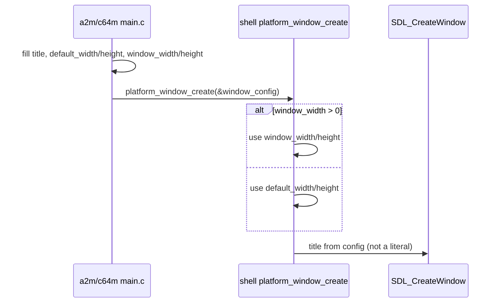

# Stage 2 — Shared platform / util / external / nuklear

| Field | Value |
|-------|-------|
| **Author** | Grok (Designer) |
| **Date** | 2026-08-27 |
| **Status** | Accepted |
| **Canonical path** | [`design/shell-extract-platform.md`](shell-extract-platform.md) |
| **Stage map** | [`design/merge-stage-map.md`](merge-stage-map.md) Stage 2 (EXTRACT) |
| **Depends on** | Stage 1 exit ([`design/import-revisions.md`](import-revisions.md)) |

This is the detailed design for Stage 2. It does not reopen the stage map. Key Decisions 3, 7, and 14, the Stage 2 in-scope/out-of-scope lists, and the already-chosen winners (`config_save`, sockets, `message_queue_clear`, nuklear destination, `external/` prefixes, log wrapper, SDL include convention) are folded in as constraints.

---

## Overview

After Stage 1, `a2m` and `c64m` still build from two nested `project()` trees (`src/machine/apple2`, `src/machine/c64`) with two copies of every host primitive: `external/` vendors, util twins (`mutex` / `thread` / `cond` / `audio_buffer` / `message_queue` / `config` / log wrapper / `util.c`), platform twins (`platform.c` / `platform_fs.c` / `platform_socket.c`), and a 31 109-line `nuklear.h`. Those copies will fork the moment anyone edits one tree.

Stage 2 EXTRACT lifts the host layer that already links into both binaries into `src/shell/` and a single repo-root `external/`, deletes both machine-tree copies in the same change as the lift, and leaves silicon, `runtime_thread`, `frontend.c`, control, Inspector, am65, and `platform_audio.c` where they are. Each leftover `project()` `add_subdirectory`s the new trees via a relative `MACHINES_ROOT` and links a static `shell` target (`libshell.a`). There is still no root `project(machines)` and no flattening of `src/machine/*/src/`.

Window title and default size become fields on `platform_window_config`, filled by each `main.c`. `src/shell` has no `#ifdef APPLE2`, no `"a2m"` / `"c64m"` literals, and no product-prefixed symbols. Both `-S` ctest gates stay at the Stage 1 numbers: a2m **71/71**, c64m **69 pass + 10 SKIP + `history_control_integration` still failing**.

---

## Background & Motivation

### Current state (Stage 1)

```text
machines/
  Makefile                 # two -S trees; not a parent project
  src/machine/apple2/      # project(a2m), cmake 3.16, 71 add_test
    external/              # a2m_argparse, a2m_inih, a2m_logc, …
    src/util/              # twins + apple2_file / fs_watch / dynarray / util_file
    src/platform/          # twins + platform_audio.c (AY stereo)
    src/frontend/          # nuklear.* + frontend.c + chrome
  src/machine/c64/         # project(c64m), cmake 3.28, 80 add_test
    external/              # c64m_* prefixes + C64_TrueType_v1.2.1-STYLE/
    src/util/              # twins + basic_v2 / paste_parser
    src/platform/          # twins + platform_audio.c (SID mono)
    src/frontend/          # nuklear.* + frontend.c + chrome
  src/shell/               # DOES NOT EXIST
  external/                # DOES NOT EXIST
```

Verified 2026-08-27 by `cmp` / `diff` on the leftover trees:

| Artifact | a2m | c64m | Verdict |
|----------|-----|------|---------|
| `mutex.{c,h}`, `thread.{c,h}`, `cond.{c,h}`, `util.{c,h}` | identical | identical | EXTRACT either copy |
| `audio_buffer.c` (191) | identical | identical | EXTRACT; neutralize `.h` comments |
| `audio_buffer.h` | 40, stereo comments | 39, mono comments | same API; product-agnostic comments |
| `message_queue.c` | 174, has `message_queue_clear` | 162, no clear | **take a2m** |
| `config.c` | 341, first-seen `section_first` / `stb_ds` | 305, array order | **take a2m** |
| `config.h` | identical | identical | EXTRACT |
| `a2m_log.*` vs `c64m_log.*` | 72+19 | 72+19 | prefix-only; → `host_log.*` |
| `platform.h` | identical | identical | EXTRACT; extend config struct |
| `platform.c` | 186 | 186, 6-line title/size/log include | parameterize; no ifdef |
| `platform_fs.c` | 161 | 161, `a2m_*` vs `c64m_*` macros | prefix-only; neutralize |
| `platform_fs.h`, `platform_socket.h` | identical | identical | EXTRACT |
| `platform_socket.c` | 315, no SIGPIPE guards | 325, `SO_NOSIGPIPE` + `MSG_NOSIGNAL` | **take c64m**; keep `INADDR_LOOPBACK` |
| `platform_audio.c` | 206, stereo fade | 152, mono expand | **STAY** (not a twin) |
| `platform_audio.h` | identical (35) | identical | **STAY** with each `.c` |
| `nuklear.h` (31109), `nuklear_config.h`, `nuklear_sdl.h`, `nuklear_impl.c` | identical | identical | EXTRACT; delete both copies |
| `external/{argparse,inih,logc,stb,tiny-regex-c,whereami}` sources | identical | identical | one copy at repo-root `external/` |
| `external/CMakeLists.txt` | `a2m_*` targets | `c64m_*` targets | unprefixed targets |
| `C64_TrueType_v1.2.1-STYLE/` | absent | present | **STAY** under the C64 tree |

`dynarray.{c,h}` and `util_file.{c,h}` exist only under apple2 util (plus a **separate** `dynarray.c` inside each `src/tools/am65/`, which is Stage 3 radioactive). They are not twins. They stay.

### Pain points

- Two 31k Nuklear headers. Map Key Decision 7: one copy after Stage 2; not a merge-blocking hub.
- `config_save` already disagrees. Neutralizing product names is not enough; a2m `tests/util/test_config.c` asserts first-seen section order (`history_off_on_max` vs `turbo_speeds` / `symbol_files`).
- a2m sockets can `SIGPIPE` on a closed control client; c64m already sets `SO_NOSIGPIPE` on accept and `send(..., MSG_NOSIGNAL)`.
- Product prefixes (`a2m_inih`, `a2m_log_*`, `A2M_STARTUP_WINDOW_WIDTH`) cannot live in `src/shell`.

### What this stage is not

Stages 3–9, flattening `src/machine/*/src/`, root `project(machines)` with two `add_executable`s, editing am65, leftover C64 aliases, fixing `history_control_integration`, pulling `runtime.h` into `platform.c`, or `#ifdef` in shell for product names.

---

## Goals & Non-Goals

### Goals

1. One `src/shell/{util,platform,frontend}/` holding the listed twins. Machine trees no longer contain a second `thread.c` or `nuklear.h`.
2. One repo-root `external/` (argparse, inih, logc, stb, tiny-regex-c, whereami) with unprefixed CMake targets (`inih`, not `a2m_inih`).
3. Both nested `project()` files link `shell` and **delete their copies in the same change**.
4. Window title and default size are `platform_window_config` fields, supplied by each binary.
5. Log wrapper is unprefixed `host_log.*`. `git grep a2m_log` / `c64m_log` under `src/shell` is empty; machine call sites include `host_log.h`.
6. ctest matches Stage 1: a2m 71/71; c64m 69 pass + 10 SKIP + the same `history_control_integration` fail. `test_config` still passes a2m section order.
7. `--help` still runs for both binaries.

### Non-goals

- `platform_audio.c` as a shared file (AY interleaved stereo vs SID mono). Headers match; a thin SDL-device wrapper is **not** justified (see Proposed Design).
- a2m-only: `apple2_file`, `apple_type_script`, `fs_watch*`, `dynarray`, `util_file`, `a2_status.h`.
- c64m-only: `basic_v2`, `paste_parser`.
- Fonts: `mono_font_data.h`, `c64_pro_mono_font_data.h`.
- `disk_led_data.c` (Stage 6), am65 (Stage 3), `frontend.c`, control, Inspector, `runtime_client`.
- Registering extracted tests on the product that did not already run them (that would change 71 / 80).
- Raising a2m's `cmake_minimum_required` from 3.16, raising a machines root to 3.28, or adding `project()` to `src/shell`.
- Converting leftover c64m `<SDL2/SDL.h>` includes in files Stage 2 does not move (`forensics_view.c`, `frontend.h`, `main.c`, …).

---

## Proposed Design

### Target layout after Stage 2

```text
machines/
  Makefile                          # still two -S trees
  external/                         # NEW: one argparse/inih/logc/stb/tiny-regex-c/whereami
    CMakeLists.txt                  # targets: argparse, inih, logc, stb_ds, stb_image, tiny_regex, whereami
  src/
    shell/                          # NEW: library-only CMakeLists, no project()
      CMakeLists.txt
      util/                         # mutex thread cond audio_buffer message_queue config host_log util
      platform/                     # platform.c platform_fs.c platform_socket.c (+ .h)
      frontend/                     # nuklear.h nuklear_config.h nuklear_sdl.h nuklear_impl.c
      tests/
        util/                       # test_audio_buffer.c test_config.c test_message_queue.c
        platform/                   # test_platform_fs.c
    machine/
      apple2/                       # still project(a2m)
        src/util/                   # leftover: apple2_file, apple_type_script, fs_watch*, dynarray, util_file
        src/platform/               # leftover: platform_audio.c/.h only
        src/frontend/               # leftover chrome; NO nuklear.*
        # no external/
      c64/                          # still project(c64m)
        external/C64_TrueType_v1.2.1-STYLE/   # STAY exact path
        src/util/                   # leftover: basic_v2, paste_parser
        src/platform/               # leftover: platform_audio.c/.h only
        src/frontend/               # leftover chrome; NO nuklear.*
```

Repo-root `tests/shell/` is the Stage 10 end-state. Stage 2 keeps extracted tests next to the code (`src/shell/tests/`) so EXTRACT does not pretend Stage 10 already happened.

Arrows are CMake `target_link_libraries` direction (consumer → provider). Leftover `util` / `platform` / `frontend` PUBLIC-link `shell`; `shell` links `external/` vendors.



Each CMake invocation is still independent. `build/a2m/_shell` and `build/c64m/_shell` are two copies of `libshell.a`, not one shared build artifact. That is required: we must not `add_subdirectory` both nested `project()` files into one parent.

### File-by-file: MOVE

Winner column is the surviving content. The other copy is deleted in the same PR as the lift. Prefer `git mv` of the winner so history follows.

#### Repo-root `external/` (winner: either tree; sources are byte-identical)

From `src/machine/apple2/external/` (delete the c64 copy of the same files):

| Current | Destination |
|---------|-------------|
| `src/machine/{apple2,c64}/external/argparse/argparse.c` | `external/argparse/argparse.c` |
| `src/machine/{apple2,c64}/external/argparse/argparse.h` | `external/argparse/argparse.h` |
| `src/machine/{apple2,c64}/external/argparse/LICENSE` | `external/argparse/LICENSE` |
| `src/machine/{apple2,c64}/external/inih/ini.c` | `external/inih/ini.c` |
| `src/machine/{apple2,c64}/external/inih/ini.h` | `external/inih/ini.h` |
| `src/machine/{apple2,c64}/external/inih/LICENSE.txt` | `external/inih/LICENSE.txt` |
| `src/machine/{apple2,c64}/external/logc/log.c` | `external/logc/log.c` |
| `src/machine/{apple2,c64}/external/logc/log.h` | `external/logc/log.h` |
| `src/machine/{apple2,c64}/external/logc/LICENSE` | `external/logc/LICENSE` |
| `src/machine/{apple2,c64}/external/stb/stb_ds.h` | `external/stb/stb_ds.h` |
| `src/machine/{apple2,c64}/external/stb/stb_ds_impl.c` | `external/stb/stb_ds_impl.c` |
| `src/machine/{apple2,c64}/external/stb/stb_image.h` | `external/stb/stb_image.h` |
| `src/machine/{apple2,c64}/external/stb/stb_image_impl.c` | `external/stb/stb_image_impl.c` |
| `src/machine/{apple2,c64}/external/stb/LICENSE` | `external/stb/LICENSE` |
| `src/machine/{apple2,c64}/external/tiny-regex-c/re.c` | `external/tiny-regex-c/re.c` |
| `src/machine/{apple2,c64}/external/tiny-regex-c/re.h` | `external/tiny-regex-c/re.h` |
| `src/machine/{apple2,c64}/external/whereami/whereami.c` | `external/whereami/whereami.c` |
| `src/machine/{apple2,c64}/external/whereami/whereami.h` | `external/whereami/whereami.h` |
| `src/machine/{apple2,c64}/external/whereami/LICENSE.MIT` | `external/whereami/LICENSE.MIT` |

Rewrite `external/CMakeLists.txt` (do not copy either prefixed file). Same shape as today's apple2 file: one `STATIC` library per vendor, `PUBLIC` include of that vendor dir, `c_std_99`. `logc` must stay PUBLIC so rxi `log.h` follows anyone who links `logc` (and later `shell`). Do not drop `whereami`: it is compiled today (`a2m_whereami` / `c64m_whereami`) but **no product `.c` links it**; still extract the target so the vendor is not a second copy.

```cmake
# external/CMakeLists.txt — no project(). No cmake_minimum_required().
# Unprefixed STATIC targets. PUBLIC includes so #include "log.h" / "ini.h" /
# "stb_ds.h" / "argparse.h" / "re.h" / "whereami.h" resolve.

add_library(stb_ds STATIC stb/stb_ds_impl.c)
target_include_directories(stb_ds PUBLIC ${CMAKE_CURRENT_SOURCE_DIR}/stb)
target_compile_features(stb_ds PUBLIC c_std_99)

add_library(stb_image STATIC stb/stb_image_impl.c)
target_include_directories(stb_image PUBLIC ${CMAKE_CURRENT_SOURCE_DIR}/stb)
target_compile_features(stb_image PUBLIC c_std_99)

add_library(logc STATIC logc/log.c)
target_include_directories(logc PUBLIC ${CMAKE_CURRENT_SOURCE_DIR}/logc)
target_compile_features(logc PUBLIC c_std_99)

add_library(argparse STATIC argparse/argparse.c)
target_include_directories(argparse PUBLIC ${CMAKE_CURRENT_SOURCE_DIR}/argparse)
target_compile_features(argparse PUBLIC c_std_99)

add_library(inih STATIC inih/ini.c)
target_include_directories(inih PUBLIC ${CMAKE_CURRENT_SOURCE_DIR}/inih)
target_compile_features(inih PUBLIC c_std_99)

add_library(whereami STATIC whereami/whereami.c)
target_include_directories(whereami PUBLIC ${CMAKE_CURRENT_SOURCE_DIR}/whereami)
target_compile_features(whereami PUBLIC c_std_99)

add_library(tiny_regex STATIC tiny-regex-c/re.c)
target_include_directories(tiny_regex PUBLIC ${CMAKE_CURRENT_SOURCE_DIR}/tiny-regex-c)
target_compile_features(tiny_regex PUBLIC c_std_99)
```

Merge READMEs into `external/README.md` (apple2's vendor list + c64's tiny-regex / stb_image notes; **do not** document TrueType here).

#### `src/shell/util/`

| Current | Winner | Destination |
|---------|--------|-------------|
| `{apple2,c64}/src/util/mutex.c` (46, identical) | either | `src/shell/util/mutex.c` |
| `{apple2,c64}/src/util/mutex.h` (8, identical) | either | `src/shell/util/mutex.h` |
| `{apple2,c64}/src/util/thread.c` (47, identical) | either | `src/shell/util/thread.c` |
| `{apple2,c64}/src/util/thread.h` (13, identical) | either | `src/shell/util/thread.h` |
| `{apple2,c64}/src/util/cond.c` (67, identical) | either | `src/shell/util/cond.c` |
| `{apple2,c64}/src/util/cond.h` (14, identical) | either | `src/shell/util/cond.h` |
| `{apple2,c64}/src/util/audio_buffer.c` (191, identical) | either | `src/shell/util/audio_buffer.c` |
| `{apple2,c64}/src/util/audio_buffer.h` (comment-only diff) | neutralize | `src/shell/util/audio_buffer.h` |
| `apple2/src/util/message_queue.c` (174) | **a2m** | `src/shell/util/message_queue.c` |
| `apple2/src/util/message_queue.h` (35) | **a2m** | `src/shell/util/message_queue.h` |
| `apple2/src/util/config.c` (341) | **a2m** | `src/shell/util/config.c` |
| `{apple2,c64}/src/util/config.h` (identical) | either | `src/shell/util/config.h` |
| `apple2/src/util/a2m_log.c` + `c64/src/util/c64m_log.c` | rename | `src/shell/util/host_log.c` |
| `apple2/src/util/a2m_log.h` + `c64/src/util/c64m_log.h` | rename | `src/shell/util/host_log.h` |
| `{apple2,c64}/src/util/util.c` (1 line, identical) | either | `src/shell/util/util.c` |
| `{apple2,c64}/src/util/util.h` (3 lines, identical) | either | `src/shell/util/util.h` |

`util.c` / `util.h` are empty-ish (`#include "util.h"` / `#pragma once` + `stdbool.h`) and nothing else includes `util.h`. They are still twins listed by the map; extract them so they are not a second copy.

#### `src/shell/platform/`

| Current | Winner | Destination |
|---------|--------|-------------|
| `{apple2,c64}/src/platform/platform.h` (identical) | extend | `src/shell/platform/platform.h` |
| `{apple2,c64}/src/platform/platform.c` (6-line product diff) | parameterize | `src/shell/platform/platform.c` |
| `{apple2,c64}/src/platform/platform_fs.h` (identical) | either | `src/shell/platform/platform_fs.h` |
| `{apple2,c64}/src/platform/platform_fs.c` (prefix-only) | neutralize | `src/shell/platform/platform_fs.c` |
| `{apple2,c64}/src/platform/platform_socket.h` (identical) | either | `src/shell/platform/platform_socket.h` |
| `c64/src/platform/platform_socket.c` (325) | **c64m** + neutralize prefixes | `src/shell/platform/platform_socket.c` |

#### `src/shell/frontend/` (nuklear vendor only)

| Current | Destination |
|---------|-------------|
| `{apple2,c64}/src/frontend/nuklear.h` (31109, identical) | `src/shell/frontend/nuklear.h` |
| `{apple2,c64}/src/frontend/nuklear_config.h` (10, identical) | `src/shell/frontend/nuklear_config.h` |
| `{apple2,c64}/src/frontend/nuklear_sdl.h` (393, identical) | `src/shell/frontend/nuklear_sdl.h` |
| `{apple2,c64}/src/frontend/nuklear_impl.c` (12, identical) | `src/shell/frontend/nuklear_impl.c` |

`nuklear_impl.c` is the single `NK_IMPLEMENTATION` TU. After extract it lives in `libshell.a` only. Leftover `frontend` must **not** also compile it.

#### Tests that move with the twins

| Current | Destination | Who still `add_test`s it |
|---------|-------------|--------------------------|
| `{apple2,c64}/tests/util/test_audio_buffer.c` (254, identical) | `src/shell/tests/util/test_audio_buffer.c` | **both** (already on both gates) |
| `apple2/tests/util/test_config.c` (202) | `src/shell/tests/util/test_config.c` | **a2m only** |
| `apple2/tests/util/test_message_queue.c` (73) | `src/shell/tests/util/test_message_queue.c` | **a2m only** |
| `c64/tests/platform/test_platform_fs.c` (138) | `src/shell/tests/platform/test_platform_fs.c` | **c64m only** |

c64m has no `test_config.c` / `test_message_queue.c`. a2m has no `test_platform_fs.c`. Do **not** start registering the missing ones: that would make a2m 72 and c64m 82 and break the Stage 1 prove numbers.

### File-by-file: STAY

#### Apple leftover util — `src/machine/apple2/src/util/`

| File | Why |
|------|-----|
| `apple2_file.c` (585) / `.h` (67) | a2m-only HostFS/DOS name parsing |
| `apple_type_script.c` (522) / `.h` (57) | a2m-only |
| `fs_watch.c` (248) / `.h` (51) / `fs_watch_internal.h` | a2m HostFS |
| `fs_watch_macos.c` / `fs_watch_linux.c` / `fs_watch_windows.c` / `fs_watch_unsupported.c` | platform backends for `fs_watch` |
| `dynarray.c` (91) / `.h` (22) | a2m-only (`diskii.c`, `image.c`). **Not** am65's `src/tools/am65/dynarray.c` |
| `util_file.c` (127) / `.h` (24) | a2m-only (`image`, `diskii`, `smrtprt`) |
| `a2_status.h` | a2m-only; included by `util_file.h` / `dynarray.c` / HostFS |
| leftover `CMakeLists.txt` | PR 2.1: rename `a2m_*` vendor links only. PR 2.2: those leftover sources only, `PUBLIC` link `shell`, drop `logc`/`inih`/`stb_ds`, keep CoreServices on Apple |

Tests that stay with apple2: `tests/util/test_apple2_file.c`, `test_apple_type_script.c`, `test_fs_watch.c`.

#### C64 leftover util — `src/machine/c64/src/util/`

| File | Why |
|------|-----|
| `basic_v2.c` (601) / `.h` (52) | c64m-only |
| `paste_parser.c` (476) / `.h` (50) | c64m-only |
| leftover `CMakeLists.txt` | PR 2.1: rename `c64m_*` vendor links only. PR 2.2: `basic_v2.c` + `paste_parser.c` only, `PUBLIC` link `shell`, drop `logc`/`inih`/`stb_ds` |

Tests that stay with c64m: `tests/util/test_basic_v2.c`, `test_paste_parser.c`.

#### Both leftover platform — `src/machine/{apple2,c64}/src/platform/`

| File | Why |
|------|-----|
| `platform_audio.c` | 206 vs 152; stereo underrun fade vs mono expand-to-channels. Produce/consume policy stays in each `runtime_thread`. |
| `platform_audio.h` | Identical (35), but the implementation fork owns it. Do not extract a thin wrapper (see below). |

Leftover `CMakeLists.txt`: `platform_audio.c` only; `PUBLIC` link `shell` + `SDL2::SDL2`; `PRIVATE` link leftover `util`; drop `ws2_32` (sockets moved to `shell`).

#### C64 TrueType — exact stay path

**`src/machine/c64/external/C64_TrueType_v1.2.1-STYLE/`**

The whole vendor tree stays: `fonts/`, `legacy_fonts/`, `license.txt`, `file_id.diz`, `STYLE.nfo`, `screenshot.png`, `test/`. It is not a CMake target today and does not become one.

`src/machine/c64/tools/cia-timing-corpus/fetch.sh` clones into `src/machine/c64/external/cia-timing-corpus/` (gitignored). That path stays; it is not repo-root `external/`.

After the shared vendors leave, apple2 `external/` is **deleted**. c64 `external/` keeps TrueType + a short README (TrueType + optional CIA corpus). Drop `add_subdirectory(external)` from **both** nested `project()` files (c64 has no remaining CMake target there).

#### Stay because later stages

`frontend.c`, `disk_led_data.c`, control, Inspector, `runtime_client`, am65 (`src/machine/*/src/tools/am65/`), font headers `mono_font_data.h` / `c64_pro_mono_font_data.h`, `window_title.c`, layout/disasm/help/forensics chrome.

### Neutralizations (prefix-only diffs)

#### `audio_buffer.h`

`.c` is identical. `.h` comments say "interleaved stereo" (a2m) vs "mono float samples" (c64m). The API is `float` slots either way; each leftover `platform_audio.c` / `runtime_thread.c` decides how many floats per host frame. Shell header comments talk about **float slots**, not a product channel layout. Do not `#ifdef`.

#### `platform_fs.c`

Internal macros only. Public API in `platform_fs.h` is already unprefixed.

| a2m | c64m | Shell |
|-----|------|-------|
| `A2M_STAT_ISDIR` | `C64M_STAT_ISDIR` | `PLATFORM_FS_STAT_ISDIR` |
| `a2m_getcwd` | `c64m_getcwd` | `platform_fs_getcwd` |
| `a2m_stricmp` | `c64m_stricmp` | `platform_fs_stricmp` |

`test_platform_fs.c` uses local `c64m_mkdir` / `c64m_rmdir` helpers. Rename those to `test_mkdir` / `test_rmdir` when the test moves (test-local, not a shell API).

#### `platform_socket.c`

Take c64m's body (the extra `setsockopt(SO_NOSIGPIPE)` on accept and `send(..., MSG_NOSIGNAL)`), keep `addr.sin_addr.s_addr = htonl(INADDR_LOOPBACK)` (line 65 in both files), neutralize file-local types:

| a2m | c64m | Shell |
|-----|------|-------|
| `a2m_socket_handle` | `c64m_socket_handle` | `platform_socket_handle` |
| `A2M_INVALID_SOCKET` | `C64M_INVALID_SOCKET` | `PLATFORM_INVALID_SOCKET` |
| `a2m_close_socket` | `c64m_close_socket` | `platform_close_socket` |

Public `platform_socket.h` is already identical and unprefixed.

#### `host_log` rename

Do **not** name the wrapper `log.h` — that collides with rxi `external/logc/log.h` (`#include "log.h"` from `host_log.h` itself). Chosen symbols:

| a2m | c64m | Shell |
|-----|------|-------|
| `a2m_log.h` | `c64m_log.h` | `host_log.h` |
| `a2m_log.c` | `c64m_log.c` | `host_log.c` |
| `a2m_log_level` | `c64m_log_level` | `host_log_level` |
| `A2M_LOG_LEVEL_ALL/WARN/ERROR/NONE` | `C64M_LOG_LEVEL_*` | `HOST_LOG_LEVEL_*` |
| `a2m_log_init` | `c64m_log_init` | `host_log_init` |
| `a2m_log_apply` | `c64m_log_apply` | `host_log_apply` |
| `a2m_log_level_name` | `c64m_log_level_name` | `host_log_level_name` |
| `a2m_log_level_from_string` | `c64m_log_level_from_string` | `host_log_level_from_string` |

`host_log.h` still `#include "log.h"` so `log_error` / `log_info` / `log_warn` keep working at call sites that included the wrapper for rxi macros.

`#include "a2m_log.h"` / `"c64m_log.h"` call sites (8 per tree, excluding the wrapper files themselves):

| a2m | c64m | Stage 2 action |
|-----|------|----------------|
| `src/app_options.h` | `src/app_options.h` | rename include + type |
| `src/app_options.c` (via header; uses `a2m_log_level_*`) | `src/app_options.c` | rename symbols |
| `src/main.c` | `src/main.c` | rename include + `host_log_init` / `apply` / SDL mirror |
| `src/runtime/runtime_breakpoint_ini.c` | same | rename include |
| `src/runtime/runtime_inspector.c` | same | rename include |
| `src/frontend/frontend.c` | same | PR 2.2: rename include **only**; do not extract `frontend.c` |
| `src/platform/platform_audio.c` | same | PR 2.2: rename include; file **stays** |
| `src/platform/platform.c` | same | **PR 2.2: rename include in place** (file still lives in both machine trees). **PR 2.3: `git mv` the already-renamed file** into `src/shell/platform/`. |
| `src/machine/hostfs.c` | — | PR 2.2: rename include; file stays |
| — | `src/control/control_server.c` | PR 2.2: rename include; file stays |

`app_options.h` currently stores `a2m_log_level log_level` / `c64m_log_level log_level`. That becomes `host_log_level log_level` in **both** leftover headers. That is a type rename, not an ifdef in shell.

After **PR 2.2**: `git grep a2m_log` and `git grep c64m_log` are empty under `src/` (map exit requires empty under `src/shell`; machine trees must not keep the old names either). Leftover `platform.c` is part of that rename; it is not deferred to 2.3.

### Window title / default size are parameters

Today `platform_window_config` is width/height only (`src/machine/apple2/src/platform/platform.h` lines 9–12, identical in c64m). `platform.c` hardcodes:

- a2m: `#define A2M_STARTUP_WINDOW_WIDTH 1152` / `HEIGHT 816`, `SDL_CreateWindow("a2m", …)`
- c64m: same sizes with `C64M_*` names, `SDL_CreateWindow("c64m", …)`

Those 1152×816 macros are **dead on a2m's actual path**. a2m `main.c` already pre-resolves:

```2942:2944:src/machine/apple2/src/main.c
    window_config.window_width = options.window_width > 0 ? options.window_width : 1280;
    window_config.window_height = options.window_height > 0 ? options.window_height : 800;
    window = platform_window_create(&window_config);
```

c64m `main.c` passes `options.window_width/height` (default 0) and relies on the 1152×816 fallback inside `platform.c`:

```7584:7587:src/machine/c64/src/main.c
    window_config.window_width = options.window_width;
    window_config.window_height = options.window_height;

    window = platform_window_create(&window_config);
```

Do not smash a2m onto 1152×816. Each binary passes **its own** defaults.

```c
/* src/shell/platform/platform.h */
typedef struct platform_window_config {
    int window_width;     /* >0 uses this; else default_width */
    int window_height;    /* >0 uses this; else default_height */
    int default_width;    /* required; must be >0 */
    int default_height;   /* required; must be >0 */
    const char *title;    /* required; SDL_CreateWindow title */
} platform_window_config;

platform_window *platform_window_create(const platform_window_config *config);
```

```c
/* src/shell/platform/platform.c — no product literals */
platform_window *platform_window_create(const platform_window_config *config)
{
    int window_width;
    int window_height;

    if (config == NULL || config->title == NULL ||
        config->default_width <= 0 || config->default_height <= 0) {
        return NULL;
    }

    window_width = config->window_width > 0 ?
        config->window_width : config->default_width;
    window_height = config->window_height > 0 ?
        config->window_height : config->default_height;

    /* … */
    platform->window = SDL_CreateWindow(
        config->title,
        SDL_WINDOWPOS_CENTERED,
        SDL_WINDOWPOS_CENTERED,
        window_width,
        window_height,
        SDL_WINDOW_RESIZABLE);
    /* … */
}
```

a2m `main.c` (leftover, not shell):

```c
platform_window_config window_config = {0};
window_config.title = "a2m";
window_config.default_width = 1280;
window_config.default_height = 800;
window_config.window_width = options.window_width;
window_config.window_height = options.window_height;
window = platform_window_create(&window_config);
```

c64m `main.c`:

```c
platform_window_config window_config = {0};
window_config.title = "c64m";
window_config.default_width = 1152;
window_config.default_height = 816;
window_config.window_width = options.window_width;
window_config.window_height = options.window_height;
window = platform_window_create(&window_config);
```

`platform_init` / `platform_init_headless` / `platform_shutdown` signatures stay `void` — they have no product strings. `platform_window_set_title` already takes a `const char *` (used later by leftover `window_title.c`).



Zero-init the struct at each call site. Today's `platform_window_config window_config;` is uninitialized except for the two fields that were assigned; new required fields must be set.

### `platform_audio`: no thin wrapper

`platform_audio.h` is byte-identical (opaque `platform_audio`, `platform_audio_desc` with `requested_rate/channels/callback_samples` + `audio_buffer *`). The map allows a thin SDL-device wrapper "if the headers already match."

The `.c` files are not a wrapper-shaped fork. a2m's callback reads interleaved stereo, holds last L/R, and applies a ~1 ms underrun fade (`platform_audio_underrun_coeff`). c64m's callback reads mono, pads unread frames with 0, and expands to however many SDL channels came back. Extracting "open device, register callback" would mean a function-pointer policy in shell, which is an ifdef in disguise and still leaves produce/consume in `runtime_thread`.

**Decision:** keep `platform_audio.c` **and** `.h` in each machine tree. Identical headers that travel with a forked `.c` are acceptable. Revisit only if a later stage proves the open/close sequence is worth a 20-line helper; Stage 2 will not invent it.

### Include-path strategy

Today leftover `util` / `platform` / `frontend` do `target_include_directories(<lib> PUBLIC ${CMAKE_CURRENT_SOURCE_DIR})`, so machine code writes `#include "thread.h"`, `#include "platform.h"`, `#include "nuklear_config.h"`.

After extract, `shell` PUBLIC-includes its three subdirs plus `${SDL2_INCLUDE_DIRS}` (Stage 2 exit; PR 2.2 only has `util/` + `${SDL2_INCLUDE_DIRS}`):

```cmake
target_include_directories(shell PUBLIC
    ${CMAKE_CURRENT_SOURCE_DIR}/util
    ${CMAKE_CURRENT_SOURCE_DIR}/platform
    ${CMAKE_CURRENT_SOURCE_DIR}/frontend
    ${SDL2_INCLUDE_DIRS}
)
```

Leftover `util` and leftover `platform` `PUBLIC` link `shell`. Leftover `frontend` `PUBLIC` links `shell` because public leftover headers (`forensics_view.h`, `help_view.h`, `debugger_layout.h` / `c64_layout.h`) `#include "nuklear_config.h"`.

Call-site include **paths** stay `"thread.h"` / `"platform.h"` / `"nuklear.h"`. The only include **name** change is `a2m_log.h` / `c64m_log.h` → `host_log.h`. Do not require `#include "util/thread.h"` or a single `src/shell` include root.

`nuklear_impl.c` continues to `#include "nuklear.h"` then `#include "nuklear_sdl.h"` — those files sit beside it in `src/shell/frontend/`.

### SDL include convention

Map: **`<SDL.h>` + `SDL2_INCLUDE_DIRS`** (a2m). The forensics `<SDL2/SDL.h>` fix happens **once**.

Stage 2 **does** touch `nuklear_sdl.h` (it moves). Both copies currently have:

```c
#ifndef NK_SDL_RENDERER_SDL_H
#define NK_SDL_RENDERER_SDL_H <SDL2/SDL.h>
#endif
```

Change the extracted copy to `<SDL.h>`.

`shell` PUBLIC-links `SDL2::SDL2` (imported-target usage requirements: include dirs + link line) **and** lists `${SDL2_INCLUDE_DIRS}` on `target_include_directories(shell PUBLIC …)` so extracted TUs that write `<SDL.h>` (`mutex.c`, `thread.c`, `cond.c`, `platform.c`, `nuklear_sdl.h`) see the same include path a2m leftover `frontend` already uses. `SDL2::SDL2` alone is enough on this host — both trees already compile `mutex.c` that way via leftover `util` PRIVATE-linking `SDL2::SDL2` without the variable — but the map convention is `<SDL.h>` + `SDL2_INCLUDE_DIRS`, so shell carries both.

Leftover `frontend` already has `${SDL2_INCLUDE_DIRS}` (`src/machine/apple2/src/frontend/CMakeLists.txt` lines 55–59; c64 equivalent 51–56). Do not add it a second time there.

Stage 2 **does not** touch `forensics_view.c`. a2m's copy is already `#include <SDL.h>` (line 3); c64m's is `#include <SDL2/SDL.h>` (line 3). That one-line product fix happens in **Stage 6** when the file EXTRACT-moves. Same for leftover c64m `frontend.h`, `frontend_input.h`, `frontend_joystick_input.h`, `src/main.c`, and the two c64 frontend tests that use `<SDL2/SDL.h>`. Drive-by converting them here is out of scope.

Extracted `mutex.c` / `thread.c` / `cond.c` / `platform.c` already use `<SDL.h>` in both trees.

### Log / Nuklear / leftover frontend CMake

**PR 2.3:** leftover `src/machine/*/src/frontend/CMakeLists.txt` drop `nuklear_impl.c`, `nuklear.h`, `nuklear_config.h`, `nuklear_sdl.h` from `add_library(frontend …)`. They `PUBLIC` link `shell` (nuklear headers) and keep linking unprefixed `tiny_regex` / `stb_image`. `${SDL2_INCLUDE_DIRS}` is already on leftover frontend in both trees; leave it.

MSVC `/wd4116 /wd5287` stays on leftover `frontend` (it still includes `nuklear.h`) and is also set on `shell` (it compiles `nuklear_impl.c`).

---

## API / Interface Changes

### New CMake target `shell`

Library-only. No `project()`. No `cmake_minimum_required` (see Key Decisions). Produces `libshell.a`.

### `platform_window_config`

Fields added: `default_width`, `default_height`, `title`. Callers that stack-allocate the struct without designated initializers **must** be updated (only `main.c` in each tree; grep `window_config` is those two plus the header).

### `message_queue_clear`

Becomes available to c64m via the shared copy. c64m `runtime.c` does not call it today (a2m `runtime.c:519` does, paired with `wake_all`). Additive; no c64m call-site change required.

### `config_save` / `config_set`

c64m inherits a2m's first-seen section emission and "keep keys for the same section contiguous" insert. c64m `tests/test_app_options.c` `test_phase14_config_saved_to_ini` asserts `file_contains` for keys (`snapshot=states`, no `turbo=251`), **not** section order. Risk called out below.

### CMake target renames (PR 2.1: rename; PR 2.2: leftover util drops vendor links)

| Old a2m | Old c64m | New |
|---------|----------|-----|
| `a2m_argparse` | `c64m_argparse` | `argparse` |
| `a2m_inih` | `c64m_inih` | `inih` |
| `a2m_logc` | `c64m_logc` | `logc` |
| `a2m_stb_ds` | `c64m_stb_ds` | `stb_ds` |
| `a2m_stb_image` | `c64m_stb_image` | `stb_image` |
| `a2m_tiny_regex` | `c64m_tiny_regex` | `tiny_regex` |
| `a2m_whereami` | `c64m_whereami` | `whereami` |

Link-line sites. **PR 2.1 only renames** the prefixed target to the unprefixed one; leftover `util` still links `logc` / `inih` / `stb_ds` because `config.c` and the log wrapper still live there.

- `src/machine/apple2/CMakeLists.txt`: `a2m` exe and `test_app_options_mounts` → `argparse` (2.1)
- `src/machine/c64/CMakeLists.txt`: `c64m` exe and `test_app_options` → `argparse` (2.1)
- `src/machine/apple2/src/frontend/CMakeLists.txt`: `tiny_regex`, `stb_image` (2.1; still linked from leftover frontend after 2.3)
- `src/machine/c64/src/frontend/CMakeLists.txt`: same
- `src/machine/apple2/src/tools/symbols/CMakeLists.txt`: `stb_ds` (2.1)
- `src/machine/c64/src/tools/symbols/CMakeLists.txt`: same
- leftover util CMake: **2.1** rename `logc` / `inih` / `stb_ds`; **2.2** drop those three and `PUBLIC` link `shell` instead (config/log wrapper have moved)

---

## Data Model Changes

None. INI on disk is still section/key/value. a2m writers already emit first-seen section order; c64m writers start doing the same. No migration, no bump of `A2M/N` or `C64M/N`.

`host_log_level` is a C enum rename, not a serialized protocol.

---

## CMake wiring (two `-S` trees, no parent `project()`)

### Relative paths (work these out from the real tree)

`project(a2m)` / `project(c64m)` `CMAKE_CURRENT_SOURCE_DIR` is `…/machines/src/machine/{apple2,c64}`.

| From nested root | Relative | Resolves to |
|------------------|----------|-------------|
| `src/shell` | `../../shell` | `machines/src/shell` |
| repo-root `external/` | `../../../external` | `machines/external` |
| machines repo root | `../../..` | `machines/` |

`../../external` would be `machines/src/external` — **wrong**. Use three `..` for repo-root `external/`.

`add_subdirectory` of a path **outside** `CMAKE_SOURCE_DIR` requires an explicit binary dir (CMake rule; both nested roots are `src/machine/*`, so both `src/shell` and repo-root `external/` are outside).

### Snippet each nested `CMakeLists.txt` grows (Stage 2 *exit*, after `find_package(SDL2)`)

This is the end state after PR 2.3. Do **not** paste it wholesale into PR 2.1 (`src/shell` does not exist yet) or drop leftover-util vendor links in 2.1 (`config.c` / the log wrapper still live there). Incremental deltas are the subsection immediately below and the PR Plan.

```cmake
get_filename_component(MACHINES_ROOT
    "${CMAKE_CURRENT_SOURCE_DIR}/../../.."
    ABSOLUTE)

# Outside CMAKE_SOURCE_DIR → binary dir is mandatory.
if(NOT TARGET argparse)
    add_subdirectory(
        "${MACHINES_ROOT}/external"
        "${CMAKE_BINARY_DIR}/_external")
endif()
if(NOT TARGET shell)
    add_subdirectory(
        "${MACHINES_ROOT}/src/shell"
        "${CMAKE_BINARY_DIR}/_shell")
endif()

# DELETE: add_subdirectory(external)
add_subdirectory(src/util)       # leftover product util
add_subdirectory(src/machine)
add_subdirectory(src/runtime)
add_subdirectory(src/platform)   # leftover platform_audio
add_subdirectory(src/control)
add_subdirectory(src/tools)
add_subdirectory(src/frontend)   # leftover chrome; no nuklear sources
```

`if(NOT TARGET …)` is hygiene. It is not required for today's two separate cmake invocations, and it must **not** be used as an excuse to `add_subdirectory` both nested `project()` files into one parent (Stage 11, forbidden now).

Do **not** `add_subdirectory(src/machine/apple2)` from c64m or vice versa.

### Incremental CMake by PR

| PR | Nested `project()` CMake | `src/shell/CMakeLists.txt` | Leftover `util` CMake |
|----|--------------------------|----------------------------|------------------------|
| **2.1** | Introduce `MACHINES_ROOT`. `add_subdirectory(${MACHINES_ROOT}/external ${CMAKE_BINARY_DIR}/_external)` only. Drop local `add_subdirectory(external)`. **No** `_shell`. Rename every `a2m_*` / `c64m_*` vendor **link** to the unprefixed target. Leftover util/frontend/symbols still link those vendors. | does not exist | still compiles twins; still `PUBLIC logc` + `PRIVATE inih stb_ds` (new names) |
| **2.2** | Also `add_subdirectory(${MACHINES_ROOT}/src/shell ${CMAKE_BINARY_DIR}/_shell)`. Retarget a2m `audio_buffer` / `config` / `message_queue` tests and c64m `audio_buffer` test at `src/shell/tests/…`. | util TUs only: `mutex`/`thread`/`cond`/`audio_buffer`/`message_queue`/`config`/`host_log`/`util`. `audio_buffer.c` C11. `PUBLIC` `SDL2::SDL2` + `logc` + `${SDL2_INCLUDE_DIRS}` + `util/` include. `PRIVATE` `inih` `stb_ds`. **No** platform/nuklear TUs, **no** `ws2_32`, **no** MSVC nuklear flags. | drop twins + log wrapper; drop `logc`/`inih`/`stb_ds`; `PUBLIC` link `shell`; apple2 keeps CoreServices + `fs_watch*` |
| **2.3** | Retarget c64m `platform_fs` test. Leftover frontend drops nuklear sources and `PUBLIC` links `shell`. Leftover platform is `platform_audio.c` only (drop `ws2_32`). | **Append** `platform/platform.c`, `platform_fs.c`, `platform_socket.c`, `frontend/nuklear_impl.c`. PUBLIC-include `platform/` + `frontend/`. `WIN32` → `ws2_32`. MSVC `/wd4116 /wd5287`. | unchanged from 2.2 |

PR 2.2 `src/shell/CMakeLists.txt` (util-only; 2.3 appends onto this same `shell` target):

```cmake
add_library(shell STATIC
    util/mutex.c
    util/thread.c
    util/cond.c
    util/audio_buffer.c
    util/message_queue.c
    util/config.c
    util/host_log.c
    util/util.c
)
set_source_files_properties(util/audio_buffer.c PROPERTIES
    C_STANDARD 11
    C_STANDARD_REQUIRED ON
)
target_include_directories(shell PUBLIC
    ${CMAKE_CURRENT_SOURCE_DIR}/util
    ${SDL2_INCLUDE_DIRS}
)
target_compile_features(shell PUBLIC c_std_99)
target_link_libraries(shell
    PUBLIC
        SDL2::SDL2
        logc
    PRIVATE
        inih
        stb_ds
)
```

### `src/shell/CMakeLists.txt` (Stage 2 *exit*, after PR 2.3)

PR 2.2 lands the util-only subset in the table above. PR 2.3 appends the platform + nuklear TUs, extra PUBLIC include dirs, `ws2_32`, and MSVC flags onto the **same** `shell` target.

```cmake
# Library only. No project(). No cmake_minimum_required().
# Inherits 3.16 policies from a2m or 3.28 from c64m.
# Extracted files are C99 + one C11 TU (audio_buffer.c); they do not need
# CMAKE_LINK_LIBRARIES_STRATEGY REORDER_FREELY or CMake 3.24.

add_library(shell STATIC
    util/mutex.c
    util/thread.c
    util/cond.c
    util/audio_buffer.c
    util/message_queue.c
    util/config.c
    util/host_log.c
    util/util.c
    platform/platform.c
    platform/platform_fs.c
    platform/platform_socket.c
    frontend/nuklear_impl.c
)

set_source_files_properties(util/audio_buffer.c PROPERTIES
    C_STANDARD 11
    C_STANDARD_REQUIRED ON
)

target_include_directories(shell PUBLIC
    ${CMAKE_CURRENT_SOURCE_DIR}/util
    ${CMAKE_CURRENT_SOURCE_DIR}/platform
    ${CMAKE_CURRENT_SOURCE_DIR}/frontend
    ${SDL2_INCLUDE_DIRS}
)

target_compile_features(shell PUBLIC c_std_99)

target_link_libraries(shell
    PUBLIC
        SDL2::SDL2
        logc
    PRIVATE
        inih
        stb_ds
)

if(WIN32)
    target_link_libraries(shell PRIVATE ws2_32)
endif()

if(MSVC)
    target_compile_options(shell PRIVATE /wd4116 /wd5287)
endif()
```

`logc` is PUBLIC because `host_log.h` includes `log.h`. `inih` / `stb_ds` are PRIVATE (`config.h` does not include them). `SDL2::SDL2` is PUBLIC because `platform.h` names `SDL_Window` / `SDL_Renderer` and leftover consumers already expect platform to export SDL. `${SDL2_INCLUDE_DIRS}` is the a2m `<SDL.h>` convention on the `shell` target itself; the imported target's usage requirements also propagate to consumers.

One `shell` target, not `shell_util` + `shell_platform` + `shell_nuklear`. Static archives only pull object files that resolve undefined symbols, so `nuklear_impl.o` is not linked into `test_audio_buffer`. Split libs are an alternative (below), not the plan.

### cmake_minimum_required: confirm 3.16 is enough for shell

| Tree | Today's `cmake_minimum_required` | Stage 0 on CMake 3.24.4 |
|------|----------------------------------|-------------------------|
| a2m | **3.16** | configures |
| c64m | **3.28** (version gate only; the 3.24-era feature is `REORDER_FREELY`) | 3.28 fails on 3.24.4; patched-to-3.24 **configures** |

Extracted files: C99, C11 `_Atomic` on `audio_buffer.c` (already compiled that way under a2m 3.16), SDL2, no `REORDER_FREELY` in shell. **a2m 3.16 still works for the extracted files.**

Therefore:

- `src/shell/CMakeLists.txt` has **no** `cmake_minimum_required` and **no** `project()`. Putting 3.24 there would make a2m effectively require 3.24 the moment it `add_subdirectory`s shell, which Stage 0 did not require.
- Nested a2m stays 3.16. Nested c64m stays 3.28. Do not raise a machines root to 3.28; there is still no machines root `project()`.
- Stage 11 root remains 3.24 (map Key Decision 14).

### Leftover product util CMake

**PR 2.1:** keep compiling today's sources. Rename `a2m_logc`/`a2m_inih`/`a2m_stb_ds` (c64: `c64m_*`) to `logc`/`inih`/`stb_ds`. Do **not** drop those links — `config.c` and the log wrapper still live here.

**PR 2.2 (apple2 `src/machine/apple2/src/util/CMakeLists.txt`):** keep the `FS_WATCH_PLATFORM_SOURCE` switch; drop twins and `a2m_log.c`; `PUBLIC` link `shell`; keep CoreServices on Apple; drop `logc` / `inih` / `stb_ds` (now `shell` deps).

**PR 2.2 (c64):** `basic_v2.c` + `paste_parser.c` only; `PUBLIC` link `shell`; drop `logc` / `inih` / `stb_ds`.

### Leftover product platform CMake

**PR 2.1 / 2.2:** unchanged aside from any vendor-prefix rename that does not apply (platform does not link `a2m_*` vendors today). `platform.c` / `platform_fs.c` / `platform_socket.c` still compile here; **PR 2.2 still renames** `a2m_log.h` / `c64m_log.h` → `host_log.h` inside leftover `platform.c`.

**PR 2.3:** both trees: `platform_audio.c` only; `PUBLIC` `SDL2::SDL2` + `shell`; `PRIVATE` leftover `util`; **no** `ws2_32` (moved to `shell`).

### Test registration (keep 71 and 80)

Do **not** add a `src/shell/tests/CMakeLists.txt` that both trees include blindly — that would register `config` / `message_queue` on c64m and `platform_fs` on a2m.

Each nested CMake keeps its existing `add_executable` / `add_test` names and retargets the source path:

**a2m** (still these three util tests, still not `platform_fs`):

```cmake
add_executable(test_audio_buffer
    ${MACHINES_ROOT}/src/shell/tests/util/test_audio_buffer.c)
target_compile_features(test_audio_buffer PRIVATE c_std_99)
target_link_libraries(test_audio_buffer PRIVATE util SDL2::SDL2)
add_test(NAME audio_buffer COMMAND test_audio_buffer)

add_executable(test_message_queue
    ${MACHINES_ROOT}/src/shell/tests/util/test_message_queue.c)
target_compile_features(test_message_queue PRIVATE c_std_99)
target_link_libraries(test_message_queue PRIVATE util SDL2::SDL2)
add_test(NAME message_queue COMMAND test_message_queue)

add_executable(test_config
    ${MACHINES_ROOT}/src/shell/tests/util/test_config.c)
target_compile_features(test_config PRIVATE c_std_99)
target_link_libraries(test_config PRIVATE util SDL2::SDL2)
add_test(NAME config COMMAND test_config)
```

**c64m** (still `audio_buffer` + `platform_fs`, still not `config` / `message_queue`):

```cmake
add_executable(test_audio_buffer
    ${MACHINES_ROOT}/src/shell/tests/util/test_audio_buffer.c)
target_compile_features(test_audio_buffer PRIVATE c_std_99)
target_link_libraries(test_audio_buffer PRIVATE util)
add_test(NAME audio_buffer COMMAND test_audio_buffer)

add_executable(test_platform_fs
    ${MACHINES_ROOT}/src/shell/tests/platform/test_platform_fs.c)
target_compile_features(test_platform_fs PRIVATE c_std_99)
target_link_libraries(test_platform_fs PRIVATE platform)
add_test(NAME platform_fs COMMAND test_platform_fs)
```

Linking leftover `util` / `platform` is enough: they PUBLIC-link `shell`, so `audio_buffer` / `config` / `platform_fs` symbols and `"config.h"` includes resolve. Keep a2m's extra `SDL2::SDL2` on those three tests (today's CMake already does); keep c64m without it (today's CMake already does).

a2m `add_test` count today: **71**. c64m registered tests today: **80** (CMakeLists has 82 `add_test` string hits; two are comments around `assembler_opcode_matrix`). After retargeting, both counts are unchanged.

### Root `Makefile`

Still two `-S` trees. Comment can say Stage 2 (shell is pulled in by each nested CMake). Do not add a parent `project(machines)`.

```bash
cmake -B build/a2m  -S src/machine/apple2  -DCMAKE_BUILD_TYPE=Debug
cmake -B build/c64m -S src/machine/c64    -DCMAKE_BUILD_TYPE=Debug
```

---

## Alternatives Considered

### 1. Split `shell_util` / `shell_platform` / `shell_nuklear` vs one `shell`

**Split.** Matches today's three leftover libs. `test_audio_buffer` would not even see a nuklear object on disk. More CMake for Stage 2, and leftover `frontend` / `platform` / `util` each pick a different shell piece.

**One `shell` (chosen).** Matches the stage map's `libshell`. One `add_subdirectory`. Static linking does not pull `nuklear_impl.o` into util tests. Stage 11 can still split later if a third binary cares.

### 2. `log.h` wrapper vs `host_log.h`

A wrapper named `log.h` collides with rxi `external/logc/log.h` (the wrapper's whole job is to include that file). `log_*` for the policy functions would also collide with `log_error` / `log_set_level`. `host_log.*` / `host_log_*` / `HOST_LOG_LEVEL_*` is the map-allowed option that does not collide. Chosen.

### 3. Thin shared `platform_audio` wrapper vs stay

Headers match. Implementations do not (stereo fade vs mono silence). A callback vtable in shell is an ifdef in slow motion. Stay (chosen), as the map's "extract only a thin wrapper if justified" escape hatch.

### 4. `cmake_minimum_required(3.24)` in shell vs inherit

3.24 would document Stage 11's root minimum but would raise a2m's effective floor above the 3.16 it still claims, even though the extracted files configure on 3.16. Inherit (chosen). Confirm: no `REORDER_FREELY` in shell.

### 5. Register extracted tests once in shell CMake

Cleaner long-term (`tests/shell/` in Stage 10). Stage 2 would drop a2m below 71 if `test_config` were registered only in a shell ctest dir that a2m's `ctest --test-dir build/a2m` does not see, or raise c64m above 80 if shell tests were included by both. Keep per-product `add_test` (chosen).

---

## Security & Privacy Considerations

| Topic | Handling |
|-------|----------|
| Control bind | Unchanged: `INADDR_LOOPBACK` in extracted `platform_socket_listen_localhost`. Still 127.0.0.1, one client. |
| SIGPIPE | a2m gains c64m's `SO_NOSIGPIPE` on accept and `MSG_NOSIGNAL` on send. Hardening, not a new attack surface. |
| SDL / Nuklear | Still UI-thread only. No machine code includes SDL/Nuklear that did not already. |
| Vendored code | Same argparse/inih/logc/stb/tiny-regex/whereami bytes; one copy. TrueType license stays with the C64 tree. |
| Privacy | No new telemetry. `host_log` still defaults to WARN. |

Threat model is unchanged from the two products: localhost control port, no dual-machine exe, no plugin loader.

---

## Observability

No new metrics or log pipeline. `host_log_apply` still maps ALL/WARN/ERROR/NONE onto rxi `log_set_level` / `log_set_quiet`. Each `main.c` still mirrors that onto SDL's logger (`apply_sdl_log_policy`).

Prove is ctest + `--help`, not a dashboard:

- a2m `config` test must stay green (first-seen section order).
- c64m `platform_fs` test must stay green.
- Copy greps: split must-be-empty vs informational (see Prove).

Alerting: none. This is a compile-layout EXTRACT.

---

## Rollout Plan

No feature flags. The extract is all-or-nothing per artifact: lift + delete copies in the same PR (am65-again).

1. Land this design (Draft → Accepted after review).
2. PR 2.1 `external/` (mechanical, independently reviewable).
3. PR 2.2 util + `host_log` (depends on 2.1 for `logc` / `inih` / `stb_ds`).
4. PR 2.3 platform + nuklear + window parameters (depends on 2.2 for `host_log` / mutex).

Each PR: both `-S` configures, both builds, both ctest gates match Stage 1, both `--help`.

Rollback: `git revert` of that PR. Because copies are deleted in the same change, revert restores the copies. Do not ship a PR that leaves `src/machine/c64/src/frontend/nuklear.h` "until later."

Staged rollout across users is N/A (single repo, frozen remotes).

When 2.3 lands, update [`agents/README.md`](../agents/README.md): `src/shell/` now exists; twins listed in this doc are gone from the machine trees; still two `-S` trees; do not start Stage 3/4/6 from that note until those designs exist. Update [`design/README.md`](README.md) status to landed when implementation merges.

---

## Risks

| Risk | Severity | Mitigation |
|------|----------|------------|
| Second `thread.c` / `nuklear.h` left behind | **High** (am65-again) | Delete in the same PR. Exit grep. |
| Taking c64m `config_save` "because it is shorter" | **High** | Forbidden. a2m `test_config` is the gate. |
| c64m INI rewrite order changes | Medium | `test_app_options` checks keys not section order; run full c64m ctest. |
| Missed `a2m_log_*` / `c64m_log_*` call site | Medium | Mechanical rename list above; repo `git grep` must be empty under `src/`. |
| `add_subdirectory` outside `CMAKE_SOURCE_DIR` without binary dir | Medium | Always pass `${CMAKE_BINARY_DIR}/_shell` and `_external`. |
| a2m default size accidentally becomes 1152×816 | Medium | a2m `main.c` passes 1280×800 as `default_*`. Do not resurrect the dead macros. |
| `nuklear_impl.c` compiled twice (shell + leftover frontend) | High (duplicate `NK_IMPLEMENTATION`) | Remove nuklear sources from leftover `frontend` CMake in the same PR. |
| Test count drift | High vs prove | Do not register `config`/`message_queue` on c64m or `platform_fs` on a2m. |
| `cmake_minimum_required(3.24)` in shell raising a2m | Medium | No `cmake_minimum_required` in shell. |
| `runtime.h` leaking into `platform.c` | Medium | `platform.c` does not include it today; do not add it. |
| Identical leftover `platform_audio.h` pair drifts | Low | Accepted; they travel with a forked `.c`. |

---

## Open Questions

None that block implementation. Map Key Decisions 3, 7, 14 and the Stage 2 winners are closed.

Non-blocking, do not reopen in review:

- Stage 10 will move `src/shell/tests/` to repo-root `tests/shell/`. Not now.
- A later split of `shell` into util/platform/nuklear targets is optional cleanup, not Stage 2.
- leftover c64m `<SDL2/SDL.h>` files that this stage does not move wait for the stage that moves them.

---

## Prove

Host CMake (Stage 1 used 4.4.2). Debug. From repo root:

```bash
cmake -B build/a2m  -S src/machine/apple2  -DCMAKE_BUILD_TYPE=Debug
cmake -B build/c64m -S src/machine/c64    -DCMAKE_BUILD_TYPE=Debug
cmake --build build/a2m -j && cmake --build build/c64m -j
ctest --test-dir build/a2m  --output-on-failure
ctest --test-dir build/c64m --output-on-failure
./build/a2m/a2m --help
./build/c64m/c64m --help
```

Must match Stage 1 ([`design/import-revisions.md`](import-revisions.md)):

| Gate | Required |
|------|----------|
| a2m | **71/71 passed** (includes `config`, `audio_buffer`, `message_queue`) |
| c64m | **69 passed, 10 skipped, 1 failed** out of 80. Fail = `history_control_integration` (do not fix). SKIPs = the same ten asset-gated tests. |

#### Must be empty / absent (fail the stage if any hit)

Map exit: `git grep nuklear.h` in machine trees finds **only includes**, not a second copy. The gates are the `test ! -f` / `find` lines, not the informational grep.

```bash
# No second Nuklear vendor copy anywhere under the machine trees
# (not only src/frontend/ — a stray path would still fork).
test -z "$(find src/machine/apple2 src/machine/c64 \
  \( -name nuklear.h -o -name nuklear_config.h \
     -o -name nuklear_sdl.h -o -name nuklear_impl.c \))"

# Belt-and-suspenders: the four basenames in both leftover frontend dirs.
test ! -f src/machine/apple2/src/frontend/nuklear.h
test ! -f src/machine/apple2/src/frontend/nuklear_config.h
test ! -f src/machine/apple2/src/frontend/nuklear_sdl.h
test ! -f src/machine/apple2/src/frontend/nuklear_impl.c
test ! -f src/machine/c64/src/frontend/nuklear.h
test ! -f src/machine/c64/src/frontend/nuklear_config.h
test ! -f src/machine/c64/src/frontend/nuklear_sdl.h
test ! -f src/machine/c64/src/frontend/nuklear_impl.c

# Util twins gone from both leftover util dirs (headers too).
for f in mutex.c mutex.h thread.c thread.h cond.c cond.h \
         audio_buffer.c audio_buffer.h message_queue.c message_queue.h \
         config.c config.h util.c util.h \
         a2m_log.c a2m_log.h c64m_log.c c64m_log.h; do
  test ! -f "src/machine/apple2/src/util/$f"
  test ! -f "src/machine/c64/src/util/$f"
done

# Extracted platform twins gone; leftover platform_audio.* must remain.
for f in platform.c platform.h platform_fs.c platform_fs.h \
         platform_socket.c platform_socket.h; do
  test ! -f "src/machine/apple2/src/platform/$f"
  test ! -f "src/machine/c64/src/platform/$f"
done
test -f src/machine/apple2/src/platform/platform_audio.c
test -f src/machine/c64/src/platform/platform_audio.c

# Old log wrapper names gone from source (map requires empty under src/shell;
# machine trees must not keep them either).
git grep a2m_log -- src/shell src/machine
git grep c64m_log -- src/shell src/machine

# Prefixed CMake vendor targets gone.
git grep -E 'a2m_(inih|logc|argparse|stb_ds|stb_image|tiny_regex|whereami)|c64m_(inih|logc|argparse|stb_ds|stb_image|tiny_regex|whereami)' -- '*CMakeLists.txt'

# No product ifdefs / literals in shell.
git grep -E '#ifdef APPLE2|#ifdef C64|"a2m"|"c64m"' -- src/shell
```

`git grep` with no matches exits 1 on some git versions; treat “no output” as pass (`git grep … || true` and assert empty, or `test -z "$(git grep … || true)"`).

#### Informational (expected hits; do not fail the stage)

```bash
# Leftover includes of the shared header are OK (forensics_view.h, help_view.h,
# debugger_layout.h / c64_layout.h, frontend.c). Must not list a file *named*
# nuklear.h — that is already gated by find / test ! -f above.
git grep -l 'nuklear\.h' -- src/machine/apple2 src/machine/c64
```

---

## Key Decisions

Map decisions this stage obeys (not re-opened):

1. **Layout is `src/shell` vs `src/machine/{apple2,c64}`** (map KD 3). Link-into-both → shell; link-into-one → that machine directory.
2. **Nuklear is one copy after Stage 2** (map KD 7). Delete both machine copies in the extract PR. Not a hub remote.
3. **No machines-root 3.28** (map KD 14). Nested a2m stays 3.16, nested c64m stays 3.28. Shell has no `project()` and no `cmake_minimum_required`; extracted files work at 3.16.
4. **`config_save` winner is a2m** (first-seen `section_first` / `stb_ds`). Neutralizing product names is not enough. a2m `test_config` must pass.
5. **Sockets winner is c64m** (`SO_NOSIGPIPE` on accept, `send(..., MSG_NOSIGNAL)`). Keep `INADDR_LOOPBACK`.
6. **`message_queue_clear` winner is a2m.**
7. **Nuklear vendor → `src/shell/frontend/`**. One `nuklear.h`.
8. **`external/` at repo root**, unprefixed targets. C64 TrueType stays at `src/machine/c64/external/C64_TrueType_v1.2.1-STYLE/`.
9. **Log wrapper is `host_log.*` / `host_log_*` / `HOST_LOG_LEVEL_*`**, not `log.h` (rxi collision).
10. **SDL convention `<SDL.h>` + `SDL2_INCLUDE_DIRS`.** `nuklear_sdl.h` is converted in Stage 2 (file moves). `shell` PUBLIC-links `SDL2::SDL2` **and** lists `${SDL2_INCLUDE_DIRS}`. `forensics_view.c` is **not** edited; its `<SDL2/SDL.h>` fix is Stage 6.
11. **Window title / default size are `platform_window_config` fields**, not `#ifdef`. a2m defaults 1280×800; c64m defaults 1152×816.
12. **One CMake target `shell`** (`libshell.a`), leftover product `util` and `platform` remain. Nested trees `add_subdirectory` via `MACHINES_ROOT` (`../../shell`, `../../../external`) with explicit binary dirs. No parent `project(machines)`.
13. **Test registration stays per nested CMake** so a2m remains 71 tests and c64m remains 80. Extracted tests live in `src/shell/tests/` but are only `add_test`d where they already were.
14. **`platform_audio.c`/`.h` stay in each machine tree.** Headers match; a thin SDL wrapper is not justified.
15. **`dynarray` / `util_file` stay a2m-only** (verified: no c64m copies; am65 has its own `dynarray.c`, untouched).
16. **Copies deleted in the same change as the extract of that artifact.** Grain is three PRs; none may leave a second `nuklear.h` or `thread.c`.

---

## References

- [`design/merge-stage-map.md`](merge-stage-map.md) — Stage 2, standing invariants, KD 3/7/14, later-stages PR row, cautions
- [`design/import-revisions.md`](import-revisions.md) — Stage 0–1 SHAs, CMake 3.24 notes, ctest baseline
- [`design/README.md`](README.md) — design index
- [`agents/README.md`](../agents/README.md) — Stage 1 handoff (update when extract lands)
- Root [`Makefile`](../Makefile) — two `-S` helper
- a2m: `src/machine/apple2/CMakeLists.txt` (`cmake_minimum_required` 3.16, 71 `add_test`)
- c64m: `src/machine/c64/CMakeLists.txt` (`cmake_minimum_required` 3.28, 80 registered tests)
- a2m `tests/util/test_config.c` — first-seen section order assertions
- c64m `src/platform/platform_socket.c` — `SO_NOSIGPIPE` / `MSG_NOSIGNAL` / `INADDR_LOOPBACK`

---

## PR Plan

Stage 2 is one design (this file) then extract. Grain is **three** independently reviewable PRs. Copies of an artifact are deleted in the same PR that lifts it. Do not extract nuklear in PR 2.1 and leave machine copies until PR 2.3.

### PR 2.0 — Design (this document)

- **Title:** `docs: Stage 2 design for shared platform / util / external / nuklear`
- **Files:** `design/shell-extract-platform.md`, `design/README.md` (index)
- **Depends on:** Stage 1 (PR 1.1)
- **Description:** Land this design. No source extract. Status Draft until review; then Accepted.

### PR 2.1 — Repo-root `external/`

- **Title:** `build: lift argparse/inih/logc/stb/tiny-regex/whereami to repo-root external/`
- **Files / components:**
  - New `external/**` (git mv from apple2 copy)
  - New unprefixed `external/CMakeLists.txt` (snippet under File-by-file MOVE: `STATIC` + PUBLIC include per vendor)
  - `external/README.md`
  - Delete `src/machine/apple2/external/` entirely
  - Delete the shared vendors under `src/machine/c64/external/` (keep **`src/machine/c64/external/C64_TrueType_v1.2.1-STYLE/`** and a stub README; keep gitignore path for `cia-timing-corpus`)
  - Both nested `CMakeLists.txt`: `MACHINES_ROOT`; **`add_subdirectory(${MACHINES_ROOT}/external ${CMAKE_BINARY_DIR}/_external)` only**; drop local `add_subdirectory(external)`; **do not** add `_shell`
  - Rename every `a2m_*` / `c64m_*` vendor **link** to the unprefixed target (product CMake, leftover util, leftover frontend, symbols). **Do not drop** leftover-util `logc` / `inih` / `stb_ds` — `config.c` and the log wrapper still live there.
- **Depends on:** PR 2.0
- **CMake delta:** `_external` only. Leftover util/frontend/symbols *rename* prefixed vendor targets; they still link them.
- **Description:** Mechanical vendor lift. No `src/shell` yet. Both ctests unchanged. `whereami` still unused as a link dep; still built so it is not a second copy.

### PR 2.2 — Shell util + `host_log`

- **Title:** `extract: src/shell/util (mutex/thread/cond/audio_buffer/message_queue/config/host_log)`
- **Files / components:**
  - New `src/shell/CMakeLists.txt` with **util TUs only** (snippet under Incremental CMake by PR). `PUBLIC SDL2::SDL2` + `logc` + `${SDL2_INCLUDE_DIRS}`; `PRIVATE inih stb_ds`; `audio_buffer.c` C11. **No** platform/nuklear TUs, **no** `ws2_32`, **no** MSVC nuklear flags. PR 2.3 appends onto this same `shell` target.
  - `src/shell/util/*` as in the MOVE table (a2m `config.c`, a2m `message_queue.c`, neutralized `audio_buffer.h`, `host_log.*`)
  - `src/shell/tests/util/{test_audio_buffer,test_config,test_message_queue}.c`
  - Delete those twins from both machine `src/util/`
  - Leftover apple2 / c64 util `CMakeLists.txt`: drop vendor links (`logc`/`inih`/`stb_ds`); `PUBLIC` link `shell`
  - Machine-tree include/symbol rename `a2m_log` / `c64m_log` → `host_log` (list in Neutralizations), including leftover `frontend.c`, **`src/platform/platform.c` in both trees** (still in-tree until 2.3 `git mv`s the already-renamed file), leftover `platform_audio.c`, `control_server.c`, `hostfs.c`, `app_options.*`, `main.c`, inspector/breakpoint_ini
  - Nested CMake: **also** `add_subdirectory(${MACHINES_ROOT}/src/shell ${CMAKE_BINARY_DIR}/_shell)`; retarget a2m `audio_buffer` / `config` / `message_queue` tests and c64m `audio_buffer` test
- **Depends on:** PR 2.1 (`logc`, `inih`, `stb_ds`)
- **CMake delta:** `_shell` with util TUs + SDL2/logc/inih/stb_ds as in the 2.2 snippet. Leftover util drops vendor links and PUBLIC-links `shell`.
- **Description:** One `thread.c`. `git grep a2m_log` / `c64m_log` empty. a2m `test_config` still asserts first-seen order. Do not add `test_config` to c64m. Do not extract platform or nuklear in this PR. If the 2.2 checklist were treated as exhaustive without `platform.c`, leftover `platform.c` would still `#include "a2m_log.h"` after the wrapper files were deleted.

Creating `src/shell/CMakeLists.txt` in 2.2 with only util TUs is OK. PR 2.3 **must** add platform + nuklear to that same target (not a second library that leaves two nuklear copies).

### PR 2.3 — Shell platform + nuklear + window parameters

- **Title:** `extract: src/shell/platform and nuklear; parameterize window title/size`
- **Files / components:**
  - `src/shell/platform/{platform,platform_fs,platform_socket}.{c,h}` (c64m sockets + neutralized prefixes; parameterized `platform_window_config`). `git mv` leftover `platform.c` **after** the 2.2 `host_log.h` rename.
  - `src/shell/frontend/{nuklear.h,nuklear_config.h,nuklear_sdl.h,nuklear_impl.c}`; `nuklear_sdl.h` uses `<SDL.h>`
  - `src/shell/tests/platform/test_platform_fs.c` (local mkdir helpers unprefixed)
  - Append those TUs to `add_library(shell …)`; PUBLIC-include `platform/` + `frontend/`; `WIN32` `ws2_32`; MSVC `/wd4116 /wd5287`
  - Delete platform twins (except leftover `platform_audio.*`) from both machine trees
  - Delete **both** `src/machine/*/src/frontend/nuklear*` copies (`nuklear.h`, `nuklear_config.h`, `nuklear_sdl.h`, `nuklear_impl.c`)
  - Leftover platform `CMakeLists.txt` (audio only; no `ws2_32`)
  - Leftover frontend `CMakeLists.txt`: drop nuklear sources; `PUBLIC` link `shell` (already has `${SDL2_INCLUDE_DIRS}`)
  - `src/machine/apple2/src/main.c` and `src/machine/c64/src/main.c`: fill `title` / `default_width` / `default_height`
  - Retarget c64m `platform_fs` test; do not add it to a2m
  - `agents/README.md`: `src/shell` exists; listed twins are gone; still two `-S` trees
- **Depends on:** PR 2.2 (`host_log`, `shell` target)
- **CMake delta:** append platform + `nuklear_impl.c`, `ws2_32`, MSVC flags, extra PUBLIC include dirs. Leftover frontend PUBLIC-links `shell`. Leftover platform is audio-only.
- **Description:** One `nuklear.h`. Window title is a parameter. `platform_audio.c` stays put. `forensics_view.c` not edited. Both `--help` and both ctest gates match Stage 1. **Stage 2 exit.**

Do not start Stage 3 (am65), Stage 4 (control framing), or Stage 6 (forensics/help) from these PRs.
