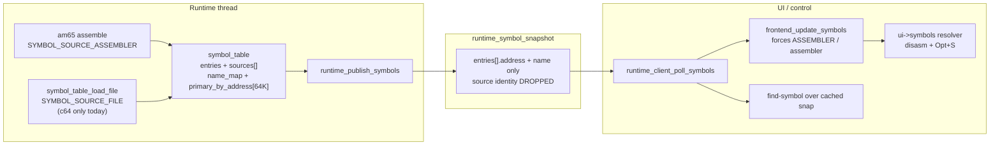
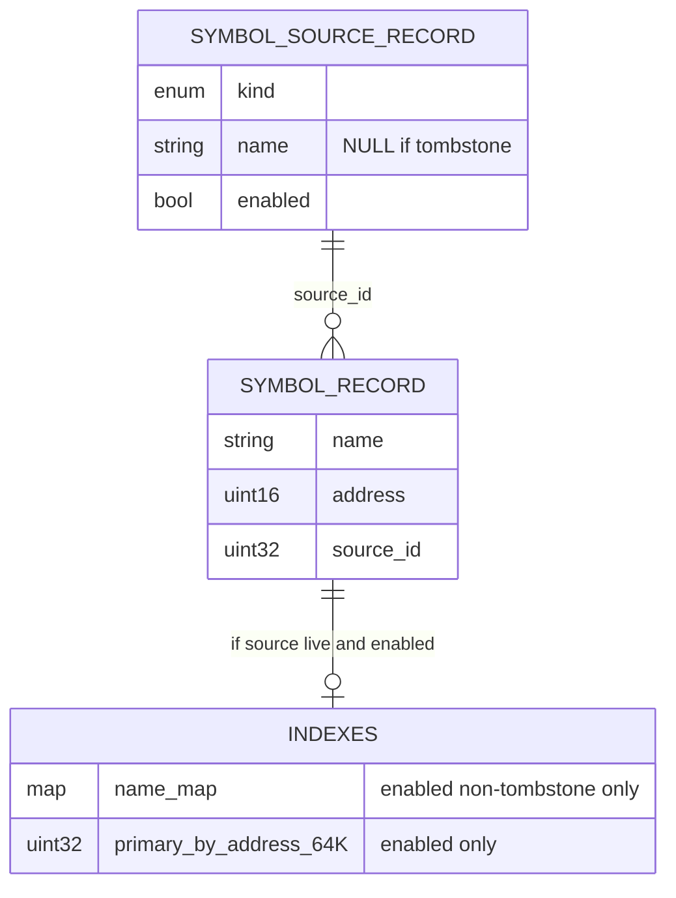

# Symbol source tracking, runtime filter (shape B), and cross-emulator unification

| Field | Value |
|-------|--------|
| Status | **Landed** (rev 4 — final decisions locked; PR train 1-6) |
| Author | _(author)_ |
| Date | 2026-08-31 |
| Audience | senior engineers working in `machines` (a2m / c64m / `src/shell`) |
| Repo | `/Users/swessels/Develop/github/personal/machines` |

## Overview

Users debugging overlays and competing executables need to soft-disable symbol
sources so only the relevant labels participate in resolve. Today Opt+S ("Symbol
Lookup") is duplicated in both product frontends; the runtime canonical table
already tracks `source_kind` + `source_name`, but the cross-thread publish path
strips that identity and the UI rebuilds every symbol as
`SYMBOL_SOURCE_ASSEMBLER` / `"assembler"`. Filter bits must not be dialog-only:
disasm labels, name→address, Opt+S, and control `find-symbol` must share one
considered set.

This design keeps canonical ownership on the runtime thread (shape B): each
loaded source gains an `enabled` flag; lookup indexes and publish iterate only
enabled sources; disable omits from indexes without freeing records; re-enable
rebuilds indexes. Published snapshots carry stable **source_id** plus a parallel
`sources[]` list (full path identity for display); enable commands are
**index-based**. Symbol Lookup + a sibling Filter window move into shared shell
chrome. Apple gains parity with C64 for `symbol_files` loading **and** for
polling published symbols so file loads and filter toggles reach the UI and
`find-symbol` without waiting for the next assemble.

## Background & Motivation

### Current architecture (as shipped)



Canonical store (`src/shell/tools/symbols/symbol_table.{c,h}`):

- `symbol_source_record { kind, name }` and `symbol_record { name, address, source_id }`.
- Indexes: `name_map` (stb_ds string hash) + `primary_by_address[65536]`.
- `symbol_info` already exposes `source_kind` and `source_name` to callers that
  read the table directly.
- Loader (`symbol_file.c`) tags entries `SYMBOL_SOURCE_FILE` with **full path** as
  `source_name`. Assembler import (`runtime_assembler_import_symbol` in both
  products) tags `SYMBOL_SOURCE_ASSEMBLER` with the assemble path (or caller
  `source_name`). Paths use `RUNTIME_COMMAND_PATH_MAX` (**1024**).

Publish / consume (twins in both products):

| Stage | Apple | C64 |
|-------|-------|-----|
| Publish | `runtime_publish_symbols` in `src/apple2/runtime/runtime_thread.c` | same name in `src/c64/runtime/runtime_thread.c` |
| Wire type | `runtime_symbol_snapshot` in `src/apple2/runtime/runtime_client.h` | twin in `src/c64/runtime/runtime_client.h` |
| Poll | `runtime_client_poll_symbols` — **only on `RUNTIME_EVENT_ASSEMBLE_COMPLETE`** (`main.c` ~3386–3396; control `cache_symbols_from_client` in the same event) | twin client API; **also** `poll_symbols_into` every main-loop iteration (`src/c64/main.c` ~3723–3725) |
| UI ingest | `frontend_update_symbols` in `src/apple2/frontend/frontend.c` | twin in `src/c64/frontend/frontend.c` |
| Control | `CONTROL_COMMAND_FIND_SYMBOL` in `control_dispatch.c` | handled in `src/c64/main.c` |

`runtime_symbol_snapshot_entry` is only `{ uint16_t address; char name[64]; }`.
`frontend_update_symbols` clears the UI table and re-adds every entry as
assembler/`"assembler"`. Consequently Opt+S's SOURCE column (which calls
`frontend_symbol_lookup_basename(info.source_name, ...)`) always shows
`assembler` after any publish, even when the runtime held file or path-named
assembler sources. Manual text claiming file basenames is aspirational relative
to the live publish path (`manual/a2m/manual.md`, `manual/c64m/manual.md`).

**Apple poll gap (critical for shape B):** a2m drains the single-consumer symbol
slot only when handling `RUNTIME_EVENT_ASSEMBLE_COMPLETE`. Filter toggles,
startup file loads, and `APPLY_MACHINE_CONFIG` symbol reloads can call
`runtime_publish_symbols` and still leave the UI resolver and control
`find-symbol` cache stale until the next assemble. c64m already polls every
loop when UI and/or control is active. Shape B requires Apple poll parity (see
Proposed Design §2.1).

### Pain points

1. **No runtime filter.** Competing overlays cannot soft-exclude a source from
   disasm / find-symbol / Opt+S without unloading and losing the data.
2. **Source identity dies at the queue.** Filter UI and truthful SOURCE column
   are impossible until publish carries durable source identity.
3. **Duplicated chrome.** ~500 lines of Symbol Lookup state/helpers/draw/key
   handling exist in each product `frontend.c`; Filter would double that debt.
4. **Apple `symbol_files` gap (deeper than APPLY alone).** Configure stores
   `symbol_files`; the client API accepts them; `APPLY_MACHINE_CONFIG` payload
   includes `symbol_files[RUNTIME_COMMAND_PATH_MAX]`. But:
   - `src/apple2/main.c` CONFIG_APPLY passes `NULL` for `symbol_files`.
   - `apply_options_to_runtime_config` never sets `rt_config->symbol_files`.
   - Apple `runtime_internal.h` has **no** `char *symbol_files` member (C64
     stores it on `runtime` and `runtime.c` copies from config on create).
   - Apple `runtime_thread.c` APPLY_MACHINE_CONFIG never reads the payload
     field and has no `runtime_load_symbol_files`.
   - C64 does retain/copy/free, startup load (~line 6647), config-change
     reload, and absolute-path apply from main.
5. **Second lying table.** UI rebuilds a full `symbol_table` (including another
   64K address map) from a stripped snapshot — memory spent to erase identity.
6. **Apple assemble-only symbol poll.** Even a correct publish cannot refresh
   UI/`find-symbol` for non-assemble publishes (see above).

### Why symbols stay on the runtime thread

Assemble and (on C64) symbol-file load already run on the runtime thread. The UI
receives a snapshot across the queue; control `find-symbol` uses the published
set without Nuklear. Moving the canonical store to the UI would split ownership
with assemble/load and complicate headless control. **Keep runtime ownership;**
fix publish, poll parity, and add filter commands there.

## Goals & Non-Goals

### Goals

- **Truthful source identity** from runtime store → snapshot → UI table → Opt+S
  SOURCE column and Filter list.
- **Shape B runtime enable:** `enabled` on each source in the runtime table;
  indexes, publish, and `find-symbol` share the enabled set.
- Soft-disable (omit from indexes); soft-enable (rebuild indexes). No
  unload/reload cycle for filter toggles.
- One symbol record store; indexes rebuilt over enabled sources only.
- Unify semantics across a2m and c64m after import.
- Shared Symbol Lookup + Filter chrome under `src/shell/frontend/`.
- Apple parity for `symbol_files` load on startup and Configure apply.
- Apple parity for **consuming** published symbols (poll path), not only
  producing them.
- ASCII-only UI labels (`agents/shell/frontend.md`).

### Non-Goals

- Hard-remove / unload as the filter mechanism.
- Two parallel pools of duplicated symbol *records* (enabled pool vs disabled
  pool).
- UI-only filter bits that leave disasm / `find-symbol` seeing disabled sources.
- Merging product `runtime_thread` command loops or Inspector clocks.
- Persisting filter enable/disable across process restarts (session-only unless
  a later PR explicitly adds INI; default all sources enabled on load/create).
- Eliminating the UI-side `symbol_table` in the first ship (thread-local resolver
  remains; make it truthful). Optional later slim-down is noted, not required.
- Changing am65 itself (`src/shell/tools/am65/` stays one copy, untouched beyond
  existing import hooks).
- Control protocol verb to toggle filters in this milestone (deferred
  follow-up; UI → runtime command is enough for v1).
- `RUNTIME_EVENT_SYMBOLS_CHANGED` poll path (future alternative only; v1 is
  loop poll + durable buffer).
- Kind-prefixed source labels in Lookup/Filter (`file:`, `asm:`) — basename
  only for now.
- Sticky enable across in-place `symbol_table_load_file` reuse (v1 always
  enables new/reused sources; Config reload already `remove_kind(FILE)` first).

## Key Decisions

| Decision | Choice | Rationale |
|----------|--------|-----------|
| Filter locus | **Runtime (shape B)** | One considered set for disasm, Opt+S, and `find-symbol`; UI cannot lie. |
| Disable semantics | Soft-disable: keep records, drop from indexes | Instant toggle; no reload I/O; matches "sources stay loaded". |
| Storage shape | One `entries[]` + `sources[]` with `enabled`; rebuild indexes | Avoids duplicating records; filter changes are rare vs lookups. |
| Source identity on wire | **`source_id` on entries + parallel `sources[]`** (full path in sources) | Paths are up to 1024 chars; enable must not use truncated names. Basename is display-only. |
| Enable command key | **Index / `source_id`** (`set_source_enabled_at`) | Matches Filter row; avoids path round-trip mismatch. |
| Source slot reuse | **Tombstones** (`name == NULL` slots skipped by enumeration) | Stable ids across Filter session; simpler than compact+remap. |
| Cross-emulator | Same model, UI, and filter semantics in both binaries | Assembler + `symbol_file` already shared; chrome should follow. |
| UI placement | Shared shell Symbol Lookup + sibling Filter window | Stops twin growth; File Browser stacking pattern already proven. |
| Canonical owner | Runtime thread | Assemble/load already there; control works headless. |
| UI/runtime isolation | **UI never reads `rt->symbols`**; only polled snapshot copies | Thread safety; Filter source cache lives in UI/chrome state. |
| Apple files | Fix `symbol_files` end-to-end (storage + load + apply) | Without file sources, Filter is assembler-only on a2m. |
| Apple / control poll | **Loop poll** matching c64m cadence; single-consumer | Publish from filter/file load must reach UI/`find-symbol` without assemble. |
| Poll buffer | **One durable heap snapshot buffer** (or long-lived control/UI cache); idle = mutex+flag only | ~350 KB must not be stack-local; do not `malloc`/`free` every frame. |
| Snapshot header | **Hoist to `src/shell/runtime/` in PR 2** with `RUNTIME_SYMBOL_SOURCE_NAME_MAX` (= 1024) | One type for both products; shell must not include product `runtime_command.h`. |
| Source display | **Basename only** in Lookup/Filter labels | Kind prefix (`file:`, `asm:`) optional later; not in this milestone. |
| Control filter verb | **Deferred** (follow-up; not this milestone) | UI → runtime command is enough for v1. |
| Default enable | New sources start **enabled** | Least surprise; filter is opt-out. |
| Persist filter | **Not** in v1 | Session toggles only; avoids INI schema until UX settles. |
| Snapshot metrics | `count` / `total` are **enabled-view** (cap / pre-cap) | Disabled symbols are omitted from both; not a truncation signal for disabled. |
| Open Lookup refresh | Rebuild `entries[]` / Filter checkboxes on every successful symbol poll while open | Live considered set includes Opt+S list, not only disasm. |
| Snapshot source join | Map `source_id → (kind,name)` from dense `sources[]`; never subscript by slot id | After tombstones, dense index ≠ table slot id. |
| Enable id provenance | Filter/enable use chrome-cached snapshot `sources[].source_id` only | UI `symbol_table_add` assigns new local ids that must never round-trip to runtime. |

## Proposed Design

### 1. `symbol_table`: source enable + index rebuild

Extend the private source record in `symbol_table.c`:

```c
typedef struct symbol_source_record {
    symbol_source_kind kind;
    char *name;     /* NULL = tombstone; skipped by get_source enumeration */
    bool enabled;   /* meaningful only when name != NULL; default true on create */
} symbol_source_record;
```

Public API additions in `symbol_table.h` (names indicative):

```c
/* Raw slot count (== arrlen(table->sources)), including tombstones.
 * Publish / tests iterate 0 .. source_slot_count-1 and skip name == NULL. */
size_t symbol_table_source_slot_count(const symbol_table *table);

/* Informational: number of non-tombstone sources (UI caps / Filter button).
 * Not an iteration index space — there is no dense get_source(i). */
size_t symbol_table_source_count(const symbol_table *table);

/* Look up one raw slot. SYMBOL_NOT_FOUND for OOR or tombstone. */
symbol_result symbol_table_get_source_at(
    const symbol_table *table,
    uint32_t source_id,              /* raw slot index into sources[] */
    symbol_source_kind *out_kind,
    const char **out_name,
    bool *out_enabled);

/* Returns SYMBOL_NOT_FOUND for tombstones and out-of-range. */
symbol_result symbol_table_set_source_enabled_at(
    symbol_table *table,
    uint32_t source_id,
    bool enabled);

/* Optional: resolve (kind, full_path) -> source_id for loaders/tests only.
 * Filter / runtime commands use source_id, not truncated names. */
symbol_result symbol_table_find_source_id(
    const symbol_table *table,
    symbol_source_kind kind,
    const char *source_name,
    uint32_t *out_source_id);
```

**Identity contract (single rule for table, snapshot, command, Filter ops):**

- Canonical identity is the **`source_id`** = index into `table->sources[]`
  (raw slot, may have tombstone holes).
- Tombstone slots keep their id; new sources prefer a free tombstone slot, else
  `arrput` (id = new length − 1).
- Snapshot `sources[]` is a **dense** list of live sources; each element stores
  its raw `source_id`. `entries[].source_id` is that same raw slot id — **not**
  an index into the dense `snapshot.sources[]` array.
- Enable command / debugger intent carry table `source_id` + `enabled` only.
- Filter / enable always use chrome-cached `sources[].source_id` from the
  polled snapshot. Never use ids assigned by the UI-side `symbol_table_add`
  (those are a fresh local table and must not round-trip to runtime).
- Display strings (basename) are derived UI-side from
  `sources[].source_name` (full path; see `RUNTIME_SYMBOL_SOURCE_NAME_MAX`).
- Do **not** use basename or a 64-char truncation as an enable key.
- Ingest join: scan dense `snapshot.sources[]` for a matching `source_id`;
  never treat `source_id` as a subscript into that dense array.

**Index rebuild** (`symbol_rebuild_indexes`) becomes:

```c
static void symbol_rebuild_indexes(symbol_table *table)
{
    symbol_indexes_clear(table);
    for (each entry i) {
        const symbol_source_record *src = &table->sources[entry->source_id];
        if (src->name == NULL || !src->enabled)
            continue;
        table->primary_by_address[entry->address] = (uint32_t)i;
        shput(table->name_map, entry->name, (uint32_t)i);
    }
}
```

**Lookup behavior:** `find_by_address`, `find_by_name`, `find_nearest_before`, and
the `symbol_resolver` already consult indexes only — disabled sources vanish
from resolve with no further changes.

**Enumeration:** keep `symbol_table_count` / `symbol_table_get` = **all** symbol
records (including those whose source is disabled). Add
`symbol_table_count_enabled` / enabled iterators for publish so admin/debug can
still inspect the full store.

**Source removal — tombstone strategy (chosen):**

On `symbol_table_remove_source` / `remove_kind`:

1. Delete matching `entries[]` (as today).
2. For each affected source slot: `free(name); name = NULL; enabled = false`
   (tombstone). Do **not** `arrdel` the sources array (ids stay stable).
3. Rebuild indexes.
4. Publish / `symbol_table_source_count` skip tombstones; callers that need
   every slot use `symbol_table_source_slot_count` and skip `name == NULL`.
5. `set_source_enabled_at` on a tombstone returns `SYMBOL_NOT_FOUND`.

Tests required:

- `remove_kind` leaves no live orphans (`source_count` excludes tombstones;
  slot count may still include holes).
- `remove_source` frees the name pointer.
- Tombstone does not break `find_*` for remaining enabled sources.
- Re-add after remove can reuse a tombstone slot; new id may equal old id.
- Disable/enable by `source_id` across a remove of a *different* source keeps
  the surviving id stable (Filter session safety).
- Snapshot ingest join: with a tombstoned lower slot, dense `sources[0].source_id`
  is not 0; resolving entries by map-on-id succeeds and subscript-by-id fails
  the test if mistakenly used (PR 2).

**Lifecycle interactions:**

| Event | Behavior |
|-------|----------|
| `symbol_table_add` → new source | Allocate or reuse tombstone slot; `enabled = true` |
| `symbol_table_remove_source` / `remove_kind` | Delete entries; tombstone source slots; rebuild indexes |
| Assembler pre-import `remove_kind(ASSEMBLER)` | Tombstones prior assembler sources; new import creates a fresh enabled source named by path |
| `symbol_table_load_file` | Uses existing source id if `(FILE, path)` exists; **v1 always leaves/sets enabled=true** on that source (no sticky-disable). Config/startup already `remove_kind(FILE)` first, so sticky would not apply on the live path anyway |
| `symbol_table_clear` | Frees all entry names and source names; clears arrays |

**File-list reload policy (Config / startup):**
`runtime_load_symbol_files` does `remove_kind(FILE)` then loads each path.
That tombstones FILE sources and resets FILE enable to all-on on reload.
Assembler enable bits / ids are independent and preserved across file reload
(unless an assembler source id is unrelated — assembler sources are not FILE).

**Conflict / primary-at-address:** when two enabled sources define the same
address, last-writer-wins in rebuild order (same as today). Disabling the
winner promotes the other only after rebuild — rebuild walks `entries[]` in
store order so behavior is deterministic.

### 2. Truthful publish snapshot (source_id + sources[])

**Hoist the snapshot types into `src/shell/runtime/` in PR 2** (settled). Both
products include the shared header and drop the twin definitions from
`runtime_client.h`.

`RUNTIME_COMMAND_PATH_MAX` (1024) today lives only in product
`runtime_command.h`. The shell snapshot header must **not** include leftover
command headers. Define shell
`RUNTIME_SYMBOL_SOURCE_NAME_MAX = 1024` (equal to the product path cap) in that
shared header.

```c
enum {
    RUNTIME_SYMBOL_NAME_MAX            = 64,
    RUNTIME_SYMBOL_SNAPSHOT_MAX        = 4096,
    RUNTIME_SYMBOL_SOURCE_SNAPSHOT_MAX = 64,
    /* Full path identity; keep equal to product RUNTIME_COMMAND_PATH_MAX. */
    RUNTIME_SYMBOL_SOURCE_NAME_MAX     = 1024
};

typedef struct runtime_symbol_snapshot_entry {
    uint16_t address;
    char name[RUNTIME_SYMBOL_NAME_MAX];
    uint32_t source_id;   /* raw table->sources[] slot id (not dense index) */
} runtime_symbol_snapshot_entry;

typedef struct runtime_symbol_source_snapshot_entry {
    uint32_t source_id;   /* raw table slot id */
    uint8_t source_kind;  /* symbol_source_kind */
    char source_name[RUNTIME_SYMBOL_SOURCE_NAME_MAX];
    uint8_t enabled;      /* 0/1 */
} runtime_symbol_source_snapshot_entry;

typedef struct runtime_symbol_snapshot {
    size_t count;   /* enabled symbols copied into entries[] (capped) */
    size_t total;   /* enabled symbol count before cap (overflow if total > count) */
    runtime_symbol_snapshot_entry entries[RUNTIME_SYMBOL_SNAPSHOT_MAX];
    size_t source_count;  /* non-tombstone sources copied (capped) */
    runtime_symbol_source_snapshot_entry sources[RUNTIME_SYMBOL_SOURCE_SNAPSHOT_MAX];
} runtime_symbol_snapshot;
```

**`count` / `total` semantics:** both are **enabled-view** metrics. Disabled
symbols are omitted from `total` and from `entries[]`. `total > count` means
enabled-set truncation at `RUNTIME_SYMBOL_SNAPSHOT_MAX`, not “disabled were
dropped.” If a future debug path needs all-record counts, add a separate field;
do not overload `total`. Align tests that assert snapshot totals.

**Size note:** entries stay lean (~70 bytes with `source_id` vs ~134 with
denormalized kind+name64). Sources list worst case:
`64 * (4 + 1 + 1024 + 1) ≈ 66 KB`. Combined snapshot ≈ **350+ KB** (up from
~270 KB today). Fine as **one durable slot** (`runtime_symbol_slot.snapshot`,
control cache member). **Not** fine as a stack temporary — see §2.1.

`runtime_publish_symbols` (both products):

1. Lock `symbol_slot.mutex`.
2. Iterate raw slots `0 .. source_slot_count-1`; skip tombstones; append to
   dense `sources[]` with each row’s raw `source_id`, `kind`, full
   `source_name`, `enabled`. Cap at `RUNTIME_SYMBOL_SOURCE_SNAPSHOT_MAX`.
3. Fill `entries[]` from **enabled** symbols only: `address`, `name`, raw
   `source_id`. Cap at `RUNTIME_SYMBOL_SNAPSHOT_MAX`; set `total` to enabled
   count before cap.
4. Set `has_symbols` and unlock.

**Join rule for ingest (critical):** `snapshot.sources[]` is dense;
`entries[].source_id` is a **table slot id**. After tombstones (e.g. slot 0
dead, slot 1 live), `snapshot.sources[0].source_id == 1`. Never write
`snapshot.sources[entries[i].source_id]`.

`frontend_update_symbols`:

```c
symbol_table_clear(ui->symbol_table);
/* Build map: raw source_id -> (kind, name) by scanning dense sources[].
 * Linear scan is fine at <= 64; do NOT use source_id as an array subscript. */
for (i = 0; i < snapshot->count; ++i) {
    const runtime_symbol_source_snapshot_entry *src =
        find_source_by_id(snapshot, snapshot->entries[i].source_id);
    if (src == NULL) {
        /* Cap miss or corrupt id — skip or log once. */
        continue;
    }
    symbol_table_add(
        ui->symbol_table,
        snapshot->entries[i].address,
        snapshot->entries[i].name,
        (symbol_source_kind)src->source_kind,
        src->source_name,
        true);
    /* NOTE: symbol_table_add assigns a NEW local source_id in ui->symbol_table.
     * That local id must never be sent in SET_SYMBOL_SOURCE_ENABLED. */
}
symbol_table_make_resolver(ui->symbol_table, &ui->symbols);
/* Copy snapshot.sources[] (including raw source_id fields) into UI/chrome-owned
 * Filter cache — never point at runtime memory. Enable ops read cache.source_id. */
```

**Invariant:** UI never reads `rt->symbols`. Filter and Lookup state hold only
data from the polled snapshot copy. Enable commands use chrome-cached snapshot
`source_id` values only.

UI table contains the enabled set (matches resolver). If a symbol’s `source_id`
is missing from the capped `sources[]` (pathological >64 sources), skip that
entry and log once — prefer sizing `SOURCE_SNAPSHOT_MAX` to expected sessions
(dozens of files, not hundreds).

#### 2.1 Apple symbol poll parity (required for shape B)

Today a2m only polls symbols on `RUNTIME_EVENT_ASSEMBLE_COMPLETE`. That is
insufficient for file load and filter publish.

**Settled approach for v1: loop poll + durable heap buffer** (Apple matches
c64m cadence). When UI and/or control is active, call a single helper each
main-loop iteration (Apple equivalent of `poll_symbols_into`):

1. Hold **one durable** `runtime_symbol_snapshot` buffer for the process
   lifetime — allocate once at startup (or reuse the long-lived control/UI
   cache member as the poll destination). Idle iterations that find
   `has_symbols == false` cost only the mutex + flag check; **do not**
   `malloc`/`free` every frame. (C64 today `malloc`s each call at
   `src/c64/main.c` ~3558 — fix that to a durable buffer in the same PR so
   both products match.)
2. `runtime_client_poll_symbols` once into that durable buffer
   (single-consumer: clears `has_symbols`).
3. If a snapshot was taken: `frontend_update_symbols(ui, …)` when UI present;
   ensure control dispatch / control cache holds the published set (copy or
   poll directly into the long-lived cache member).
4. Migrate Apple assemble-complete (`main.c` ~3387) and
   `cache_symbols_from_client` (`control_dispatch.c` ~71) **off stack locals**
   onto the same durable-buffer helper so no path reintroduces a ~350 KB stack
   frame.

Forbidden: stack-allocated full snapshots; per-frame heap alloc/free of the
snapshot. Allowed: `runtime_symbol_slot.snapshot` and long-lived control/UI
cache members as durable storage.

**Single-consumer rule:** exactly one poller per published snapshot. Do not let
UI `poll_symbols` and control `cache_symbols_from_client` both drain the same
publish. On Apple today, assemble-complete uses
`control_dispatch_copy_symbols` when control is active else direct poll — keep
that exclusivity in the loop helper (control cache owns the snap; UI reads via
copy API, same as assemble-complete path).

**Not in v1:** `RUNTIME_EVENT_SYMBOLS_CHANGED`. May be revisited later as an
optional alternative; loop poll is the required ship path.

Confirm c64m loop poll still works after snapshot struct growth (same helper,
richer payload, durable buffer).

Gate “live Filter → live disasm / Lookup / find-symbol” on this path landing
**before or with** the enable command (see PR Plan).

### 3. Runtime filter commands

Add product runtime commands (twins initially):

- `RUNTIME_COMMAND_SET_SYMBOL_SOURCE_ENABLED` — payload:
  `uint32_t source_id; uint8_t enabled;`
- Optional batch later for Apply-all; not required if checkboxes are immediate.

Handler on runtime thread:

```c
symbol_table_set_source_enabled_at(rt->symbols, source_id, enabled != 0);
runtime_publish_symbols(rt);
```

Client wrapper: `runtime_client_set_symbol_source_enabled(client, source_id, enabled)`.

**Product intent wiring (required — frontends do not call `runtime_client_*`):**

Both products add something like:

```c
FRONTEND_DEBUGGER_INTENT_SET_SYMBOL_SOURCE_ENABLED,
/* intent payload: */
uint32_t symbol_source_id;
bool     symbol_source_enabled;
```

- Shared `symbol_lookup_view` ops call
  `set_source_enabled(ctx, source_id, enabled)` only — **no** product runtime
  headers inside shell chrome.
- Product ops implementation pushes the debugger intent (same pattern as other
  chrome actions).
- `main.c` intent handler calls
  `runtime_client_set_symbol_source_enabled(...)`.
- Headless/control remains without a filter verb in v1.

**Toggle timing:** **immediate** per checkbox (intent → command → publish →
poll → UI refresh). Cheap; filter changes are rare.

**Open dialog refresh (required):** when `frontend_update_symbols` runs and
Symbol Lookup and/or Filter is open, the shared view must:

1. Rebuild Lookup `entries[]` from the new UI `symbol_table` (or directly from
   the snapshot), preserve search string, refilter/sort, clamp selection.
2. Refresh Filter checkbox mirror from `snapshot.sources[]` (by `source_id`).

Without this, disasm/`find-symbol` can diverge from the open Opt+S list.
Do not claim Lookup participates in the live considered set unless this refresh
exists.

```mermaid
sequenceDiagram
  participant User
  participant UI as Shared symbol_lookup_view
  participant Main as Product main
  participant RT as Runtime thread
  participant ST as symbol_table

  User->>UI: Opt+S
  UI->>UI: copy enabled symbols into entries[]
  User->>UI: Filter
  UI->>UI: show sources[] checkboxes
  User->>UI: uncheck overlay.sym row
  UI->>Main: intent SET_SYMBOL_SOURCE_ENABLED(source_id, false)
  Main->>RT: RUNTIME_COMMAND_SET_SYMBOL_SOURCE_ENABLED
  RT->>ST: set_source_enabled_at; rebuild indexes
  RT->>RT: runtime_publish_symbols (enabled only)
  Main->>Main: loop poll_symbols_into / symbols-changed
  Main->>UI: frontend_update_symbols + refresh open Lookup/Filter
  Note over UI: disasm labels + Opt+S list + find-symbol<br/>all omit that source
```

### 4. Apple `symbol_files` parity

Mirror C64 end-to-end — storage hole included:

| Gap | Fix |
|-----|-----|
| **Runtime storage** | Add `char *symbol_files` to Apple `runtime_internal.h` / `runtime` (C64 already has it). |
| **Create / destroy** | Copy from `runtime_config.symbol_files` in Apple `runtime.c` create (mirror C64); `free` on destroy. |
| Startup load | Call `runtime_load_symbol_files` from Apple runtime thread start (port from C64 `runtime_thread.c` ~2300–2356). |
| `apply_options_to_runtime_config` | Set `rt_config->symbol_files` via `app_options_symbol_files_absolute`. |
| CONFIG_APPLY in `main.c` | Pass absolute symbol_files string instead of `NULL` into `runtime_client_apply_machine_config`. |
| APPLY_MACHINE_CONFIG handler | Compare/replace `rt->symbol_files`; on change call `runtime_load_symbol_files` + publish. |
| **Poll path** | Depends on §2.1 — without it, loaded files publish but UI/`find-symbol` stay empty until assemble. |

Shared helper candidate (optional): move `runtime_load_symbol_files` body next to
symbols or a tiny shell helper; not required if Apple copies the C64 function
carefully.

### 5. Shared Symbol Lookup + Filter chrome

Extract from both product `frontend.c` twins into:

- `src/shell/frontend/symbol_lookup_view.{c,h}`

Ship as **two reviewable steps** (same milestone, split PRs — see PR 5a/5b):

**5a — extract Lookup with behavior parity** (~500 lines/side today): move
state, basename/scope helpers, search/sort/filter indices, draw, and key
handling. Footer may still be Close-only. Products delete twins and wire jump
callbacks. Manual ESC/Tab/Enter matrix vs today’s Lookup.

**5b — add Filter + enable ops:** footer **`[Filter][Close]`**; sibling
`"Symbol Filter"` top-level window (draw **after** Lookup, File Browser
stacking precedent); scrolling checkboxes; ops for
`set_source_enabled(ctx, source_id, enabled)`;
`frontend_any_dialog_open` includes Filter; ESC closes Filter first if open.

Responsibilities (final):

- State: open flags, search, `entries[]` / `filtered[]`, sort, selection,
  `from_memory`, Filter child state, chrome-owned copy of last `sources[]`.
- Filter button enabled only when `source_count > 0`.
- Labels: **basename only** (no extension) from full `source_name` (existing
  basename helper moved into the shared TU). No kind prefix in v1. ASCII only.

Product wiring:

```c
typedef struct symbol_lookup_ops {
    void *ctx;
    void (*jump_disasm)(void *ctx, uint16_t address);
    void (*jump_memory)(void *ctx, uint16_t address);
    void (*set_source_enabled)(void *ctx, uint32_t source_id, bool enabled);
} symbol_lookup_ops;
```

Products keep Opt+S hooks (`debugger_disasm` already has `on_symbol_lookup`).

### 6. Control `find-symbol`

No protocol change for v1: dispatch already scans the cached snapshot. Once
publish emits only enabled symbols **and** Apple/control poll refreshes that
cache on non-assemble publishes (§2.1), `find-symbol` respects the filter.

Optional later: response could include `source=`; not required.

### 7. Efficiency summary

| Concern | Approach | Approx cost |
|---------|----------|-------------|
| Memory (canonical) | One store; 1 bool + tombstone per source | Negligible vs entries |
| Memory (indexes) | 64K primary map + name hash over enabled only | Same as today for enabled set |
| Memory (UI) | UI `symbol_table` from truthful enabled snapshot | Same order as today |
| Snapshot slot | ~280 KB entries + ~66 KB sources worst case | One slot; fine |
| Lookup | Index hit path unchanged | Filter changes ≪ disasm lookups |
| Filter toggle | O(n entries) rebuild + republish + poll | Infrequent |

**Deferred optimization:** build resolver directly from snapshot arrays to avoid
a second 64K map. Out of scope for v1; any later sharing still needs a UI-owned
copy (never share mutable `rt->symbols` with the UI thread).

## API / Interface Changes

### `symbol_table.h`

- Add `source_slot_count`, `source_count` (live only), `get_source_at`,
  `set_source_enabled_at`, optional `find_source_id`.
- Document: iterate raw slots and skip tombstones; `source_count` is not a
  dense index space; no `get_source(i)` for 0..count-1.
- Document tombstones, stable `source_id`, and that find_* ignore disabled /
  tombstoned sources.
- `symbol_table_add` signature unchanged; new sources default enabled.
- Keep `symbol_table_count` = all records; add enabled counters/iterators for
  publish.

### Runtime client (both products)

- Snapshot uses raw `source_id` on entries + dense parallel `sources[]` with
  full paths (`RUNTIME_SYMBOL_SOURCE_NAME_MAX`).
- Ingest joins by matching `sources[].source_id`, never by dense subscript.
- `runtime_client_set_symbol_source_enabled(client, source_id, enabled)`.
- `runtime_client_poll_symbols` signature unchanged; richer payload.
- **Hoist** snapshot types to `src/shell/runtime/` with
  `RUNTIME_SYMBOL_SOURCE_NAME_MAX` (do not include product
  `runtime_command.h` from shell). Products drop twin definitions.
- Poll helpers use a **durable heap buffer** (allocate once / long-lived cache);
  migrate Apple stack locals; stop C64 per-frame `malloc`/`free`.

### Runtime commands

- `RUNTIME_COMMAND_SET_SYMBOL_SOURCE_ENABLED` with `{ source_id, enabled }` in
  each `runtime_command.h`.

### Frontend / shell / product main

- New shared `symbol_lookup_view` API (5a then 5b).
- New `FRONTEND_DEBUGGER_INTENT_SET_SYMBOL_SOURCE_ENABLED` (+ payload) in both
  products; `main.c` handlers call the client wrapper.
- `frontend_update_symbols` rebuilds UI table from snapshot identity; caches
  `sources[]` in UI state; refreshes open Lookup/Filter.
- Shell chrome never includes product runtime headers.

### Control

- No `find-symbol` grammar change.
- Ensure control cache refresh uses the same single-consumer poll helper as UI
  (§2.1). Manuals note results respect Symbol Filter.

## Data Model Changes

No on-disk schema in v1 (filter not persisted).

In-memory:



Migration: none. Process restart → all sources enabled after load/assemble.

`symbol_files` INI key already exists (`a2m.ini.example`, `c64m.ini.example`);
Apple begins honoring it once storage + load + poll land.

## Alternatives Considered

### A. UI-only filter (shape A)

Filter bits live only in Symbol Lookup / a UI-side mask.

- **Pros:** No runtime command; faster UI iteration.
- **Cons:** Disasm and `find-symbol` still see disabled sources — fails the
  product requirement. Rejected (explicit decision: shape B).

### B. Hard unload / reload per toggle

Disable = `remove_source`; enable = reload file / re-assemble.

- **Pros:** No new enable flag; indexes stay simple.
- **Cons:** Assembler sources are not trivially reloadable without re-assemble;
  file I/O on every toggle; slower. Rejected in favor of soft-disable.

### C. Two pools (enabled records vs disabled records)

Move disabled entries to a side array.

- **Pros:** Indexes always cover "everything in primary store."
- **Cons:** Duplicates management complexity; moves/copies on every toggle;
  contradicts "one store + selector indexes." Rejected.

### D. Keep product-local Symbol Lookup; only share the table filter

- **Pros:** Smaller first PR.
- **Cons:** Filter UI would be copied twice immediately; agents freeze says do
  not grow twins. Rejected for the chrome portion (extract is in-scope; split
  5a/5b to manage risk).

### E. Denormalized kind+name per snapshot entry vs source_id + sources[]

- **Denormalized:** each entry carries `source_kind` + `source_name[64]`.
  Simple ingest; **fails** path identity (`RUNTIME_COMMAND_PATH_MAX` is 1024)
  and enable round-trips; larger entries (~134 B).
- **source_id + sources[] (chosen):** entries stay small; sources carry full
  path once; enable is index-based; Filter and entries share one identity
  contract. Ingest must map dense `sources[]` by stored `source_id` (not
  array index) because tombstones create holes in the slot space.

### F. Compact+remap source ids on remove vs tombstones

- **Compact+remap:** dense arrays; every remove rewrites all `entry.source_id`
  and invalidates Filter row ids mid-session.
- **Tombstones (chosen):** stable ids for enable-by-index across a Filter
  session; enumeration skips `name == NULL`.

## Security & Privacy Considerations

| Topic | Notes |
|-------|-------|
| Paths in source_name | Full symbol/assemble paths cross the snapshot into UI-owned cache. Local-debug metadata (same trust as Configure paths). Do not send off-host except existing localhost control port. |
| Control port | `find-symbol` remains exact-name lookup over published enabled set. Enable command is UI/runtime only in v1 (no new control verb). |
| Bounds | Cap entries at 4096 and sources at 64; reject enable on tombstone / OOR `source_id`. Path buffers use `RUNTIME_SYMBOL_SOURCE_NAME_MAX` (= product path max 1024). |
| Threat model | Local debugger aid; no elevation. Malicious symbol files already could spam labels — filter does not worsen that. |

## Observability

- On filter toggle: optional quiet debug log
  (`symbol source id=%u enabled=%d`) — default off.
- Publish sets `has_symbols`; **loop poll** into the durable buffer is the
  consumer signal (not assemble-complete alone).
- Metrics: not required; optional enabled vs enumerable source counts on publish.
- Errors: unknown/tombstone `source_id` → client false / runtime error pattern
  consistent with other bad commands.
- Apple file load failures: mirror C64 (`runtime_publish_error` with path).

## Rollout Plan

1. **Land table + tests** (enable flag, tombstones, rebuild) — all-enabled ≡ today.
2. **Land truthful snapshot (`source_id` + sources[]) + frontend ingest + Apple
   poll parity** — SOURCE column correct; non-assemble publish reaches UI/control.
3. **Land Apple `symbol_files` storage + load + apply** — file sources visible
   on a2m (depends on poll from step 2).
4. **Land runtime enable command + intent wiring** — live filter for
   disasm/`find-symbol`/UI (poll path already present).
5. **Land shared Lookup extract (5a) then Filter UI (5b)**; delete product twins.
6. **Manuals / agents** — Filter, Apple `symbol_files`, truthful SOURCE, ASCII.

**Feature flag:** unnecessary if steps 1–2 are behavior-compatible while all
sources remain enabled.

**Rollback:** revert PR train; no INI migration. Filter state is session-only.

**Risks**

| Risk | Severity | Mitigation |
|------|----------|------------|
| Apple assemble-only poll leaves filter/file publish invisible | High | §2.1 mandatory in PR 2; gate PR 4 live feedback on it |
| ~350 KB snapshot on Apple stack (main/control) | High | Durable heap buffer / long-lived cache; migrate assemble-complete + `cache_symbols_from_client` |
| Per-frame malloc of enlarged snapshot (C64 today) | Med | Allocate once; idle path is mutex+flag only |
| Truncated source_name break enable | High | Index-based identity; full path only in `sources[]` |
| Dense `sources[source_id]` join bug after tombstones | High | Map-by-id ingest; PR 2 test with tombstoned lower slot |
| UI-local source_id sent to runtime enable | High | Enable uses chrome-cached snapshot ids only |
| Snapshot ABI drift / PATH_MAX include edge | Med | Shell `RUNTIME_SYMBOL_SOURCE_NAME_MAX`; shared header or lockstep twins |
| `remove_kind` orphans / unstable Filter ids | Med | Tombstones + tests; skip null names in enumeration |
| Intent wiring forgotten (chrome calls client directly) | Med | Explicit intent + main handler in API/PR; shell has no runtime headers |
| Open Lookup stale after toggle | Med | `frontend_update_symbols` refreshes open Lookup/Filter |
| Extract + Filter in one review | Med | Split PR 5a/5b; ESC/Tab manual matrix vs File Browser stacking |
| Twin runtime command enums diverging | Low | Name identically; agents note |

## Open Questions

None for this milestone. The following are **settled** and must not be
reopened in implementation PRs:

- Filter at runtime (shape B), soft-disable, one store + indexes, cross-emulator
  unify, source tracking to consumers.
- Index-based identity, tombstones, immediate checkboxes, enabled-view
  `count`/`total`, open-Lookup refresh, no sticky `load_file` disable for v1.
- **Shared snapshot header** in `src/shell/runtime/` with
  `RUNTIME_SYMBOL_SOURCE_NAME_MAX` (= 1024); no product `runtime_command.h`
  include from shell.
- **Loop poll + durable heap buffer** (Apple matches c64m cadence); no
  `SYMBOLS_CHANGED` for v1 (future alternative only).
- **Control filter verb** deferred to a follow-up.
- **Source display** = basename only; kind prefix optional later.

## References

- `agents/README.md` — monorepo layout, freeze, shared vs leftover
- `agents/shell/frontend.md` — shared chrome rules, ASCII-only UI
- `src/shell/tools/symbols/symbol_table.{c,h}`, `symbol_file.c`
- `src/shell/tools/am65/` — sole assembler
- Product twins: `src/apple2/frontend/frontend.c`, `src/c64/frontend/frontend.c`
  (Symbol Lookup ~`frontend_open_symbol_lookup` / `frontend_draw_symbol_lookup`)
- Publish: `runtime_publish_symbols` in both `runtime_thread.c` files
- Ingest: `frontend_update_symbols` (both frontends)
- Apple poll: assemble-only in `src/apple2/main.c` ~3386–3396;
  `cache_symbols_from_client` on assemble-complete in `control_dispatch.c`
- C64 poll: `poll_symbols_into` each loop in `src/c64/main.c` ~3723–3725
- C64 load: `runtime_load_symbol_files` in `src/c64/runtime/runtime_thread.c`
- Apple gap: no `symbol_files` on Apple `runtime_internal`; CONFIG_APPLY passes
  `NULL`; APPLY ignores field; no load helper
- Control: `find-symbol` — Apple `control_dispatch.c`; C64 `main.c`
- Stacking precedent: File Browser drawn after Load dialogs
- Path cap: `RUNTIME_COMMAND_PATH_MAX = 1024` in product `runtime_command.h`
- Tests: `tests/c64/tools/test_symbol_table.c` (extend / move under
  `tests/shell/` when enable APIs land)
- Manuals: Symbol Lookup sections in `manual/a2m/manual.md`,
  `manual/c64m/manual.md` (SOURCE column claims vs lying publish — keep fixed
  in PR 6 after truthful publish)

## PR Plan

### PR 1 — `symbol_table` source enable + tombstones + index filtering

- **Title:** symbol_table: per-source enabled flag, tombstones, index rebuild
- **Files:** `src/shell/tools/symbols/symbol_table.{c,h}`;
  `tests/c64/tools/test_symbol_table.c` and/or `tests/shell/tools/`
- **Depends on:** none
- **Changes:** Add `enabled` + tombstone (`name == NULL`) semantics.
  Implement `source_slot_count` / `source_count` / `get_source_at` /
  `set_source_enabled_at`. Callers iterate raw slots and skip tombstones;
  `source_count` is informational only. `symbol_rebuild_indexes` skips
  disabled and tombstones. `remove_kind` / `remove_source` tombstone slots
  (no id remap). Unit tests per §1. All-enabled behavior ≡ today.

### PR 2 — Truthful snapshot (`source_id` + sources[]) + ingest + poll parity

- **Title:** publish symbol source_id/sources and fix Apple symbol poll parity
- **Files:** new shared header under `src/shell/runtime/` (snapshot types +
  `RUNTIME_SYMBOL_SOURCE_NAME_MAX`); both products drop twin snapshot typedefs
  from `runtime_client.h`; shell + product CMake include paths;
  `runtime_publish_symbols` in both `runtime_thread.c`;
  `frontend_update_symbols` in both `frontend.c`; Apple `main.c` (+ control
  dispatch) loop-poll helper with durable buffer; migrate Apple
  assemble-complete and `cache_symbols_from_client` off stack locals; fix C64
  `poll_symbols_into` to stop per-frame `malloc`/`free`; tests for snapshot
  totals (enabled-view) and **tombstoned-slot join-by-id**
- **Depends on:** **PR 1 (required)** — needs `get_source_at` / enabled
  iterators / enable flags on sources for truthful `sources[]`
- **Changes:** Hoist snapshot to `src/shell/runtime/` with shell
  `RUNTIME_SYMBOL_SOURCE_NAME_MAX` (= 1024); do not include product
  `runtime_command.h` from shell. Entries carry raw `source_id`; dense
  parallel `sources[]` with full paths and enable flags. Publish enabled
  symbols only; `count`/`total` are enabled-view. UI ingest builds a
  `source_id → (kind,name)` map from dense `sources[]` (never subscript by
  slot id); test with a tombstoned lower slot. **Apple poll parity (§2.1):**
  loop poll + **one durable heap buffer** (idle = mutex+flag only); migrate
  assemble-complete / `cache_symbols_from_client` off stack; align C64 helper.
  No `SYMBOLS_CHANGED` in this PR. While all sources stay enabled, resolve
  behavior unchanged aside from truthful SOURCE labels.

### PR 3 — Apple `symbol_files` storage + load + apply

- **Title:** a2m: retain and load symbol_files like c64m
- **Files:** Apple `runtime_internal.h` / `runtime.c` (add `symbol_files` copy
  free); `runtime_thread.c` (`runtime_load_symbol_files`, startup, APPLY
  compare/replace); `main.c` (`apply_options_to_runtime_config`, CONFIG_APPLY
  absolute paths)
- **Depends on:** **PR 2 (required for visibility)** — poll path must exist so
  loaded files appear in UI/`find-symbol` without assemble
- **Changes:** End-to-end file-backed symbols on a2m. No Filter UI yet; SOURCE
  column shows file basenames after poll.

### PR 4 — Runtime set-enabled command + product intent wiring

- **Title:** runtime: set symbol source enabled by id and republish
- **Files:** both `runtime_command.h`, `runtime_client.{c,h}`,
  `runtime_thread.c` handlers; both products’ intent enums / structs /
  `main.c` handlers; light tests if present
- **Depends on:** PR 1, PR 2 (**including poll parity** — do not claim live
  disasm/Lookup/`find-symbol` feedback without it)
- **Changes:** Index-based enable command; rebuild indexes; republish. Intent
  `FRONTEND_DEBUGGER_INTENT_SET_SYMBOL_SOURCE_ENABLED`. After poll,
  `frontend_update_symbols` refreshes open Lookup/Filter if already wired, or
  at least UI table/resolver for disasm. Chrome Filter UI may wait for PR 5b;
  temporary debug intent push is optional.

### PR 5a — Shared Symbol Lookup extract (parity)

- **Title:** shell: extract Symbol Lookup into symbol_lookup_view
- **Files:** new `src/shell/frontend/symbol_lookup_view.{c,h}`; shell CMake;
  both product `frontend.c` / `frontend.h` (delete Lookup twins; wire jump
  ops); `frontend_any_dialog_open`
- **Depends on:** PR 2 (truthful table/SOURCE); PR 4 optional for this extract
- **Changes:** Behavior-parity move only (~500 lines/side). Close-only footer
  OK. Manual ESC/Tab/Enter/search/sort checks. No Filter yet.

### PR 5b — Symbol Filter window + enable ops

- **Title:** shell: Symbol Filter sibling window and enable ops
- **Files:** `symbol_lookup_view.*`; product ops → intent; draw order (Filter
  after Lookup); `frontend_any_dialog_open`; refresh-on-poll path in
  `frontend_update_symbols` / view notify
- **Depends on:** PR 5a, PR 4 (enable command + intent), PR 2 (sources[] list)
- **Changes:** Footer `[Filter][Close]`. Sibling `"Symbol Filter"` checkboxes
  by basename; immediate toggle via `source_id`. Open Lookup/Filter refresh on
  poll. ASCII labels. Filter button disabled when no sources. ESC closes
  Filter first.

### PR 6 — Docs and agents handoff

- **Title:** docs: Symbol Filter and Apple symbol_files behavior
- **Files:** `manual/a2m/manual.md`, `manual/c64m/manual.md` (HELP regen);
  `agents/shell/frontend.md`; optionally product frontend notes;
  `design/README.md` index when filed under `design/`
- **Depends on:** PR 5b (user-visible Filter), PR 3 (Apple files)
- **Changes:** Document Filter, stacking, session-only enable, Opt+S SOURCE
  truth (replace aspirational basename claims with behavior that matches
  code), Apple `symbol_files` loading, poll/filter interaction. ASCII only.
