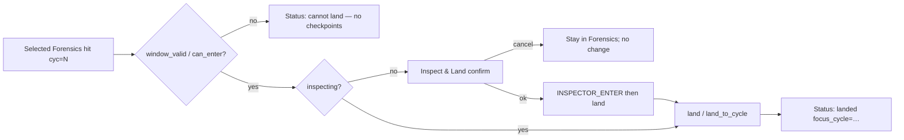

# Forensics UI (flight recorder / HST1 FIND)

| Field | Value |
|-------|-------|
| **Author** | swessels |
| **Date** | 2026-08-24 |
| **Status** | Draft |
| **Canonical path** | [`design/forensics-ui.md`](forensics-ui.md) |

---

## Overview

a2m already records a dense instruction/bus log (HST1) and exposes FIND over the control port (`history-find` / `history-next` / `history-read`). That surface is useful to scripts and `tools/a2m_control_client.py`, but there is no in-emulator debugger UI for forensic queries such as “who wrote `$22` to `$2011`?”. The Inspector tab (Misc → Inspector) is a separate stream: checkpoint-based time travel with a scrubber. Product invariant: HST1 is FIND, not the slider.

This design adds a **full-window Forensics mode** (same class as the F9 debugger layout — the whole client area, **not** a Help-style CRT overlay): a scrollback transcript of FIND/READ results, a thin query line over the real history verbs, a status strip, and a one-shot bridge to **Land Inspector at `machine_cycle`**. Entering **pauses** the machine; leaving returns to the debugger and **stays paused**. It does not drive the Inspector slider from HST1, does not embed another crowded Misc tab, and only advertises query keys the live shared find-option parser accepts.

**Naming:** The UI mode is **Forensics** (the act of investigating). The underlying log remains the **CPU flight recorder** / HST1 — parallel to **Inspector** (UI) vs TimeMachine (mechanism).

---

## Background & Motivation

### Current state

| Layer | Role today |
|-------|------------|
| `src/runtime/runtime_history.*` | Bounded arena recorder; `runtime_history_find` / `read` with full `runtime_history_query` (epoch, timeline, cycle, pc, address, access, value, opcodes, direction). |
| `src/runtime/runtime_history_wire.*` | HST1 encode/decode (24-byte header + 48-byte record headers + 8-byte accesses). Decode validates like `Ctl.decode_hst1`. |
| `src/control/control_dispatch.c` | Thin caller of shared `runtime_history_parse_find_options` (full grammar; was minimal six-key before PR 1). |
| `tools/a2m_control_client.py` | Decode + `format_hst1_record` / `format_hst1_page` (canonical human line shape, including marker forms and multi-access compact lines). |
| Misc → Inspector (`frontend_draw_misc_inspector`) | Record / Inspect / slider / Leave. Uses `FRONTEND_DEBUGGER_INTENT_INSPECTOR_*` → `runtime_client_inspector_*`. |
| Help overlay (`help_view.*`) | Precedent for a full-window UI mode flip. **Opt+H** opens Help and may auto-pause; Forensics must not clone that pause-on-open behavior. |
| Sessions | `RUNTIME_SESSION_CAPACITY = 4`. Slot 0 is pre-armed as `RUNTIME_SESSION_KIND_UI` with `default_session_id = 1`. Control clients open separate `KIND_CONTROL` sessions. |

HST1 FIND/NEXT/READ work on the worker via `runtime_client_history_*` (session-scoped cursor, paused-only, HST1 payload claimed with `runtime_client_claim_history_rpc`). Forensics UI (PR 4) dispatches the same client path from `main.c` (token match → claim/decode → `frontend_forensics_apply_*`); control TCP continues to use `control_dispatch_on_runtime_event`.

### Pain points

1. Forensic digs require an external TCP client while the game is paused in the window.
2. ~~Manual § CPU Flight Recorder documents find keys the wire rejected~~ — **resolved in PR 1** via shared `runtime_history_query_parse`.
3. Joining a FIND hit to time travel means manually scrubbing by cycle; no “land here” from a hit.
4. Packing FIND into the Inspector Misc tab would conflate two products and crowd an already dense pane.

### Join key

Film frames, Inspector focus, and HST1 records share **`machine_cycle`**. They are not one lock-step stream (`agents/timemachine.md`). Land and FIND bridge only through that cycle.

---

## Goals & Non-Goals

### Goals

1. Full-window **Forensics** UI entered from Inspector (button + shortcut); leave restores the normal debugger layout.
2. **Append-only transcript** of FIND / NEXT / READ results (≈500–2000 lines). v1 copy is **click-select line/block + Copy button** (not drag-select). Line shape north star: `Ctl.format_hst1_record(..., compact=True)` including markers.
3. **Query line**: thin wrapper over `history-find` / `history-next` / `history-read` (+ status via `history-info`); up/down query history; Tab autocomplete of keys/values from the **shared parser’s public key table**.
4. **Status strip**: recording on/off, epoch, retained bytes / IDs, cursor/more, soft error (running, stale, unavailable).
5. **Clear transcript** without clearing the recorder (`history-clear` is separate and destructive).
6. One-shot **Land Inspector at cycle** from a selected hit. When live but `can_enter`, offer **Inspect & Land** confirm (enter Inspect, then land). Hard soft-fail only when no inspector window / cannot enter. Out-of-range cycles land and explain clamp/restore-live.
7. Honest syntax: UI and manual match the real wire via shared parse under `src/runtime/`.
8. **Token-aware copy** in polish (PR 7): double-click / token hit on `id=` / `cyc=` / `pc=$…` copies that token (in addition to v1 whole-entry Copy).

### Non-Goals

- Driving the Inspector slider continuously from HST1 / FIND results.
- A column-grid spreadsheet or single-record peephole as the primary surface.
- Promoting Forensics into another Misc tab alongside Inspector.
- Always-on HST1 independent of Inspector Record policy (Record remains opt-in; arms checkpoints + frame ring + HST1 as configured).
- Reverse-CPU or write-delta time travel (closed in `agents/timemachine.md`).
- Exposing enter/land verbs on the control wire (land stays UI/`runtime_client` path; FIND stays as today).
- Drag-select transcript editing in v1 (deferred; see Transcript).
- Help-style CRT overlay (Forensics owns the full client area; pause-on-enter is intentional).

---

## Proposed Design

### Mode model

Full-window mode swap — **not** a Help-style CRT overlay:

```text
Display-only (CRT) ──Opt+R──► Forensics ──Opt+R/Close──► CRT (restore run state)
Debugger (F9 up)   ──Opt+R──► Forensics ──Opt+R/Close──► Debugger (paused)
Forensics          ──F9─────► Debugger (always paused)
Esc does not leave Forensics
```

**Shortcut (audited):** **Opt+R** from anywhere. Opt+H is Help. Esc does **not** leave Forensics (Help still uses Esc).

**Mutual exclusion with Help:** Forensics and Help cannot both be open.

**Pause policy (normative):**

| Transition | Behavior |
|------------|----------|
| Open Forensics | **Pause** if running. Record entry surface. If entry was CRT, also record whether it was running. |
| Opt+R / Close | Return to **entry surface**. CRT entry → CRT and **resume** only if it was running at open. Debugger entry → debugger, **paused**. |
| F9 | Always **debugger**, **paused** (abandons CRT resume latch). |
| Esc | No-op for Forensics. |
| Forensics → Help (Opt+H) | Close Forensics (stay paused); Help with `paused_by_help=false`. |

FIND still requires pause. Host F10/F11/F12 remain available while Forensics is open.

```mermaid
stateDiagram-v2
    [*] --> CRT
    [*] --> Debugger
    CRT --> Forensics: Opt+R (pause; remember was_running)
    Debugger --> Forensics: Opt+R / Forensics… (pause)
    Forensics --> CRT: Opt+R/Close if entry=CRT\n(restore was_running)
    Forensics --> Debugger: Opt+R/Close if entry=dbg\nOR F9 (paused)
```



### Layout

```text
+---------------------------------------------------+
|  [Close]  Forensics  [Clear view] [Copy]    |
|           [Land at cycle]                         |
+---------------------------------------------------+
|                text results go here               |
|              (scrollback transcript)              |
+---------------------------------------------------+
| status strip (recording, epoch, bytes, …)         |
| Query line goes here                              |
+---------------------------------------------------+
```

### Transcript (results canvas)

- Ring of **logical** transcript entries (target **1024**, clamp 512–2048 logical records/headers). Append FIND/NEXT/READ blocks; drop oldest logical entries on overflow (and their display rows).
- Not a full text editor: no free typing into the canvas.
- Block separators: blank logical entry + header echoing the issued verb, e.g.  
  `--- find address=$2011 access=data-write limit=64 ---`  
  then metadata + records.
- **Formatter north star:** C formatter must match `Ctl.format_hst1_record(..., compact=True)` / `format_hst1_page` behavior — multi-access compact lists, flag suffixes (`[partial]`, `[access_truncated]`, …), and **marker-shaped lines** for non-instruction kinds. Normative tests use a **golden HST1 fixture** decoded/formatted against Python output, not a hand-simplified one-liner. Illustrative shape only:

```text
id=13523 pc=$FCAC a=00 x=00 y=00 sp=F2 p=24 opcode=$D0 cyc=1234 accesses: write $C000=xx @+1, …
id=13524 kind=marker cyc=1200 marker=13 arg0=1 arg1=…
```

#### Line width & wrapping (no silent truncation)

Compact multi-access lines routinely exceed 256 characters. Do **not** store display text in a 256-byte cell and truncate.

**Policy:**

1. Format each logical entry into a full string (scratch cap **4096** bytes). If a pathological line would exceed 4096, truncate with a visible ASCII `...` suffix **and** set status `line-truncated` (should be rare; typical compact records fit).
2. Store that full string on the logical entry (heap dup or chunk pool) — this is what **Copy** and golden tests use.
3. For on-screen drawing only, **wrap-at-format** into consecutive display rows at ~**160** columns, preferring breaks after `, ` in access lists (else at the column limit). Continuation rows carry the same `logical_index`.
4. Display-row ring may be larger than the logical cap (e.g. logical 1024 → display rows up to ~2048); dropping a logical entry drops all of its rows.
5. Horizontal scroll of a single ultra-wide label is **not** required in v1; wrapping is the chosen presentation.

#### Selection & copy (v1 honest model)

Nuklear label lists do **not** provide assembler-style free drag-select. Assembler “Copy” today is a **button** that copies the entire error buffer via `SDL_SetClipboardText` (`frontend.c`), not a drag selection.

**v1:**

1. **Click** any display row of a record → selects the whole **logical** entry; sets Land selection (`selected_cycle` / `selected_id` from that entry’s `cyc=` / `id=`); highlights all wrapped rows of that entry.
2. **Click** a block header → selects the whole result block (all logical entries until the next header) for copy; Land uses the first record entry in the block that has `cyc=`, if any.
3. **Copy** button → `SDL_SetClipboardText` of the **full** logical string(s) (unwrapped), never a single truncated display row.
4. Optional: **Copy last result** copies the most recently appended FIND/NEXT/READ block when nothing is selected.

**Not in v1:** mouse-drag range selection across arbitrary lines.

**PR 7 (decided):** token-aware copy — double-click (or equivalent token hit-test) on `id=` / `cyc=` / `pc=$…` copies that token string to the clipboard. Whole-entry/block Copy remains.

- **Clear view**: empties logical + display rings and selection; does not call `history-clear`.

### Find option grammar (normative for PR 1)

Shared module: **`src/runtime/runtime_history_query_parse.c` / `.h`**.  
Public entry (names illustrative):

```c
bool runtime_history_parse_find_options(
    const char *text,
    runtime_history_query *query,
    runtime_history_from_kind *from_kind,
    uint64_t *from_id,
    uint16_t *limit);

/* Autocomplete / honesty: NULL-terminated key name table the parser accepts. */
const char *const *runtime_history_find_option_keys(void);
const char *const *runtime_history_find_access_names(void);
```

`control_dispatch.c` calls this instead of a private `parse_history_find_options`. Frontend/main link **runtime** (already), never control — do not leave the parser in `control_dispatch.c`.

Whitespace-separated `key=value` tokens. Unknown keys → parse failure. Defaults: `direction=backward`, `limit=64`, `from` = default (newest-first scan start as today).

| Key | Value syntax | Maps to |
|-----|--------------|---------|
| `pc` | u16 or `lo-hi` inclusive range; `$` hex ok | `has_pc`, `pc_first`/`pc_last` — same as today’s `parse_u16_range_token` (`-` delimiter, not `..`) |
| `address` | same u16 / `lo-hi` | `has_address`, `address_first`/`address_last` |
| `access` | name from table below | `has_access` + `access_mask`, except `execute`/`fetch` special-case (below) |
| `direction` | `forward` \| `backward` | `direction` |
| `limit` | decimal `1..256` | out-param `limit` |
| `from` | `oldest` \| `newest` \| retained id (`1..`) | `from_kind` / `from_id` |
| `epoch` | u64 (decimal or `0x`) | `has_epoch`, `epoch` |
| `timeline` | u32 | `has_timeline`, `timeline` |
| `cycle` | u64 or `lo-hi` inclusive range; `-` delimiter (same family as u16 ranges, but 64-bit). Single value ⇒ `first == last`. `$` not required (cycles are decimal counters); `0x` allowed | `has_cycle`, `cycle_first`/`cycle_last` |
| `value` | byte: decimal, `$NN`, or `0xNN`. Optional nibble mask via `?` in hex form only: `$2?` → value=`0x20`, mask=`0xF0`; `??` → mask=`0x00` (matches any) with value=`0`. Bare decimal has mask=`0xFF` | `has_value`, `value`, `value_mask` |
| `opcodes` | 1..32 comma-separated bytes (`RUNTIME_HISTORY_MAX_OPCODE_PATTERN`). Each byte: two hex digits or nibble wildcards with `?` (e.g. `A9`, `??`, `8?`, `?D`). No `$` prefix inside the list. Example: `opcodes=A9,??,8D` | `opcode_pattern_length` + `opcode_pattern[]` `.value`/`.mask` |

**Access names (after expansion)** — wire strings use hyphens as today:

| Name | Meaning |
|------|---------|
| `execute` | Special: clear `has_access` (instruction stream / PC filters via `pc` / empty access). Alias of manual **`fetch`**. |
| `fetch` | Alias → same as `execute` |
| `opcode` | `OPCODE_FETCH` bit |
| `operand` | `OPERAND_READ` |
| `data-read` | data/opcode/operand/dummy/stack/vector reads (today’s aggregate) |
| `data-write` | data + rmw-dummy + stack writes (today’s aggregate) |
| `read` | alias → `data-read` |
| `write` | alias → `data-write` |
| `data` | data-read \| data-write bits only |
| `dummy-read` | `DUMMY_READ` |
| `rmw-dummy-write` | `RMW_DUMMY_WRITE` |
| `stack-read` / `stack-write` | stack bits |
| `vector-read` | `VECTOR_READ` |

**Shared test table** (PR 1 deliverable) is the source of truth for autocomplete: UI calls `runtime_history_find_option_keys()` / `_access_names()` and must not hardcode a parallel list. If PR 1 slips to docs-only stopgap, the public key table in the shared module still lists **only the six live keys** until expansion merges — UI cannot drift.

### Query line

Verbs (user-facing prefixes, thin over `runtime_client_history_*`):

| User input | Maps to |
|------------|---------|
| `find [key=value ...]` or bare `key=value...` | parse → `HISTORY_FIND` intent |
| `next [limit=N]` | `HISTORY_NEXT` |
| `read <id> [before=N] [after=N] [epoch=N]` | `HISTORY_READ` |
| `info` | `HISTORY_INFO` → status strip (+ one transcript note) |
| empty Enter | no-op |

Ergonomics:

- **Up/Down**: query history (last 64 strings).
- **Tab**: autocomplete from `runtime_history_find_option_keys()` / access-name table / `from=` / `direction=`.
- Parse in the frontend with the shared module **before** pushing an intent. On parse failure, set status strip (`bad-args`) and do not dispatch.

### Data path (UI → worker)

Reuse the existing RPC path; do **not** open a localhost control TCP from the UI.

```mermaid
sequenceDiagram
    participant FX as Forensics UI
    participant Main as main.c
    participant RC as runtime_client
    participant RT as runtime_thread
    participant H as runtime_history

    FX->>FX: runtime_history_parse_find_options
    FX->>Main: INTENT_HISTORY_FIND (structured query)
    Main->>Main: alloc token; forensics_rpc.pending = token
    Main->>RC: runtime_client_history_find(session=0, query, …)
    RC->>RT: RUNTIME_COMMAND_HISTORY_FIND
    RT->>H: runtime_history_find (paused only)
    H-->>RT: records + page
    RT->>RT: runtime_history_wire_encode (HST1)
    RT-->>Main: RUNTIME_EVENT_HISTORY_RESULT_RESPONSE
    Main->>RC: claim_history_rpc(token)
    Main->>Main: runtime_history_wire_decode
    Main->>FX: frontend_forensics_apply_result(...)
```

#### Intent payload (decision: structured, option B)

Extend `frontend_debugger_intent` with a history union (names illustrative):

```c
typedef enum frontend_history_verb {
    FRONTEND_HISTORY_VERB_FIND = 1,
    FRONTEND_HISTORY_VERB_NEXT,
    FRONTEND_HISTORY_VERB_READ,
    FRONTEND_HISTORY_VERB_INFO,
    FRONTEND_HISTORY_VERB_CLOSE
} frontend_history_verb;

/* On frontend_debugger_intent when type is HISTORY_*: */
frontend_history_verb history_verb;
runtime_history_query history_query;     /* FIND */
runtime_history_from_kind history_from_kind;
uint64_t history_from_id;
uint16_t history_limit;                  /* FIND/NEXT */
uint64_t history_read_id;                /* READ */
uint64_t history_read_epoch;             /* 0 = current */
uint16_t history_before;
uint16_t history_after;
char history_label[160];                 /* echoed into transcript header */
```

Frontend parses the query line → fills structured fields → pushes intent. `main.c` does **not** re-parse find options; it only dispatches `runtime_client_history_*`.

#### `main.c` HISTORY claim / decode sequence (PR 4 checklist)

Analogous to how `control_dispatch.c` matches deferred HISTORY tokens and claims payloads (`RUNTIME_EVENT_HISTORY_RESULT_RESPONSE` + `runtime_client_claim_history_rpc`), and to how main already forwards other worker events into UI (`RUNTIME_EVENT_ASSEMBLE_*` → `frontend_show_assembler_*`).

1. **Dispatch (intent handler):**  
   - Allocate `token = runtime_client_alloc_request_token(client)`.  
   - Store `main`-local `forensics_history_rpc { token, verb, label }` (one in-flight Forensics history RPC; reject/queue if busy — mirror `RUNTIME_HISTORY_RPC_REQUEST_ACTIVE`).  
   - Call `runtime_client_history_find/next/read/info/close` with **`session_id = 0`** (default UI session; see Sessions).  
   - Pass structured query/limit/ids from the intent.

2. **Event loop** (same `while (runtime_client_poll_event)` as today, alongside `control_dispatch_on_runtime_event` when control is active):  
   - On `RUNTIME_EVENT_HISTORY_RESULT_RESPONSE` with `event->request_token == forensics_history_rpc.token`:  
     - If `meta.status != OK`: map status → status-strip string (same codes as control_dispatch: unavailable, machine-running, request-active, bad-args, cursor-stale, epoch-mismatch, record-not-retained); clear pending; **do not** claim bytes.  
     - If OK and `byte_length == 0` (e.g. close): update strip; clear pending.  
     - If OK and bytes: `runtime_client_claim_history_rpc` → `runtime_history_wire_decode` → `frontend_forensics_apply_result(ui, verb, label, &meta, records, count)` → `free(bytes)`.  
   - On `RUNTIME_EVENT_HISTORY_STATUS_RESPONSE` matching token (info/record/clear family if used): update status strip via `frontend_forensics_apply_status`.

3. **Session:** Forensics reuses the default UI session (`session_id = 0` → `default_session_id`). No `session_open` required for v1. On Forensics exit: push `HISTORY_CLOSE` for the active cursor (or `runtime_client_history_close`) to clear cursor state; **do not** `session_close` the default UI session (release of default only zeroes the cursor today). Control-port FIND uses other session slots, so cursors stay isolated without burning a second of four slots.

4. **Capacity note:** `RUNTIME_SESSION_CAPACITY = 4`. Reusing default UI avoids `RUNTIME_SESSION_FULL` from a dedicated Forensics session when three control clients are connected.

5. Decode lives in `runtime_history_wire_decode` (PR 2).

### Land Inspector bridge



**Gates:**

| Condition | Behavior |
|-----------|----------|
| `!debug->inspector_window_valid` (cannot enter) | **Hard soft-fail.** No checkpoints / Record never produced a window. |
| `!debug->inspecting` but `can_enter` | **Inspect & Land** confirm dialog. On OK: `FRONTEND_DEBUGGER_INTENT_INSPECTOR_ENTER`, then land at selected cycle (quantized v1 / `land_to_cycle` after PR 6). On Cancel: no mode change. Remain in Forensics UI after either choice. |
| Already inspecting | Land immediately (no confirm). |
| Cycle `< oldest` or `>= live` | **Still call land** after any enter. Runtime clamps to oldest or `restore_live`. Status explains outcome using **post-land** `inspector_focus_cycle`. |
| Cycle inside window | Land; status reports quantization or exact per API used. |

**v1 land API:** push `FRONTEND_DEBUGGER_INTENT_INSPECTOR_LAND` with `inspector_cycle = selected_cycle` → `runtime_client_inspector_land` → checkpoint-quantized `runtime_inspector_land` (nearest checkpoint ≤ N). Inspect & Land sequences enter then that same land intent (main may coalesce or issue two intents in order).

**Exact precision (PR 6):** add a **single worker helper** and client/command, e.g. `runtime_inspector_land_to_cycle(rt, target)` / `RUNTIME_COMMAND_INSPECTOR_LAND_TO_CYCLE` / `runtime_client_inspector_land_to_cycle`, that atomically:

1. Loads nearest checkpoint ≤ target (same as land),  
2. Sealed `reexecute_to(target)` without publishing an intermediate quantized focus/CRT flash to the UI,  
3. Syncs focus.

Slider release stays on quantized `runtime_inspector_land` only. Forensics Land button switches to the exact client API when PR 6 lands.

**Failure/partial:** if reexecute cannot reach N (step failure / target above live after clamp), helper restores best-effort focus, returns false, and Forensics status reports `focus_cycle` vs requested N. Do **not** implement exact land as two UI→worker RPCs (`land` then `reexecute_to`) — that flashes an intermediate state and races other inspector intents.

Never move the slider thumb in a continuous tracking loop from FIND results.

### Status strip

Refresh from `history-info` on Forensics open, after record toggles, and after each FIND/NEXT/READ/error:

- `recording=`, `epoch=`, `used/capacity` bytes, `oldest`/`newest` ids, `cursor`/`more` from last page, last error.
- Mirror Inspector Record awareness: if `inspector_stopped_for_max` / `history_off_on_max`, show recorder paused in turbo max.

### Entry points & chrome

| Control | Behavior |
|---------|----------|
| Inspector **Forensics…** | Open Forensics mode (closes Help if open) |
| **Opt+R** | Toggle Forensics when debugger UI visible; mutual exclusion with Help |
| Esc / Close | Leave Forensics mode only |
| Clear view | Clear transcript |
| Copy | Clipboard selected line/block (or last result) |
| Land at cycle | One-shot land when a record selection exists; **Inspect & Land** confirm if live but `can_enter` |
| Query Enter | Run verb |

Record enable stays on the Inspector tab (and Configure/CLI). Forensics shows recording state but does not require a second Record checkbox in v1.

---

## API / Interface Changes

### Frontend

```c
enum {
    FRONTEND_FR_LOGICAL_CAP = 1024,
    FRONTEND_FR_DISPLAY_COLS = 160,
    FRONTEND_FR_FORMAT_CAP = 4096
};

typedef struct frontend_fr_logical_entry {
    char *text;           /* full formatter output; heap; never 256-capped */
    uint64_t cycle;
    uint64_t id;
    bool has_cycle;
    bool is_record;       /* vs header / metadata / blank */
    unsigned display_begin;
    unsigned display_count;
} frontend_fr_logical_entry;

typedef struct frontend_forensics_state {
    bool open;
    frontend_forensics_entry entry; /* debugger vs CRT return target */
    bool crt_was_running; /* CRT entry only */
    char query[256];
    char query_history[64][256];
    unsigned query_history_count;
    unsigned query_history_index;
    frontend_fr_logical_entry logical[FRONTEND_FR_LOGICAL_CAP];
    unsigned logical_count;
    /* display rows: pointers/ranges into logical[].text wraps */
    unsigned display_logical_index[FRONTEND_FR_LOGICAL_CAP * 2u];
    unsigned display_off[FRONTEND_FR_LOGICAL_CAP * 2u];
    unsigned display_len[FRONTEND_FR_LOGICAL_CAP * 2u];
    unsigned display_count;
    unsigned sel_logical_first; /* inclusive, or UINT_MAX */
    unsigned sel_logical_last;
    uint64_t selected_cycle;
    uint64_t selected_id;
    bool has_land_selection;
    uint64_t last_cursor;
    bool last_more;
    char status[192];
} frontend_forensics_state;
```

(Exact display-row storage may use a small struct array instead of parallel arrays; the requirement is wrap-at-format + full-text copy, not the array shape.)

APIs main calls after claim/decode:

- `frontend_forensics_apply_result(...)`
- `frontend_forensics_apply_status(...)`
- `frontend_forensics_is_open` / open / close (Help mutual exclusion)

New intents: `FRONTEND_DEBUGGER_INTENT_HISTORY_FIND|NEXT|READ|INFO|CLOSE` carrying the structured payload above.  
Land v1: `FRONTEND_DEBUGGER_INTENT_INSPECTOR_LAND`.  
Land exact (PR 6): `FRONTEND_DEBUGGER_INTENT_INSPECTOR_LAND_TO_CYCLE` (or reuse LAND with a flag once the worker helper exists).

Render: if Forensics open, draw Forensics full-window and skip normal pane layout (Help-style).

### Runtime / wire

| Addition | Role |
|----------|------|
| `runtime_history_query_parse.*` | Shared find-option grammar; key/access tables for autocomplete |
| `runtime_history_wire_decode` | HST1 → records for UI |
| `runtime_inspector_land_to_cycle` (PR 6) | Atomic exact land for Forensics |

`control_dispatch` becomes a thin caller of the shared parse. No new control land/enter verbs.

### Python client

After parser expansion: document keys in module docstring. Formatter unchanged; remains golden north star for C transcript lines.

---

## Data Model Changes

No on-disk schema. In-memory only: Forensics transcript ring, query history, main-local pending history token, HST1 decode structs.

Migration: none. Feature flag: none. If history budget is `0`, Forensics opens but FIND returns unavailable.

---

## Alternatives Considered

### 1. Misc tab “Forensics” beside Inspector

**Pros:** Less navigation chrome.  
**Cons:** Violates full-window concept; Misc already six tabs.  
**Decision:** Rejected.

### 2. Drive Inspector slider from each FIND hit

**Pros:** Visual scrubbing.  
**Cons:** Forbidden (`agents/timemachine.md`); conflates FIND with time travel.  
**Decision:** Rejected. One-shot Land only.

### 3. UI talks TCP control port to itself

**Pros:** Exact wire strings.  
**Cons:** Sockets/session confusion vs in-process `runtime_client`.  
**Decision:** Rejected.

### 4. Peephole single-record viewer + grid

**Pros:** Familiar watch metaphor.  
**Cons:** FIND returns pages; product chose transcript.  
**Decision:** Rejected as primary surface.

### 5. Dedicated second UI history session

**Pros:** Extra isolation.  
**Cons:** Default session is already `KIND_UI`; capacity only 4; control clients already use other slots.  
**Decision:** Rejected for v1 — reuse `session_id = 0` / default; `history_close` on Forensics exit.

### 6. Exact land as two RPCs from UI

**Pros:** No new worker API.  
**Cons:** Intermediate quantized CRT/focus flash; intent races.  
**Decision:** Rejected — single worker helper (PR 6).

---

## Security & Privacy Considerations

| Topic | Notes |
|-------|--------|
| Threat model | Local debugger UI; same trust as memory/CPU panes. |
| Auth | Parser expansion still local/trusted clients. |
| Data handling | Transcript may contain guest bus values; clipboard is user-initiated. |
| Mutation | FIND read-only; Clear view must not call `history-clear`. |

Fuzz find-option strings in shared parse tests.

---

## Observability

- Status strip for RPC codes (same mapping as `control_dispatch` HISTORY deferred errors).
- Quiet `logc` debug on FIND submit/error (token, status).
- Tests: shared parse table; HST1 decode golden; existing `test_runtime_history_*` remain recorder oracle; inspector exact-land tests in PR 6.

---

## Rollout Plan

1. Shared parse module + wire expansion (or docs-only stopgap with six-key table) — PR 1.  
2. HST1 decode — PR 2 (parallel).  
3. Forensics mode shell — PR 3.  
4. FIND/NEXT/READ + **main.c HISTORY claim/decode path** + autocomplete from key table — PR 4.  
5. Quantized Land — PR 5.  
6. Exact `land_to_cycle` worker helper — PR 6.  
7. Manual/help + **token-aware copy** — PR 7.  
8. Rollback: revert UI; parser expansions are additive.

---

## Key Decisions

1. **UI chrome name is Forensics; data name stays flight recorder / HST1** — Same split as Inspector vs TimeMachine. Button label **Forensics…**; manual § CPU Flight Recorder remains the recorder feature name.
2. **Full-window mode flip, not a Misc tab / not a Help CRT overlay** — whole client area; **pause on enter**; Opt+R/Close return to entry surface (CRT may resume); F9 → debugger paused; Esc does not leave.
3. **Transcript canvas over grid/peephole** — Dense pages; `history-read` appends another block. Full formatter text stored per logical entry; **wrap-at-format** (~160 cols) for display; Copy uses unwrapped text (no silent 256-byte truncation).
4. **In-process `runtime_client_history_*`, not self-TCP** — Claim via `runtime_client_claim_history_rpc` in `main.c`.
5. **Expand find parser early into `src/runtime/runtime_history_query_parse.*`** — Normative grammar above; public key table drives autocomplete; control and UI share one implementation. Docs-only stopgap only if expansion slips.
6. **Land is one-shot; slider is never FIND-driven.** When live but `can_enter`, **Inspect & Land** confirm (not soft-fail-only).
7. **v1 land = quantized `runtime_inspector_land`; exact = single worker `land_to_cycle` helper (not two RPCs).**
8. **Reuse default UI session (`session_id = 0`); `history_close` on Forensics exit** — Isolates from control sessions without consuming another of 4 slots.
9. **Clear view ≠ history-clear.**
10. **Design docs live under `design/`.**
11. **Shortcut Opt+R**; mutually exclusive with Help; button also required.
12. **v1 copy = click line/block + Copy button**, not drag-select; **PR 7 includes token-aware copy** (`id=` / `cyc=` / `pc=$…`).
13. **History intents carry structured `runtime_history_query` (parse in frontend).**

---

## Decided (closed questions)

| Topic | Decision |
|-------|----------|
| UI mode name | **Forensics** (data remains flight recorder / HST1) |
| Shortcut | **Opt+R** (not Opt+H) |
| Shared parse location | `src/runtime/runtime_history_query_parse.*` |
| Drag-select in v1 | **No** — click + Copy button |
| Forensics leave | **Opt+R/Close → entry surface** (CRT restores run state); **F9 → debugger paused**; Esc ignored |
| Long lines | **Wrap-at-format** (~160 cols); store full text; no silent truncate |
| Land while live | **Inspect & Land** confirm when `can_enter`; soft-fail only if no window |
| Token-aware copy | **In PR 7** — double-click / token hit on `id=` / `cyc=` / `pc=$…` |

---

## Risks

| Risk | Severity | Mitigation |
|------|----------|------------|
| Manual/wire/UI triple drift | High | Shared parse + public key table + one test corpus |
| Users expect exact-cycle land in v1 | Medium | Status: “landed at checkpoint ≤ cyc”; PR 6 helper |
| Intermediate flash if exact land split | High if mishandled | Single worker helper only |
| HST1 decode bugs | Medium | Golden fixtures vs Python |
| Cursor stale mid-dig | Low | Surface stale; re-FIND; default UI session vs control sessions |
| Session capacity exhaustion | Low | Do not open a second UI session |
| Transcript memory | Low | Logical ring cap; wrap expands display rows only |
| Accidental resume on leave | Medium | Close paths must not call `runtime_client_run` |

---

## References

- [`agents/timemachine.md`](../agents/timemachine.md) — Inspector vs HST1; land/reexecute; invariants
- [`agents/control-tools.md`](../agents/control-tools.md) — control port / HST1 / sessions
- [`agents/frontend.md`](../agents/frontend.md) — intents, Help overlay, Inspector tab
- [`manual/manual.md`](../manual/manual.md) § CPU Flight Recorder — user catalog (partially ahead of wire)
- `src/runtime/runtime_history.h` — `runtime_history_query`, find/read APIs
- `src/runtime/runtime_history_wire.h` — HST1 layout
- `src/runtime/runtime_inspector.h` — `runtime_inspector_land`, `runtime_inspector_reexecute_to`
- `src/runtime/runtime_internal.h` — `RUNTIME_SESSION_CAPACITY = 4`
- `src/control/control_dispatch.c` — today’s minimal parse; HISTORY claim pattern to mirror in `main.c`
- `src/frontend/frontend.c` — Inspector tab; assembler Copy button (`SDL_SetClipboardText`)
- `src/frontend/help_view.*` — full-window mode precedent (not pause semantics)
- `src/main.c` — Opt+H Help; event poll loop; no HISTORY handling yet
- `tools/a2m_control_client.py` — `decode_hst1`, `format_hst1_record` (formatter north star)
- Agents handoff index: [`agents/README.md`](../agents/README.md) → [`design/README.md`](README.md)

---

## PR Plan

### PR 1 — Expand find-option parser (preferred) or docs-only stopgap

- **Title:** `history-find: runtime_history_query_parse + full option grammar`  
  *Fallback:* `manual: document actual history-find keys accepted by A2M/13`
- **Files:** preferred — `src/runtime/runtime_history_query_parse.c/.h`, `control_dispatch.c` (call shared parse), tests with normative grammar table, `manual/manual.md`, `agents/control-tools.md`, client docstring. Fallback — manual/help only; shared module still exports the **six-key** table so UI autocomplete has one source.
- **Dependencies:** none
- **Description:** Implement the Find option grammar section; public `runtime_history_find_option_keys()` / access-name tables. Sync manual to parser truth.

### PR 2 — HST1 decode for in-process UI

- **Title:** `runtime_history_wire: add HST1 decode API`
- **Files:** `runtime_history_wire.c/.h`, golden fixture test (Python-compatible)
- **Dependencies:** none (parallel to PR 1)
- **Description:** `runtime_history_wire_decode`; validate magic/version/reserved like `Ctl.decode_hst1`.

### PR 3 — Forensics mode shell

- **Title:** `frontend: Forensics full-window mode (shell)`
- **Files:** `frontend.*` / optional `forensics_view.*`, `main.c` (Opt+R, Help mutual exclusion, Esc)
- **Dependencies:** none functionally; after PR 1 decision preferred for status copy
- **Description:** Open/close; layout; Clear view; query edit + history UI-only; **no Help auto-pause**; Opt+R toggle; Inspector button. Copy button can stub until PR 4 has lines.

### PR 4 — FIND / NEXT / READ + main.c HISTORY path

- **Title:** `frontend: Forensics FIND via runtime_client`
- **Files:** `frontend.*`, **`main.c` (intent dispatch + HISTORY_STATUS/RESULT claim/decode → `frontend_forensics_apply_*`)**, formatters using PR 2, shared key table for autocomplete
- **Dependencies:** PR 2; PR 1 preferred (key table must exist — six-key or full)
- **Checklist:**
  - [x] Structured history fields on `frontend_debugger_intent`
  - [x] Parse in frontend via `runtime_history_parse_find_options`
  - [x] Autocomplete from `runtime_history_find_option_keys()` only
  - [x] `main.c` pending-token RPC state; one in-flight Forensics history request
  - [x] Handle `RUNTIME_EVENT_HISTORY_RESULT_RESPONSE` / `HISTORY_STATUS_RESPONSE` when token matches
  - [x] `claim_history_rpc` → decode → append transcript; free payload
  - [x] `session_id = 0`; `history_close` on Forensics exit
  - [x] Status-strip error mapping (parity with control_dispatch)
  - [x] Click line/block selection + Copy button
- **Description:** End-to-end FIND transcript; paused-only messaging.

### PR 5 — Land Inspector from selected hit (quantized)

- **Title:** `frontend: Land Inspector at Forensics cycle`
- **Files:** Forensics view; `FRONTEND_DEBUGGER_INTENT_INSPECTOR_ENTER` + `INSPECTOR_LAND` (Inspect & Land sequence)
- **Dependencies:** PR 4
- **Description:** If already inspecting, land immediately. If live but `can_enter`, show **Inspect & Land** confirm then enter+land. Soft-fail only when no inspector window. Explain clamp/restore-live using post-land `focus_cycle`. No slider tracking.

### PR 6 — Exact-cycle land (single worker helper)

- **Title:** `inspector: land_to_cycle helper for Forensics`
- **Files:** `runtime_inspector.c/.h`, `runtime_client.*`, `runtime_command` / thread dispatch, `main.c` intent, Forensics Land button switch, `tests/runtime/test_runtime_inspector*.c`
- **Dependencies:** PR 5
- **Description:** Atomic nearest-checkpoint + sealed `reexecute_to` without intermediate UI publish. Slider remains quantized `land`. Document partial failure → status with actual `focus_cycle`.

### PR 7 — Polish & docs

- **Title:** `manual+help: Forensics UI; token-aware copy`
- **Files:** `manual/manual.md`, help regen, Forensics token hit-test / double-click copy for `id=` / `cyc=` / `pc=$…`, `design/README.md` → landed
- **Dependencies:** PR 4–5 (PR 6 if exact land shipped)
- **Description:** User docs for Opt+R, verbs, grammar, Inspect & Land, Land semantics. Ship **token-aware copy** (in addition to whole-entry Copy). Mark design landed.
