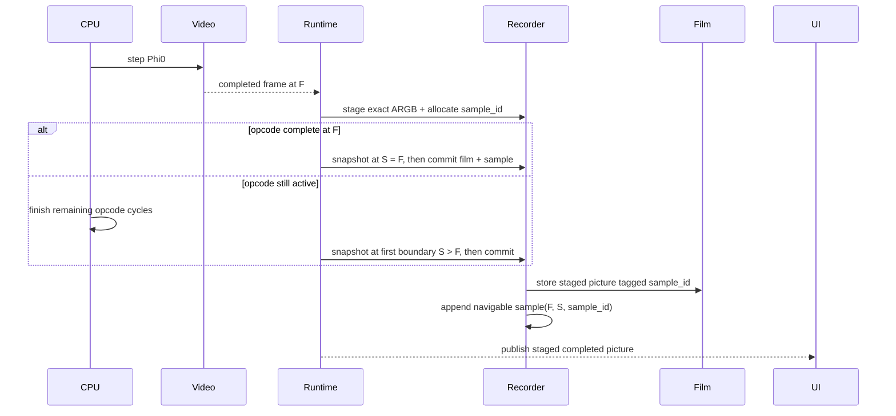
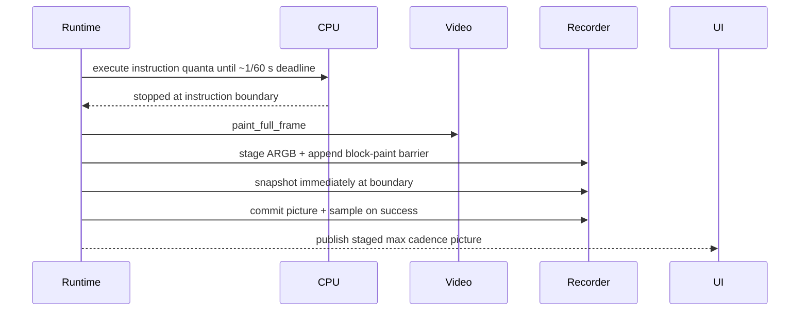

# Frame-aligned Inspector / TimeMachine

| Field | Value |
|-------|-------|
| **Author** | Codex (Designer) |
| **Date** | 2026-08-25 |
| **Status** | Landed |
| **Canonical path** | [`design/frame-aligned-inspector.md`](frame-aligned-inspector.md) |

---

## Overview

Redesign Inspector so its navigable timeline is an ordered sequence of real machine snapshots taken on the display cadence and explicitly paired with the picture that caused each snapshot.

In finite turbo, all live execution advances through one cycle-granular runtime helper. A completed beam frame at cycle `F` is consumed and copied before any later cycle can paint over it. The machine then finishes the current opcode and takes the snapshot at `S`, the first instruction boundary at or after `F`, before beginning the next opcode. The retained raster picture is the exact completed frame from `F`; the snapshot is the exact machine state at `S`.

In max turbo, each approximately 60 Hz wall-clock block presentation is already made after an instruction quantum and therefore creates its paired snapshot immediately at that instruction boundary.

The Inspector slider selects snapshots, not arbitrary cycles. `[-]` and `[+]` select the adjacent navigable snapshots. Pictures are associated by stable sample identity rather than nearest-cycle lookup. A retained historical picture always wins over repainting because it preserves raster effects. If its picture has been evicted, preview is pink while scrubbing and landing reconstructs the picture from a hidden predecessor anchor when possible.

Inspector entry adds a provisional `NOW` endpoint. Leaving restores `NOW` but retains it so Leave -> Enter without any intervening machine or timeline change reuses the same endpoint. The provisional endpoint is discarded as soon as live execution advances, the Apple state mutates, or the TimeMachine generation changes.

HST1 remains a separate instruction log. TimeMachine continues in max at the approximately 60 Hz presentation cadence; HST1 remains off in max by default because instruction-density cost is a different problem.

---

## Motivation

The current implementation has three independent notions of time:

1. Inspector checkpoints every 20,000 machine cycles.
2. The frame ring records published pictures with their machine cycle.
3. The slider selects an arbitrary point on a linear cycle range and lands on the nearest earlier checkpoint.

That independence produces behavior which is technically usable but does not match the visual purpose of TimeMachine:

- A retained picture is only joined by nearest cycle, not explicitly to the state selected by the UI.
- `[-]` and `[+]` search guest video boundaries by replay rather than navigating checkpoint entries.
- The slider may point between checkpoints.
- Landing publishes a new paint of machine RAM even when an exact historical raster picture exists.
- Stop, repaint, request-frame, and cadence publications all pass through the same frame-ring insertion path.
- Entering Inspector creates and destroys `NOW` on every Enter/Leave pair.
- Max mode wipes and disables all TimeMachine recording even though its presentation cadence naturally bounds snapshots to about 60 per wall-clock second.

The new model has one primary invariant:

> Every normal Inspector navigation stop is a real machine snapshot, normally created by and explicitly paired with one real presentation-cadence picture.

Arbitrary instruction/cycle focuses created by Forensics exact-land and sealed CPU stepping remain supported, but they are not slider stops.

---

## Goals

1. Create one navigable TimeMachine snapshot for each recorder-worthy display cadence.
2. In finite turbo, pair the completed frame at cycle `F` with the snapshot at the first opcode boundary `S >= F`.
3. In max turbo, pair each approximately 60 Hz block presentation with a snapshot at the already-reached instruction boundary.
4. Distinguish recorder-worthy canonical cadence presentation, canonical transition paint, and host-only CRT publication.
5. Make slider values resolve only to navigable snapshot entries.
6. Make `[-]` and `[+]` land on the immediately adjacent navigable snapshot whenever one exists.
7. Associate pictures by stable sample identity, not nearest-cycle lookup.
8. Prefer the retained historical picture exactly as presented, including raster effects.
9. Show pink while scrubbing a sample whose picture is unavailable; reconstruct its picture after landing.
10. Keep hidden recovery anchors out of the slider and `[-]/[+]` navigation.
11. Make `NOW` a provisional endpoint reusable across Leave/Re-enter while live state and timeline generation remain unchanged.
12. Preserve TimeMachine recording in max while keeping HST1 off in max by default.
13. Keep `.a2state` durable snapshot compatibility unchanged.
14. Preserve the runtime-worker ownership boundary: UI and control never receive an `apple2_t *`.

---

## Non-goals

- Reverse CPU execution.
- A write-delta history stream.
- Persisting Inspector history or provisional `NOW` to disk.
- Adding framebuffer data to `.a2state`.
- Making HST1 drive the slider or `[-]/[+]`.
- Branch/promote of inspected history into a new live timeline.
- Making every repaint, pause, request-frame, or memory edit a TimeMachine sample.
- Reconstructing an evicted finite raster picture from RAM alone and claiming it is exact.
- Changing the 560x192 ARGB display contract.
- Removing exact-cycle Forensics land or sealed F10-family Inspector stepping.

---

## Terminology

| Term | Meaning |
|------|---------|
| **Cadence picture** | A completed finite beam frame or one max block presentation. It is recorder-worthy. |
| **Host-only publish** | A CRT refresh caused by pause, request-frame, memory edit, Inspector landing, or monitor/override refresh. Full repaint uses scratch and is neither recorder-worthy nor canonical replay state. |
| **Transition paint** | The immediate max-entry block paint. It is canonical and replay-logged but non-navigable. |
| **Frame cycle (`F`)** | Machine cycle at which the cadence picture was captured/published. |
| **Snapshot cycle (`S`)** | Instruction-boundary cycle stored in the paired machine snapshot. Finite mode normally has `S >= F`; max normally has `S = F`. |
| **Navigable sample** | A permanent frame-aligned snapshot shown by the slider and `[-]/[+]`. |
| **Recovery anchor** | A hidden machine snapshot used as a deterministic replay source. It is never a slider stop. |
| **NOW** | A provisional, Inspector-session endpoint representing live machine state on entry. |
| **Exact focus** | A non-sample Inspector state produced by exact-cycle land or sealed CPU stepping. |

---

## Current architecture affected

| Area | Current behavior |
|------|------------------|
| `src/runtime/runtime_inspector_recorder.c` | Stores cycle-cadence checkpoints and a bounded input log. |
| `src/runtime/runtime_inspector.c` | Lands by cycle, creates/frees NOW per Inspector entry, replays to guest video boundaries for frame step. |
| `src/runtime/runtime_frame_ring.*` | Stores published ARGB pictures keyed by frame number and machine cycle. |
| `src/runtime/runtime_thread.c` | Routes cadence, transition, and host-only CRT updates through `runtime_publish_argb_frame`; max policy wipes TimeMachine. |
| `src/frontend/frontend.c` | Maps a 0-1000 slider linearly over cycles; preview requests nearest picture at or before a cycle. |
| `src/main.c` | During thumb drag copies a nearest-cycle film frame or submits the pink texture. |
| `src/runtime/runtime_event.h` | Has Inspector ID fields, but current machine-state publication fills them with zero. |
| `src/runtime/runtime_client.*` / `runtime_command.h` | Inspector land and frame-step commands are cycle/direction based. |
| `src/machine/apple2_snapshot.*` | Durable `A2ST` v2 machine blob without framebuffer data. No format change is needed. |

---

## Data model

### Navigable sample

The recorder owns an ordered ring of internal sample records:

```c
typedef enum runtime_inspector_sample_kind {
    RUNTIME_INSPECTOR_SAMPLE_FINITE_FRAME = 1,
    RUNTIME_INSPECTOR_SAMPLE_MAX_FRAME,
    RUNTIME_INSPECTOR_SAMPLE_NOW
} runtime_inspector_sample_kind;

typedef struct runtime_inspector_sample {
    uint64_t sample_id;       /* Stable, monotonically increasing; never a slot index. */
    uint64_t timeline_generation;
    uint64_t frame_cycle;     /* F: cadence picture capture. NOW uses its entry cycle. */
    uint64_t snapshot_cycle;  /* S: blob instruction boundary. */
    uint64_t frame_number;    /* Diagnostic metadata; not the join key. */
    uint64_t picture_id;      /* Exact picture key; normally equal to sample_id. */
    uint64_t frame_replay_watermark;    /* Last replay-event sequence visible at F. */
    uint64_t snapshot_replay_watermark; /* Last replay-event sequence incorporated at S. */
    uint8_t execution_mode;             /* FINITE or MAX at snapshot S. */
    runtime_inspector_sample_kind kind;
    uint8_t *blob;
    size_t blob_size;
} runtime_inspector_sample;
```

`sample_id` is the product join key between a navigable sample and its picture. `machine_cycle` remains useful for Forensics, diagnostics, bounds, and replay, but nearest-cycle picture selection is no longer used by the Inspector.

A sample's picture association remains valid even after the ARGB slab is evicted: exact picture lookup simply returns unavailable. The snapshot continues to be navigable.

### Recovery anchor

The recorder keeps one hidden predecessor snapshot before the oldest navigable permanent sample:

```c
typedef struct runtime_inspector_anchor {
    bool valid;
    uint64_t timeline_generation;
    uint64_t snapshot_cycle;
    uint64_t snapshot_replay_watermark;
    uint8_t execution_mode;
    uint8_t *blob;
    size_t blob_size;
    uint32_t *resume_framebuffer; /* Exact execution framebuffer at anchor cycle. */
} runtime_inspector_anchor;
```

The anchor has no `sample_id`, no picture, and no UI ordinal.

When recording starts, the first instruction-boundary snapshot becomes the hidden anchor. The first cadence picture after that creates the first navigable sample.

When checkpoint-budget eviction drops the oldest navigable sample, that sample's snapshot is promoted to the new hidden anchor and the previous anchor is freed. This preserves a predecessor from which the new oldest sample's missing picture can be reconstructed.

The memory invariant is:

```text
hidden predecessor anchor + one or more navigable samples
```

Inspector entry requires at least one navigable permanent sample. An anchor alone is not useful frame history and does not enable Inspect.

### Pending finite sample

Finite beam completion can happen during an opcode. The recorder therefore holds one pending association:

```c
typedef struct runtime_inspector_pending_frame {
    bool valid;
    uint64_t sample_id;
    uint64_t timeline_generation;
    uint64_t frame_cycle;
    uint64_t frame_number;
    uint64_t picture_id;
    uint64_t frame_replay_watermark;
    uint32_t pixels[RUNTIME_FRAME_RING_PIXELS]; /* Exact staged ARGB at F. */
} runtime_inspector_pending_frame;
```

At finite frame completion:

1. Allocate `sample_id`.
2. Copy the exact framebuffer into the pending staging slab before another video cycle executes.
3. Record the current monotonic replay-event watermark and pending metadata.
4. If already at an instruction boundary, take the snapshot immediately.
5. Otherwise finish normal execution of the current opcode.
6. At the first instruction completion, serialize the snapshot before the next opcode begins.
7. If serialization succeeds, commit sample metadata and the staged picture as one worker transaction, then expose the updated catalog.
8. Publish the staged cadence picture to the live host slot whether or not recording commit succeeds; a recorder failure must not blank or stall normal video.

"Atomic" here means the catalog never exposes a sample before its exact picture has either been inserted under `picture_id` or explicitly marked unavailable (for example, picture budget zero). The frame-ring mutex and recorder/catalog mutexes need not become one global lock: the worker performs frame insertion, sample append, then catalog publication in that fixed order. If snapshot serialization fails, no sample is appended and the staged picture is published live only, without an Inspector ID.

A 6502/65C02 opcode is far shorter than an Apple video frame, so a second finite cadence cannot legitimately arrive while one pending sample waits for its instruction boundary. Treat this as an asserted invariant in debug builds and a recorder error in release builds; do not silently replace the older pending sample.

### Provisional NOW

Runtime-owned provisional NOW state contains:

```c
typedef struct runtime_inspector_now {
    bool valid;
    bool aliases_sample;
    uint64_t endpoint_id;            /* Stable across unchanged Leave/Re-enter. */
    uint64_t aliased_sample_id;
    uint64_t machine_generation;
    uint64_t timeline_generation;
    uint64_t presentation_generation;
    uint64_t replay_watermark;
    uint64_t cycle;
    uint32_t live_turbo_value;
    uint8_t execution_mode;
    uint8_t *blob;                   /* Always independently owned by NOW. */
    size_t blob_size;
    uint64_t picture_source_id;      /* Immediate preceding sample only. */
    uint32_t *generated_picture;     /* Optional ephemeral 560x192 ARGB cache. */
    uint32_t *resume_framebuffer;    /* Exact live beam buffer at NOW for Leave. */
} runtime_inspector_now;
```

NOW is outside the permanent checkpoint and frame-ring budgets. At most one exists. It never stores a recorder-slot/blob pointer: even when its catalog endpoint aliases a permanent sample, NOW owns an independent machine blob and resume framebuffer.

If Inspector entry state exactly matches the newest permanent sample's snapshot cycle and generation, NOW aliases that sample's identity for navigation and does not create a duplicate slider entry. Restore never depends on that sample remaining allocated. Otherwise NOW appears as the final provisional navigable endpoint.

---

## Frame and snapshot capture

### Recorder-worthy cadence publication

Refactor publication into two explicit classes rather than inferring intent inside the common ARGB copy function:

```c
typedef enum runtime_frame_publish_kind {
    RUNTIME_FRAME_PUBLISH_HOST_ONLY = 0,
    RUNTIME_FRAME_PUBLISH_FINITE_CADENCE_CANONICAL,
    RUNTIME_FRAME_PUBLISH_MAX_CADENCE_CANONICAL,
    RUNTIME_FRAME_PUBLISH_TRANSITION_CANONICAL
} runtime_frame_publish_kind;
```

The common host-slot publisher still copies ARGB and emits `RUNTIME_EVENT_FRAME_READY`, but only cadence wrappers notify TimeMachine and insert an Inspector-associated frame-ring entry.

Normative classification:

| Source | Classification | Canonical framebuffer mutation | Creates sample? |
|--------|----------------|--------------------------------|-----------------|
| `apple2_video_take_frame_ready` in finite live execution | Finite cadence | Beam paint is canonical | Yes |
| End of `runtime_free_run_max_quantum` after block paint | Max cadence | Canonical and replay-barrier logged | Yes |
| Immediate block paint when switching into max | Transition | Canonical and `ENTER_MAX`-barrier logged | No |
| Pause/step/breakpoint stop-path full repaint | Host-only | No; paint scratch | No |
| `RUNTIME_COMMAND_REQUEST_FRAME` full repaint | Host-only | No; paint scratch | No |
| Paused memory edit repaint | Host-only | No; mutation still cuts/re-anchors | No |
| Inspector enter/land/step head publish | Host-only presentation | No, except explicit resume-framebuffer repair | No |
| Inspector-internal snapshot-load repaint | Repair immediately | Overwrite with exact resume framebuffer before execution | No |
| Monitor/override/config refresh | Host-only | No; paint scratch | No |

The runtime must audit all `runtime_publish_argb_frame` callers and make the classification explicit. This prevents UI activity from manufacturing TimeMachine history or silently changing the framebuffer from which replay continues.

### Canonical framebuffer versus host-only presentation

`m->video.fb` is canonical replay state. Finite beam cycles, logged max cadence block paints, and the logged max-entry transition paint may mutate it. A request to show a coherent full-RAM picture for debugger/UI purposes must not.

Add an explicit-destination machine paint API, illustratively:

```c
bool apple2_video_paint_full_frame_to(
    apple2_t *m,
    uint32_t *dst,
    size_t dst_pixels);
```

Contract:

- Read RAM, soft switches, monitor/phosphor, and display Override exactly as `apple2_video_paint_full_frame` does.
- Write only `dst[0..560*192)`.
- Do not change `m->video.fb`, beam H/V, `frame_number`, `frame_gen`, `frame_ready`, floating-bus latch, or paint enable.
- Require the runtime worker; do not publish/callback while the painter is active.

This is a bounded refactor of the current painter: `apple2_video_paint_full_frame` already centralizes a full scan over paint helpers which target `m->video.fb`. The implementation may thread an explicit destination through those helpers, or use a private save/swap/restore of the framebuffer pointer entirely inside the worker call. The public contract is that canonical pixels and video state are unchanged on return.

Runtime owns one reusable `560x192` `presentation_scratch` slab. Add a source-explicit publisher such as:

```c
void runtime_publish_argb_pixels(
    runtime *rt,
    const uint32_t *pixels,
    runtime_frame_publish_kind kind);
```

Host-only full repaint flow:

1. Paint into `presentation_scratch` with `apple2_video_paint_full_frame_to`.
2. Publish those pixels to the latest host frame slot/event.
3. Do not copy them into `m->video.fb`.
4. Do not add a replay barrier, frame-ring picture, navigable sample, or film entry.

If the canonical beam framebuffer is already the intended stop picture (finite pause with Override off and paint trustworthy), publish it directly without either a scratch paint or mutation.

Normative callers of the scratch path are pause/request-frame when a block image is required, paused memory-edit refresh, monitor/phosphor and display-Override refresh, and best-effort Inspector host presentation. Live state mutations such as memory edits still cut/re-anchor under the existing policy; scratch painting changes only what the host sees, not that mutation policy.

Max cadence and max-entry transition paints are intentionally different: they continue to use canonical `apple2_video_paint_full_frame`, are represented by ordered replay barriers, and therefore seed later max->finite framebuffer continuity.

### Inspector snapshot-load repair

A2ST load may run the existing post-load full repaint into `m->video.fb`. Treat that framebuffer as non-authoritative for Inspector replay:

1. Before any inspected cycle/instruction executes after loading a recovery anchor, overwrite `m->video.fb` with the anchor's saved exact resume framebuffer and restore its historical execution mode/watermark.
2. Before any inspected cycle/instruction executes after loading a finite sample, overwrite `m->video.fb` with the reconstructed exact resume framebuffer at `S`.
3. For a max sample, overwrite it with the canonical block-paint resume framebuffer established by replay barriers (or deterministic block reconstruction).
4. NOW restore likewise copies its independently saved live resume framebuffer after blob load.

Only after repair may sealed exact land/F10/F12 advance. If exact resume repair fails, run one canonical best-effort block paint, mark raster continuation best-effort, and report the existing soft reconstruction diagnostic; never unknowingly execute from snapshot-load paint.

### Finite beam flow



The opcode is not re-run and no following opcode may begin before the paired snapshot is taken.

### Normative finite cycle helper

Finite live execution must not use `apple2_step_instruction` followed by `runtime_maybe_frame`: that can observe `frame_ready` only after later cycles in the same instruction have already painted into the new frame. Every finite path instead advances through one runtime helper, illustratively:

```c
bool runtime_advance_live_finite_cycle(runtime *rt)
{
    /* Apply replay/live events whose boundary is before this next cycle. */
    runtime_apply_inputs_before_next_cycle(rt);

    if (!apple2_step_cycle(&rt->machine)) {
        return false;
    }

    /* Must happen before any subsequent apple2_step_cycle. */
    if (apple2_video_take_frame_ready(&rt->machine)) {
        runtime_inspector_stage_finite_cadence(rt);
    }

    runtime_produce_audio(rt, 1u);
    runtime_type_script_tick(rt, 1u); /* May append later same-cycle input seqs. */

    if (rt->machine.instruction_complete) {
        /* Commit pending snapshot before any next opcode begins. */
        runtime_inspector_on_instruction_boundary(rt);
    }
    return true;
}
```

Exact helper decomposition may differ, but this ordering is normative:

1. Advance exactly one finite machine cycle.
2. Consume and stage `frame_ready` immediately at `F`, before any next paint cycle.
3. Process ordered post-cycle runtime input producers.
4. If the opcode completed, serialize/commit the pending sample at `S`.
5. Only then may execution begin another opcode.

The implementation must audit and convert every finite instruction-oriented or boundary-finishing path:

| Current path | Required change |
|--------------|-----------------|
| `runtime_exec_step_instruction` | Loop on the common finite cycle helper until one instruction completes. |
| `RUNTIME_COMMAND_RUN_INSTRUCTIONS` | Count instruction completions produced by the common cycle helper; do not call `apple2_step_instruction`. |
| Nested step-over, step-out, and run-to-cursor | Use the converted `runtime_exec_step_instruction`/cycle helper only. |
| Normal finite free-run batch | Use the same helper rather than duplicating frame/boundary ordering. |
| Pause and Inspector-enter `runtime_finish_to_instruction_boundary` | Finish through the helper so a crossed `F` is captured and its `S` committed. |
| Savestate `runtime_finish_pending_state_snapshot_instruction` | Finish through the helper for the same reason; durable save begins only after pending Inspector commit. |
| Other finite cycle/instruction commands | Route through the helper or explicitly prove they cannot execute live machine cycles. |

Max remains the documented instruction-quantized exception because it does not use beam paint and samples only after the quantum returns at an instruction boundary.

### Max flow



Max's guest `frame_number` and beam/A-lite counters remain metadata. The sampling trigger is the actual block presentation, not every emulated guest video-frame interval crossed during free-run.

Snapshot creation remains bounded at approximately 60 per wall-clock second regardless of guest instruction throughput.

Max sample commit is transactional in the same sense as finite commit:

1. End the max quantum at an instruction boundary.
2. Block-paint once and stage the exact ARGB picture.
3. Append a `MAX_BLOCK_PAINT` replay barrier at that boundary.
4. Serialize the sample snapshot.
5. On success, insert the staged picture (or mark it unavailable), append the sample, and only then publish the catalog update.
6. Publish the staged live picture regardless of snapshot success.

Pictures remain staged outside the frame ring until snapshot success. If serialization fails, the `MAX_BLOCK_PAINT` barrier is still retained because the live block paint changed the framebuffer from which later finite raster execution may continue, but there is no navigable sample or Inspector picture ID for that failed capture.

### Finite/max transition replay barriers

Turbo/execution mode is runtime policy and is not serialized by A2ST. Preserve one continuous TimeMachine window across finite/max changes by recording mode transitions in the same monotonic replay-event stream as input. Finite MHz-to-MHz changes need no event because they alter host pacing only; finite/max changes alter guest video evolution and require barriers.

```c
typedef enum runtime_inspector_replay_event_kind {
    RUNTIME_INSPECTOR_REPLAY_INPUT = 1,
    RUNTIME_INSPECTOR_REPLAY_ENTER_MAX,
    RUNTIME_INSPECTOR_REPLAY_MAX_BLOCK_PAINT,
    RUNTIME_INSPECTOR_REPLAY_LEAVE_MAX
} runtime_inspector_replay_event_kind;

typedef struct runtime_inspector_replay_event {
    uint64_t sequence;
    uint64_t boundary_cycle;
    uint64_t sample_id; /* MAX_BLOCK_PAINT association, or 0. */
    uint8_t kind;
    uint8_t input_kind;
    uint8_t a, b, c;
} runtime_inspector_replay_event;
```

All transition events occur at instruction boundaries and share sequence ordering with same-cycle input events.

#### Enter max

Before changing policy:

1. Finish the current finite opcode through the common cycle helper, including any pending finite frame/sample commit.
2. Consume/assert-clear any finite `video.frame_ready`; no undispatched finite frame may cross the barrier.
3. Append `ENTER_MAX` at the current boundary cycle.
4. Apply the live max policy: disable beam paint/A-lite execution mode, reset max presentation pacing state, and perform the existing immediate full-frame block paint as a canonical transition paint.

Replay of `ENTER_MAX` performs the same mode switch and immediate block paint at the same ordered boundary. That transition paint is a replay barrier but not a navigable sample.

#### While max

Replay advances complete instructions with the max path (`apple2_step_instruction_max` / A-lite), applies ordered inputs at their recorded boundaries, and applies every recorded `MAX_BLOCK_PAINT` barrier at its boundary cycle. Navigable max samples are a subset of those barriers whose transactional snapshot succeeded.

Max sample and anchor metadata records `execution_mode = MAX`. Max sample targets are instruction boundaries. Forensics `Land exact` inside a historical max segment can return exact only at a reachable max instruction boundary. If the requested cycle falls inside an instruction, preserve the existing best-effort/partial contract: stop at the preceding reachable boundary, return partial rather than claiming exact, and leave focus honest.

#### Leave max

At the current max instruction boundary:

1. Append `LEAVE_MAX` before any finite cycle executes.
2. Consume all pending `video.frame_ready` state produced by A-lite/max guest-frame crossings.
3. Apply `apple2_video_reseed_from_cycles` and enable finite beam paint.
4. Consume/assert-clear `frame_ready` again after reseed.
5. Resume finite execution only through the common cycle helper.

"Consume all" is an explicit clear operation, illustratively:

```c
while (apple2_video_take_frame_ready(&rt->machine)) {
    /* stale max/A-lite readiness is not a finite cadence publish */
}
```

Run it at both drain points even if the current implementation exposes only a one-bit latch; this keeps the transition rule correct if readiness later becomes counted.

Replay performs the same ordered drain, reseed, and mode switch. The framebuffer at max exit remains the most recent block paint (immediate max-entry paint or a later `MAX_BLOCK_PAINT`) until finite beam cycles replace cells. Explicit draining guarantees that the first finite cadence sample after max is caused by the next genuine finite beam completion, not a stale max/A-lite flag.

#### Landing and sealed execution

The recovery anchor owns an exact resume framebuffer and an `execution_mode`, so replay never has to infer pre-anchor turbo state from A2ST. When a sample is evicted/promoted to the hidden anchor, materialize its exact `S` resume framebuffer before freeing the prior anchor, then store that framebuffer and mode with the promoted blob. Initial and post-media anchors copy the live framebuffer/mode directly and charge that one recovery slab to `inspector_memory_mb`.

Landing sets an Inspector replay-mode cursor from the target sample; it does not overwrite the user's current live turbo selection. Reconstruction and exact land apply replay events in sequence, selecting finite cycle stepping or max instruction/A-lite stepping at each barrier. Sealed F10/F12 execution uses the historical mode and barriers until live NOW is reached; restoring NOW returns to the actual live turbo policy. No finite/max transition alone cuts or clears TimeMachine history.

---

## Slider and navigation model

### Frozen Inspector catalog

Recording is paused while Inspecting, so the navigable catalog is frozen for that Inspector visit. The runtime publishes a small UI-safe catalog containing only metadata:

```c
typedef struct runtime_inspector_sample_meta {
    uint64_t sample_id;
    uint64_t frame_cycle;
    uint64_t snapshot_cycle;
    uint64_t picture_id;
    uint64_t frame_replay_watermark;
    uint64_t snapshot_replay_watermark;
    uint8_t execution_mode;
    uint8_t kind;
    uint8_t picture_available;
} runtime_inspector_sample_meta;
```

The catalog includes permanent navigable samples and the provisional NOW endpoint when it is distinct. It excludes hidden anchors.

The worker owns and updates the authoritative recorder. A mutexed copied catalog is exposed through `runtime_client`; the UI never reads mutable recorder storage directly. This matches the existing copied-frame/debug-memory patterns and avoids a live machine pointer crossing threads.

### Slider mapping

The catalog states are normative:

- `N = 0`: no slider and Inspect is unavailable.
- `N = 1`: show a disabled slider at tick 0; both `[-]` and `[+]` are disabled.
- `N >= 2`: use the mapping below.

For `N >= 2`, let:

- `N` be catalog sample count.
- `M = min(N - 1, 1000)` be the slider maximum.

Mapping slider tick `t` to catalog ordinal:

```text
ordinal = floor(t * (N - 1) / M)
```

When `N <= 1001`, every slider tick is exactly one sample. When `N > 1001`, a slider tick skips one or more samples, but never targets a point between samples.

The inverse mapping chooses the tick whose forward-mapped ordinal has minimum absolute distance from the focused ordinal. If two ticks are equally close, choose the larger tick (toward newer/right). For `N <= 1001`, inverse mapping is exact. For `N > 1001`, an adjacent `[-]/[+]` focus may be one of the samples skipped by all slider notches; the thumb then shows the nearest representable tick while `Snapshot X of N` reports the exact focus.

Implement both directions with quotient/remainder arithmetic (or checked multiplication) so `t * (N - 1)` and `ordinal * M` cannot overflow `uint64_t`. Never evaluate the `N >= 2` formula for `N = 0` or `N = 1`.

The UI should display `Snapshot X of N` in addition to the current cycle. Cycle remains useful forensic information, but it no longer defines slider resolution.

### `[-]` and `[+]`

For a sample focus:

- `[-]` selects catalog ordinal `index - 1`.
- `[+]` selects catalog ordinal `index + 1`.

For a non-sample exact focus produced by Forensics or sealed CPU stepping:

- `[-]` selects the nearest navigable sample with `snapshot_cycle < focus_cycle`.
- `[+]` selects the nearest navigable sample with `snapshot_cycle > focus_cycle`.
- If cycles are equal, stable sample identity/order breaks the tie.

Buttons are enabled only when such a destination exists. A valid click lands on that exact destination sample; it does not replay until a guest frame-ready flag.

Rename internal/client APIs from "frame step" to "sample step" or "snapshot step." Existing frontend intent names may be migrated in the same change because this is an internal C API, but user-facing buttons remain `-` and `+`.

### Cycle land compatibility

Keep both existing Forensics behaviors:

- **Land before:** select the newest navigable sample whose snapshot cycle is at or before the requested cycle. Hidden anchors are never candidates.
- **Land exact:** load a predecessor and sealed-reexecute to the requested cycle, producing an exact focus not present in the slider catalog.

F10/F11/Shift+F10/F12 time-travel execution likewise produces an exact focus when it stops between samples. This does not add a snapshot or modify the catalog.

---

## Picture behavior

### Exact association

Extend `runtime_ring_frame` with the stable picture/sample identity and exact lookup:

```c
uint64_t inspector_picture_id; /* 0 for non-Inspector/general entries */
```

Add:

```c
bool runtime_frame_ring_copy_by_picture_id(...);
bool runtime_frame_ring_drop_before_picture_id(...);
```

The Inspector must not call `runtime_frame_ring_copy_by_cycle` for scrub preview or sample landing. Nearest-cycle lookup can remain for non-Inspector callers if still useful.

### Scrub preview

While the mouse holds the slider thumb:

1. Resolve the slider tick to one catalog sample.
2. Request that sample's exact associated picture.
3. If retained, display it.
4. If unavailable, display the existing solid pink texture.
5. Do not move or reconstruct the Apple while the thumb is down.

For provisional NOW, the exact picture request resolves either:

- the immediate predecessor sample's retained picture, or
- the cached ephemeral NOW picture generated at entry.

Do not search farther backward for "some" picture. An older picture more than one sample away is not an honest representation of NOW.

### Landing with a retained picture

Landing a normal sample:

1. Reconstruct the finite beam framebuffer through `S` from the hidden/immediate predecessor using ordered sealed replay, or use the max block path for a max sample.
2. Preserve that ephemeral resume framebuffer.
3. Load the sample's exact machine snapshot blob for authoritative CPU/peripheral state.
4. Seed `rt->machine.video.fb` with the reconstructed resume framebuffer at `S`.
5. Reapply Inspector replay seal/hooks and set CPU/memory focus.
6. Publish the retained historical picture from `F` to the host display.
7. Do not overwrite the host display with `apple2_video_paint_full_frame`.

The historical picture is presentation truth even when RAM/soft-switch repaint would differ because of raster effects. The separate internal resume framebuffer is execution truth at `S`: A2ST does not contain framebuffer bytes, and the completed picture at `F` is missing any new-frame pixels painted during `F < cycle <= S`. Sealed F10/F12 execution after landing must start from the reconstructed `S` framebuffer, not from snapshot-load block paint and not merely from picture `F`.

The reconstruction span is at most the interval from the hidden/immediately preceding sample to this sample (normally one presentation frame). It may be performed during land for a simple invariant, or lazily before the first sealed execution, provided no sealed cycle runs with an unseeded framebuffer. Preference: perform it during land and surface one completion.

Publishing an Inspector picture to the normal latest-frame host slot is host-only and must not reinsert it into the frame ring or replace canonical `m->video.fb`.

### Landing with an evicted finite picture

If the exact picture is unavailable:

1. Preview stays pink until release.
2. Use the hidden anchor or immediately preceding sample snapshot as a replay source.
3. Load that predecessor into the one runtime-owned `apple2_t`.
4. Reapply logged inputs and sealed-reexecute with beam paint until the target sample's `frame_cycle` completes.
5. Copy the framebuffer exactly at that frame-ready boundary into an ephemeral historical-picture buffer.
6. Continue ordered replay through `S` and copy the exact resume framebuffer.
7. Load the target sample's exact snapshot blob to establish authoritative machine state at `snapshot_cycle`, then seed its framebuffer with the resume copy.
8. Publish the recovered historical picture.
9. Do not automatically insert it into the bounded frame ring; reconstruction must not evict an unrelated retained historical picture.

This is exact when the anchor, ordered replay-event log, media window, and deterministic replay remain valid.

If deterministic picture/resume replay cannot complete, fall back to `apple2_video_paint_full_frame` from the landed target state for both internal framebuffer and best-effort host picture. The machine landing remains valid, but subsequent raster continuity is best effort. A soft diagnostic may distinguish `reconstructed` from `generated`, but the first implementation need not add visible badges.

### Landing with an evicted max picture

Max pictures are full-frame block paints, not beam raster captures. Load the exact target snapshot and run `apple2_video_paint_full_frame`; this is the correct reconstruction path for max samples under current max presentation semantics.

### Exact-focus display

Forensics exact land and sealed CPU stops have no associated sample picture. Publish the existing stop-path result:

- trustworthy beam buffer when available;
- block paint when max/paint-off/override requires it.

They do not borrow a nearby sample picture.

### Current-presentation fallback caveat

Colour/mono/phosphor and debugger display Override are not machine-snapshotted historical presentation planes. A retained picture preserves exactly what was shown under the historical presentation. After those pixels are evicted, reconstruction uses the current monitor setting and, when active, the current display Override. This is a presentation fallback limitation and should be documented rather than addressed by changing `.a2state`.

---

## NOW lifecycle

### Creation

On Inspector Enter:

1. If running, finish the current opcode with normal cadence processing, then pause.
2. Require at least one permanent navigable sample.
3. Compare current instruction-boundary state generation/cycle with the newest sample.
4. Always serialize an independently owned ephemeral NOW blob and copy the current live framebuffer, replay watermark, execution mode, and active live turbo value for later restoration.
5. If it is exactly the newest sample state, alias only the catalog identity and do not add a duplicate catalog entry; do not borrow the sample's blob allocation.
6. Otherwise append NOW as the final provisional catalog endpoint.
7. Stop TimeMachine recording while the runtime machine is replaced by inspected history.
8. Select NOW initially.

NOW's picture rule:

- Reuse only the picture associated with the immediately preceding permanent sample.
- If that picture is unavailable, reconstruct that immediate sample's picture where possible and cache it in NOW's ephemeral picture buffer.
- Never search backward through older retained pictures.
- If reconstruction is impossible, generate a block-painted picture from NOW and cache it.

This implements "show the last picture we had; if there is no adjacent picture, generate one."

### Leave

On Leave Inspector:

1. Restore the independently owned provisional NOW blob.
2. Restore its saved live resume framebuffer so raster continuity is not replaced by snapshot-load block paint.
3. Restore the saved live turbo/execution policy (without emitting a historical transition event), remove replay seal, and reattach live callbacks.
4. Stay paused.
5. Set mode to live.
6. Keep provisional NOW state, endpoint identity, and cached picture allocated.
7. Resume TimeMachine hooks without taking an immediate permanent checkpoint.

Thus Enter -> Leave -> Enter with no intervening change reuses the same NOW endpoint and does not create history.

### Re-entry

Reuse provisional NOW only if all are unchanged:

- Apple live-state generation;
- TimeMachine timeline generation;
- instruction-boundary machine cycle;
- recorder window identity.

Otherwise discard it and create a new NOW.

No NOW alias contains a recorder slot or blob pointer. Every sample-removal, budget-eviction, clear, cut, or generation-transition path invalidates provisional NOW before freeing affected samples. Even if a defensive lookup finds an alias ID missing, restore remains safe from NOW's independent blob; re-entry treats the missing catalog identity as a generation mismatch and creates a fresh endpoint rather than dereferencing or retargeting a ring slot.

Presentation settings have a separate generation. Colour/mono/phosphor, display Override, or another operation which repaints presentation without changing Apple machine state does not invalidate the NOW machine blob, endpoint identity, or canonical `resume_framebuffer`. It invalidates only host-picture caches such as `generated_picture`; on unchanged re-entry regenerate the NOW display picture into presentation scratch under the new generation. Retained historical sample pictures remain unchanged because they intentionally show what was presented historically.

### Invalidation

Discard provisional NOW and its cached picture on the first actual live change after Leave:

- a successfully executed live cycle/instruction;
- keyboard/gameport/input state mutation;
- successful RAM or register edit;
- successful binary load/assembly mutation;
- reset, state load, machine reconfiguration, or boot mutation;
- successful media mutation/cut;
- TimeMachine clear, disable/resume discontinuity, or generation transition.

Do not invalidate it for:

- Leave itself;
- Enter itself;
- pause without machine advancement;
- request-frame;
- incidental repaint which does not change presentation generation;
- breakpoint list edits;
- read-only RPCs;
- window/frontend changes.

Use a dedicated Apple-state generation plus TimeMachine generation. Do not reuse `history_mutation_generation`, because that counter also changes for commands which may not actually alter Apple state and is HST1 cursor-specific.

Generation changes should be recorded after a mutation succeeds or after at least one execution step actually advances, not merely when a command is queued.

---

## Recording start, gaps, and hidden anchors

### Record enabled mid-frame

When Record becomes enabled:

1. Arm input/media callbacks and frame capture.
2. If already at an instruction boundary, take the hidden recovery anchor immediately.
3. If mid-opcode, mark anchor pending and take it at the next instruction boundary.
4. Ignore any cadence picture crossed before the initial anchor is established.
5. The first later cadence picture creates the first navigable sample.

The hidden anchor is not shown in the slider and does not enable Inspect by itself.

### Record disabled and resumed

A recording gap cannot be replayed safely. Disabling Record stops capture and invalidates provisional NOW. Re-enabling creates a new TimeMachine generation/window with a fresh hidden anchor; it does not join new samples to old pre-gap history.

Whether old allocations are freed immediately or during re-enable is an implementation detail, but they must never appear as one navigable interval with the new generation.

---

## Ordered replay events

Machine cycle alone is not a sufficient replay key because multiple host/type/gameport events and a turbo transition may occur while `apple2_cycles()` has the same value. Inputs and finite/max barriers share the monotonic `runtime_inspector_replay_event.sequence` defined above.

```c
/* Input-shaped view of RUNTIME_INSPECTOR_REPLAY_INPUT. */
typedef struct runtime_inspector_input_event {
    uint64_t sequence;       /* Strictly increasing within a timeline generation. */
    uint64_t boundary_cycle; /* Machine is at this completed cycle when event applies. */
    uint8_t input_kind;
    uint8_t a, b, c;
} runtime_inspector_input_event;
```

An input logged at `boundary_cycle = C` applies after cycle `C` and before execution of cycle `C + 1`. Same-cycle events apply in ascending `sequence` order.

Store watermarks as follows:

- An anchor's `snapshot_replay_watermark` is the greatest event sequence already incorporated in its machine mode/framebuffer state.
- A sample's `frame_replay_watermark` is the greatest event sequence visible when exact picture `F` was staged, before post-cycle producers run.
- A sample's `snapshot_replay_watermark` is the greatest event sequence incorporated in blob/mode/resume state `S`.
- NOW stores the current snapshot watermark.

Replay from source snapshot/anchor watermark `Wsrc` uses the half-open sequence interval:

```text
Wsrc < replay_event.sequence <= Wtarget
```

Events are applied at their recorded cycle boundary and in sequence order. Picture reconstruction uses the target sample's `frame_replay_watermark`; replay to the target snapshot/resume framebuffer uses `snapshot_replay_watermark`. Input events mutate guest input state; transition/barrier events select finite versus max execution and reproduce framebuffer policy.

For Forensics exact land to cycle `C`, whose target is not a stored sample, use the canonical state after all retained events with `boundary_cycle <= C` have been applied, preserving sequence order. Stored sample/anchor watermarks always override this cycle-derived rule because they distinguish frame capture from later events at the same cycle.

### Replay-event overflow

Before overwriting oldest replay-event sequence `E`, verify that the retained recovery anchor has `snapshot_replay_watermark >= E`. If not, promote/drop navigable samples until the new hidden anchor's watermark is at least `E`. If no retained sample can provide that watermark, cut the TimeMachine window at the current safe instruction boundary and establish a fresh anchor; if that cannot be done, suspend new navigable samples until it can. Never discard `E` while exposing a sample whose replay interval still requires it.

Replay-event sequence may reset only when the TimeMachine generation changes. Pair comparisons with generation so wrap/reset cannot join unrelated events.

---

## Media cuts and other discontinuities

A successful guest media write or HostFS directory-change marker cuts the replay window because historical machine state refers to present-day external media bytes.

At a media cut:

1. Invalidate provisional NOW.
2. Discard the pending cadence association, if any.
3. Remove navigable samples and pictures which precede the cut.
4. On the first write which enters waiting, advance the TimeMachine generation/window marker. Further writes in the same pending burst do not repeatedly transition the timeline.
5. Increment `media_write_generation`, update the pending cut cycle/device to this latest successful write, and mark recording `waiting_for_media_anchor`; do not serialize an anchor yet.
6. Cadence pictures continue to publish live but are not committed as samples while waiting.
7. At a later coalesced cadence opportunity, first make the referenced backing media represent the complete write burst:
   - HostFS/write-through media is ready once its successful write callback returns.
   - Dirty Disk II media must pass the existing runtime-owned media flush before an anchor is accepted.
8. Suppress the normal housekeeping media callback while performing that flush so the flush itself does not create another cut.
9. Only after the backing operation succeeds, serialize the new hidden A2ST anchor at the current instruction boundary, including the current replay watermark/mode/resume framebuffer.
10. Resume navigable sampling at the next recorder-worthy cadence picture.

### Bounded write-burst coalescing

Do not attempt a Disk II flush/anchor once per byte. Track:

```c
uint64_t media_write_generation;
uint64_t media_generation_seen_at_last_cadence;
uint64_t media_flush_attempt_generation;
uint64_t media_quiet_candidate_generation;
bool waiting_for_media_anchor;
```

At each recorder-worthy cadence opportunity while waiting:

1. If `media_write_generation != media_generation_seen_at_last_cadence`, writes occurred during the just-ended presentation interval. Copy the generation into `media_generation_seen_at_last_cadence`, skip this picture/sample, and make no flush attempt.
2. If the generation is unchanged for a full presentation interval, the burst is cadence-quiet. Save it as `media_quiet_candidate_generation`; because finite `F` may be mid-opcode, defer the actual operation to the first following instruction boundary.
3. At that boundary, attempt at most one backing flush and anchor only if the current generation still equals the candidate. A newer write cancels the candidate and restarts quiet observation.
4. If flush fails, remain waiting and retry no more than once at a later cadence opportunity. Do not busy-loop at instruction boundaries.

Thus a sustained multi-byte write burst causes zero per-byte flushes. After the last write, one cadence observes the final generation and a later unchanged cadence is the earliest normal flush/anchor attempt. An explicit device write-complete/quiet signal may permit the same single attempt sooner, but v1 need not add one; the cadence-quiet rule is sufficient and source-independent.

The A2ST blob continues to reference media paths and does not gain embedded media bytes. Therefore an unflushed dirty Disk II state is never accepted as a recovery anchor. If flush fails, live emulation and display continue, but TimeMachine remains in `waiting_for_media_anchor`, skips new samples, reports a soft recorder/media error once, and retries only at later safe boundary/cadence opportunities. It must not expose an unsafe post-cut window or fall back to a pre-cut anchor.

Repeated guest writes before a safe anchor replace the pending cut point and keep recording suspended. This can skip more than one presentation during a sustained write burst; correctness is preferred to an apparent history window backed by stale media bytes. Once one coalesced flush succeeds, the latest post-write state (including all writes in the burst) becomes the hidden anchor and normal frame cadence resumes.

This uses the existing media flush implementation and does not change durable A2ST. The flush writes bytes the guest has already successfully changed; it is a checkpoint-readiness operation on the runtime worker, not a new user-visible media mutation.

Reset, durable state load, model/card power-cycle reconfiguration, and similar timeline replacements clear the old TimeMachine window and establish a fresh hidden anchor when recording remains enabled.

Paused memory/register edits, binary loads, and assembly writes are not in the normal replay-event log. They must either use the same cut-and-anchor path or fully invalidate the previous window. The smaller safe design is to cut and create a fresh hidden anchor, yielding one contiguous post-mutation interval.

The Inspector window is now derived from TimeMachine samples alone. It must not be intersected with HST1 or the frame-ring cycle bounds:

- HST1 may be disabled while TimeMachine remains valid.
- Pictures may be evicted while snapshots remain valid.
- The replay-event log and recovery-anchor coverage determine replayability.

---

## Budget and eviction policy

### Separate budgets remain

Keep existing configuration surfaces:

- `inspector_memory_mb`: internal snapshot/anchor budget.
- `frame_ring_memory_mb`: ARGB picture budget.
- `history_memory_mb`: HST1 budget.

The durable machine blob remains roughly 160-180 KiB. A 560x192 ARGB picture is about 420 KiB. Separate eviction is intentional: the TimeMachine can retain more navigable state than exact pictures, with reconstruction as the fallback.

### Snapshot eviction

On adding a sample:

1. Reserve enough budget for the new sample while maintaining one predecessor anchor blob plus its single exact resume-framebuffer slab.
2. If over budget, repeatedly:
   - materialize the oldest navigable sample's exact `S` resume framebuffer and execution mode using the old anchor;
   - free the old hidden anchor;
   - promote the oldest navigable sample's blob, replay watermark, mode, and materialized framebuffer to the new hidden anchor;
   - remove that sample from navigation.
3. Drop input records older than the retained anchor.
4. Drop pictures belonging only to no-longer-navigable samples.

Do not retain internal recovery state beyond `inspector_memory_mb`. If one anchor blob/framebuffer plus one sample cannot fit, leave Inspector history unavailable and report a recorder-budget error rather than silently violating the budget or exposing an unreconstructable window. Existing valid nonzero configuration minima make this an exceptional/corrupt-size case.

### Replay-event eviction

The replay-event log is part of correctness. Apply the sequence-watermark policy in **Ordered replay events**: if capacity would overwrite an event whose sequence is newer than the hidden anchor watermark, advance the window by promoting/dropping samples until the retained anchor incorporates that sequence, or cut to a fresh safe anchor. Do not compare cycle alone and do not silently retain samples whose reconstructed pictures, resume framebuffer, execution mode, or exact-cycle replay still requires the event.

A later implementation may fold input bytes into the Inspector memory accounting, but this design does not require a new user-facing budget.

### Picture eviction

Pictures remain FIFO under `frame_ring_memory_mb`. Evicting a picture does not evict its navigable sample. Catalog metadata reports that the association exists but the slab is unavailable, producing pink preview and landed reconstruction. Finite and max pictures are staged outside the ring and inserted only after snapshot success.

---

## Max mode and HST1

### TimeMachine

Remove the current policy which disables Record, wipes checkpoints, clears film, and locks the Record checkbox on entry to max.

With Record enabled:

- TimeMachine input/media logging remains active.
- Each max block presentation creates one navigable sample.
- The paired picture is exactly the block-painted image shown to the user.
- Snapshot rate is approximately 60 per wall-clock second.
- Leaving max does not clear or restart the TimeMachine window solely because turbo changed.

A finite-to-max or max-to-finite transition may produce samples with very different guest-cycle deltas. That is expected: slider order is sample order, not uniform guest time.

TimeMachine does not cut at these transitions. Ordered `ENTER_MAX`, `MAX_BLOCK_PAINT`, and `LEAVE_MAX` replay barriers preserve A-lite versus finite-beam evolution and framebuffer continuity even though A2ST does not serialize turbo mode.

### HST1

The existing `history_off_on_max` policy becomes HST1-only:

- Default true: detach/stop the dense CPU instruction observer while max is active.
- On leaving max, resume HST1 with its normal recorder-resume marker/epoch behavior.
- Do not call TimeMachine truncation from HST1 resume.
- `--no-history-off-on-max` continues to opt into dense HST1 recording in max.
- TimeMachine and frame sampling are unaffected by this option.

Retain the current INI/CLI spelling for compatibility, but update its help text and manual meaning to "pause CPU flight-recorder/HST1 while turbo is max." Internally, prefer names such as `hst1_off_on_max` and keep parsing aliases at the options boundary.

The Inspector UI no longer locks or disables Record in max. Its optional status rows may show HST1 paused independently from TimeMachine recording.

---

## Concurrency and API changes

### Ownership

- Runtime worker continues to own `apple2_t`, sample blobs, pending capture state, recovery anchor, and provisional NOW.
- Frame ring continues to protect ARGB slabs with its mutex.
- Add a mutexed copied Inspector catalog for UI/client read access.
- UI/control receive IDs, metadata, copied frames, and events only.

No live snapshot blob or recorder slot pointer crosses the runtime boundary.

### Proposed runtime interfaces

Names are illustrative; behavior is normative:

```c
/* Worker-only recording hooks. */
void runtime_inspector_on_finite_cadence_frame(
    runtime *rt,
    uint64_t frame_cycle,
    uint64_t frame_number,
    const uint32_t *pixels);

void runtime_inspector_on_max_cadence_frame(
    runtime *rt,
    uint64_t snapshot_cycle,
    uint64_t frame_number,
    const uint32_t *pixels);

void runtime_inspector_on_instruction_boundary(runtime *rt);
void runtime_inspector_on_execution_mode_transition(
    runtime *rt, bool entering_max, bool leaving_max);
void runtime_inspector_mark_live_advanced(runtime *rt);
void runtime_inspector_mark_live_mutated(runtime *rt);
void runtime_inspector_cut_window(runtime *rt, ...);

/* Worker command operations. */
bool runtime_inspector_land_sample(runtime *rt, uint64_t sample_id);
bool runtime_inspector_step_sample(runtime *rt, int direction);
```

Replace cycle-based slider land commands with stable `sample_id` land. Keep explicit cycle APIs for Forensics `Land before` and `Land exact`.

### Proposed client interfaces

```c
bool runtime_client_inspector_catalog_copy(
    runtime_client *client,
    runtime_inspector_catalog *out);

bool runtime_client_inspector_copy_picture(
    runtime_client *client,
    uint64_t picture_id,
    runtime_ring_frame *out);

bool runtime_client_inspector_land_sample(
    runtime_client *client,
    uint64_t sample_id,
    uint64_t request_token);

bool runtime_client_inspector_step_sample(
    runtime_client *client,
    int direction,
    uint64_t request_token);
```

The copied catalog should be bounded by actual snapshot capacity and can use a caller-owned fixed/dynamic buffer. Default budgets imply hundreds, not millions, of metadata entries.

### Events and machine snapshot

Populate and/or add:

- focused `sample_id` (`0` for exact focus);
- focused catalog ordinal;
- focus-is-sample flag;
- permanent sample count;
- catalog count including distinct NOW while Inspecting;
- oldest/newest sample IDs and snapshot cycles;
- TimeMachine generation;
- provisional-NOW identity where needed for UI refresh.

Existing `inspector_focus_id`, `inspector_oldest_id`, and `inspector_newest_id` are natural fields to activate rather than leaving zero.

State-change events for Inspector land remain unsolicited telemetry and must not complete unrelated token RPCs.

### Command coalescing

Slider releases now queue sample-ID lands. Existing latest-land coalescing remains appropriate. Leave/quit still preempt queued lands.

Because the Inspector catalog is frozen while Inspecting and IDs are stable, a queued sample land cannot retarget a different ring slot.

---

## Durable snapshot compatibility

No change to `src/machine/apple2_snapshot.c`, `A2ST` version 2, or `.a2state` files.

Inspector sample metadata, anchors, pictures, and NOW are runtime-only wrappers around the existing serialized machine blob. They are not written to durable state files.

Durable snapshot load continues to invalidate the TimeMachine generation because the cycle/media epoch changes. After load, recording establishes a fresh hidden anchor at an instruction boundary.

The existing snapshot omission of framebuffer and monitor/phosphor remains correct: exact historical pictures live in the bounded frame ring, not in the machine serialization format.

---

## Failure behavior

| Failure | Behavior |
|---------|----------|
| Exact picture evicted | Pink during scrub; reconstruct on land. |
| Finite reconstruction succeeds | Land exact snapshot state; show captured replay frame. |
| Finite reconstruction cannot complete | Land exact snapshot state; show best-effort full-frame paint and soft diagnostic. |
| Max picture evicted | Load snapshot and block-paint. |
| Snapshot serialization fails for cadence | Publish staged live picture, but insert no frame-ring picture/sample; retain a max block-paint replay barrier when applicable. |
| Snapshot load fails on land | Keep prior inspected focus if possible; emit runtime error; do not report successful land. |
| Initial anchor unavailable | Record stays armed but Inspect remains unavailable; expose budget/allocation warning. |
| Picture budget is zero | Samples still record; all previews pink; landing reconstructs. |
| HST1 budget is zero/off | No effect on TimeMachine validity. |
| Media cut during pending finite sample | Discard pending sample and start after post-cut anchor. |
| Dirty media cannot flush for post-cut anchor | Keep live emulation running; expose no new samples; retry safe anchor later and report one soft error. |
| NOW generation mismatch on re-entry | Discard old NOW and create a new endpoint. |
| NOW alias sample removed defensively | Independent NOW blob remains safe; invalidate alias identity and create fresh endpoint on re-entry. |
| Host presentation scratch unavailable | Never block-paint canonical as a substitute; publish trustworthy canonical beam pixels if applicable, otherwise retain the prior host picture and report a soft allocation error. |

`[-]` and `[+]` are guaranteed to land whenever a neighboring sample exists under normal valid-recorder operation. Hard allocation/blob corruption remains an error, not a reason to silently move elsewhere.

---

## User interface behavior

Inspector tab while live:

- `Record` stays available in finite and max.
- `Inspect` enables after at least one permanent frame sample.
- Window summary reports sample count and cycle span.
- Optional status distinguishes TimeMachine recording, pictures retained, and HST1 recording/paused.

Inspector tab while inspecting:

```text
[Leave Inspector]

[-] [ snapshot-indexed slider ] [+]

Snapshot: X of N
Current cycle: S
Frame cycle: F              (for frame samples)
History start cycle: ...
Duration: ...
```

Normative behavior:

- Thumb movement changes only preview sample.
- Exact associated picture appears immediately if retained.
- Pink appears for a missing picture.
- Release lands the selected sample and replaces pink with reconstructed/generated output.
- `[-]`/`[+]` land adjacent samples, including NOW when it is a distinct endpoint.
- Hidden anchors never affect slider count.
- If exact CPU/Forensics focus is between samples, slider rests on the nearest representable preceding tick while current-cycle text remains exact; the next `[-]`/`[+]` brackets that focus.
- Far right is NOW when distinct, otherwise the newest permanent sample.
- Leave restores NOW and stays paused.

All new on-screen strings remain ASCII-only.

---

## Implementation scope

Expected product-code files:

| Component | Expected changes |
|-----------|------------------|
| `src/machine/video.h/.c` | Explicit-destination full-frame scratch painter which preserves canonical video state. |
| `src/runtime/runtime_inspector.h` | Sample/catalog types and sample-ID APIs; remove cycle cadence constant. |
| `src/runtime/runtime_inspector_recorder.c` | Frame-pending capture, anchor/sample ring, budget promotion, media cuts, input coverage. |
| `src/runtime/runtime_inspector.c` | Sample landing/stepping, picture reconstruction, provisional NOW lifecycle, exact-focus compatibility. |
| `src/runtime/runtime_internal.h` | NOW generations, catalog slot, recorder state, reusable presentation scratch, HST1-only max policy fields. |
| `src/runtime/runtime_frame_ring.h/.c` | Picture/sample ID metadata and exact lookup/drop APIs. |
| `src/runtime/runtime_thread.c` | Canonical/host-only publish split, scratch ownership, common boundary hooks, max behavior, mutation invalidation, HST1-only max policy. |
| `src/runtime/runtime_command.h` | Land-sample command payload/API naming. |
| `src/runtime/runtime_client.h/.c` | Copied catalog, exact picture, sample land/step APIs. |
| `src/runtime/runtime_event.h` | Focus/sample count/generation metadata. |
| `src/frontend/frontend.h/.c` | Sample-index slider mapping, sample-ID intents, adjacent-step UI, status text. |
| `src/main.c` | Exact sample-picture preview instead of nearest-cycle lookup; pink fallback unchanged. |
| `src/app_options.*` | Compatibility wording/internal alias for HST1-only max policy. |
| `manual/manual.md` | New Inspector semantics, NOW, max/HST1 behavior, fallback honesty. |
| `agents/timemachine.md` | Landed invariants and updated flow. |
| `agents/runtime.md` | Max/HST1 and client surface. |
| `agents/frontend.md` | Snapshot-index UI behavior. |
| `agents/video.md` | Canonical cadence/transition versus host-only presentation contract. |
| `agents/snapshots.md` | Clarify unchanged durable format and runtime-only pictures. |
| `design/README.md` | Add this design as active; mark landed after implementation. |

No machine-layer framebuffer or snapshot-format change is expected.

---

## Test and verification plan

### Recorder unit/integration tests

Extend `runtime_inspector_replay` or add focused recorder tests:

1. Record enable at an instruction boundary creates one hidden anchor and zero navigable samples.
2. Record enable mid-opcode waits for the next instruction boundary.
3. A finite frame at `F` during an opcode creates a snapshot at the first boundary `S >= F`.
4. No next opcode executes before the snapshot at `S`.
5. A frame completing at an instruction boundary yields `S = F`.
6. `runtime_exec_step_instruction`, RUN_INSTRUCTIONS, nested step/run, pause/enter boundary finish, and savestate boundary finish all capture identical exact `F` through the common helper.
7. A test opcode which spans `F` proves staged ARGB is copied before cycle `F + 1` paints.
8. Snapshot failure publishes live video but commits neither sample nor Inspector picture; success exposes both together.
9. Every cadence picture gets a unique stable sample/picture ID.
10. Pause, request-frame, memory repaint, Inspector publish, and immediate max paint create no sample.
11. Snapshot eviction promotes the old oldest sample to hidden anchor.
12. Frame eviction does not evict its sample.
13. Same-cycle inputs replay in sequence order; frame and snapshot watermarks can differ at the same cycle.
14. Input overflow advances by sequence watermark instead of silently breaking replay.
15. Media cut discards pending frame, waits for successful backing flush, creates post-cut anchor, and exposes no hidden stop.
16. A sustained multi-byte Disk II write burst increments the pending generation for every byte, makes no per-byte flush attempts, attempts at most once after a full cadence-quiet interval, and produces an anchor whose backing image contains every byte in the burst.
17. Forced Disk II flush failure leaves the post-cut window unavailable and retries no more than once per later cadence opportunity; later success resumes safely.
18. Picture budget zero still records navigable samples.
19. HST1 unavailable does not invalidate the TimeMachine window.

### NOW tests

Extend `runtime_inspector_mode`:

1. Enter creates distinct NOW when live is between samples.
2. Enter aliases newest sample when state/cycle/generation coincide.
3. Leave restores NOW but does not free it.
4. Leave -> Enter without change reuses endpoint ID and blob/alias.
5. Pause/request-frame between Leave/Re-enter does not invalidate NOW.
6. First successfully executed live instruction invalidates NOW.
7. Keyboard/gameport, memory/register mutation, reset/load/config/media cut invalidate NOW.
8. Failed/no-op mutation does not spuriously preserve an unsafe NOW or report reuse.
9. `[-]` from NOW and `[+]` back to NOW land exact neighbor samples.
10. Evict/clear the aliased permanent sample after Leave; no pointer is retained and re-entry creates a safe new endpoint.
11. Presentation-only change reuses NOW machine identity, refreshes the host-picture cache, and preserves the canonical resume framebuffer.

### Navigation tests

1. `N=0` exposes no slider/Inspect; `N=1` exposes a disabled tick-zero slider without division.
2. Slider mapping visits every sample when `2 <= N <= 1001`.
3. Slider mapping skips only whole samples when `N > 1001`.
4. First and last slider positions map exactly to first sample and NOW/newest.
5. Inverse mapping ties choose newer/right and skipped `[-]/[+]` focus remains exact in status.
6. Overflow-safe mapping handles maximum retained counts/IDs.
7. `[-]/[+]` use adjacent catalog ordinal, not guest video replay.
8. From an exact focus, `[-]/[+]` select the bracketing samples.
9. Forensics Land before excludes hidden anchors.
10. Forensics Land exact remains exact and does not add a sample.
11. Queued/coalesced lands retain stable sample identity.

### Picture tests

1. Retained sample picture bytes are the same bytes published at cadence.
2. Landing with retained picture does not overwrite it with a block repaint.
3. Mid-frame PAGE2/TEXT/HIRES switch fixture proves retained raster picture wins over RAM repaint.
4. Missing-picture scrub reports unavailable so main/frontend displays pink.
5. Missing finite picture reconstructs from predecessor and matches the original captured raster bytes.
6. Oldest sample reconstructs from promoted hidden anchor.
7. Missing max picture matches block paint after snapshot load.
8. Failed reconstruction still leaves machine at exact target snapshot and publishes best-effort paint.
9. NOW uses only immediate predecessor picture and does not borrow an older retained image.
10. Landing a finite sample seeds the internal framebuffer at `S`; subsequent sealed stepping matches uninterrupted raster output.
11. Leave restores NOW's saved resume framebuffer rather than snapshot-load block paint.

### Max/HST1 tests

Update `runtime_inspector_replay`, `runtime_turbo`, and history tests:

1. Entering max leaves Inspector Record enabled and does not wipe samples or pictures.
2. Each explicit max presentation quantum adds exactly one sample.
3. Guest-cycle distance between max samples may vary without changing adjacency.
4. Default max policy pauses HST1 only.
5. Leaving max resumes HST1 without cutting TimeMachine.
6. `--no-history-off-on-max` records HST1 densely while TimeMachine cadence remains one sample per max presentation.
7. Record checkbox is not locked in max.
8. Finite -> max records an ordered enter barrier, reproduces the canonical non-navigable entry block paint, and does not cut the sample window.
9. Multiple max presentation barriers reconstruct the framebuffer even when an individual sample commit is forced to fail.
10. Max -> finite drains stale A-lite `frame_ready`, reseeds from cycles, and the first later sample comes only from a genuine finite beam completion.
11. Reconstruction across finite -> max -> finite matches uninterrupted CPU/video state and retained/reconstructed pictures.
12. Forensics exact land reports partial (not false exactness) for a target inside a historical max instruction; sample-boundary targets remain exact.
13. Sealed stepping follows historical execution-mode barriers and restores the actual live turbo policy only at NOW.

Avoid timing-fragile tests which sleep for exactly 1/60 second. Exercise the max presentation-quantum hook deterministically and keep one broad wall-rate smoke if useful.

### Canonical/scratch presentation tests

Extend `runtime_display_stop`, Inspector replay, and video block-paint coverage:

1. Run max through a canonical cadence paint, then trigger stop/request-frame scratch block paints, leave max, and sealed-step finite execution before the next completed beam frame. Canonical framebuffer bytes and later raster output must match an uninterrupted reference which never requested the host-only paints.
2. While paused, change monitor/phosphor and display Override so each requests a full scratch repaint; resume, exact-land, and reconstruct. Host pictures must reflect the requested presentation, while canonical resume framebuffer/reconstruction matches a reference with no canonical repaint mutation.
3. For every scratch caller and for non-navigable transition/barrier paints, assert that slider/catalog sample count and frame-ring Inspector picture count do not increase. A later successful max/finite cadence still adds exactly one sample and one optional film picture.

### Concurrency tests

1. Repeated catalog copies while Enter/Land/Leave commands execute never expose partial metadata.
2. Exact picture lookup during frame-ring wrap returns the requested ID or unavailable, never a different nearest picture.
3. Preview/leave command coalescing does not dereference recorder storage after mode exit.
4. Runtime thread remains the only serializer/loader of the product `apple2_t`.

### Full gate and performance

```bash
cmake -B build -DCMAKE_BUILD_TYPE=Debug
cmake --build build -j
ctest --test-dir build --output-on-failure
cmake --build build --target bench_realtime
./build/bench_realtime 2
```

Add a max-recording smoke measuring that snapshot production is bounded by presentation calls, not guest instruction count. Check finite real-time performance because frame-aligned snapshots occur at roughly the same rate as the old 20,000-cycle cadence. Check max throughput with HST1 default-off and TimeMachine enabled; snapshot serialization/copy cost is accepted but should be measured.

Manual visual verification:

1. Run a raster-effect demo with Record on.
2. Enter Inspector and scrub retained pictures.
3. Confirm pictures match what was originally displayed.
4. Reduce picture budget or force wrap; confirm pink while dragging and reconstructed picture after release.
5. Walk every sample with `[-]/[+]`.
6. Leave and re-enter without running; confirm same NOW.
7. Leave, execute one instruction, re-enter; confirm new NOW.
8. Repeat in max; confirm about one navigation sample per displayed max frame and Record remains active.

---

## Rollout

Implement behind the existing opt-in Inspector `Record` switch; no new feature flag is needed.

Recommended implementation order:

1. Add sample IDs, exact frame-ring lookup, explicit-destination scratch paint, and canonical/host-only publish classification with tests.
2. Replace cycle-cadence checkpoints with hidden anchor + pending frame-aligned samples and staged transactional pictures.
3. Add the ordered replay-event stream, finite/max barriers, anchor resume framebuffer, and cadence-coalesced media re-anchor policy.
4. Add copied catalog and sample-ID landing/stepping APIs.
5. Implement picture-priority landing and missing-picture reconstruction.
6. Implement provisional NOW generations and Leave/Re-enter reuse.
7. Change max policy to TimeMachine cadence plus HST1-only default pause.
8. Convert slider/preview UI to sample ordinals.
9. Update Forensics exact/before compatibility tests.
10. Update manual and `agents/*.md`.
11. Mark this design landed in `design/README.md`.

Keep the build and existing Inspector tests green after each stage where practical. This is a semantic replacement of current Inspector navigation, so old assertions about 20,000-cycle cadence, nearest-cycle film, frame-boundary replay stepping, max wipe, and freeing NOW on Leave must be deliberately rewritten rather than preserved.

---

## Assumptions and tradeoffs

1. A navigable sample represents the pair `(picture at F, state at S)`, where `S` is the first opcode boundary after `F`; this slight cycle difference is intentional and visible in metadata.
2. Inspector requires at least one permanent cadence sample. Hidden anchor + NOW alone does not constitute useful history.
3. A successful media cut skips cadence pictures until referenced media bytes are safely represented in backing storage and a post-cut anchor succeeds; sustained writes or flush failure can extend that gap.
4. Snapshot and picture budgets remain independent, so older samples commonly outlive their exact pictures.
5. Deterministic finite replay is the preferred missing-picture reconstruction. Full-RAM repaint is explicitly best effort.
6. Reconstructed pictures use the current monitor setting because monitor/phosphor is not snapshotted.
7. NOW is retained after Leave but is not permanent history and does not consume configured Inspector budget.
8. TimeMachine order is presentation/sample order, not uniform guest-cycle spacing; this is especially important across max.
9. The legacy `history_off_on_max` setting remains accepted but applies only to HST1 after this redesign.
10. Host-only repaints use explicit scratch, never mutate the canonical replay framebuffer, and never create samples even if their pixels differ from the most recent cadence picture.
11. Replay-event identity is `(timeline_generation, sequence)`, with cycle used for application timing rather than uniqueness.
12. Semantic NOW aliasing never aliases storage; the independently owned blob/framebuffer is a deliberate small ephemeral cost.
13. Finite/max transitions are replay barriers, not timeline cuts; finite MHz-to-MHz pacing changes require no machine replay metadata.
14. A post-media-write anchor waits for one full cadence interval with no newer write generation, bounding Disk II flush attempts independently of byte count.

---

## Acceptance criteria

The design is implemented when all of the following are true:

- Finite cadence frame publication and snapshot creation are paired, with the snapshot at the first following opcode boundary.
- Every finite live and boundary-finishing execution path consumes frame-ready cycle-by-cycle at exact `F` before later paint.
- Max creates one TimeMachine sample per approximately 60 Hz block presentation.
- Finite/max transitions replay with explicit ordered barriers; max-exit drains stale frame-ready state before finite cadence resumes.
- Slider positions always resolve to snapshots.
- `[-]/[+]` land adjacent snapshots.
- Retained exact pictures are shown on scrub and after land.
- Missing pictures show pink during scrub and reconstruct/generate only after land.
- Hidden anchors never appear in navigation.
- NOW survives unchanged Leave/Re-enter and is invalidated by actual live/timeline change.
- NOW owns its restore storage independently; presentation-only changes refresh its caches without inventing machine history.
- Host-only publications do not grow TimeMachine film or sample count.
- Host-only full repaints write scratch only; Inspector-internal snapshot loads repair canonical framebuffer state before any inspected execution.
- TimeMachine remains enabled in max while HST1 remains default-off there.
- HST1/frame-ring eviction no longer truncates snapshot navigation merely by cycle intersection.
- `.a2state` remains version-compatible and framebuffer-free.
- Same-cycle input events replay by monotonic sequence/watermarks, and unsafe post-media-cut anchors are never exposed before backing flush succeeds.
- Disk II write bursts coalesce to cadence-bounded flush/anchor attempts, with the final anchor representing all successful writes in the burst.
- Updated automated tests, manual, and agent handoff documentation describe the landed behavior.
