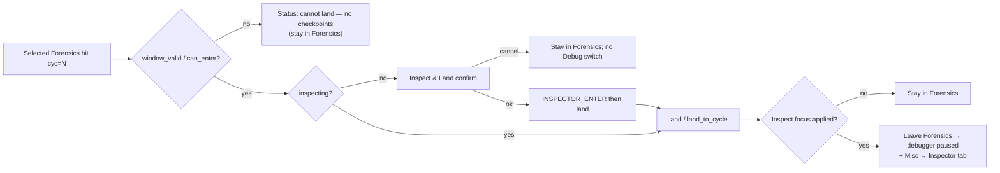

# Forensics UI (flight recorder / HST1 FIND)

| Field | Value |
|-------|-------|
| **Author** | swessels |
| **Date** | 2026-08-25 |
| **Status** | Draft (active) |
| **Canonical path** | [`design/forensics-ui.md`](forensics-ui.md) |
| **Origin** | Port of a2m `design/forensics-ui.md` (landed there); adapted for c64m |

---

## Overview

c64m already records a dense instruction/bus log (HST1) and exposes FIND over
the control port (`history-find` / `history-next` / `history-read`). That surface
is useful to scripts and `tools/c64_control_client.py`, but there is no
in-emulator debugger UI for forensic queries such as “who wrote `$22` to
`$D020`?”. The Inspector tab (Misc → Inspector) is a separate stream:
checkpoint-based time travel with a scrubber. Product invariant: HST1 is FIND,
not the slider (`agents/runtime-control.md`, `agents/frontend-debugger.md`).

This design adds a **full-window Forensics mode** (same class as the F9 debugger
layout — the whole client area, **not** a Help-style CRT overlay): a scrollback
transcript of FIND/READ results, a thin query line over the real history verbs,
a status strip, and a one-shot bridge to **Land Inspector at `machine_cycle`**.
Entering **pauses** the machine. **Opt+R / Close** return to the entry surface
(CRT may resume; debugger stays paused). **F9** and a **successful Land** both
leave to the debugger paused (and select Misc → Inspector when closing
Forensics). It does not drive the Inspector slider from HST1, does not embed
another crowded Misc tab, and only advertises query keys the live shared
find-option parser accepts.

**Naming:** The UI mode is **Forensics** (the act of investigating). The
underlying log remains the **CPU flight recorder** / HST1 — parallel to
**Inspector** (UI) vs TimeMachine (mechanism).

**c64m vs a2m (product):** Inspector Record does **not** arm or stop HST1 here.
Forensics talks to the flight recorder; Record stays Inspector-only. Do not
import a2m’s “enable Inspector arms HST1” coupling.

---

## Porting / process

Normative for implementing this design in c64m:

1. **Reuse a2m where it fits.** Lift shared parse, HST1 decode, Forensics view,
   main HISTORY claim path, and `land_to_cycle` patterns from the sibling tree.
   Adapt for c64m paths, naming (`runtime_inspector_in_inspect`, C64M/8), and
   the HST1/Inspector split above. Do not reinvent working code.
2. **Commit cadence.** At least one commit per PR-plan item below; more often
   when useful. **Update this design** (checklist ticks, notes) and
   [`design/README.md`](README.md) **before** each commit so progress is visible
   in the docs.
3. **Commit on `main`.** No feature branches unless there is a strong reason.
4. **Manual last.** When the feature is complete, update `manual/manual.md`
   (read `manual/HELP_MARKDOWN.md` first) and regen help. Intermediate PRs may
   update `agents/*.md` as behavior lands; the user-facing manual is one final
   pass.
5. **ASCII-only UI strings.** The debugger font does not support Unicode
   ellipses, arrows, etc. Status strip, Tab help, dialogs, and transcript chrome
   use ASCII only (`|`, `->`, `...`).

Duplicate find keys: **last wins** (same as a2m’s shared parser). Prefer lifting
`runtime_history_query_parse.*` over preserving c64m’s older reject-duplicates
control parse.

Companion query-line design: [`forensics-query-guide.md`](forensics-query-guide.md).

---

## Background & Motivation

### Current state

| Layer | Role today |
|-------|------------|
| `src/runtime/runtime_history.*` | Bounded arena recorder; `runtime_history_find` / `read` with full `runtime_history_query` (epoch, timeline, cycle, pc, address, access, value, opcodes, direction). |
| `src/runtime/runtime_history_wire.*` | HST1 **encode** only (24-byte header + 48-byte record headers + 8-byte accesses). **Decode for C UI is missing** — Python `Ctl.decode_hst1` in `tools/c64_control_client.py` exists. |
| `src/control/control_protocol.c` | Private `parse_history_find_options` (full key set; currently rejects duplicate keys). Must become a thin caller of shared parse (PR 1). |
| `tools/c64_control_client.py` | `decode_hst1` + history verbs. Human `format_hst1_record` / page helpers are optional polish; C Forensics formatter is the UI north star (lift from a2m). |
| Misc → Inspector | Record / Inspect / slider / Leave. Uses `FRONTEND_DEBUGGER_INTENT_INSPECTOR_*` → `runtime_client_inspector_*`. Quantized `land` exists; **`land_to_cycle` is missing**. |
| Help overlay (`help_view.*`) | Precedent for a full-window UI mode flip. **Opt+H** opens Help; Forensics must not clone Help’s pause-on-open semantics blindly — Forensics **does** pause on enter by design. |
| Sessions | `RUNTIME_SESSION_CAPACITY = 4`. Slot 0 resolves to the pre-armed `RUNTIME_SESSION_KIND_UI` default (`default_session_id = 1`). Control clients open separate `KIND_CONTROL` sessions. |
| Gap | `agents/known-gaps.md`: “UI history browser — HST1 is wire + tests; no in-emulator tape browser.” |

HST1 FIND/NEXT/READ already work on the worker via `runtime_client_history_*`
(session-scoped cursor, paused-only, HST1 payload claimed with
`runtime_client_claim_history_rpc`). Control TCP uses that path today. Forensics
UI will dispatch the same client path from `main.c` (token match → claim/decode
→ `frontend_forensics_apply_*`).

### Pain points

1. Forensic digs require an external TCP client while the game is paused in the window.
2. Joining a FIND hit to time travel means manually scrubbing by cycle; no “land here” from a hit.
3. Packing FIND into the Inspector Misc tab would conflate two products and crowd an already dense pane.
4. Find-option parse lives only in control; UI autocomplete cannot honestly share one key table until PR 1.

### Join key

Film frames, Inspector focus, and HST1 records share **`machine_cycle`**. They
are not one lock-step stream. Land and FIND bridge only through that cycle.

---

## Goals & Non-Goals

### Goals

1. Full-window **Forensics** UI entered from Inspector (button + shortcut); leave restores the normal debugger layout (or CRT entry surface).
2. **Append-only transcript** of FIND / NEXT / READ results (≈500–2000 lines). v1 copy is **click-select line/block + Copy button** (not drag-select). Line shape north star: a2m/c64m compact HST1 record formatting (markers + multi-access lines).
3. **Query line**: thin wrapper over `history-find` / `history-next` / `history-read` (+ status via `history-info`); **always verb-first**; up/down query history; Tab is a left-to-right unique-complete / slot-help walker ([`forensics-query-guide.md`](forensics-query-guide.md)). Find keys/values come from the **shared parser’s public key table**.
4. **Status strip**: recording on/off, epoch, retained bytes / IDs, cursor/more, soft error (running, stale, unavailable).
5. **Clear transcript** without clearing the recorder (`history-clear` is separate and destructive).
6. One-shot **Land Inspector at cycle** from a selected hit. When live but `can_enter`, offer **Inspect & Land** confirm (enter Inspect, then land). Hard soft-fail only when no inspector window / cannot enter. Out-of-range cycles land and explain clamp/restore-live. **On successful land** (any post-land Inspect focus update, including clamp / live / quantized / partial exact): leave Forensics to the **debugger paused** and select **Misc → Inspector**. Cancel, soft-fail, or land not completed → stay in Forensics; Opt+R/Close leave rules unchanged.
7. Honest syntax: UI and (eventually) manual match the real wire via shared parse under `src/runtime/`.
8. **Token-aware copy** in polish: double-click / token hit on `id=` / `cyc=` / `pc=$…` copies that token (in addition to v1 whole-entry Copy).

### Non-Goals

- Driving the Inspector slider continuously from HST1 / FIND results.
- A column-grid spreadsheet or single-record peephole as the primary surface.
- Promoting Forensics into another Misc tab alongside Inspector.
- Coupling HST1 arming to Inspector Record (c64m keeps them independent).
- Reverse-CPU or write-delta time travel.
- Exposing enter/land verbs on the Forensics bridge as new control FIND APIs (land stays UI/`runtime_client` path; FIND stays as today). Note: c64m already has `enter-inspector` / `leave-inspector` on C64M/8; that is unrelated to Forensics land.
- Drag-select transcript editing in v1.
- Help-style CRT overlay (Forensics owns the full client area; pause-on-enter is intentional).

---

## Proposed Design

### Mode model

Full-window mode swap — **not** a Help-style CRT overlay:

```text
Display-only (CRT) ──Opt+R──► Forensics ──Opt+R/Close──► CRT (restore run state)
Debugger (F9 up)   ──Opt+R──► Forensics ──Opt+R/Close──► Debugger (paused)
Forensics          ──F9─────► Debugger (always paused)
Forensics          ──Land ok─► Debugger (paused; Misc → Inspector)
Esc does not leave Forensics
```

**Shortcut:** **Opt+R** from anywhere (when the product allows). Opt+H is Help.
Esc does **not** leave Forensics (Help still uses Esc).

**Mutual exclusion with Help:** Forensics and Help cannot both be open.

**Pause policy (normative):**

| Transition | Behavior |
|------------|----------|
| Open Forensics | **Pause** if running. Record entry surface. If entry was CRT, also record whether it was running. |
| Opt+R / Close | Return to **entry surface**. CRT entry → CRT and **resume** only if it was running at open. Debugger entry → debugger, **paused**. |
| F9 | Always **debugger**, **paused** (abandons CRT resume latch). |
| Successful Land before / Land exact | Same leave target as F9: **debugger**, **paused** (abandons CRT resume latch). Also select Misc → Inspector. Cancel / soft-fail / land not completed → stay in Forensics. |
| Esc | No-op for Forensics. |
| Forensics → Help (Opt+H) | Close Forensics (stay paused); Help with `paused_by_help=false`. |

FIND still requires pause. Host F10/F11/F12 remain available while Forensics is open.

```mermaid
stateDiagram-v2
    [*] --> CRT
    [*] --> Debugger
    CRT --> Forensics: Opt+R (pause; remember was_running)
    Debugger --> Forensics: Opt+R / Forensics… (pause)
    Forensics --> CRT: Opt+R/Close if entry=CRT\n(restore was_running)
    Forensics --> Debugger: Opt+R/Close if entry=dbg\nOR F9 (paused)\nOR successful Land (paused + Inspector tab)
```



### Layout

```text
+---------------------------------------------------+
|  [Close]  Forensics  [Clear view] [Copy]          |
|           [Land before] [Land exact]              |
+---------------------------------------------------+
|                text results go here               |
|              (scrollback transcript)              |
+---------------------------------------------------+
| status strip (recording, epoch, bytes, …)         |
| Query line goes here                              |
+---------------------------------------------------+
```

### Transcript (results canvas)

- Ring of **logical** transcript entries (target **1024**, clamp 512–2048 logical records/headers). Append FIND/NEXT/READ blocks; drop oldest logical entries on overflow (and their display rows).
- Not a full text editor: no free typing into the canvas.
- Block separators: blank logical entry + header echoing the issued verb, e.g.
  `--- find address=$D020 access=data-write limit=64 ---`
  then metadata + records.
- **Formatter north star:** C formatter must match compact HST1 record / page behavior from the a2m Forensics implementation (and Python formatters if/when added) — multi-access compact lists, flag suffixes (`[partial]`, `[access_truncated]`, …), and **marker-shaped lines** for non-instruction kinds. Normative tests use a **golden HST1 fixture** decoded/formatted against a known-good reference, not a hand-simplified one-liner. Illustrative shape only:

```text
id=13523 pc=$FCAC a=00 x=00 y=00 sp=F2 p=24 opcode=$D0 cyc=1234 accesses: write $D020=xx @+1, …
id=13524 kind=marker cyc=1200 marker=13 arg0=1 arg1=…
```

#### Line width & wrapping (no silent truncation)

Compact multi-access lines routinely exceed 256 characters. Do **not** store display text in a 256-byte cell and truncate.

**Policy:**

1. Format each logical entry into a full string (scratch cap **4096** bytes). If a pathological line would exceed 4096, truncate with a visible ASCII `...` suffix **and** set status `line-truncated` (should be rare; typical compact records fit).
2. Store that full string on the logical entry (heap dup or chunk pool) — this is what **Copy** and golden tests use.
3. For on-screen drawing only, **wrap-at-format** into consecutive display rows at ~**160** columns, preferring breaks after `, ` in access lists (else at the column limit). Continuation rows carry the same `logical_index`.
4. Display-row ring may be larger than the logical cap (e.g. logical 1024 → display rows up to ~2048); dropping a logical entry drops all of its rows.
5. Horizontal scroll of a single ultra-wide label is **not** required in v1; wrapping is the chosen presentation.

#### Selection & copy (v1 honest model)

Nuklear label lists do **not** provide assembler-style free drag-select. Assembler “Copy” today is a **button** that copies via `SDL_SetClipboardText`, not a drag selection.

**v1:**

1. **Click** any display row of a record → selects the whole **logical** entry; sets Land selection (`selected_cycle` / `selected_id` from that entry’s `cyc=` / `id=`); highlights all wrapped rows of that entry.
2. **Click** a block header → selects the whole result block (all logical entries until the next header) for copy; Land uses the first record entry in the block that has `cyc=`, if any.
3. **Copy** button → `SDL_SetClipboardText` of the **full** logical string(s) (unwrapped), never a single truncated display row.
4. Optional: **Copy last result** copies the most recently appended FIND/NEXT/READ block when nothing is selected.

**Not in v1:** mouse-drag range selection across arbitrary lines.

**Polish (PR 7):** token-aware copy — double-click (or equivalent token hit-test) on `id=` / `cyc=` / `pc=$…` copies that token string to the clipboard. Whole-entry/block Copy remains.

- **Clear view**: empties logical + display rings and selection; does not call `history-clear`.

#### Transcript scroll (shell requirement)

Nuklear drops group offset when the window is not drawn. Store `transcript_scroll_y` each frame via `nk_group_get_scroll`; on open set `pending_scroll_restore` and `nk_group_set_scroll` at group begin (same pattern as Help `section_scroll_y`). Clear view resets scroll to 0 and re-arms restore. Without this, Opt+R leave/return always snaps the scrollbar to the top. Belongs in the shell (PR 3), not a follow-up.

### Find option grammar (normative for PR 1)

Shared module: **`src/runtime/runtime_history_query_parse.c` / `.h`** (lift from a2m).
Public entry (names illustrative):

```c
bool runtime_history_parse_find_options(
    const char *text,
    runtime_history_query *query,
    runtime_history_from_kind *from_kind,
    uint64_t *from_id,
    uint16_t *limit);

/* Autocomplete / honesty: NULL-terminated key name table the parser accepts. */
const char *const *runtime_history_find_option_keys(void);
const char *const *runtime_history_find_access_names(void);
```

Control parse must call this instead of a private `parse_history_find_options`.
Frontend/main link **runtime** (already), never control — do not leave the
parser in `control_protocol.c`.

Whitespace-separated `key=value` tokens. Unknown keys → parse failure.
**Duplicate keys: last wins** (a2m rule; enables a clean lift). Defaults:
`direction=backward`, `limit=64`, `from` = default (newest-first scan start as today).

| Key | Value syntax | Maps to |
|-----|--------------|---------|
| `pc` | u16 or `lo-hi` inclusive range; `$` hex ok | `has_pc`, `pc_first`/`pc_last` — `-` delimiter, not `..` |
| `address` | same u16 / `lo-hi` | `has_address`, `address_first`/`address_last` |
| `access` | name from table below | `has_access` + `access_mask`, except `execute`/`fetch` special-case (below) |
| `direction` | `forward` \| `backward` | `direction` |
| `limit` | decimal `1..256` | out-param `limit` |
| `from` | `oldest` \| `newest` \| retained id (`1..`) | `from_kind` / `from_id` |
| `epoch` | u64 (decimal or `0x`) | `has_epoch`, `epoch` |
| `timeline` | u32 | `has_timeline`, `timeline` |
| `cycle` | u64 or `lo-hi` inclusive range; `-` delimiter (same family as u16 ranges, but 64-bit). Single value ⇒ `first == last`. `$` not required (cycles are decimal counters); `0x` allowed | `has_cycle`, `cycle_first`/`cycle_last` |
| `value` | byte: decimal, `$NN`, or `0xNN`. Optional nibble mask via `?` in hex form only: `$2?` → value=`0x20`, mask=`0xF0`; `??` → mask=`0x00` (matches any) with value=`0`. Bare decimal has mask=`0xFF` | `has_value`, `value`, `value_mask` |
| `opcodes` | 1..32 comma-separated bytes (`RUNTIME_HISTORY_MAX_OPCODE_PATTERN`). Each byte: two hex digits or nibble wildcards with `?` (e.g. `A9`, `??`, `8?`, `?D`). No `$` prefix inside the list. Example: `opcodes=A9,??,8D` | `opcode_pattern_length` + `opcode_pattern[]` `.value`/`.mask` |

**Access names (after expansion)** — wire strings use hyphens as today:

| Name | Meaning |
|------|---------|
| `execute` | Special: clear `has_access` (instruction stream / PC filters via `pc` / empty access). Alias of manual **`fetch`**. |
| `fetch` | Alias → same as `execute` |
| `opcode` | `OPCODE_FETCH` bit |
| `operand` | `OPERAND_READ` |
| `data-read` | data/opcode/operand/dummy/stack/vector reads (today’s aggregate) |
| `data-write` | data + rmw-dummy + stack writes (today’s aggregate) |
| `read` | alias → `data-read` |
| `write` | alias → `data-write` |
| `data` | data-read \| data-write bits only |
| `dummy-read` | `DUMMY_READ` |
| `rmw-dummy-write` | `RMW_DUMMY_WRITE` |
| `stack-read` / `stack-write` | stack bits |
| `vector-read` | `VECTOR_READ` |

**Shared test table** (PR 1 deliverable) is the source of truth for find
**option** names: UI calls `runtime_history_find_option_keys()` / `_access_names()`
and must not hardcode a parallel list.

### Query line

Verbs (user-facing prefixes, thin over `runtime_client_history_*`). **Always
verb-first:** the first token must be a verb. Bare `key=value` is **not** FIND
on this line (control-port `history-find` still accepts bare keys). Detail:
[`forensics-query-guide.md`](forensics-query-guide.md).

| User input | Maps to |
|------------|---------|
| `find [key=value ...]` | parse → `HISTORY_FIND` intent |
| `next [limit=N]` | `HISTORY_NEXT` |
| `read <id> [before=N] [after=N] [epoch=N]` | `HISTORY_READ` |
| `info` | `HISTORY_INFO` → status strip (+ one transcript note) |
| empty Enter | no-op |

Ergonomics:

- **Up/Down**: query history (last 64 strings).
- **Tab:** left-to-right walker. Unique prefix of one expected terminal at a hole completes it (verb -> `verb `, key -> `key=`, enum value -> full name). Zero or 2+ matches: do not guess, do not list matches, do not grow LCP; print that hole's ASCII help. Open values (ids, hex, ranges, limits) are never completed. With caret at end, unique-expand **every** token (`find add=$D020 acc=re`<Tab> -> `find address=$D020 access=read`).
- **Caret after rewrite:** required. Nuklear `NK_EDIT_GOTO_END_ON_ACTIVATE` via `nk_edit_focus` does **not** move the caret; set `edit.cursor` to the new length explicitly (`query_rewrite_pending` → unfocus/refocus + set cursor/selection).
- Parse in the frontend **before** pushing an intent. Find options go through the shared module. On parse failure, set the status strip and do not dispatch. Missing/non-exact first verb uses the same verb-help string as Tab; other failures stay `bad-args` (or `bad-args (read needs id)` / no-cursor).
- Help / status copy is **ASCII-only**.

### Data path (UI → worker)

Reuse the existing RPC path; do **not** open a localhost control TCP from the UI.

```mermaid
sequenceDiagram
    participant FX as Forensics UI
    participant Main as main.c
    participant RC as runtime_client
    participant RT as runtime_thread
    participant H as runtime_history

    FX->>FX: runtime_history_parse_find_options
    FX->>Main: INTENT_HISTORY_FIND (structured query)
    Main->>Main: alloc token; forensics_rpc.pending = token
    Main->>RC: runtime_client_history_find(session=0, query, …)
    RC->>RT: RUNTIME_COMMAND_HISTORY_FIND
    RT->>H: runtime_history_find (paused only)
    H-->>RT: records + page
    RT->>RT: runtime_history_wire_encode (HST1)
    RT-->>Main: RUNTIME_EVENT_HISTORY_RESULT_RESPONSE
    Main->>RC: claim_history_rpc(token)
    Main->>Main: runtime_history_wire_decode
    Main->>FX: frontend_forensics_apply_result(...)
```

#### Intent payload (decision: structured)

Extend `frontend_debugger_intent` with a history union (names illustrative):

```c
typedef enum frontend_history_verb {
    FRONTEND_HISTORY_VERB_FIND = 1,
    FRONTEND_HISTORY_VERB_NEXT,
    FRONTEND_HISTORY_VERB_READ,
    FRONTEND_HISTORY_VERB_INFO,
    FRONTEND_HISTORY_VERB_CLOSE
} frontend_history_verb;

/* On frontend_debugger_intent when type is HISTORY_*: */
frontend_history_verb history_verb;
runtime_history_query history_query;     /* FIND */
runtime_history_from_kind history_from_kind;
uint64_t history_from_id;
uint16_t history_limit;                  /* FIND/NEXT */
uint64_t history_read_id;                /* READ */
uint64_t history_read_epoch;             /* 0 = current */
uint16_t history_before;
uint16_t history_after;
char history_label[160];                 /* echoed into transcript header */
```

Frontend parses the query line → fills structured fields → pushes intent.
`main.c` does **not** re-parse find options; it only dispatches
`runtime_client_history_*`.

#### `main.c` HISTORY claim / decode sequence (PR 4 checklist)

Analogous to how control matches deferred HISTORY tokens and claims payloads
(`RUNTIME_EVENT_HISTORY_RESULT_RESPONSE` + `runtime_client_claim_history_rpc`),
and to how main already forwards other worker events into UI.

1. **Dispatch (intent handler):**
   - Allocate `token = runtime_client_alloc_request_token(client)`.
   - Store `main`-local `forensics_history_rpc { token, verb, label }` (one in-flight Forensics history RPC; reject/queue if busy — mirror `RUNTIME_HISTORY_RPC_REQUEST_ACTIVE`).
   - Call `runtime_client_history_find/next/read/info/close` with **`session_id = 0`** (default UI session; see Sessions).
   - Pass structured query/limit/ids from the intent.

2. **Event loop** (same `while (runtime_client_poll_event)` as today, alongside control when active):
   - On `RUNTIME_EVENT_HISTORY_RESULT_RESPONSE` with `event->request_token == forensics_history_rpc.token`:
     - If `meta.status != OK`: map status → status-strip string (same codes as control: unavailable, machine-running, request-active, bad-args, cursor-stale, epoch-mismatch, record-not-retained); clear pending; **do not** claim bytes.
     - If OK and `byte_length == 0` (e.g. close): update strip; clear pending.
     - If OK and bytes: `runtime_client_claim_history_rpc` → `runtime_history_wire_decode` → `frontend_forensics_apply_result(ui, verb, label, &meta, records, count)` → `free(bytes)`.
   - On `RUNTIME_EVENT_HISTORY_STATUS_RESPONSE` matching token (info/record/clear family if used): update status strip via `frontend_forensics_apply_status`.

3. **Session:** Forensics reuses the default UI session (`session_id = 0` → `default_session_id`). No `session_open` required for v1. On Forensics exit: push `HISTORY_CLOSE` for the active cursor (or `runtime_client_history_close`) to clear cursor state; **do not** `session_close` the default UI session. Control-port FIND uses other session slots, so cursors stay isolated without burning a second of four slots.

4. **Capacity note:** `RUNTIME_SESSION_CAPACITY = 4`. Reusing default UI avoids `RUNTIME_SESSION_FULL` from a dedicated Forensics session when three control clients are connected.

5. Decode lives in `runtime_history_wire_decode` (PR 2).

### Land Inspector bridge



**Gates:**

| Condition | Behavior |
|-----------|----------|
| Cannot enter / no inspector window | **Hard soft-fail.** Stay in Forensics; no Debug UI switch. |
| Not inspecting but `can_enter` | **Inspect & Land** confirm dialog. On OK: `FRONTEND_DEBUGGER_INTENT_INSPECTOR_ENTER`, then land at selected cycle (quantized / `land_to_cycle`). On Cancel: no mode change, stay in Forensics, **no** Debug UI switch. |
| Already inspecting (`runtime_inspector_in_inspect`) | Land immediately (no confirm). |
| Cycle `< oldest` or `>= live` | **Still call land** after any enter. Runtime clamps to oldest or `restore_live`. Status explains outcome using **post-land** `inspector_focus_cycle`. |
| Cycle inside window | Land; status reports quantization or exact per API used. |
| Land completed (Inspect focus update) | **Leave Forensics → debugger paused** (same leave target as F9; abandons CRT resume latch). Select **Misc → Inspector**. Applies to both Land before and Land exact, including clamp / live / quantized / partial exact. |
| Land not completed | Stay in Forensics; no Debug UI switch. |

**v1 land API (PR 5):** push `FRONTEND_DEBUGGER_INTENT_INSPECTOR_LAND` with
`inspector_cycle = selected_cycle` → `runtime_client_inspector_land` →
checkpoint-quantized `runtime_inspector_land` (nearest checkpoint ≤ N).
Inspect & Land sequences enter then that same land intent.

**Exact precision (PR 6):** add a **single worker helper** and client/command,
e.g. `runtime_inspector_land_to_cycle(rt, target)` /
`RUNTIME_COMMAND_INSPECTOR_LAND_TO_CYCLE` /
`runtime_client_inspector_land_to_cycle`, that atomically:

1. Loads nearest checkpoint ≤ target (same as land),
2. Sealed `reexecute_to(target)` without publishing an intermediate quantized focus/CRT flash to the UI,
3. Syncs focus.

Slider release stays on quantized `runtime_inspector_land` only. Forensics
exposes **two** land actions: **Land before** (quantized ≤ N — land early, step
into the hit) and **Land exact** (`land_to_cycle`). Do not replace the quantized
control when exact ships.

**Failure/partial:** if reexecute cannot reach N, helper restores best-effort
focus, returns false, and Forensics status reports `focus_cycle` vs requested N.
Do **not** implement exact land as two UI→worker RPCs (`land` then
`reexecute_to`).

Never move the slider thumb in a continuous tracking loop from FIND results.

### Status strip

Refresh from `history-info` on Forensics open, after record toggles, and after
each FIND/NEXT/READ/error:

- `recording=`, `epoch=`, `used/capacity` bytes, `oldest`/`newest` ids,
  `cursor`/`more` from last page, last error.
- Mirror Inspector Record awareness for turbo-max wipe of Record
  (`inspector_off_on_max`); HST1 itself is unchanged by that policy in c64m.
  Surface HST1 recording state from history-info, not from Inspector enable.

### Entry points & chrome

| Control | Behavior |
|---------|----------|
| Inspector **Forensics…** | Open Forensics mode (closes Help if open) |
| **Opt+R** | Toggle Forensics; mutual exclusion with Help |
| Esc / Close | Leave Forensics mode only (Esc does not leave) |
| Clear view | Clear transcript |
| Copy | Clipboard selected line/block (or last result) |
| Land before | Quantized land (checkpoint ≤ selected cycle); **Inspect & Land** confirm if live but `can_enter`. On success → debugger paused + Misc → Inspector. |
| Land exact | Exact `land_to_cycle`; same confirm when live but `can_enter`. Same success leave as Land before. |
| Query Enter | Run verb |

Record enable stays on the Inspector tab (and Configure/CLI). Forensics shows
HST1 recording state but does not require a second Record checkbox in v1.

---

## API / Interface Changes

### Frontend

```c
enum {
    FRONTEND_FR_LOGICAL_CAP = 1024,
    FRONTEND_FR_DISPLAY_COLS = 160,
    FRONTEND_FR_FORMAT_CAP = 4096
};

typedef struct frontend_fr_logical_entry {
    char *text;           /* full formatter output; heap; never 256-capped */
    uint64_t cycle;
    uint64_t id;
    bool has_cycle;
    bool is_record;       /* vs header / metadata / blank */
    unsigned display_begin;
    unsigned display_count;
} frontend_fr_logical_entry;

typedef struct frontend_forensics_state {
    bool open;
    frontend_forensics_entry entry; /* debugger vs CRT return target */
    bool crt_was_running; /* CRT entry only */
    char query[256];
    char query_history[64][256];
    unsigned query_history_count;
    unsigned query_history_index;
    frontend_fr_logical_entry logical[FRONTEND_FR_LOGICAL_CAP];
    unsigned logical_count;
    /* display rows: pointers/ranges into logical[].text wraps */
    unsigned display_logical_index[FRONTEND_FR_LOGICAL_CAP * 2u];
    unsigned display_off[FRONTEND_FR_LOGICAL_CAP * 2u];
    unsigned display_len[FRONTEND_FR_LOGICAL_CAP * 2u];
    unsigned display_count;
    unsigned sel_logical_first; /* inclusive, or UINT_MAX */
    unsigned sel_logical_last;
    uint64_t selected_cycle;
    uint64_t selected_id;
    bool has_land_selection;
    uint64_t last_cursor;
    bool last_more;
    char status[192];
} frontend_forensics_state;
```

(Exact display-row storage may use a small struct array instead of parallel
arrays; the requirement is wrap-at-format + full-text copy, not the array shape.)

APIs main calls after claim/decode:

- `frontend_forensics_apply_result(...)`
- `frontend_forensics_apply_status(...)`
- `frontend_forensics_is_open` / open / close (Help mutual exclusion)

New intents: `FRONTEND_DEBUGGER_INTENT_HISTORY_FIND|NEXT|READ|INFO|CLOSE`
carrying the structured payload above.
Land: `FRONTEND_DEBUGGER_INTENT_INSPECTOR_LAND`.
Land exact: `FRONTEND_DEBUGGER_INTENT_INSPECTOR_LAND_TO_CYCLE` (or reuse LAND
with a flag once the worker helper exists).

Render: if Forensics open, draw Forensics full-window and skip normal pane
layout (Help-style).

### Runtime / wire

| Addition | Role |
|----------|------|
| `runtime_history_query_parse.*` | Shared find-option grammar; key/access tables for autocomplete; **last-wins** duplicates |
| `runtime_history_wire_decode` | HST1 → records for UI |
| `runtime_inspector_land_to_cycle` | Atomic exact land for Forensics |

Control becomes a thin caller of the shared parse. No new control land verbs for
Forensics.

### Python client

After parser extraction: document keys in module docstring if needed. Optional
`format_hst1_*` helpers for scripts; C transcript remains authoritative for UI.

---

## Data Model Changes

No on-disk schema. In-memory only: Forensics transcript ring, query history,
main-local pending history token, HST1 decode structs.

Migration: none. Feature flag: none. If history budget is `0`, Forensics opens
but FIND returns unavailable.

---

## Alternatives Considered

### 1. Misc tab “Forensics” beside Inspector

**Pros:** Less navigation chrome.
**Cons:** Violates full-window concept; Misc already six tabs.
**Decision:** Rejected.

### 2. Drive Inspector slider from each FIND hit

**Pros:** Visual scrubbing.
**Cons:** Forbidden; conflates FIND with time travel.
**Decision:** Rejected. One-shot Land only.

### 3. UI talks TCP control port to itself

**Pros:** Exact wire strings.
**Cons:** Sockets/session confusion vs in-process `runtime_client`.
**Decision:** Rejected.

### 4. Peephole single-record viewer + grid

**Pros:** Familiar watch metaphor.
**Cons:** FIND returns pages; product chose transcript.
**Decision:** Rejected as primary surface.

### 5. Dedicated second UI history session

**Pros:** Extra isolation.
**Cons:** Default session is already `KIND_UI`; capacity only 4; control clients already use other slots.
**Decision:** Rejected for v1 — reuse `session_id = 0` / default; `history_close` on Forensics exit.

### 6. Exact land as two RPCs from UI

**Pros:** No new worker API.
**Cons:** Intermediate quantized CRT/focus flash; intent races.
**Decision:** Rejected — single worker helper (PR 6).

### 7. Keep c64m reject-duplicates find parse

**Pros:** No control-port behavior change.
**Cons:** Forks the a2m shared module; worse code share.
**Decision:** Rejected — **last wins**, lift a2m parser.

---

## Security & Privacy Considerations

| Topic | Notes |
|-------|--------|
| Threat model | Local debugger UI; same trust as memory/CPU panes. |
| Auth | Parser still local/trusted clients. |
| Data handling | Transcript may contain guest bus values; clipboard is user-initiated. |
| Mutation | FIND read-only; Clear view must not call `history-clear`. |

Fuzz find-option strings in shared parse tests.

---

## Observability

- Status strip for RPC codes (same mapping as control HISTORY deferred errors).
- Quiet `logc` debug on FIND submit/error (token, status).
- Tests: shared parse table; HST1 decode golden; existing `test_runtime_history_*` remain recorder oracle; inspector exact-land tests in PR 6; Forensics headless Tab-caret + query-guide table in PR 4.

---

## Key Decisions

1. **UI chrome name is Forensics; data name stays flight recorder / HST1.**
2. **Full-window mode flip, not a Misc tab / not a Help CRT overlay** — pause on enter; Opt+R/Close → entry surface; F9 → debugger paused; Esc does not leave.
3. **Transcript canvas** — full formatter text; wrap-at-format (~160 cols); Copy uses unwrapped text; scroll preserve/restore in the shell.
4. **In-process `runtime_client_history_*`, not self-TCP.**
5. **Expand/lift find parser into `src/runtime/runtime_history_query_parse.*`** — **last-wins** duplicates; public key table drives autocomplete.
6. **Land is one-shot; slider is never FIND-driven.** When live but `can_enter`, **Inspect & Land** confirm.
7. **Quantized land stays (`Land before`); exact = single worker `land_to_cycle` (`Land exact`).**
8. **Successful land leaves Forensics to the debugger (paused) and selects Misc → Inspector** — baked into land PRs, not a late fixup.
9. **Reuse default UI session (`session_id = 0`); `history_close` on Forensics exit.**
10. **Clear view ≠ history-clear.**
11. **Shortcut Opt+R**; mutually exclusive with Help; button also required.
12. **v1 copy = click line/block + Copy button**; polish adds token-aware copy.
13. **History intents carry structured `runtime_history_query` (parse in frontend).**
14. **Tab autocomplete places the query caret at the end of the rewritten buffer** — explicit `edit.cursor`; do not rely on `GOTO_END_ON_ACTIVATE` alone.
15. **Forensics query line is always verb-first** — ships with the FIND path, not as a post-ship refinement. Detail: [`forensics-query-guide.md`](forensics-query-guide.md).
16. **c64m: Inspector Record does not arm HST1.** Forensics status reflects HST1 via `history-info`.
17. **Process:** reuse a2m, commit on `main`, mark design progress before commits, manual last, ASCII-only UI.

---

## Decided (closed questions)

| Topic | Decision |
|-------|----------|
| UI mode name | **Forensics** (data remains flight recorder / HST1) |
| Shortcut | **Opt+R** (not Opt+H) |
| Shared parse location | `src/runtime/runtime_history_query_parse.*` |
| Duplicate find keys | **Last wins** (lift a2m) |
| Drag-select in v1 | **No** — click + Copy button |
| Forensics leave | **Opt+R/Close → entry surface**; **F9 → debugger paused**; Esc ignored |
| Long lines | **Wrap-at-format** (~160 cols); store full text; no silent truncate |
| Land while live | **Inspect & Land** confirm when `can_enter`; soft-fail only if no window |
| After successful land | **Leave Forensics → debugger paused + Misc → Inspector** |
| Tab autocomplete caret | **End of rewritten query**; explicit cursor after rewrite |
| Query line first token | **Always a verb** |
| Tab complete | **Unique terminal or slot help**; whole-line unique-expand at end-of-line; no LCP; no match lists |
| `read` Enter order | **Any order**; exactly one id |
| Manual | **Final pass** after implementation PRs |
| Branches | **Commit on `main`** |

---

## Risks

| Risk | Severity | Mitigation |
|------|----------|------------|
| Manual/wire/UI triple drift | High | Shared parse + public key table + one test corpus; manual last still must match parser |
| Users expect exact-cycle land before PR 6 | Medium | Status: “landed at checkpoint ≤ cyc”; Land exact in PR 6 |
| Intermediate flash if exact land split | High if mishandled | Single worker helper only |
| HST1 decode bugs | Medium | Golden fixtures vs Python / a2m |
| Cursor stale mid-dig | Low | Surface stale; re-FIND; default UI session vs control sessions |
| Session capacity exhaustion | Low | Do not open a second UI session |
| Transcript memory | Low | Logical ring cap; wrap expands display rows only |
| Accidental resume on leave | Medium | Close paths must not call `runtime_client_run` |
| Importing a2m Inspector↔HST1 coupling | High | Keep c64m split; tests/docs say Record does not arm HST1 |

---

## References

- [`forensics-query-guide.md`](forensics-query-guide.md) — verb-first Tab walker
- [`agents/runtime-control.md`](../agents/runtime-control.md) — HST1 vs Inspector; `machine_cycle`
- [`agents/control-port.md`](../agents/control-port.md) — C64M/8 history verbs / HST1
- [`agents/frontend-debugger.md`](../agents/frontend-debugger.md) — intents, Help, Misc Inspector
- [`agents/known-gaps.md`](../agents/known-gaps.md) — UI history browser gap
- `src/runtime/runtime_history.h` — `runtime_history_query`, find/read APIs
- `src/runtime/runtime_history_wire.h` — HST1 layout (encode today)
- `src/runtime/runtime_inspector.h` — `runtime_inspector_land`, reexecute
- `src/runtime/runtime_internal.h` — `RUNTIME_SESSION_CAPACITY = 4`
- `src/control/control_protocol.c` — today’s private find parse (to be replaced)
- `src/frontend/frontend.c` / `help_view.*` — Inspector tab; Help mode precedent
- `src/main.c` — Opt+H Help; event poll loop
- `tools/c64_control_client.py` — `decode_hst1`
- Sibling reference (do not treat as runtime truth for c64m): a2m `design/forensics-ui.md` + landed implementation
- Agents handoff index: [`agents/README.md`](../agents/README.md) → [`design/README.md`](README.md)

---

## PR Plan

Fresh c64m sequence. a2m’s late fixups (leave-on-land, Tab caret, verb-first
walker) are **folded into the PRs that first introduce those surfaces** — do not
ship the broken intermediate and patch later.

### PR 1 — Shared find-option parser

- **Title:** `history-find: runtime_history_query_parse + full option grammar`
- **Files:** `src/runtime/runtime_history_query_parse.c/.h` (lift from a2m),
  `control_protocol.c` (call shared parse), tests with normative grammar table,
  `agents/control-port.md` as needed
- **Dependencies:** none
- **Checklist:**
  - [x] Lift shared parse; **last-wins** duplicates
  - [x] Public `runtime_history_find_option_keys()` / `_access_names()`
  - [x] Control path uses shared parse only
  - [x] Shared test table matches wire keys/access names
  - [x] Update this design checklist before commit
- **Description:** One grammar for control and (later) Forensics Tab. Prefer
  a2m lift over rewriting.
- **Notes (PR 1):** Lifted a2m `runtime_history_query_parse.*`. Control
  `history-find` is a thin caller. Intentional wire changes vs prior c64m
  private parse: duplicate keys last-wins; `value` uses `$NN`/`0xNN`/decimal/`?`
  (slash `NN/MM` removed); single access name (comma-OR lists rejected);
  `execute`/`fetch` clear `has_access`; `data-read`/`data-write` match
  `read`/`write` aggregates. `agents/control-port.md` updated.

### PR 2 — HST1 decode for in-process UI

- **Title:** `runtime_history_wire: add HST1 decode API`
- **Files:** `runtime_history_wire.c/.h`, golden fixture test (Python-compatible)
- **Dependencies:** none (parallel to PR 1)
- **Checklist:**
  - [x] `runtime_history_wire_decode`
  - [x] Validate magic/version/reserved like `Ctl.decode_hst1`
  - [x] Golden test vs Python decode
  - [x] Update this design checklist before commit
- **Description:** Lift from a2m; required before Forensics can claim HST1 bytes
  in `main.c`.
- **Notes (PR 2):** Decode API + round-trip / invalid / Python golden
  (`tests/runtime/check_hst1_decode_golden.py` via `Ctl.decode_hst1`).

### PR 3 — Forensics mode shell

- **Title:** `frontend: Forensics full-window mode (shell)`
- **Files:** `forensics_view.*` (or frontend), `main.c` (Opt+R, Help mutual
  exclusion), Misc Inspector **Forensics…** button
- **Dependencies:** none functionally; after PR 1 preferred for status copy
- **Checklist:**
  - [x] Open/close; layout; Clear view; query edit + history UI-only
  - [x] Pause on enter; Opt+R toggle; Inspector button
  - [x] Mutual exclusion with Help; Esc does not leave
  - [x] **Transcript scroll preserve/restore** (`transcript_scroll_y` /
        `pending_scroll_restore`, Help pattern)
  - [x] ASCII chrome strings
  - [x] Update this design checklist before commit
- **Description:** Shell only. Copy can stub until PR 4 has lines.
- **Notes (PR 3):** Full-window shell lifted from a2m. Query Enter parses and
  pushes query history but does **not** emit HISTORY_* intents yet
  (`FIND path lands in PR 4`). Land flush stubs with
  `Land lands in PR 5` (no INSPECTOR_LAND / LAND_TO_CYCLE). No history-info on
  open; no `runtime_client_history_*` from main. HISTORY_* + LAND_TO_CYCLE
  intent enums/fields present for later PRs.

### PR 4 — FIND / NEXT / READ + verb-first query line

- **Title:** `frontend: Forensics FIND via runtime_client (verb-first Tab)`
- **Files:** `forensics_view.*`, `frontend.*`, **`main.c`** (intent dispatch +
  HISTORY claim/decode → `frontend_forensics_apply_*`), formatters using PR 2,
  `tests/frontend/test_forensics_view.c`, [`forensics-query-guide.md`](forensics-query-guide.md)
- **Dependencies:** PR 2; PR 1 required (key table)
- **Checklist:**
  - [x] Structured history fields on `frontend_debugger_intent`
  - [x] Parse in frontend via `runtime_history_parse_find_options`
  - [x] **Always verb-first**; no implicit FIND
  - [x] Tab walker: unique-complete / slot help; whole-line unique-expand at EOL
  - [x] **Caret at end** after any rewrite (explicit `edit.cursor`)
  - [x] `main.c` pending-token RPC state; one in-flight Forensics history request
  - [x] Handle HISTORY RESULT/STATUS when token matches; claim → decode → transcript
  - [x] `session_id = 0`; `history_close` on Forensics exit
  - [x] Status-strip error mapping (parity with control)
  - [x] Click line/block selection + Copy button
  - [x] Headless tests: query-guide table + caret-at-end on verb-first rewrite
  - [x] Control-port `history-find` bare keys **unchanged**
  - [x] Update this design + query-guide checklists before commit
- **Description:** End-to-end FIND transcript with the final query-line language
  (not a temporary last-token-only Tab). See
  [`forensics-query-guide.md`](forensics-query-guide.md).
- **Notes (PR 4):** Wired FIND/NEXT/READ/INFO/CLOSE through `frontend_push_history_intent`
  → `dispatch_debugger_intents` → `runtime_client_history_*` (`session_id = 0`).
  `main.c` owns one in-flight `forensics_history_rpc`; matching STATUS/RESULT events
  claim/decode into the transcript. Open pushes empty-label INFO (status strip only);
  leave calls `history_close`. Verb-first Tab walker + caret-at-end already in
  `forensics_view` from PR 3; headless query-guide tests cover them. Land remains
  stubbed for PR 5.

### PR 5 — Land before (quantized) + leave on success

- **Title:** `frontend: Land Inspector at Forensics cycle (leave on success)`
- **Files:** Forensics view; `FRONTEND_DEBUGGER_INTENT_INSPECTOR_ENTER` +
  `INSPECTOR_LAND`; main leave-debugger request; tests
- **Dependencies:** PR 4
- **Checklist:**
  - [ ] Already inspecting → quantized `INSPECTOR_LAND` immediately
  - [ ] Live + `can_enter` → **Inspect & Land** confirm → ENTER then LAND
  - [ ] Soft-fail when cannot enter
  - [ ] Status from post-land `inspector_focus_cycle` vs requested
  - [ ] **Successful land → leave Forensics → debugger paused + Misc → Inspector**
  - [ ] Soft-fail / Cancel → stay in Forensics
  - [ ] Opt+R / Close leave rules unchanged
  - [ ] No slider tracking
  - [ ] Update this design checklist before commit
- **Description:** Quantized land with leave-on-success from day one (do not
  ship “stay in Forensics after land” then fix later).

### PR 6 — Land exact (`land_to_cycle`)

- **Title:** `inspector: land_to_cycle helper for Forensics`
- **Files:** `runtime_inspector.c/.h`, `runtime_client.*`, command/thread
  dispatch, `main.c` intent, Forensics dual land buttons, inspector tests
- **Dependencies:** PR 5
- **Checklist:**
  - [ ] `runtime_inspector_land_to_cycle` (checkpoint ≤ N + sealed reexecute_to; one publish)
  - [ ] Client/command/intent `LAND_TO_CYCLE`
  - [ ] Forensics **Land before** (keep PR 5) + **Land exact**
  - [ ] Inspect & Land confirm for either when live + can_enter
  - [ ] Same success leave as PR 5
  - [ ] Slider stays quantized `land` only
  - [ ] Partial failure → status with actual `focus_cycle`
  - [ ] Update this design checklist before commit
- **Description:** Lift a2m helper pattern. Atomic nearest-checkpoint + sealed
  reexecute without intermediate UI publish.

### PR 7 — Token-aware copy + agents handoff

- **Title:** `frontend: Forensics token-aware copy; agents handoff`
- **Files:** Forensics token hit-test / double-click copy for `id=` / `cyc=` /
  `pc=$…`, `agents/frontend-debugger.md`, `agents/runtime-control.md`,
  `agents/known-gaps.md` (remove UI history browser gap), `design/README.md`
- **Dependencies:** PR 4–6
- **Checklist:**
  - [ ] Double-click token copy
  - [ ] Agents notes reflect Forensics as product-as-is
  - [ ] known-gaps UI history browser row cleared / rewritten
  - [ ] design index: still **active** until manual lands, or note pending manual
  - [ ] Update this design checklist before commit
- **Description:** Polish + promote durable rules into `agents/`. **No**
  `manual/manual.md` in this PR (final pass is PR 8).

### PR 8 — Manual + help

- **Title:** `manual+help: Forensics UI`
- **Files:** `manual/manual.md` (+ `HELP_MARKDOWN.md` constraints), help regen,
  `design/README.md` → **landed**, this design Status → Landed
- **Dependencies:** PR 1–7
- **Checklist:**
  - [ ] Read `manual/HELP_MARKDOWN.md` first (ASCII-only subset)
  - [ ] Manual **Forensics** section (Opt+R, verbs, copy, Land before/exact)
  - [ ] Cross-links from Interface / `[debug]` / flight recorder as appropriate
  - [ ] `tools/gen_help.py` regen
  - [ ] design README active → landed; this doc Status → Landed
  - [ ] Update checklists before commit
- **Description:** User-facing docs only after the feature works. ASCII only.

### Rollback

Revert UI / intents / worker helpers as needed. Parser expansions are additive;
last-wins duplicate behavior is the intentional control-port change from PR 1.
