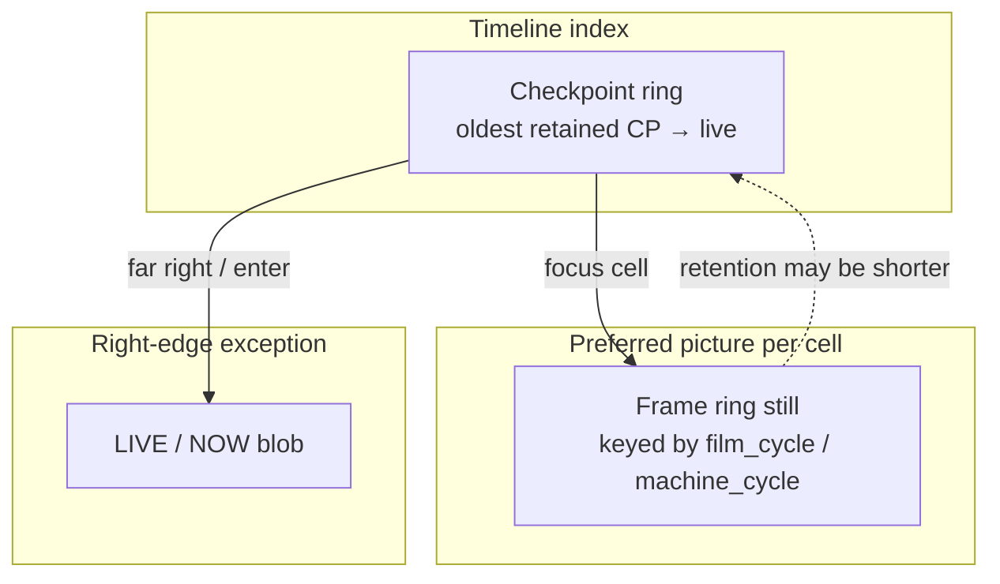
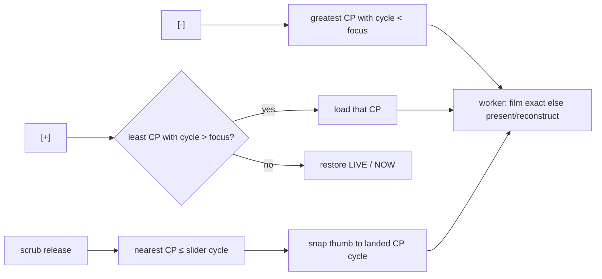

# Inspector frame-synced Record lattice

| Field | Value |
|-------|-------|
| **Author** | swessels |
| **Date** | 2026-08-25 |
| **Status** | Landed |
| **Canonical path** | [`design/inspector-frame-synced-record.md`](inspector-frame-synced-record.md) |

---

## Overview

Inspector Record today takes checkpoints on a free-running `cycles_per_frame`
cadence from `runtime_inspector_after_step`, while film is stuffed only when
VIC actually publishes a completed frame. Those clocks are the same order of
magnitude but **phase-drifted**: a checkpoint is not born with its film cell,
and `[-]` / `[+]` hunt the previous `frame_complete` by sealed replay instead
of walking Record cells. Mid-frame lands after ± paint badly (black, truncated
printf, broken effect frames) because C64 display is raster-is-king.

This design aligns checkpoint birth with the frame-publish path: **push film →
finish to an instruction boundary → take a checkpoint**. Scrub release and
`[-]` / `[+]` walk **prev/next checkpoint** (strict adjacency). Film is the
preferred still for a cell; scrub without a still is **full pink** (no
reconstruct while dragging); after a committed land / ± with no still,
**reconstruct** from the landed machine with no pink watermark. LIVE / NOW
stays the right-edge exception.

When implementation lands, fold durable invariants into
`agents/runtime-control.md` (and `frontend-debugger.md` / `manual/manual.md` if
user-facing). PR3 must at least mark the stale `[+]` sealed-forward agents
line; PR4 completes the CRT rewrite.

---

## Background & Motivation

### Current state

| Layer | Role today |
|-------|------------|
| `runtime_inspector_after_step` | After every worker step (when recording), if `cycle - last_checkpoint_cycle >= cadence_cycles`, call `runtime_inspector_checkpoint_take`. |
| `cadence_cycles` | Set from `c64_config_cycles_per_frame` (PAL ~19656) at recorder create / enable. Approximate frame period, not VIC `frame_complete`. |
| `runtime_publish_completed_frame` | On `c64_consume_frame_complete`: copy completed paint, **`runtime_frame_ring_push`**, then publish to UI. Sealed Inspect skips ring push. |
| `runtime_turbo_display_mode` | True for `RUNTIME_SPEED_MODE_FAST` or turbo `>= RUNTIME_TURBO_MODE_WARP` only. **MAX** free-run still paints and takes the normal ring-push path. |
| `c64_snapshot_save` | Refuses `micro_active` / `pending_cpu_trace_active` (`c64_snapshot.c`). Frame ends often land mid-instruction. |
| `runtime_finish_to_instruction_boundary` | Raw `c64_step_cycle` until `!micro_active && !pending_cpu_trace_active` — no nested publish / no `after_step`. |
| `runtime_finish_pending_state_snapshot_instruction` | Save-state helper: uses `runtime_step_cycle` (→ `after_step`) and may re-enter `runtime_publish_completed_frame` on nested `frame_complete`. **Not** the birth-path finish helper. |
| `FRONTEND_DEBUGGER_INTENT_INSPECTOR_FRAME_STEP` | UI `[-]` / `[+]` → `runtime_client_inspector_frame_step` → `runtime_inspector_frame_step`: sealed hunt for next/prev `frame_complete`, not CP walk. |
| Scrub | Thumb-down: `runtime_client_copy_frame_at` (nearest ≤ cycle) or pink; release → quantized `INSPECTOR_LAND` (nearest CP ≤). UI cannot see CP `film_cycle` today. |
| Land CRT | Past quantized land (`cycle < live`) calls `runtime_inspector_publish_head_dump` (geometric debug frame). Live land / `publish_head` uses `runtime_publish_presented_frame`. Neither tries exact film-ring blit first. |
| CRT product rule | `agents/runtime-control.md`: missing stills are **pink, never invented**; also “Forward = sealed execute … `[+]` …” — both need rewrite as this lands. |

### Pain points

1. **Phase drift.** Cadence≈frame is "good enough" for retention density but not
   for aligning Record cells with stuffed film. CP cycle and film
   `machine_cycle` are not born together.
2. **Wrong ± semantics.** `runtime_inspector_frame_step` reconstructs by
   replaying to a VIC boundary. That is expensive, can leave focus mid-frame
   relative to CP lattice, and is not "walk one Record cell."
3. **Dishonest / ugly CRT.** Mid-frame live paints after ± look wrong. Nearest
   film lookup can show a **neighbour** still while the focus cycle claims
   otherwise. Pink-everywhere after land obscures a frame the user already
   stepped to. Past land publishes a dump, not film-first.
4. **Two clocks.** Free-running after_step CP clock vs frame_complete film
   clock forces mental maps and invites film→CP join tables.

### Why raster-is-king

C64 effects are beam-timed. A checkpoint (and CRT still) that does not sit on
the same lattice as completed frames makes scrubbing feel like a different
timeline from the film strip. Frame-synced CP + film-first display fixes the
common path; pink-on-scrub preserves honesty without hitching on drag.

---

## Goals & Non-Goals

### Goals

1. Birth every **normal** Record checkpoint on the **VIC frame publication
   path**, after film push and after reaching an instruction boundary.
2. Drop free-running `cycles_per_frame` cadence on `after_step` as the **normal
   Record clock** (see allow-list of remaining non-frame births below).
3. Make checkpoints the **timeline source of truth** for scrub / `[-]` / `[+]`.
   Film is the preferred picture for that cell; retention budgets may differ.
4. Keep LIVE / NOW as the right-edge exception (enter at live; leave restores
   NOW). Do not treat LIVE as another stuffed film cell.
5. CRT honesty: film blit when a still exists for the focus cell; **full pink**
   during scrub thumb-down with no film; **reconstruct** after committed land /
   ± with no film (no pink watermark); never label a neighbour's still as this
   cycle.
6. Leave exact-cycle land / F10-family / breakpoint sealed re-execute alone for
   mid-frame work; they are not everyday scrub/± walking.
7. Expose a **client-callable scrub join** so UI can blit a cell’s preferred
   still without reading worker-private CP blobs directly.

### Non-Goals / rejected / deferred

| Item | Disposition |
|------|-------------|
| Teach `c64_snapshot_save` to save mid-instruction (option B) | **Rejected.** Boundary finish stays required. |
| Walk film ring entries as the master timeline | **Rejected.** CP can outlive film; film is picture, not index. |
| Explicit film→CP map tables | **Unnecessary** if CP is always taken in the frame-complete publish path immediately after film push (1:1 birth). A `film_cycle` field on the CP slot (and a compact shared index of `(cycle, film_cycle)` for UI join) is fine; a separate join table product is not. |
| Live land-while-scrub-drag reconstruct | **Deferred.** Scrub stays cheap (film or pink only). |
| Arm/stop HST1 from Inspector Record | Unchanged: Record does **not** arm or stop HST1. |
| Promote / Branch | Still out (`known-gaps.md`). |

---

## Proposed Design

### Record lattice (birth)

On the same path that publishes/stuffs a completed frame
(`runtime_publish_completed_frame` in `runtime_thread.c`), when Inspector
recording is active and **not** sealed-inspecting:

```text
1. Push film into the frame ring          (as today, when not turbo-display)
2. Finish to an instruction boundary      (snapshots refuse micro_active)
3. Take an Inspector checkpoint           (with film_cycle from step 1, or 0)
```

```mermaid
sequenceDiagram
    participant VIC as VIC / c64_consume_frame_complete
    participant Pub as runtime_publish_completed_frame
    participant Ring as runtime_frame_ring
    participant Rec as runtime_inspector_recorder

    VIC->>Pub: frame_complete
    alt inspecting (sealed)
        Pub-->>Pub: return (no ring, no CP)
    else turbo display mode (warp / FAST)
        Pub-->>Pub: geometric UI only; ring stalls
        Note over Pub,Rec: Still take CP after boundary if recording<br/>(lattice advances; film_cycle = 0)
    else normal (includes MAX free-run when recording)
        Pub->>Ring: push completed indexed8 (machine_cycle = frame end)
        Pub->>Pub: runtime_finish_to_instruction_boundary
        Pub->>Rec: checkpoint_take at boundary cycle + film_cycle
    end
```

**Boundary rule.** Mandate
`runtime_finish_to_instruction_boundary` (raw `c64_step_cycle`, no
`runtime_step_cycle`, no nested `runtime_publish_completed_frame`, no
`after_step`). Do **not** call
`runtime_finish_pending_state_snapshot_instruction` on this path — that
save-state helper re-enters publish and would recurse into CP birth.
`c64_snapshot_save` stays strict. A few cycles may elapse between film
`machine_cycle` and CP `cycle`; that is expected and is why the cell stores
`film_cycle` separately.

**Drop cadence take.** `runtime_inspector_after_step` must stop taking
checkpoints on `cadence_cycles`. Prefer deleting the cadence gate entirely
from the take path. `runtime_inspector_cadence_cycles` may remain as a
reporting helper equal to `c64_config_cycles_per_frame` for UI/tests that want
an approximate frame length, or be retired once callers stop depending on it
as a Record clock.

**Non-frame births (allow-list).** Cadence is gone; these intentional
non-`frame_complete` takes **remain**:

| Site | Behavior |
|------|----------|
| Record enable (`runtime_inspector_recorder_set_enabled`) | Immediate startup CP so Inspect is never empty after arming. `film_cycle = 0`. |
| Enter Inspect (`runtime_inspector_enter`) | Keep today’s enter-time take as a **LIVE-adjacent** cell with `film_cycle = 0` (anchors NOW; not a stuffed frame). Do not invent film for it. |
| Media truncate empty refill (`runtime_inspector_on_media_event`) | If truncate left `count == 0` while still recording, take one refill CP (`film_cycle = 0`). |
| History invalidate refill (`runtime_inspector_on_history_invalidate`) | Same: one refill CP while recording (`film_cycle = 0`). |

All other CP births are frame-synced only.

**Warp / FAST (turbo display mode) — not “max”.**
`runtime_turbo_display_mode()` is true only for `RUNTIME_SPEED_MODE_FAST` or
turbo `>= RUNTIME_TURBO_MODE_WARP`. Those paths call
`runtime_publish_completed_frame_turbo` and **do not** stuff real film.
**MAX** (`RUNTIME_TURBO_MODE_MAX`) free-runs with full live paint and still
takes the normal ring-push path when Record is on.

Default `inspector_off_on_max` usually means recording is already wiped/off
on max/warp; CP-without-film matters when wipe is disabled or during FAST
with Record on. When recording through a turbo-display frame_complete: still
boundary-finish + CP with `film_cycle = 0` so the lattice advances; CRT rules
then hit “no film” (pink while scrubbing, reconstruct after land).
`inspector_off_on_max` wipe/restore behavior is otherwise unchanged.

**Sealed Inspect.** No film push, no new CP birth during sealed re-execute
(existing D16).

### Timeline source of truth



- Scrubber continuum is still oldest→live in `machine_cycle` space for the
  slider, but **release** and **±** commit to a **checkpoint cell** (or LIVE).
- Do not index everyday walking by film ring slots.
- Join film to a cell by birth (1:1 publish path) plus the compact shared
  `(cycle, film_cycle)` index for UI — not a product-level map table.

**Preferred still key.** At frame-synced CP birth, record `film_cycle` = the
`publish_frame.machine_cycle` just pushed (0 if ring push did not happen).
Lookup for that cell uses **exact** ring match on `film_cycle`. If the still
was dropped by film retention, treat as missing — do not fall back to nearest
neighbour.

### Scrub cell-film join (client API)

Checkpoint slots live on the worker; scrub UI today only sees the shared frame
ring. Exact match on the raw slider `preview_cycle` will almost always miss
(film is at frame-end; the thumb is continuous). Required algorithm:

```text
1. Quantize preview_cycle → Record cell = nearest CP with cycle ≤ preview
   (same quantization as scrub release / land).
2. Read that cell’s film_cycle (0 ⇒ miss).
3. Exact frame-ring copy at film_cycle → blit; else full pink.
```

Expose a client-callable helper (name illustrative):

```c
/* Shared CP index is mutex-safe like the frame ring: (cycle, film_cycle) only,
   not full snapshot blobs. Returns false → caller shows full pink. */
bool runtime_client_copy_inspector_cell_film(
    runtime_client *client,
    uint64_t preview_cycle,
    c64_frame *out_frame);
```

**Mandate (PR2): shared mutex-safe index.** Maintain a compact shared index of
`(cycle, film_cycle)` updated on CP birth/drop/truncate/wipe, readable from
main like `frame_ring`. `runtime_client_copy_inspector_cell_film` is a **local
read** (quantize on the index + exact ring copy) — not a per-motion worker
RPC. Scrub drag today is a UI-thread ring read; hitching an RPC on thumb
motion contradicts the cheap-scrub Non-Goal and Observability budget.

Do **not** implement Inspector thumb-down via a worker/RPC quantize path.
Focus/window events that publish `film_cycle` for the *committed* focus are
fine as extras, but they cannot answer arbitrary preview cycles before land
and are not a substitute for the shared index. An RPC join helper, if any,
is limited to tests/control forensics — never the Inspect scrub path.

**Index lifetime.** The index mirrors **retained CP slots** for the Inspect
window: stop-recording on enter (`runtime_inspector_recorder_set_enabled`
false after the enter-time take) does **not** clear it. Scrub/± during
Inspect still quantize→`film_cycle` against that retained window. Clear the
index only with the tape — media truncate, history invalidate, leave-max /
`inspector_off_on_max` wipe, recorder destroy — not merely when
`recording == false`.

PR1’s exact ring helper alone does **not** close this join. Tests must prove
nearest-≤ neighbour film is **not** submitted when the cell’s `film_cycle`
still is retained but `preview_cycle` sits off that key, and that after
**enter Inspect** (recording off) scrub join still resolves frame-synced
cells’ `film_cycle`.

### `[-]` / `[+]` / scrub

| Control | Today | After |
|---------|-------|-------|
| `[-]` | `INSPECTOR_FRAME_STEP` VIC hunt | Load **greatest CP with `cycle < focus_cycle`**. No-op at oldest. |
| `[+]` | VIC hunt / sealed forward | Load **least CP with `cycle > focus_cycle`**; if none, restore LIVE / NOW. |
| Scrub release | `INSPECTOR_LAND` nearest CP ≤ | Same quantization. **Snap** the slider thumb to the landed CP cycle after release (v1 default). |
| Scrub drag | Film nearest ≤ or pink | Cell-film join (quantize → exact `film_cycle`) or **full pink**; never reconstruct; never neighbour. |
| Exact land / F10 / BP | Sealed re-execute | Unchanged; not the everyday ± path. If focus sits **between** CPs after those tools, ± still uses the strict `<` / `>` lattice rules above — do **not** resume VIC `frame_complete` hunt. |

Replace everyday use of `runtime_inspector_frame_step` for those buttons.

```c
/* Walk Record lattice. direction < 0: greatest CP with cycle < focus;
   direction > 0: least CP with cycle > focus, else LIVE/NOW.
   Loads the target checkpoint into the live c64_t (quantized). Does not
   sealed-hunt frame_complete. */
bool runtime_inspector_checkpoint_step(runtime *rt, int direction);
```

Wire options:

1. **Repurpose** `RUNTIME_COMMAND_INSPECTOR_FRAME_STEP` / client / intent to call
   `checkpoint_step` (smallest UI churn; rename in a follow-up), or
2. **Add** `INSPECTOR_CHECKPOINT_STEP` and switch frontend intents; delete or
   stop exporting frame_step once tests move.

Prefer (1) or (2) with clear naming in headers/comments so "frame_step" does
not keep meaning "VIC boundary hunt." Update
`tests/runtime/test_runtime_inspector_mode.c` expectations: ± moves between
adjacent CP cycles (strict `<` / `>`), not "about a cadence/4 frame hunt."



Delete or stop using the current "find previous frame_complete via replay"
behavior for scrub/± once CP-walk exists. Keep sealed re-execute helpers for
`land_to_cycle` / F10-family / breakpoints.

**Slider snap (v1 default).** After scrub release and after ± land, set
`inspector_slider` from the committed `inspector_focus_cycle` (landed CP or
live). Do not leave the thumb on a raw between-cell release position.

### CRT / honesty

Pinned display policy (revises today's blanket "pink, never invented" for
**committed** focus):

| Situation | CRT |
|-----------|-----|
| Scrub thumb-down, cell-film join hits | Blit that still |
| Scrub thumb-down, no film | **Full pink** (machine not landed; pink = no still). Do **not** reconstruct during drag |
| After quantized land / `[-]` / `[+]`, focus cycle equals that cell’s CP `cycle`, and `film_cycle` exact hit | Blit film |
| After `land_to_cycle` (or other mid-frame focus) where focus is **strictly between** CP cells | **Reconstruct only** — do not blit the nearest CP’s still (neighbour ban) |
| After land / `[-]` / `[+]`, no usable film for the committed focus | **Reconstruct** from landed machine. **No** pink corner watermark |
| Any path | **Never** show a neighbour cycle's still labeled as this cycle |

**Neighbour ban.** Today's scrub path uses `runtime_client_copy_frame_at` →
`runtime_frame_ring_copy_by_cycle` (**nearest ≤**). That violates the neighbour
rule when focus/preview is not on a stuffed cycle. Inspector preview and
committed film blit must use the **cell-film join** (exact on `film_cycle`).
Nearest-≤ may remain for other control-port forensics uses if documented;
Inspector UI must not use it for labeled focus.

**Committed land / ± publish path (worker).** Today past quantized land uses
`runtime_inspector_publish_head_dump` (geometric debug), while
`runtime_inspector_publish_head` always calls `runtime_publish_presented_frame`
and never tries the ring. Replace that ordering for everyday land / ±
completion:

```text
1. If landed cell has film_cycle != 0 and exact ring copy succeeds
      → publish that frame (film blit).
2. Else → runtime_publish_presented_frame (paint copy or
      c64_make_current_frame_snapshot reconstruct).
3. Never pink overlay when thumb is up / focus is committed.
4. publish_head_dump is not the primary past-land path anymore.
   Keep dump only as a last resort if both film and present/reconstruct fail
   (should be rare; log/count).
```

Apply the same film-first helper from `INSPECTOR_LAND` (when `cycle < live`),
`INSPECTOR_FRAME_STEP` / checkpoint-step, and other committed Inspect focus
updates that currently call only `publish_head` / `publish_head_dump`.
`land_to_cycle` mid-frame focus may have `film_cycle` from the nearest CP ≤
target — prefer that cell’s film only when focus was quantized onto that CP;
if focus is strictly between cells after exact land, skip film (avoid
neighbour) and reconstruct via `publish_presented_frame`.

**LIVE.** Far-right / enter-Inspect-at-live continues to show the live/NOW
presentation path; it is not "missing film ⇒ pink."

### Implementation sketch (worker)

In `runtime_publish_completed_frame` after a successful ring push (and on the
turbo-display branch when recording, with `film_cycle = 0`):

```c
/* Pseudocode — merge carefully with inspecting / turbo early returns. */
uint64_t film_cycle = 0;
if (!runtime_turbo_display_mode(rt)) {
    (void)runtime_frame_ring_push(&rt->frame_ring, &rt->publish_frame);
    film_cycle = rt->publish_frame.machine_cycle;
}

if (runtime_inspector_recorder_is_recording(rt) && !rt->inspecting) {
    /* Non-reentrant: do NOT use runtime_finish_pending_state_snapshot_instruction. */
    runtime_finish_to_instruction_boundary(rt);
    (void)runtime_inspector_checkpoint_take_for_frame(rt, film_cycle);
    /* also update shared (cycle, film_cycle) scrub index */
}
```

Because boundary finish uses raw `c64_step_cycle` only, nested
`frame_complete` publish cannot re-enter mid-finish. Still add a test:
**single CP per outer publish**.

`runtime_inspector_after_step`: remove cadence take (idle regarding CP birth).

Checkpoint struct addition (illustrative):

```c
typedef struct runtime_inspector_checkpoint {
    uint64_t cycle;       /* snapshot boundary cycle */
    uint64_t film_cycle;  /* preferred still; 0 = none at birth */
    size_t size;
    uint8_t *blob;
} runtime_inspector_checkpoint;
```

### Frontend / main loop

- `frontend.c`: `[-]` / `[+]` keep pushing a step intent; semantics become CP
  walk on the worker. After land/± focus updates, **snap** slider to focus.
- Scrub drag in `main.c`: call `runtime_client_copy_inspector_cell_film` (or
  equivalent); on miss `frontend_inspector_set_preview_film(ui, false)` →
  existing full-pink paths. Do **not** call nearest-≤ `copy_frame_at` for
  Inspector preview.
- After land / ±: worker already published film-first or reconstruct; UI must
  not force pink overlay on committed focus (`thumb_down == false`).
- Hint string under slider: update from "stills where we have them, pink where
  we do not" to reflect scrub-pink vs landed-reconstruct.

### Tests

| Area | Expectation |
|------|-------------|
| Birth | With Record on, each `frame_complete` publish yields one new CP; `film_cycle` matches pushed frame when ring recording. |
| No cadence | Many `after_step` cycles without `frame_complete` do not mint CPs. |
| Allow-list | Enable / enter / media-empty / invalidate refill still take non-frame CPs with `film_cycle = 0`. |
| Boundary | CP take uses non-reentrant finish; succeeds only at instruction boundary; film may be a few cycles earlier. |
| ± | `checkpoint_step(-1)` → greatest CP `< focus`; `+1` → least CP `> focus` or LIVE; between-cell focus still lattice-walks. |
| Scrub join | Off-key preview with retained neighbour still → pink / false; does not submit neighbour. After enter (recording off), join still resolves retained frame-synced `film_cycle`s. |
| Landed CRT | Past land: film exact if present; else present/reconstruct; not `publish_head_dump` as primary. |
| LIVE | Step past newest CP / land at live restores NOW behavior. |
| Sealed | Inspect re-execute still does not push film or birth CPs. |
| MAX vs warp | MAX + Record still can push film; warp/FAST stall film and birth CP with `film_cycle = 0` when recording. |

Primary files: `tests/runtime/test_runtime_inspector_mode.c`,
`test_runtime_inspector_replay.c`, `test_runtime_frame_ring` (exact copy +
cell-film join), frontend preview coverage if present.

### Agent / manual follow-on (when landing)

- **PR3 (required stub):** In `agents/runtime-control.md`, replace or mark
  stale the line that groups `[+]` with sealed forward execute
  (“Forward = sealed execute toward live (F10-family, `[+]`, F12)”). State
  `[+]` / `[-]` = checkpoint walk; F10-family / F12 remain sealed. Add a
  one-line “CRT pink policy unfinished until PR4” if CRT text is not updated
  yet — reviewers must not “fix” the old `[+]` rule against PR3.
- **PR4 (complete):** Fold Record clock, CP timeline, CRT
  (pink-scrub vs reconstruct-landed), and film-first land publish into
  `agents/runtime-control.md` and `agents/frontend-debugger.md`;
  `manual/manual.md` if user-visible copy changes.

---

## API / Interface Changes

### Runtime

| Symbol | Change |
|--------|--------|
| `runtime_inspector_after_step` | Stop cadence-based `checkpoint_take`. |
| `runtime_publish_completed_frame` | After film push / turbo-display frame (when recording): `runtime_finish_to_instruction_boundary` + CP take with `film_cycle`. |
| `runtime_inspector_checkpoint` slot | Add `film_cycle` (or equivalent). |
| Shared scrub index / `runtime_client_copy_inspector_cell_film` | Local quantize → exact film copy (no scrub RPC). Index mirrors retained slots after enter; clear with tape only. |
| `runtime_inspector_frame_step` | Replace everyday semantics with strict CP walk, or add `runtime_inspector_checkpoint_step` and switch callers. |
| `runtime_inspector_cadence_cycles` | Demote to approx frame length reporter or remove from Record-clock tests. |
| Frame ring copy | Exact-by-cycle helper for Inspector; nearest-≤ must not leak into UI. |
| `runtime_inspector_publish_head` / `_dump` | Land/± completion: film-first exact blit, else `runtime_publish_presented_frame`; dump last resort only. |

### Frontend / commands

| Symbol | Change |
|--------|--------|
| `FRONTEND_DEBUGGER_INTENT_INSPECTOR_FRAME_STEP` | Semantics → CP step (rename optional). |
| `RUNTIME_COMMAND_INSPECTOR_FRAME_STEP` | Same. |
| Scrub preview in `main.c` | Cell-film join only. |
| Slider after land/± | Snap to committed focus cycle. |
| Committed CRT | Worker film-first else reconstruct; no pink watermark on landed focus. |

### Control port

No new wire verbs required for v1 if UI owns scrub/±. If control exposes
frame-step, document CP-walk semantics or add an explicit checkpoint-step
command; do not silently keep VIC-hunt behavior under the old name without a
note in `control-port.md`.

---

## Data Model Changes

- Checkpoint slot gains `film_cycle` (uint64, 0 = none). In-memory only; no
  disk schema (Inspector tape is not a save-state file).
- Compact shared `(cycle, film_cycle)` index for scrub join (not full blobs;
  not a product “map table”). Mirrors retained CP slots while Inspecting even
  after recording stops on enter; cleared only with tape wipe/truncate/
  invalidate/destroy.
- Frame ring format unchanged; exact-copy API added.
- Retention: film budget (`RUNTIME_FRAME_RING_*`) and Inspector memory
  (`inspector_memory_mb`) remain independent. CP outliving film is allowed;
  CRT falls back to reconstruct when committed.

Migration: none. Enabling Record after upgrade starts a new lattice on the
frame path; old in-memory rings are not persisted across process lifetime.

---

## Alternatives Considered

### A. Keep cadence CP + film→CP join map

Keep `after_step` cadence; build an explicit map from film `machine_cycle` to
nearest CP.

- **Pros:** Smaller change to birth path.
- **Cons:** Two clocks forever; map complexity; still phase-drifted; ± either
  stays VIC-hunt or walks CPs that are not film-aligned. **Rejected** by
  agreed design.

### B. Mid-instruction snapshots

Allow `c64_snapshot_save` while `micro_active` so CP can be taken at exact
`frame_complete` without boundary finish.

- **Pros:** CP cycle == film cycle exactly.
- **Cons:** Large snapshot/CPU format risk; rejected explicitly. Boundary
  finish is the chosen rule.

### C. Film ring as master timeline

`[-]` / `[+]` / scrub walk stuffed frames; land by reconstructing to film
cycle.

- **Pros:** Picture and index identical when film exists.
- **Cons:** Film retention shorter / warp/FAST stalls / CP can outlive film;
  walking picture loses state when stills drop. **Rejected.**

### D. (Chosen) Frame-synced CP birth + CP walk + film-first CRT

- **Pros:** One Record lattice; 1:1 birth with film; cheap scrub; honest pink;
  reconstruct only when committed.
- **Cons:** CP cycle slightly after film cycle; needs `film_cycle` on slot,
  shared scrub join, and exact still lookup.

---

## Security & Privacy Considerations

No new network surface. Inspector blobs remain in-process. Scrub preview
reads the shared frame ring / compact CP index under mutex on the UI thread
(local join — not a worker RPC; not full snapshot blobs). Sealed re-execute
must continue to suppress host media write-through and ring push (unchanged).
No PII concerns beyond existing local emulator state.

---

## Observability

- Existing window info (`checkpoint_count`, `checkpoints_dropped`,
  `media_truncations`) remains the primary Inspector telemetry.
- Consider debug-only counters (optional, not blocking):
  `inspector_cp_born_on_frame`, `inspector_cp_take_fail_boundary`,
  `inspector_film_exact_miss_scrub`, `inspector_reconstruct_after_land`,
  `inspector_land_film_hit`.
- Failures to take CP after frame publish should be visible in tests; publish
  path should not spam `runtime_publish_error` on transient snapshot refusal
  if boundary finish failed — log/count and continue running.

Latency: boundary finish is O(instruction residual) cycles (≪ frame);
checkpoint take cost unchanged (snapshot ~ tens of KB..MB depending on
config). Scrub drag stays O(index + ring lookup) on the UI thread (shared
index, no per-motion RPC) with no reconstruct hitch.

---

## Rollout Plan

1. Land worker birth path + disable cadence take behind the same Record enable
   (no feature flag required; behavior change is the feature).
2. Land CP-walk for ± and scrub cell-film join; update tests in the same PRs.
3. Land CRT film-first + reconstruct-on-committed-miss; revise agent docs.
4. Rollback: revert the PR stack; no on-disk migration. If a partial stack
   ships (birth without ±), ± may look "skippy" relative to denser old cadence
   until CP-walk lands — prefer birth + walk close together.

---

## Risks

| Risk | Severity | Mitigation |
|------|----------|------------|
| Boundary finish re-enters publish | Med | **Mandate** non-reentrant `runtime_finish_to_instruction_boundary`; single-CP-per-publish test |
| Sparser CPs than cadence-approx if frames stall | Low | Lattice follows real frames; warp/FAST still births CP without film when recording |
| Exact film miss rate after retention mismatch | Med | Reconstruct after land; pink only while scrubbing; independent budgets documented |
| Scrub join races / stale index | Med | Update index on birth/drop/truncate/wipe under same mutex rules as frame ring; keep readable after enter disarms recording; test neighbour miss + post-enter join |
| Tests couple to `cadence_cycles` as Record clock | Med | Rewrite frame_step tests to strict CP adjacency |
| Renaming FRAME_STEP confuses control clients | Low | Document semantic change; optional new command name |
| PR3 ships while agents still say sealed `[+]` | Low | PR3 must stub/fix that agents line |

---

## Open Questions

None blocking. Agreed decisions above are closed; implementers should not
re-litigate mid-instruction snapshots, film-as-index, map tables, or
scrub-drag reconstruct.

---

## Key Decisions

1. **Checkpoint birth = VIC frame publication + instruction boundary.**
   Same path as film stuff (`runtime_publish_completed_frame`); not
   `after_step` cadence. Rationale: one lattice shared with stuffed film;
   snapshots already refuse `micro_active`.

2. **Drop free-running `cycles_per_frame` as the normal Record clock.**
   Non-frame allow-list remains: enable startup, enter Inspect
   (LIVE-adjacent, `film_cycle=0`), media-empty refill, history-invalidate
   refill. Rationale: cadence≈frame still phase-drifts from `frame_complete`.

3. **Checkpoints are the timeline source of truth; film is the preferred
   picture.** Retention budgets may differ; film ring is never the sole index.
   Rationale: CP holds state; film can be dropped.

4. **No product film→CP map table; 1:1 birth + `film_cycle` + compact shared
   `(cycle, film_cycle)` index for UI join is enough.** Scrub preview **must**
   use that local shared-index read — not a per-motion worker RPC.
   Rationale: birth ordering makes join trivial; drag stays O(index+ring).

5. **`[-]` / `[+]` / scrub release walk Record cells, not VIC hunt.**
   `[-]` = greatest CP with `cycle < focus`; `[+]` = least CP with
   `cycle > focus`, else LIVE/NOW. Between-cell focus after exact/F10 tools
   still uses that lattice. Rationale: everyday walking matches the lattice;
   mid-frame tools stay on sealed re-execute.

6. **LIVE / NOW remains the right-edge exception.** Not a stuffed film cell.
   Rationale: enter/leave semantics already depend on NOW blob.

7. **CRT: cell-film exact when present; full pink only for scrub miss;
   reconstruct after committed land/± miss; never neighbour stills.** Worker
   land/± publish is film-first then `runtime_publish_presented_frame`;
   `publish_head_dump` is last resort only. Rationale: scrub honesty without
   hitch; landed user already knows they stepped.

8. **Boundary finish on birth path = non-reentrant
   `runtime_finish_to_instruction_boundary` only.** Do not copy the save-state
   finish helper. Rationale: avoid nested publish / cadence revival.

9. **Turbo-display film stall = warp / FAST only; MAX still paints/stuffs
   film when Record is on.** Rationale: match `runtime_turbo_display_mode`.

10. **Scrub slider snaps to landed CP cycle after release / ± (v1).**
    Rationale: thumb honesty with the Record lattice.

11. **Do not teach mid-instruction snapshot save; do not land-while-scrub-drag
    reconstruct.** Rationale: rejected/deferred scope.

12. **Docs:** PR3 stubs agents `[+]` wording; PR4 completes CRT / Record-clock
    fold-in to `agents/runtime-control.md` (+ frontend-debugger / manual).

---

## References

- `agents/runtime-control.md` — Inspector / film / sealed / pink rules (as-is;
  stale `[+]` / pink lines called out above)
- `agents/frontend-debugger.md` — Inspector tab scrub / ± UI
- `agents/README.md` — handoff rules; design/ vs agents/
- `design/README.md` — design index conventions
- `src/runtime/runtime_inspector.c` — `after_step`, `checkpoint_take`, `frame_step`, land, enter take
- `src/runtime/runtime_thread.c` — `runtime_publish_completed_frame`,
  `runtime_turbo_display_mode`, `publish_head` / `publish_head_dump`,
  `runtime_finish_to_instruction_boundary`
- `src/runtime/runtime_frame_ring.c` — push / nearest copy
- `src/machine/c64_snapshot.c` — refuses `micro_active`
- `src/frontend/frontend.c` — scrub / ± intents, pink placeholder
- `src/main.c` — scrub film preview via `runtime_client_copy_frame_at`
- `tests/runtime/test_runtime_inspector_mode.c` — frame_step coverage to rewrite

---

## PR Plan

Incremental, each PR independently reviewable and mergeable. Prefer landing
on `main` with tests green per PR. Update this design checklist and
`design/README.md` when status changes.

### PR 1 — Exact film lookup helper

- **Title:** Inspector film: exact cycle copy for honest stills
- **Files/components:** `src/runtime/runtime_frame_ring.{c,h}`,
  `runtime_client_copy_frame_at` (exact mode or new API),
  `tests/runtime/test_runtime_frame_ring*`
- **Dependencies:** none
- **Changes:** Add exact-by-cycle copy (fail if no entry with that
  `machine_cycle`). Keep nearest-≤ for non-Inspector callers if still needed.
  No UI behavior change yet — scrub honesty needs the cell join in PR2/PR4.

### PR 2 — Frame-synced checkpoint birth + scrub join index

- **Title:** Record lattice: birth CP on frame publish + boundary; expose cell film join
- **Files/components:** `runtime_thread.c` (`runtime_publish_completed_frame`),
  `runtime_inspector.c` / `.h` (slot `film_cycle`, take-for-frame,
  non-frame allow-list sites set `film_cycle=0`), disable cadence take,
  shared `(cycle, film_cycle)` index + local
  `runtime_client_copy_inspector_cell_film` (no scrub RPC), tests for birth
  pairing + neighbour-miss + post-enter join
- **Dependencies:** PR 1 (exact ring copy used by the join)
- **Changes:** After film push when recording: non-reentrant boundary finish +
  CP with `film_cycle`. Turbo-display (warp/FAST): CP with `film_cycle=0`.
  MAX still uses normal push when recording. Preserve allow-list non-frame
  takes. Scrub join: shared-index local read (quantize ≤ → exact
  `film_cycle`); index survives enter disarm; clear only with tape.

### PR 3 — Checkpoint walk for `[-]` / `[+]`

- **Title:** Inspector ± walk checkpoints (replace frame_complete hunt)
- **Files/components:** `runtime_inspector.c` (`checkpoint_step` or repurposed
  `frame_step`), `runtime_thread.c` command dispatch + film-first publish
  helper hook for ± completion, client/command headers as needed,
  `test_runtime_inspector_mode.c` (strict `<` / `>` adjacency),
  **`agents/runtime-control.md` stub** for `[+]` / `[-]` = CP walk (mark CRT
  pink rewrite “until PR4” if needed), brief `frontend.c` comment if intent
  name retained
- **Dependencies:** PR 2 (lattice must be frame-synced for ± to match film)
- **Changes:** Strict prev/next CP load; `[+]` past newest → LIVE/NOW;
  between-cell focus still lattice-walks. Stop VIC hunt for these buttons.
  Leave `land_to_cycle` / F10-family / breakpoints on sealed re-execute.
  Do not leave agents describing sealed-forward `[+]`.

### PR 4 — Scrub pink honesty + committed film-first / reconstruct CRT

- **Title:** Inspector CRT: cell-film scrub, scrub pink, landed film-first
- **Files/components:** `main.c` scrub preview via cell-film join,
  `frontend.c` hint/pink/snap-slider paths, land/± completion in
  `runtime_thread.c` (`publish_head` / `publish_head_dump` → film-first then
  `runtime_publish_presented_frame`), `agents/runtime-control.md`,
  `agents/frontend-debugger.md`, `manual/manual.md` if user-visible copy
  changes
- **Dependencies:** PR 1 (exact API), PR 2 (`film_cycle` **and** scrub cell
  join), PR 3 (committed focus is CP cells; agents ± stub already in)
- **Changes:** Scrub thumb-down: cell-film join or **full pink**; no
  reconstruct on drag; never neighbour. After land/±: worker film-first else
  reconstruct; no pink watermark; snap slider. Complete agents CRT /
  Record-clock fold-in; mark this design **landed** in `design/README.md`
  when the stack is done.

### PR 5 — Cleanup / naming (optional follow-up)

- **Title:** Rename FRAME_STEP → CHECKPOINT_STEP; retire cadence API litter
- **Files/components:** intent/command/client renames, dead
  `runtime_inspector_frame_step` VIC-hunt code removal, control-port doc if
  exposed, test renames
- **Dependencies:** PR 3–4
- **Changes:** Naming matches semantics; remove demoted `cadence_cycles`
  Record-clock callers. Skip if PR 3 already renamed cleanly.
